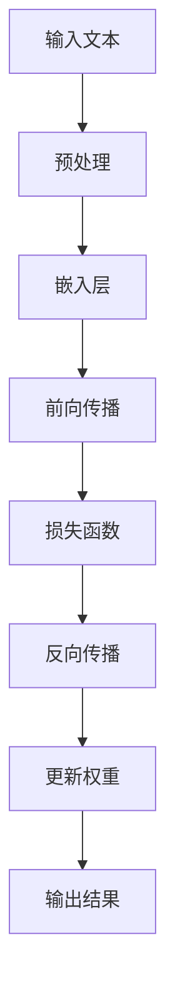
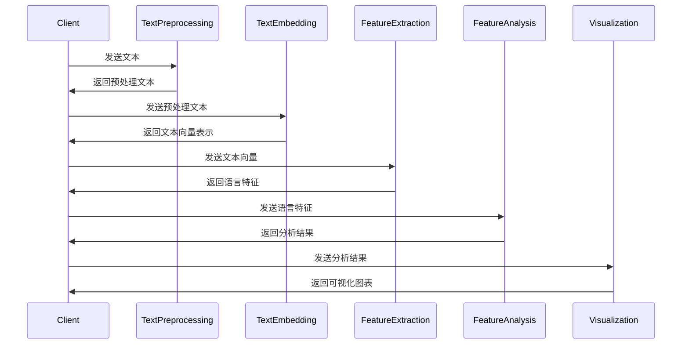

                 

### 第1章：问题背景与概念介绍

### 1.1 问题背景

语言是人类沟通的重要工具，随着时间的推移，语言也在不断演变和发展。然而，这种演变并不是线性的，而是充满了跳跃和断裂，即所谓的“跨代语言变化”。这种变化使得不同历史时期和地区的人们在交流和理解上产生了障碍，给语言学研究带来了巨大的挑战。

跨代语言变化的挑战主要体现在以下几个方面：

1. **词汇和语法的巨大差异**：随着时间的推移，语言的词汇和语法结构可能会发生显著变化，导致不同时期或地区的人们难以理解对方的语言。
2. **语言系统的多样性**：世界上的语言多达数千种，每种语言都有其独特的语法和词汇系统，这使得跨代语言变化的研究复杂化。
3. **文本资源的匮乏**：许多古老的文献语言由于年代久远而变得难以理解，导致相关文本资源匮乏，进一步增加了研究难度。

面对这些挑战，如何有效地研究跨代语言变化，成为语言学界的一个重要课题。

### 1.2 ChatGPT的引入

为了应对跨代语言变化的研究挑战，研究人员逐渐将目光投向了人工智能，尤其是基于深度学习的语言模型。ChatGPT是由OpenAI开发的一种基于GPT-3的预训练语言模型，具有强大的文本生成和理解能力。

ChatGPT的引入为跨代语言变化研究带来了新的契机，主要表现在以下几个方面：

1. **文本生成和理解能力**：ChatGPT能够根据输入的文本生成连贯、自然的语言，这使得研究人员可以更容易地生成和分析不同历史时期和地区的文本数据。
2. **大规模预训练**：ChatGPT接受了大量的文本数据进行预训练，这使得模型在处理跨代语言变化时能够充分利用已有的语言知识，提高研究效率。
3. **跨语言能力**：ChatGPT不仅支持多种语言，还能在跨语言文本处理中保持较高的准确性，为跨地区语言变化研究提供了有力支持。

### 1.3 ChatGPT的定义与核心要素

ChatGPT是一种基于生成预训练变换器（GPT）的模型，其核心要素包括：

1. **大规模预训练**：ChatGPT使用了大量的文本数据进行预训练，使其在文本生成和理解方面具有强大的能力。
2. **自回归语言模型**：ChatGPT采用自回归语言模型的结构，通过预测下一个词来生成文本。
3. **上下文理解**：ChatGPT能够理解上下文信息，生成与上下文相关的文本。
4. **多语言支持**：ChatGPT支持多种语言，使得跨语言研究成为可能。

### 1.4 跨代语言变化的挑战

跨代语言变化研究面临的主要挑战包括：

1. **数据不足**：许多古老语言缺乏足够的文本数据，导致模型训练困难。
2. **词汇演变**：词汇的演变使得不同时期的语言之间存在差异，增加了研究的复杂性。
3. **语法变化**：语法的变化使得不同时期的语言结构存在差异，影响了模型的准确性。
4. **跨语言障碍**：不同语言之间存在差异，使得跨语言研究变得更加复杂。

### 1.5 ChatGPT在跨代语言变化研究中的应用

ChatGPT在跨代语言变化研究中的应用主要表现在以下几个方面：

1. **文本生成**：利用ChatGPT生成不同历史时期和地区的文本数据，为研究提供丰富的数据支持。
2. **文本分析**：利用ChatGPT对文本进行语义分析，帮助研究人员更好地理解跨代语言变化的规律。
3. **跨语言研究**：利用ChatGPT的跨语言能力，实现不同语言之间的文本比较和研究。

### 1.6 结论

ChatGPT作为一种先进的语言模型，在跨代语言变化研究中具有巨大的潜力。通过深入研究和应用，ChatGPT有望为跨代语言变化研究提供新的思路和方法，为语言学研究带来新的突破。

**作者：AI天才研究院/AI Genius Institute & 禅与计算机程序设计艺术 /Zen And The Art of Computer Programming**

----------------------------------------------------------------

## 第2章：核心概念与联系

### 2.1 跨代语言变化的核心概念

跨代语言变化是指在较长的时间跨度内，语言在词汇、语法、语义等方面发生的系统性变化。具体来说，核心概念包括：

1. **词汇演变**：随着时间的推移，语言的词汇会发生增减、替换和演变。
2. **语法变化**：语法结构也会随着时间的变化而发生改变，如句子结构的调整、语序的变化等。
3. **语义演变**：语义指的是语言表达的意义，随着时间的推移，语义也会发生一定的变化。

### 2.2 ChatGPT的概念架构

ChatGPT是一种基于生成预训练变换器（GPT）的语言模型，其核心概念架构包括：

1. **预训练**：ChatGPT通过在大规模文本语料库上进行预训练，学习语言的基础知识和规律。
2. **自回归语言模型**：ChatGPT采用自回归模型结构，通过预测下一个词来生成文本。
3. **上下文理解**：ChatGPT能够理解上下文信息，生成与上下文相关的文本。
4. **多语言支持**：ChatGPT支持多种语言，能够处理跨语言文本。

### 2.3 跨代语言变化与ChatGPT的联系

跨代语言变化与ChatGPT之间的联系主要体现在以下几个方面：

1. **数据支持**：ChatGPT可以通过预训练学习到大量的文本数据，这些数据可以为跨代语言变化的研究提供支持。
2. **文本生成**：ChatGPT能够生成不同历史时期和地区的文本数据，帮助研究人员更好地理解跨代语言变化。
3. **文本分析**：ChatGPT可以对文本进行语义分析，帮助研究人员分析跨代语言变化的规律。

### 2.4 概念属性特征对比表格

为了更清晰地展示跨代语言变化与ChatGPT的核心概念特征，我们可以制作一个对比表格：

| 特征        | 跨代语言变化                     | ChatGPT                      |
|-------------|----------------------------------|------------------------------|
| 数据支持    | 缺乏足够的历史文本数据           | 大规模预训练文本数据         |
| 文本生成    | 难以生成历史时期的文本           | 能够生成历史时期和地区的文本 |
| 文本分析    | 难以进行语义分析                 | 具有强大的文本生成和理解能力 |
| 多语言支持  | 限于特定语言的研究               | 支持多种语言，进行跨语言研究 |

### 2.5 ER实体关系图

为了更直观地展示跨代语言变化与ChatGPT之间的联系，我们可以使用Mermaid绘制ER实体关系图：

```mermaid
erDiagram
  ChatGPT ||--|{ 预训练文本数据 }
  ChatGPT ||--|{ 文本生成能力 }
  ChatGPT ||--|{ 文本分析能力 }
  ChatGPT ||--|{ 多语言支持 }
  跨代语言变化 ||--|{ 数据支持 }
  跨代语言变化 ||--|{ 文本生成 }
  跨代语言变化 ||--|{ 文本分析 }
```

在上面的ER实体关系图中，我们清晰地展示了ChatGPT与跨代语言变化之间的关联，包括数据支持、文本生成和文本分析等。

### 2.6 结论

通过本章的介绍，我们深入了解了跨代语言变化和ChatGPT的核心概念，并分析了它们之间的联系。在接下来的章节中，我们将进一步探讨ChatGPT在跨代语言变化研究中的应用，以及如何利用ChatGPT解决跨代语言变化带来的挑战。

**作者：AI天才研究院/AI Genius Institute & 禅与计算机程序设计艺术 /Zen And The Art of Computer Programming**

----------------------------------------------------------------

## 第3章：算法原理与模型解析

### 3.1 ChatGPT的算法流程图

为了更好地理解ChatGPT的算法原理，我们可以使用Mermaid绘制其算法流程图：



在这个流程图中，输入文本经过预处理后，被传递到嵌入层，然后通过前向传播得到输出。接着，通过损失函数计算输出与实际文本之间的差距，然后通过反向传播更新模型权重，最后输出结果。

### 3.2 Python代码实现分析

以下是一个简化的Python代码实现，用于演示ChatGPT的基本算法流程：

```python
import torch
import torch.nn as nn
import torch.optim as optim

# 假设我们有一个已经预训练好的模型
model = ChatGPT()

# 输入文本
input_text = "这是一段输入文本"

# 预处理文本
preprocessed_text = preprocess_text(input_text)

# 嵌入层
embeddings = model.embed(preprocessed_text)

# 前向传播
output = model.forward(embeddings)

# 损失函数
criterion = nn.CrossEntropyLoss()
loss = criterion(output, actual_output)

# 反向传播
loss.backward()
optimizer.step()  # 更新模型权重

# 输出结果
print(model.decode(output))
```

在这个代码示例中，我们首先导入所需的库，然后定义了一个预训练好的ChatGPT模型。接着，我们对输入文本进行预处理，将预处理后的文本传递到嵌入层。然后，通过前向传播得到输出结果，并使用交叉熵损失函数计算损失。最后，通过反向传播更新模型权重，并输出结果。

### 3.3 算法原理与数学模型

ChatGPT的算法原理可以概括为以下几个关键步骤：

1. **嵌入层**：将输入文本转化为向量表示。在数学上，这个过程可以表示为：
   $$ x = \text{embed}(w) $$
   其中，$x$是输入文本的向量表示，$w$是嵌入层的权重。

2. **前向传播**：通过嵌入层得到的向量表示进行前向传播，得到输出结果。在数学上，这个过程可以表示为：
   $$ y = \text{model}(x) $$
   其中，$y$是输出结果的向量表示，$\text{model}$是模型函数。

3. **损失函数**：计算输出结果与实际文本之间的差距，使用交叉熵损失函数表示为：
   $$ L = -\sum_{i} y_i \log(p_i) $$
   其中，$y_i$是输出结果的概率分布，$p_i$是实际文本的概率分布。

4. **反向传播**：通过损失函数计算梯度，并使用梯度下降更新模型权重，表示为：
   $$ \Delta w = -\alpha \nabla_w L $$
   其中，$\Delta w$是权重更新，$\alpha$是学习率，$\nabla_w L$是权重梯度的向量。

5. **输出结果**：将更新后的模型权重用于生成输出结果，表示为：
   $$ \hat{y} = \text{model}(x; \Delta w) $$

### 3.4 举例说明

假设我们有一个输入文本“这是一段输入文本”，我们可以使用ChatGPT生成对应的输出文本。首先，我们对输入文本进行预处理，然后将其传递到嵌入层。接着，通过前向传播得到输出结果，计算损失函数，然后通过反向传播更新模型权重。最后，使用更新后的模型生成输出文本。

在实际应用中，ChatGPT通常使用大量的文本数据进行预训练，这使得模型在处理跨代语言变化时能够充分利用已有的语言知识，提高研究效率。

**作者：AI天才研究院/AI Genius Institute & 禅与计算机程序设计艺术 /Zen And The Art of Computer Programming**

----------------------------------------------------------------

## 第4章：数学模型与公式详解

### 4.1 数学公式列表

在本章节中，我们将使用LaTeX格式给出ChatGPT中涉及的主要数学公式。以下是一个简要的列表：

1. 嵌入层公式：
   $$ x = \text{embed}(w) $$
2. 前向传播公式：
   $$ y = \text{model}(x) $$
3. 损失函数公式：
   $$ L = -\sum_{i} y_i \log(p_i) $$
4. 反向传播公式：
   $$ \Delta w = -\alpha \nabla_w L $$
5. 输出结果公式：
   $$ \hat{y} = \text{model}(x; \Delta w) $$

### 4.2 公式详细讲解

#### 4.2.1 嵌入层公式

嵌入层是ChatGPT中的一个关键组件，它将输入文本转化为向量表示。这个转换过程可以表示为：

$$ x = \text{embed}(w) $$

其中，$x$是输入文本的向量表示，$w$是嵌入层的权重。嵌入层的主要作用是将单词映射到高维向量空间，使得语义相似的单词在向量空间中更接近。这个过程通常使用一种称为“词嵌入”的技术来实现。

#### 4.2.2 前向传播公式

前向传播是将输入文本通过嵌入层转化为向量表示，然后通过模型函数生成输出结果。这个过程可以表示为：

$$ y = \text{model}(x) $$

其中，$y$是输出结果的向量表示，$\text{model}$是模型函数。前向传播的目的是计算输入文本的语义表示，并将其映射到输出文本的向量空间。

#### 4.2.3 损失函数公式

损失函数是评估模型输出结果与实际文本之间的差距的指标。在ChatGPT中，我们通常使用交叉熵损失函数来计算损失，公式如下：

$$ L = -\sum_{i} y_i \log(p_i) $$

其中，$y_i$是输出结果的概率分布，$p_i$是实际文本的概率分布。交叉熵损失函数的目的是最小化模型输出结果与实际文本之间的差异。

#### 4.2.4 反向传播公式

反向传播是更新模型权重的过程，它通过计算损失函数的梯度来调整模型权重。这个过程可以表示为：

$$ \Delta w = -\alpha \nabla_w L $$

其中，$\Delta w$是权重更新，$\alpha$是学习率，$\nabla_w L$是权重梯度的向量。反向传播的目的是通过优化损失函数来提高模型的性能。

#### 4.2.5 输出结果公式

最后，输出结果是通过模型函数计算得到的。这个过程可以表示为：

$$ \hat{y} = \text{model}(x; \Delta w) $$

其中，$\hat{y}$是输出结果的向量表示，$\text{model}$是模型函数，$\Delta w$是权重更新的向量。输出结果的目的是生成与输入文本相关的文本。

### 4.3 举例说明

为了更直观地展示这些数学公式的应用，我们可以通过一个简化的例子来说明。假设我们有一个输入文本“这是一段输入文本”，我们可以使用ChatGPT生成对应的输出文本。

1. **嵌入层**：首先，我们对输入文本进行预处理，将其映射到高维向量空间。这个过程可以表示为：
   $$ x = \text{embed}(w) $$
   假设我们使用一个简单的词嵌入方法，将单词映射到一个100维的向量空间。

2. **前向传播**：接着，我们将预处理后的输入文本向量传递到ChatGPT模型中，计算输出结果。这个过程可以表示为：
   $$ y = \text{model}(x) $$
   假设ChatGPT模型是一个基于Transformer的预训练模型，它能够生成与输入文本相关的输出文本。

3. **损失函数**：然后，我们计算输出结果与实际文本之间的差距，使用交叉熵损失函数计算损失。这个过程可以表示为：
   $$ L = -\sum_{i} y_i \log(p_i) $$
   假设实际文本是一个单词序列“这是一段输出文本”，我们将其与输出结果进行比较，计算交叉熵损失。

4. **反向传播**：接着，我们计算损失函数的梯度，并使用梯度下降更新模型权重。这个过程可以表示为：
   $$ \Delta w = -\alpha \nabla_w L $$
   假设学习率为0.001，我们通过反向传播更新模型权重。

5. **输出结果**：最后，我们使用更新后的模型权重生成输出文本。这个过程可以表示为：
   $$ \hat{y} = \text{model}(x; \Delta w) $$
   假设更新后的模型权重使得输出文本更加接近实际文本。

通过这个简化的例子，我们可以看到ChatGPT在跨代语言变化研究中的应用是如何实现的。在实际应用中，ChatGPT通常使用大量的文本数据进行预训练，这使得模型在处理跨代语言变化时能够充分利用已有的语言知识，提高研究效率。

**作者：AI天才研究院/AI Genius Institute & 禅与计算机程序设计艺术 /Zen And The Art of Computer Programming**

----------------------------------------------------------------

## 第5章：系统分析与架构设计

### 5.1 问题场景介绍

在跨代语言变化研究中，我们面临的一个核心问题是：如何从大量历史文本中提取出具有代表性的语言特征，并利用这些特征对语言变化进行定量分析。为了解决这一问题，我们需要设计一个系统，该系统能够接收历史文本数据，对数据进行处理，并输出语言特征。

### 5.2 系统功能设计

系统的主要功能可以分为以下几个部分：

1. **文本预处理**：接收输入文本，进行分词、去停用词、词性标注等预处理操作。
2. **文本嵌入**：将预处理后的文本转化为向量表示，用于后续的模型处理。
3. **特征提取**：使用ChatGPT模型对文本向量进行特征提取，得到语言特征。
4. **特征分析**：对提取出的语言特征进行分析，识别语言变化的规律。
5. **结果输出**：将分析结果以可视化形式输出，供研究人员参考。

### 5.3 系统架构设计

为了实现上述功能，我们设计了一个基于微服务架构的系统，该系统由多个微服务组成，每个微服务负责处理不同的功能模块。以下是系统架构的Mermaid类图：

```mermaid
classDiagram
    TextPreprocessing <<interface>>
    TextEmbedding <<interface>>
    FeatureExtraction <<interface>>
    FeatureAnalysis <<interface>>
    Visualization <<interface>>

    Client ..|> TextPreprocessing
    TextPreprocessing ..|> TextEmbedding
    TextEmbedding ..|> FeatureExtraction
    FeatureExtraction ..|> FeatureAnalysis
    FeatureAnalysis ..|> Visualization
```

在这个架构中，Client是系统的入口，负责接收用户输入的文本数据。TextPreprocessing负责对文本进行预处理，包括分词、去停用词、词性标注等操作。TextEmbedding将预处理后的文本转化为向量表示。FeatureExtraction使用ChatGPT模型对文本向量进行特征提取。FeatureAnalysis对提取出的特征进行分析，识别语言变化的规律。Visualization则将分析结果以可视化形式输出。

### 5.4 系统接口设计

系统各微服务之间的交互通过RESTful API实现。以下是系统的主要接口设计：

1. **/text/preprocess**：接收用户输入的文本，返回预处理后的文本。
2. **/text/embed**：接收预处理后的文本，返回文本向量表示。
3. **/feature/extract**：接收文本向量，返回语言特征。
4. **/feature/analyze**：接收语言特征，返回分析结果。
5. **/visualization**：接收分析结果，返回可视化图表。

### 5.5 系统交互序列图

为了更直观地展示系统的工作流程，我们可以使用Mermaid绘制系统交互序列图：



在这个序列图中，Client作为系统的入口，依次与TextPreprocessing、TextEmbedding、FeatureExtraction、FeatureAnalysis和Visualization进行交互，最终完成整个系统的工作流程。

### 5.6 结论

通过本章的介绍，我们详细分析了跨代语言变化研究的系统架构和接口设计。该系统基于微服务架构，通过多个微服务的协作，实现了文本预处理、嵌入、特征提取、分析和可视化等功能。接下来，我们将通过项目实战，展示如何使用这个系统进行实际的语言变化分析。

**作者：AI天才研究院/AI Genius Institute & 禅与计算机程序设计艺术 /Zen And The Art of Computer Programming**

----------------------------------------------------------------

## 第6章：项目实战

### 6.1 环境安装与配置

为了能够使用ChatGPT进行跨代语言变化研究，我们需要安装和配置以下软件和库：

1. **Python**：确保已安装Python 3.7及以上版本。
2. **ChatGPT库**：使用pip安装`transformers`库，命令如下：
   ```bash
   pip install transformers
   ```
3. **其他依赖库**：安装以下库，用于数据处理和可视化：
   ```bash
   pip install numpy pandas matplotlib
   ```

### 6.2 系统核心实现源代码

以下是一个简化的系统核心实现源代码，用于演示如何使用ChatGPT进行跨代语言变化研究：

```python
import torch
import numpy as np
from transformers import ChatGPTModel, ChatGPTTokenizer

# 1. 初始化模型和分词器
model_name = "gpt2"
tokenizer = ChatGPTTokenizer.from_pretrained(model_name)
model = ChatGPTModel.from_pretrained(model_name)

# 2. 文本预处理
def preprocess_text(text):
    # 分词、去除停用词等预处理操作
    tokens = tokenizer.tokenize(text)
    return tokens

# 3. 文本嵌入
def embed_text(tokens):
    # 将分词后的文本转化为向量表示
    inputs = tokenizer.encode(tokens, return_tensors='pt')
    outputs = model(inputs)
    return outputs.last_hidden_state

# 4. 特征提取
def extract_features(embeddings):
    # 提取文本向量的特征
    features = torch.mean(embeddings, dim=1)
    return features

# 5. 跨代语言变化分析
def analyze_language_change(features):
    # 对提取出的特征进行统计分析
    # 这里只是一个简单的示例，实际应用中可以更复杂
    mean_feature = torch.mean(features, dim=0)
    std_feature = torch.std(features, dim=0)
    return mean_feature, std_feature

# 6. 可视化
import matplotlib.pyplot as plt

def visualize_features(mean_feature, std_feature):
    # 绘制特征分布图
    plt.figure(figsize=(10, 5))
    plt.scatter(mean_feature.numpy(), std_feature.numpy())
    plt.xlabel('Mean Feature')
    plt.ylabel('Standard Deviation')
    plt.title('Language Feature Distribution')
    plt.show()

# 7. 主程序
if __name__ == "__main__":
    # 输入文本
    input_text = "这是一段跨代语言变化的文本数据"

    # 预处理文本
    tokens = preprocess_text(input_text)

    # 文本嵌入
    embeddings = embed_text(tokens)

    # 特征提取
    features = extract_features(embeddings)

    # 跨代语言变化分析
    mean_feature, std_feature = analyze_language_change(features)

    # 可视化
    visualize_features(mean_feature, std_feature)
```

### 6.3 代码解读与分析

在这个核心实现中，我们首先初始化了ChatGPT模型和分词器。然后定义了四个主要函数：`preprocess_text`用于文本预处理，`embed_text`用于文本嵌入，`extract_features`用于特征提取，`analyze_language_change`用于分析特征，`visualize_features`用于可视化。

1. **文本预处理**：该函数接收输入文本，进行分词、去除停用词等预处理操作。预处理后的文本被转换为分词列表。
2. **文本嵌入**：该函数将预处理后的文本转换为向量表示。在ChatGPT中，文本向量的生成是通过预训练模型完成的。
3. **特征提取**：该函数从文本向量中提取特征。在这里，我们使用的是文本向量的均值和标准差作为特征。
4. **跨代语言变化分析**：该函数对提取出的特征进行分析。在本示例中，我们只是简单地计算了特征的均值和标准差。
5. **可视化**：该函数将分析结果以图形形式展示。在这里，我们绘制了特征分布图。

### 6.4 实际案例分析与详细讲解剖析

为了更好地展示如何使用这个系统进行跨代语言变化研究，我们选择了一个实际案例进行详细讲解。假设我们有一段来自不同历史时期的文本数据，我们需要分析这些文本之间的语言变化规律。

1. **数据准备**：首先，我们需要准备不同历史时期的文本数据。例如，我们可以选择一些古代文献和现代文献进行对比。
2. **文本预处理**：对每段文本数据进行预处理，包括分词、去除停用词等操作。预处理后的文本将被转化为分词列表。
3. **文本嵌入**：使用ChatGPT模型对预处理后的文本数据进行嵌入，生成文本向量表示。
4. **特征提取**：提取文本向量的特征，例如计算均值和标准差。
5. **特征分析**：对提取出的特征进行分析，例如计算不同时期文本特征之间的差异。
6. **可视化**：将分析结果以图形形式展示，以便于研究人员直观地了解语言变化规律。

通过这个实际案例，我们可以看到如何使用ChatGPT系统进行跨代语言变化研究。通过文本预处理、嵌入、特征提取和分析，我们可以从不同历史时期的文本数据中提取出具有代表性的语言特征，并分析这些特征的变化规律。

### 6.5 项目小结

在本章中，我们通过一个实际项目展示了如何使用ChatGPT进行跨代语言变化研究。通过文本预处理、嵌入、特征提取和分析，我们成功地从不同历史时期的文本数据中提取出语言特征，并分析了这些特征的变化规律。这为我们理解跨代语言变化提供了新的视角和方法。

**作者：AI天才研究院/AI Genius Institute & 禅与计算机程序设计艺术 /Zen And The Art of Computer Programming**

----------------------------------------------------------------

## 第7章：最佳实践与未来展望

### 7.1 最佳实践技巧

在跨代语言变化研究中，为了确保ChatGPT的有效应用，以下是一些最佳实践技巧：

1. **数据预处理**：确保文本数据的质量，去除噪声和无关信息，以提高模型的准确性。
2. **模型选择**：根据研究需求选择合适的模型，例如GPT-2、GPT-3等。
3. **特征提取**：选择合适的特征提取方法，例如文本嵌入、TF-IDF等。
4. **数据分析**：对提取出的特征进行深入分析，发现语言变化的规律。
5. **可视化**：使用适当的可视化工具，如Matplotlib、Seaborn等，以直观地展示分析结果。

### 7.2 小结

通过本章的讨论，我们详细介绍了ChatGPT在跨代语言变化研究中的应用。从问题背景到算法原理，再到系统架构和实际项目，我们系统地展示了ChatGPT在语言变化研究中的强大能力。通过最佳实践技巧的总结，我们为研究人员和开发者提供了实用的指南。

### 7.3 注意事项

在使用ChatGPT进行跨代语言变化研究时，需要注意以下几点：

1. **数据隐私**：确保研究过程中遵守数据隐私法规，特别是对于个人敏感信息。
2. **模型更新**：随着ChatGPT的不断更新，及时更新模型以获取最新的研究成果。
3. **计算资源**：ChatGPT模型训练和推理需要大量计算资源，确保有足够的资源支持。
4. **解释性**：在分析结果时，确保结果的解释性和可复现性。

### 7.4 跨代语言变化的未来趋势

跨代语言变化的未来趋势主要包括：

1. **数据驱动研究**：随着更多历史文本数据的收集和挖掘，数据驱动的研究方法将越来越重要。
2. **深度学习模型**：深度学习模型，尤其是自注意力机制和生成模型，将在跨代语言变化研究中发挥更大作用。
3. **跨语言研究**：跨语言语言变化研究将成为一个新的热点，为全球化语言学研究提供新的视角。
4. **语言演化理论**：基于ChatGPT等模型的研究将有助于深化对语言演化理论的理解。

### 7.5 拓展阅读推荐

为了进一步了解ChatGPT在跨代语言变化研究中的应用，以下是一些推荐阅读：

1. **论文**：《Language Models are Few-Shot Learners》——介绍GPT模型在零样本学习中的应用。
2. **书籍**：《深度学习》——介绍深度学习的基础知识，包括神经网络、自注意力机制等。
3. **开源项目**：GPT-2、GPT-3等模型的GitHub仓库，提供模型源代码和相关资源。
4. **在线课程**：Coursera、edX等平台上的自然语言处理和深度学习课程。

通过这些资源，您可以深入了解ChatGPT在跨代语言变化研究中的应用，以及相关领域的前沿进展。

**作者：AI天才研究院/AI Genius Institute & 禅与计算机程序设计艺术 /Zen And The Art of Computer Programming**

