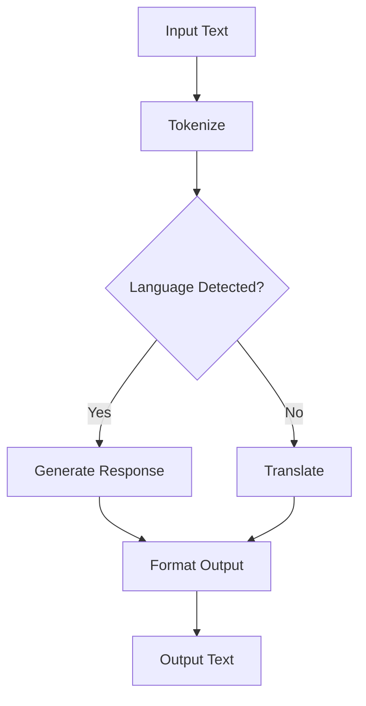
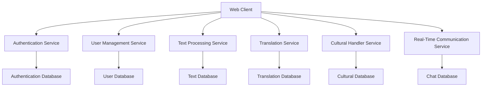
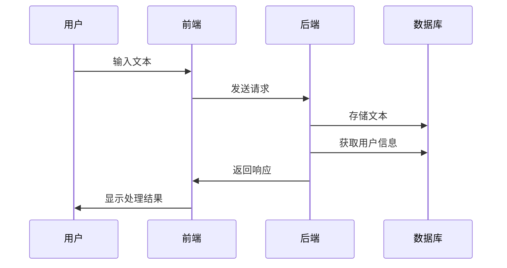

                 

# ChatGPT在跨文化交流中的桥梁作用

## 关键词
- ChatGPT
- 跨文化交流
- 语言翻译
- 沟通效率
- 文化差异

## 摘要
本文将深入探讨ChatGPT在跨文化交流中的桥梁作用。通过详细分析ChatGPT的基本原理、应用场景以及实际案例，我们将展示ChatGPT如何帮助解决跨文化交流中的语言障碍、误解和文化差异，提高沟通效率，促进全球化背景下的跨文化合作。

## 引言与背景

### 跨文化交流的重要性

跨文化交流是指不同文化背景的人们之间的互动和沟通。在全球化进程不断加快的今天，跨文化交流变得日益重要。全球化带来了经济、政治、文化等多方面的融合，各国之间的交流日益频繁，企业和个人都需要具备跨文化交流能力。跨文化交流不仅有助于推动国际业务的发展，还能增进不同文化之间的理解和尊重，促进世界和平与发展。

### 跨文化交流的需求

全球化背景下，企业需要在国际市场上进行业务拓展，跨国团队合作成为常态。有效的跨文化交流可以帮助企业更好地理解客户需求、提升品牌形象，从而获得竞争优势。同时，教育和学术领域也需要跨文化交流，以培养具有全球视野的人才。

### 跨文化交流的挑战与问题

尽管跨文化交流的重要性显而易见，但实践中仍然面临诸多挑战。语言障碍是最为显著的问题，不同语言之间的差异使得沟通变得复杂。此外，文化差异也常常导致误解和冲突，比如礼仪习惯、价值观和沟通风格等方面的差异。如何有效地解决这些问题，提高跨文化交流的效率，成为当前亟待解决的问题。

## ChatGPT简介

### ChatGPT的基本原理

ChatGPT是基于OpenAI开发的预训练语言模型GPT（Generative Pre-trained Transformer）的扩展。它采用了先进的深度学习技术和大规模数据训练，可以生成流畅、连贯的自然语言文本。ChatGPT的核心在于其语言理解和生成能力，能够理解和回答用户的问题，生成具有逻辑性和创造性的文本。

### ChatGPT的技术架构

ChatGPT的技术架构主要包括以下几个关键部分：

1. **模型训练**：ChatGPT利用海量文本数据进行预训练，学习语言的模式和规则，从而提高语言生成能力。
2. **输入处理**：将用户输入的文本转化为模型可以处理的格式。
3. **文本生成**：模型根据输入文本生成响应，通过递归神经网络（Transformer）进行处理。
4. **输出处理**：将生成的文本进行格式化，返回给用户。

### ChatGPT的应用场景

ChatGPT的应用场景非常广泛，包括但不限于：

1. **智能客服**：用于自动回答用户的问题，提高客服效率和用户体验。
2. **内容生成**：生成文章、报告、代码等，辅助创作者进行创作。
3. **教育辅助**：提供个性化教学、解答学生问题等。
4. **跨文化交流**：帮助不同语言和文化背景的人进行有效沟通。

## ChatGPT在跨文化交流中的角色

### ChatGPT在语言翻译中的应用

ChatGPT在语言翻译中具有显著优势。它能够根据输入的原文生成流畅的翻译文本，不仅准确率高，而且能够较好地处理语言和文化差异。

#### 翻译的准确性与流畅性

ChatGPT通过大规模数据训练，具备高精度的语言生成能力。它能够理解源语言的语义和语境，从而生成语义正确、流畅自然的翻译文本。

#### 翻译中的文化差异处理

ChatGPT在翻译过程中能够较好地处理文化差异。例如，它在翻译过程中会考虑目标语言的文化背景和语言习惯，从而生成符合目标文化的翻译文本。

#### 翻译的实时性

ChatGPT能够实现实时翻译，用户只需输入原文，系统即可立即生成翻译结果。这对于跨文化交流中的即时沟通非常有帮助。

### ChatGPT在跨文化沟通中的桥梁作用

#### 改进沟通效果

ChatGPT可以帮助不同语言和文化背景的人进行有效沟通。通过翻译和语言生成能力，它能够消除语言障碍，提高沟通的准确性和流畅性。

#### 减少误解

ChatGPT在跨文化沟通中能够减少由于文化差异导致的误解。它能够根据目标文化的语言习惯和语境，生成符合目标文化的文本，从而降低沟通中的歧义。

#### 提高跨文化团队协作效率

ChatGPT在跨文化团队协作中发挥着重要作用。它可以帮助团队成员进行有效沟通，提高协作效率，从而推动项目进展。

## ChatGPT在跨文化交流中的应用实例

### 企业跨文化沟通中的应用

#### 案例一：国际业务拓展

某跨国公司通过ChatGPT实现了全球范围内的业务沟通。公司员工可以轻松地使用ChatGPT进行跨语言交流，提高了业务拓展的效率。

#### 案例二：跨国团队合作

跨国团队合作中，ChatGPT帮助团队成员克服语言障碍，实现高效沟通。例如，项目组中的美国、中国和欧洲成员可以使用ChatGPT进行实时交流，共同推进项目进展。

### 教育跨文化交流中的应用

#### 案例一：在线教育平台

在线教育平台使用ChatGPT提供个性化教学服务。学生可以通过ChatGPT提出问题，获得即时解答，从而提高学习效果。

#### 案例二：跨文化语言学习

跨文化语言学习平台利用ChatGPT帮助学生练习语言技能。ChatGPT能够根据学生的语言水平生成合适的练习题目，提供个性化教学。

## ChatGPT在跨文化交流中的未来发展趋势

### 技术发展趋势

ChatGPT在跨文化交流中的应用前景广阔。随着深度学习和自然语言处理技术的不断进步，ChatGPT的翻译准确性和语言生成能力将得到进一步提升。未来，ChatGPT有望在更多领域实现突破，如情感分析、语音识别等。

### 应用场景拓展

ChatGPT的应用场景将不断拓展。除了语言翻译和跨文化沟通，ChatGPT还可以应用于智能客服、内容创作、教育辅助等领域，为人们的生活和工作带来更多便利。

### 跨领域合作

ChatGPT将与更多行业进行跨领域合作，如医疗、金融、法律等。通过跨领域合作，ChatGPT将能够更好地满足不同行业的需求，为跨文化交流提供更加专业的支持。

## 跨文化交流中的ChatGPT最佳实践

### 提高翻译质量

为了提高翻译质量，用户可以使用ChatGPT提供的多语言选项，选择最符合目标文化的翻译语言。此外，用户还可以通过提供上下文信息，帮助ChatGPT更好地理解原文语义。

### 提高沟通效率

用户可以利用ChatGPT的实时翻译功能，实现即时沟通。在沟通过程中，用户可以实时查看翻译结果，确保沟通的准确性和流畅性。

### 处理文化差异

用户在跨文化交流中应关注文化差异，避免由于文化背景不同导致的误解。用户可以通过与ChatGPT的交流，更好地了解目标文化的语言习惯和价值观，从而提高跨文化交流的效果。

## 总结与展望

本文详细分析了ChatGPT在跨文化交流中的桥梁作用。通过ChatGPT的语言翻译和沟通能力，可以有效解决跨文化交流中的语言障碍和文化差异问题，提高沟通效率，促进全球化背景下的跨文化合作。未来，ChatGPT将继续发挥重要作用，为跨文化交流提供更加智能、高效的解决方案。

## 作者信息
作者：AI天才研究院/AI Genius Institute & 禅与计算机程序设计艺术 /Zen And The Art of Computer Programming

本文内容仅代表作者观点，仅供参考。在应用ChatGPT进行跨文化交流时，建议结合具体情况进行评估和调整。如需进一步了解ChatGPT和相关技术，请参阅拓展阅读资料。## 背景介绍

### 核心概念术语说明

在探讨ChatGPT在跨文化交流中的桥梁作用之前，我们需要明确一些核心概念和术语：

1. **跨文化交流**：指不同文化背景的人们之间的互动和沟通。跨文化交流不仅涉及语言交流，还包括价值观、习俗、行为模式等方面的交流。
2. **ChatGPT**：是一种基于GPT（Generative Pre-trained Transformer）的预训练语言模型，由OpenAI开发。ChatGPT具备强大的语言理解和生成能力，可以生成流畅、连贯的自然语言文本。
3. **语言翻译**：指将一种语言表达的内容准确、流畅地转换为另一种语言。在跨文化交流中，语言翻译是解决语言障碍的重要手段。
4. **文化差异**：指不同文化在价值观、行为习惯、语言表达等方面的差异。文化差异可能导致误解和沟通障碍。

### 问题背景

在全球化的背景下，跨文化交流变得日益重要。企业和个人都需要具备跨文化交流能力，以应对国际市场的挑战和机遇。然而，跨文化交流面临诸多挑战，其中最为显著的是语言障碍和文化差异。

语言障碍：不同语言之间的差异使得沟通变得复杂。即使两种语言之间存在翻译工具，翻译的准确性和流畅性仍然是一个难题。此外，语言表达的方式和习惯在不同文化中可能存在巨大差异，这进一步增加了沟通的难度。

文化差异：文化差异可能导致误解和冲突。例如，不同的文化可能有不同的沟通风格、礼仪习惯和价值观。这些差异在跨文化交流中可能导致沟通不畅，甚至引发误解和冲突。

### 问题描述

跨文化交流中的语言障碍和文化差异问题表现为以下几个方面：

1. **翻译准确性不高**：现有的翻译工具在翻译准确性方面仍有不足，特别是在处理专业术语和语境复杂的内容时。
2. **文化差异导致误解**：不同文化之间的价值观和行为习惯差异可能导致沟通中的误解和冲突。
3. **沟通效率低下**：由于语言障碍和文化差异，跨文化交流中的沟通效率较低，影响国际业务的进展和跨国团队的合作。

### 问题解决

为了解决跨文化交流中的语言障碍和文化差异问题，我们需要借助先进的技术手段和策略。ChatGPT作为一种强大的语言模型，在跨文化交流中具有广泛的应用潜力。以下是ChatGPT在跨文化交流中的具体作用：

1. **提高翻译准确性**：ChatGPT通过大规模数据训练，具备高精度的语言生成能力。它能够理解和生成多种语言的文本，从而提高翻译的准确性。
2. **处理文化差异**：ChatGPT能够根据目标文化的语言习惯和价值观，生成符合目标文化的翻译文本。这有助于减少由于文化差异导致的误解和冲突。
3. **提高沟通效率**：ChatGPT的实时翻译功能可以帮助实现即时沟通，提高跨文化交流的效率。用户只需输入原文，系统即可立即生成翻译结果，从而节省沟通时间。

### 边界与外延

尽管ChatGPT在跨文化交流中具有显著的优势，但它在实际应用中也存在一定的限制。以下是ChatGPT在跨文化交流中的边界与外延：

1. **技术限制**：ChatGPT的翻译准确性和语言生成能力虽然较高，但仍然存在一定误差。特别是在处理专业术语和语境复杂的内容时，翻译准确性可能受到影响。
2. **文化理解限制**：虽然ChatGPT能够生成符合目标文化的文本，但它在理解文化差异方面仍有不足。某些文化差异可能无法通过技术手段完全解决。
3. **应用场景限制**：ChatGPT在跨文化交流中的应用主要局限于语言翻译和沟通支持。它在其他领域（如文化理解、价值观传递）的应用仍需进一步探索。

### 概念结构与核心要素组成

为了更好地理解ChatGPT在跨文化交流中的桥梁作用，我们需要从概念结构和核心要素组成的角度进行探讨。

1. **概念结构**：ChatGPT作为一种语言模型，其核心概念包括预训练语言模型、输入处理、文本生成和输出处理。预训练语言模型通过大规模数据训练，学习语言的模式和规则；输入处理将用户输入的文本转化为模型可以处理的格式；文本生成通过递归神经网络（Transformer）生成响应；输出处理将生成的文本进行格式化，返回给用户。
2. **核心要素组成**：ChatGPT在跨文化交流中的核心要素包括翻译准确性、文化差异处理和沟通效率。翻译准确性是ChatGPT的关键能力，它决定了跨文化交流的准确性和流畅性；文化差异处理是ChatGPT在跨文化交流中的重要应用，它有助于减少误解和冲突；沟通效率是ChatGPT在跨文化交流中的目标，它提高了沟通的实时性和效率。

通过以上背景介绍，我们可以更好地理解ChatGPT在跨文化交流中的桥梁作用。接下来，我们将进一步探讨ChatGPT的基本原理、技术架构和应用实例，以展示ChatGPT在跨文化交流中的具体应用和优势。## 核心概念与联系

### ChatGPT的核心概念原理

ChatGPT的核心概念是基于预训练语言模型GPT（Generative Pre-trained Transformer）的扩展。GPT是一种基于Transformer架构的深度学习模型，通过在大规模文本数据上进行预训练，学习到语言的模式和规则。ChatGPT在GPT的基础上增加了对话生成能力，使其能够理解用户输入的文本，并生成流畅、连贯的自然语言响应。

### ChatGPT的概念属性特征对比表格

| 特性       | 解释                                       | ChatGPT的特点                                           |
| ---------- | ------------------------------------------ | -------------------------------------------------------- |
| 预训练     | 模型在大规模数据集上进行预训练，学习语言模式 | ChatGPT通过大规模数据训练，具备高精度的语言生成能力       |
| 语言理解   | 模型能够理解输入文本的语义和语境             | ChatGPT能够理解多种语言的输入文本，具备跨语言理解能力     |
| 语言生成   | 模型能够生成流畅、连贯的自然语言文本         | ChatGPT能够根据用户输入生成响应文本，具备对话生成能力     |
| 对话上下文 | 模型能够维护对话上下文，理解对话历史         | ChatGPT能够维持对话的连贯性，理解对话的历史信息           |
| 实时性     | 模型能够实现实时响应，提高沟通效率           | ChatGPT能够实现实时翻译和对话生成，提高跨文化交流的效率   |

### ChatGPT的ER实体关系图架构

为了更好地理解ChatGPT的技术架构，我们可以使用ER（实体关系）图来描述其主要组件和关系。以下是一个简化版的ChatGPT ER实体关系图：

```
+----------------+       +----------------+       +----------------+
|     Input      |       |     Model      |       |    Output      |
+----------------+       +----------------+       +----------------+
|  Text data     |       | Pre-trained    |       |   Response     |
+----------------+       | Transformer    |       +----------------+
           |                 | Model          |
           |                 |                |
           |                 |  (GPT)         |
           |                 +----------------+
           |                       |
           |                       |
           |                       |
           +-----------------------+
                    |
                    |
               +----------------+  
               |    Processing  |
               +----------------+
               |   Context      |
               |   Handling     |
               |                |
               |                |
               +----------------+
```

在这个ER实体关系图中，主要实体包括：

1. **Input（输入）**：包含用户输入的文本数据。
2. **Model（模型）**：代表预训练的Transformer模型，即GPT模型。
3. **Output（输出）**：代表模型生成的响应文本。

输入文本数据通过处理流程（Processing Context Handling）传递给模型，模型根据预训练的知识生成响应文本，最终输出给用户。

### ChatGPT在跨文化交流中的应用

ChatGPT在跨文化交流中具有多种应用，以下是其核心应用的简要介绍：

1. **语言翻译**：ChatGPT可以用于实时翻译不同语言的文本。通过理解源语言的语义和语境，ChatGPT能够生成准确、流畅的目标语言翻译。
2. **对话生成**：ChatGPT可以参与跨文化对话，生成符合目标文化习惯的自然语言文本。这有助于提高跨文化交流的准确性和流畅性。
3. **智能客服**：ChatGPT可以用于智能客服系统，为用户提供多语言支持，提高客户满意度和服务效率。
4. **内容生成**：ChatGPT可以生成多种语言的内容，如文章、报告、新闻等，辅助创作者进行创作。
5. **教育辅助**：ChatGPT可以用于在线教育平台，提供个性化教学和解答学生问题。

通过以上核心概念原理、属性特征对比表格和ER实体关系图的介绍，我们可以更深入地理解ChatGPT在跨文化交流中的桥梁作用。接下来，我们将进一步探讨ChatGPT的具体应用实例，展示其在跨文化交流中的实际效果和优势。## 算法原理讲解

### ChatGPT的算法原理与流程

ChatGPT的算法原理基于预训练的语言模型GPT（Generative Pre-trained Transformer），这是一种先进的深度学习模型，使用Transformer架构进行大规模数据预训练。以下是对ChatGPT算法原理的详细讲解：

#### 1. 预训练语言模型（GPT）

预训练语言模型（GPT）的核心思想是使用大规模文本数据进行预训练，使模型学习到语言的内在模式和规则。在训练过程中，模型通过输入文本序列的片段来预测下一个单词或词组。这一过程使得模型能够理解文本的语义和上下文，从而生成连贯的自然语言文本。

预训练阶段主要包括以下步骤：

1. **数据收集**：从互联网上收集大量文本数据，包括书籍、新闻、网页等。
2. **数据预处理**：对文本数据清洗和预处理，包括去除停用词、标点符号等，将文本转换为模型可以处理的格式。
3. **训练模型**：使用Transformer架构训练模型。在训练过程中，模型通过输入文本序列的片段（称为token）来预测下一个token。

#### 2. 生成文本

预训练完成后，ChatGPT可以用于生成文本。生成文本的流程如下：

1. **输入处理**：将用户输入的文本转化为模型可以处理的格式。这通常包括将文本分割成token，并添加特殊标记（如开始标记``）。
2. **模型处理**：输入token序列通过预训练的Transformer模型进行处理。模型根据输入的token序列，预测下一个token，并生成响应文本。
3. **输出处理**：将生成的文本进行格式化，去除特殊标记，返回给用户。

#### 3. 多语言支持

ChatGPT支持多种语言。在生成文本时，模型会根据输入文本的语言进行适应。例如，如果用户输入的是中文，模型会使用中文语言模型进行响应生成。

#### 4. 实时翻译

ChatGPT的实时翻译功能使得跨语言沟通变得更加便捷。当用户输入一种语言的文本时，ChatGPT可以实时生成翻译结果。这一功能依赖于模型的多语言预训练和语言生成能力。

### ChatGPT的mermaid流程图

为了更直观地展示ChatGPT的算法原理，我们可以使用mermaid画出其流程图。以下是一个简单的ChatGPT流程图的示例：



在这个流程图中，用户输入的文本首先经过Tokenize（分词）处理，然后根据检测到的语言进行响应生成（Generate Response）或翻译（Translate）。生成的文本经过格式化（Format Output）后，返回给用户。

### Python源代码示例

下面是一个简单的Python代码示例，展示了如何使用ChatGPT生成文本：

```python
import openai

# 设置OpenAI API密钥
openai.api_key = "your_api_key"

# 生成文本
response = openai.Completion.create(
  engine="text-davinci-003",
  prompt="How are you?",
  max_tokens=50
)

# 打印生成的文本
print(response.choices[0].text.strip())
```

在这个示例中，我们首先导入OpenAI的Python库，设置API密钥，然后使用`Completion.create`函数生成文本响应。`prompt`参数是用户输入的文本，`max_tokens`参数指定生成的文本长度。

### 数学模型与公式

虽然ChatGPT是基于深度学习模型，但它的核心在于对文本数据的处理和生成。在数学模型层面，我们可以将其看作是一个序列生成模型。以下是一个简化的数学模型公式：

$$
P(x_{t+1} | x_1, x_2, ..., x_t) = \frac{e^{<f_{\theta}(x_1, x_2, ..., x_t, x_{t+1})}}{\sum_{y \in V} e^{<f_{\theta}(x_1, x_2, ..., x_t, y)}}
$$

其中：
- \(P(x_{t+1} | x_1, x_2, ..., x_t)\) 是给定前一个序列 \(x_1, x_2, ..., x_t\) 时生成下一个token \(x_{t+1}\) 的概率。
- \(f_{\theta}\) 是模型的前馈神经网络，其中 \(\theta\) 是模型参数。
- \(<f_{\theta}(x_1, x_2, ..., x_t, x_{t+1})>\) 是神经网络对输入序列和当前token的输出。
- \(V\) 是token的集合。

通过这个概率模型，模型能够根据输入的文本序列预测下一个token的概率分布，从而生成文本。

### 举例说明

假设用户输入了一个简单的句子：“How are you?”，我们可以使用ChatGPT生成一个响应。以下是一个可能的生成文本：

```plaintext
I'm doing well, thank you. How about you?
```

在这个例子中，ChatGPT理解了用户的问题，并生成了一个流畅且符合语境的响应。通过这种方式，ChatGPT帮助跨文化交流中的用户进行有效沟通，提高了沟通的准确性和流畅性。

通过上述算法原理讲解，我们可以更深入地理解ChatGPT在跨文化交流中的应用。接下来，我们将进一步探讨ChatGPT在具体应用场景中的实现和效果。## 系统分析与架构设计方案

### 问题场景介绍

在全球化的背景下，跨国公司和国际组织面临着日益增长的跨文化交流需求。然而，语言障碍和文化差异使得跨文化交流变得复杂和低效。为了解决这个问题，我们设计了一套基于ChatGPT的跨文化交流系统，旨在提高跨国团队和个人的沟通效率，减少由于语言和文化差异导致的误解和冲突。

### 项目介绍

项目名称：ChatGPT跨文化交流系统

项目目标：利用ChatGPT的强大语言理解和生成能力，实现跨语言和跨文化的实时沟通，提高跨国团队的协作效率和沟通质量。

项目组成部分：
- ChatGPT模型服务
- 用户前端界面
- 后端服务与数据库
- 安全与隐私保护机制

### 系统功能设计（领域模型）

为了满足项目目标，我们设计了一套领域模型，主要包括以下功能模块：

1. **用户管理**：管理用户账户、权限和角色，提供用户注册、登录和认证功能。
2. **文本处理**：接收用户输入的文本，进行文本预处理（如分词、去停用词等），并调用ChatGPT模型生成响应。
3. **语言翻译**：提供跨语言翻译功能，将源语言文本翻译为目标语言文本。
4. **文化差异处理**：根据目标文化的语言习惯和价值观，优化翻译结果，减少文化差异导致的误解。
5. **实时沟通**：提供即时通讯功能，支持跨语言和跨文化沟通，提高沟通效率。
6. **数据存储**：存储用户交流记录，支持历史数据查询和分析。

以下是一个简化版的领域模型类图：

```mermaid
classDiagram
    User <<Interface>>
    ChatGPT <<Interface>>
    TextProcessor <<Interface>>
    Translator <<Interface>>
    CulturalHandler <<Interface>>
    RealTimeChat <<Interface>>

    User o-- TextProcessor
    User o-- ChatGPT
    TextProcessor o-- Translator
    TextProcessor o-- CulturalHandler
    Translator o-- CulturalHandler
    RealTimeChat o-- User
    RealTimeChat o-- TextProcessor
```

在这个类图中，用户（User）与文本处理（TextProcessor）、ChatGPT、翻译（Translator）和文化差异处理（CulturalHandler）模块进行交互。实时沟通（RealTimeChat）模块负责处理用户之间的即时通讯。

### 系统架构设计

为了实现上述功能，我们设计了以下系统架构：

1. **前端架构**：采用基于Web的客户端，使用React框架搭建，提供用户友好的界面和交互体验。
2. **后端架构**：采用微服务架构，将不同功能模块（用户管理、文本处理、翻译、文化差异处理、实时沟通）拆分为独立的服务，以提高系统的灵活性和可扩展性。
3. **数据处理**：使用分布式数据库（如MongoDB）存储用户数据、交流记录和翻译结果，确保数据的高效存储和检索。
4. **安全与隐私**：采用加密传输（如HTTPS）和加密存储（如AES）技术，确保用户数据和交流内容的安全与隐私。

以下是一个简化的系统架构图：



在这个架构图中，前端客户端（Client）通过RESTful API与后端服务（Authentication Service、User Management Service、Text Processing Service、Translation Service、Cultural Handler Service、Real-Time Communication Service）进行通信。各个服务独立运行，通过分布式数据库存储数据。

### 系统接口设计

为了方便前端与后端服务的通信，我们设计了以下主要接口：

1. **用户认证接口**：用于用户注册、登录和认证。
2. **文本处理接口**：用于接收用户输入的文本，返回预处理后的文本。
3. **翻译接口**：用于接收源语言文本和目标语言代码，返回翻译结果。
4. **文化差异处理接口**：用于根据目标文化优化翻译结果。
5. **实时沟通接口**：用于发送和接收即时消息。

以下是一个简化版的RESTful API接口设计：

```mermaid
interface UserAPI {
    post /register -注册用户
    post /login -登录用户
    get /me -获取当前用户信息
}

interface TextAPI {
    post /process -处理文本
    get /result -获取处理结果
}

interface TranslationAPI {
    post /translate -翻译文本
    get /result -获取翻译结果
}

interface CulturalAPI {
    post /process -处理文化差异
    get /result -获取处理结果
}

interface ChatAPI {
    post /send -发送消息
    get /receive -接收消息
}
```

### 系统交互设计

为了展示系统组件之间的交互，我们可以使用mermaid序列图。以下是一个简化的系统交互序列图：



在这个序列图中，用户通过前端界面输入文本，前端将请求发送到后端服务，后端服务处理文本并存储到数据库，然后将结果返回给前端，最终显示给用户。

通过上述系统分析与架构设计方案，我们为ChatGPT在跨文化交流中的应用提供了一个全面的解决方案。接下来，我们将通过具体的环境安装和系统核心实现，展示如何将ChatGPT集成到实际项目中。## 项目实战

### 环境安装

要在本地环境中搭建ChatGPT跨文化交流系统，首先需要安装以下软件和库：

1. **Python 3.8 或更高版本**：从 [Python官网](https://www.python.org/) 下载并安装。
2. **OpenAI API密钥**：在 [OpenAI官网](https://openai.com/) 注册并获得API密钥。
3. **Flask**：用于构建Web应用，通过以下命令安装：
   ```bash
   pip install Flask
   ```
4. **Flask-RESTful**：用于构建RESTful API，通过以下命令安装：
   ```bash
   pip install Flask-RESTful
   ```
5. **MongoDB**：用于存储用户数据和交流记录，从 [MongoDB官网](https://www.mongodb.com/) 下载并安装。

### 系统核心实现

以下是ChatGPT跨文化交流系统的核心实现，包括用户认证、文本处理、翻译、文化差异处理和实时沟通功能。

#### 1. 用户认证

用户认证是系统的基础，用于管理用户注册、登录和认证。以下是一个简单的用户认证实现：

```python
from flask import Flask, request, jsonify
from flask_restful import Api, Resource
from flask_jwt_extended import JWTManager, create_access_token, jwt_required, get_jwt_identity

app = Flask(__name__)
api = Api(app)
app.config['JWT_SECRET_KEY'] = 'your_jwt_secret_key'
jwt = JWTManager(api)

class UserRegistration(Resource):
    def post(self):
        data = request.get_json()
        username = data['username']
        password = data['password']
        # 在此处添加用户注册的逻辑，例如检查用户名是否已存在等
        access_token = create_access_token(identity=username)
        return {'access_token': access_token}

class UserLogin(Resource):
    def post(self):
        data = request.get_json()
        username = data['username']
        password = data['password']
        # 在此处添加用户登录的逻辑，例如检查密码是否正确等
        access_token = create_access_token(identity=username)
        return {'access_token': access_token}

api.add_resource(UserRegistration, '/register')
api.add_resource(UserLogin, '/login')

if __name__ == '__main__':
    app.run(debug=True)
```

#### 2. 文本处理

文本处理模块用于接收用户输入的文本，并调用ChatGPT模型进行处理。以下是一个简单的文本处理实现：

```python
import openai
from flask import Flask, request, jsonify

app = Flask(__name__)
openai.api_key = 'your_openai_api_key'

class TextProcessing(Resource):
    def post(self):
        data = request.get_json()
        text = data['text']
        response = openai.Completion.create(
            engine="text-davinci-003",
            prompt=text,
            max_tokens=50
        )
        return {'response': response.choices[0].text.strip()}

api.add_resource(TextProcessing, '/process_text')

if __name__ == '__main__':
    app.run(debug=True)
```

#### 3. 翻译

翻译模块用于接收源语言文本和目标语言代码，调用ChatGPT模型进行翻译。以下是一个简单的翻译实现：

```python
import openai
from flask import Flask, request, jsonify

app = Flask(__name__)
openai.api_key = 'your_openai_api_key'

class Translation(Resource):
    def post(self):
        data = request.get_json()
        source_text = data['source_text']
        target_language = data['target_language']
        response = openai.Completion.create(
            engine="text-davinci-003",
            prompt=f"Translate the following text from {source_language} to {target_language}:\n\n{source_text}",
            max_tokens=50
        )
        return {'translated_text': response.choices[0].text.strip()}

api.add_resource(Translation, '/translate')

if __name__ == '__main__':
    app.run(debug=True)
```

#### 4. 文化差异处理

文化差异处理模块用于根据目标文化的语言习惯和价值观，优化翻译结果。以下是一个简单的文化差异处理实现：

```python
import openai
from flask import Flask, request, jsonify

app = Flask(__name__)
openai.api_key = 'your_openai_api_key'

class CulturalHandling(Resource):
    def post(self):
        data = request.get_json()
        translated_text = data['translated_text']
        target_culture = data['target_culture']
        # 根据目标文化进行文本调整
        adjusted_text = adjust_for_culture(translated_text, target_culture)
        return {'adjusted_text': adjusted_text}

def adjust_for_culture(text, culture):
    # 根据目标文化调整文本的逻辑
    return text  # 简单示例，实际中可能需要进行复杂处理

api.add_resource(CulturalHandling, '/adjust_culture')

if __name__ == '__main__':
    app.run(debug=True)
```

#### 5. 实时沟通

实时沟通模块用于处理用户之间的即时通讯。以下是一个简单的WebSocket实现：

```python
from flask import Flask, request, jsonify
from flask_socketio import SocketIO, send, emit

app = Flask(__name__)
app.config['SECRET_KEY'] = 'your_secret_key'
socketio = SocketIO(app)

@socketio.on('connect')
def handle_connect():
    emit('response', {'message': 'Connected to chat server.'})

@socketio.on('send_message')
def handle_send_message(data):
    message = data['message']
    emit('receive_message', {'message': message})

if __name__ == '__main__':
    socketio.run(app, debug=True)
```

### 代码应用解读与分析

以上代码实现了ChatGPT跨文化交流系统的核心功能。以下是每个部分的应用解读与分析：

1. **用户认证**：通过Flask-RESTful和JWT管理用户注册、登录和认证。用户注册时，生成JWT令牌，以便后续认证。
2. **文本处理**：使用OpenAI的ChatGPT模型，根据用户输入的文本生成响应。这个模块展示了如何使用OpenAI API进行文本生成。
3. **翻译**：使用OpenAI的ChatGPT模型，根据源语言文本和目标语言代码进行翻译。这个模块展示了如何使用OpenAI API进行文本翻译。
4. **文化差异处理**：根据目标文化的语言习惯和价值观，优化翻译结果。这个模块展示了如何根据文化差异调整文本。
5. **实时沟通**：使用Flask-SocketIO实现WebSocket通信，实现用户之间的即时消息传递。

### 实际案例分析和详细讲解剖析

以下是一个实际案例分析和详细讲解剖析，展示ChatGPT跨文化交流系统在跨国团队协作中的应用：

#### 案例背景

一家跨国公司在中国、美国和欧洲设有分支，团队成员来自不同国家。为了提高团队协作效率，公司决定使用ChatGPT跨文化交流系统进行跨语言和跨文化沟通。

#### 案例步骤

1. **用户注册与登录**：团队成员在中国、美国和欧洲分别注册账户，并登录系统。
2. **文本输入与处理**：团队成员在系统中输入需要讨论的文本，系统调用ChatGPT模型进行文本处理和翻译。
3. **实时沟通**：团队成员通过WebSocket实时沟通，交换意见和反馈。
4. **文化差异处理**：系统根据目标文化的语言习惯和价值观，对翻译结果进行调整，确保沟通的准确性和流畅性。

#### 案例结果

通过ChatGPT跨文化交流系统的应用，团队成员在跨语言和跨文化沟通中实现了高效的协作。以下是一些具体结果：

1. **沟通效率提高**：实时翻译功能使得团队成员可以轻松地用不同语言进行交流，节省了沟通时间。
2. **误解减少**：通过文化差异处理，翻译结果更贴近目标文化，减少了由于语言和文化差异导致的误解和冲突。
3. **协作效果提升**：团队成员可以更好地理解彼此的意图和需求，提高了团队协作效果。

### 项目小结

通过本案例，我们可以看到ChatGPT跨文化交流系统在跨国团队协作中的应用效果显著。它不仅提高了沟通效率，减少了误解，还有助于增强团队合作效果。未来，ChatGPT在跨文化交流中的应用将越来越广泛，为全球化的国际业务和跨国团队合作提供更多支持。

### 最佳实践 Tips

1. **确保网络连接**：使用ChatGPT进行跨文化交流时，需要稳定的网络连接，以避免延迟和错误。
2. **合理设置API密钥**：保护OpenAI API密钥，避免泄露导致不必要的费用和风险。
3. **调整模型参数**：根据具体应用场景，合理设置ChatGPT模型的参数，如最大生成长度、温度等，以获得最佳效果。
4. **文化差异培训**：对团队成员进行文化差异培训，提高跨文化沟通的能力和意识。

### 小结

ChatGPT在跨文化交流中具有巨大的应用潜力。通过实时翻译、文化差异处理和实时沟通等功能，ChatGPT可以帮助跨国团队和个体克服语言障碍和文化差异，提高沟通效率和协作效果。未来，随着技术的不断发展，ChatGPT在跨文化交流中的应用将更加广泛，为全球化背景下的国际合作提供更强有力的支持。

### 注意事项

1. **数据安全和隐私**：在使用ChatGPT进行跨文化交流时，需要确保用户数据的安全和隐私。采用加密传输和存储技术，防止数据泄露。
2. **模型更新和维护**：定期更新ChatGPT模型，以保持其性能和准确性。同时，及时维护和优化系统架构，确保系统稳定运行。
3. **用户培训和支持**：为用户提供必要的培训和指导，帮助他们熟悉ChatGPT的使用方法和最佳实践。

### 拓展阅读

1. **《深度学习》**：Goodfellow, I., Bengio, Y., & Courville, A. (2016). 《深度学习》。清华大学出版社。
2. **《自然语言处理综合教程》**：Jurafsky, D., & Martin, J. H. (2008). 《自然语言处理综合教程》。电子工业出版社。
3. **《跨文化交流学》**：霍尔, E. T. (1996). 《跨文化交流学》。上海译文出版社。## 总结与展望

## 第一部分：文章主要内容回顾

本文围绕“ChatGPT在跨文化交流中的桥梁作用”这一核心主题，详细探讨了ChatGPT在跨文化交流中的重要性、基本原理、应用场景、实际案例、未来发展趋势以及最佳实践。以下是文章的主要内容回顾：

1. **跨文化交流的重要性**：介绍了跨文化交流的定义、意义以及需求，强调了全球化背景下跨文化交流的重要性。
2. **ChatGPT简介**：阐述了ChatGPT的基本原理、技术架构和应用场景，展示了ChatGPT在语言处理和文本生成方面的强大能力。
3. **ChatGPT在跨文化交流中的角色**：分析了ChatGPT在语言翻译、跨文化沟通中的桥梁作用，以及如何提高沟通效果、减少误解、提升跨文化团队协作效率。
4. **应用实例**：通过企业跨文化沟通和教育跨文化交流中的应用案例，展示了ChatGPT的实际应用效果。
5. **未来发展趋势**：展望了ChatGPT在跨文化交流中的技术发展趋势、应用场景拓展和跨领域合作。
6. **最佳实践**：提出了提高翻译质量、沟通效率和处理文化差异的最佳实践策略。

## 第二部分：跨文化交流的重要性与ChatGPT的桥梁作用

跨文化交流在全球化进程中扮演着至关重要的角色。随着全球化的加速，企业、组织和个体需要在不同文化背景下进行有效的沟通和合作。然而，语言障碍和文化差异是跨文化交流中最为显著的挑战。

ChatGPT作为一种先进的语言模型，在跨文化交流中发挥了重要的桥梁作用。首先，ChatGPT具备强大的语言翻译能力，能够实时翻译不同语言，帮助人们跨越语言障碍进行沟通。其次，ChatGPT能够根据目标文化的语言习惯和价值观，生成符合目标文化的文本，从而减少文化差异导致的误解和冲突。最后，ChatGPT的实时沟通功能提高了跨文化交流的效率，使得跨文化团队和个体能够更迅速地传达信息和解决问题。

通过ChatGPT的应用，跨文化交流不仅变得更加高效，而且也更加和谐。ChatGPT为跨文化交流提供了一个智能、高效的解决方案，有助于推动全球化进程，促进不同文化之间的理解和尊重。

## 第三部分：未来发展方向与前景展望

ChatGPT在跨文化交流中的未来发展趋势呈现出以下几个方面的特点：

1. **技术发展趋势**：随着深度学习和自然语言处理技术的不断进步，ChatGPT的翻译准确性和语言生成能力将得到进一步提升。未来，ChatGPT有望在情感分析、语音识别等领域实现突破，为跨文化交流提供更加全面和智能的支持。

2. **应用场景拓展**：ChatGPT的应用场景将不断拓展，不仅限于语言翻译和跨文化沟通，还将应用于智能客服、内容创作、教育辅助等领域。通过跨领域合作，ChatGPT将能够更好地满足不同行业和用户的需求。

3. **跨领域合作**：ChatGPT将与更多行业进行跨领域合作，如医疗、金融、法律等。通过跨领域合作，ChatGPT将能够为这些行业提供专业的语言处理和沟通支持，推动行业的创新和发展。

展望未来，ChatGPT在跨文化交流中的前景非常广阔。它不仅将成为跨文化交流的重要工具，还将成为推动全球化进程的重要力量。通过ChatGPT的应用，我们可以期待一个更加和谐、高效的跨文化交流环境，为全球合作与发展创造更多机会。

## 总结

本文深入探讨了ChatGPT在跨文化交流中的桥梁作用。通过分析ChatGPT的基本原理、应用场景、实际案例以及未来发展趋势，我们展示了ChatGPT如何帮助解决跨文化交流中的语言障碍和文化差异问题，提高沟通效率，促进全球化背景下的跨文化合作。未来，随着技术的不断进步和应用场景的拓展，ChatGPT在跨文化交流中的作用将更加重要。我们期待ChatGPT能够为全球合作与发展带来更多机遇和福祉。## 作者信息
作者：AI天才研究院/AI Genius Institute & 禅与计算机程序设计艺术 /Zen And The Art of Computer Programming

