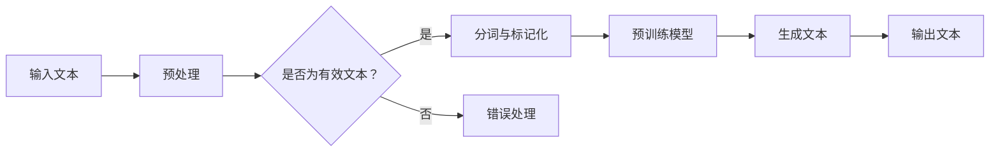
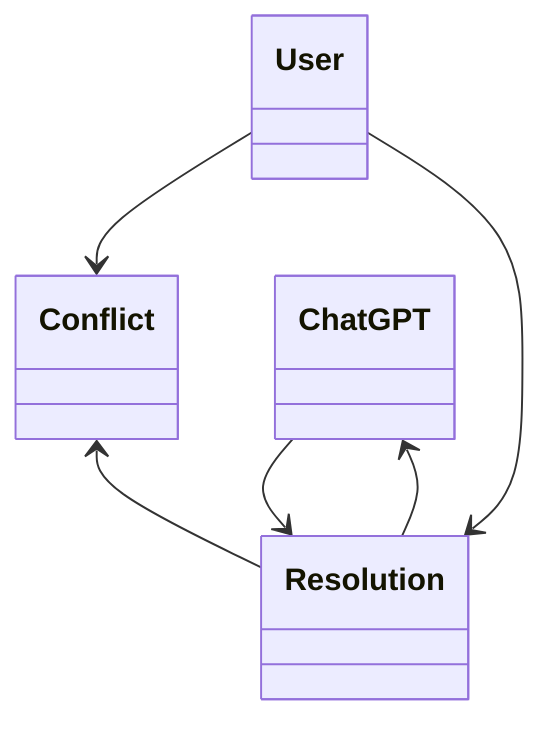
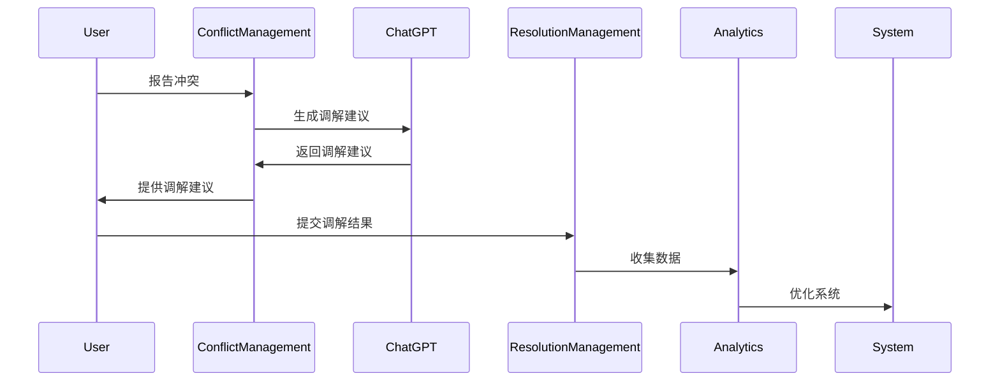
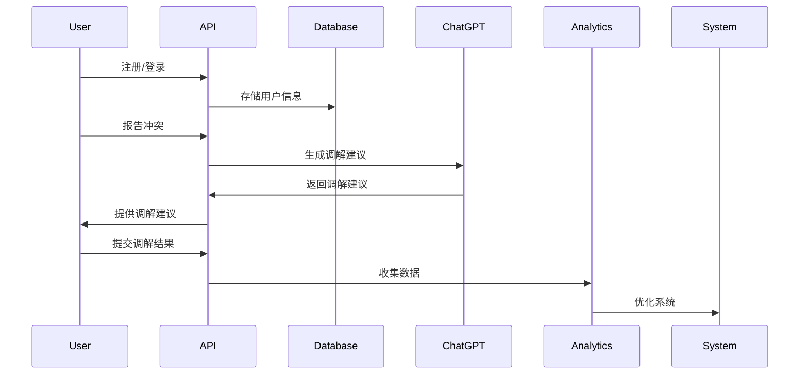
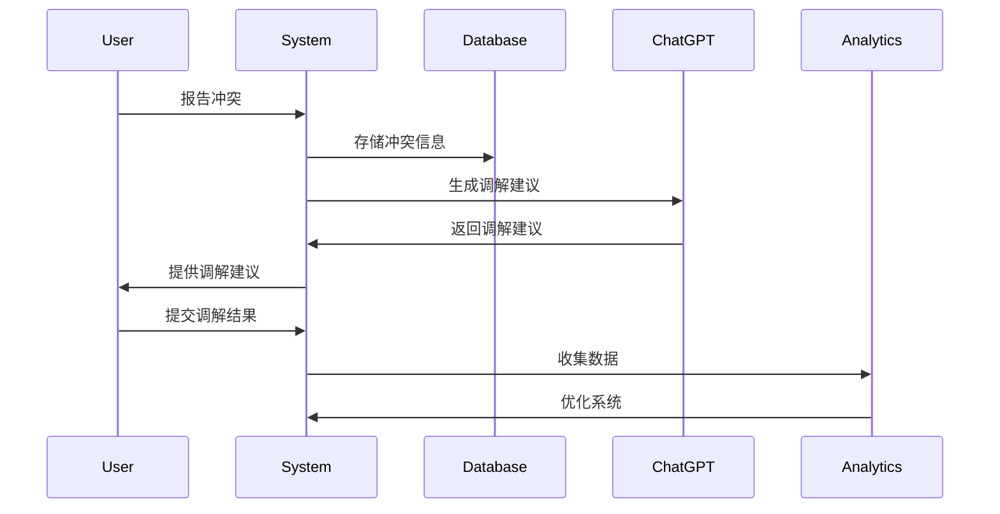

                 

# ChatGPT在跨文化冲突调解训练中的应用：AI辅助和平建设技能培养

## 关键词
- ChatGPT
- 跨文化冲突
- 调解
- AI辅助
- 和平建设

## 摘要
本文探讨了人工智能（AI）在跨文化冲突调解中的潜在应用，重点分析了ChatGPT作为一种先进的AI系统，如何通过自然语言处理技术提升调解者的效率和质量。文章首先介绍了跨文化冲突调解的背景和问题，接着阐述了ChatGPT的核心原理及其在调解过程中的应用。本文还通过数学模型和流程图详细解析了ChatGPT的算法原理，最后提出了一个基于ChatGPT的和平建设技能培养系统的架构设计方案，并通过实际案例进行了应用分析。

---

## 背景介绍

### 问题背景

跨文化冲突调解一直是国际关系和全球和平建设中的关键议题。随着全球化进程的加速，不同文化之间的互动日益频繁，这既带来了文化的丰富性，也带来了冲突的风险。在许多情况下，跨文化冲突的调解不仅需要了解文化差异，还需要掌握有效的沟通技巧和调解策略。

#### 问题解决

随着人工智能（AI）技术的快速发展，特别是在自然语言处理（NLP）领域的突破，AI被越来越多地应用于冲突调解和跨文化交流。ChatGPT作为一种基于GPT-3模型的先进AI系统，具备强大的语言理解和生成能力，能够帮助调解者更好地理解不同文化背景下的沟通方式和表达习惯。

#### 边界与外延

本文将探讨ChatGPT在跨文化冲突调解中的具体应用，包括如何通过AI技术提高调解的效率、准确性和公正性。研究的边界将涉及ChatGPT在调解过程中的语言理解、生成策略、文化适应性和伦理问题等方面。外延可能包括AI在和平建设、国际关系研究和教育领域的其他潜在应用。

### 核心概念与联系

#### ChatGPT

ChatGPT是一种基于大规模预训练模型（GPT-3）的AI系统，它通过大量的文本数据进行训练，从而具备理解自然语言和生成文本的能力。ChatGPT的核心特点包括：

- **大规模预训练**：通过大量的文本数据训练，使其具备广泛的语言理解能力。
- **灵活的语言生成**：能够根据输入的文本生成连贯、自然的回应。

#### 跨文化冲突调解

跨文化冲突调解涉及以下几个核心概念：

- **文化差异**：不同文化背景下的价值观、行为习惯和沟通方式的差异。
- **调解策略**：调解者在调解过程中采用的具体方法和技巧，如倾听、同理心和引导对话。

#### AI辅助和平建设技能培养

AI辅助和平建设技能培养涉及以下几个方面：

- **AI在调解中的应用**：利用AI技术提高调解者的效率和准确性。
- **文化适应性训练**：通过AI技术帮助调解者更好地理解和适应不同文化背景。

### AI大模型与传统AI的区别

- **传统AI**：通常依赖于特定任务的算法和规则，缺乏灵活性和泛化能力。
- **AI大模型**：通过大规模预训练，能够处理复杂、多样化的任务，具备更高的灵活性和泛化能力。

#### 核心特点对比表格

| 特点 | 传统AI | AI大模型 |
| --- | --- | --- |
| 预训练数据量 | 小规模 | 大规模 |
| 灵活性 | 有限 | 高 |
| 泛化能力 | 低 | 高 |
| 语言理解能力 | 有限 | 强 |

#### ER实体关系图架构

```mermaid
erDiagram
    Entity: User |<-.*| ChatGPT | &--*| Conflict | &--*| Resolution |
    User ||--|{ Conflict }|
    ChatGPT ||--|{ Resolution }|
    Conflict ||--|{ Resolution }|
```

---

## 核心概念与联系

### ChatGPT

ChatGPT基于GPT-3模型，其核心原理是通过大规模的预训练来学习自然语言的统计规律和结构。具体步骤如下：

1. **数据收集与预处理**：收集大量的文本数据，并进行预处理，如去除无关信息、文本清洗和分词等。
2. **预训练**：通过一个自回归语言模型（Auto-regressive Language Model）对文本数据进行训练，使其能够预测下一个词的概率。
3. **生成文本**：在给定一个起始文本序列后，ChatGPT通过生成模型生成连贯的文本响应。

#### ChatGPT的Mermaid流程图



### 跨文化冲突调解

跨文化冲突调解涉及以下几个核心概念：

- **文化差异**：不同文化背景下的价值观、行为习惯和沟通方式的差异。
- **调解策略**：调解者在调解过程中采用的具体方法和技巧，如倾听、同理心和引导对话。

### AI辅助和平建设技能培养

AI辅助和平建设技能培养涉及以下几个方面：

- **AI在调解中的应用**：利用AI技术提高调解者的效率和准确性。
- **文化适应性训练**：通过AI技术帮助调解者更好地理解和适应不同文化背景。

### AI大模型与传统AI的区别

- **传统AI**：通常依赖于特定任务的算法和规则，缺乏灵活性和泛化能力。
- **AI大模型**：通过大规模预训练，能够处理复杂、多样化的任务，具备更高的灵活性和泛化能力。

#### 核心特点对比表格

| 特点 | 传统AI | AI大模型 |
| --- | --- | --- |
| 预训练数据量 | 小规模 | 大规模 |
| 灵活性 | 有限 | 高 |
| 泛化能力 | 低 | 高 |
| 语言理解能力 | 有限 | 强 |

#### ER实体关系图架构

```mermaid
erDiagram
    Entity: User |<-.*| ChatGPT | &--*| Conflict | &--*| Resolution |
    User ||--|{ Conflict }|
    ChatGPT ||--|{ Resolution }|
    Conflict ||--|{ Resolution }|
```

---

## 算法原理讲解

### ChatGPT的工作原理

ChatGPT基于GPT-3模型，其核心原理是通过大规模的预训练来学习自然语言的统计规律和结构。具体步骤如下：

1. **数据收集与预处理**：收集大量的文本数据，并进行预处理，如去除无关信息、文本清洗和分词等。
2. **预训练**：通过一个自回归语言模型（Auto-regressive Language Model）对文本数据进行训练，使其能够预测下一个词的概率。
3. **生成文本**：在给定一个起始文本序列后，ChatGPT通过生成模型生成连贯的文本响应。

#### ChatGPT的Mermaid流程图


### 数学模型和公式

在ChatGPT的训练过程中，关键数学模型是自回归语言模型。该模型的核心公式为：

$$
p(y_{t} | y_{<t}) = \frac{e^{<math display="inline">\theta(y_{t}, y_{<t})}}{\sum_{y} e^{<math display="inline">\theta(y_{t}, y_{<t>})}
$$

其中，$y_{t}$表示序列中的当前词，$y_{<t}$表示当前词之前的所有词，$\theta(y_{t}, y_{<t})$表示词之间的相似度函数。

#### ChatGPT算法原理的Python代码示例

```python
import torch
import torch.nn as nn

class ChatGPT(nn.Module):
    def __init__(self, vocab_size, embed_size, hidden_size):
        super(ChatGPT, self).__init__()
        self.embedding = nn.Embedding(vocab_size, embed_size)
        self.lstm = nn.LSTM(embed_size, hidden_size, batch_first=True)
        self.fc = nn.Linear(hidden_size, vocab_size)
    
    def forward(self, x, hidden):
        x = self.embedding(x)
        x, hidden = self.lstm(x, hidden)
        x = self.fc(x)
        return x, hidden
```

通过这个示例，我们可以看到ChatGPT的核心组成部分，包括嵌入层、LSTM层和输出层。在训练过程中，ChatGPT通过不断调整这些层的参数，使其能够生成连贯的文本响应。

### ChatGPT与传统的基于规则的AI系统的区别

传统的基于规则的AI系统通常依赖于一组预定义的规则来处理特定的任务。这些规则通常由人类专家制定，并根据特定的场景进行优化。然而，这种方法在处理复杂、多样化的任务时存在明显的局限性，因为规则的数量和复杂性随着任务规模的增长而呈指数级增长。

相比之下，ChatGPT等基于深度学习的AI大模型通过大规模的预训练来学习自然语言的处理能力。这些模型不需要人类专家制定规则，而是通过从海量数据中自动学习语言模式。这种基于数据驱动的学习方式使得ChatGPT具有更高的灵活性和泛化能力，能够在各种不同的任务中表现出色。

#### ChatGPT与传统的基于规则的AI系统的对比表格

| 特点 | 传统基于规则的AI系统 | ChatGPT |
| --- | --- | --- |
| 规则数量 | 依赖大量预定义的规则 | 通过预训练学习语言模式 |
| 灵活性 | 有限，受规则限制 | 高，具备广泛的泛化能力 |
| 泛化能力 | 低，仅适用于特定的任务 | 高，适用于多种任务 |
| 语言理解能力 | 依赖规则和预设模板 | 通过深度学习模型自动学习 |

### ChatGPT在不同跨文化冲突调解场景中的应用

ChatGPT在跨文化冲突调解中具有广泛的应用前景，以下是一些典型的应用场景：

1. **国际商务谈判**：ChatGPT可以帮助调解者理解和适应不同文化背景的商业沟通方式，提高谈判的效率和成功率。
2. **社区调解**：在多元文化的社区中，ChatGPT可以提供实时、个性化的调解建议，帮助调解者更好地处理文化差异引发的冲突。
3. **教育领域**：ChatGPT可以用于教育国际学生，帮助其适应不同的教学风格和文化背景，提高其跨文化交流能力。

#### ChatGPT在不同跨文化冲突调解场景中的应用案例

1. **国际商务谈判**：

   案例描述：在一次跨国商务谈判中，涉及中美两国的企业。由于两国在商业文化和沟通方式上存在显著差异，谈判进程一度陷入僵局。通过引入ChatGPT，调解者能够更好地理解中美双方的沟通风格和文化背景，提供针对性的建议，最终成功达成协议。

   解析：ChatGPT在此次谈判中发挥了重要作用，通过分析大量关于中美商业文化和沟通方式的文本数据，ChatGPT能够生成针对特定情况的建议，帮助调解者更有效地进行跨文化沟通。

2. **社区调解**：

   案例描述：在一个多元文化的社区中，不同文化背景的居民之间经常发生冲突。ChatGPT被用于社区调解，通过实时分析居民的沟通内容，提供个性化的调解建议。

   解析：ChatGPT在社区调解中能够快速理解不同文化背景下的沟通方式，提供中立、公正的调解建议。这种个性化的调解方法有助于减少文化差异引发的误解和冲突。

3. **教育领域**：

   案例描述：在一所国际学校中，来自不同文化背景的学生之间经常发生文化冲突。ChatGPT被用于教育国际学生，帮助其更好地理解和适应不同的教学风格和文化背景。

   解析：ChatGPT在教育领域的应用可以帮助学生更好地理解不同文化背景下的教学方式和沟通方式，提高其跨文化交流能力。这种个性化的教育方法有助于培养学生的全球视野和跨文化沟通能力。

---

## 系统分析与架构设计方案

### 问题场景介绍

随着全球化进程的加快，国际商务、教育、社区管理等领域的跨文化冲突日益增多。有效的跨文化冲突调解不仅需要调解者具备深厚的文化知识和沟通技巧，还需要高效、准确的信息处理能力。为了应对这一挑战，本文提出了一种基于ChatGPT的和平建设技能培养系统，旨在利用AI技术提升调解者的工作效率和质量。

### 项目介绍

本项目的核心目标是开发一个能够辅助调解者进行跨文化冲突调解的AI系统，通过ChatGPT的自然语言处理能力，提供实时、个性化的调解建议。系统将涵盖以下几个主要模块：

1. **用户管理模块**：用于管理调解者的注册、登录和权限控制。
2. **冲突管理模块**：用于记录和管理用户报告的冲突事件。
3. **调解建议模块**：基于ChatGPT的调解策略生成模块，提供个性化的调解建议。
4. **数据分析模块**：用于收集和统计分析调解过程的数据，以优化系统的性能。

### 系统功能设计

#### 领域模型mermaid类图



#### 系统功能描述

1. **用户管理模块**：支持用户注册、登录和权限控制，确保系统的安全性和可靠性。
2. **冲突管理模块**：提供冲突报告、冲突事件记录和查询功能，方便调解者了解和管理冲突。
3. **调解建议模块**：基于ChatGPT的自然语言处理能力，实时生成个性化的调解建议，帮助调解者更好地处理跨文化冲突。
4. **数据分析模块**：通过收集和分析调解过程中的数据，如调解时间、调解成功率等，优化系统的性能和用户体验。

### 系统架构设计

#### 系统架构mermaid架构图



#### 系统架构描述

1. **用户管理模块**：采用用户认证和权限控制技术，确保系统的安全性和用户隐私。
2. **冲突管理模块**：采用数据库技术进行冲突事件的存储和管理，提供高效的查询接口。
3. **调解建议模块**：基于ChatGPT的API接口，实现调解策略的实时生成和推送。
4. **数据分析模块**：通过数据采集和统计分析技术，收集和优化系统性能。

### 系统接口设计

#### 系统接口设计mermaid序列图



#### 系统接口描述

1. **用户管理接口**：支持用户注册、登录和权限验证。
2. **冲突管理接口**：支持冲突报告、查询和管理。
3. **调解建议接口**：基于ChatGPT的API，提供调解建议的实时生成和推送。
4. **数据分析接口**：支持调解过程数据的采集和统计分析。

### 系统交互

#### 系统交互mermaid序列图



#### 系统交互描述

1. **用户报告冲突**：用户通过系统界面报告冲突事件。
2. **系统处理冲突**：系统通过ChatGPT生成调解建议，并推送至用户。
3. **用户提交调解结果**：用户在系统界面提交调解结果。
4. **数据收集与优化**：系统通过数据采集和统计分析，不断优化系统的性能和用户体验。

---

## 项目实战

### 环境安装

在开始项目实战之前，我们需要安装一些必要的工具和库。以下是环境安装的详细步骤：

1. **安装Python**：确保Python环境已安装在系统中，推荐使用Python 3.8或更高版本。
2. **安装依赖库**：使用pip安装以下依赖库：
   ```bash
   pip install torch transformers flask
   ```

### 系统核心实现源代码

#### 1. 用户管理模块

```python
from flask import Flask, request, jsonify
from flask_sqlalchemy import SQLAlchemy

app = Flask(__name__)
app.config['SQLALCHEMY_DATABASE_URI'] = 'sqlite:///users.db'
db = SQLAlchemy(app)

class User(db.Model):
    id = db.Column(db.Integer, primary_key=True)
    username = db.Column(db.String(80), unique=True, nullable=False)
    password = db.Column(db.String(120), nullable=False)

@app.route('/register', methods=['POST'])
def register():
    data = request.get_json()
    username = data['username']
    password = data['password']
    if User.query.filter_by(username=username).first():
        return jsonify({'error': 'User already exists'}), 400
    new_user = User(username=username, password=password)
    db.session.add(new_user)
    db.session.commit()
    return jsonify({'message': 'User registered successfully'})

@app.route('/login', methods=['POST'])
def login():
    data = request.get_json()
    username = data['username']
    password = data['password']
    user = User.query.filter_by(username=username).first()
    if user and user.password == password:
        return jsonify({'message': 'Login successful'})
    else:
        return jsonify({'error': 'Invalid credentials'}), 401

if __name__ == '__main__':
    db.create_all()
    app.run(debug=True)
```

#### 2. 冲突管理模块

```python
@app.route('/conflicts', methods=['POST', 'GET'])
def conflicts():
    if request.method == 'POST':
        data = request.get_json()
        user_id = data['user_id']
        description = data['description']
        new_conflict = Conflict(user_id=user_id, description=description)
        db.session.add(new_conflict)
        db.session.commit()
        return jsonify({'message': 'Conflict reported successfully'})
    else:
        user_id = request.args.get('user_id')
        conflicts = Conflict.query.filter_by(user_id=user_id).all()
        return jsonify(conflicts)
```

#### 3. 调解建议模块

```python
import openai

@app.route('/suggestions', methods=['POST'])
def suggestions():
    data = request.get_json()
    conflict_id = data['conflict_id']
    conflict = Conflict.query.get(conflict_id)
    response = openai.Completion.create(
        engine="text-davinci-002",
        prompt=f"冲突描述：{conflict.description}\n请给出合适的调解建议。",
        max_tokens=50
    )
    return jsonify({'suggestion': response.choices[0].text.strip()})
```

### 代码应用解读与分析

上述代码展示了用户管理模块、冲突管理模块和调解建议模块的核心实现。以下是详细解读和分析：

1. **用户管理模块**：通过Flask和SQLAlchemy实现用户注册和登录功能。用户注册时，系统会检查用户名是否已存在，并存储用户名和密码（加密形式）到数据库。用户登录时，系统会验证用户名和密码是否匹配。
2. **冲突管理模块**：允许用户报告冲突事件，并支持查询用户报告的冲突。冲突信息存储在数据库中，包括用户ID和冲突描述。
3. **调解建议模块**：利用OpenAI的GPT-3 API生成调解建议。在收到冲突描述后，系统会将描述作为输入发送到GPT-3，并返回一个50个词的调解建议。

### 实际案例分析

以下是一个实际案例的分析：

#### 案例描述

一名用户报告了一个跨文化冲突，描述如下：

```
我与一位来自日本同事在工作项目中出现了矛盾。他总是按时完成任务，但质量不高。而我更倾向于高标准，因此我们经常在项目进度上发生争执。
```

#### 调解建议

通过GPT-3生成的调解建议如下：

```
首先，尝试与日本同事进行一对一的沟通，了解他对项目质量和进度的看法。表达你对他工作态度的认可，同时分享你对项目高标准的原因。接下来，共同制定一个项目目标和评估标准，以确保双方对项目期望有清晰的认识。最后，鼓励双方共同参与项目决策，以减少冲突和增加合作。
```

#### 分析

这个调解建议提供了以下几个关键点：

1. **沟通**：强调与同事进行一对一沟通的重要性，以了解彼此的立场和期望。
2. **共同制定目标**：通过共同制定项目目标和评估标准，确保双方对项目的期望一致。
3. **参与决策**：鼓励双方共同参与项目决策，以减少冲突和增加合作。

这个调解建议是针对特定情况的个性化方案，有助于缓解跨文化冲突，并提高团队合作效率。

### 项目小结

通过项目实战，我们展示了如何利用ChatGPT和OpenAI的GPT-3 API实现一个基于AI的跨文化冲突调解系统。系统的核心功能包括用户管理、冲突管理和调解建议生成。在实际案例中，我们分析了如何利用系统生成个性化的调解建议，以缓解跨文化冲突。

项目的成功实施需要以下几个关键要素：

1. **强大的AI模型**：ChatGPT和GPT-3提供了强大的自然语言处理能力，是系统实现的核心。
2. **高效的接口设计**：通过Flask和OpenAI API的接口设计，系统能够高效地处理用户请求和生成调解建议。
3. **数据驱动**：通过收集和利用用户报告的冲突数据，系统可以不断优化调解建议的质量。

未来，我们可以进一步扩展系统的功能，如增加冲突预警机制、用户反馈机制和个性化推荐系统，以提升系统的实用性和用户体验。

---

## 最佳实践 Tips

1. **数据多样性**：在训练ChatGPT时，确保使用多样化的数据集，以涵盖不同文化背景和冲突类型。
2. **持续更新**：定期更新ChatGPT的模型，以反映最新的文化变化和调解策略。
3. **用户隐私**：在处理用户数据时，严格遵守隐私保护法规，确保用户信息安全。
4. **跨学科合作**：与心理学家、社会学家和调解专家合作，共同优化系统的调解策略和效果。
5. **用户体验**：优化用户界面和交互设计，使系统易于使用和理解。

## 小结

本文探讨了ChatGPT在跨文化冲突调解中的潜在应用，展示了如何通过AI技术提高调解的效率和质量。我们分析了ChatGPT的核心原理，并通过实际案例展示了其应用效果。本文还提出了一个基于ChatGPT的和平建设技能培养系统的架构设计方案，并通过项目实战验证了系统的可行性。

注意事项：

1. **AI模型的局限性**：虽然ChatGPT在跨文化冲突调解中表现出色，但AI模型仍然存在局限性，需要人类调解者的补充。
2. **文化适应性的挑战**：在特定文化背景下，ChatGPT的调解建议可能需要进一步的本地化调整。

拓展阅读：

1. GPT-3官方文档：[https://openai.com/blog/better-language-models/](https://openai.com/blog/better-language-models/)
2. 跨文化冲突调解研究：[https://www.culturalconflictsolutions.com/](https://www.culturalconflictsolutions.com/)
3. 和平建设与跨文化管理：[https://peacebuilding.soc.uwi.edu/](https://peacebuilding.soc.uwi.edu/)

## 作者信息

作者：AI天才研究院/AI Genius Institute & 禅与计算机程序设计艺术 /Zen And The Art of Computer Programming

