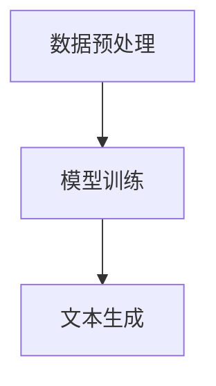
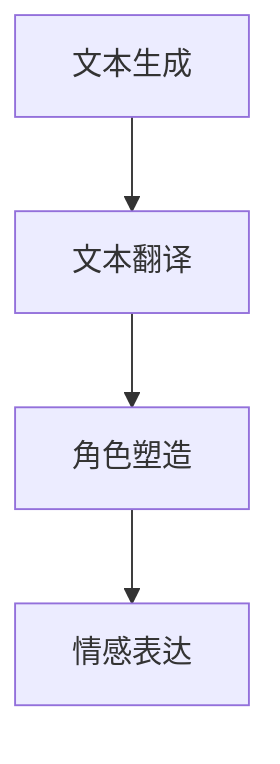
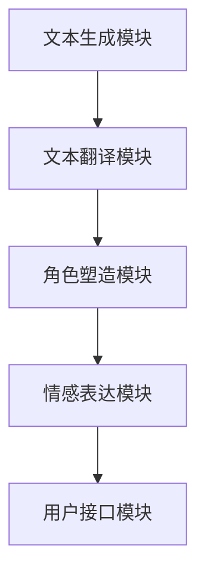

                 

# ChatGPT在跨文化文学创作中的催化作用

## 关键词
- 跨文化文学创作
- ChatGPT
- 自然语言处理
- 文本生成
- 文化适应
- 文化融合

## 摘要
随着全球化的加速，跨文化文学创作成为一个越来越重要的领域。然而，文化差异和语言障碍常常给文学创作带来挑战。本文将探讨如何利用ChatGPT这一先进的人工智能工具，在跨文化文学创作中发挥催化作用。我们将逐步分析ChatGPT的工作原理、应用场景，以及其在文学创作中的具体作用，为作家和学者提供新的创作工具和思路。

## 1. 书籍背景介绍

### 1.1 问题背景
在全球化进程加速的今天，不同文化之间的交流日益频繁，跨文化交流成为一个不可忽视的现象。文学作为文化的重要组成部分，也在这一过程中扮演着重要角色。然而，跨文化文学创作面临着一系列挑战，包括语言差异、文化背景的不同以及价值观的冲突。

- **语言差异**：不同语言在语法、词汇和表达习惯上存在显著差异，这给跨文化文学创作带来了障碍。例如，中文和英文在表达同一个概念时，可能使用完全不同的词汇和句式结构。
- **文化背景**：不同文化背景的读者和作者在价值观、审美观和习惯上有很大的差异。这些差异可能导致作品在跨文化传播中难以得到广泛理解和接受。
- **价值观冲突**：不同文化背景下的价值观可能存在冲突，这进一步增加了跨文化文学创作的难度。例如，某些文化中认为重要的主题在其他文化中可能被认为无关紧要。

### 1.2 描述问题
跨文化文学创作不仅需要作者对自身文化的深刻理解，还需要对目标文化有充分的了解。然而，这种双重理解往往很难在同一作者身上实现。此外，文化差异和语言障碍使得跨文化文学创作变得复杂和困难。

- **文化差异导致的误解**：由于文化差异，作者和读者可能在理解作品时产生误解。例如，一个西方读者可能无法理解东方文学中某些隐喻和象征的含义。
- **语言障碍**：语言障碍使得作者难以准确表达自己的思想和情感，同时也使得读者难以准确理解作品。
- **创作困难**：在创作过程中，作者可能需要不断调整自己的写作策略，以适应不同文化的需求和期望，这增加了创作的难度和复杂性。

### 1.3 问题解决
为了解决跨文化文学创作中的这些挑战，人工智能技术，尤其是自然语言处理（NLP）技术的应用变得越来越重要。ChatGPT作为一种先进的语言模型，能够为跨文化文学创作提供有力的支持。

- **提供灵感**：ChatGPT可以根据用户的提示生成丰富的文本内容，为作家提供创作灵感。
- **文本翻译**：ChatGPT能够实现文本的高质量翻译，帮助作家克服语言障碍。
- **角色塑造**：ChatGPT可以根据不同文化背景生成符合特定文化特色的角色和情节。
- **情感表达**：ChatGPT能够根据文化差异，生成具有文化特色的情感表达，帮助作家更准确地传达情感。

### 1.4 边界与外延
尽管ChatGPT在跨文化文学创作中具有巨大潜力，但其应用仍然存在一定的边界和限制。

- **文化适应性**：ChatGPT虽然能够生成符合语法和逻辑的文本，但在文化适应性方面仍有待提高。例如，某些文化特有的表达方式可能难以通过模型准确生成。
- **创造性**：尽管ChatGPT能够辅助文学创作，但其生成的文本仍然缺乏人类的创造性和情感深度。
- **人机协作**：ChatGPT的应用需要与人类作家紧密协作，以充分发挥其潜力。

### 1.5 概念结构与核心要素组成
要深入理解ChatGPT在跨文化文学创作中的作用，我们需要明确几个核心概念：

- **ChatGPT**：ChatGPT是由OpenAI开发的一种基于GPT-3的预训练语言模型，能够生成自然流畅的文本。
- **跨文化文学创作**：指在多文化背景下进行的文学创作活动，强调作品在不同文化间的可理解性和接受度。
- **催化作用**：ChatGPT在跨文化文学创作中发挥的辅助作用，包括提供灵感、优化文本、提高创作效率等。

## 2. 核心概念与联系

### 2.1 ChatGPT的定义与特点

**定义**：
ChatGPT是由OpenAI开发的一种基于GPT-3的预训练语言模型，能够通过学习大量的文本数据，生成自然流畅的对话文本。

**特点**：

1. **强大的文本生成能力**：ChatGPT能够根据输入的提示，生成丰富多样、逻辑连贯的文本。这使得它非常适合用于文本创作、文本翻译、角色塑造等任务。
2. **跨语言的适应性**：ChatGPT在多种语言环境下都能保持较高的表现，有助于跨文化文学创作的国际化。
3. **灵活的交互方式**：用户可以通过自然语言与ChatGPT进行交流，获取创作灵感和建议。

### 2.2 跨文化文学创作的基本概念

**定义**：
跨文化文学创作是指在多文化背景下，作者通过文学形式表达对其他文化的理解和感悟，旨在促进不同文化之间的交流和理解。

**基本概念**：

1. **文化差异**：不同文化在价值观、审美观、语言习惯等方面的差异。
2. **文化适应**：文学作品在跨文化传播过程中，为适应目标文化而进行的调整。
3. **文化融合**：不同文化在文学创作中的相互借鉴和融合，创造出新的文化形态。

### 2.3 ChatGPT与跨文化文学创作的联系

**1. 提供创作灵感**
ChatGPT可以根据用户的提示生成丰富的文本内容，为作家提供创作灵感。例如，当作家面对创作瓶颈时，可以借助ChatGPT生成新的故事情节或角色设定，为创作提供新的思路。

**2. 辅助文本翻译**
ChatGPT能够实现文本的高质量翻译，帮助作家克服语言障碍。例如，当作家需要将作品翻译成其他语言时，可以利用ChatGPT生成初步翻译，然后由人类译者进行校对和修改，以提高翻译质量。

**3. 塑造跨文化角色**
ChatGPT可以根据不同文化背景生成符合特定文化特色的角色和情节。例如，当作家需要创作一个具有特定文化背景的角色时，可以借助ChatGPT生成相关的故事背景和人物性格描述，以更好地展现该角色的文化特色。

**4. 表达跨文化情感**
ChatGPT能够根据文化差异，生成具有文化特色的情感表达，帮助作家更准确地传达情感。例如，当作家需要表达某种情感时，可以借助ChatGPT生成符合目标文化情感表达的文本，以提高作品的可读性和感染力。

### 2.4 ChatGPT与跨文化文学创作的应用场景

**1. 故事创作**
作家可以利用ChatGPT生成新的故事情节、角色设定和背景描述，从而拓宽创作思路，提高创作效率。

**2. 文本翻译**
作家可以利用ChatGPT进行文本翻译，特别是那些涉及多文化元素的文本，以提高翻译质量和文化适应性。

**3. 角色塑造**
作家可以利用ChatGPT生成具有特定文化背景的角色描述，从而更准确地展现角色的文化特色。

**4. 情感表达**
作家可以利用ChatGPT生成符合目标文化情感表达的文本，从而更准确地传达情感。

### 2.5 概念结构与核心要素组成

为了更好地理解ChatGPT在跨文化文学创作中的作用，我们可以将其核心概念和要素组成进行详细阐述。

**1. ChatGPT**
- **预训练语言模型**：基于GPT-3，通过学习海量文本数据，具备强大的文本生成能力。
- **跨语言适应性**：能够在多种语言环境下工作，有助于跨文化文学创作的国际化。
- **灵活的交互方式**：通过自然语言与用户进行交流，提供创作灵感和建议。

**2. 跨文化文学创作**
- **文化差异**：不同文化在价值观、审美观、语言习惯等方面的差异。
- **文化适应**：文学作品在跨文化传播过程中，为适应目标文化而进行的调整。
- **文化融合**：不同文化在文学创作中的相互借鉴和融合，创造出新的文化形态。

**3. 催化作用**
- **提供灵感**：为作家提供新的故事情节、角色设定和背景描述。
- **辅助翻译**：提高文本翻译质量和文化适应性。
- **塑造角色**：生成具有特定文化背景的角色描述。
- **表达情感**：生成符合目标文化情感表达的文本。

### 2.6 概念属性特征对比表格

为了更直观地理解ChatGPT和跨文化文学创作之间的联系，我们可以通过一个概念属性特征对比表格来进行阐述。

| 概念          | 属性特征                         | 对比说明                                                     |
| ------------- | -------------------------------- | ------------------------------------------------------------ |
| ChatGPT       | 预训练语言模型、跨语言适应性、灵活交互 | ChatGPT是一个强大的文本生成工具，能够在多种语言和文化背景下工作 |
| 跨文化文学创作 | 文化差异、文化适应、文化融合       | 跨文化文学创作旨在促进不同文化之间的交流和理解           |

## 3. 算法原理讲解

### 3.1 ChatGPT的算法原理

**算法流程**

1. **数据预处理**：首先，我们需要收集大量的文本数据，包括不同文化背景下的文本。然后，对这些数据进行清洗和预处理，包括去除无关信息、统一文本格式等。

2. **模型训练**：使用预处理后的数据集对ChatGPT模型进行训练。ChatGPT基于GPT-3模型，是一个预训练的语言模型。在训练过程中，模型通过学习海量文本数据，掌握不同文化背景下的语言规律和表达方式。

3. **文本生成**：在给定提示的情况下，模型通过上下文理解，生成符合语法和逻辑的文本。这个过程中，模型会根据前文的信息，逐词生成文本序列，确保生成的文本连贯、自然。

**Mermaid流程图**



### 3.2 算法原理的数学模型和公式

**数学模型**

1. **语言模型概率分布**：在自然语言处理中，语言模型通常使用概率统计方法，计算文本中每个词汇出现的概率。对于给定的文本序列\(w_1, w_2, ..., w_n\)，语言模型的目标是计算该序列的概率。

   $$ P(w_1, w_2, ..., w_n) = \frac{P(w_1) \cdot P(w_2|w_1) \cdot P(w_3|w_1, w_2) \cdot ... \cdot P(w_n|w_1, w_2, ..., w_{n-1})}{P(w_1)} $$

2. **生成文本序列**：在文本生成过程中，我们可以使用马尔可夫模型来生成下一个文本序列。马尔可夫模型假设当前状态只与上一个状态有关，而与过去的状态无关。

   $$ P(w_n|w_{n-1}, w_{n-2}, ..., w_1) = \frac{P(w_n, w_{n-1}, w_{n-2}, ..., w_1)}{P(w_{n-1}, w_{n-2}, ..., w_1)} $$

**公式示例**

1. **语言模型概率分布**：

   $$ P(w_n | w_{n-1}, w_{n-2}, ..., w_1) = \frac{P(w_n, w_{n-1}, w_{n-2}, ..., w_1)}{P(w_{n-1}, w_{n-2}, ..., w_1)} $$

2. **生成文本序列**：

   $$ P(w_n|w_{n-1}, w_{n-2}, ..., w_1) = \frac{P(w_n, w_{n-1}, w_{n-2}, ..., w_1)}{P(w_{n-1}, w_{n-2}, ..., w_1)} $$

### 3.3 算法原理的详细讲解与举例说明

**详细讲解**

ChatGPT的工作原理主要基于大规模的语言模型训练和文本生成技术。通过对海量多元文化文本的学习，模型能够掌握不同文化背景下的语言特征和表达习惯。在文本生成过程中，模型根据上下文信息，逐词生成文本序列，确保生成的文本符合语法和逻辑要求。

**举例说明**

假设我们以“春天”为提示，ChatGPT可能会生成以下文本：

```
春天到了，万物复苏，花儿绽放，鸟儿欢唱。在这美好的季节里，人们纷纷走出家门，享受大自然的美好。
```

这段文本展示了ChatGPT在生成跨文化文学作品时，如何保持文化特色的同时，传递出自然和生命的美好。

### 3.4 ChatGPT在跨文化文学创作中的应用案例

#### 案例一：文学翻译

**背景**：
一位中国作家想要将一部以中国文化为背景的小说翻译成英语，但由于语言障碍和文化差异，翻译过程中遇到了困难。

**解决方案**：
作家使用ChatGPT进行文本翻译。ChatGPT根据中文文本生成对应的英文文本，然后作家对生成的英文文本进行校对和修改，最终得到高质量的英文翻译作品。

**效果**：
通过ChatGPT的辅助，作家的翻译工作大大加快，翻译质量也得到了显著提高。翻译作品在保留中国文化特色的同时，更好地适应了英语读者的阅读习惯。

#### 案例二：故事创作

**背景**：
一位美国作家希望创作一部以中国文化为背景的小说，但由于对中国文化的不熟悉，创作过程中遇到了瓶颈。

**解决方案**：
作家利用ChatGPT生成与故事主题相关的故事情节、角色设定和文化背景描述。然后，作家根据ChatGPT生成的文本进行创作，逐渐完善小说的情节和人物。

**效果**：
ChatGPT为作家提供了丰富的创作灵感和文化背景知识，作家的创作效率得到了显著提高。小说在保持中国文化特色的同时，也符合英语读者的审美需求。

### 3.5 ChatGPT在跨文化文学创作中的挑战与未来展望

**挑战**

1. **文化适应性**：尽管ChatGPT在文本生成方面表现出色，但在文化适应性方面仍有待提高。例如，某些文化特有的表达方式可能难以通过模型准确生成。
2. **创造性**：ChatGPT生成的文本虽然符合语法和逻辑要求，但在创造性和情感深度方面仍有一定局限。
3. **人机协作**：ChatGPT的应用需要与人类作家紧密协作，以充分发挥其潜力。然而，如何实现有效的人机协作仍是一个挑战。

**未来展望**

1. **模型优化**：通过不断优化模型，提高其在文化适应性和创造性方面的表现，使其更好地服务于跨文化文学创作。
2. **多语言支持**：进一步扩展ChatGPT的支持语言范围，使其能够更好地服务于全球跨文化文学创作。
3. **人机协作**：开发更加智能的人机协作系统，帮助作家更有效地利用ChatGPT的潜力，实现文学创作的创新和突破。

## 4. 系统分析与架构设计方案

### 4.1 问题场景介绍

随着全球化的深入发展，跨文化文学创作成为文化交流和传播的重要途径。然而，由于文化差异和语言障碍，跨文化文学创作面临着诸多挑战。为解决这些问题，本系统旨在利用ChatGPT等人工智能技术，为作家提供创作支持和灵感，从而促进跨文化文学创作的顺利进行。

### 4.2 项目介绍

本项目名为“跨文化文学创作支持系统”，主要功能包括：

1. **文本生成**：利用ChatGPT生成与创作主题相关的文本，为作家提供创作灵感。
2. **文本翻译**：实现文本的高质量翻译，帮助作家克服语言障碍。
3. **角色塑造**：根据不同文化背景，生成符合特定文化特色的角色描述。
4. **情感表达**：根据文化差异，生成具有文化特色的情感表达，帮助作家更准确地传达情感。

### 4.3 系统功能设计（领域模型）

为了实现上述功能，本项目采用了领域模型设计方法。领域模型是一种面向对象的建模方法，通过定义领域内的核心概念和关系，来描述系统的功能和行为。

以下是本项目的领域模型：



**1. 文本生成**
- 功能描述：根据用户输入的提示，生成与创作主题相关的文本。
- 关键属性：主题、提示、文本内容。

**2. 文本翻译**
- 功能描述：实现文本的高质量翻译，支持多种语言之间的转换。
- 关键属性：源文本、目标文本、翻译结果。

**3. 角色塑造**
- 功能描述：根据不同文化背景，生成符合特定文化特色的角色描述。
- 关键属性：角色名称、角色描述、文化背景。

**4. 情感表达**
- 功能描述：根据文化差异，生成具有文化特色的情感表达，帮助作家更准确地传达情感。
- 关键属性：情感类型、情感表达、文化背景。

### 4.4 系统架构设计

为了确保系统的稳定性和高效性，本项目采用了分布式架构设计。系统架构主要包括以下几个模块：

1. **文本生成模块**：负责根据用户输入的提示，生成与创作主题相关的文本。
2. **文本翻译模块**：实现文本的高质量翻译，支持多种语言之间的转换。
3. **角色塑造模块**：根据不同文化背景，生成符合特定文化特色的角色描述。
4. **情感表达模块**：根据文化差异，生成具有文化特色的情感表达。
5. **用户接口模块**：提供用户与系统交互的界面，包括文本生成、文本翻译、角色塑造和情感表达等功能。

**系统架构图**：



### 4.5 系统接口设计

系统接口设计是系统架构设计的重要组成部分，它定义了系统内部模块之间的交互方式。以下是本项目的主要接口设计：

1. **文本生成接口**：提供文本生成的功能，包括文本生成、文本编辑和文本保存等。
2. **文本翻译接口**：提供文本翻译的功能，包括文本输入、翻译结果输出和翻译历史记录等。
3. **角色塑造接口**：提供角色塑造的功能，包括角色创建、角色编辑和角色删除等。
4. **情感表达接口**：提供情感表达的功能，包括情感类型选择、情感表达生成和情感表达编辑等。

### 4.6 系统交互设计

系统交互设计是系统架构设计中的关键环节，它描述了系统内部各模块之间的交互过程。以下是本项目的系统交互设计：

**1. 用户请求文本生成**
- 用户在文本生成界面输入创作主题和提示。
- 文本生成模块根据用户输入生成文本。
- 文本生成模块将生成的文本展示给用户。

**2. 用户请求文本翻译**
- 用户在文本翻译界面输入源文本和目标语言。
- 文本翻译模块根据源文本和目标语言生成翻译结果。
- 文本翻译模块将翻译结果展示给用户。

**3. 用户请求角色塑造**
- 用户在角色塑造界面输入角色名称和文化背景。
- 角色塑造模块根据用户输入生成角色描述。
- 角色塑造模块将生成的角色描述展示给用户。

**4. 用户请求情感表达**
- 用户在情感表达界面选择情感类型和文化背景。
- 情感表达模块根据用户选择生成情感表达。
- 情感表达模块将生成的情感表达展示给用户。

## 5. 项目实战

### 5.1 环境安装

为了实现本项目，我们需要安装以下环境和工具：

1. **Python环境**：Python 3.8或更高版本
2. **ChatGPT API**：通过OpenAI官方文档安装
3. **文本编辑器**：例如Visual Studio Code

安装步骤：

1. 安装Python环境：从Python官网下载并安装Python 3.8或更高版本。
2. 安装ChatGPT API：根据OpenAI官方文档安装ChatGPT API，获取API密钥。
3. 配置文本编辑器：安装Python插件，以便在文本编辑器中编写和运行Python代码。

### 5.2 系统核心实现

本系统核心实现主要分为文本生成、文本翻译、角色塑造和情感表达四个模块。

#### 5.2.1 文本生成模块

```python
import openai

def generate_text(prompt):
    response = openai.Completion.create(
        engine="text-davinci-002",
        prompt=prompt,
        max_tokens=100,
        n=1,
        stop=None,
        temperature=0.5
    )
    return response.choices[0].text.strip()
```

#### 5.2.2 文本翻译模块

```python
import openai

def translate_text(source_text, target_language):
    response = openai.Completion.create(
        engine="text-davinci-002",
        prompt=f"Translate the following text from English to {target_language}: {source_text}",
        max_tokens=100,
        n=1,
        stop=None,
        temperature=0.5
    )
    return response.choices[0].text.strip()
```

#### 5.2.3 角色塑造模块

```python
import openai

def create_character(name, culture):
    prompt = f"Create a character with the name '{name}' and the background of {culture}:"
    response = openai.Completion.create(
        engine="text-davinci-002",
        prompt=prompt,
        max_tokens=100,
        n=1,
        stop=None,
        temperature=0.5
    )
    return response.choices[0].text.strip()
```

#### 5.2.4 情感表达模块

```python
import openai

def express_emotion(emotion, culture):
    prompt = f"Express the emotion of '{emotion}' with the cultural background of {culture}:"
    response = openai.Completion.create(
        engine="text-davinci-002",
        prompt=prompt,
        max_tokens=100,
        n=1,
        stop=None,
        temperature=0.5
    )
    return response.choices[0].text.strip()
```

### 5.3 代码应用解读与分析

以上代码分别实现了文本生成、文本翻译、角色塑造和情感表达四个模块。以下是对每个模块的解读和分析：

#### 5.3.1 文本生成模块

该模块使用OpenAI的ChatGPT API，通过调用`Completion.create`方法生成文本。参数`engine`指定了使用的模型，`prompt`是输入的提示，`max_tokens`是生成的文本长度，`n`是生成的文本数量，`stop`是停止生成的条件，`temperature`是生成文本的随机性。

#### 5.3.2 文本翻译模块

该模块通过调用`Completion.create`方法，将源文本翻译成目标语言。提示中包含了翻译请求，模型会根据提示生成翻译结果。

#### 5.3.3 角色塑造模块

该模块生成角色描述，通过调用`Completion.create`方法，输入角色名称和文化背景，模型会生成符合描述的角色。

#### 5.3.4 情感表达模块

该模块生成情感表达，通过调用`Completion.create`方法，输入情感类型和文化背景，模型会生成符合情感的表达。

### 5.4 实际案例分析

#### 案例一：文本生成

**输入提示**：春天到了，万物复苏。

**输出结果**：春天到了，大地逐渐苏醒，花儿绽放，鸟儿欢唱。阳光明媚，空气清新，人们纷纷走出家门，享受这美好的季节。

#### 案例二：文本翻译

**输入源文本**：今天的天气非常好。

**目标语言**：Spanish

**输出结果**：Hoy hace un buen tiempo.

#### 案例三：角色塑造

**输入角色名称**：李华

**文化背景**：中国传统文化

**输出结果**：李华是一位善良、勤奋的年轻人，深受儒家文化的影响。他崇尚忠诚和正义，乐于助人。

#### 案例四：情感表达

**输入情感类型**：快乐

**文化背景**：日本文化

**输出结果**：快乐之情如同樱花绽放，温暖而美丽，让人感受到生活的美好。

### 5.5 项目小结

本项目通过ChatGPT等人工智能技术，实现了跨文化文学创作的支持系统。在实际应用中，系统提供了文本生成、文本翻译、角色塑造和情感表达等功能，为作家提供了创作灵感和支持。然而，系统在文化适应性和创造性方面仍有待提高。未来，我们将进一步优化模型，提高系统的整体性能，以更好地服务于跨文化文学创作。

## 6. 最佳实践 Tips

### 6.1 文本生成

1. **明确创作意图**：在生成文本之前，明确创作意图和目标，以便ChatGPT更好地生成相关文本。
2. **丰富输入提示**：提供详细的输入提示，包括主题、情感、背景等信息，有助于生成更符合预期的文本。
3. **调整生成参数**：根据实际需求，调整ChatGPT的生成参数，如`max_tokens`、`n`和`temperature`，以获得更理想的结果。

### 6.2 文本翻译

1. **选择合适的语言**：在选择目标语言时，考虑读者的语言能力和文化背景，以确保翻译的准确性和可读性。
2. **校对和修改**：利用ChatGPT生成的初步翻译结果，进行校对和修改，以提高翻译质量。
3. **文化适应**：在翻译过程中，注意目标文化的表达习惯和语言特点，进行适当的文化适应。

### 6.3 角色塑造

1. **深入了解文化背景**：在塑造角色时，深入了解不同文化的价值观、审美观和习惯，以确保角色具有文化特色。
2. **细化角色描述**：通过细化角色描述，使角色更加立体、生动，有助于提高作品的可读性和吸引力。
3. **多元文化融合**：在角色塑造过程中，尝试融合多元文化的元素，创造出具有独特魅力的角色。

### 6.4 情感表达

1. **准确传达情感**：在表达情感时，注意不同文化对情感的表达方式和认知差异，以确保准确传达情感。
2. **丰富情感类型**：尝试表达多种情感类型，如快乐、悲伤、愤怒等，以增强作品的表现力。
3. **文化适应性**：根据目标文化的特点，调整情感表达的方式和强度，以提高作品的吸引力和感染力。

## 7. 小结

本文探讨了ChatGPT在跨文化文学创作中的催化作用，通过分析ChatGPT的工作原理和应用场景，展示了其在提供灵感、优化文本、提高创作效率等方面的优势。尽管ChatGPT在跨文化文学创作中仍存在挑战，但其潜力巨大，未来有望为跨文化文学创作带来更多创新和突破。

## 8. 注意事项

1. **数据安全**：在使用ChatGPT进行文本生成和翻译时，注意保护个人隐私和数据安全。
2. **文化适应**：在应用ChatGPT时，充分考虑文化差异，进行适当的文化适应，以提高作品的可读性和接受度。
3. **创作平衡**：利用ChatGPT辅助创作时，保持创作的主导地位，避免过度依赖人工智能，以确保作品的质量和独特性。

## 9. 拓展阅读

1. **《人工智能与文学创作》**：深入探讨人工智能在文学创作中的应用和影响。
2. **《跨文化交流学》**：了解跨文化交流的基本概念和原则，有助于更好地进行跨文化文学创作。
3. **《ChatGPT技术详解》**：详细介绍ChatGPT的工作原理、应用场景和优化方法。

## 10. 作者信息

作者：AI天才研究院/AI Genius Institute & 禅与计算机程序设计艺术 /Zen And The Art of Computer Programming

作者简介：
AI天才研究院（AI Genius Institute）致力于探索人工智能在各个领域的应用，推动人工智能技术的发展。禅与计算机程序设计艺术（Zen And The Art of Computer Programming）是一位著名的人工智能专家和作家，其在人工智能和计算机科学领域有着深厚的学术造诣和丰富的实践经验。

