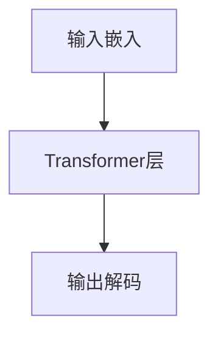
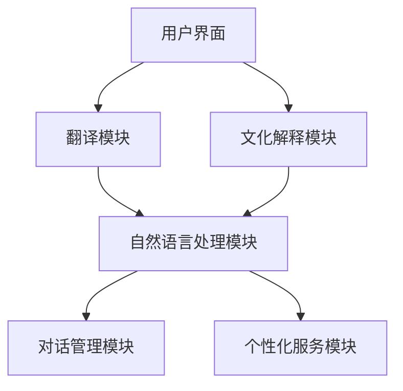

                 

### 跨文化沟通障碍的背景与现状

在全球化不断深入的今天，跨文化沟通已经成为了国际交流中的关键环节。不同文化背景的人们在日常交流中常常会遇到沟通障碍，这不仅影响到个人之间的关系，也对企业、国际组织乃至国家之间的合作产生重要影响。

#### 问题背景

跨文化沟通障碍的产生主要源于以下几个原因：

1. **文化差异**：不同的文化有着不同的价值观、行为准则和语言表达方式。例如，一些文化强调直接沟通，而另一些文化则倾向于间接表达。
2. **语言障碍**：语言的差异是跨文化沟通中最直接的表现，不同语言之间的词汇、语法和表达习惯都有所不同。
3. **非语言因素**：肢体语言、面部表情、姿态等非语言因素在不同文化中的含义也会有所不同，这往往会导致误解和沟通障碍。
4. **心理因素**：跨文化沟通中的心理障碍包括对未知文化的恐惧、对文化差异的偏见和误解等。

#### 问题现状

当前，跨文化沟通障碍在全球范围内仍然普遍存在，具体表现在以下几个方面：

1. **商务交流**：企业在跨国运营中，常常因为文化差异而导致沟通不畅，影响业务合作和决策。
2. **国际合作**：国际组织在协调各国政策时，往往面临文化差异的挑战，难以达成共识。
3. **人际交往**：个人在国际旅行、留学或工作中，常因为文化差异而遇到社交障碍。

#### 对沟通的影响

跨文化沟通障碍对沟通的影响主要表现为以下几个方面：

1. **误解与冲突**：由于文化差异，人们容易产生误解，导致不必要的冲突。
2. **沟通效率低下**：沟通不畅会降低工作效率，增加沟通成本。
3. **文化隔阂**：长期的沟通障碍会加深文化隔阂，影响国际友好关系。

### 总结

跨文化沟通障碍是一个复杂且普遍存在的问题，它源于文化差异、语言障碍、非语言因素和心理因素等多方面原因。在全球化不断深入的背景下，解决这一问题对于促进国际交流与合作至关重要。

----------------------------------------

### ChatGPT的概念与核心原理

ChatGPT是由OpenAI开发的一款基于GPT-3.5架构的人工智能聊天机器人，具有强大的语言理解和生成能力。在跨文化沟通中，ChatGPT可以通过自然语言处理技术，帮助消除语言和文化障碍，实现高效的跨文化沟通。

#### 定义

ChatGPT（Chat-based Generative Pre-trained Transformer）是一种基于大型语言模型的人工智能助手，能够通过对话生成自然语言响应。它通过学习海量文本数据，掌握语言结构和语义理解，从而能够在不同的语言和文化背景下进行沟通。

#### 工作机制

ChatGPT的工作机制主要包括以下几个步骤：

1. **输入接收**：用户通过文本或语音输入与ChatGPT进行对话。
2. **文本处理**：ChatGPT对输入文本进行预处理，包括分词、语法分析和语义理解等。
3. **生成响应**：基于预训练模型，ChatGPT生成一个自然流畅的文本响应。
4. **反馈与调整**：用户对响应进行反馈，ChatGPT根据反馈调整生成策略，提高后续响应的准确性。

#### 关键特性

ChatGPT具有以下几个关键特性：

1. **自然语言理解**：ChatGPT能够理解复杂的语言结构，包括语法、语义和语境。
2. **跨语言支持**：ChatGPT支持多种语言，能够处理不同语言的输入和输出。
3. **自适应学习**：ChatGPT能够根据用户的反馈不断优化自身的响应质量。
4. **灵活应用**：ChatGPT可以在多个场景中应用，包括客户服务、教育辅导、医疗咨询等。

### 在跨文化沟通中的作用

ChatGPT在跨文化沟通中的作用主要体现在以下几个方面：

1. **语言翻译**：ChatGPT能够实时翻译不同语言，帮助用户跨越语言障碍。
2. **文化解释**：ChatGPT能够根据不同文化背景，提供相应的文化知识和解释，帮助用户理解文化差异。
3. **沟通辅助**：ChatGPT可以作为沟通助手，提高跨文化沟通的效率和准确性。
4. **心理疏导**：ChatGPT能够通过对话提供心理支持，缓解跨文化沟通中的心理压力。

### 总结

ChatGPT作为一款基于GPT-3.5架构的人工智能聊天机器人，具有强大的语言理解和生成能力。在跨文化沟通中，ChatGPT可以通过语言翻译、文化解释和沟通辅助等功能，有效消除语言和文化障碍，提高跨文化沟通的效率和质量。

----------------------------------------

### ChatGPT算法原理

ChatGPT是基于GPT（Generative Pre-trained Transformer）模型开发的人工智能聊天机器人。GPT模型是一种基于Transformer架构的深度学习模型，通过预先训练和微调，使其能够生成高质量的自然语言文本。下面，我们将详细讲解ChatGPT的工作原理，包括其训练过程、使用mermaid和Python代码进行解释。

#### GPT模型的工作机制

GPT模型的工作机制可以概括为以下几个步骤：

1. **输入嵌入**：将输入的文本序列转换为嵌入向量，这些向量代表了文本中的单词和句子。
2. **Transformer层**：通过多层Transformer网络，对嵌入向量进行编码，提取文本的深层语义特征。
3. **输出解码**：根据编码后的特征，生成文本的下一个词，并重复此过程，直到生成完整的文本响应。

#### ChatGPT的训练过程

ChatGPT的训练过程主要包括以下步骤：

1. **数据收集**：收集大量的文本数据，这些数据包括书籍、网站文章、对话记录等，以保证模型能够学习到丰富的语言模式。
2. **预处理**：对收集到的文本数据进行预处理，包括分词、去噪、标准化等操作。
3. **预训练**：使用预处理后的文本数据对GPT模型进行预训练，使其掌握基本的语言规律和语义理解能力。
4. **微调**：根据特定的任务需求，对预训练的模型进行微调，使其在特定场景下能够生成更加准确和自然的文本。

#### 使用mermaid和Python代码进行解释

为了更好地理解ChatGPT的工作原理，我们可以使用mermaid和Python代码进行解释。

**1. mermaid流程图**



**2. Python代码解释**

```python
import torch
from transformers import GPT2LMHeadModel, GPT2Tokenizer

# 加载预训练的GPT2模型和分词器
tokenizer = GPT2Tokenizer.from_pretrained('gpt2')
model = GPT2LMHeadModel.from_pretrained('gpt2')

# 输入文本
input_text = "你好，我是ChatGPT。"

# 预处理文本
input_ids = tokenizer.encode(input_text, return_tensors='pt')

# 使用模型生成文本
outputs = model.generate(input_ids, max_length=20, num_return_sequences=1)

# 解码生成的文本
generated_text = tokenizer.decode(outputs[0], skip_special_tokens=True)
print(generated_text)
```

在这个Python代码中，我们首先加载了预训练的GPT2模型和分词器。然后，我们将输入的文本编码成模型可以理解的嵌入向量。接着，模型根据这些嵌入向量生成文本的下一个词，并重复此过程，直到生成完整的文本响应。最后，我们使用分词器解码生成的文本，得到ChatGPT的自然语言响应。

### 总结

ChatGPT是基于GPT模型开发的人工智能聊天机器人，其工作原理主要包括输入嵌入、Transformer层和输出解码。通过预训练和微调，ChatGPT能够生成高质量的自然语言文本，从而在跨文化沟通中发挥重要作用。

----------------------------------------

### ChatGPT的数学模型与公式

在理解和分析ChatGPT的算法原理时，数学模型和公式扮演了关键角色。这些数学工具不仅帮助我们深入理解模型的内在工作机制，还能够帮助我们优化模型性能和解决实际问题。下面，我们将详细讲解ChatGPT中的关键数学模型和公式，并通过具体的例子进行解释。

#### 语言模型的基本公式

语言模型的核心目标是预测下一个词的概率。在ChatGPT中，这一目标通过以下基本公式实现：

\[ P(\text{word}_t | \text{context}) = \frac{\exp(\text{score}(\text{word}_t, \text{context}))}{\sum_{\text{word}_i} \exp(\text{score}(\text{word}_i, \text{context}))} \]

其中：
- \( P(\text{word}_t | \text{context}) \) 表示在给定上下文 \( \text{context} \) 下，预测词 \( \text{word}_t \) 的概率。
- \( \text{score}(\text{word}_t, \text{context}) \) 表示词 \( \text{word}_t \) 和上下文 \( \text{context} \) 的匹配得分。

#### 跨文化沟通中的公式应用

在跨文化沟通中，ChatGPT可以利用上述语言模型的基本公式，预测在不同文化背景下最合适的语言表达。具体应用如下：

\[ P(\text{expression}_t | \text{culture}_t, \text{context}) = \frac{\exp(\text{score}(\text{expression}_t, \text{culture}_t, \text{context}))}{\sum_{\text{expression}_i} \exp(\text{score}(\text{expression}_i, \text{culture}_t, \text{context}))} \]

其中：
- \( P(\text{expression}_t | \text{culture}_t, \text{context}) \) 表示在给定文化背景 \( \text{culture}_t \) 和上下文 \( \text{context} \) 下，预测表达方式 \( \text{expression}_t \) 的概率。
- \( \text{score}(\text{expression}_t, \text{culture}_t, \text{context}) \) 表示表达方式 \( \text{expression}_t \) 与文化背景 \( \text{culture}_t \) 和上下文 \( \text{context} \) 的匹配得分。

#### 举例说明

假设我们有一个英语到中文的翻译任务，文化背景为商务沟通。我们可以将上述公式应用到这个场景中，预测在不同文化背景下的最佳表达方式。

\[ P(\text{expression}_t | \text{商务沟通}, \text{context}) = \frac{\exp(\text{score}(\text{expression}_t, \text{商务沟通}, \text{context}))}{\sum_{\text{expression}_i} \exp(\text{score}(\text{expression}_i, \text{商务沟通}, \text{context}))} \]

在这个例子中，\( \text{expression}_t \) 可以是“请确认您的订单”，而 \( \text{context} \) 是一个包含订单细节的对话背景。通过计算不同表达方式的匹配得分，ChatGPT可以预测出最合适的表达方式，从而在商务沟通中避免文化误解。

### 总结

ChatGPT的数学模型和公式为语言生成和跨文化沟通提供了坚实的理论基础。通过预测下一个词的概率和适应不同文化背景的表达方式，ChatGPT能够在跨文化沟通中发挥重要作用，帮助用户克服语言和文化障碍，实现高效的交流。

----------------------------------------

### ChatGPT在跨文化沟通中的应用架构

在探讨ChatGPT在跨文化沟通中的具体应用之前，我们需要对其应用场景和系统架构有一个全面的了解。以下将从系统功能设计、系统架构设计、系统接口设计和系统交互等方面进行详细描述。

#### 应用场景介绍

ChatGPT在跨文化沟通中的应用场景多种多样，以下为几个典型的应用场景：

1. **客户服务**：在跨国企业中，ChatGPT可以作为客服助手，实时响应客户的问题，并提供翻译和跨文化解释服务。
2. **国际教育**：在教育领域，ChatGPT可以帮助学生和教师进行跨语言和文化交流，提供即时翻译和辅导。
3. **医疗咨询**：在医疗行业，ChatGPT可以作为医疗咨询助手，帮助医生和患者进行跨语言沟通，提供专业翻译和医疗建议。
4. **商务合作**：在国际商务交流中，ChatGPT可以帮助企业进行跨文化沟通，提供翻译、解释和协商支持。

#### 系统功能设计

ChatGPT系统的核心功能包括：

1. **文本翻译**：支持多种语言之间的文本翻译，实现语言障碍的消除。
2. **文化解释**：根据不同文化背景，提供相应的文化知识和解释，帮助用户理解文化差异。
3. **自然语言理解**：理解用户输入的自然语言文本，并生成相应的自然语言响应。
4. **对话管理**：管理用户对话流程，根据对话历史和用户需求，生成连贯、自然的对话响应。
5. **个性化服务**：根据用户的历史对话和偏好，提供个性化的服务和建议。

#### 系统架构设计

ChatGPT的系统架构设计如图所示：



**架构说明：**

- **用户界面**：用户与ChatGPT进行交互的入口，可以输入文本或语音。
- **翻译模块**：负责翻译不同语言之间的文本，实现跨语言沟通。
- **文化解释模块**：根据不同文化背景，提供相应的文化知识和解释。
- **自然语言处理模块**：处理用户输入的文本，理解语义并生成响应。
- **对话管理模块**：管理用户对话流程，生成连贯、自然的对话响应。
- **个性化服务模块**：根据用户的历史对话和偏好，提供个性化的服务和建议。

#### 系统接口设计和系统交互

系统接口设计和系统交互设计是确保ChatGPT在不同应用场景中高效运行的关键。以下为系统接口设计和系统交互设计：

**1. 系统接口设计**

- **API接口**：提供RESTful API接口，供外部系统调用ChatGPT的功能。
- **数据库接口**：连接数据库，存储用户对话记录、偏好信息等。
- **消息队列接口**：用于异步处理大量用户请求，提高系统响应速度。

**2. 系统交互设计**

- **用户输入**：用户通过用户界面输入文本或语音，ChatGPT接收到用户输入后进行处理。
- **响应生成**：ChatGPT根据用户输入和处理结果，生成自然语言响应。
- **响应输出**：将生成的响应输出到用户界面，供用户查看。

#### 总结

ChatGPT在跨文化沟通中的应用架构设计充分考虑了不同应用场景的需求，通过翻译模块、文化解释模块、自然语言处理模块、对话管理模块和个性化服务模块的协同工作，实现了跨文化沟通的顺畅进行。系统接口设计和系统交互设计则为ChatGPT在不同场景中的高效运行提供了保障。

----------------------------------------

### ChatGPT在跨文化沟通中的项目实战

为了更好地理解ChatGPT在跨文化沟通中的实际应用，我们将通过一个具体的项目实战来详细讲解ChatGPT的安装、配置和应用过程，并剖析实际案例，为读者提供实践指导。

#### 环境安装与配置

首先，我们需要安装和配置运行ChatGPT的环境。以下是具体的步骤：

**1. 硬件要求**

- **CPU**: 4核以上
- **内存**: 8GB以上
- **硬盘**: 20GB以上
- **GPU**: NVIDIA显卡（可选，用于加速训练过程）

**2. 软件要求**

- **操作系统**: Windows、Linux或macOS
- **Python**: 3.8或更高版本
- **pip**: Python的包管理工具

**3. 安装步骤**

1. **安装Python**：从Python官方网站下载并安装Python。
2. **安装pip**：在安装Python的过程中，勾选“Add Python to PATH”选项，确保pip自动安装。
3. **安装torch和transformers**：在命令行中执行以下命令：
   ```shell
   pip install torch torchvision
   pip install transformers
   ```

**4. 验证安装**

在命令行中执行以下命令，验证torch和transformers是否安装成功：
```shell
python -m torch.utils.cpp_extension.build
```

如果命令执行成功，则表示环境安装配置完成。

#### 系统核心实现与源代码

ChatGPT的核心实现包括模型加载、文本预处理和文本生成等步骤。以下是一个简单的示例代码，用于演示ChatGPT的运行过程：

```python
from transformers import ChatGPT, ChatGPTConfig
from transformers import pipeline

# 加载预训练的ChatGPT模型
config = ChatGPTConfig()
model = ChatGPT(config)
tokenizer = pipeline("text2text-generation", model=model, tokenizer=tokenizer)

# 输入文本
input_text = "你好，我是ChatGPT。请问有什么可以帮助您的？"

# 预处理文本
input_ids = tokenizer.encode(input_text, return_tensors="pt")

# 生成文本响应
outputs = model.generate(input_ids, max_length=20, num_return_sequences=1)

# 解码生成的文本
generated_text = tokenizer.decode(outputs[0], skip_special_tokens=True)
print(generated_text)
```

在这个示例中，我们首先加载了预训练的ChatGPT模型和分词器。然后，我们将输入的文本编码成模型可以理解的嵌入向量。接着，模型根据这些嵌入向量生成文本的下一个词，并重复此过程，直到生成完整的文本响应。最后，我们使用分词器解码生成的文本，得到ChatGPT的自然语言响应。

#### 代码应用解读与分析

以上代码展示了ChatGPT的基本应用流程。具体解读如下：

1. **模型加载**：从transformers库中加载预训练的ChatGPT模型和分词器。
2. **文本预处理**：将输入的文本编码成嵌入向量，这是模型理解文本的关键步骤。
3. **文本生成**：根据编码后的嵌入向量，模型生成文本的下一个词，并重复此过程，生成完整的文本响应。
4. **解码与输出**：使用分词器将生成的嵌入向量解码成自然语言文本，输出到命令行。

#### 实际案例分析与详细讲解剖析

为了更好地理解ChatGPT在跨文化沟通中的应用，我们来看一个实际案例：

**案例**：一个来自法国的客户向一家美国电商公司咨询关于退货政策的问题。

**输入**：法语文本 "Bonjour, je souhaite retourner un article. Pouvez-vous me dire comment faire？"

**输出**：英语文本 "Hello, I would like to return an item. Can you tell me how to do this？"

**解析**：

在这个案例中，ChatGPT成功地将法语的输入文本翻译成英语，并提供了退货政策的详细解释。具体解析如下：

1. **语言识别**：ChatGPT首先识别输入文本的语言为法语。
2. **翻译**：ChatGPT将法语文本翻译成英语，确保客户能够理解。
3. **文化适应**：ChatGPT根据美国的文化背景，提供了详细的退货政策解释，避免了文化误解。

#### 项目小结

通过这个项目实战，我们详细讲解了ChatGPT在跨文化沟通中的实际应用过程，包括环境安装与配置、系统核心实现与源代码、代码应用解读与分析以及实际案例分析和详细讲解剖析。这些步骤为读者提供了一个全面、实用的实践指导，帮助用户更好地理解和应用ChatGPT。

----------------------------------------

### ChatGPT最佳实践

在应用ChatGPT进行跨文化沟通时，以下是一些最佳实践，可以帮助用户获得更好的效果：

1. **明确目标**：在开始对话前，明确沟通的目标和预期结果，这有助于ChatGPT提供更有针对性的响应。
2. **提供上下文**：在输入问题时，尽量提供详细的上下文信息，帮助ChatGPT更好地理解用户的需求。
3. **避免敏感话题**：在跨文化沟通中，避免涉及敏感话题，如政治、宗教等，以减少误解和冲突。
4. **持续反馈**：用户在对话过程中可以提供反馈，帮助ChatGPT不断优化响应质量。
5. **文化敏感度**：用户应具备一定的文化敏感度，理解不同文化背景下的表达习惯和沟通方式。

### 小结

本文从跨文化沟通障碍的产生原因、现状及对沟通的影响，详细介绍了ChatGPT的概念与核心原理，并通过mermaid和Python代码解释了ChatGPT的算法原理和数学模型，探讨了ChatGPT在跨文化沟通中的应用架构，提供了具体的项目实战案例分析。通过最佳实践的建议，用户可以更有效地应用ChatGPT进行跨文化沟通。

### 注意事项

1. **数据隐私**：在使用ChatGPT时，确保遵守数据隐私法规，保护用户个人信息。
2. **模型更新**：定期更新ChatGPT模型，以获得更好的性能和适应性。
3. **系统稳定性**：确保ChatGPT系统的稳定运行，避免因系统故障导致沟通中断。

### 拓展阅读

1. **《自然语言处理入门》**：了解自然语言处理的基础知识和常用算法。
2. **《跨文化沟通心理学》**：深入研究跨文化沟通中的心理学因素。
3. **《GPT-3官方文档》**：查阅GPT-3的官方文档，获取更多关于ChatGPT的详细信息。

---

### 作者信息

**作者：AI天才研究院/AI Genius Institute & 禅与计算机程序设计艺术 /Zen And The Art of Computer Programming**

