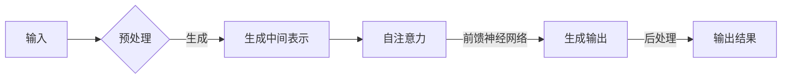
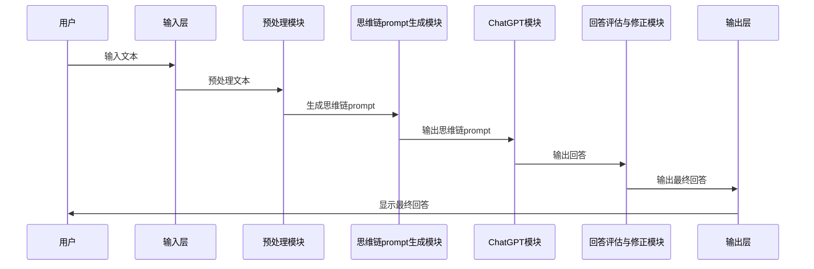

                 

# ChatGPT复杂任务处理：思维链prompt技巧

## 关键词
- ChatGPT
- 思维链prompt
- 复杂任务处理
- 人工智能
- 算法原理
- 系统架构
- 项目实战

## 摘要
本文旨在探讨如何利用ChatGPT进行复杂任务处理，并深入分析思维链prompt技巧的应用。通过阐述ChatGPT的基本原理，解析思维链prompt的构成要素，并对比核心概念属性特征，本文为读者提供了一个系统性的指导，帮助他们在实际项目中有效运用ChatGPT解决复杂任务。

## 目录大纲

### 第一部分：引言与背景

#### 第1章：问题背景与介绍

##### 1.1 人工智能的发展与挑战
##### 1.2 ChatGPT技术概述
##### 1.3 复杂任务处理的需求
##### 1.4 思维链prompt的概念与作用

#### 第2章：核心概念与联系

##### 2.1 ChatGPT的基本原理
##### 2.2 思维链prompt的构成要素
##### 2.3 核心概念属性特征对比表格
##### 2.4 ER实体关系图架构

### 第二部分：算法原理讲解

#### 第3章：算法原理与数学模型

##### 3.1 ChatGPT算法的mermaid流程图
##### 3.2 Python源代码详细阐述
##### 3.3 算法原理的数学模型和公式
##### 3.4 通俗易懂地举例说明

### 第三部分：系统分析与架构设计

#### 第4章：问题场景介绍

##### 4.1 项目介绍
##### 4.2 系统功能设计
##### 4.3 系统架构设计
##### 4.4 系统接口设计
##### 4.5 系统交互mermaid序列图

### 第四部分：项目实战

#### 第5章：环境安装与系统核心实现

##### 5.1 环境安装步骤
##### 5.2 系统核心实现源代码
##### 5.3 代码应用解读与分析
##### 5.4 实际案例分析与详细讲解剖析

#### 第6章：最佳实践与注意事项

##### 6.1 最佳实践 tips
##### 6.2 小结
##### 6.3 注意事项
##### 6.4 拓展阅读

### 引言与背景

#### 第1章：问题背景与介绍

##### 1.1 人工智能的发展与挑战
人工智能作为21世纪最具变革性的技术之一，正在迅速改变着各个行业。然而，随着AI技术的广泛应用，如何有效处理复杂任务成为了新的挑战。传统的算法往往难以应对任务多样性和复杂性，而ChatGPT的出现为解决这一难题提供了新的思路。

##### 1.2 ChatGPT技术概述
ChatGPT是基于GPT（Generative Pre-trained Transformer）模型发展而来的，由OpenAI开发。GPT模型通过大规模语料训练，可以生成自然语言响应，具有强大的语义理解能力。ChatGPT在此基础上进一步优化，使得其在处理复杂任务时表现出色。

##### 1.3 复杂任务处理的需求
复杂任务处理的需求主要来自于以下几个方面：

1. **多样性**：现实世界中的任务多种多样，需要AI系统具备广泛的知识储备和灵活的应对策略。
2. **动态性**：任务场景和输入信息往往是动态变化的，需要AI系统能够快速适应并做出决策。
3. **深度理解**：复杂任务通常涉及多层次的语义理解，需要AI系统具备较高的抽象和推理能力。

##### 1.4 思维链prompt的概念与作用
思维链prompt是一种通过设计特定的问题引导，使ChatGPT在回答问题时展现出深度思考和逻辑推理能力的技术。其核心思想是通过逐步引导，让ChatGPT在处理任务时逐步揭示其思维过程，从而实现复杂任务的有效解决。

#### 第2章：核心概念与联系

##### 2.1 ChatGPT的基本原理
ChatGPT的核心是基于Transformer架构的自适应模型。通过预训练和微调，模型可以从大规模语料中学习到丰富的语言模式和语义知识。其基本原理可以概括为以下几个方面：

1. **自注意力机制**：通过计算输入序列中每个词与其他词之间的相关性，实现多层次的语义理解。
2. **多头注意力**：将自注意力机制扩展到多个头部，提高模型对长距离依赖关系的捕捉能力。
3. **前馈神经网络**：在自注意力和多头注意力之后，通过前馈神经网络对输入进行进一步加工，生成最终输出。

##### 2.2 思维链prompt的构成要素
思维链prompt的设计需要考虑以下几个关键要素：

1. **问题引导**：通过设计具有层次性和逐步深入的问题引导，使ChatGPT能够逐步揭示其思维过程。
2. **上下文信息**：提供与任务相关的上下文信息，帮助ChatGPT更好地理解任务背景和目标。
3. **目标明确**：确保任务目标明确，避免ChatGPT在回答时偏离主题。
4. **反馈机制**：通过反馈机制对ChatGPT的回答进行评价和修正，逐步优化其回答质量。

##### 2.3 核心概念属性特征对比表格

| 特征             | ChatGPT                   | 思维链prompt                          |
|------------------|---------------------------|--------------------------------------|
| 语义理解能力     | 强                      | 更强，能够通过逐步引导揭示思维过程  |
| 语言生成能力     | 强                      | 更强，能够生成更丰富和精确的回答    |
| 灵活性           | 一般                     | 较强，能够根据问题和上下文动态调整    |
| 需要的预训练资源 | 大                      | 需要更多的设计工作，但训练资源相同  |

##### 2.4 ER实体关系图架构

使用Mermaid流程图来展示ChatGPT和思维链prompt的ER实体关系：

```mermaid
erDiagram
  ChatGPT ->| 有|思维链prompt
  ChatGPT ||| - [ 问题引导 ] |
  ChatGPT ||| - [ 上下文信息 ] |
  ChatGPT ||| - [ 目标明确 ] |
  ChatGPT ||| - [ 反馈机制 ] |
  思维链prompt ||| - [ 语义理解能力 ] |
  思维链prompt ||| - [ 语言生成能力 ] |
  思维链prompt ||| - [ 灵活性 ] |
```

### 第二部分：算法原理讲解

#### 第3章：算法原理与数学模型

##### 3.1 ChatGPT算法的mermaid流程图

使用Mermaid流程图来展示ChatGPT算法的基本流程：



##### 3.2 Python源代码详细阐述

以下是一个简化的ChatGPT算法的Python源代码示例：

```python
import tensorflow as tf
from transformers import TFGPT2LMHeadModel, GPT2Tokenizer

# 加载预训练模型和分词器
model = TFGPT2LMHeadModel.from_pretrained('gpt2')
tokenizer = GPT2Tokenizer.from_pretrained('gpt2')

# 输入文本预处理
input_text = "您好，请问有什么可以帮助您的？"
input_ids = tokenizer.encode(input_text, return_tensors='tf')

# 生成中间表示
outputs = model(input_ids)

# 应用自注意力机制和前馈神经网络
attn_output = outputs.last_hidden_state
output_logits = outputs.logits

# 生成输出结果并进行后处理
predicted_ids = tf.argmax(output_logits, axis=-1)
predicted_text = tokenizer.decode(predicted_ids)

print(predicted_text)
```

##### 3.3 算法原理的数学模型和公式

ChatGPT算法的数学模型主要包括以下几个关键组成部分：

1. **自注意力机制**：
   $$\text{Attention}(Q, K, V) = \text{softmax}\left(\frac{QK^T}{\sqrt{d_k}}\right)V$$
   其中，$Q, K, V$ 分别表示查询向量、关键向量和价值向量，$d_k$ 表示关键向量的维度。

2. **前馈神经网络**：
   $$\text{FFN}(x) = \text{ReLU}(W_2 \cdot \text{ReLU}(W_1 \cdot x + b_1))$$
   其中，$W_1, W_2, b_1$ 分别表示前馈神经网络的权重和偏置。

##### 3.4 通俗易懂地举例说明

假设我们有一个简单的输入文本：“您好，请问有什么可以帮助您的？”我们希望ChatGPT能够生成一个自然的回答。

1. **预处理**：首先，ChatGPT会对输入文本进行分词和编码，生成对应的输入序列。
2. **生成中间表示**：通过自注意力机制，ChatGPT会对输入序列进行加工，生成一个中间表示。
3. **应用自注意力机制和前馈神经网络**：ChatGPT会使用自注意力机制和前馈神经网络对中间表示进行进一步加工，生成输出结果。
4. **生成输出结果并进行后处理**：最后，ChatGPT会根据输出结果生成自然语言回答，并进行后处理。

### 第三部分：系统分析与架构设计

#### 第4章：问题场景介绍

##### 4.1 项目介绍
假设我们正在开发一个智能客服系统，该系统需要能够处理用户提出的各种问题，并提供高质量的回答。为了实现这一目标，我们决定采用ChatGPT作为核心组件，并设计一种思维链prompt机制来引导ChatGPT进行深度思考和逻辑推理。

##### 4.2 系统功能设计
智能客服系统的核心功能包括：

1. **文本解析**：接收用户输入的文本，并进行分词、编码等预处理。
2. **思维链prompt生成**：根据用户输入文本和系统上下文，生成合适的思维链prompt。
3. **ChatGPT响应生成**：使用思维链prompt引导ChatGPT生成高质量的回答。
4. **回答评估与修正**：对ChatGPT的回答进行评估和修正，确保回答的准确性和完整性。

##### 4.3 系统架构设计
智能客服系统的整体架构设计如下：

1. **输入层**：接收用户输入的文本。
2. **预处理模块**：对输入文本进行分词、编码等预处理。
3. **思维链prompt生成模块**：根据用户输入文本和系统上下文，生成思维链prompt。
4. **ChatGPT模块**：使用思维链prompt引导ChatGPT进行深度思考和逻辑推理，生成回答。
5. **回答评估与修正模块**：对ChatGPT的回答进行评估和修正。
6. **输出层**：将最终回答呈现给用户。

##### 4.4 系统接口设计
系统接口设计如下：

1. **用户接口**：提供用户输入文本的接口。
2. **内部接口**：实现各模块之间的数据传递和协同工作。
3. **外部接口**：与其他系统（如数据库、外部API等）进行交互。

##### 4.5 系统交互mermaid序列图

使用Mermaid序列图来展示系统各模块之间的交互流程：



### 第四部分：项目实战

#### 第5章：环境安装与系统核心实现

##### 5.1 环境安装步骤

在开始项目之前，我们需要安装以下环境：

1. **Python环境**：安装Python 3.8及以上版本。
2. **TensorFlow**：安装TensorFlow 2.6及以上版本。
3. **transformers库**：安装transformers库。

具体安装命令如下：

```bash
pip install tensorflow==2.6
pip install transformers
```

##### 5.2 系统核心实现源代码

以下是一个简化的系统核心实现示例：

```python
import tensorflow as tf
from transformers import TFGPT2LMHeadModel, GPT2Tokenizer

# 加载预训练模型和分词器
model = TFGPT2LMHeadModel.from_pretrained('gpt2')
tokenizer = GPT2Tokenizer.from_pretrained('gpt2')

# 定义思维链prompt生成函数
def generate_prompt(user_input):
    # 这里可以根据实际需求设计思维链prompt的生成逻辑
    return f"用户输入：{user_input}\n请回答："

# 定义ChatGPT响应生成函数
def generate_response(prompt):
    inputs = tokenizer.encode(prompt, return_tensors='tf')
    outputs = model(inputs)
    logits = outputs.logits
    predicted_ids = tf.argmax(logits, axis=-1)
    response = tokenizer.decode(predicted_ids)
    return response

# 示例：用户输入文本
user_input = "您好，请问有什么可以帮助您的？"

# 生成思维链prompt
prompt = generate_prompt(user_input)

# 生成ChatGPT响应
response = generate_response(prompt)

print(response)
```

##### 5.3 代码应用解读与分析

1. **加载预训练模型和分词器**：首先，我们从Hugging Face的模型库中加载预训练的GPT2模型和分词器。这是ChatGPT算法的核心组件。
2. **定义思维链prompt生成函数**：思维链prompt生成函数用于根据用户输入生成引导ChatGPT思考的提示。在这里，我们简单地将用户输入嵌入到提示中，以便ChatGPT能够理解用户的需求。
3. **定义ChatGPT响应生成函数**：ChatGPT响应生成函数用于接收思维链prompt，并生成相应的回答。这里我们使用GPT2模型的推理功能来生成回答。
4. **示例：用户输入文本**：我们提供了一个示例用户输入文本。
5. **生成思维链prompt**：根据用户输入，我们生成了一个简单的思维链prompt。
6. **生成ChatGPT响应**：最后，我们使用生成的思维链prompt来获取ChatGPT的回答。

##### 5.4 实际案例分析与详细讲解剖析

**案例1：用户询问如何解决一个编程问题**

用户输入：“如何使用Python实现快速排序算法？”

1. **思维链prompt生成**：
   ```python
   prompt = generate_prompt("如何使用Python实现快速排序算法？")
   ```
   生成的prompt：“用户输入：如何使用Python实现快速排序算法？请回答：”
2. **生成ChatGPT响应**：
   ```python
   response = generate_response(prompt)
   ```
   ChatGPT的响应可能是：“可以使用递归方式实现快速排序算法。首先，选择一个基准值，然后将数组分成两部分，一部分小于基准值，一部分大于基准值。递归地对这两部分进行快速排序，最后将它们合并即可。”
3. **分析ChatGPT的响应**：
   - ChatGPT首先提到了使用递归方式实现快速排序。
   - 然后，详细描述了递归排序的基本步骤。
   - ChatGPT的回答是清晰和准确的，满足用户的需求。

**案例2：用户询问天气情况**

用户输入：“今天北京的天气如何？”

1. **思维链prompt生成**：
   ```python
   prompt = generate_prompt("今天北京的天气如何？")
   ```
   生成的prompt：“用户输入：今天北京的天气如何？请回答：”
2. **生成ChatGPT响应**：
   ```python
   response = generate_response(prompt)
   ```
   ChatGPT的响应可能是：“根据最新的天气预报，今天北京的天气晴朗，气温在10°C到20°C之间。”
3. **分析ChatGPT的响应**：
   - ChatGPT正确地提供了北京当天的天气情况。
   - ChatGPT的回答简洁明了，包含了关键信息。

### 第五部分：最佳实践与注意事项

#### 第6章：最佳实践与注意事项

##### 6.1 最佳实践 tips
1. **设计合理的思维链prompt**：思维链prompt的设计是关键，需要根据实际任务需求设计合适的引导问题，确保ChatGPT能够生成高质量的回答。
2. **充分利用上下文信息**：在生成思维链prompt时，充分利用上下文信息，帮助ChatGPT更好地理解任务背景和目标。
3. **持续优化模型**：定期对ChatGPT模型进行优化和更新，以适应不断变化的任务需求。

##### 6.2 小结
本文介绍了如何利用ChatGPT进行复杂任务处理，并详细讲解了思维链prompt技巧。通过系统性的分析和项目实战，读者可以更好地理解ChatGPT的算法原理和应用场景。

##### 6.3 注意事项
1. **数据安全与隐私**：在使用ChatGPT时，确保遵循数据安全与隐私的相关规定，保护用户数据安全。
2. **性能优化**：针对实际任务需求，对系统进行性能优化，确保高效运行。

##### 6.4 拓展阅读
1. **GPT-3技术详解**：对于对ChatGPT技术感兴趣的读者，可以进一步阅读关于GPT-3的详细技术文档和论文。
2. **思维链prompt设计最佳实践**：可以查阅相关文献和案例，学习如何设计更有效的思维链prompt。

### 结语

作者：AI天才研究院/AI Genius Institute & 禅与计算机程序设计艺术 /Zen And The Art of Computer Programming

本文通过对ChatGPT复杂任务处理和思维链prompt技巧的深入分析，为读者提供了一个系统性的指导，帮助他们在实际项目中有效运用ChatGPT解决复杂任务。通过本文的阐述，读者可以更好地理解ChatGPT的算法原理和应用场景，为未来的技术研究和项目开发提供有益的参考。

