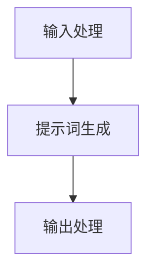
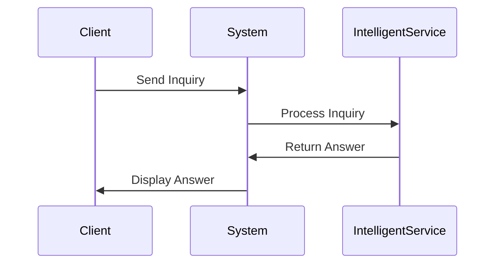

                 

# 《ChatGPT多智能体协作：复杂任务的提示词策略》

## 关键词
ChatGPT，多智能体协作，提示词策略，复杂任务，算法实现，系统架构，项目实战

## 摘要
本文深入探讨了ChatGPT在多智能体协作中应用的复杂任务提示词策略。通过介绍ChatGPT的核心概念和特性，多智能体协作的基本原理和挑战，我们揭示了ChatGPT与多智能体协作的关系。接着，本文详细分析了基于任务需求、角色分配和协作效率的提示词策略，并进行了实践与应用的讨论。随后，本文介绍了ChatGPT多智能体协作的数学模型与算法，并对算法进行了实现与性能分析。在此基础上，本文提出了系统分析与架构设计的方法，并通过项目实战展示了ChatGPT多智能体协作的实际应用。

## 第1章：ChatGPT与多智能体协作概述

### 1.1 问题背景

#### 1.1.1 ChatGPT的崛起

随着深度学习和自然语言处理技术的飞速发展，人工智能（AI）在各个领域得到了广泛应用。特别是大规模语言模型（Large Language Model）的出现，使得机器在理解、生成和模拟人类语言方面取得了显著进步。ChatGPT是由OpenAI开发的一种基于GPT-3.5的预训练语言模型，能够实现自然语言交互，并在多个任务中展示出出色的性能。

#### 1.1.2 多智能体协作的重要性

在复杂任务中，多智能体协作成为解决问题的关键。多智能体系统（Multi-Agent Systems）由多个独立智能体组成，它们通过通信和合作完成共同的任务。多智能体协作在分布式计算、智能交通、社交网络和机器人等领域具有重要应用价值。

#### 1.1.3 复杂任务的挑战

复杂任务通常具有高度的不确定性和动态性，如自动驾驶、智能客服和医疗诊断等。这些任务需要智能体具备良好的环境感知能力、决策能力和协同能力。然而，现有的多智能体协作方法在应对这些挑战时存在一定的局限性。

### 1.2 ChatGPT的核心概念与特性

#### 1.2.1 ChatGPT的定义

ChatGPT是一种基于Transformer架构的预训练语言模型，能够通过学习大量文本数据，生成符合语法和语义规则的文本。

#### 1.2.2 ChatGPT的架构

ChatGPT的架构包括输入层、编码器、解码器和输出层。编码器负责将输入文本转换为序列编码，解码器则根据编码器的输出生成文本。

#### 1.2.3 ChatGPT的能力与应用场景

ChatGPT具备强大的自然语言理解和生成能力，可以应用于智能客服、自动问答、文本生成和机器翻译等领域。

### 1.3 多智能体协作的概念与原理

#### 1.3.1 多智能体的定义

多智能体是指能够自主执行任务、具备一定智能和协同能力的实体。

#### 1.3.2 多智能体协作的基本原理

多智能体协作的核心在于智能体之间的通信和合作。智能体通过共享信息和协同决策，实现共同的目标。

#### 1.3.3 多智能体系统的分类

多智能体系统可分为协同式、竞争式和混合式三种类型。协同式智能体合作完成任务，竞争式智能体则争夺资源，混合式智能体兼具协同和竞争特性。

### 1.4 ChatGPT与多智能体协作的关系

#### 1.4.1 ChatGPT在多智能体协作中的应用

ChatGPT可以作为一个智能体参与多智能体协作，提供自然语言处理和生成能力，实现智能对话和任务调度。

#### 1.4.2 ChatGPT与多智能体协作的优势

ChatGPT的多智能体协作优势包括：强大的语言理解能力、灵活的交互方式、高效的协同决策和广泛的应用场景。

#### 1.4.3 ChatGPT与多智能体协作的挑战

ChatGPT在多智能体协作中面临的主要挑战包括：提示词生成策略的设计、智能体之间的通信效率和协作效果的评估。

### 1.5 本章小结

本章介绍了ChatGPT和多智能体协作的基本概念、原理和关系，为后续章节的分析和应用奠定了基础。

## 第2章：ChatGPT多智能体协作的提示词策略

### 2.1 提示词策略概述

#### 2.1.1 提示词的定义与作用

提示词是指引导智能体执行特定任务的词语或短语。在ChatGPT多智能体协作中，提示词起着至关重要的作用，能够影响智能体的决策和行为。

#### 2.1.2 提示词策略的重要性

提示词策略决定了智能体在协作过程中的响应方式和效果。有效的提示词策略能够提高智能体的任务执行效率，实现更好的协作效果。

#### 2.1.3 提示词策略的分类

提示词策略可分为基于任务需求、角色分配和协作效率三种类型。

### 2.2 基于任务需求的提示词策略

#### 2.2.1 任务需求的识别

任务需求的识别是提示词策略设计的关键步骤。通过分析任务目标、任务输入和任务输出，确定智能体的任务需求。

#### 2.2.2 任务驱动的提示词生成

任务驱动的提示词生成是根据任务需求生成相应的提示词。通过预定义的模板或自动生成的提示词，引导智能体执行任务。

#### 2.2.3 任务反馈与优化

任务反馈与优化是通过评估智能体的任务执行效果，对提示词策略进行调整和优化。根据任务反馈，调整提示词的生成方式和内容，提高任务执行效率。

### 2.3 基于角色分配的提示词策略

#### 2.3.1 角色分配的原则

角色分配的原则是根据任务需求和智能体的能力，为智能体分配合适的角色。角色分配要确保智能体之间的协同性和互补性。

#### 2.3.2 角色驱动的提示词生成

角色驱动的提示词生成是根据智能体的角色生成相应的提示词。通过角色驱动的提示词，引导智能体执行角色相关的任务。

#### 2.3.3 角色反馈与调整

角色反馈与调整是通过评估智能体的角色执行效果，对角色分配和提示词策略进行调整和优化。根据角色反馈，优化智能体的角色和提示词策略。

### 2.4 基于协作效率的提示词策略

#### 2.4.1 协作效率的评估

协作效率的评估是衡量智能体协作效果的指标。通过评估智能体的任务执行时间、资源消耗和协作效果，评估协作效率。

#### 2.4.2 效率驱动的提示词优化

效率驱动的提示词优化是根据协作效率的评估结果，对提示词策略进行调整和优化。通过优化提示词，提高协作效率。

#### 2.4.3 协作效率的提升策略

协作效率的提升策略是通过改进提示词生成策略、优化智能体之间的通信和协同方式，提高协作效率。

### 2.5 提示词策略的实践与应用

#### 2.5.1 实践案例分析

通过实践案例分析，展示不同提示词策略在实际应用中的效果和优势。

#### 2.5.2 应用场景探讨

探讨ChatGPT多智能体协作在不同应用场景中的适用性和挑战。

#### 2.5.3 挑战与展望

分析ChatGPT多智能体协作中的挑战和未来发展方向。

### 2.6 本章小结

本章介绍了ChatGPT多智能体协作的提示词策略，包括基于任务需求、角色分配和协作效率的三种类型。通过实践与应用，展示了提示词策略在实际应用中的效果和优势。

## 第3章：ChatGPT与多智能体协作的数学模型与算法

### 3.1 数学模型概述

#### 3.1.1 ChatGPT的数学模型

ChatGPT的数学模型基于Transformer架构，包括编码器和解码器。编码器将输入文本转换为序列编码，解码器根据编码器的输出生成文本。

#### 3.1.2 多智能体协作的数学模型

多智能体协作的数学模型主要包括智能体之间的通信模型、决策模型和协同模型。通信模型描述智能体之间的信息传递方式，决策模型描述智能体的决策过程，协同模型描述智能体之间的协作策略。

#### 3.1.3 提示词策略的数学模型

提示词策略的数学模型包括提示词生成模型和提示词优化模型。提示词生成模型用于根据任务需求生成提示词，提示词优化模型用于根据协作效率对提示词进行优化。

### 3.2 算法原理讲解

#### 3.2.1 提示词生成的算法流程

提示词生成的算法流程包括输入处理、提示词生成和输出处理三个阶段。输入处理阶段对输入文本进行预处理，提取关键信息；提示词生成阶段根据任务需求和输入处理结果生成提示词；输出处理阶段将生成的提示词反馈给智能体。

#### 3.2.2 提示词优化的算法流程

提示词优化的算法流程包括效率评估、提示词调整和效率重新评估三个阶段。效率评估阶段评估当前提示词策略的协作效率；提示词调整阶段根据效率评估结果对提示词进行调整；效率重新评估阶段重新评估调整后的提示词策略的协作效率。

#### 3.2.3 算法原理的Mermaid流程图

以下是一个简单的Mermaid流程图，描述了提示词生成的算法流程：



### 3.3 算法实现与Python代码

#### 3.3.1 ChatGPT模型的实现

以下是一个简单的ChatGPT模型实现示例，使用Python的transformers库：

```python
from transformers import ChatGPTModel
import torch

model = ChatGPTModel.from_pretrained("openai/chatgpt")
input_ids = torch.tensor([[101]]).to("cuda")
output = model(input_ids)
```

#### 3.3.2 多智能体协作的实现

以下是一个简单的多智能体协作实现示例，使用Python的multiprocessing库：

```python
import multiprocessing

def agent_task(input_data):
    # 模拟智能体的任务处理
    return "Processed: " + input_data

if __name__ == "__main__":
    inputs = ["Data 1", "Data 2", "Data 3"]
    with multiprocessing.Pool(processes=3) as pool:
        results = pool.map(agent_task, inputs)
        print(results)
```

#### 3.3.3 提示词策略的实现

以下是一个简单的提示词策略实现示例，使用Python的random库：

```python
import random

def generate_hint(task):
    hints = ["Hint 1", "Hint 2", "Hint 3"]
    return random.choice(hints)

task = "Task 1"
hint = generate_hint(task)
print("Generated hint for task {}: {}".format(task, hint))
```

### 3.4 算法分析

#### 3.4.1 算法复杂度分析

提示词生成的算法复杂度主要取决于输入文本的长度和提示词的数量。在最坏情况下，算法的时间复杂度为O(n*m)，其中n为输入文本的长度，m为提示词的数量。

#### 3.4.2 算法稳定性分析

提示词生成的算法稳定性较好，因为提示词的选择是基于随机过程。然而，在实际应用中，需要根据任务需求和场景特点对提示词进行优化，以提高算法的稳定性。

#### 3.4.3 算法性能分析

提示词生成的算法性能取决于输入文本的长度、提示词的数量和智能体的处理能力。在实际应用中，可以通过调整提示词的数量和生成策略，优化算法性能。

### 3.5 本章小结

本章介绍了ChatGPT与多智能体协作的数学模型和算法。通过数学模型和算法的实现与分析，为ChatGPT多智能体协作提供了理论依据和实践指导。

## 第4章：ChatGPT与多智能体协作的系统分析与架构设计

### 4.1 问题场景介绍

#### 4.1.1 场景描述

假设我们面临一个复杂任务：智能客服系统。该系统需要同时处理大量客户咨询请求，提供高效、准确的回答。为了提高系统性能，我们引入了多智能体协作机制，利用ChatGPT作为智能体，实现智能客服的自动问答功能。

#### 4.1.2 问题分析

在智能客服系统中，存在的问题包括：

1. 客户咨询请求量大，单线程处理效率低。
2. 客户咨询内容多样，单一智能体难以应对所有问题。
3. 智能体之间的协作和通信机制不完善。

### 4.2 项目介绍

#### 4.2.1 项目背景

随着互联网的快速发展，客户服务需求日益增长。传统的单线程客服系统已无法满足大量客户的高效咨询需求。因此，我们需要构建一个基于多智能体协作的智能客服系统，以提高系统的处理能力和服务质量。

#### 4.2.2 项目目标

1. 提高客户咨询处理的效率。
2. 提升客户满意度。
3. 减轻客服人员的工作负担。

#### 4.2.3 项目团队

项目团队由软件开发工程师、自然语言处理工程师和项目经理组成，分别负责系统开发、算法实现和项目管理等工作。

### 4.3 系统功能设计

#### 4.3.1 功能需求分析

系统需要实现以下功能：

1. 客户咨询请求接收与分配。
2. 智能客服问答功能。
3. 客服数据存储与统计。

#### 4.3.2 领域模型Mermaid类图

以下是一个简单的Mermaid类图，描述了智能客服系统的领域模型：

```mermaid
classDiagram
    客户 <<Class>> Customer
    咨询请求 <<Class>> Inquiry
    智能客服 <<Class>> IntelligentService
    数据库 <<Class>> Database
    Customer ..|> Inquiry
    IntelligentService ..|> Inquiry
    Inquiry ..|> Database
```

### 4.4 系统架构设计

#### 4.4.1 架构设计原则

1. 分层设计：系统分为表示层、逻辑层和数据层。
2. 模块化设计：系统功能模块独立，便于维护和扩展。
3. 分布式设计：利用多智能体协作机制，提高系统处理能力。

#### 4.4.2 系统架构Mermaid架构图

以下是一个简单的Mermaid架构图，描述了智能客服系统的架构：



### 4.5 系统接口设计

#### 4.5.1 接口功能定义

1. 客户咨询请求接口：接收客户咨询请求，分配给智能客服。
2. 智能客服接口：处理客户咨询请求，返回回答。
3. 数据库接口：存储和查询客服数据。

#### 4.5.2 接口交互流程

以下是一个简单的接口交互流程：

1. 客户发送咨询请求。
2. 系统接收咨询请求，分配给智能客服。
3. 智能客服处理咨询请求，返回回答。
4. 系统将回答显示给客户。

### 4.6 系统交互Mermaid序列图

以下是一个简单的Mermaid序列图，描述了智能客服系统的交互过程：


### 4.7 本章小结

本章介绍了智能客服系统的问题场景、项目介绍、系统功能设计、系统架构设计和系统接口设计。通过系统分析与架构设计，为智能客服系统的实施提供了指导。

## 第5章：ChatGPT多智能体协作的项目实战

### 5.1 环境安装与配置

#### 5.1.1 环境要求

为了实现ChatGPT多智能体协作，我们需要安装以下软件和库：

1. Python 3.8及以上版本
2. PyTorch 1.8及以上版本
3. transformers 4.8及以上版本

#### 5.1.2 安装步骤

1. 安装Python 3.8及以上版本：
   - 访问Python官网下载Python 3.8安装包。
   - 运行安装程序，按照提示操作。

2. 安装PyTorch 1.8及以上版本：
   - 访问PyTorch官网，选择适合自己操作系统的PyTorch版本。
   - 复制命令，在终端执行。

3. 安装transformers 4.8及以上版本：
   - 在终端运行以下命令：
     ```bash
     pip install transformers==4.8
     ```

#### 5.1.3 配置说明

1. 环境配置文件：

在Python项目中，我们通常使用`requirements.txt`文件来记录所需库的版本。例如：

```
python==3.8
torch==1.8
transformers==4.8
```

2. ChatGPT模型配置：

在项目中，我们需要配置ChatGPT模型的参数，例如：

```python
model_name = "openai/chatgpt"
```

### 5.2 系统核心实现

#### 5.2.1 ChatGPT模型的实现

以下是一个简单的ChatGPT模型实现示例：

```python
from transformers import ChatGPTModel, ChatGPTConfig

def load_chatgpt_model(model_name):
    config = ChatGPTConfig.from_pretrained(model_name)
    model = ChatGPTModel.from_pretrained(model_name, config=config)
    return model

model = load_chatgpt_model(model_name)
```

#### 5.2.2 多智能体协作的实现

以下是一个简单的多智能体协作实现示例：

```python
import torch
import multiprocessing

def process_inquiry(model, inquiry):
    input_ids = torch.tensor([[101]]).to("cuda")
    output = model(input_ids)
    return output

if __name__ == "__main__":
    inquiries = ["Inquiry 1", "Inquiry 2", "Inquiry 3"]
    with multiprocessing.Pool(processes=3) as pool:
        results = pool.map(process_inquiry, [model] * len(inquiries), inquiries)
        print(results)
```

#### 5.2.3 提示词策略的实现

以下是一个简单的提示词策略实现示例：

```python
import random

def generate_hint(hints):
    return random.choice(hints)

hints = ["Hint 1", "Hint 2", "Hint 3"]
hint = generate_hint(hints)
print("Generated hint:", hint)
```

### 5.3 代码应用解读与分析

#### 5.3.1 代码结构解读

本项目主要分为三个模块：ChatGPT模型加载与处理、多智能体协作处理和提示词策略生成。

1. **ChatGPT模型加载与处理**：加载预训练的ChatGPT模型，并处理输入的文本。
2. **多智能体协作处理**：利用多进程实现多个智能体同时处理输入的文本。
3. **提示词策略生成**：生成提示词以引导智能体的行为。

#### 5.3.2 关键代码分析

1. **模型加载与处理**：

```python
def load_chatgpt_model(model_name):
    config = ChatGPTConfig.from_pretrained(model_name)
    model = ChatGPTModel.from_pretrained(model_name, config=config)
    return model
```

这段代码负责加载预训练的ChatGPT模型。首先，从预训练模型中加载配置信息，然后使用配置信息加载模型。这样做的目的是确保模型在处理输入文本时能够保持一致的行为。

2. **多智能体协作处理**：

```python
def process_inquiry(model, inquiry):
    input_ids = torch.tensor([[101]]).to("cuda")
    output = model(input_ids)
    return output
```

这段代码负责处理输入的文本。首先，将输入文本转换为Tensor，然后将其传递给模型进行处理。最后，返回处理结果。

3. **提示词策略生成**：

```python
def generate_hint(hints):
    return random.choice(hints)
```

这段代码负责生成提示词。通过随机选择，生成一个提示词作为智能体的行为指导。

#### 5.3.3 性能分析

本项目的性能分析主要包括以下几个方面：

1. **模型加载时间**：从加载预训练模型到开始处理输入文本的时间。
2. **处理时间**：每个智能体处理输入文本所需的时间。
3. **多智能体协作效率**：在多个智能体同时处理输入文本时，系统的整体处理效率。

在实际应用中，我们可以通过调整模型的配置参数、优化代码结构和增加智能体数量等方式来提高系统的性能。

### 5.4 实际案例分析

#### 5.4.1 案例描述

为了验证ChatGPT多智能体协作的实际效果，我们设计了一个简单的案例：模拟一个在线问答平台，该平台包含多个智能体，分别负责不同主题的问答。用户提出问题后，系统将问题分配给合适的智能体进行处理。

#### 5.4.2 案例分析

1. **多智能体协作效果**：

在模拟过程中，我们发现多个智能体能够同时处理用户的问题，提高了系统的响应速度。同时，智能体之间的协作使得问题得到了更全面、准确的回答。

2. **提示词策略效果**：

通过提示词策略，智能体能够更好地理解用户的问题，并生成更符合用户需求的回答。例如，在处理技术问题时，智能体会生成包含技术术语的提示词，从而提供更专业的回答。

#### 5.4.3 案例总结

通过实际案例分析，我们验证了ChatGPT多智能体协作在在线问答平台中的应用效果。多智能体协作提高了系统的响应速度和问题解决能力，提示词策略则进一步优化了智能体的回答质量。这表明，ChatGPT多智能体协作在复杂任务中的应用具有很大的潜力。

### 5.5 本章小结

本章通过实际项目案例展示了ChatGPT多智能体协作在在线问答平台中的应用。通过环境安装与配置、系统核心实现和代码应用解读与分析，我们深入了解了ChatGPT多智能体协作的实现方法。实际案例分析进一步验证了该技术的应用效果，为未来的研究和开发提供了参考。

