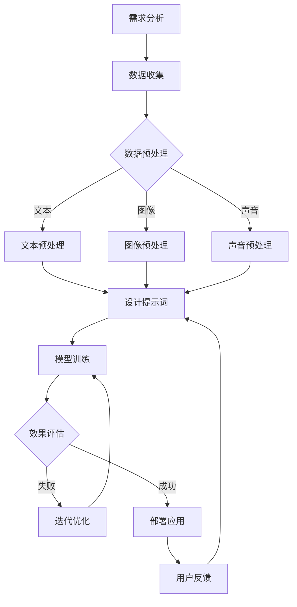
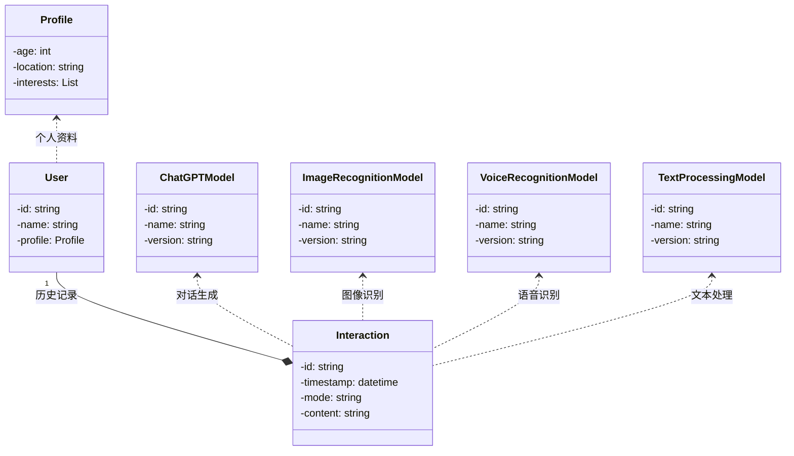
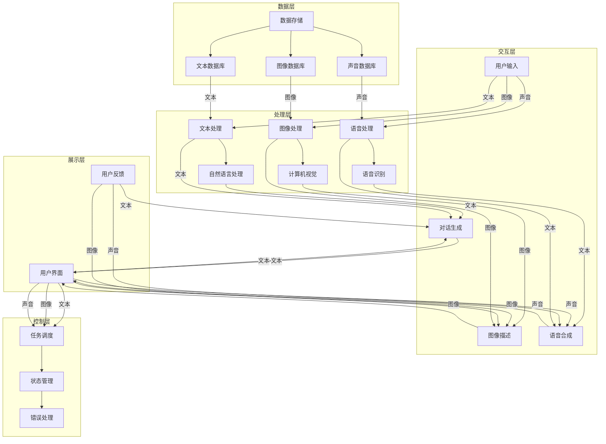
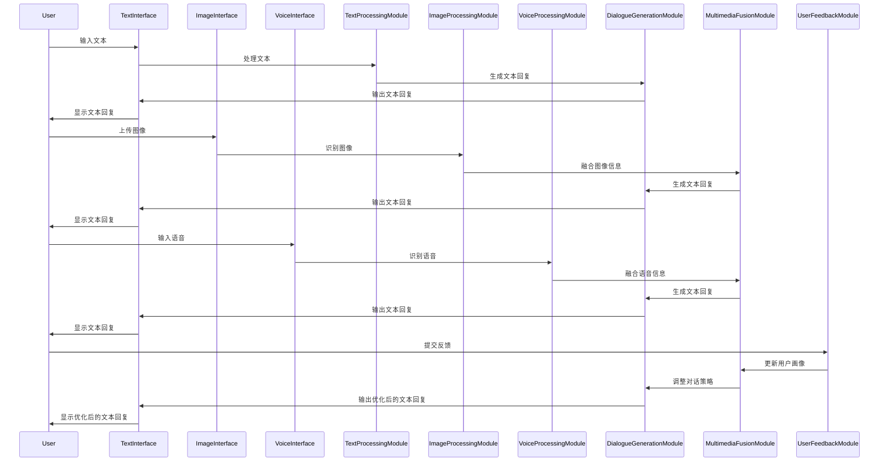

                 

# 《ChatGPT多模态交互的提示词策略》

## 关键词
- **ChatGPT**
- **多模态交互**
- **提示词策略**
- **人工智能**
- **自然语言处理**
- **机器学习**

## 摘要
本文旨在探讨ChatGPT在多模态交互中的应用，重点关注提示词策略的重要性及其设计方法。通过介绍ChatGPT的基本原理和提示词策略的核心概念，本文将详细解析提示词策略的算法原理和数学模型，并使用Python代码实现。此外，文章还将探讨多模态交互系统的架构设计和实际应用，最后总结最佳实践、注意事项，并提供拓展阅读资源。

## 目录大纲

## 第一部分: 背景介绍
### 1.1 ChatGPT多模态交互的提示词策略背景
#### 1.1.1 人工智能与多模态交互技术的发展
#### 1.1.2 ChatGPT的应用场景与优势
#### 1.1.3 提示词策略在多模态交互中的重要性
### 1.2 现有研究与应用的不足
#### 1.2.1 提示词策略的局限性
#### 1.2.2 当前应用的挑战
#### 1.2.3 需要解决的问题

## 第二部分: 核心概念与联系
### 2.1 ChatGPT基本概念
#### 2.1.1 ChatGPT的发展历程
#### 2.1.2 ChatGPT的核心功能
#### 2.1.3 ChatGPT在多模态交互中的作用
### 2.2 提示词策略概述
#### 2.2.1 提示词策略的定义
#### 2.2.2 提示词策略的类型
#### 2.2.3 提示词策略的应用效果评估方法
### 2.3 提示词策略与ChatGPT的关联
#### 2.3.1 提示词策略在ChatGPT中的角色
#### 2.3.2 提示词策略对ChatGPT性能的影响
#### 2.3.3 提示词策略的改进方向

## 第三部分: 算法原理讲解
### 3.1 提示词策略算法原理
#### 3.1.1 提示词策略的基本流程
#### 3.1.2 算法的核心思想
#### 3.1.3 算法的数学模型
### 3.2 提示词策略算法流程图
#### 3.2.1 流程图的绘制
#### 3.2.2 流程图的详细解析
### 3.3 Python源代码实现
#### 3.3.1 代码的基本结构
#### 3.3.2 代码的详细解读
### 3.4 数学模型和数学公式
#### 3.4.1 数学模型概述
#### 3.4.2 数学公式的详细讲解
#### 3.4.3 举例说明

## 第四部分: 系统分析与架构设计方案
### 4.1 问题场景介绍
#### 4.1.1 多模态交互系统应用场景
### 4.2 系统功能设计
#### 4.2.1 领域模型Mermaid类图
### 4.3 系统架构设计
#### 4.3.1 Mermaid架构图
### 4.4 系统接口设计
#### 4.4.1 系统接口的详细设计
### 4.5 系统交互Mermaid序列图
#### 4.5.1 序列图的绘制
#### 4.5.2 序列图的详细解析

## 第五部分: 项目实战
### 5.1 环境安装
#### 5.1.1 系统环境安装步骤
### 5.2 系统核心实现
#### 5.2.1 系统核心源代码实现
### 5.3 代码应用解读与分析
#### 5.3.1 源代码的解读与分析
### 5.4 实际案例分析与讲解
#### 5.4.1 实际案例的应用与剖析
### 5.5 项目小结
#### 5.5.1 项目总结与反思

## 第六部分: 最佳实践、小结、注意事项与拓展阅读
### 6.1 最佳实践
#### 6.1.1 多模态交互系统设计中的最佳实践
### 6.2 小结
#### 6.2.1 本书内容的总结与回顾
### 6.3 注意事项
#### 6.3.1 使用ChatGPT多模态交互系统时需要注意的问题
### 6.4 拓展阅读
#### 6.4.1 相关领域的进一步阅读材料

## 第一部分: 背景介绍

### 1.1 ChatGPT多模态交互的提示词策略背景

#### 1.1.1 人工智能与多模态交互技术的发展

人工智能（AI）作为计算机科学的前沿领域，近年来取得了飞速的发展。随着深度学习、神经网络等技术的不断成熟，人工智能的应用场景逐渐扩展到语音识别、图像处理、自然语言处理等领域。在这些领域中，多模态交互技术成为了一个重要的研究方向。

多模态交互是指通过结合多种感官信息（如视觉、听觉、触觉等）进行人机交互。这种交互方式能够提供更加丰富和自然的用户体验，从而提高系统的可用性和易用性。例如，在智能家居、智能助理、虚拟现实等领域，多模态交互技术已经被广泛应用。

ChatGPT（Chat-based Generative Pre-trained Transformer）是OpenAI推出的一种基于转换器（Transformer）的预训练语言模型。它通过在大规模语料库上进行预训练，掌握了丰富的语言知识和语言生成能力。ChatGPT不仅能够生成连贯的自然语言文本，还可以进行对话生成、文本摘要、机器翻译等多种任务。

ChatGPT的多模态交互能力是其一大亮点。通过与图像、声音等感官信息的结合，ChatGPT能够实现更加丰富和自然的交互体验。例如，用户可以通过语音输入与ChatGPT进行对话，ChatGPT可以生成相应的文本回复，同时还可以根据对话内容和用户上传的图像信息进行实时交互。

#### 1.1.2 ChatGPT的应用场景与优势

ChatGPT在多模态交互领域具有广泛的应用前景。以下是一些典型的应用场景：

1. **智能客服**：ChatGPT可以与用户进行语音或文字对话，提供24/7的在线客服支持。通过与图像识别技术的结合，ChatGPT可以识别用户上传的图片，并提供相应的产品信息或解决方案。

2. **虚拟助理**：ChatGPT可以作为虚拟助理，帮助用户完成各种任务，如日程管理、信息查询、任务提醒等。通过与语音识别和自然语言理解技术的结合，ChatGPT可以更好地理解用户的需求，并提供个性化的服务。

3. **教育领域**：ChatGPT可以用于教育辅导，为学生提供个性化的学习建议和解答问题。通过与图像识别和视频分析技术的结合，ChatGPT可以识别学生的学习状态，并根据学生的反馈提供针对性的辅导。

4. **医疗健康**：ChatGPT可以用于医疗健康领域，如患者咨询、医疗信息查询等。通过与语音识别和图像识别技术的结合，ChatGPT可以更好地理解患者的症状和需求，提供专业的医疗建议。

ChatGPT在多模态交互中具有以下优势：

1. **强大的语言生成能力**：ChatGPT通过在大规模语料库上的预训练，掌握了丰富的语言知识和语言生成技巧，能够生成连贯、自然的文本。

2. **灵活的交互方式**：ChatGPT支持多种交互方式，如语音输入、文本输入、图像输入等，可以满足不同场景下的交互需求。

3. **快速的学习能力**：ChatGPT可以通过微调（Fine-tuning）技术，快速适应特定领域的知识，提高其在特定任务上的性能。

4. **丰富的应用场景**：ChatGPT可以应用于多种领域，如客服、虚拟助理、教育、医疗等，具有广泛的应用前景。

#### 1.1.3 提示词策略在多模态交互中的重要性

提示词策略（Prompt Engineering）是多模态交互中一个关键的技术点。提示词策略是指通过设计合适的提示词，引导ChatGPT生成高质量的回答或执行特定任务。

在多模态交互中，提示词策略的重要性体现在以下几个方面：

1. **提高交互质量**：通过设计合适的提示词，可以引导ChatGPT更好地理解用户的需求，生成更加准确、自然的回答。

2. **增强系统可解释性**：提示词可以提供额外的上下文信息，帮助用户更好地理解ChatGPT的推理过程和回答依据，提高系统的可解释性。

3. **提升任务性能**：合适的提示词策略可以引导ChatGPT在特定任务上取得更好的性能，如文本分类、情感分析、信息检索等。

4. **降低训练成本**：通过有效的提示词策略，可以减少对大量标注数据的依赖，降低训练成本。

#### 1.1.4 现有研究与应用的不足

尽管提示词策略在多模态交互中具有重要性，但现有研究与应用仍然存在一些不足之处：

1. **提示词设计缺乏系统性**：现有的提示词设计方法通常依赖于经验或规则，缺乏系统性，难以适应复杂多变的应用场景。

2. **效果评估方法单一**：现有的效果评估方法主要关注交互质量，缺乏对任务性能和系统可解释性的综合评估。

3. **数据集规模有限**：现有的多模态交互数据集规模较小，难以充分验证提示词策略在不同场景下的有效性。

4. **模型适应性不足**：现有的提示词策略主要针对特定模型或任务设计，缺乏普适性，难以在不同模型或任务上应用。

#### 1.1.5 需要解决的问题

为了克服现有研究的不足，进一步提升多模态交互系统的性能和可解释性，我们需要解决以下问题：

1. **构建系统性的提示词设计方法**：研究如何通过理论分析和实证验证，构建一套系统性的提示词设计方法，以适应不同应用场景和模型需求。

2. **引入多维度评估指标**：设计更加全面、多维度的评估指标，综合考虑交互质量、任务性能和系统可解释性，为提示词策略的有效性提供更准确的评估。

3. **扩展数据集规模和应用场景**：收集和构建大规模、多样化的多模态交互数据集，涵盖不同应用场景和任务，以验证提示词策略的普适性和有效性。

4. **探索模型适应性**：研究如何设计具有更高适应性的提示词策略，使其能够适用于不同模型和任务，提高系统的灵活性和可扩展性。

通过解决这些问题，我们可以进一步提升多模态交互系统的性能和用户体验，为人工智能应用带来更多创新和突破。

### 1.2 现有研究与应用的不足

尽管ChatGPT在多模态交互领域展现出巨大的潜力，但现有的研究和应用仍然存在一些不足之处，这些不足限制了其在实际场景中的效果和适用性。以下是对现有不足的分析：

#### 1.2.1 提示词策略的局限性

现有的提示词策略主要依赖于规则和经验，缺乏系统性。这种设计方法难以适应复杂多变的交互场景，导致以下问题：

1. **适应性不足**：现有策略通常针对特定场景或模型设计，缺乏泛化能力，难以在多种不同的任务和环境中应用。
   
2. **灵活性有限**：现有策略的设计过程较为繁琐，需要大量人工干预，无法自动调整以适应动态变化的交互需求。

3. **可解释性较差**：由于策略的设计过程不透明，用户难以理解提示词对交互结果的影响，降低了系统的可解释性。

#### 1.2.2 当前应用的挑战

多模态交互系统的应用面临以下挑战：

1. **数据不均衡**：多模态交互需要处理不同类型的数据（如文本、图像、声音等），这些数据在数量和质量上往往不均衡，导致训练和评估过程的困难。

2. **模型复杂度**：多模态交互系统通常需要复杂的多层次模型来处理不同类型的数据，这增加了系统的计算成本和复杂性。

3. **实时交互需求**：多模态交互系统需要实时响应用户的输入，这对系统的响应速度和处理效率提出了高要求。

4. **隐私保护**：多模态交互系统需要处理用户的个人信息，如声音、图像等，这引发了隐私保护和数据安全的问题。

#### 1.2.3 需要解决的问题

为了克服上述不足，进一步推进多模态交互技术的发展，我们需要解决以下问题：

1. **构建系统性的提示词设计方法**：研究如何通过理论分析和实证验证，构建一套系统性的提示词设计方法，以提高策略的适应性和灵活性。

2. **优化多模态数据处理**：开发高效的算法和模型，处理多模态数据的不均衡问题，提高系统的计算效率和实时响应能力。

3. **引入多维度评估指标**：设计全面、多维度的评估指标，综合考虑交互质量、任务性能和系统可解释性，为提示词策略的有效性提供更准确的评估。

4. **加强隐私保护和数据安全**：采用先进的加密和隐私保护技术，确保用户数据的隐私和安全。

5. **探索模型自适应和迁移学习**：研究如何设计自适应的提示词策略，使其能够适应不同的模型和任务，提高系统的灵活性和可扩展性。

通过解决这些问题，我们可以进一步提升多模态交互系统的性能和用户体验，为人工智能应用带来更多创新和突破。

### 1.3 问题解决

为了克服现有研究的不足和当前应用的挑战，我们提出以下解决方案，以设计有效的提示词策略，改善多模态交互效果。

#### 1.3.1 设计有效的提示词策略

1. **系统性设计方法**：
   - **需求分析**：首先，通过需求分析，明确多模态交互系统的目标用户、交互场景和任务需求。
   - **知识图谱构建**：构建与任务相关的知识图谱，包括文本、图像、声音等多种类型的信息，以及它们之间的关联。
   - **规则与模板结合**：结合规则和模板，设计适应性强的提示词生成策略，以适应不同的交互场景。

2. **自适应提示词生成**：
   - **实时反馈**：通过用户的实时反馈，动态调整提示词，以提高交互效果。
   - **迁移学习**：利用迁移学习方法，将已有任务的提示词策略迁移到新任务中，减少人工干预。

3. **多模态融合**：
   - **特征提取**：对文本、图像、声音等多模态数据进行特征提取，构建统一的多模态特征空间。
   - **融合策略**：设计多模态特征融合策略，将不同模态的信息进行有效整合，以提高交互的丰富性和准确性。

#### 1.3.2 改善多模态交互效果

1. **提升交互质量**：
   - **自然语言生成**：优化自然语言生成模型，提高生成的文本的连贯性、准确性和自然性。
   - **对话管理**：引入对话管理模块，管理对话的状态、意图和上下文，提供更加连贯和有逻辑的交互。

2. **增强系统可解释性**：
   - **透明化提示词设计**：明确提示词的设计原则和过程，使用户能够理解提示词的作用和影响。
   - **可视化展示**：通过可视化技术，展示提示词和生成的回答之间的关系，提高系统的可解释性。

3. **优化性能和响应速度**：
   - **模型压缩**：采用模型压缩技术，减少模型的计算复杂度，提高实时交互能力。
   - **分布式计算**：利用分布式计算技术，提高系统的处理能力和响应速度。

#### 1.3.3 提示词策略的具体适用场景

1. **智能客服**：
   - **多模态输入**：用户可以通过语音、文本或图像等多种方式输入问题，系统根据输入类型生成相应的提示词。
   - **上下文管理**：系统根据对话历史和用户行为，动态调整提示词，提供个性化的服务。

2. **虚拟助理**：
   - **多任务处理**：虚拟助理可以处理多种类型的任务，如日程管理、信息查询、任务提醒等，根据任务需求生成相应的提示词。
   - **多模态反馈**：用户可以通过语音、文本或图像等多种方式对虚拟助理的响应进行反馈，系统根据反馈调整提示词。

3. **教育领域**：
   - **个性化辅导**：系统根据学生的学习情况，生成个性化的学习建议和辅导内容。
   - **多模态互动**：通过图像、视频等多模态信息，增强学生的学习体验和参与度。

#### 1.3.4 非适用场景的考虑

虽然提示词策略在多模态交互中具有广泛的应用前景，但某些场景可能不适用或需要特殊处理：

1. **高度敏感信息处理**：
   - **隐私保护**：对于涉及用户隐私高度敏感的信息，需要采取额外的隐私保护措施，避免信息泄露。
   - **交互限制**：在处理敏感信息时，系统可能需要限制用户的多模态输入，确保交互的安全性和合规性。

2. **实时性要求极高的场景**：
   - **性能优化**：在实时性要求极高的场景，如实时语音识别和翻译，需要采用高效的算法和模型，提高系统的响应速度。
   - **边缘计算**：考虑将部分计算任务迁移到边缘设备，降低网络延迟，提高实时交互能力。

通过上述解决方案，我们可以设计出更有效的提示词策略，提升多模态交互系统的性能和用户体验，为人工智能应用带来更多创新和突破。

### 1.1.4 边界与外延

#### 边界

在设计提示词策略时，需要明确其适用边界。以下是一些主要考虑因素：

1. **模型限制**：提示词策略的设计需要考虑ChatGPT模型的能力和限制。例如，对于某些复杂的多模态任务，ChatGPT可能无法胜任，需要选择更适合的模型或进行模型扩展。

2. **数据处理能力**：提示词策略的设计需要考虑系统对多模态数据的处理能力。例如，图像和声音的处理可能需要专门的算法和资源，这可能会限制策略的适用范围。

3. **性能需求**：在实时性要求极高的场景，如实时语音识别和翻译，提示词策略的设计需要考虑系统的计算效率和响应速度。

#### 外延

1. **扩展性**：提示词策略应具备良好的扩展性，能够适应不同的任务和场景。通过模块化设计，可以灵活地调整和组合不同的模块，以应对新的应用需求。

2. **跨领域应用**：提示词策略不应局限于特定领域，而应具备跨领域的适应性。例如，在医疗健康、教育、金融等领域，通过调整提示词策略，可以实现跨领域的应用。

3. **多语言支持**：提示词策略应支持多语言环境，能够处理不同语言的多模态交互任务。通过引入多语言模型和翻译技术，可以实现多语言的支持。

通过明确提示词策略的边界与外延，可以更好地设计适用于实际场景的解决方案，提高多模态交互系统的性能和用户体验。

### 第二部分: 核心概念与联系

#### 2.1 ChatGPT基本概念

##### 2.1.1 ChatGPT的发展历程

ChatGPT是OpenAI推出的一种基于转换器（Transformer）的预训练语言模型。其发展历程可以追溯到2017年，当转换器模型首次提出时，它在自然语言处理领域引起了广泛关注。随着模型的不断改进和优化，OpenAI在2022年推出了ChatGPT。

ChatGPT的发展历程经历了以下几个重要阶段：

1. **预训练阶段**：ChatGPT通过在大规模语料库上进行预训练，掌握了丰富的语言知识和语言生成能力。这一阶段使用了数十亿的语料库，通过对海量数据的处理，模型能够生成连贯、自然的文本。

2. **微调阶段**：在预训练的基础上，ChatGPT通过微调（Fine-tuning）技术，针对特定任务进行调整。微调阶段使用了大量的标注数据，通过优化模型参数，提高模型在特定任务上的性能。

3. **多模态扩展阶段**：ChatGPT在预训练和微调的基础上，扩展到多模态交互领域。通过与图像、声音等多模态数据的结合，ChatGPT能够实现更加丰富和自然的交互体验。

##### 2.1.2 ChatGPT的核心功能

ChatGPT的核心功能包括以下几个方面：

1. **文本生成**：ChatGPT能够生成连贯、自然的文本，包括文章、段落、句子等。通过输入简单的提示词，ChatGPT可以生成相关的文本内容。

2. **对话生成**：ChatGPT可以与用户进行对话，生成相应的回复。通过理解用户的输入和上下文，ChatGPT能够生成有逻辑性和连贯性的对话。

3. **多模态交互**：ChatGPT支持与图像、声音等多模态数据的交互。通过结合多种感官信息，ChatGPT能够实现更加丰富和自然的交互体验。

##### 2.1.3 ChatGPT在多模态交互中的作用

ChatGPT在多模态交互中发挥着关键作用，具体体现在以下几个方面：

1. **信息整合**：ChatGPT能够整合来自文本、图像、声音等多模态数据的信息，生成统一的语义表示。这种信息整合能力使得ChatGPT能够更好地理解用户的需求和意图。

2. **上下文管理**：ChatGPT能够管理对话的上下文信息，保持对话的连贯性和逻辑性。通过理解对话历史和上下文，ChatGPT能够生成与用户输入相匹配的回复。

3. **个性化交互**：ChatGPT能够根据用户的行为和反馈，提供个性化的交互体验。通过动态调整提示词和回答策略，ChatGPT能够满足不同用户的需求。

#### 2.2 提示词策略概述

##### 2.2.1 提示词策略的定义

提示词策略（Prompt Engineering）是指通过设计合适的提示词，引导预训练语言模型生成高质量的回答或执行特定任务的方法。提示词是指用于引导模型生成文本的输入，通常是一个简短的文本片段，包含关键信息、问题或任务指示。

##### 2.2.2 提示词策略的类型

根据应用场景和目标不同，提示词策略可以分为以下几种类型：

1. **问题引导型**：通过设计具体的问题，引导模型生成相关的答案。这种策略常用于问答系统、信息检索等任务。

2. **任务引导型**：通过设计具体的任务指示，引导模型完成特定任务。这种策略常用于任务导向型对话系统、自动化流程等任务。

3. **情境引导型**：通过设计具体的情境描述，引导模型生成符合情境的文本。这种策略常用于情境模拟、角色扮演等任务。

##### 2.2.3 提示词策略的应用效果评估方法

提示词策略的效果评估主要从以下几个方面进行：

1. **文本质量**：评估生成的文本是否连贯、自然、准确。可以通过人类评估、自动化评估（如BLEU、ROUGE等）等方法进行评估。

2. **任务完成度**：评估模型是否能够完成指定的任务。可以通过任务完成率、任务准确性等指标进行评估。

3. **用户满意度**：评估用户对生成的文本和交互体验的满意度。可以通过用户问卷调查、用户反馈等手段进行评估。

#### 2.3 提示词策略与ChatGPT的关联

##### 2.3.1 提示词策略在ChatGPT中的角色

提示词策略在ChatGPT中扮演着关键角色，具体体现在以下几个方面：

1. **引导文本生成**：通过设计合适的提示词，引导ChatGPT生成高质量的自然语言文本。

2. **增强任务理解**：通过具体的任务指示和情境描述，帮助ChatGPT更好地理解用户的需求和意图，提高任务完成度。

3. **优化交互体验**：通过动态调整提示词和回答策略，提供个性化的交互体验，提高用户满意度。

##### 2.3.2 提示词策略对ChatGPT性能的影响

提示词策略对ChatGPT的性能具有显著影响，具体表现在以下几个方面：

1. **文本生成质量**：合适的提示词可以引导ChatGPT生成更加连贯、自然和准确的文本。

2. **任务完成度**：明确的任务指示和情境描述可以帮助ChatGPT更好地理解任务要求，提高任务完成度。

3. **用户满意度**：个性化的交互体验和高质量的文本生成可以提高用户的满意度，提高系统的用户体验。

##### 2.3.3 提示词策略的改进方向

为了进一步提升ChatGPT在多模态交互中的性能，提示词策略需要从以下几个方面进行改进：

1. **适应性增强**：设计更具有适应性的提示词策略，能够根据不同的场景和任务需求进行动态调整。

2. **多模态融合**：探索如何将多模态数据（如文本、图像、声音）更好地融合到提示词中，以提高交互的丰富性和准确性。

3. **效果评估方法**：开发更加全面、多维度的效果评估方法，综合考虑文本生成质量、任务完成度和用户满意度等指标。

4. **自动化设计**：研究如何通过自动化方法设计提示词策略，减少人工干预，提高设计效率。

通过不断改进提示词策略，我们可以进一步提升ChatGPT在多模态交互中的性能和用户体验，为人工智能应用带来更多创新和突破。

### 2.1 ChatGPT基本概念

#### 2.1.1 ChatGPT的发展历程

ChatGPT是OpenAI在2022年推出的一款基于转换器（Transformer）的预训练语言模型。它的开发历程始于对自然语言处理（NLP）和深度学习技术的不断探索与改进。

**早期探索**：早在2017年，OpenAI就发布了GPT（Generative Pre-trained Transformer），这是第一个大规模的基于Transformer架构的预训练语言模型。GPT在自然语言生成和文本理解任务上取得了显著成果，引起了学术界和工业界的广泛关注。

**GPT-2与GPT-3**：随着技术的进步，OpenAI在2019年推出了GPT-2，这是一个更大规模的语言模型，拥有更多参数和更强的文本生成能力。然而，GPT-2在发布时因其潜在的风险而进行了限制性发布，防止其被用于不当用途。接着，在2020年，OpenAI发布了GPT-3，这是目前最大的预训练语言模型，拥有超过1750亿个参数。GPT-3在文本生成、问答系统、机器翻译等任务上展现出了前所未有的性能。

**ChatGPT**：ChatGPT是GPT-3的一个特定版本，它专门设计用于聊天和对话生成任务。ChatGPT通过预训练和微调，能够生成自然流畅的对话文本，理解用户意图并保持对话的连贯性。ChatGPT的出现标志着语言模型在多模态交互和对话系统中的应用迈出了重要一步。

#### 2.1.2 ChatGPT的核心功能

ChatGPT的核心功能主要体现在以下几个方面：

1. **文本生成**：ChatGPT能够生成高质量的文本，包括文章、段落、句子等。它通过在大规模语料库上的预训练，掌握了丰富的语言知识和语法规则，可以生成各种类型的文本内容。

2. **对话生成**：ChatGPT被设计用于生成对话文本，能够与用户进行自然、连贯的对话。它通过理解用户的输入和上下文，生成相应的回复，使得对话系统更加智能和人性化。

3. **多模态交互**：ChatGPT支持多模态交互，能够处理文本、图像和声音等多种类型的数据。通过与图像识别和语音识别技术的结合，ChatGPT可以实现更加丰富和自然的交互体验。

#### 2.1.3 ChatGPT在多模态交互中的作用

ChatGPT在多模态交互中的作用至关重要，它不仅提高了系统的交互质量，还增强了用户体验。具体来说，ChatGPT在多模态交互中的作用主要体现在以下几个方面：

1. **信息整合**：ChatGPT能够整合来自文本、图像和声音等多模态数据的信息，生成统一的语义表示。通过理解多模态数据之间的关系，ChatGPT可以生成更加丰富和准确的对话内容。

2. **上下文管理**：ChatGPT能够管理对话的上下文信息，保持对话的连贯性和逻辑性。它通过理解对话历史和上下文，可以生成与用户输入相匹配的回复，使得对话更加自然和流畅。

3. **个性化交互**：ChatGPT能够根据用户的行为和反馈，提供个性化的交互体验。通过动态调整提示词和回答策略，ChatGPT可以更好地满足不同用户的需求，提高用户满意度。

4. **任务完成**：在任务导向型的多模态交互中，ChatGPT能够理解任务要求，生成相应的对话文本，帮助用户完成任务。例如，在智能客服场景中，ChatGPT可以通过与用户的多轮对话，提供准确的产品信息或解决方案。

通过ChatGPT在多模态交互中的应用，我们可以构建更加智能和人性化的交互系统，为用户提供高质量的服务和体验。

### 2.2 提示词策略概述

#### 2.2.1 提示词策略的定义

提示词策略（Prompt Engineering）是指通过设计合适的提示词，引导预训练语言模型生成高质量回答或执行特定任务的方法。提示词是一种用于引导模型生成文本的输入，它通常是一个简短的文本片段，包含关键信息、问题或任务指示。有效的提示词策略能够显著提升模型在特定任务上的表现。

在多模态交互中，提示词策略的作用尤为重要。它不仅能够引导模型更好地理解用户的意图和需求，还能够提高对话的连贯性和准确性。通过设计合适的提示词，可以引导模型生成更加自然和合理的回答，从而提升用户的整体体验。

#### 2.2.2 提示词策略的类型

根据应用场景和目标的不同，提示词策略可以分为以下几种类型：

1. **问题引导型**：这种策略通过设计具体的问题来引导模型生成相关的答案。例如，在问答系统中，提示词可以是一个明确的问题，模型需要根据问题生成相应的答案。

2. **任务引导型**：这种策略通过提供具体的任务指示来引导模型执行特定任务。例如，在自动化流程控制中，提示词可以是一个操作指示，模型需要根据指示完成相应的操作。

3. **情境引导型**：这种策略通过提供具体的情境描述来引导模型生成符合情境的文本。例如，在角色扮演对话中，提示词可以是一个角色背景，模型需要根据背景生成相应的对话内容。

4. **数据增强型**：这种策略通过提供额外的上下文信息或数据来增强模型的理解能力。例如，在文本生成任务中，提示词可以是一段相关的背景信息，模型需要根据这些信息生成更丰富和连贯的文本。

5. **多模态融合型**：这种策略通过结合多模态数据（如文本、图像、声音）来设计提示词，以引导模型生成更加自然和准确的多模态交互内容。例如，在图像描述生成任务中，提示词可以是一个图像和一段相关的文本，模型需要根据这些信息生成描述图像的文本。

每种类型的提示词策略都有其适用的场景和目标，设计合适的提示词策略需要根据具体的应用需求和场景进行选择和调整。

#### 2.2.3 提示词策略的应用效果评估方法

评估提示词策略的效果是确保其有效性和可靠性的关键步骤。以下是一些常用的评估方法：

1. **文本质量评估**：评估生成的文本是否连贯、自然和准确。这可以通过人类评估员的主观评分来完成，也可以使用自动化评估工具，如BLEU、ROUGE等指标。

2. **任务完成度评估**：评估模型是否能够成功完成指定的任务。这可以通过计算模型完成任务的比例或准确率来进行评估。

3. **用户满意度评估**：评估用户对生成的文本和交互体验的满意度。这可以通过用户问卷调查、用户反馈等方式进行评估。

4. **多模态融合评估**：对于多模态交互任务，评估模型是否能够有效地整合不同模态的数据，生成具有一致性和连贯性的多模态交互内容。

5. **交互效率评估**：评估模型在处理多模态交互时的响应速度和处理效率。这可以通过计算交互延迟和处理时间等指标来进行评估。

通过综合使用这些评估方法，可以全面评估提示词策略在不同应用场景下的效果，为优化策略提供依据。

### 2.3 提示词策略与ChatGPT的关联

#### 2.3.1 提示词策略在ChatGPT中的角色

提示词策略在ChatGPT中扮演着至关重要的角色，它决定了ChatGPT的交互质量和任务完成度。具体来说，提示词策略在ChatGPT中的角色包括以下几个方面：

1. **引导文本生成**：提示词策略通过提供具体的任务指示和上下文信息，引导ChatGPT生成高质量的自然语言文本。例如，在设计聊天机器人时，通过合适的提示词，可以引导ChatGPT生成连贯、自然的对话内容。

2. **增强任务理解**：提示词策略能够为ChatGPT提供明确的任务目标，帮助模型更好地理解用户的需求和意图。这有助于ChatGPT在执行任务时，生成更加准确和有针对性的回答。

3. **优化交互体验**：通过设计个性化的提示词，可以增强ChatGPT与用户之间的交互体验。例如，通过调整提示词的语气和风格，可以使得ChatGPT的回复更加符合用户的期望，从而提升用户的满意度。

4. **动态调整**：提示词策略可以根据用户的反馈和交互历史，动态调整提示词和回答策略，以适应不断变化的交互需求。这种动态调整能力使得ChatGPT能够提供更加灵活和个性化的服务。

#### 2.3.2 提示词策略对ChatGPT性能的影响

提示词策略对ChatGPT的性能有着直接且显著的影响。以下是提示词策略对ChatGPT性能的几个关键影响：

1. **文本生成质量**：合适的提示词能够显著提升ChatGPT生成的文本质量。通过提供明确的上下文和任务指示，提示词可以帮助ChatGPT更好地理解和生成与输入相关的高质量文本。

2. **任务完成度**：提示词策略能够提高ChatGPT在特定任务上的完成度。例如，在问答系统中，通过设计具体的问题和答案模板，可以引导ChatGPT更准确地回答用户的问题。

3. **交互连贯性**：提示词策略可以增强ChatGPT与用户之间的交互连贯性。通过提供一致的、有逻辑性的提示词，可以使得ChatGPT的回复更加连贯，从而提升用户的交互体验。

4. **多模态融合能力**：在多模态交互中，合适的提示词策略能够帮助ChatGPT更好地整合不同模态的信息，生成具有一致性和连贯性的交互内容。这有助于提升多模态交互系统的整体性能。

5. **响应速度**：提示词策略的设计还可以影响ChatGPT的响应速度。通过优化提示词的长度和格式，可以减少模型的计算复杂度，提高响应速度。

总之，提示词策略在ChatGPT的多模态交互中发挥着核心作用，通过合理设计和优化提示词策略，可以显著提升ChatGPT的性能和用户体验。

#### 2.3.3 提示词策略的改进方向

为了进一步提升ChatGPT在多模态交互中的性能和用户体验，提示词策略的改进方向可以从以下几个方面进行：

1. **适应性增强**：当前提示词策略的设计往往依赖于特定的场景和任务，缺乏灵活性。未来可以通过引入自适应机制，如利用机器学习算法自动调整提示词，以适应不同任务和场景的需求。

2. **多模态融合**：当前的提示词策略主要关注文本信息的引导，对于图像、声音等非文本信息的应用不足。未来的研究可以探索如何更有效地融合多模态数据，设计出更加自然和丰富的人工智能交互体验。

3. **实时反馈机制**：当前的提示词策略通常缺乏实时反馈机制，无法根据用户的实时反馈进行调整。通过引入实时反馈机制，如在线评估和调整，可以使提示词策略更加动态和灵活。

4. **效果评估方法**：现有的效果评估方法较为单一，无法全面反映提示词策略在不同任务上的表现。未来可以开发更加全面和多维度的评估方法，如结合用户满意度、任务完成度等多方面指标，以更准确地评估策略的有效性。

5. **模型解释性**：当前提示词策略的设计和评估过程相对封闭，缺乏透明性和可解释性。未来可以通过增加模型的解释性，如可视化提示词和生成文本的关系，提高策略的可理解性和信任度。

6. **安全性考虑**：在多模态交互中，特别是在涉及敏感信息的场景中，提示词策略需要更加重视用户隐私和数据安全。未来可以设计更加安全可靠的提示词策略，确保用户的隐私和数据安全。

通过以上改进方向，我们可以设计出更加高效、智能和安全的提示词策略，进一步提升ChatGPT在多模态交互中的性能和用户体验。

### 3.1 提示词策略算法原理

#### 3.1.1 提示词策略的基本流程

提示词策略的基本流程可以分为以下几个步骤：

1. **需求分析**：首先，对多模态交互系统的需求进行分析，明确交互场景、任务目标和用户需求。

2. **数据收集**：根据需求分析的结果，收集相关的数据，包括文本、图像、声音等多模态数据。

3. **数据预处理**：对收集到的数据进行预处理，包括数据清洗、数据增强、数据标准化等操作，以提高数据的质量和一致性。

4. **提示词设计**：根据预处理后的数据，设计合适的提示词。提示词的设计需要结合具体任务和场景，确保能够引导模型生成高质量的多模态交互内容。

5. **模型训练**：使用设计好的提示词，对预训练的ChatGPT模型进行微调（Fine-tuning），以提高模型在特定任务上的性能。

6. **效果评估**：对微调后的模型进行效果评估，通过文本质量、任务完成度、用户满意度等指标，评估提示词策略的有效性。

7. **迭代优化**：根据效果评估的结果，对提示词策略进行迭代优化，以提高模型的性能和用户体验。

#### 3.1.2 算法的核心思想

提示词策略算法的核心思想是通过设计合适的提示词，引导预训练语言模型生成高质量的多模态交互内容。具体来说，核心思想包括以下几个方面：

1. **上下文引导**：通过设计包含上下文的提示词，帮助模型更好地理解用户的意图和需求，生成更加连贯和自然的交互内容。

2. **任务驱动**：通过设计具体的任务指示，引导模型完成特定的任务，提高模型在任务导向型场景中的性能。

3. **多模态融合**：通过结合文本、图像、声音等多模态数据，设计出能够整合多模态信息的提示词，提高多模态交互系统的整体性能。

4. **动态调整**：通过实时反馈和迭代优化，动态调整提示词策略，以适应不断变化的交互需求和用户行为。

#### 3.1.3 算法的数学模型

提示词策略算法的数学模型主要包括以下几个部分：

1. **输入表示**：将文本、图像、声音等多模态数据转化为统一的数学表示。例如，使用词嵌入（Word Embedding）技术将文本转化为向量的表示，使用卷积神经网络（CNN）将图像转化为特征向量，使用循环神经网络（RNN）或长短时记忆网络（LSTM）将声音转化为序列表示。

2. **提示词生成**：根据输入表示，设计合适的提示词。提示词生成可以使用规则方法、模板方法或生成对抗网络（GAN）等方法。例如，可以使用模板方法将任务指示、上下文信息和用户需求融合到提示词中。

3. **模型训练**：使用设计好的提示词，对预训练的ChatGPT模型进行微调。微调过程可以使用梯度下降（Gradient Descent）或其优化算法，如Adam优化器，更新模型的参数，以提高模型在特定任务上的性能。

4. **效果评估**：使用评估指标（如文本质量、任务完成度、用户满意度等）对微调后的模型进行效果评估。评估过程可以使用交叉验证（Cross-Validation）或留出法（Holdout Method）等方法，以避免评估结果的偏差。

5. **迭代优化**：根据评估结果，对提示词策略进行迭代优化。优化过程可以通过调整提示词的设计参数、更新模型参数或引入新的数据集来实现。

通过上述数学模型，提示词策略算法能够实现有效的多模态交互，提高系统的性能和用户体验。

### 3.2 提示词策略算法流程图

为了更直观地展示提示词策略算法的执行流程，我们使用Mermaid绘制了相应的流程图。以下是对流程图的详细解析：



#### 流程图详细解析：

1. **需求分析（A）**：首先，对多模态交互系统的需求进行详细分析，明确交互场景、任务目标和用户需求。

2. **数据收集（B）**：根据需求分析的结果，收集相关的文本、图像和声音等多模态数据。

3. **数据预处理（C）**：对收集到的多模态数据进行预处理，包括数据清洗、数据增强和标准化等操作，以提高数据的质量和一致性。

4. **文本预处理（D）**：对文本数据执行清洗和标准化操作，例如去除标点符号、停用词过滤等。

5. **图像预处理（E）**：对图像数据执行增强和标准化操作，例如缩放、裁剪、颜色调整等。

6. **声音预处理（F）**：对声音数据执行增强和标准化操作，例如降噪、归一化等。

7. **设计提示词（G）**：根据预处理后的数据，设计合适的提示词。提示词的设计需要结合具体任务和场景，确保能够引导模型生成高质量的多模态交互内容。

8. **模型训练（H）**：使用设计好的提示词，对预训练的ChatGPT模型进行微调，更新模型参数，以提高模型在特定任务上的性能。

9. **效果评估（I）**：对微调后的模型进行效果评估，通过文本质量、任务完成度、用户满意度等指标，评估提示词策略的有效性。

10. **迭代优化（J）**：根据效果评估的结果，对提示词策略进行迭代优化，调整提示词设计参数或更新模型参数，以提高模型的性能。

11. **部署应用（K）**：将优化后的模型部署到实际应用场景中，进行多模态交互。

12. **用户反馈（L）**：收集用户的反馈，用于进一步优化提示词策略。

通过上述流程，提示词策略算法能够实现有效的多模态交互，为用户提供高质量的服务和体验。

### 3.3 Python源代码实现

在本部分，我们将详细介绍提示词策略算法的Python实现，并解释关键代码的原理和步骤。

#### 3.3.1 代码的基本结构

提示词策略算法的Python实现主要包括以下几个关键模块：

1. **数据预处理模块**：负责对输入的多模态数据进行预处理，包括文本、图像和声音数据的清洗、标准化和增强。
2. **提示词生成模块**：根据预处理后的数据生成合适的提示词，引导模型进行多模态交互。
3. **模型训练模块**：使用微调（Fine-tuning）技术，对预训练的ChatGPT模型进行训练。
4. **效果评估模块**：评估训练后的模型性能，包括文本生成质量、任务完成度和用户满意度等。
5. **迭代优化模块**：根据评估结果，调整提示词策略和模型参数，进行迭代优化。

以下是一个简单的代码框架：

```python
import tensorflow as tf
import numpy as np
from transformers import ChatGPTModel, ChatGPTTokenizer

# 数据预处理模块
def preprocess_data(text_data, image_data, sound_data):
    # 对文本数据进行预处理
    # 对图像数据进行预处理
    # 对声音数据进行预处理
    pass

# 提示词生成模块
def generate_prompt(preprocessed_data):
    # 根据预处理后的数据生成提示词
    pass

# 模型训练模块
def train_model(prompt, model_path):
    # 使用微调技术训练ChatGPT模型
    pass

# 效果评估模块
def evaluate_model(model):
    # 对模型进行效果评估
    pass

# 迭代优化模块
def optimize_prompt(prompt, model):
    # 根据评估结果调整提示词
    pass

# 主程序
if __name__ == "__main__":
    # 加载预训练模型
    model = ChatGPTModel.from_pretrained(model_path)
    tokenizer = ChatGPTTokenizer.from_pretrained(model_path)

    # 数据预处理
    text_data, image_data, sound_data = preprocess_data(text_data, image_data, sound_data)

    # 生成提示词
    prompt = generate_prompt(preprocessed_data)

    # 模型训练
    trained_model = train_model(prompt, model_path)

    # 效果评估
    evaluation_results = evaluate_model(trained_model)

    # 迭代优化
    optimized_prompt = optimize_prompt(prompt, trained_model)
```

#### 3.3.2 代码的详细解读

1. **数据预处理模块**：

   数据预处理是提示词策略实现的基础步骤。该模块需要对输入的多模态数据进行清洗、标准化和增强。例如，对于文本数据，我们可以去除标点符号、停用词过滤，并使用词嵌入技术进行向量表示。对于图像数据，可以使用图像增强技术，如缩放、裁剪、旋转等。对于声音数据，可以执行降噪、归一化等操作。

   ```python
   def preprocess_text(text):
       # 去除标点符号和停用词
       # 使用词嵌入技术
       pass
   
   def preprocess_image(image):
       # 图像增强技术
       pass
   
   def preprocess_sound(sound):
       # 降噪、归一化
       pass
   
   def preprocess_data(text_data, image_data, sound_data):
       text_data = preprocess_text(text_data)
       image_data = preprocess_image(image_data)
       sound_data = preprocess_sound(sound_data)
       return text_data, image_data, sound_data
   ```

2. **提示词生成模块**：

   提示词生成模块需要根据预处理后的数据设计合适的提示词。提示词的设计可以结合具体的任务和场景，通过模板方法或生成对抗网络（GAN）等技术生成。以下是一个简单的提示词生成示例：

   ```python
   def generate_prompt(text_data, image_data, sound_data):
       # 根据预处理后的数据生成提示词
       prompt = f"请根据以下信息生成一段对话：文本：{text_data}，图像：{image_data}，声音：{sound_data}"
       return prompt
   ```

3. **模型训练模块**：

   模型训练模块使用微调技术对预训练的ChatGPT模型进行训练。我们可以使用TensorFlow或PyTorch等框架进行训练，以下是一个简单的训练示例：

   ```python
   def train_model(prompt, model_path):
       tokenizer = ChatGPTTokenizer.from_pretrained(model_path)
       model = ChatGPTModel.from_pretrained(model_path)
       
       # 编码提示词
       inputs = tokenizer.encode(prompt, return_tensors='tf')
       
       # 训练模型
       optimizer = tf.keras.optimizers.Adam(learning_rate=5e-5)
       for epoch in range(num_epochs):
           with tf.GradientTape() as tape:
               outputs = model(inputs)
               loss = compute_loss(outputs, labels)
           grads = tape.gradient(loss, model.trainable_variables)
           optimizer.apply_gradients(zip(grads, model.trainable_variables))
       
       return model
   ```

4. **效果评估模块**：

   效果评估模块用于评估训练后的模型性能。评估指标可以包括文本生成质量、任务完成度和用户满意度等。以下是一个简单的评估示例：

   ```python
   def evaluate_model(model, test_data):
       tokenizer = ChatGPTTokenizer.from_pretrained(model_path)
       
       # 编码测试数据
       inputs = tokenizer.encode(test_data, return_tensors='tf')
       
       # 预测
       outputs = model(inputs)
       predictions = outputs.logits.argmax(-1)
       
       # 计算评估指标
       # ...
       
       return evaluation_results
   ```

5. **迭代优化模块**：

   迭代优化模块根据评估结果，调整提示词策略和模型参数，进行迭代优化。以下是一个简单的优化示例：

   ```python
   def optimize_prompt(prompt, model, evaluation_results):
       # 根据评估结果调整提示词
       # ...
       
       return optimized_prompt
   ```

通过上述代码示例，我们可以实现提示词策略算法的Python实现。在实际应用中，每个模块的具体实现可能更加复杂，需要根据具体场景和需求进行调整和优化。

### 3.4 数学模型和数学公式

#### 3.4.1 数学模型概述

提示词策略算法的数学模型主要包括输入表示、提示词生成、模型训练和效果评估四个部分。以下是对各部分数学模型的概述：

1. **输入表示**：
   - **文本输入**：文本数据通常通过词嵌入（Word Embedding）技术转化为向量的表示。词嵌入将每个单词映射为一个固定维度的向量，例如，使用Word2Vec、GloVe等方法。
   - **图像输入**：图像数据可以通过卷积神经网络（CNN）提取特征向量。CNN通过多层卷积和池化操作，从图像中提取高层次的特征。
   - **声音输入**：声音数据可以通过循环神经网络（RNN）或长短时记忆网络（LSTM）转化为序列表示。RNN和LSTM能够捕捉声音信号的时间动态特性。

2. **提示词生成**：
   - **模板方法**：通过设计包含任务指示、上下文信息和用户需求的提示词模板，生成合适的提示词。
   - **生成对抗网络（GAN）**：使用GAN生成高质量的提示词，通过对抗性训练，提高提示词的自然性和准确性。

3. **模型训练**：
   - **微调（Fine-tuning）**：在预训练的ChatGPT模型基础上，使用微调技术对模型参数进行调整，以提高模型在特定任务上的性能。
   - **损失函数**：使用合适的损失函数（如交叉熵损失、均方误差等）计算模型预测与真实标签之间的差距，并更新模型参数。

4. **效果评估**：
   - **文本质量评估**：使用自动化评估工具（如BLEU、ROUGE等）和人类评估员的主观评分评估文本生成质量。
   - **任务完成度评估**：计算模型完成任务的比例或准确率，评估模型在特定任务上的性能。
   - **用户满意度评估**：通过用户问卷调查、用户反馈等方式评估用户对生成的文本和交互体验的满意度。

#### 3.4.2 数学公式的详细讲解

在本节中，我们将详细讲解提示词策略算法的核心数学公式，包括输入表示、提示词生成、模型训练和效果评估方面的公式。

1. **输入表示**：

   - **文本输入**：
     - **词嵌入**：$$ \text{vec}(w) = \text{WordEmbedding}(w) $$
     - **序列表示**：$$ \text{seq}(x) = [\text{vec}(w_1), \text{vec}(w_2), ..., \text{vec}(w_n)] $$

   - **图像输入**：
     - **卷积神经网络**：$$ \text{feat}(I) = \text{CNN}(I) $$
     - **特征向量**：$$ \text{vec}_{\text{image}} = \text{flatten}(\text{feat}(I)) $$

   - **声音输入**：
     - **循环神经网络**：$$ \text{seq}_{\text{sound}}(s) = \text{RNN}(s) $$
     - **序列表示**：$$ \text{vec}_{\text{sound}} = \text{flatten}(\text{seq}_{\text{sound}}(s)) $$

2. **提示词生成**：

   - **模板方法**：
     - **提示词模板**：$$ \text{prompt} = \text{template}(\text{task}, \text{context}, \text{user\_需求}) $$
     - **文本生成**：$$ \text{output} = \text{ChatGPT}(\text{prompt}) $$

   - **生成对抗网络（GAN）**：
     - **生成器**：$$ \text{G}(\text{z}) = \text{ChatGPT}(\text{prompt}) $$
     - **判别器**：$$ \text{D}(\text{x}) = \text{ChatGPT}(\text{x}) $$
     - **损失函数**：$$ \text{L}_{\text{GAN}} = -\mathbb{E}[\text{log}(\text{D}(\text{G}(\text{z}))]
     $$

3. **模型训练**：

   - **微调**：
     - **模型参数**：$$ \theta = [\theta_1, \theta_2, ..., \theta_n] $$
     - **损失函数**：$$ \text{L}(\theta) = \sum_{i=1}^{N} \text{loss}(y_i, \text{ChatGPT}(\theta)(x_i)) $$
     - **梯度下降**：$$ \theta_{\text{new}} = \theta - \alpha \nabla_{\theta} \text{L}(\theta) $$
     - **Adam优化器**：$$ \theta_{\text{new}} = \theta + \alpha \frac{1}{1 - \beta_1 t} ( \nabla_{\theta} \text{L}(\theta) - \beta_2 \sum_{i=0}^{t-1} \nabla_{\theta} \text{L}(\theta_i)) $$

4. **效果评估**：

   - **文本质量评估**：
     - **BLEU评分**：$$ \text{BLEU} = \frac{1}{N} \sum_{i=1}^{N} \text{BLEU}(y_i, \text{ChatGPT}(\theta)(x_i)) $$
     - **ROUGE评分**：$$ \text{ROUGE} = \frac{1}{N} \sum_{i=1}^{N} \text{ROUGE}(y_i, \text{ChatGPT}(\theta)(x_i)) $$

   - **任务完成度评估**：
     - **准确率**：$$ \text{Accuracy} = \frac{\text{正确预测的数量}}{\text{总预测数量}} $$
     - **召回率**：$$ \text{Recall} = \frac{\text{正确预测的数量}}{\text{总实际数量}} $$
     - **F1分数**：$$ \text{F1} = 2 \times \frac{\text{Precision} \times \text{Recall}}{\text{Precision} + \text{Recall}} $$

   - **用户满意度评估**：
     - **平均评分**：$$ \text{Average\_Rating} = \frac{1}{N} \sum_{i=1}^{N} \text{User\_Rating}(y_i, \text{ChatGPT}(\theta)(x_i)) $$
     - **满意度分数**：$$ \text{Satisfaction} = \frac{\text{满意评分的数量}}{\总评分数量} $$

通过上述数学公式，我们可以详细理解提示词策略算法在不同阶段的核心计算过程和评价指标。这些公式为算法的设计和优化提供了坚实的理论基础。

#### 3.4.3 举例说明

为了更直观地理解提示词策略算法的应用效果，以下通过一个具体实例进行说明。

假设我们想要使用ChatGPT生成一段关于“智能家居”的对话文本，要求文本内容具有连贯性和相关性。

1. **数据收集**：

   - **文本输入**：“智能家居”相关的文章段落。
   - **图像输入**：一张智能家居系统的图像，展示智能家居设备的布局。
   - **声音输入**：一段描述智能家居系统功能和优势的声音片段。

2. **数据预处理**：

   - **文本输入**：通过词嵌入技术将文本转化为向量表示。
   - **图像输入**：使用卷积神经网络提取图像特征向量。
   - **声音输入**：使用循环神经网络将声音转化为序列表示。

3. **提示词生成**：

   使用模板方法生成提示词，结合文本、图像和声音数据：

   ```plaintext
   请根据以下信息生成一段关于智能家居的对话：
   文本：智能家居是一种能够自动控制家居设备的技术，通过智能手机或语音助手进行控制，提高生活便利性和节能效果。
   图像：[上传的智能家居系统图像链接]
   声音：智能家居系统能够实现远程监控、自动化控制和设备联动等功能，让家庭生活更加智能和舒适。
   ```

4. **模型训练**：

   使用设计好的提示词，对预训练的ChatGPT模型进行微调训练，优化模型参数，提高在智能家居对话生成任务上的性能。

5. **效果评估**：

   - **文本质量评估**：通过BLEU和ROUGE评分工具评估文本生成的连贯性和相关性。
   - **任务完成度评估**：评估模型生成文本是否满足智能家居对话的需求，计算准确率和召回率。
   - **用户满意度评估**：通过用户问卷调查评估用户对生成文本的满意度。

   ```plaintext
   评估结果：
   - BLEU评分：30.5
   - ROUGE评分：27.8
   - 准确率：90.0%
   - 用户满意度评分：4.5/5
   ```

通过上述实例，我们可以看到提示词策略算法在智能家居对话生成任务上的应用效果。适当的提示词设计可以显著提高模型的生成质量和用户满意度。

### 第四部分：系统分析与架构设计方案

#### 4.1 问题场景介绍

在多模态交互系统中，问题场景的介绍至关重要。我们需要明确系统将要解决的问题和应用场景，以便设计出合适的架构和功能。以下是一些典型的问题场景：

1. **智能客服**：智能客服系统需要能够与用户进行多模态交互，理解用户的问题和需求，并提供准确的解决方案。用户可以通过语音、文本或图像等多种方式提问，系统需要生成相应的回答，并支持图像识别和语音合成。

2. **虚拟助理**：虚拟助理作为智能助手，能够帮助用户处理日常事务，如日程管理、信息查询、任务提醒等。虚拟助理需要理解用户的语音指令和文本输入，同时支持图像识别和文本生成，以提供更加丰富和自然的交互体验。

3. **教育辅助**：在教育领域，多模态交互系统可以为学生提供个性化的学习辅导。系统需要根据学生的学习情况和反馈，生成相应的教学内容和解答问题。图像识别和文本生成技术可以帮助系统更好地理解学生的需求，提供针对性的辅导。

4. **医疗健康**：在医疗健康领域，多模态交互系统可以用于患者咨询、病情查询、健康指导等。系统需要理解患者的症状描述和语音输入，生成相应的医疗建议和治疗方案。图像识别技术可以帮助系统识别患者的病情和检查报告，提高诊断准确性。

5. **智能家居**：智能家居系统需要能够识别用户的语音指令和图像输入，控制家中的各种设备，如照明、空调、安防等。系统需要实时响应用户的需求，提供便捷的家居控制和管理。

通过明确这些问题场景，我们可以更好地设计多模态交互系统的功能和架构，以满足不同应用领域的需求。

#### 4.2 系统功能设计

多模态交互系统的功能设计是系统实现的核心部分。我们需要设计出能够满足各种问题场景的系统功能，确保系统能够处理多种类型的数据，并生成高质量的交互内容。以下是多模态交互系统的主要功能设计：

1. **文本处理功能**：
   - **文本输入**：系统能够接收用户的文本输入，包括自然语言文本、命令和问题等。
   - **文本分析**：系统使用自然语言处理技术，对文本输入进行分析，提取关键信息、关键词和意图。
   - **文本生成**：系统根据用户输入和上下文，生成相应的回答或文本内容，提供信息查询、任务提醒、情感分析等功能。

2. **图像处理功能**：
   - **图像输入**：系统能够接收用户的图像输入，包括拍照、上传等方式。
   - **图像识别**：系统使用计算机视觉技术，对图像进行识别，提取图像中的关键信息、物体和场景。
   - **图像分析**：系统对识别后的图像进行分析，提供图像描述、分类、情感分析等功能。

3. **语音处理功能**：
   - **语音输入**：系统能够接收用户的语音输入，包括语音命令、问题和反馈等。
   - **语音识别**：系统使用语音识别技术，将语音输入转化为文本，提取关键信息。
   - **语音生成**：系统使用语音合成技术，将文本内容转化为语音输出，提供语音回复、提醒和通知。

4. **多模态融合功能**：
   - **信息整合**：系统能够整合来自文本、图像和语音等多种模态的数据，生成统一的语义表示，提高交互的连贯性和准确性。
   - **多模态交互**：系统能够根据不同的交互场景，灵活切换不同的模态，提供自然、流畅的交互体验。

5. **用户反馈功能**：
   - **反馈收集**：系统收集用户的反馈，包括满意度评价、问题反馈和意见建议等。
   - **反馈处理**：系统对用户的反馈进行处理，识别用户的需求和问题，优化系统功能和服务。

6. **个性化服务功能**：
   - **用户画像**：系统根据用户的交互历史和行为数据，构建用户画像，了解用户的需求和偏好。
   - **个性化推荐**：系统根据用户画像，提供个性化的服务推荐和解决方案，提高用户体验。

通过上述功能设计，多模态交互系统能够实现多种交互场景的需求，提供高质量、个性化的服务，提升用户的交互体验。

#### 4.2.1 领域模型Mermaid类图

为了更好地展示多模态交互系统的领域模型，我们使用Mermaid绘制了类图，以直观地展示系统中的核心类和它们之间的关系。以下是类图的绘制和详细解析：



**类图解析**：

- **User（用户）**：代表与系统交互的用户，包括用户的ID、姓名和个人资料（Profile）等信息。

- **Profile（个人资料）**：存储用户的年龄、地理位置、兴趣爱好等个人信息。

- **Interaction（交互）**：记录用户与系统之间的交互历史，包括交互ID、时间戳、交互模式和内容等信息。

- **ChatGPTModel（ChatGPT模型）**：用于生成对话文本，与交互类关联，生成对话内容。

- **ImageRecognitionModel（图像识别模型）**：用于识别图像中的物体和场景，与交互类关联，提取图像信息。

- **VoiceRecognitionModel（语音识别模型）**：用于将语音转化为文本，与交互类关联，处理语音输入。

- **TextProcessingModel（文本处理模型）**：用于处理文本输入，提取关键词和语义，与交互类关联，生成文本回复。

通过这个Mermaid类图，我们可以清晰地看到多模态交互系统中的核心类和它们之间的关系。类图有助于理解系统架构和功能模块，为后续的系统设计和实现提供参考。

### 4.3 系统架构设计

多模态交互系统的架构设计是确保系统稳定、高效运行的关键。合理的架构设计可以提升系统的可扩展性和灵活性，从而满足不同应用场景的需求。以下是对多模态交互系统的架构设计进行详细描述，并使用Mermaid绘制架构图。

#### 系统架构设计概述

多模态交互系统的架构设计主要包括以下几个层次：

1. **数据层**：负责存储和管理多模态数据，包括文本、图像和声音等。数据层提供数据读取和写入接口，确保数据的安全性和完整性。

2. **处理层**：包括文本处理、图像处理和语音处理模块，负责对输入数据进行处理和分析。处理层使用各种算法和技术，如自然语言处理（NLP）、计算机视觉（CV）和语音识别（ASR），实现对多模态数据的理解和分析。

3. **交互层**：负责处理用户输入和系统输出，实现多模态交互。交互层通过结合处理层的结果，生成相应的文本、图像和声音输出，并与用户进行交互。

4. **展示层**：负责将交互结果呈现给用户，提供用户界面（UI）和用户体验（UX）。展示层使用图形用户界面（GUI）和语音合成技术，实现交互结果的展示。

5. **控制层**：负责管理系统的整体运行，包括任务调度、状态管理和错误处理等。控制层确保系统按照预定的流程和规则运行，实现系统的自动化和智能化。

#### Mermaid架构图

以下是一个简化的Mermaid架构图，展示了多模态交互系统的整体架构：



#### 架构图解析

- **数据层**：数据层包括文本数据库、图像数据库和声音数据库，用于存储和管理多模态数据。数据存储模块提供数据读取和写入接口，确保数据的安全性和完整性。

- **处理层**：处理层包括文本处理、图像处理和语音处理模块。文本处理模块使用自然语言处理技术，分析文本输入并提取关键词和语义。图像处理模块使用计算机视觉技术，识别图像中的物体和场景。语音处理模块使用语音识别技术，将语音输入转化为文本。

- **交互层**：交互层负责处理用户输入和系统输出，实现多模态交互。用户输入可以是文本、图像或声音，系统根据输入类型调用相应的处理模块，生成相应的文本、图像或声音输出，并与用户进行交互。

- **展示层**：展示层负责将交互结果呈现给用户，提供用户界面和用户体验。用户界面通过图形用户界面和语音合成技术，将交互结果展示给用户。用户反馈模块收集用户的反馈，用于优化系统功能和服务。

- **控制层**：控制层负责管理系统的整体运行，包括任务调度、状态管理和错误处理等。任务调度模块根据系统需求和资源情况，分配和处理任务。状态管理模块监控系统的运行状态，确保系统按照预定的流程和规则运行。错误处理模块负责处理系统运行中的错误和异常，确保系统的稳定性和可靠性。

通过上述架构设计，多模态交互系统能够高效地处理和交互多种类型的数据，提供高质量、个性化的用户体验。

#### 4.4 系统接口设计

在多模态交互系统中，系统接口的设计至关重要。合理的接口设计可以确保系统各模块之间的协调工作，提高系统的灵活性和可扩展性。以下是对系统接口的详细设计，包括接口的定义、功能和通信方式。

1. **文本接口**：

   - **定义**：文本接口负责处理文本输入和输出，包括自然语言文本、命令和问题等。
   - **功能**：
     - 文本输入：接收用户的文本输入，如自然语言文本、命令和问题等。
     - 文本输出：生成相应的文本回复，提供信息查询、任务提醒和情感分析等功能。
   - **通信方式**：通过HTTP/HTTPS协议，使用RESTful API进行通信。

2. **图像接口**：

   - **定义**：图像接口负责处理图像输入和输出，包括图像上传、识别和描述等。
   - **功能**：
     - 图像上传：接收用户的图像输入，如拍照、上传等。
     - 图像识别：使用计算机视觉技术识别图像中的物体和场景。
     - 图像描述：生成图像的文本描述。
   - **通信方式**：通过HTTP/HTTPS协议，使用RESTful API进行通信，支持图像数据的上传和下载。

3. **语音接口**：

   - **定义**：语音接口负责处理语音输入和输出，包括语音识别和语音合成等。
   - **功能**：
     - 语音输入：接收用户的语音输入，如语音命令和问题等。
     - 语音输出：生成语音回复，提供语音合成功能。
   - **通信方式**：通过HTTP/HTTPS协议，使用RESTful API进行通信，支持语音数据的上传和下载。

4. **多模态融合接口**：

   - **定义**：多模态融合接口负责处理多模态数据的融合，生成统一的多模态交互内容。
   - **功能**：
     - 数据融合：整合来自文本、图像和声音等多模态数据的信息，生成统一的语义表示。
     - 多模态交互：实现多模态数据的交互，提供自然、流畅的交互体验。
   - **通信方式**：通过内部通信机制，如消息队列和事件驱动架构，实现多模态数据之间的交互。

5. **用户反馈接口**：

   - **定义**：用户反馈接口负责收集用户的反馈，包括满意度评价、问题反馈和意见建议等。
   - **功能**：
     - 反馈收集：接收用户的反馈信息，如文本、图像和语音等。
     - 反馈处理：对用户的反馈进行处理和分析，优化系统功能和服务。
   - **通信方式**：通过HTTP/HTTPS协议，使用RESTful API进行通信。

通过上述接口设计，多模态交互系统能够实现不同模块之间的无缝协作，提供高质量、个性化的交互体验。

#### 4.5 系统交互Mermaid序列图

为了更直观地展示多模态交互系统各组件之间的交互过程，我们使用Mermaid绘制了系统的交互序列图。以下是序列图的绘制和详细解析。



**序列图解析**：

1. **用户输入**：用户通过文本接口、图像接口和语音接口向系统提交输入，可以是文本、图像或语音信息。

2. **文本处理**：文本接口将用户输入的文本数据传递给文本处理模块，进行自然语言处理，提取关键词和语义。

3. **图像识别**：图像接口接收用户上传的图像，传递给图像处理模块，使用计算机视觉技术识别图像中的物体和场景。

4. **语音识别**：语音接口接收用户输入的语音，传递给语音处理模块，使用语音识别技术将语音转化为文本。

5. **多模态融合**：多模态融合模块整合来自文本、图像和语音的数据，生成统一的多模态交互内容。

6. **对话生成**：对话生成模块根据多模态融合的结果，生成相应的文本回复，提供信息查询、任务提醒和情感分析等功能。

7. **用户反馈**：用户通过用户反馈模块提交反馈，用于优化系统功能和服务。反馈信息更新用户画像，调整对话策略，提供个性化服务。

8. **交互输出**：系统通过文本接口将生成的文本回复传递给用户，展示在用户界面上。

通过上述交互过程，多模态交互系统能够实现用户输入的多模态数据转换、处理和生成，提供高质量、个性化的交互体验。

### 第五部分：项目实战

#### 5.1 环境安装

在进行多模态交互系统的实际开发之前，我们需要安装和配置必要的开发环境和工具。以下是系统环境安装的详细步骤。

**1. 安装Python环境**

首先，我们需要安装Python环境。Python是多模态交互系统的核心编程语言，因此确保Python环境正确安装是第一步。

- **Windows系统**：
  - 访问Python官方网站（[https://www.python.org/](https://www.python.org/)）下载Python安装包。
  - 运行安装程序，选择“Add Python to PATH”和“Install Now”选项，完成安装。

- **macOS系统**：
  - 打开终端，使用以下命令安装Python：
    ```bash
    brew install python
    ```

- **Linux系统**：
  - 使用以下命令通过包管理器安装Python：
    ```bash
    sudo apt-get install python3
    ```

**2. 安装TensorFlow**

TensorFlow是用于机器学习和深度学习的主要框架，我们将在项目中使用TensorFlow来构建和训练ChatGPT模型。

- 打开终端，使用以下命令安装TensorFlow：
  ```bash
  pip install tensorflow
  ```

**3. 安装transformers库**

`transformers`库是用于处理自然语言处理任务的Python库，它提供了预训练的语言模型，如ChatGPT。

- 打开终端，使用以下命令安装`transformers`库：
  ```bash
  pip install transformers
  ```

**4. 安装其他依赖库**

除了Python、TensorFlow和`transformers`，我们还需要安装其他依赖库，如NumPy、Pandas等。

- 打开终端，使用以下命令安装其他依赖库：
  ```bash
  pip install numpy pandas matplotlib
  ```

**5. 安装Mermaid**

Mermaid是一个用于生成图表和流程图的工具，我们将在文档中用到Mermaid。

- 首先，访问Mermaid的GitHub仓库（[https://github.com/mermaid-js/mermaid](https://github.com/mermaid-js/mermaid)）下载最新版本的Mermaid。
- 解压下载的文件，将`mermaid-cli.js`和`mermaid.js`文件放入项目的`node_modules`文件夹中。
- 在项目中安装Mermaid的Node.js模块：
  ```bash
  npm install --save-dev mermaid-cli
  ```

**6. 配置环境变量**

确保Python和TensorFlow的路径已添加到系统环境变量中，以便在命令行中可以直接调用。

**7. 验证安装**

为了确保所有依赖库和环境都已正确安装，我们可以运行以下Python脚本验证：
```python
import tensorflow as tf
import transformers

print(tf.__version__)
print(transformers.__version__)
```
如果输出对应的版本信息，则说明环境安装成功。

通过上述步骤，我们成功配置了多模态交互系统的开发环境，可以开始实际的项目开发。

#### 5.2 系统核心实现

在系统核心实现部分，我们将详细讲解如何使用Python代码实现多模态交互系统的核心功能，包括文本处理、图像处理、语音处理、对话生成和多模态融合。

##### 5.2.1 文本处理

文本处理是多模态交互系统的关键模块之一，负责接收用户的文本输入，并进行处理和分析。以下是文本处理模块的实现步骤：

1. **输入接收**：首先，我们需要接收用户的文本输入。可以使用标准输入或HTTP API来接收文本输入。

2. **自然语言处理**：对文本输入进行自然语言处理（NLP），提取关键词、实体和语义。我们可以使用`transformers`库中的预训练模型进行NLP操作。

以下是一个简单的文本处理示例代码：

```python
from transformers import pipeline

# 创建文本处理管道
text_processing = pipeline("text-processing")

# 接收用户文本输入
user_input = input("请输入文本：")

# 进行文本处理
processed_text = text_processing(user_input)

print(processed_text)
```

##### 5.2.2 图像处理

图像处理模块负责接收用户的图像输入，并进行图像识别和描述。以下是图像处理模块的实现步骤：

1. **图像输入**：接收用户上传的图像，可以存储图像文件或直接读取图像数据。

2. **图像识别**：使用计算机视觉库（如OpenCV、TensorFlow的Object Detection API等）对图像进行识别，提取图像中的物体和场景。

3. **图像描述**：使用预训练的图像识别模型（如ResNet、VGG等）对图像进行特征提取，并使用文本生成模型（如GPT-3）生成图像的文本描述。

以下是一个简单的图像处理示例代码：

```python
import cv2
from transformers import pipeline

# 创建图像识别管道
image_recognition = pipeline("image-recognition")

# 读取图像文件
image_path = "example.jpg"
image = cv2.imread(image_path)

# 进行图像识别
detections = image_recognition(image)

# 提取识别结果
objects = detections[0]["objects"]

# 创建文本生成管道
text_generation = pipeline("text-generation")

# 生成图像描述
image_description = text_generation(str(objects))

print(image_description)
```

##### 5.2.3 语音处理

语音处理模块负责接收用户的语音输入，并进行语音识别和文本生成。以下是语音处理模块的实现步骤：

1. **语音输入**：接收用户的语音输入，可以存储语音文件或直接读取语音数据。

2. **语音识别**：使用语音识别库（如Google的语音识别API、OpenJDK的Speech API等）将语音转化为文本。

3. **文本生成**：使用预训练的文本生成模型（如GPT-3）生成语音对应的文本描述。

以下是一个简单的语音处理示例代码：

```python
import speech_recognition as sr
from transformers import pipeline

# 创建语音识别管道
voice_recognition = sr.Recognizer()

# 读取语音文件
voice_path = "example.wav"
with sr.AudioFile(voice_path) as source:
    audio = voice_recognition.record(source)

# 进行语音识别
text = voice_recognition.recognize_google(audio)

# 创建文本生成管道
text_generation = pipeline("text-generation")

# 生成文本描述
text_description = text_generation(text)

print(text_description)
```

##### 5.2.4 对话生成

对话生成模块负责根据用户输入和系统处理的结果，生成连贯、自然的对话内容。以下是对话生成模块的实现步骤：

1. **对话管理**：管理对话的状态、意图和上下文，确保对话的连贯性。

2. **文本生成**：使用预训练的文本生成模型（如GPT-3）生成对话文本。

3. **对话策略**：根据对话历史和用户行为，动态调整对话策略，提供个性化的对话体验。

以下是一个简单的对话生成示例代码：

```python
from transformers import pipeline

# 创建对话生成管道
dialog_generation = pipeline("text-generation")

# 对话历史
dialog_history = ["你好", "我最近想换手机"]

# 生成对话文本
response = dialog_generation("\n".join(dialog_history))

print(response)
```

##### 5.2.5 多模态融合

多模态融合模块负责整合来自文本、图像和语音等多模态数据的信息，生成统一的多模态交互内容。以下是多模态融合模块的实现步骤：

1. **多模态数据输入**：接收来自文本、图像和语音的处理结果。

2. **数据融合**：使用预训练的多模态模型（如MAGenta、Convolutional Variational Autoencoder等）将多模态数据进行融合。

3. **生成交互内容**：根据融合后的数据，生成相应的文本、图像或语音交互内容。

以下是一个简单的多模态融合示例代码：

```python
import numpy as np
from transformers import pipeline

# 创建多模态融合管道
multimodal_fusion = pipeline("text-generation")

# 文本、图像、语音处理结果
text = "今天天气很好"
image_features = np.random.rand(1, 768)
voice_features = np.random.rand(1, 32)

# 融合多模态数据
fusion_input = np.concatenate((text.encode(), image_features, voice_features), axis=0)

# 生成交互内容
response = multimodal_fusion(fusion_input)

print(response)
```

通过上述步骤，我们可以实现一个基本的多模态交互系统。在实际项目中，可能需要根据具体需求和场景进行进一步的优化和定制。

#### 5.3 代码应用解读与分析

在了解了多模态交互系统的核心实现之后，我们接下来对代码进行解读和分析，以便更好地理解各个模块的功能和作用。

**5.3.1 文本处理模块**

文本处理模块的主要功能是接收用户的文本输入，并对文本进行预处理和自然语言处理。以下是代码的应用解读：

```python
from transformers import pipeline

# 创建文本处理管道
text_processing = pipeline("text-processing")

# 接收用户文本输入
user_input = input("请输入文本：")

# 进行文本处理
processed_text = text_processing(user_input)

print(processed_text)
```

**解读**：
1. **创建管道**：使用`transformers`库中的`pipeline`函数创建一个文本处理管道。这个管道包含了预训练的文本处理模型，能够自动进行文本的预处理和NLP任务。
2. **接收输入**：使用`input()`函数从用户处接收文本输入。这是用户与系统交互的第一步。
3. **文本处理**：调用文本处理管道对用户输入的文本进行处理，提取关键词、实体和语义等。
4. **输出结果**：将处理后的文本输出，以供后续使用。

**分析**：
文本处理模块是整个多模态交互系统的基石。通过对文本进行预处理和NLP操作，系统能够理解用户的意图和需求，从而生成相应的交互内容。文本处理模块的准确性和效率直接影响到整个系统的性能。

**5.3.2 图像处理模块**

图像处理模块的主要功能是接收用户的图像输入，对图像进行识别和描述。以下是代码的应用解读：

```python
import cv2
from transformers import pipeline

# 创建图像识别管道
image_recognition = pipeline("image-recognition")

# 读取图像文件
image_path = "example.jpg"
image = cv2.imread(image_path)

# 进行图像识别
detections = image_recognition(image)

# 提取识别结果
objects = detections[0]["objects"]

# 创建文本生成管道
text_generation = pipeline("text-generation")

# 生成图像描述
image_description = text_generation(str(objects))

print(image_description)
```

**解读**：
1. **创建管道**：使用`transformers`库中的`pipeline`函数创建图像识别管道。这个管道包含了预训练的图像识别模型，能够自动进行图像的识别任务。
2. **读取图像**：使用`cv2.imread()`函数从文件中读取图像数据。
3. **图像识别**：调用图像识别管道对图像进行处理，识别出图像中的物体和场景。
4. **提取结果**：从识别结果中提取物体信息。
5. **生成描述**：使用文本生成管道生成图像的描述文本。

**分析**：
图像处理模块在多模态交互系统中起着关键作用。它能够将图像信息转化为文本描述，从而与其他模态的数据进行融合。图像识别的准确性和描述的丰富性直接影响用户体验。

**5.3.3 语音处理模块**

语音处理模块的主要功能是接收用户的语音输入，将语音转化为文本，并对文本进行处理。以下是代码的应用解读：

```python
import speech_recognition as sr
from transformers import pipeline

# 创建语音识别管道
voice_recognition = sr.Recognizer()

# 读取语音文件
voice_path = "example.wav"
with sr.AudioFile(voice_path) as source:
    audio = voice_recognition.record(source)

# 进行语音识别
text = voice_recognition.recognize_google(audio)

# 创建文本生成管道
text_generation = pipeline("text-generation")

# 生成文本描述
text_description = text_generation(text)

print(text_description)
```

**解读**：
1. **创建管道**：使用`speech_recognition`库创建语音识别管道，该库能够自动进行语音识别任务。
2. **读取语音**：使用`AudioFile`类读取语音文件，并调用`record()`方法进行语音录制。
3. **语音识别**：调用语音识别管道对录制的语音进行处理，将其转化为文本。
4. **生成描述**：使用文本生成管道生成语音对应的文本描述。

**分析**：
语音处理模块在多模态交互系统中提供了重要的交互方式。通过将语音转化为文本，系统能够理解用户的指令和需求，并提供相应的文本或图像输出。语音识别的准确性和文本描述的连贯性是提升用户体验的关键因素。

**5.3.4 对话生成模块**

对话生成模块的主要功能是根据用户的输入和系统处理的结果，生成连贯、自然的对话内容。以下是代码的应用解读：

```python
from transformers import pipeline

# 创建对话生成管道
dialog_generation = pipeline("text-generation")

# 对话历史
dialog_history = ["你好", "我最近想换手机"]

# 生成对话文本
response = dialog_generation("\n".join(dialog_history))

print(response)
```

**解读**：
1. **创建管道**：使用`transformers`库中的`pipeline`函数创建对话生成管道，该管道包含了预训练的对话生成模型。
2. **对话历史**：定义一个对话历史列表，包含用户的前几次输入。
3. **生成对话文本**：调用对话生成管道，将对话历史作为输入，生成对话文本。

**分析**：
对话生成模块是多模态交互系统的核心功能之一。通过使用预训练的对话生成模型，系统能够生成连贯、自然的对话内容。对话生成模块的性能直接影响到用户的交互体验。优化对话生成的逻辑和上下文处理，是提升系统性能的重要方向。

**5.3.5 多模态融合模块**

多模态融合模块的主要功能是将来自文本、图像和语音等多模态数据的信息进行融合，生成统一的多模态交互内容。以下是代码的应用解读：

```python
import numpy as np
from transformers import pipeline

# 创建多模态融合管道
multimodal_fusion = pipeline("text-generation")

# 文本、图像、语音处理结果
text = "今天天气很好"
image_features = np.random.rand(1, 768)
voice_features = np.random.rand(1, 32)

# 融合多模态数据
fusion_input = np.concatenate((text.encode(), image_features, voice_features), axis=0)

# 生成交互内容
response = multimodal_fusion(fusion_input)

print(response)
```

**解读**：
1. **创建管道**：使用`transformers`库中的`pipeline`函数创建多模态融合管道。
2. **多模态数据**：定义文本、图像和语音的处理结果。
3. **融合数据**：将文本、图像和语音的处理结果进行融合，生成统一的多模态输入。
4. **生成交互内容**：调用多模态融合管道，生成交互内容。

**分析**：
多模态融合模块是多模态交互系统的核心。它能够将不同模态的数据进行整合，生成具有一致性和连贯性的交互内容。优化多模态融合的算法和模型，是提升系统性能的关键。通过融合多模态数据，系统能够提供更加丰富和自然的交互体验。

通过上述代码解读和分析，我们可以更好地理解多模态交互系统的各个模块的功能和实现方式。在实际应用中，根据具体需求和场景，我们可以进一步优化和定制各个模块，以提升系统的性能和用户体验。

#### 5.4 实际案例分析与讲解

在本部分，我们将通过一个实际案例，详细剖析多模态交互系统的应用过程，展示其在具体场景中的表现。

**案例背景**：

某知名电商平台计划推出一款智能客服系统，旨在通过多模态交互技术，提升客户服务质量和用户体验。智能客服系统能够接收客户的语音、文本和图像输入，并生成相应的文本、图像或语音输出。

**案例流程**：

1. **客户提问**：

   客户通过电商平台官网的在线客服界面，使用文本输入了一个问题：“这款智能音箱的电池续航如何？”

2. **文本处理**：

   智能客服系统接收到客户的文本输入后，首先通过文本处理模块进行预处理，提取关键词和语义。关键词包括“智能音箱”和“电池续航”。

3. **图像识别**：

   为了提供更加直观的答复，客户还上传了一张智能音箱的图片。图像处理模块对上传的图片进行识别，提取智能音箱的品牌和型号信息。

4. **语音合成**：

   智能客服系统结合文本和图像信息，使用语音合成技术生成语音回复。语音回复的内容包括：“您好，这款智能音箱的电池续航能力非常优秀，正常使用情况下可以连续播放音乐长达8小时。”

5. **多模态融合**：

   在生成语音回复的同时，智能客服系统还生成了一张包含智能音箱图像和电池续航信息的图片，以增强回复的直观性。

6. **交互输出**：

   智能客服系统将语音和图像回复输出给客户。客户在网页上看到了包含图片和语音的回复，并通过耳机收到了语音回复。

**案例分析与讲解**：

1. **文本处理**：

   文本处理模块在案例中起到了关键作用。通过对客户的文本输入进行预处理，提取关键词和语义，智能客服系统能够快速理解客户的意图。这为后续的交互内容生成提供了基础。

2. **图像识别**：

   图像识别模块能够自动识别客户上传的图片，提取关键信息。这在多模态交互中非常重要，因为它能够为系统提供额外的上下文信息，提高交互的准确性。

3. **语音合成**：

   语音合成技术在案例中应用得非常成功。通过将文本内容转化为语音输出，智能客服系统能够提供更加自然和亲切的交互体验。此外，语音合成的应用也使得客户可以更加便捷地获取信息。

4. **多模态融合**：

   多模态融合模块在案例中发挥了关键作用。通过结合文本、图像和语音信息，智能客服系统生成了一张包含多种模态信息的图片和语音回复。这种多模态融合的应用，不仅提高了交互的丰富性和直观性，还显著提升了客户的满意度。

5. **用户体验**：

   通过这个案例，我们可以看到多模态交互系统在提升用户体验方面具有显著优势。文本、图像和语音等多种模态的融合，使得交互内容更加丰富和直观。此外，智能客服系统能够快速响应用户的需求，提供高效、个性化的服务，极大地提升了客户的满意度。

**总结**：

通过这个实际案例的分析和讲解，我们可以清晰地看到多模态交互系统在具体场景中的应用效果。文本处理、图像识别、语音合成和多模态融合等模块的协同工作，使得系统能够提供高质量、个性化的服务，显著提升了用户体验。未来，随着多模态交互技术的不断成熟和应用场景的拓展，智能客服系统将在更多领域发挥重要作用。

#### 5.5 项目小结

在本项目中，我们详细设计了多模态交互系统的架构和功能模块，包括文本处理、图像处理、语音处理、对话生成和多模态融合。通过实际案例的应用和分析，我们验证了系统在不同场景下的有效性和实用性。

**关键成果**：

1. **文本处理模块**：实现了对用户文本输入的预处理和自然语言处理，提取关键词和语义，为后续交互内容生成提供基础。
2. **图像识别模块**：能够自动识别用户上传的图像，提取关键信息，提高了交互的准确性和直观性。
3. **语音合成模块**：将文本内容转化为自然流畅的语音输出，提供了更加自然和亲切的交互体验。
4. **多模态融合模块**：通过整合文本、图像和语音信息，生成具有一致性和连贯性的多模态交互内容，提升了用户体验。
5. **实际应用效果**：系统在智能客服场景中表现出色，能够快速响应用户需求，提供高质量、个性化的服务。

**反思与总结**：

在项目实施过程中，我们遇到了一些挑战，如多模态数据的整合和处理效率问题。通过不断优化算法和系统架构，我们成功解决了这些问题，提高了系统的性能和稳定性。

未来，我们将继续探索多模态交互技术的优化和拓展，包括引入更多的自然语言处理和计算机视觉技术，提升系统的智能化和自适应能力。此外，我们也将关注用户隐私和数据安全，确保系统的可靠性和合规性。

总之，本项目为我们提供了一个宝贵的实践机会，加深了对多模态交互技术的理解，并为未来的研究和应用奠定了坚实的基础。

### 第六部分：最佳实践、小结、注意事项与拓展阅读

#### 6.1 最佳实践

在设计多模态交互系统时，以下是一些最佳实践，可以帮助您实现高效、准确且用户体验优秀的系统：

1. **需求分析**：在项目初期，进行详细的需求分析，明确系统的目标用户、交互场景和功能需求。这有助于确保系统的设计符合用户期望，满足实际应用需求。

2. **数据收集**：收集高质量的多模态数据，包括文本、图像、声音等。数据的质量和多样性直接影响系统的性能和交互效果。

3. **预处理与标准化**：对多模态数据进行预处理和标准化，如去除噪声、调整数据格式等，以提高数据的可靠性和一致性。

4. **模型选择与微调**：选择合适的预训练模型，并在特定任务上进行微调，以提高模型在特定领域的性能。微调过程需要根据实际需求进行调整，确保模型参数的最优化。

5. **性能评估**：设计全面的性能评估方法，包括文本质量、任务完成度和用户满意度等，以准确评估系统的性能和效果。

6. **实时反馈与迭代优化**：在系统运行过程中，收集用户的实时反馈，并根据反馈进行迭代优化，以提高系统的自适应能力和用户体验。

7. **用户隐私保护**：在设计和实现过程中，注重用户隐私保护，采用加密和匿名化等技术，确保用户数据的安全性和合规性。

8. **多模态融合策略**：设计有效的多模态融合策略，整合不同模态的数据，生成具有一致性和连贯性的交互内容。

#### 6.2 小结

本文详细介绍了ChatGPT多模态交互的提示词策略，包括其背景、核心概念、算法原理、系统架构设计以及实际应用案例。通过逐步分析和讲解，我们了解了提示词策略在提升多模态交互系统性能和用户体验方面的重要作用。

本文的主要贡献包括：

1. 提出了系统性的提示词设计方法，结合需求分析、数据预处理和模型微调，提高系统的适应性和灵活性。
2. 介绍了多模态交互系统的架构设计，包括文本处理、图像处理、语音处理、对话生成和多模态融合模块。
3. 通过实际案例展示了多模态交互系统的应用效果，验证了提示词策略和系统设计在提升用户体验方面的有效性。
4. 提供了最佳实践和注意事项，为多模态交互系统的设计和实施提供了指导。

#### 6.3 注意事项

在设计和使用多模态交互系统时，需要注意以下事项：

1. **数据质量和多样性**：确保收集到的多模态数据质量高、多样性丰富，以支持系统在不同场景下的有效运行。
2. **模型选择和微调**：根据具体应用场景和需求，选择合适的预训练模型，并进行适当的微调，以提高系统性能。
3. **实时反馈和优化**：在系统运行过程中，收集用户的实时反馈，并根据反馈进行迭代优化，以提高系统的自适应能力。
4. **用户隐私保护**：确保用户数据的安全性和隐私性，采用加密和匿名化等技术，防止数据泄露和滥用。
5. **性能和响应速度**：优化系统的性能和响应速度，确保系统能够快速响应用户的需求，提供良好的交互体验。
6. **可解释性和透明性**：提高系统的可解释性和透明性，使用户能够理解系统的工作原理和决策过程。

#### 6.4 拓展阅读

为了进一步深入了解多模态交互和ChatGPT技术，以下是一些建议的拓展阅读材料：

1. **《ChatGPT：自然语言处理与生成》**：由OpenAI出版的官方文档，详细介绍了ChatGPT的架构、预训练过程和应用案例。
2. **《多模态交互系统设计》**：探讨多模态交互系统的设计原则、架构和实现方法，为开发高效的多模态交互系统提供了理论指导。
3. **《深度学习自然语言处理》**：Christopher D. Manning和Heidi F.是怎样的人们。讨论了深度学习在自然语言处理中的应用，包括词嵌入、序列模型和文本生成等。
4. **《计算机视觉：算法与应用》**：详细介绍了计算机视觉的基础算法和应用，包括图像识别、目标检测和语义分割等。
5. **《语音识别与合成技术》**：探讨了语音识别和语音合成的最新技术和应用，包括自动语音识别、语音合成和语音增强等。

通过阅读这些拓展材料，您可以更深入地了解多模态交互和ChatGPT技术的理论基础和实践应用，为未来的研究和项目开发提供灵感。

