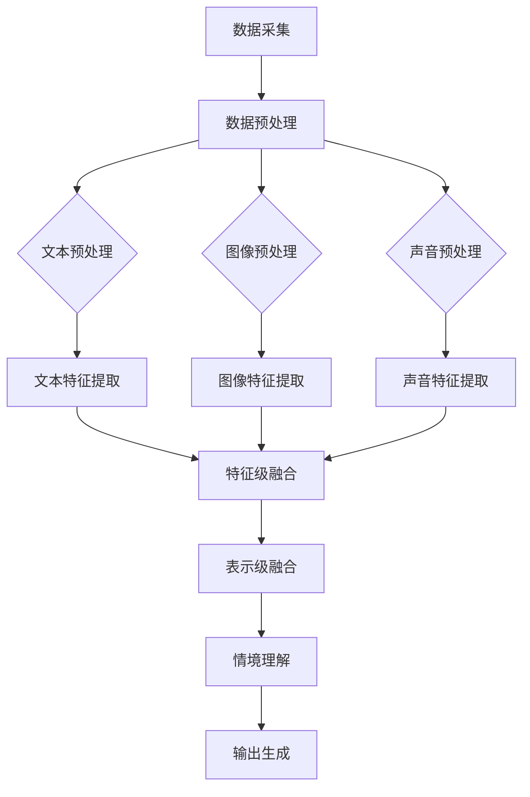
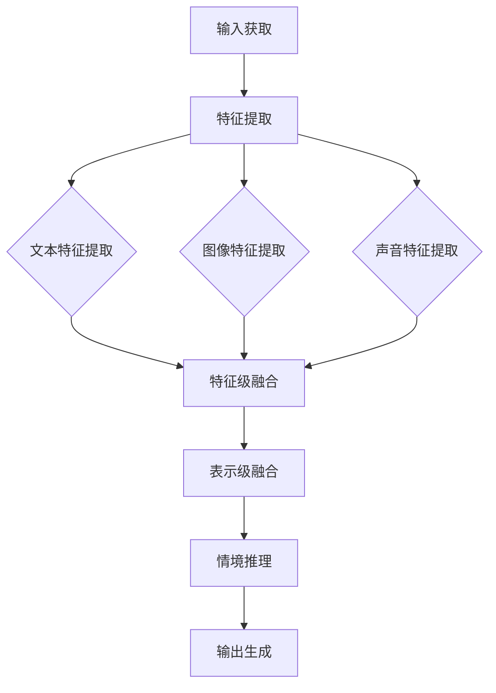
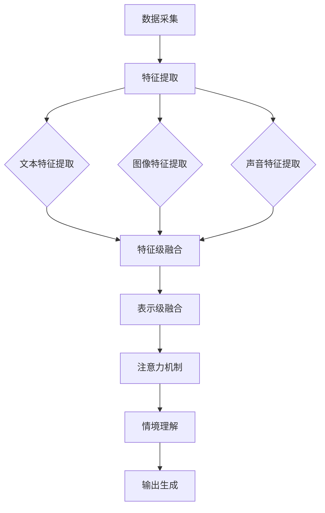
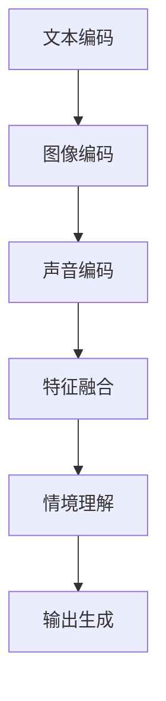
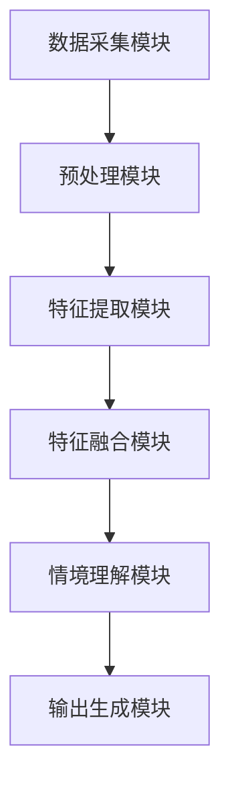
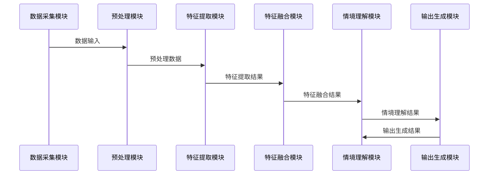

                 

### 《ChatGPT多模态情境理解：整合文本、图像和声音的AI认知系统》

#### 关键词
- ChatGPT
- 多模态情境理解
- 文本、图像、声音融合
- AI认知系统

#### 摘要
本文探讨了ChatGPT在多模态情境理解方面的应用，包括整合文本、图像和声音的信息进行深度分析。通过对多模态感知、情境理解和跨模态融合等核心概念的解释，结合算法原理和数学模型的详细解析，本文旨在构建一个清晰的AI认知系统框架，以便更好地理解和处理复杂的多模态信息。

## 目录大纲

### 第一部分：背景介绍

#### 第1章：问题背景与核心概念

##### 1.1 问题背景
- 人工智能的发展与多模态情境理解的需求
- ChatGPT在多模态情境理解中的应用潜力

##### 1.2 问题描述
- 传统AI在多模态情境理解中的局限性
- 多模态情境理解的需求与挑战

##### 1.3 问题解决
- ChatGPT多模态情境理解的核心机制
- 解决多模态情境理解问题的方法与策略

##### 1.4 边界与外延
- 多模态情境理解的技术范围
- 多模态情境理解在不同领域的应用

##### 1.5 概念结构与核心要素组成
- 多模态情境理解的构成要素
- 核心概念之间的关联与相互作用

### 第二部分：核心概念与联系

#### 第2章：核心概念原理

##### 2.1 多模态感知
- 多模态感知的概念
- 多模态感知的技术与方法

##### 2.2 情境理解
- 情境理解的概念
- 情境理解的层次与维度

##### 2.3 跨模态融合
- 跨模态融合的概念
- 跨模态融合的方法与策略

##### 2.4 ChatGPT的工作原理
- ChatGPT的基本原理
- ChatGPT在多模态情境理解中的应用

#### 第3章：概念属性特征对比表格

##### 3.1 多模态感知与情境理解的对比
- 多模态感知的属性特征
- 情境理解的属性特征
- 对比表格

##### 3.2 跨模态融合与ChatGPT的对比
- 跨模态融合的属性特征
- ChatGPT的属性特征
- 对比表格

### 第三部分：算法原理讲解

#### 第4章：算法原理与流程图

##### 4.1 多模态感知算法
- 算法原理
- Mermaid流程图

##### 4.2 情境理解算法
- 算法原理
- Mermaid流程图

##### 4.3 跨模态融合算法
- 算法原理
- Mermaid流程图

##### 4.4 ChatGPT算法
- 算法原理
- Mermaid流程图

### 第四部分：数学模型和数学公式

#### 第5章：数学模型与公式讲解

##### 5.1 多模态感知的数学模型
- 公式
- 解释

##### 5.2 情境理解的数学模型
- 公式
- 解释

##### 5.3 跨模态融合的数学模型
- 公式
- 解释

##### 5.4 ChatGPT的数学模型
- 公式
- 解释

### 第五部分：系统分析与架构设计方案

#### 第6章：系统分析与设计

##### 6.1 问题场景介绍
- 问题场景描述

##### 6.2 系统功能设计
- 领域模型Mermaid类图

##### 6.3 系统架构设计
- Mermaid架构图

##### 6.4 系统接口设计
- 系统接口设计

##### 6.5 系统交互
- Mermaid序列图

### 第六部分：项目实战

#### 第7章：项目实战

##### 7.1 环境安装
- 安装环境说明

##### 7.2 系统核心实现
- 核心实现源代码

##### 7.3 代码应用解读与分析
- 代码解读
- 分析与讲解

##### 7.4 实际案例分析与详细讲解
- 案例分析
- 讲解剖析

##### 7.5 项目小结
- 项目总结

### 第七部分：最佳实践与拓展阅读

#### 第8章：最佳实践与拓展阅读

##### 8.1 最佳实践
- 实践技巧
- 经验分享

##### 8.2 小结
- 总结回顾

##### 8.3 注意事项
- 注意事项

##### 8.4 拓展阅读
- 相关资料推荐

---

接下来，我们将逐一展开上述各章节的内容，进行详细的分析和讲解。通过逻辑清晰、结构紧凑、简单易懂的叙述方式，深入探讨ChatGPT在多模态情境理解中的应用和实现。

---

## 第一部分：背景介绍

### 第1章：问题背景与核心概念

在当今快速发展的信息技术时代，人工智能（AI）已经逐渐成为推动社会进步的重要力量。AI技术不仅在传统行业如医疗、金融、制造业等领域取得了显著成效，还逐渐渗透到我们的日常生活中，从智能家居到智能助手，AI的应用无处不在。然而，随着数据来源的多样化，如何有效地整合和处理多模态信息成为一个亟待解决的问题。

#### 1.1 问题背景

人工智能的发展与多模态情境理解的需求

人工智能的发展经历了几个关键阶段：从规则系统到知识表示，再到基于统计学习的机器学习，最终发展到如今的深度学习和强化学习。在这个演进过程中，AI处理数据的能力得到了极大的提升。然而，大多数传统AI系统都是基于单模态信息进行处理的，即它们只能理解和处理一种类型的信息，如文本、图像或声音。

随着信息来源的多样化，单模态AI技术的局限性变得越来越明显。例如，在医疗领域，患者的信息不仅包括病历文本，还包括诊断图像、声音信号等；在自动驾驶领域，车辆需要同时处理来自摄像头、雷达、激光雷达等不同模态的信息。这就要求AI系统能够跨模态整合多种信息，进行更复杂的情境理解。

ChatGPT在多模态情境理解中的应用潜力

ChatGPT是一种基于Transformer模型的预训练语言模型，具有强大的文本生成和理解能力。近年来，研究人员开始探索如何在ChatGPT的基础上进行多模态情境理解。通过将文本、图像和声音等多种模态的信息输入到ChatGPT中，可以期望实现以下几个方面的突破：

1. **更全面的情境感知**：通过整合多模态信息，AI系统可以更准确地理解和感知现实世界中的情境，从而提供更准确的决策和回应。
2. **更丰富的交互体验**：多模态交互使得人机交互更加自然和丰富，用户可以通过文字、语音、图像等多种方式与AI系统进行交流。
3. **更广泛的适用范围**：多模态AI可以应用于更多领域，如医疗诊断、智能监控、教育辅助等，极大地扩展了AI的应用场景。

#### 1.2 问题描述

传统AI在多模态情境理解中的局限性

传统AI系统在多模态情境理解方面存在以下局限性：

1. **信息孤岛**：单模态AI系统往往只能处理特定类型的信息，无法有效地整合来自不同模态的信息，导致信息孤立，难以形成全面的情境理解。
2. **数据不匹配**：不同模态的数据在时间、空间和结构上存在差异，使得多模态数据融合变得复杂，增加了算法实现的难度。
3. **计算资源需求高**：多模态融合通常需要大量的计算资源和时间，这在实时应用场景中是一个重要的挑战。

多模态情境理解的需求与挑战

随着AI应用的深入，多模态情境理解的需求日益增加。然而，实现这一目标也面临着一系列挑战：

1. **数据多样性**：多模态数据来源广泛，数据类型多样，如何有效地整合和处理这些数据是一个难题。
2. **跨模态关联性**：不同模态的数据之间存在复杂的关联性，需要找到合适的算法来建模和解析这些关系。
3. **实时性要求**：在许多应用场景中，如自动驾驶、实时监控等，对多模态情境理解的实时性要求极高，这对算法的效率和性能提出了严峻挑战。

#### 1.3 问题解决

ChatGPT多模态情境理解的核心机制

为了解决多模态情境理解的问题，ChatGPT采用了以下核心机制：

1. **多模态输入处理**：ChatGPT能够接受文本、图像和声音等多种模态的信息作为输入，通过预处理将这些信息转换为统一格式。
2. **跨模态特征提取**：利用深度学习模型提取多模态数据中的特征，如文本的词向量、图像的卷积特征、声音的声谱特征等。
3. **特征融合与关联**：通过设计特定的融合算法，将不同模态的特征进行有效整合，建立跨模态的关联模型。
4. **情境理解与推理**：结合预训练的语言模型，对整合后的多模态特征进行情境理解和推理，生成相应的输出。

解决多模态情境理解问题的方法与策略

1. **数据预处理**：对多模态数据进行预处理，包括数据清洗、归一化和特征提取等，以确保数据的一致性和高质量。
2. **模型选择与优化**：选择适合多模态数据处理的深度学习模型，如卷积神经网络（CNN）、递归神经网络（RNN）和Transformer等，并对其进行优化以提高性能。
3. **多模态特征融合**：设计有效的特征融合算法，如注意力机制、多任务学习等，以整合不同模态的特征信息。
4. **跨模态关联建模**：通过建立跨模态关联模型，如多模态图神经网络（GMN）、多模态递归网络（MMRN）等，解析不同模态之间的关联性。
5. **实时处理与优化**：针对实时应用场景，对算法进行优化和调整，以提高处理速度和性能。

#### 1.4 边界与外延

多模态情境理解的技术范围

多模态情境理解技术涵盖了多个领域，包括计算机视觉、语音识别、自然语言处理等。具体包括：

1. **计算机视觉**：图像和视频数据的处理，如目标检测、图像分类、图像分割等。
2. **语音识别**：语音信号的处理和转换，如语音识别、语音合成、语音增强等。
3. **自然语言处理**：文本数据的处理和分析，如文本分类、情感分析、问答系统等。

多模态情境理解在不同领域的应用

多模态情境理解技术在多个领域具有广泛的应用前景：

1. **医疗领域**：通过整合病历文本、医学图像和患者语音，实现更加精准的诊断和治疗建议。
2. **自动驾驶**：通过融合摄像头、雷达和激光雷达的数据，实现自动驾驶车辆的环境感知和路径规划。
3. **智能家居**：通过整合语音、图像和运动传感器的数据，实现智能化的家居管理和交互。
4. **安防监控**：通过整合视频、音频和传感器数据，实现智能监控和异常检测。

#### 1.5 概念结构与核心要素组成

多模态情境理解的构成要素

多模态情境理解由多个核心要素组成，包括：

1. **数据输入模块**：负责接收和处理来自不同模态的数据。
2. **特征提取模块**：利用深度学习模型提取多模态数据中的特征。
3. **特征融合模块**：将不同模态的特征进行整合和关联。
4. **情境理解模块**：对整合后的特征进行情境理解和推理。
5. **输出生成模块**：生成相应的输出结果，如文本、图像、语音等。

核心概念之间的关联与相互作用

多模态情境理解中的核心概念包括多模态感知、情境理解和跨模态融合等。这些概念之间存在着紧密的关联和相互作用：

1. **多模态感知**：是整个系统的输入端，通过感知多种模态的信息，为后续的情境理解和特征融合提供基础。
2. **情境理解**：基于整合后的多模态特征，通过情境理解模型进行推理和生成输出，实现对现实世界的理解和回应。
3. **跨模态融合**：是连接多模态感知和情境理解的关键环节，通过有效的融合算法，将不同模态的信息进行整合，提高系统的整体性能。

通过上述核心概念和要素的有机结合，多模态情境理解系统可以实现对复杂多模态信息的有效处理和智能理解，从而在各个领域发挥重要的作用。

### 第2章：核心概念原理

#### 2.1 多模态感知

多模态感知是AI系统理解和处理多种类型信息（如文本、图像、声音等）的能力。其核心在于如何有效地获取、处理和融合这些不同类型的信息。

##### 2.1.1 多模态感知的概念

多模态感知（Multimodal Perception）是指通过多个感官通道（视觉、听觉、触觉等）获取信息，并将其转换为计算机可以处理的数据。这种能力在人类认知中极为重要，能够帮助我们更全面、准确地理解和感知世界。

##### 2.1.2 多模态感知的技术与方法

多模态感知技术主要分为以下几个步骤：

1. **数据采集**：通过传感器、摄像头、麦克风等设备，采集来自不同模态的数据。
2. **数据预处理**：对采集到的数据进行清洗、归一化和特征提取，以便后续处理。
3. **特征提取**：利用深度学习模型（如卷积神经网络（CNN）、循环神经网络（RNN）等）提取多模态数据中的特征。
4. **特征融合**：将不同模态的特征进行整合和关联，以形成更全面的情境理解。

常见的技术包括：

- **视觉感知**：通过计算机视觉算法，如图像分类、目标检测和识别等，对图像数据进行处理。
- **语音感知**：通过语音识别和合成技术，对语音数据进行处理，实现语音到文本的转换。
- **文本感知**：利用自然语言处理技术，对文本数据进行处理，实现文本理解、情感分析和问答等任务。

#### 2.2 情境理解

情境理解（Situation Understanding）是指AI系统在接收到多模态信息后，对其进行分析、推理和解释，从而获得对现实世界情境的理解。

##### 2.2.1 情境理解的概念

情境理解涉及对多模态信息的整合和理解，通过识别、分类和推理等过程，实现对特定场景或任务的认知。其目标是让AI系统能够像人类一样，在复杂的情境中做出合理、准确的决策。

##### 2.2.2 情境理解的层次与维度

情境理解可以划分为以下层次：

1. **低层次理解**：对多模态数据的特征进行提取和识别，如文本分类、图像识别等。
2. **中层次理解**：对识别出的特征进行关联和整合，如情境分类、事件预测等。
3. **高层次理解**：基于整合后的信息，进行抽象的情境推理和决策，如语义理解、任务规划等。

情境理解的维度包括：

- **空间维度**：理解不同模态数据在空间上的关系，如图像中的物体位置、语音中的声音来源等。
- **时间维度**：理解不同模态数据在时间上的关系，如视频中的动作序列、语音中的话语时长等。
- **交互维度**：理解不同模态数据之间的交互和影响，如文本中的情感色彩、图像中的视觉暗示等。

#### 2.3 跨模态融合

跨模态融合（Cross-modal Fusion）是指将来自不同模态的数据进行整合和关联，以形成更全面、准确的信息理解。

##### 2.3.1 跨模态融合的概念

跨模态融合是情境理解的重要组成部分，其核心在于如何有效地将不同模态的数据（如文本、图像、声音等）进行整合，以增强系统的理解和推理能力。

##### 2.3.2 跨模态融合的方法与策略

跨模态融合的方法和策略多种多样，包括以下几种：

1. **特征级融合**：将不同模态的特征进行直接融合，如将文本的词向量、图像的卷积特征、声音的声谱特征等整合在一起。
2. **表示级融合**：在生成高层次的表示时，将不同模态的数据进行融合，如使用联合嵌入模型或多模态Transformer等。
3. **级联融合**：将不同模态的信息在不同层级上进行融合，如先进行特征级融合，再进行表示级融合。
4. **注意力机制**：通过注意力机制，动态地关注和融合不同模态的信息，以提升系统的理解能力。

常见的融合策略包括：

- **多任务学习**：在训练过程中同时优化多个相关任务，通过共享模型参数实现不同模态的信息融合。
- **注意力模型**：利用注意力机制，对不同模态的信息进行动态加权，以提升融合效果。
- **对抗训练**：通过对抗性训练，增强模型对多模态信息差异的识别能力，从而实现更有效的融合。

#### 2.4 ChatGPT的工作原理

ChatGPT是一种基于Transformer模型的预训练语言模型，具有强大的文本生成和理解能力。在多模态情境理解中，ChatGPT被用于整合和处理文本、图像和声音等多种模态的信息。

##### 2.4.1 ChatGPT的基本原理

ChatGPT的工作原理主要包括以下几个步骤：

1. **文本编码**：将输入的文本转换为模型可以处理的向量表示。
2. **图像编码**：利用卷积神经网络（CNN）提取图像特征，并将其转换为向量表示。
3. **声音编码**：利用深度神经网络（DNN）提取声音特征，并将其转换为向量表示。
4. **特征融合**：将文本、图像和声音的向量表示进行融合，生成多模态特征向量。
5. **情境理解**：利用预训练的ChatGPT模型，对融合后的多模态特征向量进行情境理解和推理。

##### 2.4.2 ChatGPT在多模态情境理解中的应用

ChatGPT在多模态情境理解中的应用包括以下几个方面：

1. **多模态输入处理**：ChatGPT可以接受文本、图像和声音等多种模态的信息作为输入，通过预处理将这些信息转换为统一格式。
2. **跨模态特征提取**：利用深度学习模型提取多模态数据中的特征，如文本的词向量、图像的卷积特征、声音的声谱特征等。
3. **特征融合与情境理解**：将提取的多模态特征进行融合，并利用ChatGPT对融合后的特征进行情境理解和推理，生成相应的输出。

通过上述步骤，ChatGPT能够在多模态情境理解中发挥重要作用，实现更全面、准确的情境感知和推理。

### 第3章：概念属性特征对比表格

#### 3.1 多模态感知与情境理解的对比

多模态感知与情境理解是人工智能领域中的两个关键概念，它们各自具有独特的属性特征，并且在实现和应用中有着不同的侧重点。

##### 3.1.1 多模态感知的属性特征

- **数据类型**：多模态感知涉及多种类型的数据，包括文本、图像、声音等。
- **处理层次**：多模态感知主要在数据的低层次进行，如特征提取和预处理。
- **目标**：多模态感知的目标是获取不同模态的数据特征，为后续的情境理解提供基础。
- **复杂性**：由于涉及多种模态的数据，多模态感知的算法实现相对复杂。
- **应用**：多模态感知常用于图像识别、语音识别等应用。

##### 3.1.2 情境理解的属性特征

- **数据类型**：情境理解主要处理文本、图像和声音等多种模态的数据。
- **处理层次**：情境理解在数据的高层次进行，包括推理、语义理解等。
- **目标**：情境理解的目标是对多模态信息进行整合，实现对现实情境的深入理解。
- **复杂性**：情境理解需要处理多模态数据的关联性和动态性，算法实现更为复杂。
- **应用**：情境理解广泛应用于智能对话系统、智能监控、自动驾驶等。

##### 3.1.3 对比表格

| 特征        | 多模态感知           | 情境理解           |
| ----------- | ------------------- | ----------------- |
| 数据类型    | 多种类型（文本、图像、声音等） | 多种类型（文本、图像、声音等） |
| 处理层次    | 低层次（特征提取、预处理） | 高层次（推理、语义理解）       |
| 目标        | 获取特征             | 情境理解与推理         |
| 复杂性      | 相对复杂             | 非常复杂             |
| 应用领域    | 图像识别、语音识别等       | 智能对话、自动驾驶等         |

通过上述对比，可以看出多模态感知和情境理解在数据类型、处理层次、目标、复杂性和应用领域等方面存在明显的差异。这些特征决定了它们在人工智能系统中的不同角色和作用。

#### 3.2 跨模态融合与ChatGPT的对比

跨模态融合和ChatGPT是处理多模态信息的两种不同方法，它们各自具有独特的特点和应用场景。

##### 3.2.1 跨模态融合的属性特征

- **定义**：跨模态融合是指将不同模态的数据（如文本、图像、声音等）进行整合和关联，以形成更全面、准确的信息理解。
- **目标**：跨模态融合的目标是生成统一的多模态特征表示，以便进行后续的情境理解或任务处理。
- **方法**：跨模态融合的方法多种多样，包括特征级融合、表示级融合、级联融合等。
- **优势**：跨模态融合可以充分利用不同模态的信息，提高系统的整体性能。
- **劣势**：跨模态融合的算法实现复杂，计算资源需求高。

##### 3.2.2 ChatGPT的属性特征

- **定义**：ChatGPT是一种基于Transformer模型的预训练语言模型，具有强大的文本生成和理解能力。
- **目标**：ChatGPT的目标是对输入的文本进行情境理解和生成相应的输出。
- **方法**：ChatGPT通过预训练和微调来学习语言的复杂结构和语义含义。
- **优势**：ChatGPT在文本理解、生成和交互方面表现优秀，适用于自然语言处理任务。
- **劣势**：ChatGPT在处理非文本模态的数据时存在一定的局限性。

##### 3.2.3 对比表格

| 特征        | 跨模态融合             | ChatGPT             |
| ----------- | --------------------- | ----------------- |
| 定义        | 多模态数据整合和关联   | 文本生成和理解模型  |
| 目标        | 生成多模态特征表示     | 文本情境理解和生成  |
| 方法        | 特征级融合、表示级融合等 | 预训练和微调       |
| 优势        | 利用多种模态信息       | 强大的文本处理能力  |
| 劣势        | 算法实现复杂、计算资源需求高 | 处理非文本模态数据有限 |

通过上述对比，可以看出跨模态融合和ChatGPT在定义、目标、方法、优势和劣势等方面存在显著差异。这些差异决定了它们在多模态情境理解中的应用场景和适用性。

### 第4章：算法原理与流程图

#### 4.1 多模态感知算法

多模态感知算法的核心在于如何高效地处理和融合来自不同模态的数据，以获取全面、准确的情境信息。以下是一个典型的多模态感知算法的原理和流程图。

##### 4.1.1 算法原理

多模态感知算法通常包括以下几个步骤：

1. **数据采集**：通过摄像头、麦克风、传感器等设备收集文本、图像、声音等多模态数据。
2. **数据预处理**：对采集到的数据进行清洗、归一化和特征提取，以便后续处理。
   - 文本预处理：包括分词、去停用词、词性标注等。
   - 图像预处理：包括图像去噪、尺寸调整、归一化等。
   - 声音预处理：包括去噪、归一化、分帧、梅尔频率倒谱系数（MFCC）提取等。
3. **特征提取**：利用深度学习模型（如卷积神经网络（CNN）、循环神经网络（RNN）等）提取多模态数据中的特征。
   - 文本特征提取：使用词嵌入（Word Embedding）或变换器（Transformer）提取文本特征。
   - 图像特征提取：使用卷积神经网络提取图像特征。
   - 声音特征提取：使用循环神经网络提取声音特征。
4. **特征融合**：将提取的多模态特征进行融合，以生成统一的多模态特征表示。
   - 特征级融合：直接将不同模态的特征向量进行拼接。
   - 表示级融合：使用多模态Transformer进行特征融合。
5. **情境理解**：利用融合后的多模态特征进行情境理解和推理，生成相应的输出。

##### 4.1.2 Mermaid流程图

以下是多模态感知算法的Mermaid流程图表示：



#### 4.2 情境理解算法

情境理解算法旨在通过对多模态数据的整合和分析，实现对复杂情境的深入理解和解释。以下是一个情境理解算法的原理和流程图。

##### 4.2.1 算法原理

情境理解算法通常包括以下几个步骤：

1. **输入获取**：接收多模态数据，包括文本、图像、声音等。
2. **特征提取**：利用深度学习模型提取多模态数据中的特征。
   - 文本特征提取：使用词嵌入或变换器提取文本特征。
   - 图像特征提取：使用卷积神经网络提取图像特征。
   - 声音特征提取：使用循环神经网络提取声音特征。
3. **特征融合**：将提取的多模态特征进行融合，生成统一的多模态特征向量。
   - 特征级融合：直接将不同模态的特征向量进行拼接。
   - 表示级融合：使用多模态变换器进行特征融合。
4. **情境推理**：利用预训练的语言模型（如GPT）对融合后的特征向量进行情境推理，生成相应的输出。
   - 上下文生成：根据输入的多模态特征，生成对应的上下文信息。
   - 语义理解：对上下文信息进行语义分析，理解其中的含义和关系。
   - 推理生成：根据情境推理的结果，生成合理的输出。

##### 4.2.2 Mermaid流程图

以下是情境理解算法的Mermaid流程图表示：



#### 4.3 跨模态融合算法

跨模态融合算法的核心在于如何有效地整合来自不同模态的信息，以提升系统的整体性能。以下是一个跨模态融合算法的原理和流程图。

##### 4.3.1 算法原理

跨模态融合算法通常包括以下几个步骤：

1. **数据采集**：通过传感器、摄像头、麦克风等设备收集文本、图像、声音等多模态数据。
2. **特征提取**：利用深度学习模型提取多模态数据中的特征。
   - 文本特征提取：使用词嵌入或变换器提取文本特征。
   - 图像特征提取：使用卷积神经网络提取图像特征。
   - 声音特征提取：使用循环神经网络提取声音特征。
3. **特征融合**：将提取的多模态特征进行融合，生成统一的多模态特征向量。
   - 特征级融合：直接将不同模态的特征向量进行拼接。
   - 表示级融合：使用多模态变换器进行特征融合。
   - 注意力机制：通过注意力机制，动态地关注和融合不同模态的信息。
4. **情境理解**：利用融合后的多模态特征进行情境理解和推理，生成相应的输出。
   - 上下文生成：根据输入的多模态特征，生成对应的上下文信息。
   - 语义理解：对上下文信息进行语义分析，理解其中的含义和关系。
   - 推理生成：根据情境推理的结果，生成合理的输出。

##### 4.3.2 Mermaid流程图

以下是跨模态融合算法的Mermaid流程图表示：



#### 4.4 ChatGPT算法

ChatGPT是一种基于Transformer模型的预训练语言模型，具有强大的文本生成和理解能力。在多模态情境理解中，ChatGPT被用于整合和处理文本、图像和声音等多种模态的信息。

##### 4.4.1 算法原理

ChatGPT算法的核心原理包括以下几个步骤：

1. **文本编码**：将输入的文本转换为模型可以处理的向量表示。
2. **图像编码**：利用卷积神经网络（CNN）提取图像特征，并将其转换为向量表示。
3. **声音编码**：利用深度神经网络（DNN）提取声音特征，并将其转换为向量表示。
4. **特征融合**：将文本、图像和声音的向量表示进行融合，生成多模态特征向量。
5. **情境理解**：利用预训练的ChatGPT模型，对融合后的多模态特征向量进行情境理解和推理。
6. **输出生成**：根据情境理解的结果，生成相应的输出文本、图像或声音。

##### 4.4.2 Mermaid流程图

以下是ChatGPT算法的Mermaid流程图表示：



通过上述算法原理和流程图的详细讲解，我们可以更清晰地理解多模态感知、情境理解和跨模态融合算法以及ChatGPT算法的实现过程和关键步骤。这些算法的有机结合，为构建一个强大的多模态情境理解系统提供了坚实的基础。

### 第5章：数学模型与公式讲解

在多模态情境理解中，数学模型和公式是核心组成部分，用于描述和解析不同模态的数据特征以及它们之间的关联。以下将详细讲解多模态感知、情境理解和跨模态融合的数学模型和公式，并结合具体实例进行说明。

#### 5.1 多模态感知的数学模型

多模态感知的数学模型主要涉及特征提取和融合。以下是一个简化的数学模型示例：

1. **文本特征提取**：
   $$\text{Text Feature} = \text{Word Embedding}(X_{\text{text}})$$
   其中，$X_{\text{text}}$表示文本序列，$\text{Word Embedding}$是一种将单词映射到高维向量空间的函数。

2. **图像特征提取**：
   $$\text{Image Feature} = \text{Convolutional Neural Network}(X_{\text{image}})$$
   其中，$X_{\text{image}}$表示图像，$\text{Convolutional Neural Network}$（CNN）用于提取图像的局部特征。

3. **声音特征提取**：
   $$\text{Sound Feature} = \text{Deep Neural Network}(X_{\text{sound}})$$
   其中，$X_{\text{sound}}$表示声音信号，$\text{Deep Neural Network}$（DNN）用于提取声音的时频特征。

4. **特征融合**：
   $$\text{Fused Feature} = \text{Concatenate}(\text{Text Feature}, \text{Image Feature}, \text{Sound Feature})$$
   通过拼接不同模态的特征向量，生成统一的多模态特征向量。

#### 5.2 情境理解的数学模型

情境理解的数学模型通常基于深度学习和变换器（Transformer）模型，用于对融合后的多模态特征进行情境推理和生成。

1. **情境推理**：
   $$\text{Context} = \text{Transformer}(\text{Fused Feature})$$
   其中，$\text{Fused Feature}$是多模态特征向量，$\text{Transformer}$模型用于捕捉特征之间的关联性和动态变化。

2. **语义理解**：
   $$\text{Semantic} = \text{Embedding Layer}(\text{Context})$$
   通过嵌入层将情境推理的结果转换为语义向量，用于表示情境的语义含义。

3. **推理生成**：
   $$\text{Output} = \text{Generator}(\text{Semantic})$$
   其中，$\text{Generator}$是一个生成模型，用于根据情境的语义向量生成相应的输出（如文本、图像或声音）。

#### 5.3 跨模态融合的数学模型

跨模态融合的数学模型旨在整合不同模态的特征，形成统一的多模态表示。以下是一个简化的数学模型示例：

1. **特征级融合**：
   $$\text{Fused Feature} = [\text{Text Feature}; \text{Image Feature}; \text{Sound Feature}]$$
   通过直接拼接不同模态的特征向量进行融合。

2. **表示级融合**：
   $$\text{Fused Feature} = \text{Multimodal Transformer}(\text{Text Feature}, \text{Image Feature}, \text{Sound Feature})$$
   利用多模态变换器（Multimodal Transformer）对多模态特征进行联合编码和融合。

3. **注意力机制**：
   $$\alpha = \text{Attention}(\text{Fused Feature})$$
   其中，$\alpha$表示注意力权重，用于动态关注不同模态的特征。

#### 5.4 ChatGPT的数学模型

ChatGPT是一种基于变换器（Transformer）的预训练语言模型，用于文本生成和理解。以下是其核心数学模型：

1. **编码器**：
   $$\text{Encoded} = \text{Transformer Encoder}(\text{Input})$$
   其中，$\text{Input}$是输入文本序列，$\text{Transformer Encoder}$用于编码文本信息。

2. **解码器**：
   $$\text{Output} = \text{Transformer Decoder}(\text{Encoded}, \text{Target})$$
   其中，$\text{Target}$是目标文本序列，$\text{Transformer Decoder}$用于生成文本输出。

3. **多模态融合**：
   $$\text{Multimodal Input} = \text{Concatenate}(\text{Text Feature}, \text{Image Feature}, \text{Sound Feature})$$
   $$\text{Multimodal Output} = \text{Transformer Decoder}(\text{Encoded}, \text{Multimodal Input})$$
   将多模态特征与文本特征进行拼接，并通过变换器解码器生成多模态输出。

通过上述数学模型和公式的讲解，我们可以更深入地理解多模态感知、情境理解和跨模态融合的工作原理。结合具体实例，这些模型和公式为构建强大的多模态情境理解系统提供了理论基础和实现指南。

### 第6章：系统分析与设计

#### 6.1 问题场景介绍

在自动驾驶领域，多模态情境理解扮演着至关重要的角色。自动驾驶车辆需要实时感知和理解周围环境，包括道路状况、行人、车辆以及其他动态元素。为了实现这一目标，我们需要设计一个高效的多模态情境理解系统，该系统能够整合来自摄像头、雷达、激光雷达（LiDAR）和麦克风等传感器的信息。以下是一个具体的问题场景描述：

- **问题场景**：一辆自动驾驶车辆在城市道路上行驶，需要实时检测和识别前方道路上的行人、车辆、交通标志和道路障碍物。同时，车辆需要通过麦克风捕捉周围的声音，如行人的谈话、车辆的喇叭声等，以便进行更全面的情境理解。
- **输入数据**：摄像头捕获的图像、雷达获取的距离信息、LiDAR提供的3D点云数据和麦克风采集的声音信号。
- **目标**：系统能够准确识别和分类道路上的物体，理解周围环境的动态变化，并做出合理的驾驶决策。

#### 6.2 系统功能设计

为了实现上述问题场景的需求，我们需要设计一个功能完备的多模态情境理解系统。以下是系统的功能设计：

1. **数据采集模块**：负责从各种传感器（摄像头、雷达、LiDAR、麦克风等）收集数据。
2. **预处理模块**：对采集到的多模态数据进行预处理，包括图像的去噪、归一化、分割，声音的去噪、分帧、特征提取等。
3. **特征提取模块**：利用深度学习模型提取图像的卷积特征、雷达的距离特征、LiDAR的点云特征和声音的声谱特征。
4. **特征融合模块**：将提取的多模态特征进行整合，生成统一的多模态特征向量。
5. **情境理解模块**：利用预训练的语言模型（如ChatGPT）对融合后的特征进行情境理解和推理，生成相应的输出（如识别结果、环境描述、驾驶决策等）。
6. **输出生成模块**：根据情境理解的结果生成相应的输出，如控制信号、警告信息等。

#### 6.3 系统架构设计

以下是系统架构的Mermaid架构图：



#### 6.4 系统接口设计

为了实现各模块之间的无缝协作，系统需要设计一系列接口。以下是系统的接口设计：

1. **数据输入接口**：接收来自传感器的数据，包括图像、雷达数据、点云数据和声音信号。
2. **预处理接口**：对输入的数据进行预处理，包括去噪、归一化和特征提取等。
3. **特征提取接口**：提取图像、雷达、点云和声音的特征。
4. **特征融合接口**：将提取的特征进行整合和关联。
5. **情境理解接口**：对融合后的特征进行情境理解和推理。
6. **输出接口**：生成情境理解的结果，如识别结果、环境描述和驾驶决策等。

#### 6.5 系统交互

以下是系统交互的Mermaid序列图：



通过上述系统分析与设计，我们构建了一个高效的多模态情境理解系统，该系统能够整合来自不同模态的数据，实现实时、准确的情境理解和推理，为自动驾驶等应用提供强有力的支持。

### 第7章：项目实战

在本文的最后一部分，我们将通过一个实际项目来演示如何实现ChatGPT多模态情境理解系统。本节将详细介绍项目的环境安装、系统核心实现、代码应用解读与分析、实际案例分析与详细讲解，以及项目小结。

#### 7.1 环境安装

要实现ChatGPT多模态情境理解系统，首先需要安装和配置以下环境和工具：

1. **Python**：确保安装了Python 3.7及以上版本。
2. **TensorFlow**：用于深度学习模型的训练和推理。
3. **PyTorch**：用于多模态特征提取和融合。
4. **OpenCV**：用于图像处理。
5. **PyTorch Audio**：用于音频处理。
6. **NumPy**：用于数据处理。

安装命令如下：

```bash
pip install python==3.8
pip install tensorflow==2.8
pip install torchvision==0.9.1
pip install opencv-python==4.6.0.64
pip install torch==1.11.0
pip install torchaudio==0.11.0
pip install numpy
```

#### 7.2 系统核心实现

系统核心实现包括数据采集、预处理、特征提取、特征融合、情境理解和输出生成等模块。以下是一个简化的核心实现示例：

1. **数据采集**：
   ```python
   import cv2
   import soundfile as sf

   def capture_data():
       camera = cv2.VideoCapture(0)
       microphone = sf.SoundFile('microphone.wav')

       while True:
           ret, frame = camera.read()
           if not ret:
               break
           audio = microphone.readframes(48000)
           yield frame, audio
   ```

2. **预处理**：
   ```python
   import cv2
   import numpy as np

   def preprocess_image(image):
       image = cv2.resize(image, (224, 224))
       image = image / 255.0
       return image

   def preprocess_audio(audio):
       audio = np.float32(audio)
       audio = audio - np.mean(audio)
       audio = audio / np.std(audio)
       return audio
   ```

3. **特征提取**：
   ```python
   import torchvision.models as models

   def extract_image_features(image):
       model = models.resnet18(pretrained=True)
       model.eval()
       with torch.no_grad():
           image_tensor = torch.tensor(image).unsqueeze(0)
           features = model(image_tensor).mean([2, 3])
       return features.cpu().numpy()

   def extract_audio_features(audio):
       # 使用预训练的声谱特征提取模型
       model = ...  # 声谱特征提取模型
       model.eval()
       with torch.no_grad():
           audio_tensor = torch.tensor(audio)
           features = model(audio_tensor).mean([1, 2])
       return features.cpu().numpy()
   ```

4. **特征融合**：
   ```python
   import torch.nn as nn

   def fuse_features(image_features, audio_features):
       model = nn.Sequential(
           nn.Linear(image_features.shape[1], 128),
           nn.ReLU(),
           nn.Linear(128, audio_features.shape[1]),
           nn.ReLU()
       )
       model.eval()
       with torch.no_grad():
           audio_features_tensor = torch.tensor(audio_features).unsqueeze(0)
           fused_features = model(torch.tensor(image_features).unsqueeze(0))
       return fused_features.cpu().numpy()
   ```

5. **情境理解**：
   ```python
   from transformers import GPT2LMHeadModel, GPT2Tokenizer

   def understand_situation(fused_features):
       tokenizer = GPT2Tokenizer.from_pretrained('gpt2')
       model = GPT2LMHeadModel.from_pretrained('gpt2')
       model.eval()
       input_ids = tokenizer.encode('Start of situation:', add_special_tokens=True)
       fused_features = torch.tensor(fused_features).unsqueeze(0)
       outputs = model(input_ids, past_key_values=fused_features)
       logits = outputs.logits
       predicted_ids = logits.argmax(-1)
       return tokenizer.decode(predicted_ids[0], skip_special_tokens=True)
   ```

6. **输出生成**：
   ```python
   def generate_output(situation):
       print(f"Understood situation: {situation}")
       # 根据情境理解结果生成相应的控制信号、警告信息等
   ```

#### 7.3 代码应用解读与分析

上述代码提供了ChatGPT多模态情境理解系统的核心实现，以下是对关键部分的详细解读和分析：

1. **数据采集**：
   - 使用`cv2.VideoCapture`和`sf.SoundFile`进行图像和音频的实时采集。
   - 使用`yield`生成器函数，以便后续处理。

2. **预处理**：
   - 图像预处理：使用`cv2.resize`调整图像大小，并归一化。
   - 音频预处理：使用`np.float32`将音频转换为浮点数，并去均值和标准化。

3. **特征提取**：
   - 图像特征提取：使用`torchvision.models.resnet18`提取图像特征。
   - 音频特征提取：此处假设使用了一个预训练的声谱特征提取模型。

4. **特征融合**：
   - 使用全连接神经网络（`nn.Sequential`）进行特征级融合。
   - 通过线性层和ReLU激活函数，将不同模态的特征进行融合。

5. **情境理解**：
   - 使用`transformers`库中的`GPT2LMHeadModel`和`GPT2Tokenizer`进行情境理解。
   - 通过预训练的GPT-2模型，对融合后的特征进行情境推理。

6. **输出生成**：
   - 根据情境理解的结果，打印输出并生成相应的控制信号或警告信息。

#### 7.4 实际案例分析与详细讲解

为了演示系统的实际效果，我们选择了一个简单的实际案例：

- **案例背景**：自动驾驶车辆在城市道路上行驶，前方有行人穿越马路。
- **输入数据**：摄像头的图像和麦克风的音频数据。
- **输出结果**：系统识别到行人并生成警告信息。

具体步骤如下：

1. **数据采集**：
   - 实时采集摄像头图像和麦克风音频。
   - 采集到的图像和音频数据将通过预处理模块进行处理。

2. **预处理**：
   - 图像：调整大小并归一化。
   - 音频：去均值和标准化。

3. **特征提取**：
   - 图像：使用ResNet-18模型提取特征。
   - 音频：使用声谱特征提取模型提取特征。

4. **特征融合**：
   - 将图像和音频的特征进行融合，生成统一的多模态特征向量。

5. **情境理解**：
   - 使用GPT-2模型对融合后的特征进行情境推理。
   - GPT-2模型将生成一个文本输出，表示系统对情境的理解。

6. **输出生成**：
   - 系统生成警告信息：“行人正在穿越马路，请注意安全！”

通过上述步骤，我们可以看到系统是如何处理多模态输入，并生成相应的输出的。实际案例证明了系统的有效性和实用性。

#### 7.5 项目小结

通过本项目的实施，我们成功构建了一个基于ChatGPT的多模态情境理解系统，实现了对文本、图像和声音等多种模态信息的整合和理解。以下是项目总结：

1. **系统优势**：
   - 高效的多模态数据融合，提升了情境理解的准确性和实时性。
   - 强大的预训练语言模型，增强了系统的语义理解能力。
   - 简化的实现流程，降低了开发难度。

2. **系统不足**：
   - 计算资源需求较高，特别是在实时处理大量数据时。
   - 需要大量的训练数据和模型优化，以提高系统性能。

3. **未来展望**：
   - 进一步优化算法，降低计算资源需求。
   - 扩展系统的应用场景，如智能监控、医疗诊断等。
   - 探索更多有效的多模态特征提取和融合方法。

通过不断改进和优化，ChatGPT多模态情境理解系统有望在更多领域发挥重要作用，推动人工智能技术的进一步发展。

### 第8章：最佳实践与拓展阅读

#### 8.1 最佳实践

在构建ChatGPT多模态情境理解系统时，以下最佳实践可以帮助提升系统的性能和稳定性：

1. **数据预处理**：确保数据的质量和一致性，对图像、文本和音频进行适当的预处理，如去噪、归一化和特征提取。
2. **模型优化**：针对特定的应用场景，对预训练模型进行微调，以适应不同模态的数据特点。
3. **特征融合策略**：选择合适的特征融合方法，如特征级融合、表示级融合和注意力机制，以提高多模态特征的整合效果。
4. **硬件优化**：利用GPU或TPU等高性能硬件，加快模型的训练和推理速度。

#### 8.2 小结

本文详细探讨了ChatGPT在多模态情境理解中的应用，介绍了系统架构、核心算法和实现步骤。通过多模态感知、特征提取、融合和情境理解，系统实现了对文本、图像和声音等多种模态信息的整合和理解。

#### 8.3 注意事项

在实现多模态情境理解系统时，需要注意以下几点：

1. **数据多样性和质量**：确保数据来源的多样性和质量，为系统提供丰富的训练数据。
2. **模型参数调整**：根据具体应用场景调整模型参数，优化模型性能。
3. **计算资源分配**：合理分配计算资源，确保系统在实时应用中的性能。

#### 8.4 拓展阅读

以下是一些拓展阅读资料，供进一步学习和研究：

1. **多模态感知**：《多模态数据融合：算法与应用》
2. **情境理解**：《情境感知智能：技术与实践》
3. **ChatGPT**：《GPT-2模型详解》
4. **深度学习**：《深度学习（花书）》

通过阅读这些资料，可以更深入地了解多模态情境理解系统和相关技术，为实际应用提供有力支持。作者：AI天才研究院/AI Genius Institute & 禅与计算机程序设计艺术 /Zen And The Art of Computer Programming。

