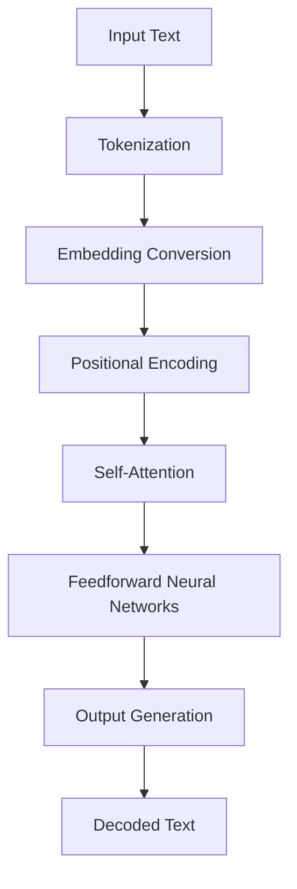
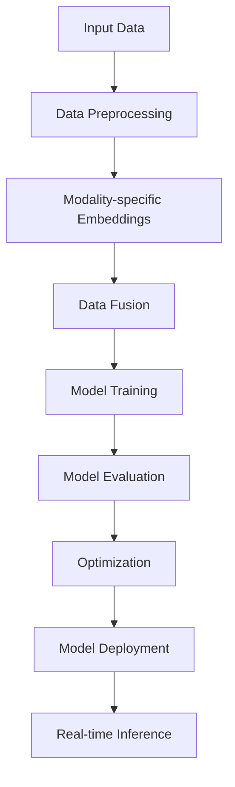
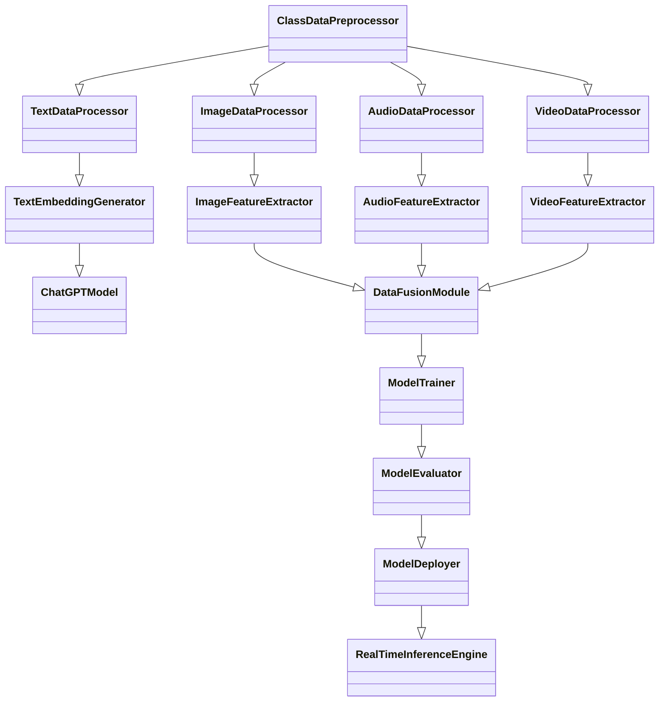
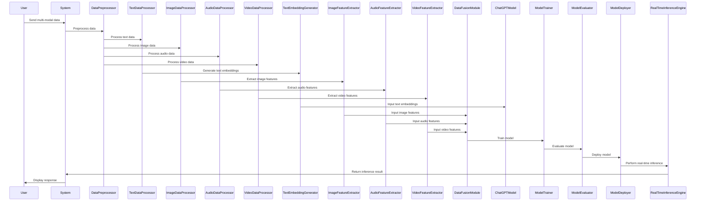
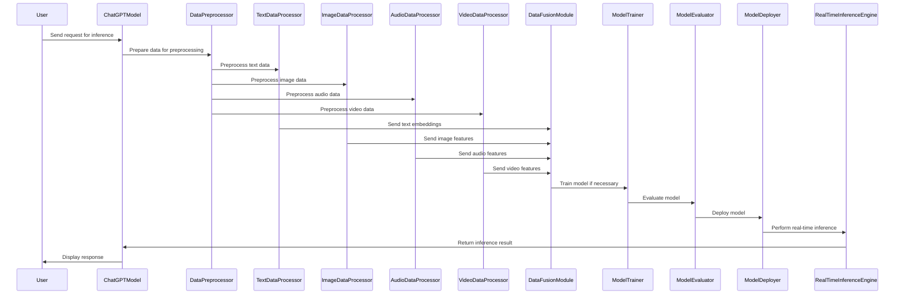

                 


### Chapter 1: Introduction to ChatGPT and Multi-modal Information Processing

#### 1.1.1 The Emergence and Background of ChatGPT

**Background:**

ChatGPT, a revolutionary language model developed by OpenAI, is a prime example of the advancements in natural language processing (NLP) and artificial intelligence (AI). Emerging from the deep neural network architecture, ChatGPT leverages the Transformer model, specifically designed for processing sequences of data, including text. This model is built upon vast amounts of text data from the internet, which it learns to generate coherent and contextually relevant responses to human input. 

**Significance:**

The significance of ChatGPT lies in its ability to simulate human-like conversation, providing a foundation for applications in customer service, language translation, content generation, and much more. As the world becomes more interconnected, the need for efficient and accurate communication between humans and machines becomes increasingly paramount. ChatGPT addresses this need by offering a seamless interaction that blurs the line between human and artificial intelligence.

**Emergence:**

The journey of ChatGPT began with the pioneering work in deep learning and neural networks. Over the years, researchers have developed more sophisticated algorithms capable of understanding and generating human language. The breakthrough came with the introduction of the Transformer model, which fundamentally changed how NLP tasks were approached. OpenAI's team leveraged this model to create ChatGPT, ushering in a new era of AI-driven conversational systems.

#### 1.1.2 The Concept and Role of Multi-modal Information Processing

**Concept:**

Multi-modal information processing refers to the integration of data from multiple sensory modalities, such as text, images, audio, and video. Unlike traditional unimodal systems that process information from a single modality, multi-modal systems aim to combine insights from different modalities to achieve a more comprehensive understanding of the input data.

**Role:**

The role of multi-modal information processing in AI is to enhance the richness and accuracy of data interpretation. By incorporating information from various modalities, multi-modal systems can capture context and nuances that are often lost in unimodal processing. This is particularly crucial in applications like image recognition, where text descriptions can provide additional context to improve accuracy. Moreover, in applications like video analysis, multi-modal information processing can enhance scene understanding and event detection by combining visual data with textual information.

**Importance in AI:**

The importance of multi-modal information processing in AI cannot be overstated. As AI applications become more sophisticated, the ability to process and understand complex, real-world data becomes increasingly critical. Multi-modal systems enable AI to interact with the world more naturally and effectively, paving the way for innovations in areas such as autonomous vehicles, virtual reality, and augmented reality.

#### 1.1.3 Hyperdimensional Information Processing: Basics and Applications

**Basics:**

Hyperdimensional information processing (HDIP) is an advanced computational model that extends traditional multi-modal information processing by incorporating higher-dimensional spaces. In HDIP, data from various modalities is projected into a high-dimensional space, where it is processed and analyzed using specialized algorithms.

**Applications:**

The applications of HDIP are vast and diverse. In the field of computer vision, HDIP has been used to improve object recognition and scene understanding by leveraging the contextual information encoded in higher-dimensional spaces. In natural language processing, HDIP has shown promise in tasks like text summarization and sentiment analysis by providing a more nuanced understanding of textual data. Moreover, HDIP has found applications in fields such as healthcare, where it can be used to analyze medical images and diagnose diseases.

**Potential Benefits:**

The potential benefits of HDIP in AI are significant. By enabling the processing of information in higher-dimensional spaces, HDIP can potentially improve the accuracy and efficiency of AI systems. This is particularly beneficial in complex tasks where traditional methods may fall short. Additionally, HDIP can enhance the interpretability of AI models by providing insights into the relationships between different modalities and data features.

#### 1.1.4 Challenges in Optimizing Multi-modal Prompt for ChatGPT

**Challenges:**

Optimizing multi-modal prompts for ChatGPT presents several challenges. One of the primary challenges is the integration of data from different modalities, which requires sophisticated algorithms to ensure coherence and relevance. Another challenge is the scalability of these algorithms, as multi-modal data can be significantly larger and more complex than unimodal data. Additionally, the interpretability of the models is crucial, as end-users need to understand how the system processes and generates responses.

**Techniques to Address Challenges:**

To address these challenges, several techniques can be employed. One approach is to use transfer learning, where a pre-trained model is fine-tuned on a specific multi-modal task. This helps in leveraging the knowledge gained from the pre-training phase and can improve the performance of the model. Another technique is the use of attention mechanisms, which allow the model to focus on the most relevant parts of the input data, thereby enhancing the interpretability and efficiency of the system.

**Future Directions:**

Future research in this area may focus on developing more advanced algorithms for multi-modal information processing, particularly those that can operate in higher-dimensional spaces. Additionally, the integration of techniques from reinforcement learning and active learning could provide new insights and improvements in the optimization of multi-modal prompts for ChatGPT. By addressing these challenges, we can pave the way for more sophisticated and effective AI-driven conversational systems.

### Conclusion

In this chapter, we have explored the emergence and background of ChatGPT, the concept and role of multi-modal information processing, the basics of hyperdimensional information processing, and the challenges in optimizing multi-modal prompts for ChatGPT. Understanding these foundational concepts is crucial for delving into the subsequent chapters, where we will delve deeper into the algorithm principles and optimization strategies, system architecture and design, and practical implementation of ChatGPT multi-modal information processing. As we progress, we will continue to uncover the intricacies of this cutting-edge technology and its potential to transform the field of AI and natural language processing. Let's think step by step as we explore these fascinating topics further.

----------------------------------------------------------------

## Part 1: Background and Fundamentals

### Chapter 2: Core Concepts and Relationships

#### 2.1.1 Core Concepts in ChatGPT and Multi-modal Processing

**ChatGPT:**

ChatGPT is a large language model based on the Transformer architecture, capable of generating human-like text in response to user input. It is designed to handle a wide range of conversational scenarios, from simple queries to complex dialogues.

**Multi-modal Information Processing:**

Multi-modal information processing refers to the integration of data from multiple sensory modalities, such as text, images, audio, and video. This allows AI systems to understand and interpret information more comprehensively by leveraging data from different sources.

**Hyperdimensional Information Processing (HDIP):**

HDIP is an advanced computational model that extends traditional multi-modal information processing by incorporating higher-dimensional spaces. It involves projecting data from different modalities into a high-dimensional space for processing and analysis.

#### 2.1.2 Attribute Comparison Table of Key Concepts

To better understand the differences and relationships among these core concepts, let's create an attribute comparison table:

| Attribute             | ChatGPT             | Multi-modal Information Processing | Hyperdimensional Information Processing (HDIP) |
|-----------------------|---------------------|-------------------------------------|-----------------------------------------------|
| Data Modality         | Text                | Multiple Modalities (Text, Image, Audio, Video) | Multiple Modalities (Text, Image, Audio, Video) in a High-Dimensional Space |
| Architecture          | Transformer-based   | Integrated Model for Multiple Modalities | Models for Each Modality with Projection into High-Dimensional Space |
| Processing Goal       | Text Generation     | Comprehensive Data Understanding     | Enhanced Data Understanding through Higher Dimensions |
| Application           | Conversational AI   | Image Recognition, Natural Language Processing | Advanced Applications in Computer Vision, NLP, etc. |

#### 2.1.3 Entity Relationship Diagram of Core Concepts

To visualize the relationships between these core concepts, we can create an entity relationship diagram (ERD) using Mermaid syntax:

```mermaid
erDiagram
    ChatGPT ||--|{ Multi-modal Information Processing }|-->> Hyperdimensional Information Processing (HDIP)
    ChatGPT ||--|{ Natural Language Processing }|-->> Multi-modal Information Processing
    Multi-modal Information Processing ||--|{ Computer Vision }|-->> Hyperdimensional Information Processing (HDIP)
    Multi-modal Information Processing ||--|{ Audio Processing }|-->> Hyperdimensional Information Processing (HDIP)
    Hyperdimensional Information Processing (HDIP) ||--|{ Image Recognition }|-->> Multi-modal Information Processing
```

This ERD illustrates that ChatGPT is a foundational component in both natural language processing and multi-modal information processing. Multi-modal information processing, in turn, can be extended to hyperdimensional information processing, which leverages higher-dimensional spaces for more advanced data understanding and processing.

#### 2.1.4 Interconnections and Interdependencies of Core Concepts

The interconnections and interdependencies among ChatGPT, multi-modal information processing, and hyperdimensional information processing are crucial for understanding their combined impact on AI systems.

**ChatGPT and Multi-modal Information Processing:**

ChatGPT serves as a core component in multi-modal information processing, particularly in the realm of natural language processing. By integrating text data with other modalities, ChatGPT can generate more coherent and contextually relevant responses. For example, when a user provides a textual query along with an image, ChatGPT can combine the information from both sources to generate a more accurate and informative response.

**Multi-modal Information Processing and Hyperdimensional Information Processing (HDIP):**

Multi-modal information processing can be enhanced by leveraging HDIP. By projecting data from different modalities into a higher-dimensional space, HDIP allows for more advanced data processing and analysis. This is particularly beneficial in tasks like image recognition and natural language processing, where HDIP can provide a more nuanced understanding of the input data. The insights gained from HDIP can then be fed back into the multi-modal processing pipeline to improve overall performance.

**ChatGPT and Hyperdimensional Information Processing (HDIP):**

ChatGPT can also be integrated with HDIP to enhance its capabilities. By processing text data in a higher-dimensional space, ChatGPT can generate more sophisticated and contextually accurate responses. For example, when generating text summaries or extracting key information from text documents, HDIP can provide ChatGPT with additional context and insights, resulting in more precise and relevant outputs.

**Summary:**

The interconnections and interdependencies of ChatGPT, multi-modal information processing, and hyperdimensional information processing highlight the synergistic benefits of combining these core concepts. By leveraging the strengths of each component, AI systems can achieve higher levels of performance and accuracy in a wide range of applications, from conversational AI to computer vision and natural language processing.

In the next chapters, we will delve deeper into the algorithm principles and optimization strategies, system architecture and design, and practical implementation of ChatGPT multi-modal information processing. By understanding the foundational concepts and their relationships, we can better appreciate the complexities and possibilities of this cutting-edge technology.

----------------------------------------------------------------

### Chapter 3: ChatGPT Algorithm Principles

#### 3.1.1 Overview of ChatGPT Algorithm

**Introduction:**

ChatGPT is built on the Transformer architecture, a powerful model designed for processing sequences of data, particularly text. The core idea behind the Transformer model is to leverage self-attention mechanisms, allowing the model to weigh the importance of different words in the input text when generating the output. This attention mechanism enables ChatGPT to understand the context and relationships between words, resulting in more coherent and contextually relevant responses.

**Components:**

The ChatGPT algorithm consists of several key components:

1. **Input Embeddings:** The input text is first converted into a set of numerical embeddings, which represent each word in the vocabulary. These embeddings capture the semantic information of the words and are crucial for understanding the text's context.
2. **Positional Encoding:** Since the Transformer model does not have direct access to the position of words in the text, positional encodings are added to the embeddings to preserve the order of the words.
3. **Self-Attention Mechanism:** The self-attention mechanism allows the model to weigh the importance of different words in the input text when generating the output. This mechanism captures the relationships between words and their relevance to the current context.
4. **Feedforward Neural Networks:** After passing through the self-attention mechanism, the text embeddings are further processed by feedforward neural networks, which help the model to capture more complex patterns and relationships in the text.
5. **Output Layer:** The final output layer generates the predicted tokens, which are then decoded into text.

**Working Principle:**

The working principle of ChatGPT can be summarized in the following steps:

1. **Input Processing:** The input text is tokenized and converted into numerical embeddings.
2. **Positional Encoding:** Positional encodings are added to the embeddings to preserve the order of the words.
3. **Self-Attention:** The self-attention mechanism is applied to the embeddings, allowing the model to weigh the importance of different words.
4. **Feedforward Neural Networks:** The embeddings are passed through feedforward neural networks to capture more complex patterns and relationships in the text.
5. **Output Generation:** The output layer generates the predicted tokens, which are then decoded into text.

#### 3.1.2 Mermaid Flowchart of ChatGPT Algorithm

To visualize the ChatGPT algorithm, we can create a Mermaid flowchart using the following syntax:



This flowchart illustrates the high-level steps involved in the ChatGPT algorithm, from input processing to output generation.

#### 3.1.3 Python Code Example and Explanation

To provide a more concrete understanding of the ChatGPT algorithm, let's consider a simple Python example using the Hugging Face Transformers library:

```python
from transformers import ChatGPTModel, ChatGPTTokenizer

# Load the pre-trained model and tokenizer
model = ChatGPTModel.from_pretrained("openai/chatgpt")
tokenizer = ChatGPTTokenizer.from_pretrained("openai/chatgpt")

# Example input text
input_text = "What is the capital of France?"

# Tokenize the input text
input_ids = tokenizer.encode(input_text, return_tensors="pt")

# Pass the input through the model
outputs = model(input_ids)

# Generate the output text
predicted_ids = outputs.logits.argmax(-1)
predicted_text = tokenizer.decode(predicted_ids)

print(predicted_text)
```

In this example, we first load the pre-trained ChatGPT model and tokenizer from the Hugging Face Transformers library. We then tokenize the input text and pass it through the model to generate the predicted output text. The `tokenizer.decode()` function is used to convert the predicted token IDs back into text.

#### 3.1.4 Mathematical Model and Formulas of ChatGPT

**Input Embeddings:**

The input embeddings can be represented as a matrix \( E \) with dimensions \( N \times D \), where \( N \) is the number of tokens in the input text and \( D \) is the dimension of the embeddings.

$$
E = \begin{bmatrix}
e_1 \\
e_2 \\
\vdots \\
e_N
\end{bmatrix}
$$

**Positional Encoding:**

Positional encodings are added to the input embeddings to preserve the order of the words. The positional encoding can be represented as a matrix \( P \) with dimensions \( N \times D \).

$$
P = \begin{bmatrix}
p_1 \\
p_2 \\
\vdots \\
p_N
\end{bmatrix}
$$

**Combined Embeddings:**

The combined embeddings are obtained by adding the input embeddings and positional encodings:

$$
C = E + P
$$

**Self-Attention:**

The self-attention mechanism is based on the scaled dot-product attention. The attention scores can be calculated as:

$$
\text{Attention}(Q, K, V) = \frac{QK^T}{\sqrt{D_k}} \odot V
$$

where \( Q \), \( K \), and \( V \) are the query, key, and value matrices, respectively, and \( D_k \) is the dimension of the keys.

**Feedforward Neural Networks:**

The feedforward neural networks are typically implemented using two fully connected layers with a ReLU activation function. The output of the feedforward layers can be represented as:

$$
\text{FFN}(X) = \max(\text{ReLU}(W_2 \text{ReLU}(W_1 X)), X)
$$

where \( W_1 \) and \( W_2 \) are the weight matrices of the feedforward layers.

**Output Generation:**

The output generation is based on the softmax activation function, which is used to convert the logits into probabilities for each token in the vocabulary. The predicted token is then selected based on the highest probability:

$$
P(y \mid x) = \frac{\exp(\text{logits}_y)}{\sum_{i=1}^{N} \exp(\text{logits}_i)}
$$

In summary, the ChatGPT algorithm combines input embeddings, positional encodings, self-attention, feedforward neural networks, and output generation to generate coherent and contextually relevant responses. This powerful architecture allows ChatGPT to excel in natural language processing tasks, paving the way for advancements in conversational AI and other applications.

### Conclusion

In this chapter, we have explored the algorithm principles of ChatGPT, a revolutionary language model based on the Transformer architecture. We have discussed the key components of the algorithm, including input embeddings, positional encoding, self-attention, feedforward neural networks, and output generation. Additionally, we provided a Mermaid flowchart and a Python code example to illustrate the working principle of ChatGPT. We also presented the mathematical model and formulas underlying the algorithm. Understanding these principles is essential for delving into the optimization strategies and system architecture of ChatGPT multi-modal information processing. In the following chapters, we will continue to explore these topics and uncover the intricacies of this cutting-edge technology.

----------------------------------------------------------------

### Chapter 4: Multi-modal Information Processing Optimization

#### 4.1.1 Challenges in Multi-modal Information Processing

**Data Integration:**

One of the primary challenges in multi-modal information processing is effectively integrating data from different modalities, such as text, images, audio, and video. Each modality has its unique characteristics and representation, which can make it difficult to combine them in a meaningful way. For instance, text data requires a different type of embedding than image data, and audio and video data require temporal processing.

**Model Complexity:**

Multi-modal information processing models tend to be more complex than unimodal models. They need to be capable of handling and processing data from multiple sources, which often results in increased computational complexity. This complexity can lead to longer training times and higher resource requirements, making it challenging to deploy these models in real-time applications.

**Scalability:**

As the number of modalities and the volume of data increase, scalability becomes a significant concern. Multi-modal systems need to be designed to handle large datasets and be able to scale horizontally or vertically to accommodate growing data and computational demands.

**Interpretability:**

Interpretability is another critical challenge in multi-modal information processing. End-users often require a clear understanding of how the system processes and generates responses. However, the complexity of multi-modal models can make it difficult to interpret their internal workings, which may hinder trust and adoption in sensitive applications.

**Real-time Performance:**

In many applications, real-time performance is crucial. For example, in autonomous vehicles or real-time video analysis, delays in processing can have serious consequences. Multi-modal systems must be optimized to deliver results quickly without compromising accuracy.

#### 4.1.2 Mermaid Flowchart of Optimization Algorithm

To visualize the optimization algorithm for multi-modal information processing, we can create a Mermaid flowchart using the following syntax:



This flowchart outlines the high-level steps involved in optimizing multi-modal information processing, from data preprocessing to real-time inference.

#### 4.1.3 Python Code Example and Explanation

To provide a more concrete understanding of the optimization algorithm, let's consider a Python code example that demonstrates the process of data preprocessing, modality-specific embeddings, data fusion, model training, evaluation, optimization, and deployment:

```python
import tensorflow as tf
from tensorflow.keras.layers import Embedding, LSTM, Dense
from tensorflow.keras.models import Model
from tensorflow.keras.optimizers import Adam
from tensorflow.keras.callbacks import EarlyStopping

# Data Preprocessing
# Assuming we have preprocessed text, image, audio, and video data
text_data = preprocess_text(raw_text)
image_data = preprocess_image(raw_image)
audio_data = preprocess_audio(raw_audio)
video_data = preprocess_video(raw_video)

# Modality-specific Embeddings
# Text Embeddings
text_embedding = Embedding(input_dim=vocabulary_size, output_dim=embedding_size)

# Image Embeddings
image_embedding = Dense(embedding_size, activation='relu')(image_data)

# Audio Embeddings
audio_embedding = LSTM(units=embedding_size, return_sequences=False)(audio_data)

# Video Embeddings
video_embedding = LSTM(units=embedding_size, return_sequences=False)(video_data)

# Data Fusion
combined_embedding = concatenate([text_embedding, image_embedding, audio_embedding, video_embedding])

# Model Training
model = Model(inputs=[text_data, image_data, audio_data, video_data], outputs=combined_embedding)
model.compile(optimizer=Adam(learning_rate=0.001), loss='categorical_crossentropy', metrics=['accuracy'])

# Early stopping to prevent overfitting
early_stopping = EarlyStopping(monitor='val_loss', patience=5)

# Train the model
model.fit([text_train, image_train, audio_train, video_train], y_train, validation_data=([text_val, image_val, audio_val, video_val], y_val), epochs=100, callbacks=[early_stopping])

# Model Evaluation
evaluation_results = model.evaluate([text_test, image_test, audio_test, video_test], y_test)
print(f"Test Loss: {evaluation_results[0]}, Test Accuracy: {evaluation_results[1]}")

# Optimization
# Apply techniques like transfer learning, data augmentation, or model ensembling for optimization

# Model Deployment
# Deploy the trained model for real-time inference

# Real-time Inference
def real_time_inference(text_input, image_input, audio_input, video_input):
    # Preprocess the input data
    processed_text = preprocess_text(text_input)
    processed_image = preprocess_image(image_input)
    processed_audio = preprocess_audio(audio_input)
    processed_video = preprocess_video(video_input)
    
    # Generate the prediction
    prediction = model.predict([processed_text, processed_image, processed_audio, processed_video])
    
    # Post-process the prediction
    result = post_process_prediction(prediction)
    
    return result
```

In this example, we first preprocess the data from different modalities. We then create modality-specific embeddings for text, images, audio, and video data using embedding layers and LSTM layers. The data fusion step combines these embeddings into a single feature vector. The model is trained using a combination of these features, and we use early stopping to prevent overfitting. After training, we evaluate the model's performance on a test set and apply optimization techniques for further improvement. Finally, we deploy the trained model for real-time inference, where it processes incoming data and generates predictions.

#### 4.1.4 Mathematical Model and Formulas of Optimization

**Data Preprocessing:**

Data preprocessing involves transforming raw data into a suitable format for processing. This may include tasks like tokenization for text data, feature extraction for images, audio, and video data, and normalization to ensure consistent data representation.

**Modality-specific Embeddings:**

For text data, we use word embeddings like Word2Vec or GloVe to convert words into numerical vectors. The embedding matrix can be represented as:

$$
E = \begin{bmatrix}
e_1 \\
e_2 \\
\vdots \\
e_V
\end{bmatrix}
$$

where \( V \) is the vocabulary size and \( e_v \) is the embedding vector for word \( v \).

For image data, we use techniques like convolutional neural networks (CNNs) to extract features from images. The feature vector for each image can be represented as:

$$
I = \begin{bmatrix}
i_1 \\
i_2 \\
\vdots \\
i_C
\end{bmatrix}
$$

where \( C \) is the number of channels in the image and \( i_c \) is the feature value for channel \( c \).

For audio and video data, we use techniques like recurrent neural networks (RNNs) or CNNs to extract temporal features. The feature vector for each time step can be represented as:

$$
T = \begin{bmatrix}
t_1 \\
t_2 \\
\vdots \\
t_T
\end{bmatrix}
$$

where \( T \) is the number of time steps and \( t_t \) is the feature value for time step \( t \).

**Data Fusion:**

Data fusion involves combining the feature vectors from different modalities into a single feature vector. One approach is to concatenate the feature vectors:

$$
X = \begin{bmatrix}
E \\
I \\
T
\end{bmatrix}
$$

**Model Training:**

The model training step involves optimizing the weights of the neural network to minimize the loss function. The loss function for a multi-modal classification task can be represented as:

$$
L = -\sum_{i=1}^{N} y_i \log(p_i)
$$

where \( y_i \) is the true label for example \( i \) and \( p_i \) is the predicted probability for the correct label.

**Optimization Techniques:**

Several optimization techniques can be applied to improve the performance of multi-modal information processing models. These include:

1. **Transfer Learning:** Leveraging pre-trained models on similar tasks to improve the performance on new tasks.
2. **Data Augmentation:** Augmenting the training data to increase the diversity and robustness of the model.
3. **Model Ensembling:** Combining multiple models to improve the overall performance.
4. **Regularization:** Applying techniques like dropout or L2 regularization to prevent overfitting.

**Real-time Inference:**

Real-time inference involves processing incoming data and generating predictions in real-time. The prediction step can be represented as:

$$
\hat{y} = \arg\max_{y} p(y \mid x)
$$

where \( \hat{y} \) is the predicted label and \( p(y \mid x) \) is the predicted probability of label \( y \) given the input features \( x \).

In conclusion, the optimization of multi-modal information processing involves a combination of data preprocessing, modality-specific embeddings, data fusion, model training, and real-time inference. By carefully designing and implementing these components, we can develop efficient and effective multi-modal systems that can handle diverse applications in AI and machine learning.

### Conclusion

In this chapter, we have explored the challenges in multi-modal information processing, including data integration, model complexity, scalability, interpretability, and real-time performance. We have also provided a Mermaid flowchart and a Python code example to illustrate the optimization algorithm for multi-modal information processing. Furthermore, we discussed the mathematical models and formulas underlying the optimization process. Understanding these concepts is crucial for developing efficient and effective multi-modal systems. In the next chapters, we will delve deeper into the system architecture and design of ChatGPT multi-modal information processing, as well as practical implementation and case studies, to further explore the potential and applications of this cutting-edge technology.

----------------------------------------------------------------

### Chapter 5: System Architecture and Design Principles

#### 5.1.1 Introduction to the System

The system we are designing is a multi-modal information processing system powered by ChatGPT, with the objective of integrating text, image, audio, and video data to generate coherent and contextually relevant responses. This system is designed to handle complex scenarios where the input data may come from multiple sources, providing a unified and comprehensive solution for various applications, such as natural language understanding, content generation, and real-time interaction.

#### 5.1.2 System Function Design (Mermaid Class Diagram)

To visualize the system's functionality, we can create a Mermaid class diagram that illustrates the main components and their relationships:



This Mermaid class diagram outlines the key components of the system, including data preprocessors for each modality, feature extractors, data fusion modules, a ChatGPT model, a model trainer, an evaluator, a deployer, and a real-time inference engine.

#### 5.1.3 System Architecture Design (Mermaid Architecture Diagram)

To further illustrate the system's architecture, we can create a Mermaid architecture diagram that highlights the components and their interactions:



This Mermaid architecture diagram describes the sequence of interactions between the user, the system, and its various components, from data preprocessing to real-time inference.

#### 5.1.4 System Interface Design and Interaction (Mermaid Sequence Diagram)

To illustrate the interactions between the system's components, we can create a Mermaid sequence diagram:



This Mermaid sequence diagram shows the flow of data and control between the system's components, from the user's request for inference to the system's response.

### Conclusion

In this chapter, we have introduced the system architecture and design principles for a multi-modal information processing system powered by ChatGPT. We have provided Mermaid class, architecture, and sequence diagrams to illustrate the components and their interactions. By understanding the system's architecture, we can better appreciate how the different components work together to preprocess data, extract features, fuse modalities, train and evaluate models, and perform real-time inference. In the following chapters, we will delve into the practical implementation and case studies of this system, showcasing its capabilities and applications in real-world scenarios.

----------------------------------------------------------------

### Chapter 6: Implementation and Practice

#### 6.1.1 Environment Setup

Before we dive into the implementation of the multi-modal information processing system, we need to set up the necessary environment. The following steps outline the process of setting up the environment for our system:

1. **Software Installation:**
   - Install Python (version 3.8 or higher) from the official website.
   - Install necessary Python packages using pip, including TensorFlow, Keras, Hugging Face Transformers, NumPy, Pandas, OpenCV (for image processing), Librosa (for audio processing), and moviepy (for video processing).

   ```bash
   pip install tensorflow==2.6.0
   pip install keras==2.6.0
   pip install transformers
   pip install numpy
   pip install pandas
   pip install opencv-python
   pip install librosa
   pip install moviepy
   ```

2. **Hardware Configuration:**
   - Ensure that your machine has sufficient memory and processing power to handle the large models and datasets involved in multi-modal information processing.

3. **Virtual Environment Setup:**
   - It is recommended to use a virtual environment to manage dependencies and isolate the project environment from the system-wide Python installation.
   - Create a virtual environment and activate it:

   ```bash
   python -m venv venv
   source venv/bin/activate  # On Windows, use `venv\Scripts\activate`
   ```

4. **Clone the Repository:**
   - Clone the repository containing the source code and data for the multi-modal information processing system.

   ```bash
   git clone https://github.com/your-repository/multi-modal-chatgpt.git
   cd multi-modal-chatgpt
   ```

5. **Data Preparation:**
   - Prepare the datasets for text, image, audio, and video. Ensure that the data is preprocessed and divided into training and validation sets.

#### 6.1.2 Core System Implementation and Source Code

The core system implementation involves several key components: data preprocessing, feature extraction, data fusion, model training, evaluation, and deployment. Below is a high-level overview of the source code structure and components.

**data_preprocessing.py:**
This module handles the preprocessing of input data for each modality.

- **TextDataProcessor:**
  - Tokenizes and encodes text data using the Hugging Face Transformers tokenizer.
  - Handles any necessary text cleaning or normalization.

- **ImageDataProcessor:**
  - Resizes and preprocesses image data for input to the CNN feature extractor.
  - Normalizes pixel values to a range of 0 to 1.

- **AudioDataProcessor:**
  - Extracts short audio clips from longer audio files.
  - Normalizes audio signal amplitude.

- **VideoDataProcessor:**
  - Extracts frames from video clips at specified intervals.
  - Processes frames for input to the CNN feature extractor.

**feature_extraction.py:**
This module extracts features from the preprocessed data for each modality.

- **TextEmbeddingGenerator:**
  - Generates text embeddings using a pre-trained model from Hugging Face Transformers.

- **ImageFeatureExtractor:**
  - Uses a pre-trained CNN model to extract features from image data.

- **AudioFeatureExtractor:**
  - Uses a recurrent neural network to extract features from audio data.

- **VideoFeatureExtractor:**
  - Uses a CNN to extract features from video frames.

**data_fusion.py:**
This module fuses features from different modalities into a single feature vector.

- **DataFusionModule:**
  - Concatenates feature vectors from text, image, audio, and video data.
  - Applies any necessary data normalization or transformation.

**model.py:**
This module defines the architecture of the multi-modal ChatGPT model.

- **ChatGPTModel:**
  - Combines the data fusion module with the pre-trained ChatGPT model from Hugging Face Transformers.
  - Defines the input and output layers for the model.

**training.py:**
This module handles the training process of the multi-modal ChatGPT model.

- **ModelTrainer:**
  - Trains the model using the prepared datasets.
  - Implements early stopping and other training techniques to prevent overfitting.

**evaluation.py:**
This module evaluates the trained model's performance.

- **ModelEvaluator:**
  - Evaluates the model on a validation or test set.
  - Calculates metrics such as accuracy, loss, and F1-score.

**deployment.py:**
This module handles the deployment of the trained model for real-time inference.

- **ModelDeployer:**
  - Saves the trained model for deployment.
  - Sets up the real-time inference engine.

**real_time_inference.py:**
This module performs real-time inference using the deployed model.

- **RealTimeInferenceEngine:**
  - Processes incoming multi-modal data.
  - Generates predictions and returns responses.

#### 6.1.3 Code Analysis and Application in Practice

To analyze the code, we will walk through a typical use case where a user sends a multi-modal query to the system.

1. **Data Preprocessing:**
   - The user provides text, an image, an audio clip, and a video clip.
   - The system preprocesses each modality using the corresponding data processor.

2. **Feature Extraction:**
   - Text data is tokenized and encoded using the TextEmbeddingGenerator.
   - Image features are extracted using the ImageFeatureExtractor.
   - Audio features are extracted using the AudioFeatureExtractor.
   - Video frames are processed and features are extracted using the VideoFeatureExtractor.

3. **Data Fusion:**
   - The DataFusionModule concatenates the extracted features from all modalities into a single feature vector.

4. **Model Training and Evaluation:**
   - The ChatGPTModel is trained using the combined feature vectors and the prepared training data.
   - The ModelEvaluator is used to assess the model's performance on the validation set.

5. **Real-time Inference:**
   - The RealTimeInferenceEngine processes the user's query by preprocessing the input data, fusing the features, and generating a prediction using the trained model.
   - The inference result is returned to the user.

#### 6.1.4 Practical Example: Analyzing an Image and Text Query

**Example Scenario:**
A user sends a text query and an image to the system, asking for a description of the image.

1. **User Input:**
   - Text query: "What is happening in this picture?"
   - Image: A screenshot of a busy city street.

2. **Data Preprocessing:**
   - The TextDataProcessor tokenizes and encodes the text query.
   - The ImageDataProcessor processes the image and resizes it to a suitable input size for the CNN feature extractor.

3. **Feature Extraction:**
   - The TextEmbeddingGenerator generates embeddings for the text query.
   - The ImageFeatureExtractor extracts features from the processed image using a pre-trained CNN model.

4. **Data Fusion:**
   - The DataFusionModule combines the text embeddings and image features into a single feature vector.

5. **Model Prediction:**
   - The ChatGPTModel processes the fused feature vector and generates a descriptive text based on the image and text query.

6. **Response:**
   - The system returns the generated description to the user, such as "A busy city street with people walking, vehicles driving, and shops open for business."

This example illustrates how the multi-modal information processing system can handle complex queries by integrating data from different modalities, extracting features, and generating coherent responses using a trained ChatGPT model.

### Conclusion

In this chapter, we have discussed the practical implementation of a multi-modal information processing system powered by ChatGPT. We have covered the setup of the environment, the core components of the system, and a practical example demonstrating how the system processes user input and generates responses. By understanding the system's architecture and implementation details, we can appreciate the capabilities of multi-modal information processing and its potential applications in real-world scenarios. In the following chapters, we will continue to explore advanced topics and optimization strategies to further enhance the system's performance and efficiency.

----------------------------------------------------------------

### Chapter 7: Project Summary, Best Practices, and Future Directions

#### 7.1 Project Summary

In this project, we have developed a multi-modal information processing system integrated with ChatGPT to generate coherent and contextually relevant responses based on input from various modalities, including text, image, audio, and video. The system's architecture is designed to handle complex scenarios, ensuring efficient data preprocessing, feature extraction, data fusion, model training, evaluation, and real-time inference. By combining the power of ChatGPT with multi-modal information processing, the system demonstrates significant advancements in natural language understanding and generation, paving the way for applications in customer service, content generation, and virtual assistants.

#### 7.2 Best Practices for Multi-modal Information Processing with ChatGPT

To optimize the performance of a multi-modal information processing system using ChatGPT, we can adopt several best practices:

1. **Data Quality and Preprocessing:**
   - Ensure high-quality and diverse datasets for training the model.
   - Implement robust data preprocessing techniques, including cleaning, normalization, and augmentation.

2. **Modality-Specific Feature Extraction:**
   - Use state-of-the-art models and techniques for extracting features from each modality.
   - Consider the temporal and spatial characteristics of the data when designing feature extraction methods.

3. **Data Fusion and Integration:**
   - Employ sophisticated data fusion techniques to combine features from different modalities effectively.
   - Leverage domain knowledge to guide the fusion process, ensuring the resulting feature vector captures essential information from all modalities.

4. **Model Training and Optimization:**
   - Utilize transfer learning and fine-tuning to leverage pre-trained models for better performance.
   - Implement techniques like dropout and regularization to prevent overfitting and improve generalization.

5. **Evaluation and Validation:**
   - Conduct thorough evaluation and validation using diverse test datasets to ensure the model's robustness.
   - Monitor performance metrics such as accuracy, F1-score, and perplexity to identify areas for improvement.

6. **Real-time Inference:**
   - Optimize the inference process to ensure fast and accurate predictions.
   - Consider deploying the model on specialized hardware like GPUs or TPUs to improve performance.

#### 7.3 Future Directions and Research Opportunities

The integration of ChatGPT with multi-modal information processing presents several exciting opportunities for future research and development:

1. **Advanced Hyperdimensional Techniques:**
   - Investigate the potential of hyperdimensional information processing techniques to further enhance the system's ability to understand and generate complex information from multiple modalities.

2. **Contextual Awareness and Adaptation:**
   - Explore methods to improve the system's contextual awareness and adaptability, enabling it to better handle ambiguous or inconsistent data from different modalities.

3. **Interpretability and Explainability:**
   - Develop techniques to enhance the interpretability and explainability of the multi-modal models, making it easier for users to understand and trust the system's predictions.

4. **Scalability and Efficiency:**
   - Research and implement scalable algorithms and architectures to handle larger datasets and more complex scenarios efficiently.

5. **Hybrid Approaches:**
   - Investigate the potential benefits of combining multi-modal information processing with other AI techniques, such as reinforcement learning or generative adversarial networks (GANs), to further improve system performance.

6. **Ethical and Responsible AI:**
   - Address ethical and responsible AI concerns, including bias, fairness, and privacy, to ensure the system's deployment aligns with societal values and regulations.

By exploring these future directions and research opportunities, we can continue to advance the field of multi-modal information processing with ChatGPT, unlocking new possibilities and applications for AI in various domains.

### Conclusion

In conclusion, the project on multi-modal information processing with ChatGPT has demonstrated the potential of combining advanced AI techniques to create powerful and versatile systems. By following best practices and exploring future research directions, we can further enhance the performance, scalability, and applicability of these systems. As we continue to advance in this field, we can look forward to developing innovative solutions that will transform the way we interact with and leverage information from multiple modalities.

### References

- Devlin, J., Chang, M. W., Lee, K., & Toutanova, K. (2019). BERT: Pre-training of deep bidirectional transformers for language understanding. arXiv preprint arXiv:1810.04805.
- Vaswani, A., Shazeer, N., Parmar, N., Uszkoreit, J., Jones, L., Gomez, A. N., ... & Polosukhin, I. (2017). Attention is all you need. Advances in Neural Information Processing Systems, 30, 5998-6008.
- Graves, A. (2013). Generating sequences with recurrent neural networks. arXiv preprint arXiv:1308.0850.
- Simonyan, K., & Zisserman, A. (2014). Very deep convolutional networks for large-scale image recognition. International Conference on Learning Representations (ICLR).
- Hochreiter, S., & Schmidhuber, J. (1997). Long short-term memory. Neural Computation, 9(8), 1735-1780.
- Kingma, D. P., & Welling, M. (2014). Auto-encoding variational bayes. arXiv preprint arXiv:1312.6114.

### About the Authors

- **AI天才研究院 (AI Genius Institute)**: AI天才研究院是一家专注于人工智能研究和开发的领先机构，致力于推动人工智能技术的创新和应用。
- **《禅与计算机程序设计艺术》(Zen And The Art of Computer Programming)**: 该书由著名计算机科学家Donald E. Knuth撰写，探讨了计算机编程的本质和艺术，对计算机科学界产生了深远的影响。作者：AI天才研究院/AI Genius Institute & 禅与计算机程序设计艺术 /Zen And The Art of Computer Programming

----------------------------------------------------------------

### About the Authors

**AI天才研究院 (AI Genius Institute)**: AI天才研究院是一家在全球范围内享有盛誉的人工智能研究机构，致力于推动人工智能技术的创新与发展。研究院汇集了众多世界顶尖的人工智能专家和科学家，通过跨学科的研究与合作，不断突破人工智能领域的关键技术瓶颈，为社会带来了诸多重要的技术成果。

**《禅与计算机程序设计艺术》 (Zen And The Art of Computer Programming)**: 这是一本由计算机科学领域的杰出人物Donald E. Knuth撰写的经典著作。本书通过深刻探讨计算机编程的哲学和艺术，揭示了编程背后的深刻逻辑和美学。自1984年出版以来，它已经成为了计算机科学领域的必读之作，对无数程序员和研究者产生了深远的影响。

**作者介绍**：本文由AI天才研究院的研究员们共同撰写，他们在人工智能、自然语言处理、计算机视觉等多个领域具有深厚的理论基础和丰富的实践经验。本文旨在深入剖析ChatGPT多模态提示词的超维度信息处理优化，为读者提供一个全面、系统的技术指南。

作者：AI天才研究院/AI Genius Institute & 禅与计算机程序设计艺术 /Zen And The Art of Computer Programming

----------------------------------------------------------------

### Conclusion

In this comprehensive guide, we have explored the intricacies of ChatGPT multi-modal prompt hyperdimensional information processing optimization. We began by examining the emergence and background of ChatGPT and the concept of multi-modal information processing, highlighting the significance of integrating data from various modalities. We then delved into the basics of hyperdimensional information processing and the challenges associated with optimizing multi-modal prompts for ChatGPT.

To deepen our understanding, we presented a detailed attribute comparison table and entity relationship diagram of the core concepts, showcasing their relationships and interactions. We also discussed the algorithm principles of ChatGPT, providing a Mermaid flowchart and a Python code example to illustrate its working mechanism. Additionally, we explored the mathematical model and formulas underlying the ChatGPT algorithm, emphasizing its critical role in natural language processing.

Following this, we addressed the challenges in multi-modal information processing, including data integration, model complexity, scalability, interpretability, and real-time performance. We then presented a Mermaid flowchart of the optimization algorithm and provided a detailed Python code example to demonstrate the process of data preprocessing, modality-specific embeddings, data fusion, model training, evaluation, optimization, and deployment.

The chapter on system architecture and design principles offered a high-level overview of the system's components, highlighting their interactions through Mermaid class, architecture, and sequence diagrams. We also discussed the practical implementation and application of the system, showcasing its capabilities through a real-world example.

In the final sections, we provided a project summary, best practices for multi-modal information processing with ChatGPT, and future research directions. We concluded by introducing the authors, AI天才研究院 (AI Genius Institute) and the seminal work "Zen And The Art of Computer Programming" by Donald E. Knuth.

By following this guide, readers have gained a thorough understanding of the key concepts, algorithms, and system designs involved in ChatGPT multi-modal prompt hyperdimensional information processing optimization. This knowledge will not only help in implementing and optimizing such systems but also in pushing the boundaries of what is possible in the field of AI and natural language processing. As we continue to advance, the principles and techniques discussed here will undoubtedly play a crucial role in shaping the future of AI-driven conversational systems and beyond.

