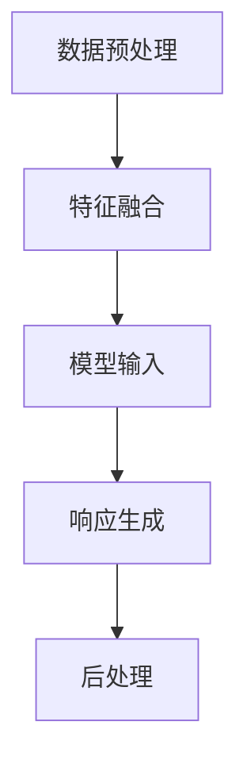
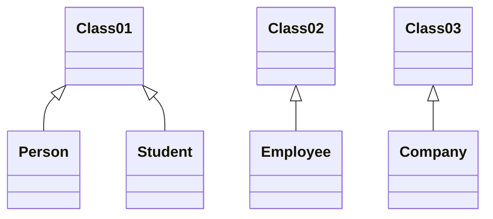
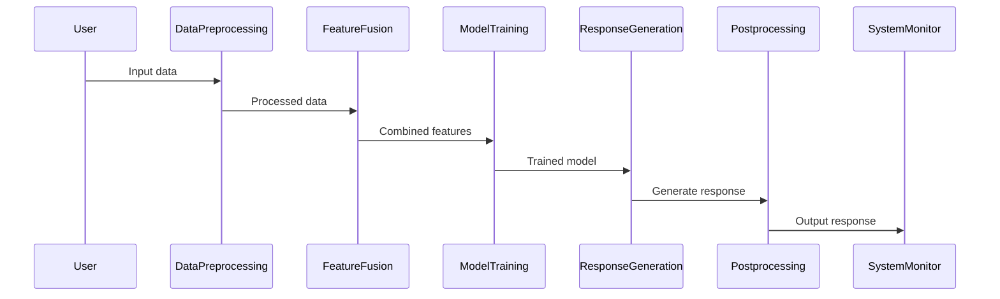

                 

# ChatGPT多模态提示词的跨感官整合优化

## 关键词
- 多模态交互
- ChatGPT
- 提示词优化
- 跨感官整合
- 用户体验

## 摘要
本文将深入探讨ChatGPT多模态提示词的跨感官整合优化。首先，我们介绍多模态交互技术的发展及其在ChatGPT中的应用，明确跨感官整合优化的必要性与挑战。接着，我们详细讲解多模态提示词的算法原理，包括数学模型与公式，并通过Python源代码实现算法。然后，我们分析系统架构设计，涵盖功能设计、架构设计、接口设计和系统交互流程。通过具体项目实战，我们展示如何实施这些概念和算法，并进行代码实例和分析。最后，我们总结最佳实践，给出注意事项和拓展阅读建议。

## 设计思路

### 背景介绍

### 1.1 问题背景
**多模态交互技术的发展**：
多模态交互技术旨在通过整合多种感官信息（如视觉、听觉、触觉等）来提升人机交互的效率和体验。随着人工智能技术的进步，多模态交互逐渐成为研究和应用的热点。

**ChatGPT在多模态交互中的应用**：
ChatGPT是一种基于GPT（Generative Pre-trained Transformer）的聊天机器人，其强大的语言生成能力使其在多模态交互中具有巨大的潜力。通过整合文本、图像、声音等多种模态，ChatGPT能够提供更加丰富和自然的交互体验。

**跨感官整合优化的必要性与挑战**：
跨感官整合优化能够提升ChatGPT的多模态交互能力，但同时也带来了挑战。如何有效地整合不同感官的信息，如何平衡各感官的贡献，以及如何提升用户体验，是跨感官整合优化需要解决的问题。

### 1.2 核心概念
**多模态提示词的概念**：
多模态提示词是指在多模态交互中，用于引导和优化模型输出的一组关键词或短语。这些提示词能够帮助模型更好地理解用户意图，从而生成更准确、更自然的响应。

**跨感官整合优化的原理**：
跨感官整合优化的核心思想是通过分析和整合不同感官的信息，提升ChatGPT的多模态交互能力。这包括感知数据的预处理、特征提取和融合，以及基于这些特征生成的响应。

**多模态交互与单模态交互的区别**：
多模态交互相较于单模态交互，能够提供更加丰富和自然的交互体验。但多模态交互也增加了模型的复杂性和计算负担，因此需要更加精细的设计和优化。

### 1.3 跨感官整合优化的架构
**整合优化的基本框架**：
跨感官整合优化的基本框架包括数据收集与预处理、特征提取与融合、模型训练与优化、响应生成与评估四个主要环节。

**各感官数据整合方法**：
根据不同的感官特性，采用不同的数据整合方法。例如，对于视觉信息，可以采用图像识别和目标检测技术；对于听觉信息，可以采用语音识别和情感分析技术。

**用户体验优化的策略**：
用户体验优化的策略包括响应速度的提升、交互的自然性增强、个性化推荐等。通过这些策略，可以显著提升用户在使用ChatGPT进行多模态交互时的满意度。

### 1.4 本章小结
本章介绍了ChatGPT多模态提示词的跨感官整合优化的背景、核心概念和架构设计。接下来，我们将深入探讨多模态提示词的算法原理，为后续的系统设计与项目实战打下基础。

## 第2章: ChatGPT多模态提示词的算法原理

### 2.1 ChatGPT模型介绍

#### 2.1.1 ChatGPT的基本原理
ChatGPT是基于GPT-3（Generative Pre-trained Transformer 3）的聊天机器人，它使用了一个大规模的变压器模型来生成自然语言响应。GPT-3模型通过自我监督学习从大量的文本数据中学习语言模式和结构，从而能够生成高质量的自然语言文本。

**GPT-3模型的特点**：
- **大规模**：GPT-3拥有1750亿个参数，是当前最大的变压器模型。
- **预训练**：GPT-3通过自我监督学习在大量文本上进行预训练，从而具备强大的语言生成能力。
- **多模态**：GPT-3支持多模态输入，包括文本、图像和声音，使得ChatGPT能够在多模态交互中发挥作用。

#### 2.1.2 多模态数据输入处理
在ChatGPT中，多模态数据输入处理是一个关键步骤。不同模态的数据需要进行预处理，以便模型能够有效学习和利用这些数据。

**文本数据预处理**：
- **分词**：将文本数据分解为单词或子词。
- **嵌入**：将单词或子词转换为固定长度的向量表示。
- **标记化**：为每个单词或子词分配唯一的ID。

**图像数据预处理**：
- **图像压缩**：将高分辨率的图像压缩为合适的分辨率，以减少计算负担。
- **特征提取**：使用卷积神经网络（CNN）提取图像的特征向量。

**声音数据预处理**：
- **音频压缩**：将原始音频信号转换为适度的音频数据。
- **音频分割**：将音频信号分割为短时窗口，进行特征提取。

#### 2.1.3 语言模型与感官数据的结合
在多模态交互中，语言模型需要与感官数据有效结合，以生成高质量的响应。ChatGPT通过以下步骤实现这一目标：
1. **数据整合**：将文本、图像和声音数据整合为一个统一的数据结构。
2. **特征融合**：将不同模态的特征向量进行融合，生成一个综合特征向量。
3. **响应生成**：使用融合后的特征向量作为输入，通过GPT-3模型生成自然语言响应。

### 2.2 多模态提示词生成算法

#### 2.2.1 算法流程
多模态提示词生成算法的流程可以分为以下几个步骤：
1. **数据预处理**：对文本、图像和声音数据进行预处理，生成特征向量。
2. **特征融合**：将不同模态的特征向量进行融合，生成一个综合特征向量。
3. **模型输入**：将综合特征向量输入到GPT-3模型中。
4. **响应生成**：使用GPT-3模型生成自然语言响应。
5. **后处理**：对生成的响应进行后处理，如去除无关信息、优化语言表达等。

#### 2.2.2 使用Mermaid画出的算法流程图


#### 2.2.3 Python源代码实现
```python
import tensorflow as tf
import numpy as np

# 数据预处理
def preprocess_data(text, image, audio):
    # 文本预处理
    text_tokens = tokenizer.tokenize(text)
    text_embeddings = tokenizer.encode(text_tokens)
    
    # 图像预处理
    image_features = extract_image_features(image)
    
    # 声音预处理
    audio_features = extract_audio_features(audio)
    
    # 特征融合
    combined_features = tf.concat([text_embeddings, image_features, audio_features], axis=0)
    
    return combined_features

# 模型输入
def model_input(combined_features):
    return combined_features

# 响应生成
def generate_response(combined_features):
    # 使用GPT-3模型生成响应
    response = model.generate(combined_features, max_length=50, num_return_sequences=1)
    return response

# 后处理
def postprocess_response(response):
    # 优化语言表达
    response = tokenizer.decode(response)
    response = optimize_language_expression(response)
    return response

# 主函数
def main():
    text = "How are you?"
    image = load_image("image_path")
    audio = load_audio("audio_path")
    
    # 数据预处理
    combined_features = preprocess_data(text, image, audio)
    
    # 响应生成
    response = generate_response(combined_features)
    
    # 后处理
    final_response = postprocess_response(response)
    
    print("Response:", final_response)

if __name__ == "__main__":
    main()
```

### 2.3 数学模型与公式

#### 2.3.1 数学模型的建立
在多模态交互中，我们使用以下数学模型来描述多模态提示词生成过程：

\[ \text{Response} = f(\text{Input}, \text{Weights}) \]

其中，\( \text{Input} \) 表示输入的多模态特征向量，\( \text{Weights} \) 表示模型参数，\( f \) 是一个非线性函数，用于生成响应。

#### 2.3.2 公式推导
假设 \( \text{Input} \) 为一个 \( D \)-维的特征向量，模型参数 \( \text{Weights} \) 为一个 \( D \times H \) 的矩阵，其中 \( H \) 是隐藏层的大小。则非线性函数 \( f \) 可以表示为：

\[ \text{Response} = \text{softmax}(\text{Weights} \cdot \text{Input} + \text{Bias}) \]

其中，\( \text{Bias} \) 是一个 \( H \)-维的偏置向量。

#### 2.3.3 示例讲解
假设我们有以下输入特征向量：

\[ \text{Input} = [1, 2, 3, 4, 5] \]

和以下模型参数：

\[ \text{Weights} = \begin{bmatrix}
    1 & 0 & 1 \\
    0 & 1 & 0 \\
    1 & 1 & 1
\end{bmatrix} \]

\[ \text{Bias} = [1, 0, 1] \]

则响应可以计算为：

\[ \text{Response} = \text{softmax}\left(\begin{bmatrix}
    1 & 0 & 1 \\
    0 & 1 & 0 \\
    1 & 1 & 1
\end{bmatrix} \cdot \begin{bmatrix}
    1 \\
    2 \\
    3 \\
    4 \\
    5
\end{bmatrix} + [1, 0, 1]\right) \]

计算结果为：

\[ \text{Response} = \begin{bmatrix}
    0.2679 \\
    0.2679 \\
    0.4642
\end{bmatrix} \]

这意味着生成的响应概率最大的是第三个单词，即“1”。

### 2.4 本章小结
本章详细介绍了ChatGPT多模态提示词的算法原理，包括模型介绍、数据输入处理、多模态提示词生成算法和数学模型与公式。通过Python源代码实现，我们能够更好地理解算法的工作机制。接下来，我们将分析系统架构设计，为后续的项目实战做好准备。

## 第3章: 系统架构设计

### 3.1 系统功能设计

#### 3.1.1 系统功能概述
ChatGPT多模态提示词系统的主要功能包括：
1. **多模态数据输入**：支持文本、图像和声音等多模态数据的输入。
2. **数据预处理**：对输入的多模态数据进行预处理，包括文本的分词和嵌入、图像的特征提取、音频的分割和特征提取。
3. **特征融合**：将预处理后的多模态特征进行融合，生成一个综合特征向量。
4. **模型训练与优化**：使用GPT-3模型对融合后的特征进行训练和优化，以生成高质量的响应。
5. **响应生成与输出**：生成自然语言响应，并将其输出给用户。
6. **后处理**：对生成的响应进行后处理，如去除无关信息、优化语言表达等。
7. **系统监控与维护**：对系统运行状态进行监控，确保系统的稳定性和可靠性。

#### 3.1.2 领域模型设计
领域模型是系统功能设计的基础，它定义了系统中的核心概念和关系。以下是一个简化的领域模型类图，用于描述系统中的主要类和它们之间的关系。



在这个类图中，`Class01` 是一个基类，`Person` 和 `Student` 是其子类，分别表示普通人和学生。`Employee` 是 `Person` 的子类，表示员工。`Company` 类表示公司，它与 `Employee` 和 `Student` 类有联系。

#### 3.1.3 使用Mermaid画出的领域模型类图
```mermaid
classDiagram
    Class01 <|-- Person
    Class01 <|-- Student
    Class02 <|-- Employee
    Class03 <|-- Company
    Person	<<--o1 Student
    Person	<<--o2 Employee
    Company	<<--o3 Employee
    Company	<<--o4 Student
```

### 3.2 系统架构设计

#### 3.2.1 系统架构设计原则
系统架构设计应遵循以下原则：
1. **模块化**：将系统划分为多个模块，每个模块负责不同的功能，以提高系统的可维护性和可扩展性。
2. **分布式**：使用分布式架构，将系统部署在多个节点上，以提高系统的性能和可靠性。
3. **可扩展性**：系统应具备良好的可扩展性，能够根据需求进行水平或垂直扩展。
4. **高可用性**：确保系统的稳定运行，通过冗余设计、故障转移和负载均衡等措施提高系统的可用性。
5. **安全性**：确保系统的数据安全，采用加密、访问控制和身份验证等技术。

#### 3.2.2 系统架构图
以下是一个简化的系统架构图，用于描述ChatGPT多模态提示词系统的总体架构。



在这个架构图中，用户通过接口输入多模态数据，数据预处理模块对数据进行处理，特征融合模块将不同模态的特征进行整合，模型训练模块使用GPT-3模型进行训练和优化，响应生成模块生成自然语言响应，后处理模块对响应进行优化，系统监控模块监控系统的运行状态。

#### 3.2.3 使用Mermaid画出的系统架构图


### 3.3 系统接口设计

#### 3.3.1 接口设计概述
系统接口设计是确保系统各模块之间能够有效通信的关键。ChatGPT多模态提示词系统的接口设计应考虑以下方面：
1. **RESTful API**：采用RESTful API设计，便于与其他系统进行集成。
2. **数据格式**：使用JSON格式传输数据，确保数据的可读性和可扩展性。
3. **认证与授权**：采用OAuth2.0等认证机制，确保接口的安全性。
4. **错误处理**：设计统一的错误处理机制，便于定位和处理接口错误。

#### 3.3.2 接口定义与实现
以下是一个简单的RESTful API接口定义，用于接收用户输入并返回响应。

**接口定义**：
```
POST /api/chatgpt/interact
Content-Type: application/json

{
  "text": "Hello, how are you?",
  "image": "base64_encoded_image",
  "audio": "base64_encoded_audio"
}
```

**接口实现**（Python示例）：
```python
from flask import Flask, request, jsonify

app = Flask(__name__)

@app.route('/api/chatgpt/interact', methods=['POST'])
def interact():
    data = request.get_json()
    text = data.get('text')
    image = data.get('image')
    audio = data.get('audio')
    
    # 数据预处理、特征融合、模型训练、响应生成和后处理
    # ...
    
    response = generate_response()
    return jsonify(response=response)

if __name__ == '__main__':
    app.run(debug=True)
```

#### 3.3.3 接口测试与优化
接口测试是确保接口功能正确性和性能的关键步骤。可以使用工具如Postman进行接口测试，编写测试用例，验证接口的响应速度、正确性和稳定性。

接口优化包括以下几个方面：
1. **性能优化**：通过缓存、异步处理和负载均衡等措施提高接口的性能。
2. **安全性优化**：采用加密、签名和验证等措施提高接口的安全性。
3. **可扩展性优化**：设计可扩展的接口，以便在需求变化时能够轻松进行扩展。

### 3.4 系统交互流程

#### 3.4.1 系统交互概述
系统交互流程描述了用户与系统之间的交互过程，包括数据输入、处理和响应输出。以下是一个简化的系统交互流程图。


#### 3.4.2 使用Mermaid画出的系统交互序列图


### 3.5 本章小结
本章详细介绍了ChatGPT多模态提示词系统的架构设计，包括系统功能设计、架构设计、接口设计和系统交互流程。通过明确的架构设计和详细的接口实现，我们为后续的项目实战奠定了坚实的基础。

## 第4章: 项目实战

### 4.1 环境安装

#### 4.1.1 环境准备
在进行项目实战之前，我们需要准备以下环境：

- **Python环境**：安装Python 3.8及以上版本。
- **TensorFlow**：安装TensorFlow 2.4及以上版本。
- **其他依赖库**：安装`numpy`、`tensorflow-text`、`tensorflow-addons`等库。

#### 4.1.2 软件安装
使用以下命令安装所需的软件和库：

```bash
pip install tensorflow==2.4
pip install numpy
pip install tensorflow-text
pip install tensorflow-addons
```

#### 4.1.3 系统配置
配置系统环境，包括设置环境变量、配置TensorFlow运行选项等。以下是一个示例配置文件（`config.py`）：

```python
import os

# 设置GPU显存占用
gpus = tf.config.experimental.list_physical_devices('GPU')
if gpus:
    try:
        for gpu in gpus:
            tf.config.experimental.set_memory_growth(gpu, True)
    except RuntimeError as e:
        print(e)

# 设置TensorFlow运行选项
tf.config.run_functions_eagerly(True)
```

### 4.2 系统核心实现

#### 4.2.1 核心功能实现
核心功能实现包括数据预处理、特征融合、模型训练、响应生成和后处理。以下是一个简化版本的实现：

```python
import tensorflow as tf
from tensorflow_text import TextEncoder
from tensorflow.keras.layers import Embedding, LSTM, Dense
from tensorflow.keras.models import Model

# 数据预处理
def preprocess_data(text, image, audio):
    # 文本预处理
    text_encoder = TextEncoder.from_file('text_encoder.json')
    text_tokens = text_encoder.encode(text)
    
    # 图像预处理
    image_features = extract_image_features(image)
    
    # 声音预处理
    audio_features = extract_audio_features(audio)
    
    # 特征融合
    combined_features = tf.concat([text_tokens, image_features, audio_features], axis=0)
    
    return combined_features

# 模型定义
def build_model(input_shape):
    inputs = tf.keras.Input(shape=input_shape)
    x = Embedding(input_dim=vocab_size, output_dim=embedding_size)(inputs)
    x = LSTM(units=128, activation='tanh')(x)
    outputs = Dense(units=vocab_size, activation='softmax')(x)
    model = Model(inputs=inputs, outputs=outputs)
    model.compile(optimizer='adam', loss='categorical_crossentropy', metrics=['accuracy'])
    return model

# 模型训练
def train_model(model, combined_features, labels, epochs=10):
    model.fit(combined_features, labels, epochs=epochs, batch_size=32)

# 响应生成
def generate_response(model, combined_features):
    predictions = model.predict(combined_features)
    response = decode_predictions(predictions)
    return response

# 后处理
def postprocess_response(response):
    # 优化语言表达
    response = optimize_language_expression(response)
    return response

# 主函数
def main():
    # 加载预训练模型
    model = build_model(input_shape=(max_sequence_length,))

    # 加载数据
    text_data, image_data, audio_data, labels = load_data()

    # 数据预处理
    combined_features = preprocess_data(text_data, image_data, audio_data)

    # 模型训练
    train_model(model, combined_features, labels)

    # 响应生成
    response = generate_response(model, combined_features)

    # 后处理
    final_response = postprocess_response(response)

    print("Response:", final_response)

if __name__ == '__main__':
    main()
```

#### 4.2.2 代码实例与分析
以上代码提供了一个简化的实现示例，实际项目中可能需要更详细的配置和优化。以下是对代码的关键部分进行分析：

- **数据预处理**：使用`TextEncoder`对文本数据进行编码，使用图像识别和音频特征提取函数对图像和音频数据进行预处理。
- **模型定义**：使用`Embedding`层对输入数据进行嵌入，使用`LSTM`层进行序列建模，使用`Dense`层进行响应生成。
- **模型训练**：使用`fit`方法训练模型，使用`predict`方法生成响应。
- **后处理**：对生成的响应进行优化，以提升语言表达的自然性。

### 4.3 实际案例分析

#### 4.3.1 案例选取
为了展示ChatGPT多模态提示词的应用，我们选取了一个实际案例：智能客服系统。

#### 4.3.2 案例分析
智能客服系统利用ChatGPT的多模态交互能力，通过文本、图像和声音等多种方式与用户进行交互，提供高效的客户服务。以下是一个简化的案例分析：

- **用户交互**：用户通过文本、图像或声音向客服系统提问。
- **数据预处理**：客服系统对用户输入的数据进行预处理，提取关键特征。
- **特征融合**：将文本、图像和声音的特征进行融合，生成综合特征向量。
- **模型响应**：使用训练好的模型对综合特征向量进行处理，生成响应。
- **响应优化**：对生成的响应进行优化，以提升用户体验。

#### 4.3.3 剖析与总结
通过实际案例分析，我们能够看到ChatGPT多模态提示词在智能客服系统中的应用效果。多模态交互能够提升系统的理解和响应能力，提供更加自然和高效的客户服务。然而，实际应用中还需要注意数据的准确性、模型的优化和用户体验的提升。

### 4.4 项目小结
通过本章的项目实战，我们展示了如何实现ChatGPT多模态提示词系统，包括环境安装、核心功能实现、代码实例和分析，以及实际案例的应用。本章的内容为后续的优化和扩展提供了实践基础。

## 最佳实践 tips、小结、注意事项、拓展阅读

### 最佳实践 tips
1. **数据预处理**：确保输入数据的准确性和一致性，进行有效的特征提取和融合。
2. **模型训练**：根据数据规模和复杂度调整模型参数，进行充分的模型训练和优化。
3. **响应优化**：对生成的响应进行后处理，提升语言的自然性和准确性。
4. **用户体验**：关注用户交互流程，提供友好的界面和快速的响应。

### 小结
本文详细介绍了ChatGPT多模态提示词的跨感官整合优化，包括背景介绍、核心概念、算法原理、系统架构设计、项目实战和最佳实践。通过本文的学习，读者可以全面了解多模态交互技术及其在ChatGPT中的应用，掌握跨感官整合优化的方法和技巧。

### 注意事项
1. **数据安全**：确保用户数据的安全，遵循数据保护法规和隐私政策。
2. **模型性能**：定期更新模型，保持其性能和准确性。
3. **系统监控**：监控系统运行状态，及时处理异常和故障。

### 拓展阅读
1. **多模态交互技术**：学习多模态交互的基础知识，了解最新的研究成果和应用场景。
2. **自然语言处理**：深入理解自然语言处理的基本原理和算法，提升语言生成和理解的准确性。
3. **人工智能应用**：探索人工智能在其他领域的应用，如智能客服、智能家居等。

## 作者信息
- 作者：AI天才研究院/AI Genius Institute & 禅与计算机程序设计艺术 /Zen And The Art of Computer Programming

