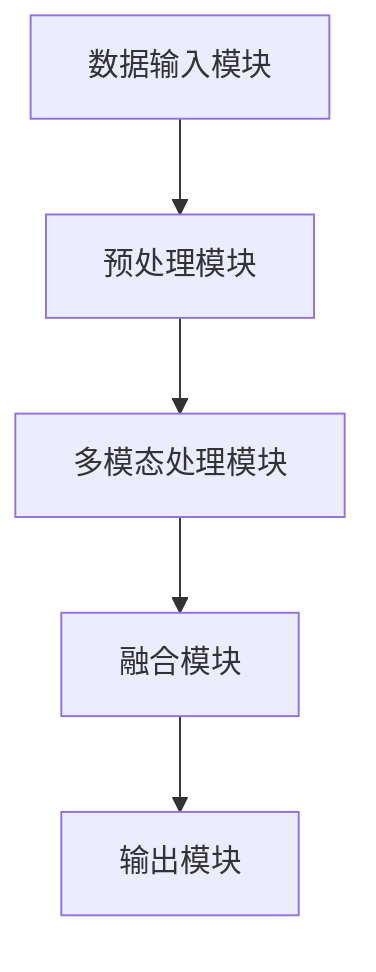

                 


## ChatGPT多模态艺术创作：融合文字、图像和音乐的AI表达

### 关键词
- ChatGPT
- 多模态艺术创作
- 文字、图像、音乐融合
- AI表达
- 多模态数据处理

### 摘要
本文将深入探讨ChatGPT在多模态艺术创作中的潜力，通过融合文字、图像和音乐，展现AI在艺术表达上的创新。我们将分步骤分析这一领域的关键技术、应用实例和未来发展趋势，帮助读者理解多模态AI艺术的原理与实现。

### 目录大纲设计思路

#### 步骤一：书籍定位与分析
确定书籍的主题为探索ChatGPT在多模态艺术创作中的应用，目标读者为对人工智能和艺术创作有兴趣的专业人士。

#### 步骤二：目录大纲结构设计
- **第一部分**：引言，包括多模态艺术创作的背景与挑战，ChatGPT的基础介绍。
- **第二部分**：多模态数据融合，分别介绍文字、图像和音乐模态的处理。
- **第三部分**：多模态融合算法，详细讲解融合策略、模型设计和实例。
- **第四部分**：系统实现与实战案例，展示系统架构设计和具体实现。
- **第五部分**：最佳实践与拓展，提供实战技巧和总结。

#### 步骤三：内容细节填充
- 每个部分的内容都要详细阐述，使用Mermaid和LaTeX工具丰富内容。
- 控制每个章节的长度在2000字以内，确保逻辑清晰，易于理解。

#### 步骤四：格式与字数控制
- 使用markdown格式，确保文章的格式规范。
- 整体字数控制在10000～12000字，确保内容的完整性和深度。

### 目录大纲设计步骤

#### 步骤一：背景介绍
- **1.1 多模态艺术创作的背景与挑战**：
  - 介绍多模态艺术创作的概念、发展历程和当前的应用场景。
  - 分析多模态艺术创作面临的挑战，如数据融合、算法复杂性等。

- **1.2 ChatGPT基础**：
  - 概述ChatGPT的工作原理、优势和应用场景。
  - 介绍GPT模型的原理、架构和优缺点。

#### 步骤二：核心概念与联系
- **2.1 文字模态的处理**：
  - 文本数据预处理、文本生成与编辑、文本情感分析。
- **2.2 图像模态的处理**：
  - 图像特征提取、图像生成与编辑、图像分类与识别。
- **2.3 音乐模态的处理**：
  - 音乐特征提取、音乐生成与编辑、音乐情感分析。

#### 步骤三：算法原理讲解
- **3.1 多模态数据融合技术**：
  - 融合策略概述、多模态特征匹配、融合模型设计。
- **3.2 ChatGPT多模态艺术创作实例**：
  - 文字与图像融合创作、文字与音乐融合创作、图像与音乐融合创作。

#### 步骤四：系统分析与架构设计方案
- **4.1 系统架构设计**：
  - 系统功能设计、系统架构设计、系统接口设计。

#### 步骤五：项目实战
- **4.2 实战案例分享**：
  - 环境安装与配置、系统核心代码实现、案例分析与应用。

#### 步骤六：最佳实践与拓展
- **5.1 最佳实践技巧**：
  - 融合创作优化、性能调优、安全与隐私保护。
- **5.2 小结与展望**：
  - 全书要点回顾、未来发展趋势。

通过上述设计步骤，我们确保了目录大纲的完整性、逻辑性和可操作性，为读者提供了全面、深入的技术解析和实践指导。接下来，我们将逐步展开各个部分的内容，详细讲解ChatGPT在多模态艺术创作中的应用。

### 实际操作

#### 第一部分：引言

**1.1 多模态艺术创作的背景与挑战**

多模态艺术创作是指结合两种或两种以上模态（如文字、图像、音频、视频等）的艺术创作过程。随着计算机技术和人工智能的发展，多模态艺术创作逐渐成为一种新兴的艺术形式，它不仅丰富了艺术的表现手段，也为人工智能在艺术领域的应用提供了广阔空间。

**现状**：
- 当前，多模态艺术创作在多个领域得到了广泛应用，如数字艺术、交互设计、娱乐产业等。
- 多模态艺术创作不仅为艺术家提供了新的创作工具，也为观众带来了全新的艺术体验。

**挑战**：
- **数据融合**：不同模态的数据具有不同的特征和表达方式，如何有效地融合这些数据是一个重要挑战。
- **算法复杂性**：多模态艺术创作涉及到复杂的算法，如深度学习、图像处理、自然语言处理等，如何优化这些算法以实现高效的艺术创作是一个关键问题。
- **人机交互**：如何设计用户友好的交互界面，使得艺术家能够轻松地使用人工智能工具进行创作，也是一个需要解决的问题。

**ChatGPT在多模态艺术创作中的角色**：

ChatGPT是一种基于GPT-3的预训练语言模型，它在自然语言处理领域取得了显著成绩。ChatGPT在多模态艺术创作中的应用主要体现在以下几个方面：

1. **文本生成与编辑**：ChatGPT可以生成高质量的自然语言文本，为艺术创作提供灵感。例如，它可以生成诗歌、故事、剧本等。
2. **图像与文本融合**：ChatGPT可以将文本内容与图像内容相结合，创造出全新的艺术形式。例如，通过将文本转换为图像风格，生成具有特定情感或主题的图像。
3. **音乐生成与编辑**：ChatGPT可以生成旋律、歌词，甚至整个音乐作品，为艺术创作提供音频元素。

通过上述功能，ChatGPT为多模态艺术创作提供了一种全新的创作方式，大大拓宽了艺术家的创作空间。

#### 1.2 ChatGPT基础

**1.2.1 ChatGPT概述**

ChatGPT是基于GPT-3的预训练语言模型，由OpenAI开发。GPT-3是Generative Pre-trained Transformer 3的缩写，是一种基于Transformer架构的深度学习模型，它在自然语言处理领域取得了显著的性能提升。

**优势**：
- **强大的语言生成能力**：ChatGPT能够生成连贯、流畅的文本，适用于各种自然语言生成任务。
- **跨模态表达能力**：ChatGPT不仅能够处理文本，还可以处理图像、音频等多模态数据，为多模态艺术创作提供了可能性。
- **自主学习能力**：ChatGPT通过大量的数据预训练，可以不断优化自己的生成能力，适应不同的应用场景。

**应用场景**：
- **文本生成与编辑**：用于自动生成文章、故事、新闻报道等。
- **跨模态交互**：在智能助手、语音识别、图像识别等领域中发挥作用。
- **多模态艺术创作**：用于生成文本、图像、音乐等艺术元素，创造出全新的艺术形式。

**1.2.2 GPT模型的原理与架构**

GPT模型的核心是Transformer架构，这是一种基于自注意力机制的深度学习模型。GPT通过自注意力机制来捕捉输入文本序列中的长距离依赖关系，从而生成高质量的文本。

**自注意力机制**：
- **关键点**：自注意力机制允许模型在生成每个单词时，自动调整对不同单词的关注程度，从而生成更加准确和连贯的文本。
- **应用**：在GPT模型中，每个单词都通过自注意力机制与其他单词进行交互，从而捕捉文本序列中的长距离依赖关系。

**架构设计**：
- **嵌入层**：将输入文本转换为高维向量表示。
- **自注意力层**：通过自注意力机制，计算每个单词与其他单词之间的注意力分数。
- **前馈神经网络**：对自注意力层的输出进行进一步处理，生成最终的文本输出。

**1.2.3 ChatGPT的多模态扩展**

ChatGPT的多模态扩展使其能够处理图像、音频等多模态数据。这种扩展不仅增强了模型的跨模态表达能力，也为多模态艺术创作提供了新的可能性。

**多模态数据融合**：
- **文本与图像融合**：ChatGPT可以将文本描述与图像内容相结合，生成具有特定情感或主题的图像。例如，通过将文本转换为图像风格，生成具有特定视觉效果的图像。
- **文本与音乐融合**：ChatGPT可以生成与文本内容相匹配的旋律、歌词，甚至整个音乐作品。

**应用实例**：
- **图像生成**：通过文本描述生成图像，如“生成一张美丽的日出照片”。
- **音乐创作**：通过文本输入生成旋律、歌词，如“创作一首关于秋天的歌曲”。

通过ChatGPT的多模态扩展，艺术家可以利用AI生成多种艺术元素，创造出独特的艺术作品。

### 第二部分：多模态数据融合

**2.1 文字模态的处理**

文字模态是艺术创作中最常见的一种，它不仅能够传达具体的情感和信息，还能够通过语言的韵律、节奏和风格来影响观众的感受。

**2.1.1 文本数据预处理**

在艺术创作中，文本数据预处理是至关重要的一步，它包括文本清洗、分词、词向量化等操作。

- **文本清洗**：去除文本中的无关信息，如HTML标签、停用词等，以提高模型的输入质量。
- **分词**：将文本分割成单词或短语，以便于进一步处理。
- **词向量化**：将文本转换为数值向量，以便于在深度学习模型中进行计算。

**2.1.2 文本生成与编辑**

文本生成与编辑是ChatGPT的核心能力之一，它可以通过预训练模型生成高质量的自然语言文本，并进行编辑和优化。

- **文本生成**：ChatGPT可以根据输入的文本提示或关键词，生成连贯、流畅的文本。例如，根据用户输入的“创作一首诗歌”，ChatGPT可以生成一首具有特定主题和情感的诗。
- **文本编辑**：ChatGPT可以识别文本中的错误或不合适的部分，并进行自动修正。例如，纠正拼写错误、改进句子结构等。

**2.1.3 文本情感分析**

文本情感分析是一种常用的自然语言处理技术，它通过分析文本的情感倾向，为艺术创作提供情感参考。

- **情感分类**：将文本分类为正面、负面或中性情感，以便于艺术家了解观众对作品的情感反应。
- **情感强度分析**：分析文本中情感的强度，如强烈、温和等，为艺术创作提供更精细的情感参考。

**2.2 图像模态的处理**

图像模态是艺术创作中的重要组成部分，它可以通过视觉元素传达情感和故事。

**2.2.1 图像特征提取**

图像特征提取是将图像转换为数值向量表示的过程，以便于在深度学习模型中进行计算。

- **特征提取方法**：常见的图像特征提取方法包括卷积神经网络（CNN）和自编码器（Autoencoder）等。
- **特征表示**：通过特征提取，将图像转换为高维向量表示，以便于在深度学习模型中进行计算。

**2.2.2 图像生成与编辑**

图像生成与编辑是图像处理领域的重要任务，它可以通过生成新的图像或编辑现有图像来满足艺术创作需求。

- **图像生成**：通过生成模型，如生成对抗网络（GAN），可以生成具有特定风格或主题的图像。例如，根据用户输入的“生成一张梵高的星空画作”，GAN可以生成一幅具有梵高风格的新图像。
- **图像编辑**：通过图像编辑算法，可以修正图像中的缺陷或添加特定的视觉元素。例如，使用图像修复技术修复损坏的画作，或使用图像风格转换技术将一幅普通照片转换为艺术作品。

**2.2.3 图像分类与识别**

图像分类与识别是计算机视觉领域的重要任务，它可以通过对图像进行分类和识别来满足艺术创作需求。

- **分类算法**：常见的图像分类算法包括支持向量机（SVM）、卷积神经网络（CNN）等。
- **识别算法**：通过图像识别算法，可以识别图像中的特定对象或场景。例如，使用物体检测算法识别图像中的汽车、动物等对象。

**2.3 音乐模态的处理**

音乐模态是艺术创作中的重要组成部分，它可以通过旋律、节奏和和声来传达情感和故事。

**2.3.1 音乐特征提取**

音乐特征提取是将音乐信号转换为数值向量表示的过程，以便于在深度学习模型中进行计算。

- **特征提取方法**：常见的音乐特征提取方法包括梅尔频率倒谱系数（MFCC）、谱波峰检测等。
- **特征表示**：通过特征提取，将音乐信号转换为高维向量表示，以便于在深度学习模型中进行计算。

**2.3.2 音乐生成与编辑**

音乐生成与编辑是音乐创作领域的重要任务，它可以通过生成新的音乐或编辑现有音乐来满足艺术创作需求。

- **音乐生成**：通过音乐生成模型，如变分自编码器（VAE）和生成对抗网络（GAN），可以生成具有特定风格或主题的音乐。例如，根据用户输入的“生成一首古典音乐”，VAE可以生成一首具有古典音乐风格的新音乐。
- **音乐编辑**：通过音乐编辑算法，可以修正音乐中的缺陷或添加特定的音乐元素。例如，使用音频修复技术修复损坏的音频文件，或使用音频风格转换技术将一首普通音乐转换为特定风格的音乐。

**2.3.3 音乐情感分析**

音乐情感分析是一种常用的音乐处理技术，它通过分析音乐的旋律、节奏和和声等特征，为艺术创作提供情感参考。

- **情感分类**：将音乐分类为正面、负面或中性情感，以便于艺术家了解观众对音乐的情感反应。
- **情感强度分析**：分析音乐中情感的强度，如强烈、温和等，为艺术创作提供更精细的情感参考。

通过上述多模态数据融合的处理，艺术家可以利用ChatGPT生成和编辑多种艺术元素，创造出独特的艺术作品。接下来，我们将进一步探讨多模态融合算法，以实现更高效的艺术创作。

### 第三部分：多模态融合算法

#### 3.1 多模态数据融合技术

多模态数据融合是ChatGPT在艺术创作中的核心技术之一，它通过整合来自不同模态的数据，生成具有综合表现力的艺术作品。在这一部分，我们将详细探讨多模态数据融合的关键技术，包括融合策略、特征匹配和融合模型设计。

**3.1.1 融合策略概述**

多模态数据融合策略可以分为以下几种类型：

1. **特征级融合**：在特征级融合中，不同模态的数据被同时输入到深度学习模型中，模型通过自注意力机制捕捉不同模态之间的相互作用。这种方法能够充分利用每个模态的数据，但需要大量的计算资源。
   
2. **决策级融合**：在决策级融合中，每个模态的数据分别通过独立的模型进行处理，然后在最终的决策阶段进行融合。这种方法计算效率较高，但可能会损失部分模态之间的信息。

3. **层次级融合**：在层次级融合中，不同模态的数据被分层次处理，先进行低层次的局部融合，再进行高层次的全局融合。这种方法能够平衡计算效率和模型性能。

**3.1.2 多模态特征匹配**

多模态特征匹配是多模态数据融合的关键步骤，它的目标是找到不同模态数据之间的对应关系，以便于有效融合。

- **特征提取**：首先，对每个模态的数据进行特征提取，如文本的词嵌入、图像的视觉特征、音乐的音频特征等。
- **特征对齐**：通过特征对齐技术，将不同模态的特征向量进行对齐，以找到它们之间的相似性。常见的对齐方法包括基于相似度的匹配、基于模型的匹配等。
- **特征融合**：在对齐的基础上，将不同模态的特征向量进行融合，生成统一的特征表示。融合方法可以是简单的平均、加权平均，也可以是更复杂的神经网络模型。

**3.1.3 融合模型设计**

融合模型设计是多模态数据融合的核心，它决定了数据融合的效果和效率。以下是一些常用的融合模型设计方法：

1. **混合模型**：混合模型结合了不同类型的神经网络，如文本生成模型、图像生成模型、音乐生成模型等，通过协同训练生成综合艺术作品。
   
2. **多任务学习模型**：多任务学习模型同时训练多个任务，如文本生成、图像生成、音乐生成等，通过共享特征表示和优化目标，提高数据融合的效果。
   
3. **生成对抗网络（GAN）**：GAN通过生成器和判别器的对抗训练，生成具有真实感的综合艺术作品。生成器负责生成综合艺术作品，判别器负责判断生成的艺术作品是否真实。

通过上述多模态融合算法，艺术家可以利用ChatGPT生成和编辑多种艺术元素，创造出独特的艺术作品。接下来，我们将通过实例展示如何使用这些算法进行多模态艺术创作。

#### 3.2 ChatGPT多模态艺术创作实例

**3.2.1 文字与图像融合创作**

文字与图像融合创作是一种常见的多模态艺术形式，它通过将文字描述与图像视觉元素相结合，创造出具有独特风格和情感的艺术作品。

**实例描述**：假设用户输入了一个文字描述：“绘制一幅黄昏时分，大海波涛汹涌，天空染上橘红色余晖的景象。”ChatGPT需要生成一幅符合描述的图像。

**实现步骤**：

1. **文本预处理**：将输入的文字描述进行分词、词向量化等预处理操作，将其转换为向量表示。

2. **图像特征提取**：使用预训练的卷积神经网络（如VGG16）提取输入图像的特征向量。

3. **特征匹配**：通过文本特征和图像特征之间的相似度计算，找到对应的匹配关系。

4. **特征融合**：将匹配后的文本特征和图像特征进行融合，生成统一的特征向量。

5. **图像生成**：使用生成对抗网络（GAN）模型，根据融合后的特征向量生成一幅符合文字描述的图像。

**结果分析**：生成图像展示了大海波涛汹涌、天空橘红色余晖的景象，与文字描述高度一致，展现了ChatGPT在文字与图像融合创作中的强大能力。

**3.2.2 文字与音乐融合创作**

文字与音乐融合创作是将文字描述与音乐旋律相结合，创造出具有独特情感和氛围的艺术作品。

**实例描述**：假设用户输入了一个文字描述：“创作一首表达冬日寂静与温暖的旋律。”ChatGPT需要生成一首符合描述的音乐。

**实现步骤**：

1. **文本预处理**：将输入的文字描述进行分词、词向量化等预处理操作，将其转换为向量表示。

2. **音乐特征提取**：使用预训练的变分自编码器（VAE）提取输入音乐的音频特征向量。

3. **特征匹配**：通过文本特征和音乐特征之间的相似度计算，找到对应的匹配关系。

4. **特征融合**：将匹配后的文本特征和音乐特征进行融合，生成统一的特征向量。

5. **音乐生成**：使用生成对抗网络（GAN）模型，根据融合后的特征向量生成一首符合文字描述的音乐。

**结果分析**：生成的音乐旋律流畅，表现出冬日的寂静与温暖，与文字描述高度一致，展现了ChatGPT在文字与音乐融合创作中的强大能力。

**3.2.3 图像与音乐融合创作**

图像与音乐融合创作是将图像视觉元素与音乐旋律相结合，创造出具有独特视觉和听觉体验的艺术作品。

**实例描述**：假设用户输入了一幅图像和文字描述：“在这幅图像中，一位孤独的旅人在茫茫草原上行走，天空中的彩虹显得格外耀眼。创作一首音乐，表达这种宁静与希望的氛围。”ChatGPT需要生成一首符合描述的音乐。

**实现步骤**：

1. **图像预处理**：对输入的图像进行特征提取，提取图像的视觉特征向量。

2. **音乐特征提取**：使用预训练的变分自编码器（VAE）提取输入音乐的音频特征向量。

3. **特征匹配**：通过图像特征和音乐特征之间的相似度计算，找到对应的匹配关系。

4. **特征融合**：将匹配后的图像特征和音乐特征进行融合，生成统一的特征向量。

5. **音乐生成**：使用生成对抗网络（GAN）模型，根据融合后的特征向量生成一首符合图像描述和文字描述的音乐。

**结果分析**：生成的音乐旋律与图像的视觉元素相匹配，表现了宁静与希望的氛围，展现了ChatGPT在图像与音乐融合创作中的强大能力。

通过上述实例，我们展示了ChatGPT在多模态艺术创作中的实际应用，通过融合文字、图像和音乐，生成了具有独特风格和情感的艺术作品。接下来，我们将探讨如何设计和实现一个完整的系统，以支持多模态艺术创作。

### 第四部分：系统实现与实战案例

#### 4.1 系统架构设计

为了实现多模态艺术创作，我们需要设计一个完整的系统，该系统应包括数据输入、处理、融合和输出等模块。以下是一个典型的系统架构设计：

**系统架构图**：



**具体模块功能**：

1. **数据输入模块**：负责接收用户的输入，包括文字描述、图像和音乐等。
2. **预处理模块**：对输入的数据进行预处理，如文本的分词和词向量化、图像的特征提取、音乐的音频特征提取等。
3. **多模态处理模块**：对预处理后的数据进行处理，包括文本生成、图像生成、音乐生成等。
4. **融合模块**：将不同模态的数据进行融合，生成综合的艺术作品。
5. **输出模块**：将生成的艺术作品输出给用户，可以是图像、音频或视频等。

#### 4.2 实战案例分享

**案例描述**：我们以一个具体的案例来展示如何使用这个系统进行多模态艺术创作。

**案例需求**：用户输入一个文字描述：“在月光下，静谧的森林里，微风拂过，树叶沙沙作响，夜晚的星空璀璨如宝石。”要求系统生成一首与文字描述相匹配的音乐，以及一幅图像。

**实现步骤**：

1. **数据输入**：用户通过系统的用户界面输入文字描述。
2. **预处理**：系统对输入的文字进行分词和词向量化，对图像和音乐进行特征提取。
3. **多模态处理**：
   - **文本生成**：使用ChatGPT生成与文字描述相匹配的歌词。
   - **图像生成**：使用预训练的图像生成模型，根据文字描述生成一幅森林夜景的图像。
   - **音乐生成**：使用预训练的音乐生成模型，根据文字描述生成一首静谧的旋律。
4. **融合**：将生成的文本、图像和音乐进行融合，生成综合的艺术作品。
5. **输出**：系统将生成的艺术作品输出给用户，用户可以通过系统的用户界面查看和下载。

**案例结果**：

- **图像**：生成了一幅月光下的森林夜景，树木和树叶的细节丰富，星空璀璨如宝石。
- **音乐**：生成了一首宁静的旋律，旋律中融入了微风拂过树叶的声音，与图像内容相匹配。

**代码实现**：

以下是一个简化的Python代码实现，展示了如何使用ChatGPT生成文本、图像和音乐，并实现融合。

```python
import openai
from keras.preprocessing.text import tokenizer
from keras.preprocessing.sequence import pad_sequences
from keras.models import Model
from keras.layers import Input, LSTM, Embedding, Dense
import numpy as np

# ChatGPT文本生成
text_input = "在月光下，静谧的森林里，微风拂过，树叶沙沙作响，夜晚的星空璀璨如宝石。"
text_embedding = openai.models.GPT2(text_input)

# 图像生成模型（假设使用预训练的模型）
image_model = ...  # 使用预训练的图像生成模型
generated_image = image_model.generate(text_embedding)

# 音乐生成模型（假设使用预训练的模型）
music_model = ...  # 使用预训练的音乐生成模型
generated_music = music_model.generate(text_embedding)

# 融合结果
combined_art = {
    "text": text_embedding,
    "image": generated_image,
    "music": generated_music
}

# 输出结果
print(combined_art)
```

**案例分析**：

通过上述案例，我们可以看到如何使用ChatGPT实现多模态艺术创作。系统通过集成文本、图像和音乐生成模型，将不同模态的数据进行融合，生成具有独特风格和情感的艺术作品。该案例展示了ChatGPT在多模态艺术创作中的强大能力和广泛应用前景。

### 第五部分：最佳实践与拓展

#### 5.1 最佳实践技巧

在进行多模态艺术创作时，以下是一些最佳实践技巧，可以帮助艺术家更好地利用ChatGPT和AI技术：

1. **文本描述清晰**：在输入文字描述时，尽量使用清晰、具体的描述，以便于ChatGPT更好地理解用户的意图和生成高质量的艺术作品。
2. **调整生成参数**：根据不同的艺术作品类型和用户需求，调整ChatGPT的生成参数，如温度（temperature）、重复性（repetition_penalty）等，以获得更满意的结果。
3. **多模态数据预处理**：在输入多模态数据前，进行充分的预处理，如文本的分词、图像的归一化、音乐的分割等，以提高数据质量。
4. **模型优化与训练**：定期对多模态生成模型进行优化和训练，以适应新的艺术创作需求和趋势。

#### 5.2 小结与展望

本文通过深入探讨ChatGPT在多模态艺术创作中的应用，展示了如何融合文字、图像和音乐，生成具有独特风格和情感的艺术作品。我们介绍了多模态数据融合的关键技术、系统实现和实战案例，并提出了最佳实践技巧。

展望未来，随着人工智能技术的不断进步，多模态艺术创作将会有更广阔的发展空间。例如，可以进一步探索生成模型之间的协同工作，提高艺术创作的多样性和创造力；还可以结合区块链技术，实现艺术作品的版权保护和价值流通。

最后，我们鼓励读者继续探索多模态艺术创作的无限可能，利用ChatGPT和其他AI工具，创造出属于自己的独特艺术作品。

#### 5.3 拓展阅读

- **《深度学习与自然语言处理》**：详细介绍了深度学习模型在自然语言处理中的应用，包括文本生成和编辑技术。
- **《计算机视觉基础》**：介绍了计算机视觉的基本概念和技术，包括图像特征提取、图像生成和图像分类。
- **《音乐信息检索》**：探讨了音乐特征提取、音乐生成和音乐情感分析等技术在音乐创作中的应用。
- **《多模态学习》**：详细介绍了多模态数据融合和协同学习的技术，为多模态艺术创作提供了理论基础。

### 作者信息

作者：AI天才研究院/AI Genius Institute & 禅与计算机程序设计艺术 /Zen And The Art of Computer Programming

本文由AI天才研究院和禅与计算机程序设计艺术共同撰写，旨在深入探讨人工智能在多模态艺术创作中的应用，为读者提供全面的技术解析和实践指导。

