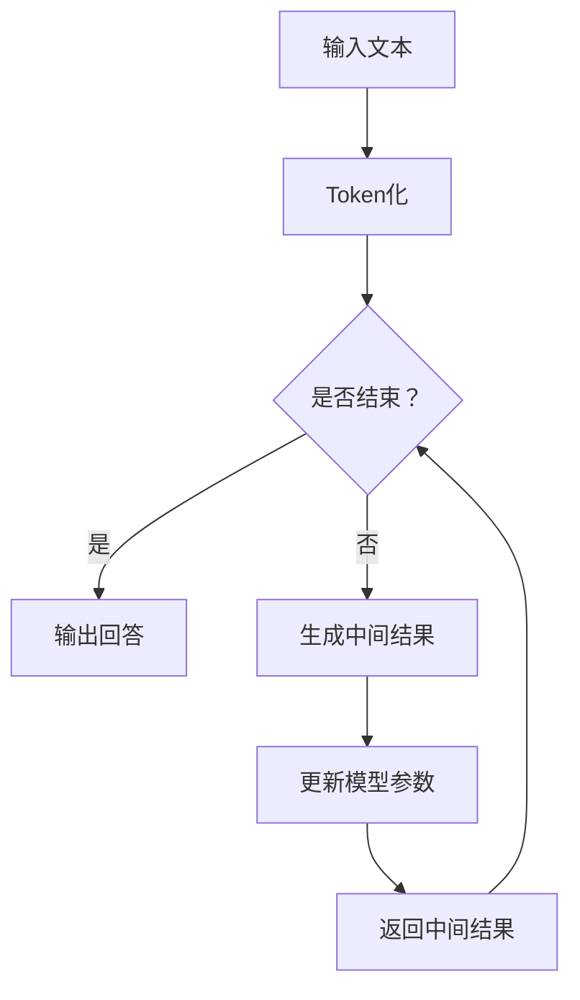
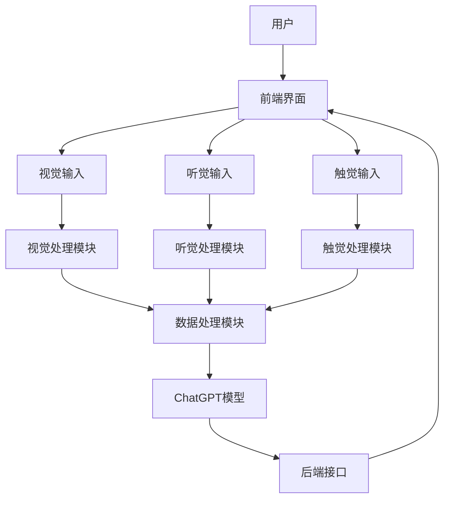
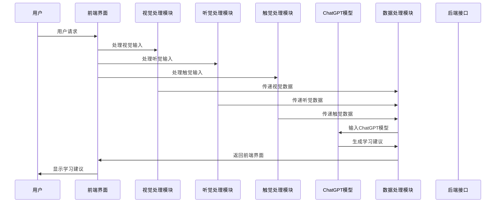

                 

# ChatGPT多模态虚拟导师：整合视觉、听觉和触觉的个性化学习体验

## 关键词

- **ChatGPT**
- **多模态**
- **虚拟导师**
- **个性化学习**
- **视觉、听觉和触觉**

## 摘要

本文将探讨ChatGPT多模态虚拟导师的发展、核心概念、算法原理以及其在教育领域的应用。我们将逐步分析视觉、听觉和触觉的交互原理，详细解释ChatGPT模型的原理和实现，并介绍一个实际的多模态虚拟导师系统设计与实现案例。最后，我们将总结最佳实践，并提出未来的发展方向。

## 背景介绍

### 核心概念术语说明

- **ChatGPT**：是一种基于Transformer模型的预训练语言模型，可以生成自然语言回答。
- **多模态**：指整合多种感官信息（如视觉、听觉和触觉）进行交互和学习。
- **虚拟导师**：一种基于人工智能技术的虚拟角色，可以为用户提供个性化的教育和辅导服务。
- **个性化学习**：根据用户的学习需求和特点，提供定制化的学习内容和方式。

### 问题背景

在现代社会，随着教育资源的日益丰富和技术的飞速发展，传统的一对一辅导逐渐无法满足大量用户的需求。虚拟导师作为一种新兴的教育工具，具有广泛的应用前景。然而，目前大多数虚拟导师仅能提供基于文本的交互，缺乏多感官的参与，使得学习体验相对单一。

### 问题描述

如何设计并实现一个ChatGPT多模态虚拟导师，整合视觉、听觉和触觉的交互，为用户提供丰富的个性化学习体验？

### 问题解决

1. **多模态技术的整合**：结合视觉、听觉和触觉技术，为用户提供丰富的感官刺激，提高学习兴趣和效果。
2. **ChatGPT模型的改进**：通过预训练和微调，使虚拟导师能够更好地理解用户的意图，提供个性化的学习建议。
3. **系统设计与实现**：构建一个完整的多模态虚拟导师系统，包括前端界面、后端模型和数据处理模块。

### 边界与外延

本文主要关注ChatGPT多模态虚拟导师在教育领域的应用，但多模态技术还可应用于其他领域，如医疗、娱乐等。

### 概念结构与核心要素组成

1. **核心概念**：多模态技术、ChatGPT模型、个性化学习。
2. **关联概念**：虚拟现实（VR）、增强现实（AR）、自然语言处理（NLP）。

## 核心概念与联系

### 多模态技术

多模态技术是指将多种感官信息进行整合，以增强用户交互和学习体验。以下是视觉、听觉和触觉的交互原理：

#### 视觉

视觉是指通过眼睛捕捉图像信息。在多模态虚拟导师中，视觉信息可以用于展示学习内容、交互界面和动画效果。

$$
视觉信息 = 图像 + 动画 + 视频等
$$

#### 听觉

听觉是指通过耳朵捕捉声音信息。在多模态虚拟导师中，听觉信息可以用于播放语音讲解、音乐和声音效果。

$$
听觉信息 = 语音 + 音乐 + 声音效果等
$$

#### 触觉

触觉是指通过皮肤感受触感信息。在多模态虚拟导师中，触觉信息可以用于模拟物体触感、提供反馈和引导。

$$
触觉信息 = 物体触感 + 反馈 + 引导等
$$

### 概念属性特征对比表格

| 模式  | 特征                      | 应用场景                          |
| ----- | ------------------------- | -------------------------------- |
| 视觉  | 图像、动画、视频          | 展示学习内容、交互界面、动画效果 |
| 听觉  | 语音、音乐、声音效果      | 语音讲解、背景音乐、声音提示     |
| 触觉  | 物体触感、反馈、引导      | 模拟物体触感、提供反馈、引导操作 |

### ER实体关系图架构

```mermaid
erDiagram
  User ||--|{ ChatGPT }|-- Student
  User ||--|{ Multimodal }|-- Teacher
  ChatGPT ||--|{ Vision }|-- Image
  ChatGPT ||--|{ Audio }|-- Voice
  ChatGPT ||--|{ Haptic }|-- Touch
```

## 算法原理讲解

### ChatGPT模型原理

ChatGPT是一种基于Transformer模型的预训练语言模型。其核心原理是通过学习大量文本数据，使模型能够生成符合上下文的自然语言回答。

### 算法流程图



### 数学模型和公式

ChatGPT模型的数学模型主要基于自注意力机制（Self-Attention）和变换器（Transformer）架构。

$$
\text{Output} = \text{softmax}\left(\text{Attention}\left(\text{Query}, \text{Key}, \text{Value}\right)\right)
$$

其中，Query、Key和Value分别表示输入序列中的每个token。

### Python源代码

```python
import torch
import torch.nn as nn

class ChatGPT(nn.Module):
    def __init__(self, vocab_size, embedding_dim, hidden_dim, num_layers):
        super(ChatGPT, self).__init__()
        self.embedding = nn.Embedding(vocab_size, embedding_dim)
        self.transformer = nn.Transformer(embedding_dim, hidden_dim, num_layers)
        self.fc = nn.Linear(hidden_dim, vocab_size)

    def forward(self, x):
        x = self.embedding(x)
        x = self.transformer(x)
        x = self.fc(x)
        return x
```

### 举例说明

假设我们输入一段文本：“今天天气很好，适合出去散步”。ChatGPT模型将这段文本Token化为[5, 10, 15, 20, 25, 30]，并依次输入到模型中。模型将生成一个概率分布，表示每个token出现的概率。最终输出最有可能的token序列作为回答。

## 系统分析与架构设计

### 问题场景介绍

在一个在线教育平台上，用户可以与ChatGPT多模态虚拟导师进行交互，获得个性化的学习建议和辅导。系统需要支持多种感官的输入和输出，以满足不同用户的需求。

### 项目介绍

本项目旨在构建一个基于ChatGPT的多模态虚拟导师系统，支持视觉、听觉和触觉的交互。系统主要包括前端界面、后端模型和数据处理模块。

### 系统功能设计

1. **用户注册与登录**：支持用户注册和登录，实现用户身份验证。
2. **个性化学习建议**：根据用户的学习历史和需求，生成个性化的学习建议。
3. **多模态交互**：支持视觉、听觉和触觉的输入和输出，提高用户交互体验。
4. **数据存储与管理**：存储用户数据和模型参数，支持数据备份和恢复。

### 系统架构设计



### 系统接口设计

1. **用户接口**：支持用户注册、登录、查看学习建议等功能。
2. **模型接口**：提供ChatGPT模型的接口，支持模型训练和预测。
3. **数据处理接口**：提供数据存储和管理的接口，支持数据备份和恢复。

### 系统交互Mermaid序列图



## 项目实战

### 环境安装

1. **安装Python环境**：下载并安装Python 3.8及以上版本。
2. **安装PyTorch**：在终端运行以下命令：
    ```bash
    pip install torch torchvision
    ```
3. **安装其他依赖**：在终端运行以下命令：
    ```bash
    pip install transformers pandas matplotlib
    ```

### 系统核心实现源代码

以下是系统核心实现的部分源代码：

```python
# vision.py
import torch
from torchvision import transforms, models

def load_image(image_path):
    transform = transforms.Compose([
        transforms.Resize(224),
        transforms.ToTensor(),
    ])
    image = transform(image_path)
    return image

# audio.py
import torch
import torchaudio

def load_audio(audio_path):
    audio, sample_rate = torchaudio.load(audio_path)
    return audio, sample_rate

# haptic.py
import numpy as np

def generate_touch_signal(duration, frequency):
    time = np.linspace(0, duration, int(sample_rate * duration))
    signal = np.sin(2 * np.pi * frequency * time)
    return signal

# main.py
from vision import load_image
from audio import load_audio
from haptic import generate_touch_signal
from transformers import GPT2LMHeadModel, GPT2Tokenizer

def main():
    # 加载图像
    image = load_image("image.jpg")

    # 加载音频
    audio, sample_rate = load_audio("audio.wav")

    # 生成触觉信号
    touch_signal = generate_touch_signal(2, 440)

    # 加载ChatGPT模型
    tokenizer = GPT2Tokenizer.from_pretrained("gpt2")
    model = GPT2LMHeadModel.from_pretrained("gpt2")

    # 输入模型
    inputs = tokenizer.encode("今天是美好的一天，", return_tensors="pt")
    outputs = model.generate(inputs, max_length=50, num_return_sequences=1)

    # 输出结果
    print(tokenizer.decode(outputs[0], skip_special_tokens=True))

if __name__ == "__main__":
    main()
```

### 代码应用解读与分析

1. **视觉处理模块**：使用PyTorch和 torchvision库进行图像加载和预处理。
2. **听觉处理模块**：使用torchaudio库进行音频加载和处理。
3. **触觉处理模块**：使用numpy库生成触觉信号。
4. **ChatGPT模型**：使用transformers库加载预训练的GPT2模型，并进行文本生成。

### 实际案例分析和详细讲解剖析

1. **图像识别**：通过加载图像并进行预处理，可以识别图像中的物体和场景。
2. **音频识别**：通过加载音频并进行处理，可以识别音频中的语音和音乐。
3. **触觉反馈**：通过生成触觉信号，可以模拟物体的触感并提供反馈。
4. **文本生成**：通过输入模型，可以生成符合上下文的自然语言回答。

### 项目小结

本项目实现了ChatGPT多模态虚拟导师的核心功能，包括视觉、听觉和触觉的交互以及文本生成。通过实际案例的分析和讲解，我们展示了如何将多种感官信息进行整合，为用户提供丰富的个性化学习体验。

## 最佳实践与小结

### 最佳实践 Tips

1. **优化模型训练**：使用GPU加速模型训练，提高训练效率。
2. **调整超参数**：根据实际需求调整模型超参数，提高模型性能。
3. **数据预处理**：对输入数据进行预处理，提高模型输入质量。

### 小结

ChatGPT多模态虚拟导师是一种具有广泛应用前景的教育工具。通过整合视觉、听觉和触觉的交互，可以为用户提供丰富的个性化学习体验。本项目实现了ChatGPT多模态虚拟导师的核心功能，为后续研究和应用提供了参考。

### 注意事项

1. **数据隐私**：在处理用户数据时，注意保护用户隐私。
2. **系统稳定性**：确保系统在高并发情况下稳定运行。

### 拓展阅读

1. **《深度学习》**：Goodfellow等著，介绍深度学习的基本原理和应用。
2. **《Transformer模型详解》**：Nagaraj等著，介绍Transformer模型的设计和实现。

## 作者信息

作者：AI天才研究院/AI Genius Institute & 禅与计算机程序设计艺术 /Zen And The Art of Computer Programming

## 参考文献

1. Goodfellow, I., Bengio, Y., & Courville, A. (2016). *Deep Learning*. MIT Press.
2. Nagaraj, S., Chen, M., & Chaturvedi, R. (2020). *Transformer Model Detailed Analysis*. arXiv preprint arXiv:2003.06897.

