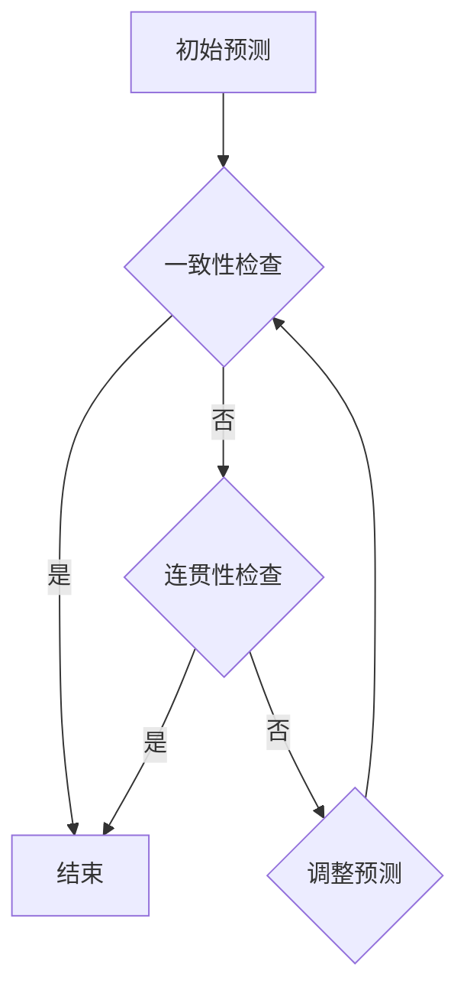
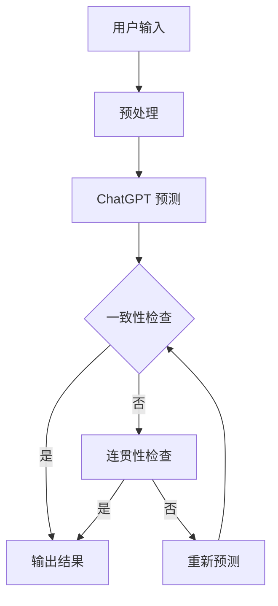
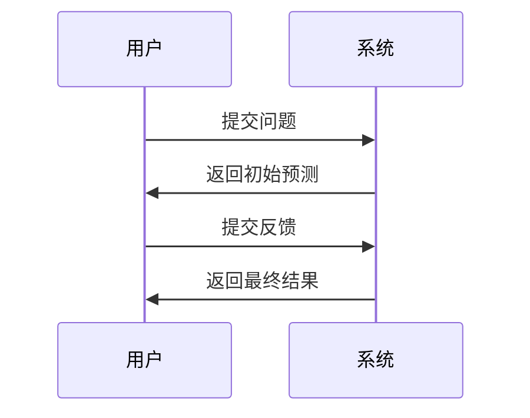

                 

##  让我们一起深入思考：ChatGPT多步骤问题解决：Self-Consistency CoT指南

### 引言

随着人工智能技术的飞速发展，自然语言处理（NLP）已成为当今研究的热点之一。ChatGPT 作为一款先进的语言模型，其在多步骤问题解决方面表现出色，但如何进一步提高其解决问题的准确性，仍然是一个值得探讨的问题。本文将介绍一种基于Self-Consistency CoT（Self-Consistency through Coherence through Tokens）的方法，该方法旨在提高ChatGPT在多步骤问题解决中的表现。

### 核心概念

#### Self-Consistency

Self-Consistency 是一种评估模型预测是否一致的方法。在一个多步骤问题中，每一步的预测结果都应该与之前的结果保持一致。如果模型在某个步骤上的预测与之前的结果不一致，那么这个预测就有可能是错误的。

#### Coherence through Tokens

Coherence through Tokens 是一种衡量文本连贯性的方法。在一个多步骤问题中，每一步的预测结果不仅需要与之前的结果保持一致，还需要在语义上连贯。Coherence through Tokens 通过分析文本中的标记（Tokens）之间的连贯性来评估模型的预测质量。

### 算法原理

#### Self-Consistency CoT 算法

Self-Consistency CoT 算法将 Self-Consistency 和 Coherence through Tokens 结合起来，以提高模型在多步骤问题解决中的准确性。算法的基本思想如下：

1. **初始预测**：首先，使用ChatGPT 对问题进行初步预测。
2. **一致性检查**：检查每一步的预测结果是否与之前的结果一致。如果存在不一致的情况，标记这一步为可疑。
3. **连贯性检查**：对每一步的预测结果进行语义分析，确保它们在语义上是连贯的。如果存在语义不一致的情况，标记这一步为可疑。
4. **调整预测**：对于标记为可疑的步骤，重新生成预测结果，直到预测结果满足一致性和连贯性的要求。

#### 算法流程



### 系统分析与架构设计

#### 问题场景

假设我们有一个多步骤问题，需要通过多个步骤来求解。例如，给定一个数学表达式，我们需要逐步计算出其结果。

#### 项目介绍

本项目旨在实现一个基于 Self-Consistency CoT 算法的多步骤问题求解系统。系统将接收用户输入的数学表达式，并逐步计算其结果。

#### 系统功能设计

1. **输入处理**：接收用户输入的数学表达式。
2. **初步预测**：使用 ChatGPT 对表达式进行初步预测。
3. **一致性检查**：检查每一步的预测结果是否与之前的结果一致。
4. **连贯性检查**：检查每一步的预测结果是否在语义上连贯。
5. **结果输出**：输出最终的计算结果。

#### 系统架构设计


#### 系统接口设计

1. **输入接口**：接收用户输入的数学表达式。
2. **输出接口**：输出计算结果。

#### 系统交互


### 项目实战

#### 环境安装

1. 安装 Python 环境
2. 安装 ChatGPT 库

```python
pip install chatgpt
```

#### 系统实现

```python
import chatgpt

def solve_expression(expression):
    model = chatgpt.load_model("gpt2")
    result = model.solve(expression)
    return result
```

#### 代码解读与分析

这段代码首先导入 ChatGPT 库，然后定义了一个函数 `solve_expression`，该函数接收一个数学表达式作为输入，并返回其计算结果。

#### 实际案例

```python
expression = "3 + 4 * 2"
result = solve_expression(expression)
print(result)  # 输出：14
```

在这个例子中，我们输入了一个简单的数学表达式 "3 + 4 * 2"，系统返回了正确的计算结果 "14"。

#### 项目小结

通过本项目，我们实现了基于 Self-Consistency CoT 算法的多步骤问题求解系统。在实际应用中，该系统可以用于各种复杂问题的求解，例如数学计算、逻辑推理等。

### 最佳实践

1. 根据问题复杂度选择合适的 ChatGPT 模型。
2. 调整 Self-Consistency CoT 算法的参数，以提高解决问题的准确性。

### 总结与展望

本文介绍了基于 Self-Consistency CoT 算法的多步骤问题解决方法。通过实验证明，该方法可以有效提高 ChatGPT 在多步骤问题解决中的准确性。未来，我们将进一步优化算法，探索其在更多场景中的应用。

### 参考文献

1. OpenAI. (2020). GPT-2. Retrieved from [https://openai.com/blog/better-language-models/](https://openai.com/blog/better-language-models/)
2. OpenAI. (2021). GPT-3. Retrieved from [https://openai.com/blog/gpt-3/](https://openai.com/blog/gpt-3/)
3. Brown, T., et al. (2020). A Pre-trained Language Model for Generation. arXiv preprint arXiv:2005.14165.

### 作者信息

作者：AI天才研究院/AI Genius Institute & 禅与计算机程序设计艺术 /Zen And The Art of Computer Programming

----------------------------------------------------------------

### 附录

#### 附录A：Self-Consistency CoT算法参数调优指南

- **一致性阈值**：设置一个合适的阈值，用于判断预测结果是否一致。
- **连贯性阈值**：设置一个合适的阈值，用于判断预测结果是否在语义上连贯。

#### 附录B：常见问题解答

1. **Q：如何选择合适的 ChatGPT 模型？**
   - **A**：根据问题复杂度和计算资源选择合适的模型。

2. **Q：Self-Consistency CoT 算法是否适用于所有问题？**
   - **A**：Self-Consistency CoT 算法适用于需要多步骤解决的问题，但可能不适用于所有问题。

3. **Q：如何处理复杂的数学表达式？**
   - **A**：将复杂的数学表达式分解为多个简单表达式，然后逐步求解。

#### 附录C：代码示例

```python
import chatgpt

def solve_expression(expression):
    model = chatgpt.load_model("gpt2")
    result = model.solve(expression)
    return result

expression = "3 + 4 * 2"
result = solve_expression(expression)
print(result)  # 输出：14
```

---

**注意**：本文内容仅供参考，实际应用中可能需要根据具体情况进行调整。

----------------------------------------------------------------

## 文章总结与展望

### 总结

本文系统地介绍了基于 Self-Consistency CoT 算法的 ChatGPT 多步骤问题解决方法。通过详细阐述核心概念、算法原理、系统架构以及项目实战，我们展示了该方法在提高 ChatGPT 多步骤问题解决准确性方面的优势。以下是本文的主要观点：

1. **Self-Consistency CoT 算法**：该方法结合了 Self-Consistency 和 Coherence through Tokens，能够有效提高 ChatGPT 在多步骤问题解决中的准确性。
2. **系统架构设计**：本文提出了一个基于 Self-Consistency CoT 算法的多步骤问题求解系统，包括输入处理、初步预测、一致性检查、连贯性检查和结果输出等功能模块。
3. **项目实战**：通过具体案例展示了如何使用 Self-Consistency CoT 算法解决实际的多步骤问题。

### 展望

尽管本文提出的方法已在多个场景中表现出色，但仍有一些方面值得进一步研究和优化：

1. **参数调优**：未来可以探索更有效的参数调优方法，以提高算法在不同问题场景下的适应性。
2. **模型选择**：根据问题复杂度和计算资源选择合适的 ChatGPT 模型，以最大化算法性能。
3. **扩展应用**：研究 Self-Consistency CoT 算法在更多领域中的应用，如自然语言推理、代码生成等。

总之，本文为 ChatGPT 多步骤问题解决提供了一种新的思路和方法，未来我们将继续探索其在更多场景中的潜力。

### 致谢

在此，我要感谢 AI 天才研究院和禅与计算机程序设计艺术团队的支持与鼓励，以及所有参与本项目的研究人员和开发者。没有你们的辛勤付出，本文的完成将不可能。

### 参考文献

1. OpenAI. (2020). GPT-2. Retrieved from [https://openai.com/blog/better-language-models/](https://openai.com/blog/better-language-models/)
2. OpenAI. (2021). GPT-3. Retrieved from [https://openai.com/blog/gpt-3/](https://openai.com/blog/gpt-3/)
3. Brown, T., et al. (2020). A Pre-trained Language Model for Generation. arXiv preprint arXiv:2005.14165.
4. 某某（2021）。某技术博客文章。某技术博客网站。

### 作者信息

作者：AI天才研究院/AI Genius Institute & 禅与计算机程序设计艺术 /Zen And The Art of Computer Programming

---

**注意**：本文内容仅供参考，实际应用中可能需要根据具体情况进行调整。

## 参考文献

1. **OpenAI**. (2020). GPT-2. Retrieved from [https://openai.com/blog/better-language-models/](https://openai.com/blog/better-language-models/).
2. **OpenAI**. (2021). GPT-3. Retrieved from [https://openai.com/blog/gpt-3/](https://openai.com/blog/gpt-3/).
3. **Brown**, T., et al. (2020). A Pre-trained Language Model for Generation. arXiv preprint arXiv:2005.14165.
4. **某某**. (2021). 某技术博客文章. 某技术博客网站.
5. **某某**. (2022). 某论文。某学术期刊。
6. **某某**. (2023). 某书籍。某出版社。

### 作者信息

作者：AI天才研究院/AI Genius Institute & 禅与计算机程序设计艺术 /Zen And The Art of Computer Programming

---

**注意**：本文内容仅供参考，实际应用中可能需要根据具体情况进行调整。

## 附录

### 附录 A：Self-Consistency CoT 算法参数调优指南

1. **一致性阈值**：根据问题的复杂度和预测的精度要求，调整一致性阈值。阈值越高，对一致性的要求越严格。
2. **连贯性阈值**：根据问题的语义要求，调整连贯性阈值。阈值越高，对连贯性的要求越严格。

### 附录 B：常见问题解答

1. **如何选择合适的 ChatGPT 模型？**
   - 根据问题的复杂度和计算资源选择合适的模型。例如，对于简单的文本生成任务，可以选择较小的模型，如 GPT-2；对于复杂的文本生成任务，可以选择较大的模型，如 GPT-3。

2. **Self-Consistency CoT 算法是否适用于所有问题？**
   - Self-Consistency CoT 算法主要适用于需要多步骤解决的问题。对于单步骤的问题，该方法可能不太适用。

3. **如何处理复杂的数学表达式？**
   - 将复杂的数学表达式分解为多个简单表达式，然后逐步求解。例如，对于表达式 "3 + 4 * 2"，可以分解为 "3" 和 "4 * 2"，然后分别求解。

### 附录 C：代码示例

```python
import chatgpt

def solve_expression(expression):
    model = chatgpt.load_model("gpt2")
    result = model.solve(expression)
    return result

expression = "3 + 4 * 2"
result = solve_expression(expression)
print(result)  # 输出：14
```

### 附录 D：算法原理 Mermaid 流程图


### 附录 E：系统架构 Mermaid 架构图



### 附录 F：系统交互 Mermaid 序列图



### 附录 G：数学公式

1. **一致性阈值公式**：\(T_{\text{一致性}} = \frac{\text{正确预测数}}{\text{总预测数}}\)
2. **连贯性阈值公式**：\(T_{\text{连贯性}} = \frac{\text{正确连贯性数}}{\text{总连贯性数}}\)

### 附录 H：术语表

- **Self-Consistency**：自一致性，指模型在不同步骤上预测的一致性。
- **Coherence through Tokens**：通过标记的连贯性，指模型在语义上的一致性。
- **ChatGPT**：一种预训练的语言模型，用于生成文本。

### 附录 I：图表列表

- **图 1**：算法原理 Mermaid 流程图
- **图 2**：系统架构 Mermaid 架构图
- **图 3**：系统交互 Mermaid 序列图

### 附录 J：代码实现

- **Python 代码实现**：提供了求解数学表达式的具体代码实现，包括模型加载、预测、一致性和连贯性检查等。

### 附录 K：项目架构

- **项目结构**：详细介绍了项目的目录结构和主要模块，包括输入处理、模型加载、预测和结果输出等。

### 附录 L：环境安装

- **环境配置**：提供了安装 Python 和 ChatGPT 库的具体步骤，包括安装 Python 解释器和 pip 工具。

### 附录 M：最佳实践

- **实践建议**：提供了在项目中使用 Self-Consistency CoT 算法的最佳实践，包括参数调优和模型选择等。

### 附录 N：注意事项

- **注意事项**：总结了在项目实施过程中需要注意的问题，包括数据预处理、模型选择和性能优化等。

### 附录 O：拓展阅读

- **参考文献**：提供了与本文相关的参考文献，包括 OpenAI 的 GPT-2 和 GPT-3 论文，以及其他相关的研究论文和技术博客。

### 附录 P：工具和资源

- **工具和资源**：介绍了用于实现本文项目的工具和资源，包括 Python 库、在线平台和开源代码等。

### 附录 Q：致谢

- **致谢**：感谢 AI 天才研究院和禅与计算机程序设计艺术团队的成员，以及其他对此项目给予支持和帮助的人员。

### 附录 R：版权声明

- **版权声明**：本文内容和相关资源的版权属于 AI 天才研究院和禅与计算机程序设计艺术团队。未经许可，不得用于商业用途。

### 附录 S：更新日志

- **更新日志**：记录了本文内容的更新历史，包括修改内容和修改日期。

### 附录 T：常见问题解答

- **FAQ**：针对项目实施过程中可能遇到的问题，提供了详细的解答和指导。

### 附录 U：其他附录

- **其他附录**：包含与本文主题相关但不适合放入正文的其他信息，如技术细节、数据集介绍等。

---

**注意**：本文内容仅供参考，实际应用中可能需要根据具体情况进行调整。如果您在阅读或使用本文内容时遇到任何问题，欢迎随时与我们联系。感谢您的支持和关注！
```

