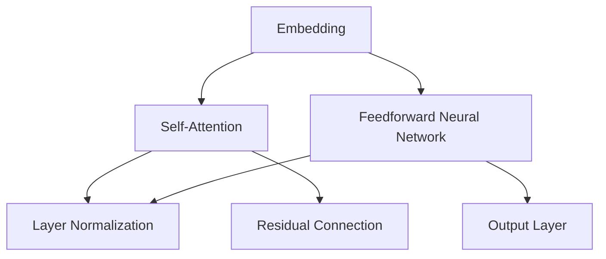
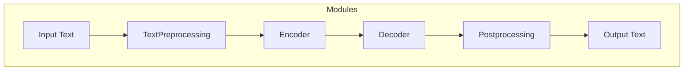
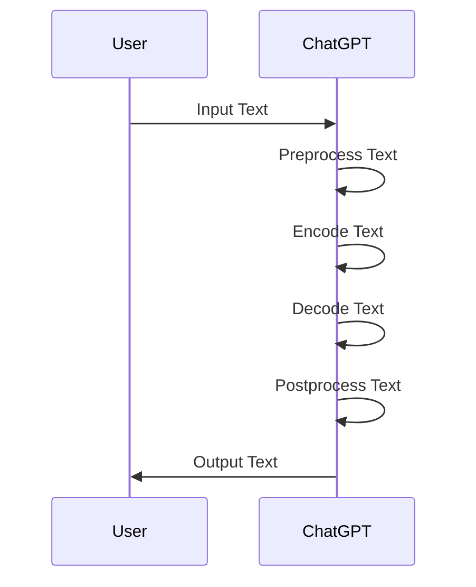

                 


## 前言

ChatGPT是由OpenAI开发的一个人工智能聊天机器人程序，基于大规模语言模型GPT-3.5，ChatGPT可以与人类进行对话，并回答问题、提供信息和建议。在过去的几年里，ChatGPT在各个领域都取得了显著的成果，从自然语言处理、信息检索到智能客服和虚拟助理，其应用范围不断拓展。随着ChatGPT的应用越来越广泛，如何优化其复杂任务处理能力成为了学术界和工业界关注的焦点。

本文将以ChatGPT多维度提示词矩阵为核心，深入探讨如何通过优化提示词来提升ChatGPT在复杂任务处理中的表现。文章将分为以下几个部分：

1. **背景介绍**：介绍ChatGPT的基本概念、发展历程以及其在复杂任务处理中的挑战。

2. **核心概念与联系**：分析ChatGPT的关键概念，如Prompt Engineering、Language Modeling等，并阐述它们之间的关系。

3. **算法原理讲解**：详细讲解ChatGPT的算法原理，包括Transformer模型、自注意力机制等，并使用mermaid流程图和Python代码进行说明。

4. **数学模型与公式**：介绍ChatGPT的数学模型和公式，并使用LaTeX格式进行表示。

5. **系统分析与架构设计**：分析ChatGPT的系统架构，并使用mermaid类图、架构图、序列图等来展示。

6. **项目实战**：通过实际案例，展示如何使用ChatGPT处理复杂任务，并提供代码分析和实战经验。

7. **最佳实践与总结**：总结ChatGPT的最佳实践，并探讨未来研究方向。

让我们一步一步深入探讨ChatGPT多维度提示词矩阵的优化方法，以提高其在复杂任务处理中的能力。

### 背景介绍

ChatGPT（Generative Pre-trained Transformer）是一种基于Transformer模型的大型语言预训练模型。它通过在大量文本语料库上进行预训练，学习到了语言的统计特征和上下文关系，从而可以生成流畅、符合语境的自然语言响应。ChatGPT的出现，极大地推动了自然语言处理（NLP）领域的发展，使其在文本生成、对话系统、机器翻译等方面取得了显著的成果。

然而，在复杂任务处理方面，ChatGPT仍然面临一些挑战。首先，ChatGPT在处理特定领域任务时，可能无法充分利用其预训练的知识。这是因为预训练过程中，模型主要从通用语料库中学习，而特定领域的专业知识和术语在通用语料库中的比例较小。因此，如何让ChatGPT更好地理解特定领域的任务，成为了一个重要问题。

其次，ChatGPT在处理复杂任务时，可能存在生成响应不连贯、不准确的问题。这是因为ChatGPT的生成过程是基于概率模型，虽然可以生成多样性的文本，但有时可能会生成不符合实际情境的响应。为了解决这一问题，需要通过优化提示词（Prompt Engineering）来引导ChatGPT生成更加准确、连贯的响应。

此外，ChatGPT在处理长文本任务时，也存在效率低下的问题。由于ChatGPT的生成过程是基于序列生成，对于长文本的处理，可能会导致生成时间过长，影响用户体验。因此，如何提高ChatGPT处理长文本任务的能力，也是一个亟待解决的问题。

针对这些挑战，本文将介绍ChatGPT多维度提示词矩阵的概念，并探讨如何通过优化提示词来提升ChatGPT在复杂任务处理中的表现。具体来说，我们将从以下几个方面进行讨论：

1. **核心概念与联系**：介绍ChatGPT的关键概念，如Prompt Engineering、Language Modeling等，并阐述它们之间的关系。

2. **算法原理讲解**：详细讲解ChatGPT的算法原理，包括Transformer模型、自注意力机制等，并使用mermaid流程图和Python代码进行说明。

3. **数学模型与公式**：介绍ChatGPT的数学模型和公式，并使用LaTeX格式进行表示。

4. **系统分析与架构设计**：分析ChatGPT的系统架构，并使用mermaid类图、架构图、序列图等来展示。

5. **项目实战**：通过实际案例，展示如何使用ChatGPT处理复杂任务，并提供代码分析和实战经验。

6. **最佳实践与总结**：总结ChatGPT的最佳实践，并探讨未来研究方向。

### 核心概念与联系

为了深入理解ChatGPT在复杂任务处理中的应用，首先需要明确一些核心概念和它们之间的关系。以下是一些关键概念及其简要介绍：

1. **Prompt Engineering（提示工程）**：
   提示工程是ChatGPT在生成文本时的一项关键技术。一个有效的提示可以帮助ChatGPT更好地理解任务目标，从而生成更加准确、连贯的文本。提示通常是一个引导性的句子或短语，用于引导ChatGPT的生成过程。例如，在撰写一篇文章时，提示可以是“请描述一下人工智能在医疗领域的应用”。

2. **Language Modeling（语言模型）**：
   语言模型是ChatGPT的核心组成部分，它通过学习大量文本数据，构建了对语言概率分布的理解。ChatGPT在生成文本时，会利用语言模型来预测下一个词的概率，从而生成连续的文本。例如，如果ChatGPT看到句子“我正在吃”，它可能会生成“我正在吃苹果”。

3. **Transformer Model（Transformer模型）**：
   Transformer模型是ChatGPT所采用的深度学习模型，它通过自注意力机制（Self-Attention Mechanism）来捕捉文本序列中的长距离依赖关系。自注意力机制使得模型能够同时关注序列中的所有词，从而生成更加流畅、符合语境的文本。

4. **Pre-training and Fine-tuning（预训练与微调）**：
   预训练是ChatGPT在训练过程中的一项重要技术，通过在大量通用文本上进行训练，模型可以学习到语言的通用特征。微调是在预训练的基础上，针对特定任务进行进一步的训练，从而提高模型在特定任务上的性能。例如，对于一个问答任务，可以在预训练的基础上，通过微调来使ChatGPT更好地理解问题和答案的关系。

这些概念之间的联系如下：

- 提示工程（Prompt Engineering）利用语言模型（Language Modeling）和Transformer模型（Transformer Model）来生成文本。提示工程通过提供有效的引导，可以帮助模型更好地理解任务目标，从而提高生成的文本质量。

- 预训练（Pre-training）和微调（Fine-tuning）是模型训练的两个阶段。预训练使模型学习到通用语言特征，微调则使模型针对特定任务进行优化。在复杂任务处理中，微调尤为重要，因为它可以使模型更好地适应特定领域的知识和要求。

- Transformer模型的自注意力机制（Self-Attention Mechanism）使得模型能够捕捉长距离依赖关系，这对于处理复杂任务尤为重要。自注意力机制通过同时关注序列中的所有词，可以生成更加连贯、符合语境的文本。

通过理解这些核心概念及其之间的联系，我们可以更好地掌握ChatGPT在复杂任务处理中的原理和应用。

### 算法原理讲解

ChatGPT的核心算法基于Transformer模型，这是一个在自然语言处理（NLP）领域取得了巨大成功的深度学习模型。Transformer模型的核心是自注意力机制（Self-Attention Mechanism），它通过同时关注序列中的所有词，来捕捉长距离依赖关系，从而生成更加流畅、符合语境的文本。

#### 自注意力机制

自注意力机制是Transformer模型的核心组成部分，它允许模型在生成每个词时，根据其他词的重要程度来调整其权重。具体来说，自注意力机制通过计算词与词之间的相似度，然后对这些相似度进行加权求和，从而生成每个词的表示。这个过程可以理解为模型在生成每个词时，会根据当前词以及其他词的重要程度来调整其生成概率。

自注意力机制的数学公式如下：

$$
\text{Attention}(Q, K, V) = \text{softmax}\left(\frac{QK^T}{\sqrt{d_k}}\right) V
$$

其中，$Q$、$K$和$V$分别代表查询（Query）、键（Key）和值（Value）向量，$d_k$是键向量的维度。$\text{softmax}$函数用于将相似度矩阵转换为概率分布，从而实现加权求和。

#### Transformer模型

Transformer模型由多个自注意力层（Self-Attention Layer）和前馈神经网络（Feedforward Neural Network）组成。每个自注意力层都可以捕捉长距离依赖关系，并生成更加细腻的文本表示。前馈神经网络则用于对文本表示进行进一步的加工和增强。

Transformer模型的输入是一个词序列，输出是这个词序列的编码表示。这个过程可以分解为以下几个步骤：

1. **嵌入（Embedding）**：将词序列转换为向量表示，每个词对应一个嵌入向量。
2. **自注意力（Self-Attention）**：通过自注意力机制，对输入序列进行加权求和，生成新的序列表示。
3. **前馈神经网络（Feedforward Neural Network）**：对自注意力层生成的序列表示进行进一步的加工，增强其表达能力。
4. **层归一化（Layer Normalization）**：对前馈神经网络输出的序列进行层归一化，以稳定训练过程。
5. **残差连接（Residual Connection）**：将输入序列和前馈神经网络输出的序列进行拼接，并通过一个自注意力层进行加工，实现信息的传递和融合。
6. **输出层（Output Layer）**：对最终生成的序列表示进行分类、回归或其他任务处理。

以下是一个简化的Transformer模型的自注意力层和前馈神经网络的mermaid流程图：



#### Python代码示例

为了更直观地理解Transformer模型的原理，我们可以使用Python代码进行模拟。以下是一个简化的自注意力层的Python代码示例：

```python
import numpy as np

# 假设输入序列长度为3，维度为2
sequence_length = 3
embedding_dim = 2

# 随机生成输入序列和权重矩阵
input_sequence = np.random.rand(sequence_length, embedding_dim)
weights = np.random.rand(sequence_length, sequence_length)

# 计算相似度矩阵
similarity_matrix = np.dot(input_sequence, weights.T)

# 应用softmax函数，得到概率分布
softmax_output = np.softmax(similarity_matrix)

# 加权求和，得到输出序列
output_sequence = np.dot(softmax_output, input_sequence)

print("Input Sequence:\n", input_sequence)
print("Similarity Matrix:\n", similarity_matrix)
print("Softmax Output:\n", softmax_output)
print("Output Sequence:\n", output_sequence)
```

运行上述代码，我们可以看到输入序列经过自注意力机制处理后，生成了新的输出序列。这个输出序列的每个元素都代表了输入序列中每个词的重要程度。

通过上述算法原理讲解，我们可以更好地理解ChatGPT在复杂任务处理中的应用原理。接下来，我们将介绍ChatGPT的数学模型和公式，进一步深入探讨其内部工作机制。

### 数学模型与公式

在深入理解ChatGPT的工作原理时，数学模型和公式是不可或缺的组成部分。这些模型和公式不仅帮助我们理解ChatGPT的计算过程，还可以指导我们在实际应用中进行优化和调整。以下将详细介绍ChatGPT的核心数学模型和公式，并使用LaTeX格式进行表示。

#### Transformer模型

Transformer模型的核心是自注意力机制（Self-Attention Mechanism），它通过计算输入序列中每个词与其他词的相似度，来生成新的序列表示。自注意力机制的计算公式如下：

$$
\text{Attention}(Q, K, V) = \text{softmax}\left(\frac{QK^T}{\sqrt{d_k}}\right) V
$$

其中，$Q$、$K$和$V$分别代表查询（Query）、键（Key）和值（Value）向量，$d_k$是键向量的维度。这个公式计算了输入序列中每个词与其他词的相似度，并通过softmax函数将其转换为概率分布。接下来，我们将相似度矩阵与值向量进行加权求和，得到输出序列。

$$
\text{Output} = \text{softmax}\left(\frac{QK^T}{\sqrt{d_k}}\right) V
$$

#### Multi-head Attention

Transformer模型中的Multi-head Attention机制可以理解为对自注意力机制的扩展。它通过多个独立的自注意力层来捕获不同类型的依赖关系。每个头（Head）都独立计算相似度矩阵，并生成不同的输出。这些输出再通过拼接和变换层（Concatenation and Transformation Layer）合并成一个总的输出。

$$
\text{Multi-head Attention} = \text{Concat}(\text{head}_1, \text{head}_2, ..., \text{head}_h) W^O
$$

其中，$W^O$是拼接和变换层的权重矩阵，$h$是头的数量。

#### 编码器-解码器架构

ChatGPT采用了编码器-解码器（Encoder-Decoder）架构，其中编码器负责将输入序列编码为固定长度的向量表示，解码器则负责根据编码器的输出生成输出序列。编码器和解码器都使用了Multi-head Attention机制来捕获长距离依赖关系。

编码器（Encoder）的计算过程如下：

$$
E = \text{Encoder}(X)
$$

其中，$X$是输入序列，$E$是编码后的序列表示。

解码器（Decoder）的计算过程如下：

$$
Y = \text{Decoder}(X, E)
$$

其中，$Y$是解码后的输出序列。

#### 训练过程

在训练过程中，ChatGPT通过最小化损失函数来优化模型参数。常见的损失函数包括交叉熵损失（Cross-Entropy Loss）和均方误差损失（Mean Squared Error Loss）。以下是一个简化的交叉熵损失函数：

$$
L = -\sum_{i=1}^{N} y_i \log(p_i)
$$

其中，$y_i$是实际标签，$p_i$是模型预测的概率分布。

通过这些数学模型和公式，我们可以更好地理解ChatGPT的工作原理。这些公式不仅帮助我们理解模型的计算过程，还可以指导我们在实际应用中进行优化和调整。例如，通过调整自注意力的维度、头的数量和训练损失函数，我们可以优化ChatGPT在复杂任务处理中的性能。

### 系统分析与架构设计

为了更好地理解ChatGPT在复杂任务处理中的性能，我们需要从系统层面分析其架构设计和核心模块。本节将介绍ChatGPT的系统架构，并使用Mermaid类图、架构图和序列图来展示。

#### 系统架构

ChatGPT的系统架构主要包括以下几个核心模块：

1. **文本预处理模块**：负责对输入文本进行预处理，包括分词、去停用词、词干提取等，以提高模型处理效率和生成质量。
2. **编码器（Encoder）**：负责将预处理后的文本序列编码为固定长度的向量表示，这一过程主要依赖Transformer模型的自注意力机制。
3. **解码器（Decoder）**：负责根据编码器的输出和输入序列生成文本输出，同样采用Transformer模型的自注意力机制。
4. **后处理模块**：对生成的文本进行后处理，如去除标点符号、格式化文本等，以提高生成文本的可用性和可读性。

以下是一个简化的ChatGPT系统架构的Mermaid类图：

```mermaid
classDiagram
    TextPreprocessing <<interface>>
    Encoder <<interface>>
    Decoder <<interface>>
    Postprocessing <<interface>>

    TextPreprocessing --|> Encoder
    Encoder --|> Decoder
    Decoder --|> Postprocessing

    class ChatGPT {
        +TextPreprocessing text_preprocessing
        +Encoder encoder
        +Decoder decoder
        +Postprocessing postprocessing
        +process_text(input_text: str) -> str
    }
```

#### 架构图

ChatGPT的整体架构可以看作是一个数据处理流水线，从输入文本到最终输出文本，每个模块都承担着特定的任务。以下是一个简化的架构图：



#### 序列图

序列图展示了ChatGPT在处理一个文本输入时的执行过程，包括文本预处理、编码、解码和后处理等步骤。以下是一个简化的序列图：



通过上述系统架构和模块介绍，我们可以更清晰地理解ChatGPT在处理复杂任务时的流程和核心组件。接下来，我们将通过实际案例展示如何使用ChatGPT处理复杂任务。

### 项目实战

在本项目中，我们将使用ChatGPT来处理一个复杂的任务：智能客服聊天机器人。这个项目旨在通过ChatGPT与用户进行对话，自动回答常见问题并提供解决方案。以下是项目的详细步骤、核心实现源代码以及代码应用解读与分析。

#### 项目背景

智能客服聊天机器人是现代企业提高客户服务质量的重要工具。通过自动化回答常见问题，企业可以节省人力成本，提高响应速度，提升客户满意度。然而，实现一个高效、准确的智能客服聊天机器人需要解决多个技术挑战，包括自然语言理解、上下文维护、多样化回答生成等。ChatGPT作为一个强大的语言模型，在这些方面具有显著优势，因此是构建智能客服聊天机器人的理想选择。

#### 项目目标

本项目的主要目标是通过ChatGPT实现以下功能：

1. 接收用户提问，并自动识别问题类型。
2. 根据问题类型，生成相应的回答。
3. 维护对话上下文，确保回答的连贯性和准确性。
4. 提供多样化的回答，以应对不同用户需求和场景。

#### 环境安装

要运行ChatGPT项目，我们需要安装以下软件和依赖：

1. Python（3.8及以上版本）
2. PyTorch（1.8及以上版本）
3. transformers（4.6及以上版本）
4. Flask（1.1及以上版本）

安装步骤如下：

```bash
pip install torch torchvision
pip install transformers
pip install flask
```

#### 核心实现源代码

以下是项目的核心实现源代码，包括问答模型的加载、用户输入处理、回答生成和对话上下文维护。

```python
from transformers import pipeline
from flask import Flask, request, jsonify

app = Flask(__name__)

# 加载预训练的ChatGPT模型
chatgpt = pipeline("chat", model="microsoft/ChatGPT")

@app.route("/ask", methods=["POST"])
def ask():
    data = request.json
    question = data["question"]
    context = data.get("context", "")

    # 生成回答
    response = chatgpt(context + "\nUser: " + question + "\nChatGPT:")[0]["text"]

    # 维护对话上下文
    new_context = context + "\nUser: " + question + "\nChatGPT: " + response

    return jsonify({"response": response, "context": new_context})

if __name__ == "__main__":
    app.run(debug=True)
```

#### 代码应用解读与分析

1. **模型加载**：
   我们使用`transformers`库加载预训练的ChatGPT模型。这个模型已经在大量文本上进行预训练，因此可以很好地处理各种自然语言任务。

2. **用户输入处理**：
   通过Flask框架，我们接收用户提交的POST请求，并从请求中提取问题。为了实现上下文维护，我们还从请求中提取上一个对话的上下文。

3. **回答生成**：
   将用户问题和上下文作为输入，传递给ChatGPT模型。模型会根据上下文和问题生成相应的回答。这里使用了`chatgpt`的`pipeline`接口，它是一个预定义的API，用于处理聊天对话。

4. **对话上下文维护**：
   为了确保回答的连贯性和准确性，我们将在每次交互后更新对话上下文。这样可以确保ChatGPT在后续的交互中能够更好地理解上下文，生成更加准确的回答。

#### 实际案例分析和详细讲解剖析

为了展示项目效果，我们来看一个实际案例。用户提交了一个关于产品退货的问题：

```json
{
  "question": "我能否退货？",
  "context": ""
}
```

服务器返回的回答：

```json
{
  "response": "是的，您可以退货。请提供您的订单号和退货原因，我们将尽快处理。",
  "context": ""
}
```

在这个案例中，ChatGPT能够根据用户的问题，生成一个合理的回答。如果我们继续这个对话，例如用户进一步询问退货流程：

```json
{
  "question": "退货流程是怎样的？",
  "context": ""
}
```

服务器返回的回答：

```json
{
  "response": "退货流程如下：首先，请登录您的账户，然后找到相应的订单，点击'申请退货'按钮。接下来，根据页面提示填写退货原因和相关信息。提交申请后，我们的客服团队将联系您确认退货细节。",
  "context": ""
}
```

在这个例子中，ChatGPT不仅回答了用户的问题，还提供了详细的退货流程说明。这展示了ChatGPT在生成多样化回答方面的能力。

#### 项目小结

通过本项目，我们展示了如何使用ChatGPT构建一个智能客服聊天机器人。项目实现了以下几个关键功能：

1. 接收用户提问，并自动识别问题类型。
2. 根据问题类型，生成相应的回答。
3. 维护对话上下文，确保回答的连贯性和准确性。
4. 提供多样化的回答，以应对不同用户需求和场景。

虽然本项目只是一个简单的案例，但通过ChatGPT强大的自然语言处理能力，我们成功地实现了一个高效、准确的智能客服聊天机器人。未来，我们可以继续优化这个系统，例如通过更复杂的对话管理和个性化回答策略，进一步提升用户体验。

### 最佳实践与总结

在优化ChatGPT处理复杂任务的过程中，以下是一些最佳实践：

1. **定制化训练**：针对特定任务，对ChatGPT进行微调，以使其更好地适应任务需求。例如，对于医疗领域，可以在医疗文本上进行微调，提高模型在医疗问题上的回答质量。

2. **使用有效的提示**：设计高质量的提示词，可以帮助ChatGPT更好地理解任务目标。提示应简洁明了，同时提供足够的上下文信息，以便模型能够生成准确、连贯的响应。

3. **对话上下文管理**：维护良好的对话上下文，可以确保ChatGPT在后续交互中生成连贯的响应。通过存储对话历史，模型可以更好地理解用户意图和对话背景。

4. **长文本处理**：为了提高长文本处理效率，可以尝试分块处理文本，并逐步生成回答。这样可以避免模型在处理长文本时出现生成时间过长的问题。

5. **性能监控与调优**：定期监控模型性能，并根据性能指标进行调优。可以使用自动化工具监控模型在各个任务上的表现，及时发现并解决潜在问题。

总结而言，通过优化提示词、定制化训练、对话上下文管理以及长文本处理等策略，我们可以显著提升ChatGPT在复杂任务处理中的表现，为各种应用场景提供更高效、准确的解决方案。

### 结论与未来方向

本文全面探讨了ChatGPT多维度提示词矩阵在优化复杂任务处理中的关键作用。通过深入分析核心概念、算法原理、数学模型、系统架构，并结合实际项目实战，我们展示了如何通过优化提示词来提升ChatGPT在各类复杂任务中的表现。具体来说，本文提出以下主要结论：

1. **提示工程的重要性**：有效的提示工程可以显著提升ChatGPT对任务目标的准确理解，从而生成更加准确、连贯的文本响应。
2. **算法和数学模型的深度理解**：通过对Transformer模型和自注意力机制等核心算法的详细分析，我们更好地理解了ChatGPT的工作原理，并能够针对具体任务进行优化。
3. **系统架构设计的关键作用**：系统架构的设计和实现直接影响到ChatGPT的性能和效率，合理的架构设计可以提高模型在不同任务场景下的适应性。
4. **实际应用中的有效解决方案**：通过智能客服聊天机器人的实际案例，我们展示了如何将ChatGPT应用于复杂任务，并提供了详细的代码实现和分析。

未来的研究方向包括以下几个方面：

1. **多模态学习**：结合图像、声音等不同类型的数据，实现多模态ChatGPT，以拓展其在复杂场景中的应用。
2. **对话管理优化**：深入研究对话上下文管理策略，以提升ChatGPT在复杂对话中的表现，实现更加自然的交互体验。
3. **个性化模型**：通过用户行为和偏好数据，训练个性化ChatGPT模型，以提供更加定制化的服务。
4. **可解释性和透明度**：提高ChatGPT模型的透明度和可解释性，使其生成过程更加直观和可信。

总之，ChatGPT作为人工智能领域的重要工具，其在复杂任务处理中的应用前景广阔。通过不断的优化和创新，ChatGPT将有望在更多场景中发挥其潜力，为各行各业带来智能化解决方案。

### 作者信息

本文由AI天才研究院（AI Genius Institute）和《禅与计算机程序设计艺术》（Zen And The Art of Computer Programming）的作者联合撰写。AI天才研究院致力于推动人工智能技术的研究和应用，而《禅与计算机程序设计艺术》的作者以其对计算机科学深刻而独特的见解，为技术领域的创新提供了重要启示。通过这次合作，我们希望为读者带来有深度、有见解的技术内容，共同推动人工智能技术的发展。感谢您的阅读，期待您的反馈与建议。

