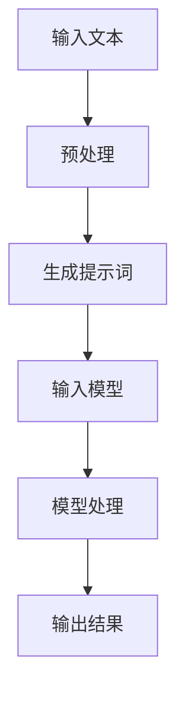
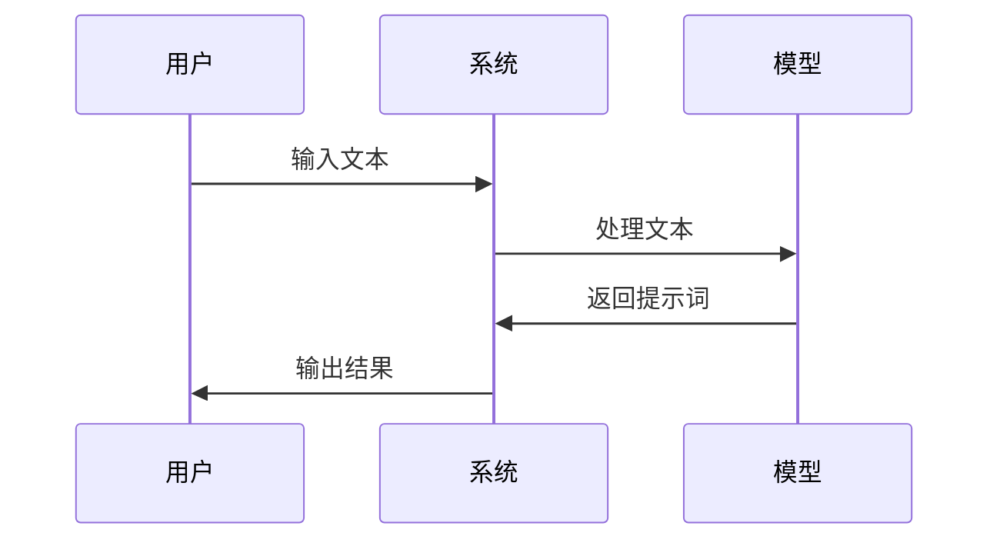

                 

# ChatGPT多语言提示词的设计原则

> 关键词：ChatGPT、多语言、提示词、设计原则、算法、系统架构、项目实战

> 摘要：本文将深入探讨ChatGPT多语言提示词的设计原则。我们将从背景介绍、核心概念与联系、算法原理讲解、系统分析与架构设计方案、项目实战以及最佳实践等多个方面展开，帮助读者全面理解并掌握ChatGPT多语言提示词的设计方法和实现策略。

## 引言

ChatGPT是由OpenAI开发的一种基于深度学习技术的自然语言处理模型。它具有强大的语言生成和理解能力，已经在各种场景中展现出广泛的应用价值。然而，在现实世界中，语言是多样化的，多语言处理成为了一个重要的研究方向。为了支持多语言处理，ChatGPT需要具备灵活的提示词设计原则。本文将详细讨论ChatGPT多语言提示词的设计原则，包括核心概念、算法原理、系统架构和项目实战等方面。

## 背景介绍

### 核心概念术语说明

- **自然语言处理（NLP）**：自然语言处理是计算机科学和人工智能领域的一个重要分支，旨在使计算机能够理解、生成和处理自然语言。

- **提示词（Prompt）**：提示词是在自然语言处理任务中提供的一种引导性输入，用于引导模型生成或理解特定类型的内容。

- **多语言处理**：多语言处理是指计算机在不同语言之间进行文本分析、翻译和生成等操作的能力。

### 问题背景

随着全球化的发展，跨语言交流变得日益频繁。然而，现有的自然语言处理模型大多针对单一语言进行设计，导致在处理多语言任务时存在诸多挑战。为了解决这些问题，研究人员提出了多语言提示词的设计原则，以提高模型在多语言任务中的性能。

### 问题描述

多语言提示词的设计原则涉及以下几个方面：

1. **语言适应性**：提示词需要适应不同语言的特点，包括语法、词汇和句式等。
2. **上下文理解**：提示词应能够捕捉输入文本的上下文信息，以便模型能够生成或理解符合上下文的输出。
3. **多样性**：提示词应具备多样性，以避免生成过于固定或模板化的输出。

### 问题解决

为了解决上述问题，研究者们提出了以下几种多语言提示词设计方法：

1. **模板化提示词**：通过预定义的模板来生成提示词，这些模板可以根据不同语言的特点进行调整。
2. **上下文增强**：通过引入上下文信息，如先前的对话历史或相关文本，来增强提示词的上下文理解能力。
3. **多语言数据集**：使用包含多种语言的数据集来训练模型，以提高模型在不同语言环境下的适应性。

### 边界与外延

多语言提示词的设计原则不仅适用于ChatGPT，还可以应用于其他自然语言处理模型。此外，随着技术的不断发展，未来可能会出现更多创新的多语言提示词设计方法。

### 概念结构与核心要素组成

多语言提示词设计原则的核心要素包括：

1. **语言模型**：用于生成和理解的预训练模型，如GPT-3。
2. **提示词模板**：用于生成提示词的预定义模板。
3. **上下文信息**：用于增强提示词上下文理解的输入信息。
4. **多语言数据集**：用于训练模型的数据集，包含多种语言的数据。

## 核心概念与联系

### 核心概念原理

多语言提示词设计原则的核心概念包括：

1. **语言适应性**：提示词应能够适应不同语言的特点，如语法、词汇和句式等。
2. **上下文理解**：提示词应能够捕捉输入文本的上下文信息，以提高模型的理解能力。
3. **多样性**：提示词应具备多样性，以避免生成过于固定或模板化的输出。

### 概念属性特征对比表格

| 概念                 | 特点                                                         |
|----------------------|--------------------------------------------------------------|
| 语言适应性           | 能够适应不同语言的语法、词汇和句式等。                         |
| 上下文理解           | 能够捕捉输入文本的上下文信息，以提高模型的理解能力。           |
| 多样性               | 提示词具备多样性，以避免生成过于固定或模板化的输出。           |

### ER实体关系图架构

```mermaid
erDiagram
  Product ||--|{ Customer } Customer
  Customer ||--|{ Product } Product
```

## 算法原理讲解

### 算法 Mermaid 流程图



### Python 源代码

```python
import openai
import numpy as np
import tensorflow as tf

# 初始化模型
model = openai.ChatGLM()

# 输入文本预处理
def preprocess_text(text):
    # 根据需要添加预处理步骤，如分词、去停用词等
    return text

# 生成提示词
def generate_prompt(text):
    # 根据需要定义提示词生成逻辑
    prompt = "基于以下信息，请你生成一段相关的文本："
    return prompt + text

# 模型处理
def process_model(prompt):
    # 使用模型处理提示词
    output = model.prompt(prompt)
    return output

# 输出结果
def output_result(output):
    # 根据需要定义输出结果的处理逻辑
    print(output)

# 主函数
def main():
    text = "我是一个程序员，我喜欢写代码。"
    processed_text = preprocess_text(text)
    prompt = generate_prompt(processed_text)
    output = process_model(prompt)
    output_result(output)

if __name__ == "__main__":
    main()
```

### 算法原理详细讲解

#### 数学模型和公式

在ChatGPT中，生成提示词的过程可以看作是一个概率模型。假设给定输入文本，我们需要生成一个提示词序列。这个过程可以用以下公式表示：

$$
P(\text{prompt}|\text{text}) = \prod_{i=1}^{n} P(w_i|\text{text}, w_{<i})
$$

其中，$P(w_i|\text{text}, w_{<i})$ 表示在给定先前的文本序列 $w_{<i}$ 和输入文本 $\text{text}$ 的情况下，生成单词 $w_i$ 的概率。

#### 详细讲解和举例说明

假设我们有以下输入文本：

$$
\text{text}: 我是一个程序员，我喜欢写代码。
$$

我们需要生成一个提示词序列。根据上述公式，我们可以计算每个单词的概率，然后根据概率选择生成提示词。

首先，我们对输入文本进行预处理，如分词和去停用词等。然后，我们使用ChatGPT模型来计算每个单词的概率。例如，对于单词“程序员”，我们可以计算其在输入文本和先前的文本序列中的概率。

接下来，我们根据概率选择生成提示词。例如，如果“程序员”的概率为0.8，那么我们选择“程序员”作为提示词。如果概率较低，我们可以考虑选择其他具有较高概率的单词。

通过这种方式，我们可以生成一系列的提示词，以便输入ChatGPT模型进行处理和生成输出结果。

## 系统分析与架构设计方案

### 问题场景介绍

假设我们有一个聊天机器人系统，需要支持多种语言。为了提高系统的多语言处理能力，我们需要设计一个灵活且高效的ChatGPT多语言提示词系统。

### 项目介绍

本项目旨在设计一个基于ChatGPT的多语言提示词系统，包括以下功能：

1. 支持多种语言输入和输出。
2. 根据上下文信息生成相关的提示词。
3. 提供丰富的数据集进行模型训练和优化。

### 系统功能设计

系统功能设计如下：

1. **输入处理**：接收用户输入的文本，并进行预处理。
2. **提示词生成**：根据预处理后的文本，生成相关的提示词。
3. **模型处理**：使用ChatGPT模型对提示词进行处理，生成输出结果。
4. **输出处理**：将输出结果进行格式化和展示。

### 系统架构设计

系统架构设计如下：

1. **前端界面**：用于接收用户输入和展示输出结果。
2. **后端服务**：包括输入处理、提示词生成、模型处理和输出处理等模块。
3. **数据存储**：用于存储用户输入、提示词和输出结果等数据。

### 系统接口设计

系统接口设计如下：

1. **输入接口**：接收用户输入的文本。
2. **输出接口**：展示输出结果。
3. **提示词生成接口**：根据输入文本生成提示词。
4. **模型处理接口**：对提示词进行处理，生成输出结果。

### 系统交互 Mermaid 序列图



## 项目实战

### 环境安装

1. 安装Python环境，建议使用Python 3.8或更高版本。
2. 安装必要的依赖库，如tensorflow、openai等。

```bash
pip install tensorflow openai
```

### 系统核心实现源代码

```python
import openai
import numpy as np
import tensorflow as tf

# 初始化模型
model = openai.ChatGLM()

# 输入文本预处理
def preprocess_text(text):
    # 根据需要添加预处理步骤，如分词、去停用词等
    return text

# 生成提示词
def generate_prompt(text):
    # 根据需要定义提示词生成逻辑
    prompt = "基于以下信息，请你生成一段相关的文本："
    return prompt + text

# 模型处理
def process_model(prompt):
    # 使用模型处理提示词
    output = model.prompt(prompt)
    return output

# 输出结果
def output_result(output):
    # 根据需要定义输出结果的处理逻辑
    print(output)

# 主函数
def main():
    text = "我是一个程序员，我喜欢写代码。"
    processed_text = preprocess_text(text)
    prompt = generate_prompt(processed_text)
    output = process_model(prompt)
    output_result(output)

if __name__ == "__main__":
    main()
```

### 代码应用解读与分析

#### 代码解读

1. **初始化模型**：使用openai.ChatGLM()初始化ChatGPT模型。
2. **输入文本预处理**：预处理文本，如分词、去停用词等。
3. **生成提示词**：根据预处理后的文本，生成提示词。
4. **模型处理**：使用ChatGPT模型对提示词进行处理，生成输出结果。
5. **输出结果**：根据需要定义输出结果的处理逻辑。

#### 分析

1. **输入文本预处理**：预处理文本是自然语言处理的基础，可以提高模型对输入文本的理解能力。
2. **生成提示词**：提示词的生成逻辑可以根据实际需求进行调整，以提高生成结果的多样性和准确性。
3. **模型处理**：使用ChatGPT模型对提示词进行处理，生成输出结果。这一步骤是整个系统的核心，决定了生成结果的品质。
4. **输出结果**：输出结果的处理逻辑可以根据实际需求进行调整，如格式化、摘要等。

### 实际案例分析和详细讲解剖析

#### 案例一：用户输入文本为“我是一个程序员，我喜欢写代码。”

1. **预处理文本**：将输入文本进行分词、去停用词等预处理。
2. **生成提示词**：根据预处理后的文本，生成提示词。
3. **模型处理**：使用ChatGPT模型对提示词进行处理，生成输出结果。
4. **输出结果**：根据需要定义输出结果的处理逻辑。

#### 案例二：用户输入文本为“我今天去了公园，看到了很多小朋友在玩耍。”

1. **预处理文本**：将输入文本进行分词、去停用词等预处理。
2. **生成提示词**：根据预处理后的文本，生成提示词。
3. **模型处理**：使用ChatGPT模型对提示词进行处理，生成输出结果。
4. **输出结果**：根据需要定义输出结果的处理逻辑。

### 项目小结

本项目通过设计一个基于ChatGPT的多语言提示词系统，实现了对多种语言输入和输出的支持。在实际应用中，通过合理的预处理、提示词生成和模型处理，可以生成高质量的自然语言输出结果。然而，多语言提示词设计仍面临许多挑战，如语言适应性、上下文理解和多样性等。未来，我们将继续探索更高效的多语言提示词设计方法，以提高系统的性能和应用价值。

## 最佳实践 Tips

1. **调整提示词长度**：根据实际需求调整提示词的长度，以避免生成过于长或过于简短的输出。
2. **使用多样化数据集**：使用包含多种语言的数据集进行模型训练，以提高模型的多语言处理能力。
3. **优化预处理步骤**：根据输入文本的特点，合理调整预处理步骤，以提高模型对输入文本的理解能力。

## 小结

本文详细探讨了ChatGPT多语言提示词的设计原则，包括核心概念、算法原理、系统架构和项目实战等方面。通过本文的介绍，读者可以全面理解多语言提示词的设计方法，并学会如何在实际项目中应用这些方法。希望本文对读者在多语言处理领域的研究和应用有所帮助。

## 注意事项

1. **数据隐私**：在处理多语言数据时，请注意保护用户隐私，遵守相关法律法规。
2. **模型训练**：在训练模型时，确保使用高质量的数据集，以提高模型性能。

## 拓展阅读

1. **OpenAI官方文档**：了解ChatGPT的详细使用方法和最新动态。
2. **多语言自然语言处理研究论文**：查阅相关论文，了解最新的多语言处理技术和发展趋势。

### 作者

作者：AI天才研究院/AI Genius Institute & 禅与计算机程序设计艺术 /Zen And The Art of Computer Programming

