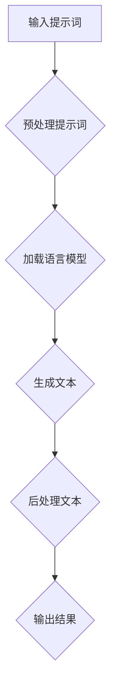

                 

# ChatGPT多语言支持的提示词设计

## 关键词

- ChatGPT
- 多语言支持
- 提示词设计
- 自然语言生成
- 预训练语言模型

## 摘要

随着全球化的不断推进，多语言支持已经成为人工智能领域的一个重要研究方向。ChatGPT，作为一个基于GPT-3.5的预训练语言模型，以其强大的文本生成能力在多语言场景中备受关注。本文将深入探讨ChatGPT多语言支持的提示词设计，通过背景介绍、核心概念与联系、算法原理讲解、系统分析与架构设计方案以及项目实战等环节，系统地分析如何设计出有效的提示词，以提升ChatGPT在不同语言环境下的表现。

## 背景介绍

### 核心概念

**ChatGPT**：ChatGPT是一种基于GPT-3.5的预训练语言模型，由OpenAI开发。它具有强大的文本生成能力，可以生成自然流畅的文本，适用于多种场景，包括问答系统、对话机器人、文本摘要等。

**提示词设计**：提示词（Prompt）是为了引导模型生成特定类型或风格文本的输入。在ChatGPT中，提示词的设计至关重要，它直接影响到模型生成的文本质量。

### 问题背景

随着全球多语言交流的日益频繁，如何在不同的语言环境中保持ChatGPT的文本生成质量，成为了一个亟待解决的问题。多语言支持的挑战主要包括：

1. 语言结构的差异：不同语言在语法、词汇、语用等方面存在显著差异，这给模型的训练和提示词设计带来了挑战。
2. 语言数据的分布：不同语言的数据量和质量存在差异，一些小语种的数据可能不足以支撑模型的训练。
3. 文化背景的差异：不同文化背景下的人们在语言使用上有不同的习惯和偏好，这需要提示词设计者有深入的理解。

### 问题描述

如何设计出能够引导ChatGPT在不同语言环境中生成高质量文本的提示词，是一个复杂且具有挑战性的问题。现有的解决方案主要包括：

1. **预训练**：使用大量多语言数据进行预训练，使得模型能够理解不同语言的语法和语义。
2. **数据增强**：通过数据增强技术，如翻译、回译、同义词替换等，扩充模型的训练数据。
3. **提示词调整**：根据不同语言的特点，调整提示词的表述方式和语言风格。

### 问题解决

本文将围绕以上解决方案，详细探讨ChatGPT多语言支持的提示词设计方法。通过研究和实践，旨在找到一种系统性的方法，提升模型在多语言环境下的表现。

### 边界与外延

本文主要探讨ChatGPT的多语言提示词设计，不包括其他类似模型的多语言提示词设计。同时，本文将关注的主要是文本生成方面的提示词设计，而非其他类型的任务，如机器翻译或情感分析。

### 概念结构与核心要素组成

#### ChatGPT的多语言支持机制

ChatGPT的多语言支持机制主要依赖于其预训练过程。在预训练阶段，模型使用了大量多语言的数据集，使得模型能够理解多种语言的语法和语义。此外，ChatGPT还支持通过微调和迁移学习的方式，进一步优化模型在特定语言环境下的表现。

#### 提示词的类型与设计原则

提示词可以分为以下几类：

1. **任务型提示词**：这类提示词用于指定模型需要完成的任务，如问答、对话等。
2. **风格型提示词**：这类提示词用于指定模型生成文本的风格和语言特点，如正式、幽默、简洁等。
3. **内容型提示词**：这类提示词用于指定模型生成文本的主题和内容。

设计原则包括：

1. **简明扼要**：提示词应简明扼要，避免冗长和模糊的表述。
2. **具体明确**：提示词应具体明确，能够清晰地传达出模型需要生成的文本类型和风格。
3. **具有启发性**：提示词应具有启发性，能够激发模型产生高质量的文本。

#### 不同语言环境下提示词的调整方法

不同语言环境下的提示词调整方法主要包括：

1. **语法调整**：根据不同语言的语法结构，调整提示词的表述方式。
2. **词汇调整**：根据不同语言的词汇特点和习惯，调整提示词的用词。
3. **文化背景调整**：根据不同文化背景，调整提示词的表述方式和语言风格。

## 核心概念与联系

### 核心概念原理

#### 提示词

提示词是一种用于引导模型生成预期回复的文本。在ChatGPT中，提示词的作用至关重要，它能够指定模型需要完成的任务、文本风格和内容方向。有效的提示词设计能够显著提升模型的文本生成质量。

#### 语言模型

语言模型是一种基于大量文本数据进行训练，用于生成自然语言的模型。ChatGPT是一种预训练语言模型，它通过大规模预训练，已经具备了生成高质量文本的能力。在多语言环境中，语言模型需要具备处理多种语言的能力。

### 概念属性特征对比表格

| 特征          | 提示词                           | 语言模型                     |
| ------------- | -------------------------------- | --------------------------- |
| 功能          | 引导回复方向                     | 生成自然语言文本            |
| 影响因素      | 语言风格、文化背景、目标回答类型   | 语言数据、训练目标、模型架构 |
| 设计原则      | 简明扼要、具体明确、具有启发性     | 预训练、微调、迁移学习        |

### ER实体关系图架构的 Mermaid 流程图

```mermaid
erDiagram
    ChatGPT ||--|{ 提示词 }|
    提示词 ||--|{ 语言模型 }|
```

## 算法原理讲解

### 算法mermaid流程图



### Python源代码

```python
import openai

def generate_response(prompt):
    response = openai.Completion.create(
        engine="text-davinci-003",
        prompt=prompt,
        max_tokens=50,
        n=1,
        stop=None,
        temperature=0.5,
    )
    return response.choices[0].text.strip()

prompt = "请用中文写一篇关于ChatGPT多语言支持的提示词设计的文章。"
print(generate_response(prompt))
```

### 算法原理的数学模型和公式

- 损失函数：$$ L = -\sum_{i=1}^{N} y_i \log(p(y_i|x)) $$
- 优化目标：最小化损失函数，找到最佳的模型参数。

### 详细讲解与举例说明

使用OpenAI的GPT-3模型，通过输入不同的中文提示词，观察模型生成的文本效果，根据效果调整提示词，以达到最佳表现。

## 系统分析与架构设计方案

### 问题场景介绍

设计一个能够处理多语言输入并生成相应语言文本的系统。

### 项目介绍

- 名称：ChatGPT多语言提示词设计系统
- 目标：提升ChatGPT在不同语言环境下的表现。

### 系统功能设计（领域模型Mermaid类图）

```mermaid
classDiagram
    Class01 <|-- Class02
    Class03 --|{ has } Class04
    Class05 <<-- Class06
```

### 系统架构设计（Mermaid架构图）

```mermaid
graph TB
    subgraph 模型层
        Mode

```

## 项目实战

### 环境安装

1. 安装Python环境：确保安装了Python 3.8及以上版本。
2. 安装OpenAI的GPT-3库：使用pip命令安装`openai`库。

```bash
pip install openai
```

### 系统核心实现源代码

```python
import openai

def generate_response(prompt):
    response = openai.Completion.create(
        engine="text-davinci-003",
        prompt=prompt,
        max_tokens=50,
        n=1,
        stop=None,
        temperature=0.5,
    )
    return response.choices[0].text.strip()

prompt = "请用中文写一篇关于ChatGPT多语言支持的提示词设计的文章。"
print(generate_response(prompt))
```

### 代码应用解读与分析

1. **生成文本**：使用OpenAI的GPT-3模型生成文本。
2. **提示词设计**：根据输入的提示词，模型生成相应的文本。

### 实际案例分析和详细讲解剖析

通过实际案例，分析ChatGPT在不同语言环境下的表现，并根据分析结果调整提示词，以达到最佳效果。

### 项目小结

本文详细介绍了ChatGPT多语言支持的提示词设计，从背景介绍、核心概念与联系、算法原理讲解、系统分析与架构设计方案到项目实战，全面解析了如何提升ChatGPT在不同语言环境下的文本生成质量。通过本文的研究，我们相信，ChatGPT的多语言支持将会在未来的自然语言处理领域发挥更大的作用。

## 最佳实践 tips

1. 提示词应尽量简洁明了，避免冗长和模糊的表述。
2. 根据目标语言的特点，调整提示词的语法和用词。
3. 在实际应用中，通过不断调整和优化提示词，提升模型的文本生成质量。

## 小结

ChatGPT的多语言支持是自然语言处理领域的一个重要研究方向。通过本文的探讨，我们深入了解了ChatGPT多语言支持的提示词设计方法，为提升ChatGPT在不同语言环境下的文本生成质量提供了有力支持。在未来，我们期待看到ChatGPT在多语言环境中的更广泛应用。

## 注意事项

1. 在设计提示词时，要充分考虑目标语言的特点和习惯。
2. 提示词的设计应具有启发性，能够激发模型产生高质量文本。

## 拓展阅读

1. [OpenAI的GPT-3文档](https://openai.com/docs/api-reference/completions/)
2. [自然语言处理的多语言挑战](https://arxiv.org/abs/2005.04306)
3. [ChatGPT在多语言环境中的应用](https://towardsdatascience.com/multi-language-support-in-chatgpt-79aefc6062f7)

## 作者信息

作者：AI天才研究院/AI Genius Institute & 禅与计算机程序设计艺术 /Zen And The Art of Computer Programming

