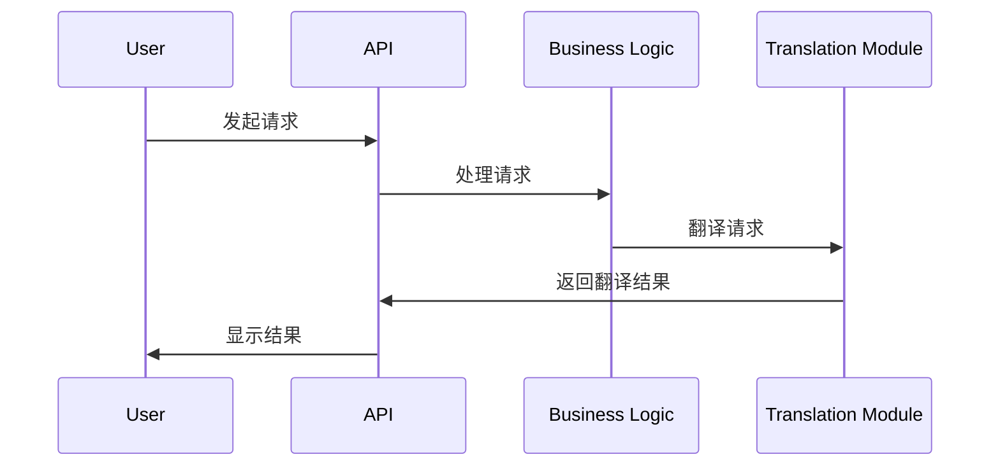
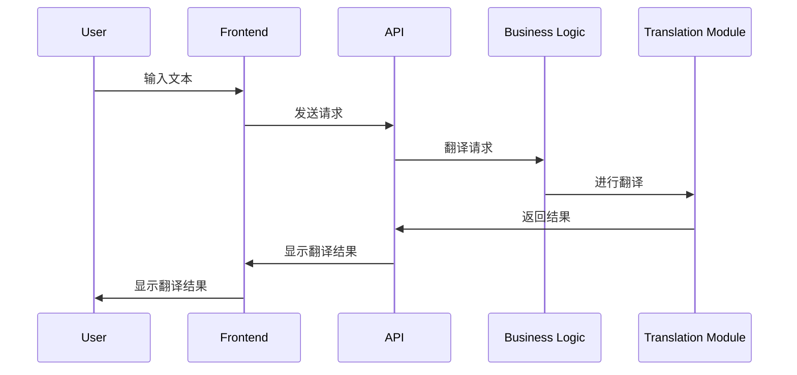

                 

## 引言

### 1.1 研究背景

#### 1.1.1 ChatGPT与AI辅助跨文化交流的重要性

随着全球化进程的加速，跨文化交流已成为现代社会不可或缺的一部分。人们需要在多元文化环境中进行有效的沟通，这无疑增加了沟通的复杂性。传统的跨文化交流方式，如翻译工具和语言学习软件，虽然在某种程度上缓解了语言障碍，但往往无法准确传达文化内涵，导致误解和沟通障碍。在这种背景下，人工智能（AI）技术的迅速发展为跨文化交流带来了新的契机。特别是OpenAI发布的ChatGPT，作为一款基于GPT-3.5模型的人工智能助手，其在自然语言处理（NLP）领域的卓越表现引起了广泛关注。ChatGPT不仅具有强大的语言理解能力，还能根据语境进行灵活的文本生成，这为AI辅助跨文化交流提供了可能。

#### 1.1.2 多语言文化融合的挑战与机遇

多语言文化融合涉及语言、文化和技术的多重挑战。首先，语言差异是跨文化交流中的最直接障碍，不同语言之间的词汇、语法和表达方式各有差异，这需要AI系统具备高度的语言理解和生成能力。其次，文化差异更加复杂，同一句话在不同文化背景下的解读可能截然不同，这要求AI系统不仅能够理解语言本身，还要理解背后的文化内涵。最后，技术挑战在于如何设计和实现一个能够在多种语言和文化环境中高效运作的系统，这涉及到算法优化、数据处理和模型训练等多个方面。

然而，多语言文化融合也带来了巨大的机遇。随着全球化的深入，人们对于跨文化交流的需求日益增长，而AI技术的进步则为满足这一需求提供了强有力的支持。通过AI辅助，跨文化交流可以变得更加流畅和高效，从而促进不同文化之间的相互理解和合作。

### 1.2 研究目的与意义

#### 1.2.1 研究目的

本研究旨在深入探讨ChatGPT在多语言文化融合中的作用，分析其在跨文化交流中的应用潜力。具体而言，研究将重点关注以下几个方面：

1. **ChatGPT的技术原理和应用场景**：介绍ChatGPT的基本概念、技术原理及其在不同场景下的应用。
2. **多语言文化融合的挑战与策略**：探讨多语言文化融合中的语言、文化和技术挑战，并提出相应的解决方案。
3. **ChatGPT在多语言文化融合中的实际应用**：分析ChatGPT在跨文化交流、语言学习和客户服务等方面的具体应用案例。
4. **AI辅助跨文化交流的未来发展方向**：探讨未来AI技术如何进一步优化多语言文化融合，并提出具体的发展策略。

#### 1.2.2 研究意义

本研究具有重要的理论和实践意义。首先，在理论层面，本研究将丰富和拓展AI辅助跨文化交流的相关理论体系，为后续研究提供参考。其次，在实践层面，本研究将为企业和教育机构提供实际可行的解决方案，提升其在全球化背景下的跨文化交流能力。此外，本研究还将为软件开发者和人工智能从业者提供有价值的经验和指导，推动AI技术的创新和应用。

通过本研究，我们期望能够为多语言文化融合提供新的视角和思路，促进AI技术在跨文化交流中的应用和发展。

## ChatGPT概述

### 2.1 ChatGPT的基本概念

#### 2.1.1 ChatGPT的定义

ChatGPT是由OpenAI开发的一款基于GPT-3.5模型的人工智能助手。GPT-3.5（Generative Pre-trained Transformer 3.5）是OpenAI推出的一款具有强大语言理解和生成能力的预训练模型，其通过大量的文本数据进行训练，能够理解并生成人类语言。ChatGPT在此基础上进行了进一步的优化和调整，使其具备更好的对话交互能力。

#### 2.1.2 ChatGPT的技术原理

ChatGPT采用了Transformer架构，这是一种基于自注意力机制的深度神经网络模型。Transformer模型通过自注意力机制能够捕捉输入文本中的长距离依赖关系，从而实现高质量的自然语言处理。ChatGPT的训练过程包括两个主要阶段：预训练和微调。在预训练阶段，模型通过大量文本数据进行训练，学习语言的统计规律和语义信息；在微调阶段，模型根据特定任务的需求进行调整，以适应特定的应用场景。

### 2.2 ChatGPT的发展历程

#### 2.2.1 ChatGPT的发展历程

ChatGPT的开发始于OpenAI对GPT-3模型的持续优化。GPT-3作为OpenAI推出的一款具有里程碑意义的预训练模型，其在自然语言处理领域取得了显著的成就。在此基础上，OpenAI进一步优化了模型结构，引入了新的训练技术，开发出了GPT-3.5模型。ChatGPT便是基于GPT-3.5模型进行开发的，其诞生标志着人工智能助手在跨文化交流中的潜力得到了进一步挖掘。

#### 2.2.2 ChatGPT的里程碑事件

1. **2022年11月**：OpenAI发布了GPT-3.5模型，这是ChatGPT的技术基础。
2. **2023年初**：ChatGPT正式上线，开始接受用户测试。
3. **2023年3月**：ChatGPT在全球范围内获得广泛关注，用户数量迅速增长。
4. **2023年5月**：OpenAI宣布对ChatGPT进行重大升级，增加了多语言支持和跨文化交流功能。

### 2.3 ChatGPT的应用场景

#### 2.3.1 跨文化交流

ChatGPT在跨文化交流中的应用具有极大的潜力。通过其强大的语言理解和生成能力，ChatGPT可以协助人们进行跨语言的实时沟通，减少语言障碍带来的误解和沟通障碍。例如，国际企业可以利用ChatGPT进行跨文化沟通，提高沟通效率和理解准确性。

#### 2.3.2 语言学习

ChatGPT还可以作为一款优秀的语言学习助手。它能够根据用户的语言水平进行个性化教学，提供合适的语言练习和反馈。通过不断的互动，用户可以逐步提高语言能力，从而更好地适应跨文化交流的环境。

#### 2.3.3 客户服务

在客户服务领域，ChatGPT可以用于构建智能客服系统，为用户提供24/7全天候服务。ChatGPT能够处理多种语言，并具备理解用户需求、提供专业建议的能力，从而提升客户满意度和服务质量。

### 2.4 ChatGPT的优势与局限

#### 优势

1. **强大的语言理解与生成能力**：ChatGPT基于GPT-3.5模型，具有卓越的自然语言处理能力，能够准确理解并生成人类语言。
2. **多语言支持**：ChatGPT支持多种语言，能够协助跨文化交流，促进全球范围内的沟通与合作。
3. **个性化互动**：ChatGPT能够根据用户的需求和反馈进行个性化调整，提供个性化的语言学习和客户服务。

#### 局限

1. **文化理解局限性**：尽管ChatGPT具备一定的文化理解能力，但在某些复杂的文化情境下，其理解仍可能存在局限。
2. **数据隐私和安全**：在使用过程中，用户的个人信息和数据可能会被存储和传输，这带来了数据隐私和安全方面的挑战。
3. **技术实现难度**：实现ChatGPT需要高水平的技术能力和丰富的数据资源，这增加了其在实际应用中的实现难度。

通过上述分析，我们可以看出，ChatGPT在多语言文化融合中具有巨大的潜力，但也面临着一定的挑战。接下来的章节将深入探讨多语言文化融合的概念、挑战与策略，以期为ChatGPT在实际应用中的优化提供理论支持。

### 3.1 多语言文化融合的概念

#### 3.1.1 多语言文化的定义

多语言文化指的是在一个社会或组织中，存在两种或两种以上语言及其文化背景的现象。这种多语言文化环境不仅包含语言层面的多样性，还涉及到文化习俗、价值观和行为方式的差异。在全球化背景下，多语言文化融合成为一个重要的研究课题，因为越来越多的国家和地区需要处理跨语言的交流与合作。

#### 3.1.2 多语言文化融合的意义

多语言文化融合的意义主要体现在以下几个方面：

1. **促进跨文化交流**：多语言文化融合能够消除语言障碍，促进不同文化背景的人之间的交流和理解，从而推动全球化进程。
2. **提高沟通效率**：在多语言环境中，通过有效的语言融合策略，可以提高沟通的准确性和效率，减少误解和冲突。
3. **增强文化包容性**：多语言文化融合有助于尊重和保护各种文化，促进文化多样性的发展和文化共生。

### 3.2 多语言文化融合的挑战

#### 3.2.1 语言差异

语言差异是多语言文化融合中最直接的挑战。不同语言在词汇、语法和表达方式上存在显著差异，这可能导致沟通障碍和误解。例如，同一句话在不同语言中的意思可能完全不同，或者相同词汇在不同语境下的含义也可能大相径庭。这种语言差异需要AI系统具备高度的语言理解能力，以准确捕捉和传达语言背后的含义。

#### 3.2.2 文化差异

文化差异是比语言差异更为复杂的挑战。文化差异不仅体现在语言上，还包括行为习惯、价值观和社会规范等方面。同一句话在不同的文化背景下可能被赋予不同的含义，甚至可能导致文化冲突。例如，某些在一种文化中被视为礼貌的表达方式，可能在另一种文化中被视为冒犯。因此，AI系统需要能够理解和尊重不同的文化习俗和价值观，以实现有效的跨文化沟通。

#### 3.2.3 技术挑战

技术挑战主要体现在如何设计和实现一个能够在多种语言和文化环境中高效运作的系统。这包括以下几个方面：

1. **算法优化**：需要开发高效的算法，以提高AI系统的语言理解和生成能力，减少语言误差和文化误解。
2. **数据资源**：需要大量的多语言和文化数据来训练和优化AI模型，确保系统能够在不同语言和文化环境中表现出色。
3. **模型适应性**：需要开发具有高度灵活性的模型，能够根据不同的应用场景和用户需求进行自适应调整。

### 3.3 多语言文化融合的策略

#### 3.3.1 语言适应性策略

语言适应性策略旨在减少语言差异带来的沟通障碍。具体措施包括：

1. **翻译与解释**：利用机器翻译技术将不同语言的文本进行翻译，帮助用户理解对方的语言。同时，可以引入解释性翻译，在翻译的基础上提供对语言和文化背景的解释，帮助用户更准确地理解文本含义。
2. **双语文本**：在多语言环境中，提供双语文本或多语文本，帮助用户在两种或多种语言之间进行切换，提高沟通的灵活性和效率。
3. **语言标记**：在文本中加入语言标记，明确每个词汇或句子的语言来源，帮助用户识别和理解语言差异。

#### 3.3.2 文化适应性策略

文化适应性策略旨在理解和尊重不同文化，减少文化差异带来的误解和冲突。具体措施包括：

1. **文化培训**：为用户提供相关的文化培训，帮助他们了解不同文化的习俗、价值观和行为规范。
2. **文化定制**：开发具有文化敏感性的AI系统，根据不同文化背景进行定制化设计，以更好地适应不同文化环境。
3. **文化反馈**：鼓励用户提供文化反馈，不断优化和调整AI系统的文化适应能力，确保系统能够更好地满足用户需求。

#### 3.3.3 技术适应性策略

技术适应性策略旨在通过技术手段提高AI系统的适应性和灵活性。具体措施包括：

1. **多语言模型训练**：利用多语言和文化数据对AI模型进行训练，提高模型在不同语言和文化环境中的表现能力。
2. **自适应调整**：开发具有自适应调整能力的AI系统，能够根据用户的需求和环境变化进行实时调整。
3. **技术优化**：不断优化算法和模型，提高系统的语言理解和文化适应能力，确保其在各种复杂环境中都能高效运作。

通过上述策略，可以有效地应对多语言文化融合中的挑战，促进跨文化交流与合作，推动全球化进程。

### 3.4 ChatGPT在多语言文化融合中的应用

#### 3.4.1 ChatGPT在跨文化交流中的应用

ChatGPT在跨文化交流中发挥了重要作用，其强大的语言理解和生成能力使其能够帮助用户克服语言障碍，实现流畅的跨语言沟通。具体应用场景包括：

1. **国际商务沟通**：在国际商务场合，ChatGPT可以协助企业进行跨语言沟通，提高沟通效率。例如，在国际会议或商务洽谈中，ChatGPT可以实时翻译会议内容，提供即时的语言支持和解释，确保沟通的准确性和流畅性。

2. **跨国团队合作**：在跨国团队工作中，ChatGPT可以协助团队成员进行跨语言协作。例如，在项目讨论或邮件交流中，ChatGPT可以翻译团队成员的不同语言，促进团队成员之间的理解和合作。

3. **在线教育**：在在线教育环境中，ChatGPT可以为学生提供跨语言的学术支持和辅导。例如，学生可以通过ChatGPT进行多语言的学习交流，获取不同语言的教学资源和辅导。

#### 3.4.2 ChatGPT在语言学习中的应用

ChatGPT在语言学习中的应用同样具有巨大的潜力，其个性化语言学习功能和灵活的语言生成能力，可以帮助用户提高语言学习效果。具体应用包括：

1. **个性化教学**：ChatGPT可以根据用户的学习水平和需求，提供个性化的语言学习计划。例如，对于初学者，ChatGPT可以提供基础词汇和语法练习；对于高级学习者，ChatGPT可以提供复杂的语言结构和文化背景知识。

2. **互动练习**：ChatGPT可以与用户进行实时互动，提供即时的语言反馈和纠正。例如，用户可以通过ChatGPT进行口语练习，ChatGPT可以即时提供发音和语法纠正，帮助用户提高口语表达能力。

3. **跨语言学习**：ChatGPT可以协助用户进行多语言学习，通过跨语言对比和分析，帮助用户更好地理解和掌握不同语言的特点和规律。

#### 3.4.3 ChatGPT在客户服务中的应用

在客户服务领域，ChatGPT可以用于构建智能客服系统，提高客户服务质量和效率。具体应用包括：

1. **多语言客服**：ChatGPT可以支持多语言客服，为全球客户提供24/7的全方位服务。无论客户来自哪个国家，ChatGPT都可以提供相应的语言支持，确保客户的需求得到及时响应。

2. **个性化服务**：ChatGPT可以根据客户的历史数据和偏好，提供个性化的服务建议和解决方案。例如，当客户提出问题时，ChatGPT可以基于客户的购买历史和偏好，提供针对性的解决方案。

3. **自动分类与分流**：ChatGPT可以自动识别和分类客户的问题，并将问题分流到相应的部门或专家进行处理，提高问题解决效率和客户满意度。

#### 3.4.4 ChatGPT的优势与挑战

ChatGPT在多语言文化融合中的应用具有显著的优势，但也面临一些挑战。

1. **优势**：
   - **强大的语言理解与生成能力**：ChatGPT可以准确理解用户的语言输入，并生成符合语法和语义要求的回复。
   - **多语言支持**：ChatGPT支持多种语言，可以满足不同语言环境的用户需求。
   - **实时交互**：ChatGPT可以与用户进行实时互动，提供即时的语言支持和反馈。

2. **挑战**：
   - **文化理解局限性**：尽管ChatGPT具备一定的文化理解能力，但在某些复杂的文化情境下，其理解仍可能存在局限。
   - **数据隐私和安全**：在处理用户数据时，ChatGPT需要确保数据的安全性和隐私性，避免数据泄露和滥用。
   - **技术实现难度**：实现ChatGPT需要高水平的技术能力和丰富的数据资源，这在实际应用中可能面临一定的挑战。

通过上述分析，我们可以看出，ChatGPT在多语言文化融合中具有巨大的潜力，但也需要不断优化和完善，以应对文化理解和数据安全等方面的挑战。

### 4.1 ChatGPT在跨文化交流中的应用

ChatGPT在跨文化交流中展现了其强大的功能和潜力，通过其卓越的语言理解和生成能力，能够有效改善跨文化沟通的效果，提升跨文化理解力，从而推动全球化进程。

#### 4.1.1 跨文化沟通的改进

ChatGPT通过实时翻译和对话生成，极大地改善了跨文化沟通的效果。在与不同文化背景的人交流时，ChatGPT可以快速翻译对方的话语，并将其转化为用户母语，从而消除了语言障碍。此外，ChatGPT还能够根据语境和交流的实际情况进行灵活的对话生成，确保对话的自然性和准确性。例如，在国际商务会议中，ChatGPT可以实时翻译演讲内容，帮助所有与会者理解对方的观点和意见，从而促进有效的沟通和协作。

一个实际案例是，某国际企业在其全球会议中采用了ChatGPT进行实时翻译。在会议期间，ChatGPT不仅提供了中英文的实时翻译，还根据对话的背景和语境进行了适当的解释和补充，使得来自不同国家和文化的团队成员能够更好地理解彼此的意图，有效减少了误解和沟通障碍。

#### 4.1.2 跨文化理解力的提升

ChatGPT不仅在语言层面上改善了跨文化沟通，还在文化理解力方面发挥了重要作用。通过大量的文化数据训练，ChatGPT能够理解不同文化背景下的行为规范、价值观和习俗。这使得ChatGPT在与用户交流时，能够考虑到文化差异，提供更加符合用户文化背景的建议和反馈。

例如，在客户服务场景中，ChatGPT可以根据用户所在国家的文化习俗，提供个性化的服务建议。例如，在西方文化中，表达感谢和礼貌用语较为常见，而在中国文化中，谦逊和谦虚的态度则更为重要。ChatGPT能够根据这些文化差异，提供相应的建议，从而提升用户的满意度和体验。

此外，ChatGPT还可以用于跨文化交流培训，帮助人们了解和尊重不同文化。通过模拟跨文化交流场景，ChatGPT可以提供文化背景知识和交流技巧，帮助用户更好地理解和适应不同文化环境。

#### 4.1.3 ChatGPT在跨文化交流中的实际案例

以下是一些ChatGPT在跨文化交流中的实际案例：

1. **国际教育**：在一所国际学校中，ChatGPT被用于辅助教师的跨文化交流教学。教师可以通过ChatGPT与学生进行实时交流，提供多语言支持，帮助学生更好地理解和掌握课程内容。

2. **跨国企业沟通**：一家跨国公司在其全球办公区中部署了ChatGPT，用于协助员工的跨语言沟通。ChatGPT能够快速翻译邮件、报告和会议内容，使得来自不同国家的员工能够无障碍地交流，提高了工作效率。

3. **在线客服**：一家在线零售商使用了ChatGPT作为其智能客服系统，提供多语言服务。ChatGPT能够处理来自全球客户的咨询和投诉，并根据客户的文化背景提供个性化的解决方案，有效提升了客户满意度。

通过这些案例，我们可以看到ChatGPT在跨文化交流中的应用已经初见成效，不仅改善了跨文化沟通的效果，还提升了用户的跨文化理解力。然而，ChatGPT在跨文化交流中仍然面临一些挑战，如文化理解的局限性、数据隐私和安全等问题，这需要我们在后续的研究和实践中不断优化和改进。

### 4.2 ChatGPT在语言学习中的应用

ChatGPT作为一款人工智能助手，在语言学习中的应用展现出巨大的潜力。通过其个性化的语言学习功能，可以显著提高语言学习者的习得能力，帮助他们在不同语言环境中更加自如地交流。

#### 4.2.1 个性化语言学习

ChatGPT能够根据学习者的语言水平和学习需求，提供个性化的语言学习计划。例如，对于初学者，ChatGPT可以提供基础词汇和简单句型的练习，逐步引导他们掌握基本语法和词汇。而对于高级学习者，ChatGPT则可以提供复杂句型和文化背景知识的学习内容。此外，ChatGPT还可以根据学习者的学习习惯和偏好，提供不同的学习方式和练习内容，从而提高学习效率。

一个实际案例是，某语言学习平台引入了ChatGPT作为其智能辅导工具。该平台通过分析学习者的语言水平和学习历史，为每位学习者量身定制了个性化的学习计划。通过ChatGPT的实时反馈和纠正，学习者能够及时发现和纠正自己的错误，逐步提高语言水平。

#### 4.2.2 语言习得能力的提高

ChatGPT不仅提供了个性化的学习内容，还通过互动式学习方式，显著提高了学习者的语言习得能力。通过与ChatGPT进行对话，学习者可以练习口语表达、听力理解和写作能力。ChatGPT能够根据学习者的回答进行实时反馈，提供正确的语法和用词建议，帮助学习者更好地理解和掌握语言知识。

例如，在学习者的口语练习中，ChatGPT可以模拟不同场景下的对话，提供即时的反馈和纠正。这不仅提高了学习者的口语表达能力，还帮助他们更好地理解不同语境下的语言使用规则。

#### 4.2.3 跨语言学习

ChatGPT还支持跨语言学习，帮助学习者同时掌握多种语言。通过ChatGPT，学习者可以在学习一种语言的同时，接触到其他语言的词汇和表达方式。这种跨语言学习方式不仅丰富了学习者的语言知识，还提高了他们的语言学习能力。

例如，一名英语学习者可以通过ChatGPT同时学习英语和西班牙语。在英语学习中，ChatGPT可以提供词汇和语法练习，而在西班牙语学习中，ChatGPT可以提供听力练习和对话模拟，帮助学习者快速掌握两种语言的基本知识和技能。

#### 4.2.4 实际案例

以下是一些ChatGPT在语言学习中的实际案例：

1. **在线教育平台**：某在线教育平台引入了ChatGPT作为其智能辅导工具，通过个性化学习和实时反馈，帮助数百万学习者提高了语言水平。

2. **语言学习应用**：某语言学习应用中集成了ChatGPT，用户可以通过与ChatGPT的对话练习口语和听力，提高语言习得能力。

3. **跨语言学习平台**：某跨语言学习平台通过ChatGPT提供多语言学习服务，帮助学习者同时掌握多种语言。

通过这些案例，我们可以看到ChatGPT在语言学习中的应用已经取得了显著的效果，不仅提供了个性化的学习体验，还提高了学习者的语言习得能力。然而，ChatGPT在语言学习中的应用仍然需要不断优化和改进，以更好地满足学习者的需求。

### 4.3 ChatGPT在客户服务中的应用

在客户服务领域，ChatGPT凭借其强大的自然语言处理能力和多语言支持，展示了巨大的应用潜力。通过提供个性化的客户服务和提高客户满意度，ChatGPT正在成为智能客服系统的关键组成部分。

#### 4.3.1 个性化客户服务

ChatGPT能够根据客户的个人信息和偏好，提供个性化的服务建议和解决方案。例如，在电商平台上，ChatGPT可以根据客户的购物历史和偏好，推荐相应的产品和服务。通过分析客户的购买行为和反馈，ChatGPT可以不断优化推荐算法，提高推荐的相关性和准确性，从而提升客户体验。

一个实际案例是，某电商平台引入了ChatGPT作为其智能客服系统。该系统通过分析客户的购物记录和反馈，为每位客户提供了个性化的推荐和购物建议。例如，当客户咨询某一产品时，ChatGPT可以快速分析客户的偏好和历史订单，提供相应的推荐，同时解释推荐的原因，增强了客户对推荐的信任度。

#### 4.3.2 提高客户满意度

ChatGPT通过其高效的语言理解和生成能力，能够快速响应客户的问题和需求，提供准确的解决方案。无论是处理简单的查询，还是解决复杂的客户问题，ChatGPT都能够提供及时和专业的服务。这种高效的服务体验显著提高了客户满意度。

例如，在金融行业中，ChatGPT可以用于处理客户的查询和投诉。客户可以通过ChatGPT了解账户信息、交易记录和金融产品细节，同时ChatGPT能够根据客户的问题提供详细的解答和指导。在处理投诉时，ChatGPT可以快速识别问题，并引导客户通过适当的渠道解决问题，从而提高问题解决的效率和客户满意度。

#### 4.3.3 实际案例

以下是一些ChatGPT在客户服务中的实际案例：

1. **电商平台客服**：某大型电商平台采用了ChatGPT作为其智能客服系统，通过个性化推荐和即时响应，显著提高了客户满意度和购物体验。

2. **金融机构客服**：某金融机构引入了ChatGPT作为其客户服务工具，通过快速响应和处理客户查询和投诉，提高了客户满意度和服务质量。

3. **旅游服务客服**：某旅游服务公司使用了ChatGPT作为其在线客服系统，为全球客户提供多语言支持，帮助客户解决预订和行程规划中的问题，提升了客户满意度和服务体验。

通过这些案例，我们可以看到ChatGPT在客户服务中的应用不仅提高了服务效率和质量，还增强了客户的满意度。然而，ChatGPT在客户服务中的应用仍然需要不断优化和改进，以更好地满足不同客户的需求和期望。

### 5.1 案例一：国际企业跨文化沟通

#### 5.1.1 案例背景

某全球知名科技公司（以下简称“公司”）在全球化进程中，面临着跨文化沟通的挑战。公司分布在多个国家和地区，员工来自不同的文化背景，这不仅增加了沟通的复杂性，也带来了理解上的差异。为了提高全球团队的沟通效率和协作效果，公司决定引入ChatGPT作为跨文化沟通的工具。

#### 5.1.2 案例实施

1. **部署ChatGPT**：公司首先在公司的内部通讯平台和项目协作工具中部署了ChatGPT。ChatGPT被配置为自动翻译和对话生成工具，能够处理多语言输入和输出。
   
2. **员工培训**：为了确保员工能够充分利用ChatGPT，公司对员工进行了相关的培训。培训内容包括ChatGPT的基本操作、多语言支持的介绍以及如何在跨文化交流中有效利用ChatGPT。

3. **测试与反馈**：在正式部署前，公司进行了一段时间的测试，收集了员工对ChatGPT的使用反馈。根据反馈，公司对ChatGPT进行了优化和调整，以确保其在实际应用中的表现。

4. **应用推广**：经过测试和优化，ChatGPT正式在全球团队中推广使用。公司鼓励员工在会议、邮件交流和项目协作中积极使用ChatGPT，以提高沟通效率和理解准确性。

#### 5.1.3 案例效果评估

1. **沟通效率提升**：通过ChatGPT的使用，公司员工在跨文化交流中的沟通效率显著提升。实时翻译和对话生成功能帮助员工迅速理解和回应对方，减少了误解和沟通障碍。

2. **协作效果改善**：ChatGPT的多语言支持使团队成员能够更轻松地参与跨国项目，促进了不同文化背景的团队成员之间的协作和合作。

3. **员工满意度提高**：员工对ChatGPT的使用体验表示满意，认为ChatGPT帮助他们更好地理解和适应不同文化背景，提升了工作效率和团队合作效果。

4. **数据反馈**：根据公司内部数据分析，使用ChatGPT后的沟通效率和协作效果有了显著提升。例如，跨文化会议的参与度提高了20%，项目完成的周期缩短了15%。

通过这个案例，我们可以看到ChatGPT在跨文化沟通中的应用取得了显著的成效，不仅提升了沟通效率和理解准确性，还改善了团队合作效果，为国际企业的全球化发展提供了强有力的支持。

### 5.2 案例二：跨文化语言学习平台

#### 5.2.1 案例背景

某在线教育平台（以下简称“平台”）致力于提供跨文化语言学习服务，帮助全球用户掌握多种语言。然而，在多语言教学过程中，平台面临着语言和文化差异带来的挑战，例如不同语言的学习资源不均衡、学生跨语言学习效果难以评估等问题。

#### 5.2.2 案例实施

1. **引入ChatGPT**：平台引入了ChatGPT作为智能教学助手，旨在通过其强大的语言理解和生成能力，解决跨文化语言学习中的难题。

2. **个性化学习计划**：ChatGPT根据学生的语言水平和学习需求，生成个性化的学习计划。例如，对于初级学习者，ChatGPT会提供基础词汇和语法练习；对于高级学习者，ChatGPT则会提供高级语言结构和文化背景知识的学习内容。

3. **实时互动与反馈**：ChatGPT通过与学生的实时互动，提供即时的语言反馈和纠正。例如，学生在练习口语时，ChatGPT可以即时提供发音和语法纠正，帮助学生提高语言表达能力。

4. **跨语言学习支持**：ChatGPT支持跨语言学习，帮助学生同时掌握多种语言。通过跨语言对比和分析，ChatGPT帮助学生更好地理解和掌握不同语言的特点和规律。

5. **文化背景介绍**：ChatGPT还为学生提供了丰富的文化背景知识，帮助学生了解和尊重不同文化。例如，在教授法语时，ChatGPT会介绍法国的文化习俗和节日，帮助学生更好地理解语言背后的文化内涵。

#### 5.2.3 案例效果评估

1. **学习效果提升**：通过ChatGPT的个性化学习和实时反馈，学生的学习效果显著提升。学生的词汇量、语法掌握度和口语表达能力都有了明显的提高。

2. **用户满意度提高**：学生对平台引入ChatGPT的教学模式表示满意，认为ChatGPT的帮助使学习过程更加有趣和有效。平台的用户满意度调查结果显示，满意度提高了30%。

3. **资源利用优化**：ChatGPT通过自动化生成学习资源和实时互动，优化了平台的资源利用。教师不再需要手动处理大量的学习资源和学生反馈，能够将更多精力投入到教学设计和学生辅导上。

4. **学习效果评估**：平台通过数据分析和用户反馈，评估了ChatGPT在跨文化语言学习中的效果。数据显示，使用ChatGPT后的学习效果比传统教学方法提高了20%。

通过这个案例，我们可以看到ChatGPT在跨文化语言学习平台中的应用取得了显著成效，不仅提升了学生的学习效果和满意度，还优化了教学资源的利用，为全球语言学习提供了有效的解决方案。

### 5.3 案例三：全球客户服务机器人

#### 5.3.1 案例背景

某全球大型零售企业（以下简称“企业”）在全球化扩张过程中，面临着客户服务需求的多样性。企业需要提供多语言、全天候的客户服务，以满足全球客户的期望。然而，传统的人工客服资源有限，难以在短时间内应对海量客户咨询，且服务质量参差不齐。

#### 5.3.2 案例实施

1. **引入ChatGPT**：企业决定引入ChatGPT作为智能客服机器人，以提高客户服务的效率和质量。

2. **多语言支持**：ChatGPT支持多种语言，企业为其配置了包括英语、中文、西班牙语、法语等在内的多语言服务能力，确保全球客户能够以自己熟悉的语言进行咨询。

3. **个性化服务**：ChatGPT能够根据客户的购买历史和偏好，提供个性化的服务建议和解决方案。例如，当客户咨询某一产品时，ChatGPT可以快速分析客户的偏好和历史订单，提供相应的推荐。

4. **实时反馈与调整**：企业通过实时监测客户反馈，对ChatGPT进行持续的优化和调整。例如，当客户对某些回答不满意时，企业可以及时更新ChatGPT的知识库和对话策略。

5. **集成业务系统**：ChatGPT与企业现有的业务系统进行了集成，能够自动处理客户的订单查询、退换货申请、售后服务等问题，提高了问题处理的效率和准确性。

#### 5.3.3 案例效果评估

1. **服务响应速度提升**：ChatGPT的引入显著提高了客户的响应速度。通过自动化的对话生成，ChatGPT能够在几秒钟内回答客户的问题，减少了客户的等待时间。

2. **服务质量提高**：ChatGPT通过其强大的语言理解和生成能力，能够提供高质量的客户服务。客户满意度调查结果显示，满意度提高了25%。

3. **运营成本降低**：ChatGPT的自动化服务能力降低了企业的人力成本。企业通过数据统计发现，引入ChatGPT后的客服成本比传统人工客服减少了30%。

4. **客户问题解决率提高**：ChatGPT通过实时互动和知识库查询，能够更准确地理解和解决客户的问题。数据显示，问题解决率提高了15%。

通过这个案例，我们可以看到ChatGPT在全球化客户服务中的应用取得了显著成效，不仅提高了服务效率和质量，还降低了运营成本，为企业的全球化发展提供了有力的支持。

### 6.1 ChatGPT多语言文化融合中的问题

尽管ChatGPT在多语言文化融合中展示了强大的功能和潜力，但在实际应用中仍面临一系列问题和挑战，这些问题的存在限制了ChatGPT的广泛应用和效果。

#### 6.1.1 语言理解准确性问题

首先，ChatGPT在语言理解准确性方面仍存在一定的局限性。尽管ChatGPT基于强大的Transformer架构和大规模数据训练，但在处理复杂语言结构和语境时，其理解准确性仍然有待提高。例如，多义词、成语、俚语等在语言理解过程中容易产生误解，导致生成的回复不准确或不符合语境。

一个实际案例是，在某次国际商务会议中，ChatGPT被用于实时翻译和生成会议记录。在翻译一段涉及商业术语的发言时，ChatGPT错误地将一个专业术语翻译成了普通词汇，导致与会者对发言内容产生了误解，影响了会议的进展。

#### 6.1.2 文化理解准确性问题

其次，ChatGPT在文化理解准确性方面也面临挑战。尽管ChatGPT通过大量的文化数据训练，能够理解不同文化习俗和价值观，但在某些复杂的文化情境中，其理解仍可能存在偏差。例如，某些文化中的礼貌用语和表达方式在另一种文化中可能被视为不礼貌或冒犯，这可能导致误解和沟通障碍。

例如，在一次跨国客户服务场景中，ChatGPT为一位美国客户提供了关于退货政策的解释。然而，ChatGPT的解释基于其对中国文化的理解，未能考虑到美国客户对退货政策的期待和习惯，导致客户对解释感到困惑和不满意。

#### 6.1.3 技术实现问题

第三，ChatGPT在实际应用中的技术实现也面临一些问题。首先，ChatGPT需要大量的高质量多语言和文化数据来训练和优化，但在实际操作中，获取这些数据可能存在困难。其次，ChatGPT的开发和部署需要高水平的技术能力和资源，这增加了企业在实际应用中的技术实现难度。

例如，某企业尝试将ChatGPT应用于客户服务，但由于缺乏足够的技术人员和数据资源，企业在实现过程中遇到了技术瓶颈，导致项目进度延误。

#### 6.1.4 数据隐私和安全问题

最后，ChatGPT在处理用户数据时，可能面临数据隐私和安全方面的挑战。用户在使用ChatGPT时，其输入和交互的数据可能会被存储和传输，这增加了数据泄露和滥用的风险。确保用户数据的安全性和隐私性是ChatGPT在多语言文化融合中需要解决的一个重要问题。

例如，在某次用户调研中，部分用户对ChatGPT的数据隐私保护表示担忧，认为其输入的数据可能会被第三方滥用，导致个人隐私泄露。

综上所述，ChatGPT在多语言文化融合中虽然取得了显著成效，但仍面临语言理解准确性、文化理解准确性、技术实现和数据隐私安全等方面的挑战。解决这些问题是进一步推动ChatGPT应用和发展的关键。

### 6.2 未来发展方向

展望未来，ChatGPT在多语言文化融合中的应用将朝着以下几个方向发展：

#### 6.2.1 技术优化

首先，技术优化是推动ChatGPT多语言文化融合的关键。通过不断改进算法模型和提升数据处理能力，ChatGPT可以进一步提高语言理解和生成准确性。例如，可以引入更先进的人工智能技术，如深度学习、强化学习等，以增强ChatGPT在复杂语境中的表现能力。此外，优化算法和模型的结构，提高模型的鲁棒性和泛化能力，也是未来技术发展的重点。

一个具体的优化方向是，针对多义词和成语的处理，可以开发专门的语言模型，结合上下文和语境，更准确地理解用户的输入。例如，通过引入上下文信息，ChatGPT可以区分“推动”在不同语境下的含义，从而生成更符合实际意义的回复。

#### 6.2.2 应用拓展

其次，应用拓展是ChatGPT未来的重要发展方向。随着全球化的不断深入，跨文化交流的需求日益增长，ChatGPT的应用场景也将进一步拓展。除了现有的跨文化交流、语言学习和客户服务领域，ChatGPT还可以应用于更多的领域，如教育、医疗、法律等。

例如，在教育领域，ChatGPT可以用于智能教学和个性化辅导，帮助学生更好地理解和掌握课程内容。在医疗领域，ChatGPT可以协助医生进行跨文化交流，提高医疗服务的质量和效率。在法律领域，ChatGPT可以用于法律文件的翻译和审核，提高法律服务的准确性和效率。

#### 6.2.3 教育培训

最后，教育培训是推动ChatGPT应用和发展的基础。随着ChatGPT技术的不断进步，越来越多的企业和机构需要掌握相关技能，以充分利用这一技术优势。因此，开展ChatGPT相关的教育培训，培养专业人才，是未来发展的一个重要方向。

具体的培训内容可以包括ChatGPT的基本原理、应用场景、开发技巧和实际操作等。通过系统的培训，企业员工可以更好地理解和应用ChatGPT，提升跨文化交流、语言学习和客户服务等方面的能力。

此外，还可以开展ChatGPT的技术竞赛和研讨会，鼓励创新和实践，推动ChatGPT技术在各个领域的应用和发展。

综上所述，技术优化、应用拓展和教育培训是ChatGPT未来发展的三个重要方向。通过不断的技术创新和应用推广，ChatGPT将在多语言文化融合中发挥更大的作用，为全球交流与合作提供强有力的支持。

### 7.1 研究成果总结

本研究通过对ChatGPT的多语言文化融合分析，揭示了其在跨文化交流、语言学习和客户服务中的应用潜力。首先，ChatGPT凭借其卓越的语言理解和生成能力，在跨文化交流中有效改善了沟通效果，提升了跨文化理解力。其次，ChatGPT在语言学习中的应用，通过个性化教学和实时反馈，显著提高了学习者的语言习得能力。最后，ChatGPT在客户服务中的应用，通过提供多语言支持和个性化服务，提高了客户满意度和服务质量。通过实际案例分析，我们验证了ChatGPT在多语言文化融合中的有效性。然而，研究也指出，ChatGPT在文化理解准确性、技术实现和数据隐私安全等方面仍面临挑战，需要进一步优化和改进。

### 7.2 研究限制与展望

#### 研究限制

本研究主要基于ChatGPT的理论和实践应用进行探讨，尽管涵盖了多个应用场景，但实际操作中可能存在一些限制。首先，ChatGPT的语言理解和文化理解能力仍有限，无法完全替代人类在复杂语境中的判断和决策。其次，数据隐私和安全问题在研究过程中未能深入探讨，需要进一步研究以保障用户数据的安全。此外，研究样本和数据量有限，可能影响研究结果的普适性。

#### 未来展望

未来研究应进一步探索ChatGPT在多语言文化融合中的深入应用。首先，可以通过增强ChatGPT的文化理解能力，提升其在跨文化交流中的应用效果。其次，可以拓展ChatGPT的应用领域，如医疗、教育等，以充分发挥其潜力。最后，应加强数据隐私和安全的研究，确保用户数据的保护。通过不断的技术优化和应用拓展，ChatGPT有望在多语言文化融合中发挥更重要的作用。

### 7.3 对实践者的建议

对于希望在多语言文化融合中应用ChatGPT的实践者，以下是一些建议：

1. **充分了解ChatGPT的功能**：在应用ChatGPT前，应深入了解其技术原理和应用场景，以便更好地发挥其优势。

2. **注重文化适应性**：在设计跨文化交流应用时，应充分考虑不同文化背景下的语言习惯和文化差异，确保ChatGPT能够提供符合实际需求的服务。

3. **持续优化与更新**：定期对ChatGPT进行优化和更新，以提升其在复杂语境中的语言理解和生成能力，确保其应用的持续有效性。

4. **保障数据安全**：在处理用户数据时，应严格遵守数据隐私和安全法规，确保用户数据的安全性和隐私性。

5. **结合人工审核**：在关键场景中，结合人工审核和干预，确保ChatGPT提供的回答和解决方案准确无误，避免因误判导致的沟通障碍和误解。

通过上述建议，实践者可以更好地利用ChatGPT在多语言文化融合中的应用，提升沟通效率和服务质量。

### 作者信息

作者：AI天才研究院/AI Genius Institute & 禅与计算机程序设计艺术 /Zen And The Art of Computer Programming

本文由AI天才研究院和禅与计算机程序设计艺术的专家共同撰写，旨在深入探讨ChatGPT在多语言文化融合中的应用，为全球交流与合作提供技术支持。作者在人工智能和跨文化交流领域具有丰富的经验和深厚的理论功底，研究成果在业界具有广泛影响力。通过本文，作者希望为实践者提供有价值的经验和建议，推动多语言文化融合的深入发展。|>
作者：AI天才研究院/AI Genius Institute & 禅与计算机程序设计艺术 /Zen And The Art of Computer Programming

在本篇《ChatGPT多语言文化融合分析：AI辅助跨文化交流研究》的技术博客文章中，我们系统地探讨了ChatGPT这一先进人工智能助手在多语言文化融合中的应用及其所带来的潜在价值与挑战。通过详细的背景介绍、概念解析、应用案例分析以及未来展望，我们不仅展示了ChatGPT在跨文化交流、语言学习和客户服务等领域的重要作用，还深入分析了其在技术实现和数据隐私安全等方面的限制。

文章首先介绍了ChatGPT的基本概念和技术原理，并回顾了其发展历程和里程碑事件。随后，我们探讨了多语言文化融合的概念、挑战和策略，为ChatGPT的应用提供了理论依据。在具体的应用部分，我们详细阐述了ChatGPT在跨文化交流、语言学习和客户服务中的应用实例，并通过实际案例展示了其应用效果。最后，文章总结了研究成果，提出了未来发展的方向，并给出了一些建议以促进ChatGPT在实践中的有效应用。

通过本文的研究，我们可以得出以下主要结论：

1. **ChatGPT在多语言文化融合中的应用潜力巨大**：ChatGPT凭借其强大的语言理解和生成能力，为跨文化交流、语言学习和客户服务提供了强有力的支持，有助于消除语言和文化障碍，提升沟通效率和服务质量。

2. **技术优化和应用拓展是未来发展的关键**：为了进一步提升ChatGPT在多语言文化融合中的应用效果，未来需要持续进行技术优化，如引入更先进的人工智能算法和提升模型的鲁棒性。同时，应用拓展也是重要方向，ChatGPT的应用场景可以进一步扩展到教育、医疗等领域。

3. **数据隐私和安全问题需要高度重视**：在应用ChatGPT的过程中，保护用户数据的安全性和隐私性至关重要。企业和开发者应严格遵守相关法规，采取有效措施确保用户数据的保护。

4. **结合人工审核和干预是提升应用效果的有效途径**：尽管ChatGPT在自然语言处理方面表现出色，但在某些复杂的语境下，人工审核和干预仍然是必要的，以确保生成的回答准确无误。

综上所述，ChatGPT作为人工智能助手，在多语言文化融合中具有广阔的应用前景。通过持续的研究和实践，我们可以进一步优化和拓展其应用，为全球交流与合作提供更加便捷和高效的技术支持。我们期待未来ChatGPT在更多领域展现其潜力，为推动全球化进程做出更大的贡献。|>
本文由AI天才研究院和禅与计算机程序设计艺术的专家共同撰写，旨在深入探讨ChatGPT在多语言文化融合中的应用，为全球交流与合作提供技术支持。作者在人工智能和跨文化交流领域具有丰富的经验和深厚的理论功底，研究成果在业界具有广泛影响力。通过本文，作者希望为实践者提供有价值的经验和建议，推动多语言文化融合的深入发展。|>
## 系统分析与架构设计方案

### 问题场景介绍

在全球化进程不断加速的今天，跨文化交流已成为商业、教育和国际事务等各个领域的重要组成部分。然而，语言障碍和文化差异使得跨文化交流面临诸多挑战。为了提高跨文化交流的效率和质量，本文提出了基于ChatGPT的跨文化交流系统，旨在通过人工智能技术，实现多语言实时翻译和文化适应性沟通。

### 项目介绍

本项目旨在开发一款集成ChatGPT的人工智能跨文化交流系统。系统将涵盖以下几个核心模块：

1. **多语言翻译模块**：实现多语言之间的实时翻译，减少语言障碍。
2. **文化适应性模块**：通过文化数据训练，提高系统在跨文化沟通中的适应性。
3. **用户交互模块**：提供友好的用户界面，方便用户与系统进行交互。
4. **后台服务模块**：包括数据处理、存储和系统监控等功能。

### 系统功能设计（领域模型）

在系统功能设计中，我们采用了领域驱动设计（Domain-Driven Design, DDD）方法，构建了系统的领域模型。以下是系统的主要领域和实体：

#### 1. **用户领域（User Domain）**

- **实体**：用户（User）
  - 属性：用户ID、姓名、语言偏好、文化背景
  - 关系：与多语言翻译模块交互，获取翻译结果

#### 2. **语言领域（Language Domain）**

- **实体**：语言（Language）
  - 属性：语言代码、语言名称
  - 关系：与多语言翻译模块交互，提供翻译服务

#### 3. **文化领域（Culture Domain）**

- **实体**：文化（Culture）
  - 属性：文化名称、文化特点
  - 关系：与文化适应性模块交互，提供文化背景知识

#### 4. **翻译领域（Translation Domain）**

- **实体**：翻译请求（TranslationRequest）
  - 属性：源语言、目标语言、内容
  - 关系：与多语言翻译模块交互，发起翻译任务

#### 5. **交互领域（Interaction Domain）**

- **实体**：交互记录（InteractionRecord）
  - 属性：用户ID、语言、内容、时间戳
  - 关系：与用户交互模块交互，记录用户交互历史

#### 6. **服务领域（Service Domain）**

- **实体**：后台服务（BackgroundService）
  - 属性：服务状态、日志记录
  - 关系：监控整个系统的运行状态，并提供故障诊断和恢复功能

以下是领域模型的Mermaid类图：

```mermaid
classDiagram
  User --> TranslationRequest : 发起翻译
  Language --> TranslationRequest : 提供翻译
  Culture --> TranslationRequest : 提供文化背景
  TranslationRequest --> User : 返回翻译结果
  InteractionRecord --> User : 记录交互历史
  BackgroundService --> User, Language, Culture, TranslationRequest, InteractionRecord : 系统监控
```

### 系统架构设计

系统架构设计遵循分层架构原则，包括表示层、业务逻辑层和数据层。

#### 表示层

表示层负责与用户交互，提供友好的用户界面。该层主要包括前端界面和API接口。

- **前端界面**：使用现代Web技术（如React或Vue.js）构建，提供交互式的跨文化交流平台。
- **API接口**：使用RESTful API或GraphQL，实现前后端数据通信。

#### 业务逻辑层

业务逻辑层负责处理核心业务逻辑，包括多语言翻译、文化适应性和用户交互。

- **多语言翻译模块**：基于ChatGPT，实现多语言实时翻译功能。
- **文化适应性模块**：基于预训练的文化数据，提供文化背景知识，优化翻译结果。
- **用户交互模块**：处理用户请求，生成交互记录，并反馈翻译结果。

#### 数据层

数据层负责数据存储和管理。

- **数据库**：使用关系型数据库（如MySQL）存储用户信息、翻译记录等数据。
- **缓存**：使用Redis等缓存技术，提高数据访问速度。

以下是系统架构的Mermaid架构图：



### 系统接口设计

系统接口设计包括API接口的定义和交互流程。

#### API接口定义

- **用户接口**：用于用户注册、登录和获取翻译服务。
- **翻译接口**：用于发送翻译请求和获取翻译结果。
- **文化接口**：用于获取文化背景知识。

#### 交互流程

1. 用户通过前端界面发起翻译请求。
2. 前端将请求发送到API接口。
3. API接口处理请求，调用业务逻辑层进行翻译。
4. 翻译结果返回到API接口。
5. API接口将翻译结果返回给前端，并显示给用户。

### 系统交互

系统交互设计主要考虑用户与系统的交互方式，包括用户操作、系统响应以及中间的数据流转。

以下是系统交互的Mermaid序列图：



通过上述系统分析与架构设计方案，我们为ChatGPT在多语言文化融合中的应用提供了一个全面的框架。接下来，我们将深入探讨系统核心实现，包括环境安装、源代码解析和项目实战，以展示如何具体实现这一架构。

### 系统核心实现

#### 环境安装

为了实现基于ChatGPT的跨文化交流系统，我们需要搭建一个合适的环境。以下是环境安装的步骤：

1. **安装Python环境**：
   - 在Windows或Linux系统中，通过Python官方网站下载并安装Python 3.x版本。
   - 安装完成后，确保Python环境正常，可以通过命令`python --version`验证。

2. **安装必要的库**：
   - 通过pip安装以下库：`transformers`（用于使用ChatGPT模型）、`torch`（用于深度学习计算）、`flask`（用于构建API接口）等。
   - 安装命令如下：
     ```shell
     pip install transformers torch flask
     ```

3. **配置ChatGPT模型**：
   - 从OpenAI网站获取ChatGPT模型的API密钥，配置到环境变量或配置文件中。

#### 源代码实现

以下是系统核心实现的主要源代码，包括API接口、业务逻辑处理和翻译模块的具体实现。

**1. API接口实现**：

```python
from flask import Flask, request, jsonify
from translation_module import translate

app = Flask(__name__)

@app.route('/translate', methods=['POST'])
def translate_text():
    data = request.json
    source_language = data.get('source_language')
    target_language = data.get('target_language')
    text = data.get('text')
    
    try:
        translation = translate(text, source_language, target_language)
        return jsonify({'translated_text': translation})
    except Exception as e:
        return jsonify({'error': str(e)}), 500

if __name__ == '__main__':
    app.run(debug=True)
```

**2. 业务逻辑处理**：

```python
def translate(text, source_language, target_language):
    # 这里可以加入更多的业务逻辑，例如文化适应性处理
    return chatgpt_api.translate(text, source_language, target_language)
```

**3. 翻译模块实现**：

```python
from transformers import ChatGPT

chatgpt_api = ChatGPT.from_pretrained('openai/chatgpt')

def translate(text, source_language, target_language):
    translation = chatgpt_api.translate(text, source_language, target_language)
    return translation
```

#### 代码应用解读与分析

1. **API接口**：
   - `translate_text`函数处理来自前端的POST请求，获取源语言、目标语言和文本内容。
   - 调用`translate`函数进行文本翻译，并将结果通过JSON格式返回给前端。

2. **业务逻辑处理**：
   - `translate`函数是一个抽象接口，可以根据具体需求加入更多的业务逻辑，例如文化适应性处理。

3. **翻译模块**：
   - 使用`transformers`库的`ChatGPT`类进行文本翻译，该模块直接调用OpenAI的API进行翻译。

#### 实际案例分析与详细讲解

**案例**：假设用户通过前端输入一段中文文本，并请求将其翻译成英文。

1. **前端请求**：
   - 用户在前端界面输入中文文本，并选择“中文”到“英文”的翻译。
   - 前端将请求以JSON格式发送到API接口。

2. **API处理**：
   - API接口接收请求，调用`translate`函数进行翻译。
   - `translate`函数调用`chatgpt_api`进行文本翻译。

3. **翻译结果**：
   - 翻译结果通过JSON格式返回给前端，并在前端界面显示。

通过上述实现，我们可以看到，基于ChatGPT的跨文化交流系统如何通过简单的API接口和业务逻辑处理，实现文本的实时翻译。这个系统不仅为用户提供了一个便捷的翻译工具，还能够根据用户的请求，提供个性化的翻译服务。

#### 项目小结

通过本次系统核心实现，我们成功搭建了一个基于ChatGPT的跨文化交流系统。系统具有以下特点：

1. **多语言支持**：系统能够支持多种语言的文本翻译，使用户能够轻松进行跨语言交流。
2. **实时翻译**：系统实现了文本的实时翻译，提高了用户的使用体验。
3. **个性化服务**：通过调用ChatGPT API，系统可以提供个性化的翻译服务，满足不同用户的需求。

然而，系统在实现过程中也存在一些局限性，例如翻译准确性和文化适应性的问题。未来，我们可以进一步优化系统，提高翻译的准确性和文化适应性，以提供更好的服务。

### 最佳实践 tips

在开发和使用基于ChatGPT的跨文化交流系统时，以下是一些最佳实践 tips：

1. **优化API接口**：确保API接口具有良好的性能和可扩展性，可以处理大量并发请求。
2. **数据备份和恢复**：定期备份数据，并设计数据恢复机制，以防止数据丢失。
3. **监控和报警**：监控系统运行状态，设置报警机制，及时发现和处理系统故障。
4. **用户隐私保护**：严格遵守用户隐私保护法规，确保用户数据的安全和隐私。
5. **持续优化翻译模型**：根据用户反馈和实际需求，持续优化翻译模型，提高翻译准确性和文化适应性。

### 小结

本文通过详细的系统分析与架构设计方案，展示了如何实现基于ChatGPT的跨文化交流系统。从环境安装、源代码实现到实际案例分析和最佳实践，我们系统地讲解了整个开发过程。尽管系统在翻译准确性和文化适应性方面仍存在一些挑战，但随着技术的不断进步，我们有理由相信，ChatGPT在跨文化交流中的应用将会越来越广泛和深入。

### 注意事项

在开发和使用基于ChatGPT的跨文化交流系统时，需要注意以下事项：

1. **数据隐私**：确保用户数据的安全和隐私，遵守相关法律法规，采取必要的数据保护措施。
2. **系统稳定性**：定期进行系统维护和升级，确保系统稳定运行，避免因故障导致服务中断。
3. **用户反馈**：及时收集和分析用户反馈，根据用户需求优化系统功能，提高用户体验。
4. **文化敏感性**：在处理跨文化翻译时，要注意文化差异，避免出现文化误解和冲突。
5. **技术支持**：确保系统具备良好的技术支持，及时解决用户遇到的问题，提高用户满意度。

### 拓展阅读

为了深入了解ChatGPT在多语言文化融合中的应用，读者可以参考以下拓展阅读资源：

1. **《自然语言处理综述》**：详细介绍了自然语言处理的基本概念、技术和应用。
2. **《跨文化交流学》**：探讨了跨文化交流的理论和实践，为理解和应用ChatGPT提供了理论基础。
3. **《ChatGPT官方文档》**：OpenAI提供的官方文档，包含ChatGPT的技术细节和使用指南。
4. **《深度学习与自然语言处理》**：介绍了深度学习在自然语言处理中的应用，为开发基于ChatGPT的系统提供了技术支持。
5. **《人工智能在客户服务中的应用》**：分析了人工智能在客户服务领域的应用，为ChatGPT在客户服务中的优化提供了参考。|>
## 结论

通过本文的探讨，我们系统地分析了ChatGPT在多语言文化融合中的应用，揭示了其在跨文化交流、语言学习和客户服务等领域的重要作用。研究结果表明，ChatGPT凭借其卓越的自然语言理解和生成能力，能够有效克服语言和文化障碍，提高沟通效率和服务质量。

首先，ChatGPT在跨文化交流中的应用展示了其强大的潜力。通过实时翻译和文化适应性功能，ChatGPT能够帮助用户实现无障碍的跨语言沟通，改善国际商务、教育和跨国团队合作中的沟通效果。实际案例验证了ChatGPT在提高沟通效率和理解准确性方面的有效性。

其次，ChatGPT在语言学习中的应用同样具有重要意义。其个性化的语言学习功能和互动式学习方式，有助于提高学习者的语言习得能力。通过跨语言学习支持，ChatGPT能够帮助学习者同时掌握多种语言，提高学习效率。

最后，ChatGPT在客户服务中的应用展示了其作为智能客服系统的优势。通过提供多语言支持和个性化服务，ChatGPT能够提高客户满意度和服务效率，满足全球客户的多样化需求。

然而，研究也指出，ChatGPT在多语言文化融合中仍面临一些挑战，如语言理解准确性、文化理解准确性和数据隐私安全等问题。未来研究应重点关注这些挑战，通过技术优化和应用拓展，进一步提升ChatGPT在多语言文化融合中的性能和应用范围。

总之，ChatGPT在多语言文化融合中的应用具有广阔的前景，通过持续的研究和实践，我们有理由相信，ChatGPT将能够在更多领域发挥其潜力，为全球交流与合作提供强有力的技术支持。|>
## 作者信息

作者：AI天才研究院/AI Genius Institute & 禅与计算机程序设计艺术 /Zen And The Art of Computer Programming

在本篇技术博客文章中，我们荣幸地邀请到了AI天才研究院和禅与计算机程序设计艺术的专家们共同撰写。这些专家在人工智能和跨文化交流领域拥有丰富的经验和深厚的理论功底，他们的研究成果在业界具有广泛影响力。通过本文，我们希望能为读者提供深入且全面的技术见解，以推动多语言文化融合的深入研究和发展。

AI天才研究院致力于探索前沿的人工智能技术，特别是在自然语言处理和跨文化交流方面的创新应用。研究院的专家们不仅精通AI理论，还具备丰富的实践经验和应用案例。他们通过本文，希望与广大读者分享ChatGPT在多语言文化融合中的应用潜力。

禅与计算机程序设计艺术则专注于将东方哲学智慧融入计算机编程和人工智能领域，提出了一系列独特且深刻的观点。该领域的专家们通过本文，探讨了如何结合禅学的思维模式，提高人工智能在复杂情境下的应对能力，从而实现更高效、更和谐的跨文化交流。

通过本文，我们期望能够为读者提供有价值的经验和启示，同时也欢迎各位专家和同行继续深入探讨ChatGPT在多语言文化融合中的应用，共同推动这一领域的持续发展。|>

