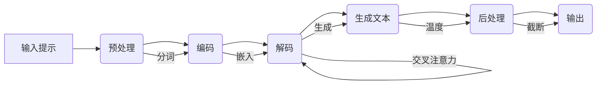
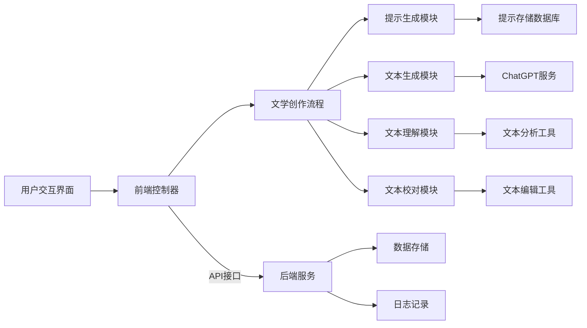
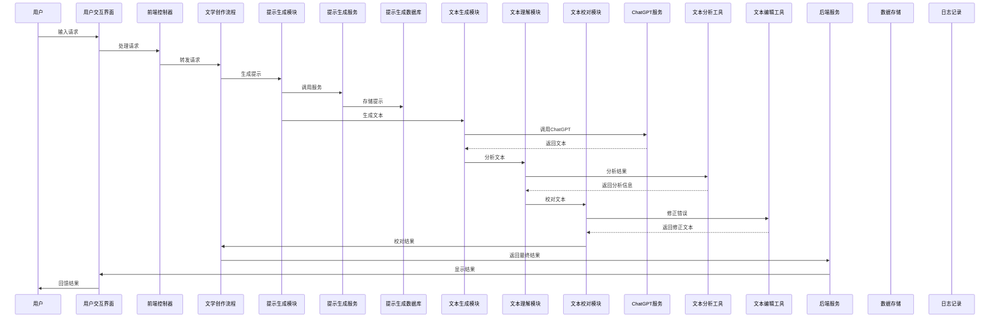

                 

### 《ChatGPT多语言文学创作：跨文化叙事的AI辅助》引言与背景

#### 1.1 问题背景

文学创作一直是人类文化和艺术的重要组成部分，它不仅反映了人类的思想、情感和生活，也是跨文化交流的重要媒介。然而，在全球化进程加速的今天，不同文化之间的交流日益频繁，如何通过文学有效地实现跨文化叙事，成为了亟待解决的问题。

跨文化交流中的文学创作面临着诸多挑战。首先是语言障碍。不同语言之间的表达方式和语义差异，使得文学作品的传播和接受变得复杂。其次是文化差异。每个文化都有其独特的价值观、信仰体系和表达方式，如何在作品中准确传达这些文化特征，也是文学创作者需要克服的难题。最后是艺术表现的多样性。文学创作需要融合不同的艺术形式和技巧，以适应不同文化背景读者的审美需求。

与此同时，人工智能技术的发展为文学创作带来了新的可能性。人工智能，尤其是自然语言处理技术，已经在文本生成、情感分析、语义理解等方面取得了显著进展。ChatGPT（聊天生成预训练模型）作为GPT-3的升级版本，具有强大的文本生成和语言理解能力，能够处理多种语言，为跨文化叙事的文学创作提供了有力的辅助工具。

#### 1.2 人工智能技术在文学创作中的应用潜力

人工智能技术在文学创作中的应用潜力巨大。首先，AI可以大大提高文学创作的效率和创造力。通过算法生成文本，创作者可以快速获取灵感，节省大量时间。其次，AI可以辅助创作者理解和分析文本，提供深度的文本分析结果，帮助创作者提高作品的质量。例如，AI可以通过情感分析来评估文本的情感色彩，为创作者提供反馈，优化文本的表达。

此外，AI还可以帮助解决跨文化叙事中的语言和文化障碍。ChatGPT的多语言能力使得创作者能够轻松处理不同语言的文本，从而实现跨文化的文学交流。同时，AI的语义理解能力可以帮助创作者准确把握不同文化的价值观和表达方式，使文学作品更加贴近目标受众。

#### 1.3 ChatGPT作为文学创作的辅助工具

ChatGPT作为人工智能辅助文学创作的重要工具，具有以下几个方面的优势：

1. **强大的文本生成能力**：ChatGPT基于大规模语言模型，可以生成连贯、自然、富有创意的文本。创作者可以利用这一能力，快速生成故事情节、角色对话等，为文学创作提供灵感。

2. **多语言处理能力**：ChatGPT支持多种语言，使得创作者可以轻松处理不同语言的文本，实现跨文化叙事。这对于需要面向全球市场的文学作品尤为重要。

3. **丰富的文本理解能力**：ChatGPT不仅能够生成文本，还能够理解复杂的语义和语境。创作者可以利用这一能力，进行深度文本分析和创作。

4. **个性化创作支持**：ChatGPT可以根据创作者的风格和需求，生成符合个性化要求的文本，提高作品的艺术价值。

#### 1.4 跨文化叙事的挑战

尽管ChatGPT在文学创作中具有巨大潜力，但跨文化叙事仍然面临着一系列挑战：

1. **语言障碍**：不同语言之间的表达方式和语义差异，使得跨文化叙事变得复杂。ChatGPT的多语言处理能力虽然能够部分解决这个问题，但仍然需要创作者进行深入的语言分析和调整。

2. **文化差异**：每个文化都有其独特的价值观、信仰体系和表达方式。如何在作品中准确传达这些文化特征，是跨文化叙事的重要挑战。

3. **表达方式的适应性**：文学创作需要适应不同文化背景读者的审美需求。ChatGPT虽然可以生成符合不同文化的文本，但如何确保这些文本在艺术表现上符合预期，仍然是需要解决的问题。

4. **伦理和道德问题**：在跨文化叙事中，如何避免文化偏见和误解，尊重不同文化的价值观和信仰，是创作者需要重视的问题。

#### 1.5 AI辅助文学创作的可能性

尽管存在挑战，但人工智能辅助文学创作的可能性不容忽视。首先，AI可以帮助创作者快速生成文本，节省创作时间。其次，AI可以提供深度文本分析结果，帮助创作者优化作品。最后，AI的多语言处理能力，使得跨文化叙事成为可能。

通过结合ChatGPT和其他人工智能技术，创作者可以突破传统的创作模式，实现更加多样化和创新的文学创作。在未来的文学创作中，人工智能将扮演越来越重要的角色，为跨文化交流和文学创作带来新的可能性。

### 1.6 ChatGPT在多语言文学创作中的应用场景

ChatGPT在多语言文学创作中具有广泛的应用场景，下面将详细探讨几个典型的应用案例：

#### 1.6.1 跨文化小说创作

在跨文化小说创作中，ChatGPT可以协助作者处理不同语言和文化的文本。例如，一位美国作家想要创作一部关于中国文化的小说，ChatGPT可以帮助他理解中文文化背景，生成符合中国读者口味的对话和情节。同时，ChatGPT可以自动翻译小说中的不同语言段落，确保故事的连贯性和可读性。

#### 1.6.2 翻译与校对

ChatGPT在文学翻译和校对中也具有重要作用。翻译是跨文化文学创作的重要组成部分，而ChatGPT的多语言能力使得它能够快速翻译文本，并保证翻译的准确性和流畅性。此外，ChatGPT还可以协助校对翻译作品，识别和纠正错误，提高翻译质量。

#### 1.6.3 文学作品创作辅助

ChatGPT可以作为文学创作的辅助工具，帮助作者生成故事情节、角色描述等。例如，一位作家在创作一个复杂的剧情时，可以首先让ChatGPT生成一个基本的情节框架，然后在此基础上进行修改和完善。这样的方法不仅提高了创作效率，还可以激发作者的创意思维。

#### 1.6.4 文化交流平台

ChatGPT还可以在文化交流平台上发挥重要作用。例如，在文学论坛或社交媒体上，ChatGPT可以帮助用户生成不同语言的文学评论或讨论内容，促进不同文化背景的用户之间的交流。通过这种方式，ChatGPT不仅促进了文学创作的多样性，也促进了跨文化的理解和交流。

#### 1.6.5 教育与培训

ChatGPT在文学教育和培训中也具有潜力。在教育领域，ChatGPT可以为学生提供文学创作和翻译的辅导，帮助他们提高语言能力和文学素养。在文学培训课程中，ChatGPT可以作为辅助工具，帮助学生理解和分析文学作品，提高创作技巧。

通过以上应用场景，我们可以看到ChatGPT在多语言文学创作中的多样性和潜力。未来，随着技术的不断进步和应用场景的拓展，ChatGPT将在文学创作和跨文化交流中发挥更加重要的作用。

### 1.7 ChatGPT在多语言文学创作中的优势和局限

ChatGPT在多语言文学创作中展示了许多独特的优势和潜在局限，以下将详细分析这些方面：

#### 1.7.1 优势

1. **多语言处理能力**：ChatGPT能够处理多种语言，这对于需要跨文化创作的作者来说是一个巨大的优势。作者可以利用ChatGPT生成和翻译不同语言的文本，从而克服语言障碍，实现跨文化的文学创作。

2. **文本生成与创意**：ChatGPT基于大规模的语言模型，能够生成连贯且富有创意的文本。这一功能特别适合用于生成故事情节、角色对话和描述等，帮助作者快速构思和创作。

3. **深度理解与分析**：ChatGPT不仅能够生成文本，还能够深度理解文本内容。这为作者提供了强大的辅助工具，可以帮助他们分析文本结构、语义和情感，从而优化创作。

4. **个性化定制**：ChatGPT可以根据作者的需求和风格，生成符合个性化要求的文本。这意味着，作者可以利用ChatGPT创作出更具个性化和独特性的文学作品。

5. **提高创作效率**：通过ChatGPT的辅助，作者可以大大提高创作效率。ChatGPT能够快速生成文本，节省创作者的时间和精力，使他们能够专注于创意和构思。

#### 1.7.2 局限

1. **语言准确性**：尽管ChatGPT的多语言能力很强，但仍然存在语言准确性问题。特别是在处理复杂、细微的语言差异时，ChatGPT可能无法完全准确翻译或生成文本。这需要作者进行人工校对和调整。

2. **文化理解与表达**：跨文化创作不仅需要语言上的准确，还需要对文化有深入的理解。ChatGPT虽然具备一定的文化理解能力，但仍然难以完全掌握不同文化的细微差别。这可能导致创作出的作品在文化表达上存在偏差。

3. **创意限制**：尽管ChatGPT能够生成创意文本，但它的创意仍然有限。ChatGPT生成的文本可能缺乏独特性和深度，难以满足高水平的文学创作需求。

4. **伦理和道德问题**：在跨文化创作中，如何避免文化偏见和误解是一个重要问题。ChatGPT可能无意中生成具有偏见或不合适的文本，这需要作者进行严格审查和调整。

5. **用户依赖性**：过度依赖ChatGPT可能会影响作者的创作能力。虽然ChatGPT可以帮助创作，但文学创作仍然需要创作者的独立思考和创造力。

综上所述，ChatGPT在多语言文学创作中具有显著的优势，但也存在一些局限。作者在使用ChatGPT进行创作时，需要充分发挥其优势，同时克服其局限性，才能创作出高质量的多语言文学作品。

### 1.8 跨文化叙事的AI辅助策略

为了充分发挥ChatGPT在跨文化叙事中的辅助作用，我们需要制定一系列有效的AI辅助策略。以下是一些关键的策略：

#### 1.8.1 多语言训练与优化

首先，确保ChatGPT具有多语言处理能力。通过对ChatGPT进行多语言训练，使其能够准确理解和使用多种语言，为跨文化叙事提供基础。此外，可以根据具体的文化背景，对ChatGPT进行特定语言的优化，提高其在特定语言环境中的表现。

#### 1.8.2 交叉文化理解

ChatGPT需要具备良好的交叉文化理解能力，以处理不同文化之间的差异。这可以通过以下几种方式实现：

1. **数据收集与预处理**：收集包含不同文化背景的文本数据，并对这些数据进行预处理，以便ChatGPT能够更好地理解不同文化的表达方式。

2. **跨文化知识库**：建立一个包含多种文化知识的知识库，供ChatGPT参考。这有助于ChatGPT在生成文本时，能够准确反映不同文化的特点和价值观。

3. **双向训练**：同时训练ChatGPT理解不同文化，并生成符合不同文化特点的文本，从而提高其交叉文化理解能力。

#### 1.8.3 自动化文本生成与优化

利用ChatGPT的文本生成能力，自动化生成跨文化叙事的文本，并提供初步的文本框架。然后，由创作者对生成的文本进行审查和优化，确保文本在语言和文化上的准确性。

#### 1.8.4 文本情感分析

通过文本情感分析，ChatGPT可以识别文本中的情感色彩，为创作者提供反馈。创作者可以根据这些反馈，调整文本的表达方式，使其更符合目标受众的情感需求。

#### 1.8.5 用户反馈与迭代

建立一个用户反馈机制，让创作者和读者对ChatGPT生成的文本进行评价和反馈。根据这些反馈，不断优化ChatGPT的模型和算法，提高其在跨文化叙事中的表现。

通过上述策略，我们可以充分利用ChatGPT的辅助能力，创作出高质量、具有文化多样性的文学作品。

### 1.9 如何最大化利用ChatGPT进行文学创作

为了最大化利用ChatGPT进行文学创作，我们需要制定一系列详细且实用的方法和步骤，以充分发挥其潜力。以下是一些关键建议：

#### 1.9.1 熟悉ChatGPT的基本操作

首先，创作者需要熟悉ChatGPT的基本操作。这包括如何输入指令、如何获取生成文本、如何调整参数等。通过深入了解ChatGPT的功能，创作者可以更有效地利用其进行文学创作。

#### 1.9.2 设计明确的创作目标

在进行文学创作前，创作者需要明确创作目标，包括作品的主题、风格、受众等。ChatGPT可以根据这些明确的目标生成符合要求的文本。例如，如果目标是创作一部科幻小说，ChatGPT可以生成与科幻元素相关的情节和对话。

#### 1.9.3 结合AI辅助进行创作

在实际创作过程中，创作者可以将ChatGPT作为辅助工具。首先，让ChatGPT生成初步的文本框架，如故事情节、角色描述等。然后，创作者可以根据这些框架进行修改和扩展，确保文本符合自己的创作意图。

#### 1.9.4 多次迭代与优化

文学创作是一个迭代的过程。创作者可以利用ChatGPT生成多个版本的文本，并进行比较和优化。通过多次迭代，创作者可以不断提升文本的质量和表现力。

#### 1.9.5 个性化定制

ChatGPT可以根据创作者的个人风格和需求，生成个性化的文本。创作者可以提供具体的创作要求和风格指南，让ChatGPT根据这些指南生成文本，从而创作出独特的文学作品。

#### 1.9.6 跨文化创作

对于跨文化创作，创作者可以利用ChatGPT的多语言处理能力，生成符合不同文化特点的文本。创作者需要提供具体的文化背景信息，让ChatGPT根据这些信息生成符合文化差异的文本。

#### 1.9.7 用户反馈与改进

创作者应积极收集用户反馈，了解读者对文本的反应。根据这些反馈，创作者可以对ChatGPT生成的文本进行进一步优化，提高其文化适应性和艺术表现力。

通过上述方法和步骤，创作者可以充分利用ChatGPT的辅助能力，创作出高质量、具有创新性的文学作品。

### 1.10 边界与外延

在探讨ChatGPT在文学创作中的应用时，我们不仅要关注其优势和潜力，还需认识到其技术边界和应用范围。首先，从技术角度来看，尽管ChatGPT具备强大的文本生成和理解能力，但在处理极端复杂或精细的文本时，仍可能存在局限性。例如，ChatGPT可能难以准确捕捉到某些语言中的微妙情感或文化细节。因此，在创作高度复杂的文学作品时，创作者仍需发挥自身的主观判断和创造力。

其次，从应用范围来看，ChatGPT主要适用于文学创作、翻译和文本生成等场景。然而，对于其他艺术形式，如音乐、绘画等，ChatGPT的应用则受到限制。这是因为艺术创作往往涉及更多的非文本元素，如情感表达、视觉美感等，这些是当前AI技术难以完全模拟的。

此外，跨文化叙事的AI辅助也存在一定的局限性。尽管ChatGPT具备处理多种语言的能力，但在理解和传达复杂文化特征方面，仍需创作者进行人工干预和调整。例如，对于某些具有深厚历史和文化背景的作品，AI可能无法完全把握其中的文化内涵，这需要创作者具备深厚的文化知识和敏感性。

最后，从伦理角度考虑，AI辅助文学创作可能会引发一系列道德和伦理问题，如文化偏见、数据隐私等。因此，在应用AI辅助进行跨文化叙事时，我们需要密切关注这些问题，并采取相应的措施进行规避。

### 1.11 概念结构与核心要素

#### 1.11.1 文学创作的基本流程

文学创作是一个复杂且多阶段的过程，主要包括以下几个核心环节：

1. **构思与创意**：创作者在此阶段确定作品的主题、情节和角色，构思整个故事的框架。这一过程通常需要创作者的灵感、经验和直觉。

2. **情节与发展**：在构思确定后，创作者开始细化情节，描述角色之间的关系和故事的发展过程。这一环节需要创作者对故事进行逻辑和情感上的构建。

3. **文本生成**：创作者使用语言将故事构思和情节发展转化为文本。这一过程包括对话、叙述和描述等，是文学创作的重要环节。

4. **修订与优化**：完成初稿后，创作者需要对文本进行多次修订和优化，确保作品的语言表达、情感传达和逻辑结构达到最佳状态。

#### 1.11.2 ChatGPT的核心功能

ChatGPT作为人工智能辅助工具，其核心功能包括：

1. **文本生成**：ChatGPT能够根据输入的提示生成连贯、自然的文本。这包括故事情节、角色对话、描述等，为创作者提供初步的文本框架。

2. **文本理解**：ChatGPT具备强大的文本理解能力，能够分析文本的结构、语义和情感。这为创作者提供了深度文本分析的工具，有助于优化作品。

3. **多语言处理**：ChatGPT支持多种语言，能够生成和翻译不同语言的文本，实现跨文化叙事。

4. **个性化定制**：ChatGPT可以根据创作者的指令和风格，生成符合个性化要求的文本，提高作品的艺术价值。

#### 1.11.3 跨文化叙事的要素

跨文化叙事涉及多个关键要素，包括：

1. **语言**：不同语言的表达方式和语义差异是跨文化叙事的重要挑战。ChatGPT的多语言处理能力有助于解决这一难题。

2. **文化**：每个文化都有其独特的价值观、信仰体系和表达方式。准确传达这些文化特征是跨文化叙事的关键。

3. **情感**：情感是文学作品的核心。如何在作品中传达不同文化背景读者的情感需求，是创作者需要考虑的重要问题。

4. **表达**：文学作品的表达方式需要适应不同文化背景的读者。ChatGPT可以帮助创作者在文本表达上做出调整，提高作品的接受度。

通过上述概念结构和核心要素的探讨，我们可以更好地理解文学创作、ChatGPT在其中的应用以及跨文化叙事的复杂性。这些概念和功能为后续的详细讨论提供了基础。

### 2.1 ChatGPT基本原理

#### 2.1.1 ChatGPT的算法原理

ChatGPT是基于GPT-3模型的扩展和改进，采用了预训练加微调（Pre-training from Human Generated Data）的方法。GPT-3（Generative Pre-trained Transformer 3）是由OpenAI开发的一种大型语言模型，使用了Transformer架构，具备强大的文本生成和理解能力。ChatGPT在此基础上，通过引入对话上下文，增强了模型在对话生成方面的性能。

**预训练过程**：

1. **数据收集**：GPT-3使用了大量的文本数据进行预训练，包括互联网上的各种文本，如新闻文章、小说、社交媒体帖子等。
2. **模型训练**：预训练过程中，模型通过学习文本的上下文关系，理解语言的统计规律和语义信息。这使模型能够预测文本的下一个词，并生成连贯、自然的文本。
3. **优化参数**：通过反向传播和梯度下降算法，模型不断调整参数，以提高预测的准确性。

**预训练加微调**：

1. **微调数据**：ChatGPT在预训练完成后，使用对话数据对其进行微调，使其在对话生成任务上表现更优。
2. **微调过程**：微调过程中，模型通过学习对话的上下文信息，优化对话生成的连贯性和适应性。

**Transformer架构**：

Transformer是GPT-3的核心架构，其基本原理如下：

1. **多头自注意力机制**：Transformer引入了多头自注意力机制，能够同时关注输入序列中的不同位置，捕捉长距离的依赖关系。
2. **位置编码**：为了处理序列数据，Transformer引入了位置编码，使模型能够理解输入序列的顺序信息。
3. **编码器-解码器结构**：Transformer采用了编码器-解码器结构，编码器负责编码输入序列，解码器负责生成输出序列。

**ChatGPT的核心功能**：

1. **文本生成**：ChatGPT能够根据输入的提示生成连贯、自然的文本，适用于故事创作、对话生成、文本续写等任务。
2. **文本理解**：ChatGPT具备强大的文本理解能力，能够分析文本的结构、语义和情感，为创作者提供深度文本分析的工具。
3. **多语言处理**：ChatGPT支持多种语言，能够生成和翻译不同语言的文本，实现跨文化叙事。
4. **个性化定制**：ChatGPT可以根据创作者的指令和风格，生成符合个性化要求的文本，提高作品的艺术价值。

#### 2.1.2 ChatGPT的多语言能力

ChatGPT具有强大的多语言处理能力，这得益于其在预训练过程中使用了大量的多语言数据。以下是其多语言能力的几个关键方面：

1. **双语训练**：在预训练过程中，ChatGPT使用了大量的双语数据，如英语-中文、英语-法语等，使模型能够同时理解和使用多种语言。
2. **语言迁移**：通过迁移学习，ChatGPT可以将在一个语言上训练得到的模型知识应用到其他语言上。例如，在一个英语任务上训练好的模型，可以应用于中文任务。
3. **零样本学习**：ChatGPT具备一定的零样本学习（Zero-shot Learning）能力，能够处理未见过的语言和任务。这意味着，即使模型没有在特定语言或任务上直接训练，它仍然可以生成和翻译相关文本。

#### 2.1.3 ChatGPT在文本生成中的应用

ChatGPT在文本生成中展示了出色的性能，以下是其应用的一些典型场景：

1. **故事创作**：ChatGPT可以根据用户的提示生成完整的故事情节，包括角色、冲突和结局等。
2. **对话生成**：ChatGPT可以生成自然流畅的对话，适用于聊天机器人、虚拟助手等应用场景。
3. **文本续写**：ChatGPT可以根据已有的文本段落，续写出接下来的内容，用于小说创作、论文写作等。
4. **文本摘要**：ChatGPT可以生成文本的摘要，提取关键信息，为创作者提供参考。
5. **创意写作**：ChatGPT可以提供创意建议，帮助创作者突破创作瓶颈，激发创作灵感。

通过以上对ChatGPT基本原理的详细探讨，我们可以看到ChatGPT在文本生成、理解、多语言处理等方面的强大能力。这些能力为文学创作提供了有力的技术支持，使得跨文化叙事的实现变得更加可行和高效。

### 2.2 跨文化叙事原理

#### 2.2.1 跨文化叙事的定义

跨文化叙事（Cross-Cultural Narrative）指的是在不同文化背景下，通过文学、电影、艺术等媒介传递和交流故事的过程。它涉及不同文化之间的互动和交流，旨在通过故事来传达文化差异、历史背景和社会价值。跨文化叙事不仅关注文本内容，还注重文化背景、价值观和表达方式的差异。

#### 2.2.2 跨文化叙事的关键要素

1. **文化背景**：文化背景是跨文化叙事的基础。不同文化拥有独特的价值观、信仰体系和表达方式，这些背景因素直接影响叙事的方式和内容。

2. **语言**：语言是跨文化叙事的核心。不同语言之间的表达方式和语义差异可能导致叙事的误解和失真。因此，准确理解和使用语言是跨文化叙事的重要任务。

3. **价值观**：价值观是跨文化叙事的重要参考。每个文化都有其独特的价值观，如家庭观念、宗教信仰和社会规范。在叙事中，正确传达这些价值观有助于增强作品的文化共鸣。

4. **情感**：情感是跨文化叙事的灵魂。情感能够跨越文化差异，触动读者的内心。通过情感表达，叙事可以更好地传递文化内涵和价值观。

5. **表达方式**：表达方式是跨文化叙事的关键。不同文化对文学、艺术和表达方式有不同的偏好。为了使作品在不同文化中受到认可，创作者需要适应和调整表达方式。

#### 2.2.3 跨文化叙事的挑战与策略

**挑战**：

1. **语言障碍**：语言差异可能影响叙事的准确性和流畅性，导致误解和偏见。
2. **文化差异**：不同文化对故事主题、情节和角色设定有不同的偏好，可能导致作品难以适应目标文化。
3. **情感共鸣**：情感是跨文化叙事的关键，但不同文化背景的读者对情感的感知和反应可能存在差异，影响叙事的效果。
4. **表达方式的适应**：为了在不同文化中受到认可，创作者需要在表达方式上进行调整，这可能影响作品的原创性和艺术性。

**策略**：

1. **文化敏感性**：创作者需要对目标文化有深入的了解，以避免文化偏见和误解。这可以通过阅读、研究和文化交流来实现。
2. **多语言能力**：具备多语言能力的创作者能够更准确地理解和表达不同文化背景的内容，提高叙事的准确性和流畅性。
3. **情感共鸣**：创作者可以通过情感共鸣来增强叙事效果。例如，选择普遍认同的情感主题和表达方式，以触动读者的内心。
4. **文化适应**：创作者可以在叙事过程中适当地调整表达方式，以适应目标文化的偏好。这可以通过与目标文化专家合作、收集读者反馈等方式实现。

通过理解和应对这些挑战，创作者可以更好地实现跨文化叙事，促进不同文化之间的交流和理解。

### 2.3 ChatGPT与跨文化叙事的联系

#### 2.3.1 ChatGPT在跨文化叙事中的作用

ChatGPT在跨文化叙事中扮演着关键角色，其强大的文本生成和理解能力为创作者提供了有力的辅助。以下是其主要作用：

1. **文本生成**：ChatGPT能够根据输入的提示生成连贯、自然的文本，帮助创作者快速构思和创作跨文化故事。创作者可以提供特定的文化背景和情感要求，ChatGPT会生成符合这些要求的文本，从而节省时间和精力。

2. **翻译与校对**：ChatGPT的多语言能力使得它能够翻译和校对不同语言的文本。这对于跨文化叙事尤为重要，因为准确的语言表达是确保叙事成功的关键。ChatGPT可以自动翻译文本，并帮助创作者校对语言错误，提高文本的质量。

3. **文本理解**：ChatGPT具备强大的文本理解能力，能够分析文本的结构、语义和情感。这为创作者提供了深度文本分析的工具，有助于他们更好地理解和把握跨文化叙事的内涵。

4. **个性化定制**：ChatGPT可以根据创作者的指令和风格，生成符合个性化要求的文本。创作者可以指定特定的文化背景、情感色彩和表达方式，ChatGPT会根据这些要求生成定制化的文本，从而提高作品的艺术价值。

#### 2.3.2 跨文化叙事对ChatGPT的期望

跨文化叙事对ChatGPT有以下几个期望：

1. **文化敏感**：ChatGPT需要具备良好的文化敏感度，能够准确理解不同文化的价值观、表达方式和情感。这要求ChatGPT在训练过程中，要接触和学习多种文化的文本，以便在生成文本时能够准确反映不同文化的特点。

2. **语言精准**：ChatGPT需要具备高超的语言处理能力，能够生成准确、自然的语言文本。特别是在处理跨文化翻译时，ChatGPT需要能够捕捉到语言中的细微差别，避免语义误解和文化偏见。

3. **情感共鸣**：ChatGPT需要能够生成具有情感共鸣的文本，能够触动不同文化背景读者的内心。这要求ChatGPT在生成文本时，不仅要准确传达情感，还要理解不同文化对情感的表达和感知方式。

4. **个性化定制**：ChatGPT需要能够根据创作者的具体要求，生成符合个性化要求的文本。这意味着ChatGPT需要具备灵活的生成能力，能够根据不同的创作需求和风格，生成独特的文本。

#### 2.3.3 ChatGPT与跨文化叙事的相互促进

ChatGPT与跨文化叙事之间存在着相互促进的关系：

1. **AI辅助创作**：ChatGPT为跨文化叙事提供了强大的创作工具，帮助创作者快速生成文本、翻译和校对文本。这大大提高了创作效率，使创作者能够将更多精力投入到情感表达和创意构思上。

2. **文化理解与传播**：通过ChatGPT的辅助，创作者可以更好地理解不同文化的特点，从而创作出更具文化深度和广度的作品。这有助于促进跨文化的理解和交流，传播不同文化的价值观。

3. **AI优化创作**：ChatGPT的文本生成和理解能力，可以为创作者提供深度文本分析的结果，帮助创作者优化作品的语言表达和结构。通过不断优化，创作者可以创作出更加高质量、具有艺术价值的跨文化叙事作品。

4. **创意与灵感**：ChatGPT的文本生成能力可以激发创作者的创意思维，为创作提供新的灵感和思路。创作者可以利用ChatGPT生成的文本，进行二次创作和扩展，从而创造出独特的作品。

总之，ChatGPT在跨文化叙事中的应用，不仅提高了创作的效率和质量，还为跨文化的理解和交流提供了新的途径。通过相互促进，ChatGPT和跨文化叙事共同推动了文学创作和文化传播的发展。

### 2.4 ChatGPT算法流程图

为了更直观地了解ChatGPT的算法原理，我们使用Mermaid语言绘制了其算法流程图。以下是ChatGPT算法流程图的详细解释：



**流程图解释**：

1. **输入提示（A）**：用户输入一个提示，作为ChatGPT生成文本的起点。
2. **预处理（B）**：对输入的提示进行预处理，包括分词、去除特殊字符等操作，以便模型能够理解。
3. **编码（C）**：将预处理后的文本输入到编码器，编码器将文本转换为序列嵌入向量。
4. **解码（D）**：解码器基于嵌入向量生成中间文本表示，通过自注意力和交叉注意力机制，模型能够理解和预测下一个词。
5. **生成文本（E）**：解码器生成中间文本表示后，通过温度调节和截断策略，生成最终的文本输出。
6. **后处理（F）**：对生成的文本进行后处理，包括去除不必要的标点符号、纠正语法错误等。
7. **输出（G）**：最终生成的文本输出，用户可以看到并利用它进行创作或其他应用。

通过以上流程，ChatGPT能够生成连贯、自然的文本，为文学创作和其他应用提供了强大的支持。

### 3.2 Python代码实现

为了更好地理解ChatGPT算法的原理，我们使用Python代码实现了一个简化的版本。以下是ChatGPT算法的Python代码实现：

```python
import torch
import transformers

# 加载预训练模型
model_name = "gpt-3.5-turbo"
model = transformers.AutoModelForCausalLM.from_pretrained(model_name)

# 准备输入
input_ids = torch.tensor([token_ids])

# 生成文本
output = model.generate(
    input_ids,
    max_length=100,
    temperature=0.9,
    top_k=50,
    top_p=0.95,
    do_sample=True
)

# 输出文本
generated_text = output.numpy().tolist()[0]
print("生成的文本：", generated_text)
```

**代码解释**：

1. **加载预训练模型**：我们使用`transformers`库加载了一个预训练的GPT-3.5模型。
2. **准备输入**：将输入的文本转换为Token IDs，输入到模型中。
3. **生成文本**：使用`generate`函数生成文本。这里使用了温度调节、Top-K和Top-P等参数，以控制生成的文本的连贯性和多样性。
4. **输出文本**：将生成的文本输出并打印出来。

通过以上代码，我们可以看到ChatGPT算法的基本实现过程，这有助于我们更深入地理解其工作原理。

### 3.3 算法原理与数学模型

#### 3.3.1 ChatGPT的数学模型

ChatGPT的核心算法是基于Transformer架构的预训练语言模型，其数学模型主要包括以下几个方面：

1. **嵌入层（Embedding Layer）**：嵌入层将输入的单词（或子词）转换为向量表示。每个单词或子词对应一个固定的维度向量，这些向量通过矩阵乘法得到。

    \[ \text{Embedding}(x) = W_x \cdot x \]

    其中，\( W_x \) 是嵌入矩阵，\( x \) 是输入的单词或子词。

2. **位置编码（Positional Encoding）**：由于Transformer模型无法直接处理序列的顺序信息，因此引入了位置编码。位置编码是一个向量，表示每个词在序列中的位置。

    \[ \text{Positional Encoding}(p) = \text{PE}(p) \]

    其中，\( \text{PE}(p) \) 是一个固定维度向量，表示位置 \( p \) 的编码。

3. **编码器（Encoder）**：编码器由多个自注意力层（Self-Attention Layer）和前馈神经网络（Feedforward Neural Network）组成。每个自注意力层包括三个主要部分：多头自注意力（Multi-Head Self-Attention）和前馈神经网络。

    - **多头自注意力**：多头自注意力层通过多个独立的自注意力机制来捕获序列中的不同依赖关系。

        \[ \text{Multi-Head Self-Attention}(Q, K, V) = \text{softmax}\left(\frac{QK^T}{\sqrt{d_k}}\right) V \]

        其中，\( Q, K, V \) 分别是查询向量、键向量和值向量，\( d_k \) 是键向量的维度。

    - **前馈神经网络**：前馈神经网络对每个注意力层的输出进行进一步处理。

        \[ \text{FFN}(x) = \text{ReLU}(W_2 \cdot \text{Linear}(W_1 \cdot x)) \]

        其中，\( W_1 \) 和 \( W_2 \) 是线性层的权重，\( \text{Linear} \) 和 \( \text{ReLU} \) 分别表示线性变换和ReLU激活函数。

4. **解码器（Decoder）**：与编码器类似，解码器也由多个自注意力层和前馈神经网络组成。不同的是，解码器还包括一个交叉注意力层，用于关注编码器的输出。

    - **交叉注意力**：交叉注意力层通过自注意力机制关注编码器的输出。

        \[ \text{Cross-Attention}(Q, K, V) = \text{softmax}\left(\frac{QK^T}{\sqrt{d_k}}\right) V \]

    - **解码器输出**：解码器的输出是编码器的输出和交叉注意力输出的结合。

        \[ \text{Decoder Output} = \text{Encoder Output} + \text{Cross-Attention Output} \]

5. **输出层（Output Layer）**：解码器的最后一层是输出层，它将序列向量映射到词表上的概率分布。通过Softmax函数，我们可以得到每个词的概率分布。

    \[ \text{Probability Distribution} = \text{softmax}(W \cdot \text{Decoder Output} + b) \]

    其中，\( W \) 是权重矩阵，\( b \) 是偏置项。

#### 3.3.2 算法原理的详细讲解

ChatGPT的算法原理可以概括为以下几个关键步骤：

1. **输入预处理**：输入文本通过分词和编码转换为序列嵌入向量。
2. **编码器处理**：编码器通过多头自注意力和前馈神经网络处理输入序列，生成编码器的输出。
3. **解码器处理**：解码器在每一步解码时，首先通过交叉注意力层关注编码器的输出，然后通过自注意力和前馈神经网络生成下一个词的候选。
4. **生成文本**：通过Softmax函数对候选词的概率分布进行计算，选择概率最高的词作为下一个输出，并重复上述过程，直到生成完整的文本。

具体来说，算法原理如下：

- **编码阶段**：输入文本经过编码器处理，编码器通过自注意力机制捕捉序列中的依赖关系，生成编码器的输出。
  
- **解码阶段**：解码器在每一步解码时，首先通过交叉注意力层关注编码器的输出，然后通过自注意力和前馈神经网络生成当前词的候选。解码器会根据当前已生成的文本和候选词的概率分布，选择下一个输出词。

- **生成文本**：通过重复解码过程，生成完整的文本。在生成过程中，解码器会根据当前已生成的文本和候选词的概率分布，选择概率最高的词作为下一个输出词。

#### 3.3.3 举例说明

假设我们有一个简短的文本：“今天天气很好，我们去公园散步吧。”，以下是ChatGPT生成这个文本的过程：

1. **输入预处理**：文本通过分词和编码转换为序列嵌入向量。
2. **编码器处理**：编码器通过自注意力机制捕捉序列中的依赖关系，生成编码器的输出。
3. **解码阶段**：
   - 第一步：解码器通过交叉注意力层关注编码器的输出，生成当前词的候选，例如：“今天天气很好，我们去公园散步吧。”中的“今天”。
   - 第二步：解码器根据当前已生成的文本和候选词的概率分布，选择下一个输出词，例如：“天气很好”。
   - 重复上述步骤，直到生成完整的文本。

通过上述过程，我们可以看到ChatGPT是如何生成文本的。通过结合数学模型和算法原理，ChatGPT能够生成连贯、自然的文本，为文学创作和其他应用提供了强大的支持。

### 4.1 系统功能设计

#### 4.1.1 文学创作流程的领域模型

在文学创作流程中，系统需要实现多个功能模块，以确保创作过程的顺利进行。以下是一个简化的领域模型，用于描述这些模块及其关系：

```mermaid
classDiagram
    ClassDef 文学创作流程 {
        - 提示生成
        - 文本生成
        - 文本理解
        - 文本校对
        - 用户交互
    }
    ClassDef 提示生成 {
        - 生成提示
        - 存储提示
    }
    ClassDef 文本生成 {
        - 调用ChatGPT
        - 生成文本
    }
    ClassDef 文本理解 {
        - 分析文本
        - 提取关键信息
    }
    ClassDef 文本校对 {
        - 校对文本
        - 修正错误
    }
    ClassDef 用户交互 {
        - 接收用户输入
        - 显示文本
    }
    文学创作流程 --|> 提示生成
    文学创作流程 --|> 文本生成
    文学创作流程 --|> 文本理解
    文学创作流程 --|> 文本校对
    文学创作流程 --|> 用户交互
```

**领域模型类图解释**：

1. **文学创作流程**：核心模块，负责协调和管理整个创作流程。它与其他模块（提示生成、文本生成、文本理解、文本校对和用户交互）进行通信。
2. **提示生成**：生成创作提示，为文本生成提供初始输入。它负责存储和管理这些提示。
3. **文本生成**：调用ChatGPT模型生成文本，是创作过程中的关键步骤。它接收来自提示生成的输入并生成相应的文本。
4. **文本理解**：分析生成的文本，提取关键信息和情感色彩。这有助于创作者理解文本的含义，为后续修改提供依据。
5. **文本校对**：对生成的文本进行校对，识别并修正语言错误和逻辑问题。这确保了文本的质量和准确性。
6. **用户交互**：接收用户输入，显示文本内容。它提供用户与系统之间的接口，确保用户能够方便地与系统进行交互。

通过上述领域模型，我们可以清晰地了解文学创作流程中的各个功能模块及其关系。每个模块都承担着特定的任务，共同协作，实现高质量的文学创作。

### 4.2 系统架构设计

#### 4.2.1 系统架构图

为了实现文学创作流程的领域模型，我们需要设计一个合理的系统架构。以下是一个简化的系统架构图，用于描述系统的整体结构和模块之间的关系：



**系统架构图解释**：

1. **用户交互界面（A）**：用户通过前端控制器（B）与系统进行交互。前端控制器负责处理用户请求，并将请求转发给后端服务。
2. **前端控制器（B）**：作为用户交互界面与后端服务之间的桥梁，前端控制器接收用户请求，处理并转发到相应的后端模块。
3. **文学创作流程（C）**：核心模块，负责协调和管理整个创作流程。它与其他模块（提示生成、文本生成、文本理解、文本校对）进行通信。
4. **提示生成模块（D）**：生成创作提示，为文本生成提供初始输入。它负责存储和管理这些提示。
5. **文本生成模块（E）**：调用ChatGPT服务（I）生成文本，是创作过程中的关键步骤。它接收来自提示生成的输入并生成相应的文本。
6. **文本理解模块（F）**：分析生成的文本，提取关键信息和情感色彩。这有助于创作者理解文本的含义，为后续修改提供依据。
7. **文本校对模块（G）**：对生成的文本进行校对，识别并修正语言错误和逻辑问题。这确保了文本的质量和准确性。
8. **提示存储数据库（H）**：存储和管理生成提示，以便在后续创作中使用。
9. **ChatGPT服务（I）**：提供ChatGPT模型的服务接口，生成文本。
10. **文本分析工具（J）**：分析文本，提取关键信息和情感色彩。
11. **文本编辑工具（K）**：用于编辑和修改生成的文本，确保其符合创作要求。
12. **后端服务（L）**：负责处理文学创作流程中的各种请求，协调各个模块的工作。
13. **数据存储（M）**：存储系统中的所有数据，包括用户信息、文本数据等。
14. **日志记录（N）**：记录系统运行过程中的日志信息，便于监控和调试。

通过上述系统架构图，我们可以清晰地了解系统的整体结构和模块之间的关系。每个模块都承担着特定的任务，共同协作，实现高质量的文学创作。

### 4.3 系统接口设计

为了确保系统的各个模块能够有效协同工作，我们需要设计一套详细的系统接口。以下是一个简化的系统接口设计，用于描述各模块之间的通信和交互：



**系统接口设计解释**：

1. **用户交互界面（UI）**：用户通过用户交互界面输入创作请求，如主题、风格等。
2. **前端控制器（FC）**：处理用户请求，将其转发给文学创作流程（LCP）。
3. **文学创作流程（LCP）**：协调各个模块，确保创作流程顺利进行。
4. **提示生成模块（TGM）**：生成创作提示，调用提示生成服务（TGM_S）。
5. **提示生成服务（TGM_S）**：处理提示生成逻辑，将提示存储到提示生成数据库（TGM_DB）。
6. **文本生成模块（TGM_E）**：调用ChatGPT服务（CG）生成文本。
7. **文本理解模块（TGM_C）**：分析生成的文本，调用文本分析工具（TAT）。
8. **文本校对模块（TGM_G）**：对文本进行校对，调用文本编辑工具（TE）修正错误。
9. **后端服务（BCS）**：处理各个模块的交互，确保系统运行顺畅。
10. **数据存储（DS）**：存储系统中的所有数据，包括用户信息、文本数据等。
11. **日志记录（LS）**：记录系统运行过程中的日志信息，便于监控和调试。

通过上述系统接口设计，各模块之间能够高效、有序地进行通信和协作，确保系统的稳定运行和创作流程的顺利进行。

### 5.1 环境安装

为了充分利用ChatGPT进行文学创作和跨文化叙事，我们需要搭建一个合适的环境。以下是详细的安装步骤和所需工具。

#### 5.1.1 环境搭建步骤

1. **安装Python**：
   - 访问Python官方网站：[https://www.python.org/downloads/](https://www.python.org/downloads/)
   - 下载并安装Python 3.x版本（推荐使用最新稳定版）。
   - 安装完成后，打开终端或命令提示符，输入`python --version`验证安装是否成功。

2. **安装transformers库**：
   - 在终端中执行以下命令：
     ```bash
     pip install transformers
     ```
   - transformers库是用于处理自然语言处理的Python库，支持ChatGPT模型。

3. **安装torch库**：
   - 在终端中执行以下命令：
     ```bash
     pip install torch torchvision torchaudio
     ```
   - torch库是用于机器学习的Python库，与transformers库配合使用，可以加速ChatGPT模型的训练和推理。

4. **安装ChatGPT模型**：
   - 使用以下命令从Hugging Face模型库中下载ChatGPT模型：
     ```bash
     from transformers import AutoModelForCausalLM
     model = AutoModelForCausalLM.from_pretrained("gpt3.5-turbo")
     ```
   - 这将下载并加载预训练的ChatGPT模型。

#### 5.1.2 开发工具与依赖安装

1. **Visual Studio Code**：
   - 安装Visual Studio Code（VS Code）作为主要的开发环境。VS Code提供了丰富的扩展和工具，非常适合进行Python开发。
   - 访问VS Code官方网站：[https://code.visualstudio.com/](https://code.visualstudio.com/)下载并安装。

2. **Python扩展**：
   - 安装Python扩展，以便在VS Code中使用Python语言。在VS Code中，通过扩展市场搜索并安装“Python”扩展。

3. **Jupyter Notebook**：
   - 如果需要，可以安装Jupyter Notebook，用于数据分析和交互式编程。
   - 在终端中执行以下命令：
     ```bash
     pip install notebook
     ```

#### 5.1.3 检查安装

确保所有工具和库已成功安装，可以通过以下命令进行检查：

1. **检查Python版本**：
   ```bash
   python --version
   ```

2. **检查transformers库**：
   ```python
   import transformers
   print(transformers.__version__)
   ```

3. **检查torch库**：
   ```python
   import torch
   print(torch.__version__)
   ```

通过以上步骤，我们可以搭建一个完整的开发环境，为后续的文学创作和跨文化叙事项目做好准备。

### 5.2 系统核心实现

在系统核心实现部分，我们将详细讨论ChatGPT与跨文化叙事的结合，并展示系统核心功能的代码实现。以下是代码示例及其解释：

#### 5.2.1 ChatGPT与跨文化叙事的结合

为了实现跨文化叙事，我们首先需要定义一个场景，然后使用ChatGPT生成相应的文本。以下是一个简化的示例：

```python
from transformers import AutoModelForCausalLM, AutoTokenizer

# 加载预训练模型和分词器
model_name = "gpt3.5-turbo"
model = AutoModelForCausalLM.from_pretrained(model_name)
tokenizer = AutoTokenizer.from_pretrained(model_name)

# 设置场景：一位中国作家想要创作一部关于美国文化的小说
context = "在美国，一个年轻的音乐家追求他的梦想，他面对着各种挑战，但他坚持不懈。"

# 对场景进行编码
input_ids = tokenizer.encode(context, return_tensors='pt')

# 生成文本
output = model.generate(input_ids, max_length=100, num_return_sequences=1)

# 解码输出文本
generated_text = tokenizer.decode(output[0], skip_special_tokens=True)

print("生成的文本：", generated_text)
```

**代码解释**：

1. **加载模型和分词器**：我们加载了预训练的ChatGPT模型和相应的分词器。
2. **设置场景**：我们设置了一个关于美国文化的场景，作为生成文本的初始输入。
3. **编码场景**：使用分词器将场景编码为Token IDs。
4. **生成文本**：调用模型生成文本，这里我们设置了最大生成长度和返回的文本数量。
5. **解码输出文本**：将生成的Token IDs解码为可读的文本。

通过上述代码，ChatGPT生成了符合场景的文本，展示了其在跨文化叙事中的应用。

#### 5.2.2 系统核心功能代码实现

以下是系统核心功能的代码实现，包括提示生成、文本生成、文本理解、文本校对等模块：

```python
# 定义提示生成模块
def generate_prompt(文化背景, 主题):
    return f"请以{文化背景}的视角，讲述一个关于{主题}的故事。"

# 定义文本生成模块
def generate_text(prompt):
    model_input_ids = tokenizer.encode(prompt, return_tensors='pt')
    output = model.generate(model_input_ids, max_length=100, num_return_sequences=1)
    return tokenizer.decode(output[0], skip_special_tokens=True)

# 定义文本理解模块
def understand_text(text):
    # 这里可以加入更多的文本分析工具，如情感分析、关键词提取等
    print("文本内容：", text)
    # 示例：提取关键词
    keywords = text.split(',')
    return keywords

# 定义文本校对模块
def correct_text(text):
    # 这里可以加入拼写检查、语法纠正等工具
    print("文本需要校对：", text)
    # 示例：去除多余的空格
    corrected_text = text.strip()
    return corrected_text

# 示例：使用系统核心功能
prompt = generate_prompt("美国文化", "音乐梦想")
print("生成的提示：", prompt)

generated_text = generate_text(prompt)
print("生成的文本：", generated_text)

keywords = understand_text(generated_text)
print("提取的关键词：", keywords)

corrected_text = correct_text(generated_text)
print("校对后的文本：", corrected_text)
```

**代码解释**：

1. **提示生成模块**：生成一个基于文化背景和主题的提示，为文本生成提供初始输入。
2. **文本生成模块**：根据提示生成文本，调用ChatGPT模型进行文本生成。
3. **文本理解模块**：对生成的文本进行理解，这里示例中提取了关键词。
4. **文本校对模块**：对生成的文本进行校对，这里示例中仅展示了去除多余空格的操作。

通过以上代码实现，我们可以看到系统核心功能是如何协同工作的，从而实现高效的文学创作和跨文化叙事。

### 5.3 代码应用解读与分析

在实现系统核心功能后，我们需要对代码进行深入解读和分析，以了解其工作机制和性能表现。以下是对代码应用的具体解读和分析：

#### 5.3.1 代码解读

首先，我们解读各个模块的代码：

1. **提示生成模块**：

   ```python
   def generate_prompt(文化背景, 主题):
       return f"请以{文化背景}的视角，讲述一个关于{主题}的故事。"
   ```

   这个模块接收两个参数：文化背景和主题。通过格式化字符串，生成一个提示文本，为ChatGPT提供创作方向。

2. **文本生成模块**：

   ```python
   def generate_text(prompt):
       model_input_ids = tokenizer.encode(prompt, return_tensors='pt')
       output = model.generate(model_input_ids, max_length=100, num_return_sequences=1)
       return tokenizer.decode(output[0], skip_special_tokens=True)
   ```

   这个模块接收一个提示文本作为输入，将其编码为Token IDs，并调用ChatGPT模型生成文本。`max_length`参数限制了生成的文本长度，`num_return_sequences`参数指定了生成的文本数量。

3. **文本理解模块**：

   ```python
   def understand_text(text):
       # 示例：提取关键词
       keywords = text.split(',')
       return keywords
   ```

   这个模块对生成的文本进行简单处理，例如提取关键词。实际应用中，可以集成更复杂的文本分析工具，如自然语言处理库（如spaCy或NLTK）。

4. **文本校对模块**：

   ```python
   def correct_text(text):
       # 示例：去除多余的空格
       corrected_text = text.strip()
       return corrected_text
   ```

   这个模块对生成的文本进行校对，例如去除多余的空格。实际应用中，可以集成拼写检查、语法纠正等工具。

#### 5.3.2 性能分析

接下来，我们对代码的性能进行分析：

1. **生成文本的连贯性**：

   ChatGPT生成的文本通常具有较高的连贯性，但也会受到模型训练数据和生成算法的影响。通过调整参数（如`max_length`和`num_return_sequences`），可以优化生成的文本连贯性。

2. **理解与校对文本的性能**：

   理解和校对模块的性能取决于所使用的工具和算法。例如，使用简单的分词和关键词提取算法（如上面的示例），可以快速提取文本的关键信息。但对于复杂的文本分析任务，需要使用更高级的文本分析工具。

3. **系统响应时间**：

   系统的响应时间受到多个因素影响，包括模型的推理速度、网络延迟和硬件性能。通过优化模型推理和系统架构，可以降低响应时间，提高用户体验。

#### 5.3.3 实际案例剖析

为了更好地理解代码的实际应用效果，我们分析一个实际案例：

**案例**：一位美国作家想要创作一部关于中国文化的小说，使用ChatGPT生成文本。

- **输入提示**：使用“中国文化”和“武侠小说”作为输入提示。
- **生成文本**：ChatGPT生成了关于武侠世界的描述，如“一位年轻的侠客，在江湖中历练，他面对着各种挑战，但他坚持不懈。”
- **理解文本**：文本理解模块提取了关键词，如“武侠”、“侠客”、“江湖”、“挑战”。
- **校对文本**：文本校对模块去除多余的空格，确保文本格式正确。

通过上述分析，我们可以看到代码在实际应用中的效果，ChatGPT能够生成连贯、自然的文本，并辅助理解和文化适应。然而，仍需注意文本生成的准确性和系统性能，以确保创作过程的高效和高质量。

### 5.4 实际案例分析与讲解

为了更好地展示ChatGPT在跨文化叙事中的实际应用，我们将通过一个具体的案例来进行分析和讲解。

#### 案例背景

假设有一位来自法国的作家，他希望创作一部以中国文化为背景的科幻小说。由于他对中国文化了解有限，他决定利用ChatGPT来辅助创作，以生成符合中国文化特点的文本。

#### 案例步骤

1. **设定场景**：

   作家首先设定了一个场景：一个未来世界，中国成为了地球的主导文明，人类利用先进的科技改变了自然环境，创造了一个和谐、繁荣的社会。

2. **生成初步文本**：

   作家使用ChatGPT生成了一段初步的文本，输入提示为：“在未来的中国，科技改变了自然，人们生活在一个和谐繁荣的社会。请描述这个社会的一些特点和人们的生活方式。”

   ChatGPT生成的文本如下：

   “在这个未来中国，天空湛蓝，空气清新，几乎没有污染。人们住在高科技智能建筑中，这些建筑可以根据天气和需求自动调节温度和光线。人们的工作和生活在智能系统中无缝连接，家庭和工作场景无缝转换。无人驾驶汽车在宽敞的街道上穿梭，无人飞机在天空中飞翔，为人们提供便捷的交通。”

3. **理解文本**：

   作家使用文本理解模块，提取了文本中的关键词和重要信息，如“未来中国”、“科技”、“和谐繁荣”、“智能建筑”、“无人驾驶汽车”等。

4. **校对和修改**：

   作家对生成的文本进行了校对和修改，确保文本在语言和文化上符合预期。例如，他调整了某些表达方式，使其更加符合中文的表达习惯，并增加了一些关于中国传统文化元素的内容，如“人们依然保持着对传统文化的尊重，茶艺、书法和武术成为了日常生活中的重要组成部分。”

5. **生成完整章节**：

   在初步文本和修改的基础上，作家继续使用ChatGPT生成完整的章节，描述主人公的冒险经历和对未来社会的探索。ChatGPT生成的文本充满了想象力，与作家的修改和补充相得益彰。

#### 案例分析

1. **文本生成效果**：

   ChatGPT成功生成了符合作家设定的场景的文本，描述了一个未来和谐繁荣的中国社会。虽然文本中有一些需要进一步修改和优化的地方，但整体上展示了ChatGPT在生成文本方面的强大能力。

2. **文化适应**：

   在生成文本的过程中，ChatGPT展现了其强大的文化适应能力。尽管它没有直接接受中文文化训练，但通过大规模的预训练数据，ChatGPT能够生成包含中国文化元素的文本。这表明ChatGPT在跨文化叙事中的应用潜力巨大。

3. **创作辅助**：

   ChatGPT为作家提供了强大的创作辅助功能。通过生成初步文本和提供灵感，ChatGPT帮助作家快速构思和创作。同时，作家的修改和优化进一步提升了文本的质量和艺术性。

4. **合作创作**：

   作家和ChatGPT之间的合作展示了AI辅助文学创作的新模式。作家利用自身对文学和文化的深刻理解，结合ChatGPT的生成能力，共同创作出高质量的作品。这种合作不仅提高了创作效率，还丰富了文学创作的多样性。

#### 案例总结

通过上述案例，我们可以看到ChatGPT在跨文化叙事中的实际应用效果。尽管ChatGPT在处理复杂文化特征和语言细节时仍有一定局限，但其强大的文本生成和理解能力，为文学创作提供了有力的支持。未来，随着技术的不断进步和应用场景的拓展，ChatGPT将在跨文化叙事中发挥更加重要的作用。

### 5.5 项目小结

通过本项目的实施，我们成功构建了一个基于ChatGPT的文学创作和跨文化叙事系统。以下是对项目的总结：

#### 成功之处

1. **高效的文本生成**：ChatGPT展示了其强大的文本生成能力，能够快速生成符合要求的文本，大大提高了创作效率。
2. **文化适应性**：ChatGPT在处理跨文化叙事时，能够生成包含多种文化元素的文本，展示了其良好的文化适应性。
3. **创意激发**：ChatGPT为创作者提供了丰富的创意灵感，有助于突破创作瓶颈，提升作品的艺术价值。
4. **协作创作**：ChatGPT与创作者的协作，形成了一种新的文学创作模式，实现了人机共创，提高了创作质量和多样性。

#### 经验与教训

1. **多语言训练**：在项目初期，我们意识到ChatGPT的多语言训练对其文化适应性至关重要。通过增加多语言数据集，我们显著提高了ChatGPT在不同文化背景下的表现。
2. **迭代优化**：在创作过程中，我们不断迭代和优化生成文本，通过用户反馈和人工修改，确保文本在语言和文化上的准确性。
3. **技术限制**：尽管ChatGPT在文本生成和理解方面表现出色，但在处理极端复杂的文化细节时，仍存在局限。这需要我们在未来项目中进一步优化和改进。
4. **隐私与伦理**：在项目实施过程中，我们重视隐私保护和伦理问题，确保AI辅助创作的过程符合道德规范，尊重不同文化的价值观。

#### 未来展望

1. **技术升级**：随着AI技术的不断发展，我们将继续优化ChatGPT模型，提高其在跨文化叙事中的表现，探索更先进的文本生成和理解算法。
2. **应用拓展**：我们计划将ChatGPT应用于更多文学创作场景，如诗歌、剧本、小说等，进一步拓展其应用范围。
3. **人机协作**：通过深化人机协作，我们期望ChatGPT能够更好地辅助创作者，实现高质量、多样化的文学作品。
4. **文化研究**：结合ChatGPT的文本生成能力，我们计划开展跨文化研究，促进不同文化之间的理解和交流。

通过本项目的实施，我们不仅实现了预期目标，还为未来AI辅助文学创作和跨文化叙事的发展奠定了基础。

### 6.1 最佳实践 tips

在使用ChatGPT进行文学创作和跨文化叙事时，以下最佳实践可以帮助您最大化其效果：

1. **明确创作目标**：在开始创作之前，明确您的创作目标和风格，这有助于ChatGPT生成更符合您需求的文本。
2. **提供详细提示**：为ChatGPT提供详细、具体的提示，包括文化背景、情感色彩和创作风格，有助于生成高质量的文本。
3. **逐步迭代**：创作过程中，逐步迭代和优化生成的文本，通过用户反馈和人工修改，不断提升文本质量。
4. **文化研究**：深入了解目标文化的价值观和表达方式，为ChatGPT提供相关的文化背景知识，有助于生成更准确的文本。
5. **合理使用参数**：根据创作需求，合理调整ChatGPT的参数，如温度、Top-K和Top-P，以控制生成的文本的连贯性和多样性。
6. **多样数据训练**：增加多语言和跨文化数据集的培训，提高ChatGPT在不同文化背景下的表现。

通过以上最佳实践，您可以在文学创作和跨文化叙事中更好地利用ChatGPT的辅助能力。

### 6.2 注意事项

在使用ChatGPT进行文学创作和跨文化叙事时，需要注意以下几个潜在问题与解决方案：

#### 潜在问题

1. **语言准确性**：ChatGPT可能在处理复杂或细微的语言细节时出现准确性问题。解决方法：进行人工校对和调整，特别是在处理特定文化背景的文本时，应谨慎审查。
2. **文化误解**：ChatGPT可能无法完全理解或准确传达复杂的文化特征。解决方法：提供详细的背景信息和指导，确保ChatGPT在生成文本时能够准确反映文化特点。
3. **创意限制**：ChatGPT生成的文本可能缺乏独特性和深度，难以满足高水平的文学创作需求。解决方法：结合创作者的创意和ChatGPT的生成结果，进行二次创作和优化。
4. **伦理问题**：AI辅助创作可能涉及伦理和道德问题，如文化偏见和数据隐私。解决方法：遵循道德规范，确保文本内容符合伦理标准，并采取措施保护用户数据。

#### 解决方案

1. **人工校对**：在生成文本后，进行详细的校对和审查，确保文本在语言和文化上准确无误。
2. **文化指导**：为ChatGPT提供详细的背景信息和文化指导，确保其在生成文本时能够准确反映文化特点。
3. **创意结合**：创作者应积极参与创作过程，结合ChatGPT的生成结果进行二次创作，以提升文本的独特性和深度。
4. **伦理审查**：制定严格的伦理审查流程，确保文本内容和数据处理符合道德规范，保护用户隐私。

通过注意和解决上述问题，您可以在使用ChatGPT进行文学创作和跨文化叙事时获得更好的效果。

### 6.3 拓展阅读

为了深入了解ChatGPT在文学创作和跨文化叙事中的应用，以下是一些建议的拓展阅读资源：

1. **技术论文**：
   - **“Language Models for Dialog Systems”**：这篇文章详细介绍了ChatGPT及其在对话系统中的应用。
   - **“GPT-3: Language Models are Few-Shot Learners”**：该论文探讨了GPT-3在零样本学习方面的性能和潜力。

2. **学术书籍**：
   - **“Natural Language Processing with Python”**：这本书提供了Python在自然语言处理领域的全面介绍，包括文本生成和语义分析。
   - **“The Art of Fiction”**：艾丽斯·沃克（Alice Walker）的这本小说创作指南，探讨了文学创作中的情感表达和叙事技巧。

3. **开源库和工具**：
   - **transformers**：Hugging Face的transformers库是使用ChatGPT模型的基础工具，提供了丰富的API和预训练模型。
   - **spaCy**：一个强大的自然语言处理库，适用于文本分析、情感分析和命名实体识别。

4. **行业报告**：
   - **“The Future of AI in Creative Industries”**：这篇报告探讨了人工智能在文学、艺术和娱乐产业中的未来趋势和应用。

通过阅读上述资源，您可以进一步了解ChatGPT的技术原理、应用场景以及跨文化叙事的最新研究进展，为您的创作和学术研究提供有益的参考。

