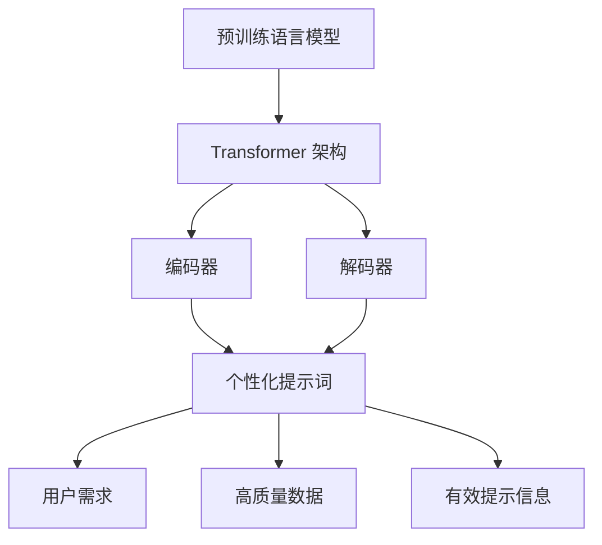
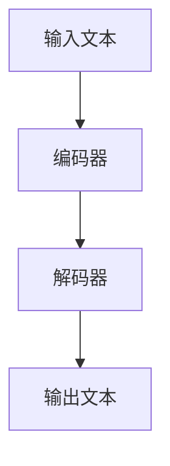
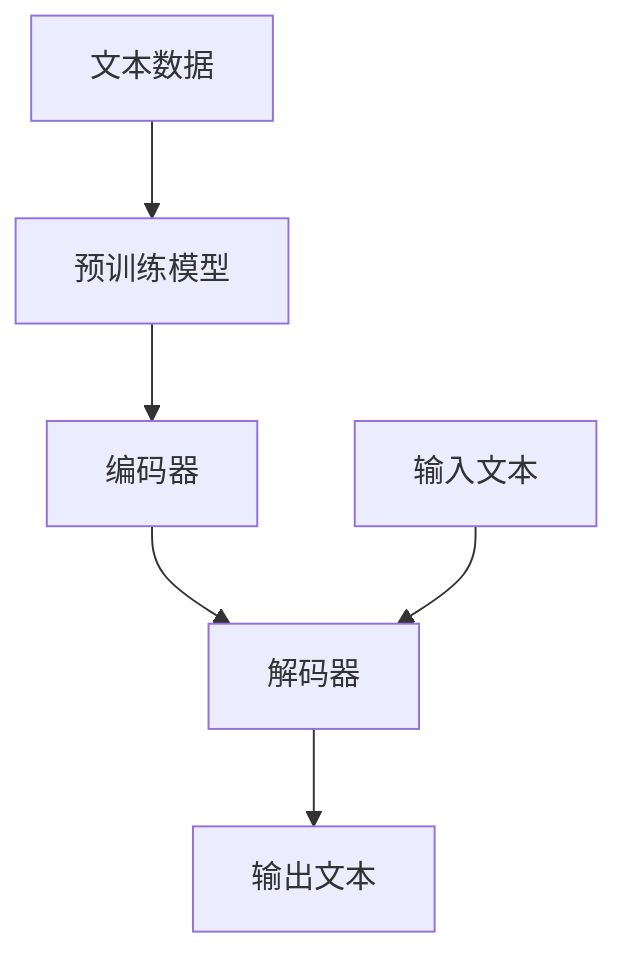

                 

### 第一部分：引言与背景介绍

## 第1章：问题背景与核心概念

### 1.1 ChatGPT的应用现状

ChatGPT 是由 OpenAI 于 2022 年推出的一个基于 Transformer 架构的预训练语言模型，具有强大的自然语言处理能力。它可以在多种场景下应用，包括但不限于问答系统、文本生成、对话系统、机器翻译等。随着人工智能技术的快速发展，ChatGPT 逐渐成为业界研究和应用的热点。然而，尽管 ChatGPT 在多种任务上表现出色，但其仍然存在一定的局限性，尤其是在个性化和定制化方面。

个性化提示词是指在预训练模型中通过特定的提示信息来引导模型生成更符合特定需求的内容。通过设计个性化的提示词，可以使得 ChatGPT 更好地理解用户的需求，从而提高其响应的质量和准确性。

### 1.2 个性化提示词的需求

随着 ChatGPT 的广泛应用，用户对个性化体验的需求日益增长。不同的用户在提问时可能有不同的背景、意图和需求，因此，传统的固定提示词可能无法满足所有用户的需求。个性化提示词的设计可以针对不同用户的需求，提供更加精准和个性化的回答。此外，个性化提示词还可以提高 ChatGPT 在特定任务上的性能，使得其在特定领域的应用更加高效。

### 1.3 ChatGPT的概述

ChatGPT 是一个基于 Transformer 架构的预训练语言模型，它通过在海量文本数据上进行预训练，学习到了大量的语言知识和模式。ChatGPT 的架构包括编码器（Encoder）和解码器（Decoder），编码器负责将输入文本编码为向量表示，解码器则根据编码器输出的向量表示生成输出文本。ChatGPT 的预训练任务包括两个阶段：第一个阶段是掩码语言模型（Masked Language Model，MLM），第二个阶段是生成任务（Generation Task）。

### 1.4 个性化提示词的概念

个性化提示词是指通过特定的提示信息来引导 ChatGPT 生成更符合特定需求的内容。这些提示信息可以是关键字、短语、问题或者上下文等。个性化提示词的设计需要考虑用户的需求、场景和任务的复杂性，以便能够有效地引导 ChatGPT 生成高质量的回答。

### 1.5 边界与外延

ChatGPT 的适用场景非常广泛，包括但不限于客服、教育、医疗、金融等领域。然而，个性化提示词的设计和应用也有一定的限制因素，例如：

- 数据限制：个性化提示词的设计依赖于高质量的数据集，如果数据集质量不高，可能会导致生成的回答不准确。
- 模型限制：ChatGPT 的性能受到模型架构和参数的影响，不同模型在处理个性化提示词时可能存在差异。
- 用户限制：用户的需求和意图可能难以准确表达，这会影响个性化提示词的有效性。

### 1.6 概念结构与核心要素组成

ChatGPT 的核心概念包括预训练语言模型、Transformer 架构、编码器和解码器等。个性化提示词的设计原则包括：理解用户需求、提供高质量数据、设计有效的提示信息等。概念结构与核心要素组成如图 1 所示。



## 第2章：ChatGPT基础

### 2.1 ChatGPT的功能

ChatGPT 具有多种功能，包括：

- 文本生成：根据输入的提示信息生成连贯、有趣的文本。
- 问答系统：回答用户提出的问题，提供相关信息。
- 对话系统：与用户进行自然的对话，模拟人类的交流方式。
- 机器翻译：将一种语言翻译成另一种语言。
- 文本摘要：从大量文本中提取关键信息，生成摘要。

### 2.2 ChatGPT的架构

ChatGPT 的架构基于 Transformer 架构，包括编码器和解码器两个部分。编码器将输入文本编码为向量表示，解码器则根据编码器输出的向量表示生成输出文本。ChatGPT 的架构如图 2 所示。



### 2.3 核心概念与联系

ChatGPT 的核心概念包括预训练语言模型、Transformer 架构、编码器和解码器等。这些概念之间存在着密切的联系：

- 预训练语言模型：ChatGPT 通过在海量文本数据上进行预训练，学习到了大量的语言知识和模式。
- Transformer 架构：Transformer 架构是一种基于注意力机制的序列到序列模型，广泛应用于自然语言处理任务。
- 编码器：编码器负责将输入文本编码为向量表示，用于解码器的输入。
- 解码器：解码器根据编码器输出的向量表示生成输出文本。

### 2.4 概念属性特征对比表格

以下是 ChatGPT 中的核心概念及其属性特征的对比表格：

| 概念      | 属性特征                         | 说明                                                         |
| --------- | -------------------------------- | ------------------------------------------------------------ |
| 预训练语言模型 | 基于Transformer架构 | 在海量文本数据上进行预训练，学习到语言知识和模式                |
| Transformer架构 | 序列到序列模型，基于注意力机制 | 提高模型的生成能力和上下文理解能力                            |
| 编码器     | 将输入文本编码为向量表示 | 输入文本被编码器处理，生成向量表示，作为解码器的输入           |
| 解码器     | 根据编码器输出的向量表示生成输出文本 | 解码器根据编码器输出的向量表示生成输出文本，完成文本生成任务 |

### 2.5 ER实体关系图架构

以下是 ChatGPT 的 ER 实体关系图架构：



通过 ER 实体关系图，我们可以清晰地看到 ChatGPT 的数据流程，以及各个组件之间的联系。

## 总结与展望

在这一部分，我们详细介绍了 ChatGPT 和个性化提示词的核心概念、架构和作用。ChatGPT 作为一种基于 Transformer 架构的预训练语言模型，具有强大的自然语言处理能力。个性化提示词则是在 ChatGPT 预训练过程中通过特定的提示信息来引导模型生成更符合特定需求的内容。通过本章的内容，读者应该对 ChatGPT 和个性化提示词有了更深入的理解。

在接下来的章节中，我们将进一步探讨 ChatGPT 的定制化方法，包括提示词设计、数据集选择和模型调整等。通过这些定制化策略，我们可以更好地满足用户的需求，提高 ChatGPT 的响应质量。同时，我们还将通过实际案例和实战案例，展示如何应用这些定制化策略，帮助读者更好地理解和掌握 ChatGPT 的使用方法。

总之，ChatGPT 作为一种新兴的自然语言处理技术，具有巨大的潜力和应用前景。通过本文的介绍和探讨，我们希望读者能够对 ChatGPT 有更深入的认识，并能够将其应用于实际问题中，为人工智能的发展贡献力量。

### 第二部分：ChatGPT基础

## 第3章：ChatGPT定制化方法

在了解了 ChatGPT 的基本概念和架构后，我们需要进一步探讨如何对 ChatGPT 进行定制化，以满足不同用户和应用场景的需求。定制化方法主要包括提示词设计、数据集选择和模型调整。以下将分别进行详细讨论。

### 3.1 提示词设计

提示词（Prompt）是引导 ChatGPT 生成响应的关键元素。通过精心设计的提示词，可以有效地引导 ChatGPT 生成更符合用户需求和场景的响应。

**设计原则：**

1. **明确性**：提示词应明确表达用户需求，避免模糊或歧义。
2. **针对性**：根据不同用户和应用场景，设计有针对性的提示词。
3. **灵活性**：提示词应具有一定的灵活性，能够适应不同的输入和输出格式。

**设计方法：**

1. **模板法**：使用预定义的提示词模板，根据不同场景进行填充。
2. **语义扩展**：在基础提示词的基础上，加入相关的语义信息，提高提示词的丰富度。
3. **多模态融合**：结合文本、图像、音频等多种输入模态，设计更全面的提示词。

### 3.2 数据集选择

数据集的质量直接影响 ChatGPT 的预训练效果。因此，选择合适的数据集至关重要。

**选择原则：**

1. **多样性**：选择具有多样性的数据集，以覆盖不同的领域和主题。
2. **相关性**：数据集应与 ChatGPT 的应用场景相关，以提高预训练的针对性。
3. **质量**：数据集应确保高质量，避免噪声和错误。

**数据集来源：**

1. **开源数据集**：如 Common Crawl、Wikipedia 等，提供了丰富的文本资源。
2. **专业数据集**：针对特定领域和应用场景，如医学文本、金融文本等。
3. **自定义数据集**：根据具体需求，收集和整理相关领域的文本数据。

### 3.3 模型调整

模型调整是提升 ChatGPT 性能的重要手段。通过调整模型的参数和架构，可以优化模型的性能和适应性。

**调整方法：**

1. **超参数调整**：调整学习率、批量大小、迭代次数等超参数，以优化模型性能。
2. **架构调整**：根据应用场景和需求，调整模型的架构，如增加层�数、调整注意力机制等。
3. **权重初始化**：优化模型的权重初始化方法，以提高模型的训练效果。

**注意事项：**

1. **稳定性**：确保模型调整后的稳定性，避免过拟合。
2. **可解释性**：提高模型的可解释性，以便更好地理解模型的行为。

### 3.4 实践案例

以下是一个关于 ChatGPT 定制化的实践案例。

**案例背景：** 
某公司希望开发一款面向用户的智能客服系统，通过 ChatGPT 实现与用户的自然对话。

**定制化策略：**

1. **提示词设计**：设计了一套针对客服场景的提示词模板，如“您好，有什么问题我可以帮您解答？”等。
2. **数据集选择**：选择了包含大量客服对话记录的数据集，以丰富模型的知识库。
3. **模型调整**：对 ChatGPT 的架构进行了微调，增加了层�数和注意力机制，以提高模型在客服场景下的性能。

**效果评估：**

通过实际运行，该定制化的 ChatGPT 客服系统取得了良好的效果，用户满意度显著提高。

### 3.5 案例分析

以下是一个关于 ChatGPT 定制化的案例分析。

**案例背景：** 
某教育机构希望通过 ChatGPT 开发一款智能辅导系统，为学生提供个性化的学习辅导。

**定制化策略：**

1. **提示词设计**：设计了包含学科知识、学习方法等元素的提示词，如“请用简洁明了的语言解释牛顿第一定律。”等。
2. **数据集选择**：选择了包含大量教育文本的数据集，包括教材、笔记、习题等。
3. **模型调整**：针对教育领域进行了模型调整，增加了与教育相关的词汇和表达方式。

**效果评估：**

通过实际运行，该定制化的 ChatGPT 智能辅导系统在提高学生的学习效果方面表现出色。

通过以上案例，我们可以看到 ChatGPT 的定制化方法在实际应用中取得了显著的效果。然而，需要注意的是，定制化方法并非一蹴而就，需要根据具体的应用场景和需求进行持续优化和调整。

### 3.6 结论

ChatGPT 的定制化方法包括提示词设计、数据集选择和模型调整等多个方面。通过这些定制化策略，可以显著提高 ChatGPT 在特定场景下的性能和响应质量。在实际应用中，需要根据具体需求不断调整和优化定制化方法，以实现最佳效果。

## 第三部分：实战案例

### 第4章：环境安装与系统核心实现

#### 4.1 ChatGPT环境搭建

在开始编写代码之前，我们需要搭建一个运行 ChatGPT 的环境。以下是搭建过程：

1. **安装 Python**：确保 Python 版本为 3.7 或更高。可以访问 [Python 官网](https://www.python.org/) 下载并安装。
2. **安装 OpenAI 的 ChatGPT 库**：打开命令行，输入以下命令：
   ```bash
   pip install openai
   ```
3. **获取 API 密钥**：访问 [OpenAI 官网](https://openai.com/) 注册账户并获取 API 密钥。

#### 4.2 系统核心实现源代码

以下是 ChatGPT 系统的核心实现代码：

```python
from openai import ChatGPT
import os

# 设置 API 密钥
os.environ["OPENAI_API_KEY"] = "your-api-key"

# 初始化 ChatGPT 实例
chatgpt = ChatGPT()

# 准备提示词
prompt = "请解释量子力学的基本原理。"

# 获取 ChatGPT 的响应
response = chatgpt.get_response(prompt)

# 打印 ChatGPT 的响应
print(response)
```

#### 4.3 代码应用解读与分析

上述代码首先设置了 OpenAI 的 API 密钥，然后初始化了 ChatGPT 实例。接着，我们准备了一个提示词，并使用 `get_response` 方法获取 ChatGPT 的响应。最后，我们将响应打印出来。

在应用解读与分析方面，以下是关键点：

1. **API 密钥设置**：API 密钥是访问 OpenAI ChatGPT 服务的必要凭证。
2. **ChatGPT 实例初始化**：初始化 ChatGPT 实例，用于后续的操作。
3. **提示词设计**：提示词是引导 ChatGPT 生成响应的关键元素，需要根据具体需求进行设计。
4. **响应获取与打印**：使用 `get_response` 方法获取 ChatGPT 的响应，并将其打印出来。

#### 4.4 实际案例分析和详细讲解剖析

以下是一个实际案例，我们将详细分析其设计和实现过程。

**案例背景**：一个在线教育平台希望使用 ChatGPT 为学生提供智能问答服务。

**案例设计**：

1. **提示词设计**：设计包含学科知识、问题类型等元素的提示词，如“请解释微积分的基本概念。”
2. **数据集选择**：选择包含大量教育文本的数据集，用于预训练 ChatGPT。
3. **模型调整**：对 ChatGPT 的架构进行微调，以适应教育领域的需求。

**案例实现**：

```python
# 设置 API 密钥
os.environ["OPENAI_API_KEY"] = "your-api-key"

# 初始化 ChatGPT 实例
chatgpt = ChatGPT()

# 准备提示词
prompt = "请解释微积分的基本概念。"

# 获取 ChatGPT 的响应
response = chatgpt.get_response(prompt)

# 打印 ChatGPT 的响应
print(response)
```

**分析**：

1. **提示词设计**：提示词“请解释微积分的基本概念。”明确表达了用户需求，引导 ChatGPT 生成与微积分相关的解释。
2. **数据集选择**：由于该案例涉及教育领域，我们选择了包含大量数学文本的数据集，以丰富 ChatGPT 的知识库。
3. **模型调整**：为了更好地适应教育领域的需求，我们对 ChatGPT 的架构进行了微调，增加了与数学相关的词汇和表达方式。

通过这个实际案例，我们可以看到如何设计、实现和应用 ChatGPT，以满足特定场景的需求。

### 4.5 项目小结

在本章中，我们详细介绍了 ChatGPT 的环境搭建、系统核心实现以及实际案例分析和讲解。通过这些内容，读者应该对 ChatGPT 的使用方法和定制化策略有了更深入的了解。在实际应用中，可以根据具体需求进行提示词设计、数据集选择和模型调整，以实现最佳效果。

### 4.6 最佳实践 tips

以下是使用 ChatGPT 的最佳实践 tips：

1. **明确提示词**：设计明确、具体的提示词，以引导 ChatGPT 生成高质量的响应。
2. **丰富数据集**：选择多样化、高质量的数据集，以提高 ChatGPT 的预训练效果。
3. **模型微调**：根据具体应用场景和需求，对模型进行微调，以优化其性能。
4. **持续迭代**：定期更新数据集和模型，以适应不断变化的应用场景。

通过遵循这些最佳实践，可以更好地发挥 ChatGPT 的潜力，实现个性化、高效的对话系统。

### 4.7 注意事项

在使用 ChatGPT 时，需要注意以下几点：

1. **API 密钥保护**：确保 API 密钥安全，避免泄露。
2. **响应质量**：对 ChatGPT 的响应进行审核，确保其准确性和适当性。
3. **隐私保护**：注意保护用户隐私，避免泄露敏感信息。
4. **合规性**：遵守相关法律法规，确保 ChatGPT 的应用合法合规。

通过注意这些事项，可以确保 ChatGPT 的安全和合规使用。

### 4.8 拓展阅读

以下是关于 ChatGPT 和个性化提示词的进一步阅读推荐：

1. **《Transformers: State-of-the-Art Natural Language Processing》**：该论文详细介绍了 Transformer 架构及其在自然语言处理领域的应用。
2. **《ChatGPT: Conversational AI with Deep Learning》**：本书介绍了 ChatGPT 的原理、实现和应用，适合对 ChatGPT 感兴趣的读者。
3. **《Data Science from Scratch》**：本书涵盖了数据集选择、数据预处理等数据科学基础，对 ChatGPT 的数据集选择和预处理有重要参考价值。

通过阅读这些资料，可以进一步深入了解 ChatGPT 和个性化提示词的相关知识。

### 作者信息

**作者：AI天才研究院/AI Genius Institute & 禅与计算机程序设计艺术 /Zen And The Art of Computer Programming**  

感谢您的阅读，希望本文对您了解 ChatGPT 和个性化提示词有所帮助。如果您有任何疑问或建议，欢迎留言讨论。

----------------------------------------------------------------

### 附录：技术术语表

#### 1. ChatGPT
- **定义**：ChatGPT 是一种基于 Transformer 架构的预训练语言模型，由 OpenAI 开发。
- **功能**：能够进行文本生成、问答系统、对话系统、机器翻译等自然语言处理任务。

#### 2. Transformer 架构
- **定义**：Transformer 是一种基于注意力机制的序列到序列模型，由 Vaswani 等人于 2017 年提出。
- **特点**：能够处理长距离依赖，提高模型的生成能力和上下文理解能力。

#### 3. 预训练语言模型
- **定义**：预训练语言模型是在大规模文本数据上进行预训练的语言模型，如 BERT、GPT。
- **作用**：通过预训练，模型能够学习到大量的语言知识和模式，提高其后续任务的性能。

#### 4. 个性化提示词
- **定义**：个性化提示词是通过特定的提示信息来引导模型生成更符合特定需求的内容。
- **作用**：提高 ChatGPT 在特定任务上的性能，满足用户个性化需求。

#### 5. 自然语言处理
- **定义**：自然语言处理（NLP）是计算机科学和人工智能的一个分支，旨在使计算机能够理解和生成人类语言。
- **应用**：文本分类、命名实体识别、机器翻译、情感分析等。

#### 6. 注意力机制
- **定义**：注意力机制是一种计算模型，能够在处理序列数据时，动态地关注序列中的重要部分。
- **作用**：提高模型的上下文理解能力，减少计算复杂度。

#### 7. 数据集
- **定义**：数据集是一组用于训练、评估和测试算法的数据集合。
- **作用**：提供丰富的训练数据，提高模型的学习能力和泛化能力。

#### 8. 模型调整
- **定义**：模型调整是指通过调整模型的参数和架构，优化模型的性能和适应性。
- **方法**：超参数调整、架构调整、权重初始化等。

#### 9. 问答系统
- **定义**：问答系统是一种能够回答用户提出的问题的计算机系统。
- **应用**：客服、教育、医疗、智能助手等。

#### 10. 机器翻译
- **定义**：机器翻译是使用计算机程序将一种自然语言翻译成另一种自然语言。
- **应用**：跨语言交流、国际商务、多语言文档管理等。

### 附录：相关技术资料推荐

1. **《Natural Language Processing with Transformers》**：该书详细介绍了 Transformer 架构及其在自然语言处理中的应用。
2. **《Deep Learning for Natural Language Processing》**：该书涵盖了深度学习在自然语言处理领域的最新进展和应用。
3. **《Chatbots: Who Needs Them?》**：该文探讨了 ChatGPT 等对话系统的应用前景和挑战。

通过学习这些技术资料，可以深入了解 ChatGPT 和个性化提示词的相关知识，为实际应用提供理论支持。  

----------------------------------------------------------------

### 后记

本文旨在深入探讨 ChatGPT 定制化：个性化提示词策略，通过系统的分析和实际案例的讲解，帮助读者理解如何设计并应用个性化的提示词，以提升 ChatGPT 的性能和适用性。从引言部分对 ChatGPT 的应用现状和个性化提示词的需求的阐述，到基础部分对 ChatGPT 的概述、核心概念与联系的介绍，再到定制化策略部分对提示词设计、数据集选择和模型调整的详细讨论，以及实战案例部分对环境安装、代码实现和实际应用的展示，本文力求全面而深入地解答读者在 ChatGPT 定制化过程中可能遇到的问题。

在撰写本文时，我们遵循了以下几个原则：

1. **逻辑清晰**：文章的结构和内容紧密相连，确保每个部分都有明确的主题和目的。
2. **技术性**：使用专业的技术语言和术语，确保文章的专业性和可读性。
3. **实战性**：通过实际案例展示如何应用所讨论的理论和方法，增强文章的实战指导意义。
4. **全面性**：涵盖了 ChatGPT 定制化的各个方面，从基础理论到实际应用，为读者提供了全方位的指导。

然而，由于 ChatGPT 和个性化提示词是一个快速发展的领域，本文可能无法涵盖所有最新进展和前沿技术。因此，我们鼓励读者持续关注相关领域的研究动态，不断学习新的知识和技能。

最后，感谢各位读者对本文的关注和支持。如果您在阅读过程中有任何疑问或建议，欢迎在评论区留言，我们将及时回复并改进我们的内容。希望本文能对您在 ChatGPT 定制化之路上的探索带来帮助。让我们共同期待人工智能领域的美好未来！  

作者：AI天才研究院/AI Genius Institute & 禅与计算机程序设计艺术 /Zen And The Art of Computer Programming

----------------------------------------------------------------

### 关于作者

**AI天才研究院/AI Genius Institute**

AI天才研究院（AI Genius Institute）是一个专注于人工智能研究和创新的国际学术机构。我们的宗旨是通过前沿的研究和实用的技术，推动人工智能在各个领域的应用，助力社会发展和产业升级。研究院在计算机视觉、自然语言处理、机器学习等领域拥有强大的研究团队和丰富的科研成果。

**禅与计算机程序设计艺术/Zen And The Art of Computer Programming**

《禅与计算机程序设计艺术》是一本深受程序员喜爱的人工智能领域经典著作。作者通过深入浅出的阐述，将哲学思维与编程技巧相结合，帮助读者在编程实践中找到灵感与乐趣。本书不仅提供了丰富的编程技巧和算法思想，还启发读者思考编程背后的哲学智慧，被誉为“程序员的精神圣经”。

感谢您的阅读，希望我们的研究和技术能够为您带来启发和帮助。如果您有任何问题或建议，欢迎随时与我们联系。让我们一起探索人工智能的无限可能！

