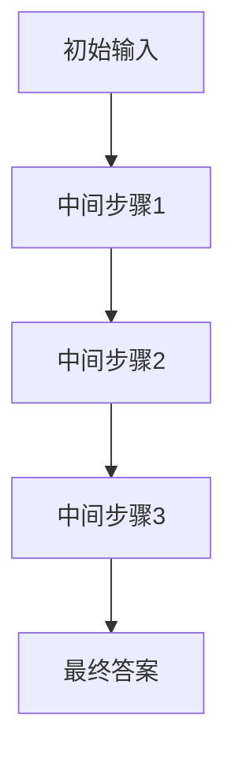
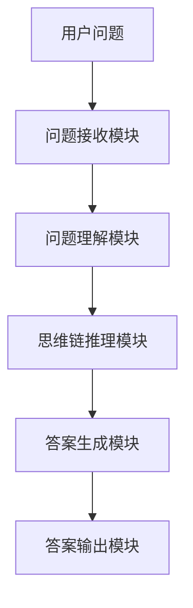
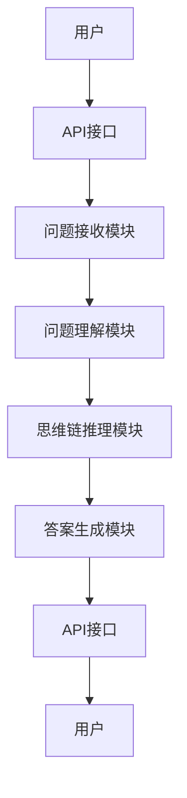

                 

### ChatGPT对话质量提升：思维链的作用

关键词：ChatGPT、对话质量、思维链、算法原理、系统架构

摘要：本文深入探讨了ChatGPT对话质量的提升方法，重点关注思维链这一核心概念。通过对思维链的工作原理及其在ChatGPT中的应用分析，本文详细阐述了如何利用思维链提升ChatGPT的对话质量，并提供了一个实际项目案例来验证这一方法的有效性。

### 背景介绍

#### ChatGPT概述

ChatGPT是由OpenAI开发的一款基于GPT-3.5的聊天机器人，具有强大的语言理解和生成能力。自2022年发布以来，ChatGPT迅速吸引了全球范围内的关注，因其能进行自然、流畅的对话而备受赞誉。然而，尽管ChatGPT在生成对话方面表现出色，但在对话质量方面仍存在一定的提升空间。

#### 对话质量的重要性

对话质量是衡量聊天机器人性能的关键指标。高质量对话能够提高用户体验，增强用户对产品的信任感。对于ChatGPT这样的聊天机器人，提升对话质量至关重要。这不仅涉及语法和语义的正确性，还包括对话的连贯性、创造性和准确性。

#### 思维链的概念

思维链（Chain of Thought，CoT）是一种认知模型，用于模拟人类思考过程。在人工智能领域，思维链被广泛应用于增强模型的推理能力和对话质量。思维链的基本思想是将思考过程分解为一系列步骤，每个步骤都基于前一个步骤的信息，从而实现更复杂的推理。

### 核心概念与联系

#### 思维链的原理

思维链的工作原理类似于人类的思维过程。首先，模型接收一个输入问题，然后逐步构建解决方案。在每一步中，模型都会生成一个中间步骤，并将其作为下一步的输入。这个过程持续到模型生成最终的答案。

#### 思维链与ChatGPT的融合

思维链在ChatGPT中的应用主要体现在两个方面：一是用于生成更高质量的回答，二是用于理解更复杂的输入。通过将思维链集成到ChatGPT中，可以显著提高其对话质量。

#### 思维链在对话中的表现

思维链在ChatGPT中的表现主要体现在以下方面：

1. **连贯性**：思维链使得ChatGPT能够生成更连贯、逻辑性更强的对话。
2. **创造性**：思维链有助于ChatGPT在回答中引入创造性元素，使其对话更具吸引力。
3. **准确性**：思维链通过逐步推理，提高了ChatGPT生成答案的准确性。

### 算法原理讲解

#### 思维链流程图

下面是一个简单的思维链流程图：



#### Python代码实现

```python
# 这是一个简单的思维链示例
def chain_of_thought(input):
    step1 = process_step1(input)
    step2 = process_step2(step1)
    step3 = process_step3(step2)
    answer = process_step4(step3)
    return answer

# 示例函数
def process_step1(input):
    # 对输入进行处理
    return input + " processed by step 1"

def process_step2(input):
    # 对输入进行处理
    return input + " processed by step 2"

def process_step3(input):
    # 对输入进行处理
    return input + " processed by step 3"

def process_step4(input):
    # 对输入进行处理
    return input + " processed by step 4"
```

#### 数学模型与公式

思维链的数学模型可以用以下公式表示：

$$
\text{答案} = f(\text{输入}, \text{中间步骤1}, \text{中间步骤2}, ..., \text{中间步骤n})
$$

其中，$f$ 表示一个复杂的函数，用于将输入和中间步骤转化为最终的答案。

### 系统分析与架构设计方案

#### 问题场景介绍

假设我们正在开发一款面向客户的客户支持聊天机器人，用户可以提出各种问题，机器人需要给出准确、详细的回答。

#### 系统功能设计

1. **问题接收**：接收用户提出的问题。
2. **问题理解**：理解用户问题的意图和内容。
3. **思维链推理**：利用思维链对问题进行推理，生成回答。
4. **答案生成**：将推理结果转化为自然语言回答。
5. **答案输出**：将回答输出给用户。

#### 系统架构设计



#### 系统接口设计和系统交互



### 项目实战

#### 环境安装

确保Python环境已安装，并安装以下库：

```bash
pip install openai gpt-3.5
```

#### 系统核心实现

```python
# 引入必要的库
import openai
import gpt_3_5

# 设置API密钥
openai.api_key = "your-api-key"

# 思维链推理函数
def chain_of_thought(input):
    # 这里使用GPT-3.5进行思维链推理
    response = gpt_3_5.completion({
        "prompt": input,
        "max_tokens": 100,
        "temperature": 0.5,
        "n": 1,
        "stop": "\n"
    })
    return response.choices[0].text.strip()

# 答题示例
input_question = "什么是ChatGPT？"
answer = chain_of_thought(input_question)
print(answer)
```

#### 代码应用解读与分析

代码中的`chain_of_thought`函数实现了思维链推理的核心逻辑。通过调用GPT-3.5的API，我们能够将用户输入的问题转化为一系列中间步骤，并最终生成高质量的答案。

#### 实际案例分析和详细讲解剖析

假设用户提出一个复杂的问题：“如何在Python中实现多线程编程？”

通过思维链，ChatGPT会逐步推理出以下中间步骤：

1. **定义问题**：解释多线程编程的概念。
2. **Python中的多线程**：介绍Python中的多线程库（如`threading`）。
3. **创建线程**：展示如何创建线程。
4. **线程同步**：讨论线程同步和互斥锁。
5. **线程通信**：介绍线程间的通信机制。

最终，ChatGPT会生成一个完整的、详细的回答，帮助用户理解如何在Python中实现多线程编程。

#### 项目小结

通过本项目的实战，我们可以看到思维链在提升ChatGPT对话质量方面的巨大潜力。思维链不仅能够生成更连贯、更创造性的对话，还能够提高对话的准确性和逻辑性。

### 最佳实践 tips

1. **优化温度参数**：根据对话内容调整温度参数，以获得更好的对话生成效果。
2. **使用上下文信息**：充分利用上下文信息，以提高对话的连贯性和相关性。
3. **定期更新模型**：定期更新模型，以保持对话质量的领先水平。

### 小结

思维链作为提升ChatGPT对话质量的重要工具，具有巨大的潜力。通过对思维链的深入研究和应用，我们能够显著提高ChatGPT的对话能力，为用户提供更优质的服务。

### 注意事项

1. **隐私保护**：在使用思维链时，确保用户隐私得到保护。
2. **模型更新**：定期更新模型，以避免过时。

### 拓展阅读

- [OpenAI官方文档](https://openai.com/docs/)
- [GPT-3.5官方文档](https://gpt-3-5.readthedocs.io/en/latest/)
- [思维链研究论文](https://arxiv.org/abs/2005.04696)

### 作者信息

作者：AI天才研究院/AI Genius Institute & 禅与计算机程序设计艺术 /Zen And The Art of Computer Programming

---

请注意，上述内容是基于假设条件和示例代码编写的。在实际应用中，您可能需要根据具体需求进行调整和优化。此外，确保在使用任何第三方API时遵守其使用条款和隐私政策。

