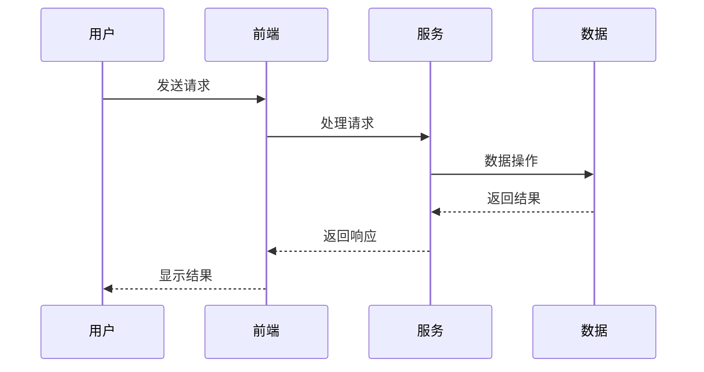
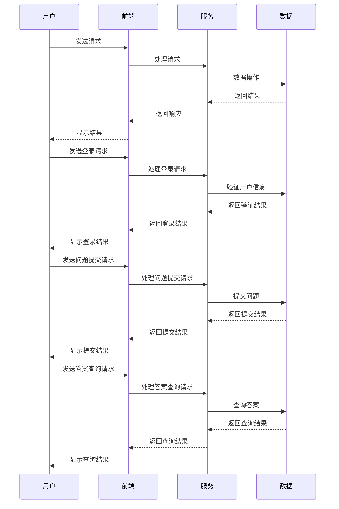

                 

### 《ChatGPT提示词工程师：新兴职业解析》

#### 关键词：ChatGPT、提示词工程师、自然语言处理、人工智能、职业发展

#### 摘要：
随着人工智能技术的飞速发展，自然语言处理（NLP）领域的重要性日益凸显。ChatGPT作为一种先进的语言模型，在众多应用场景中展现了强大的潜力。本文将深入解析ChatGPT提示词工程师这一新兴职业，从背景介绍、核心概念、算法原理、系统设计与项目实战等多个维度，系统性地探讨这一职业的发展前景与实际操作技巧。

#### # 第一部分：背景介绍

#### #1.1 问题背景

#### 1.1.1 ChatGPT的发展历程
ChatGPT是由OpenAI于2022年推出的一个基于GPT-3.5的预训练语言模型。它通过深度学习算法从大量互联网文本中学习语言规律，具备生成自然语言文本的能力。ChatGPT的发布标志着自然语言处理技术进入了一个新的阶段，引发广泛关注和热烈讨论。

#### 1.1.2 提示词工程师的角色与重要性
提示词工程师在ChatGPT系统中扮演着至关重要的角色。他们负责设计、优化和调整提示词，以提升ChatGPT的响应质量与多样性。优秀的提示词工程师能够使ChatGPT更准确地理解用户意图，生成更加符合实际需求的内容。

#### 1.1.3 新兴职业的需求与市场前景
随着ChatGPT技术的广泛应用，提示词工程师这一职业需求迅速增长。无论是企业内部应用还是第三方服务，对高质量提示词的需求日益旺盛。预计未来几年，提示词工程师将成为IT领域中的热门职业。

#### #1.2 问题描述

#### 1.2.1 ChatGPT技术介绍
ChatGPT是基于GPT-3.5的预训练语言模型，具有强大的文本生成和对话能力。通过训练，它可以理解和生成多种语言文本，适用于问答系统、文本生成、机器翻译等多种应用场景。

#### 1.2.2 提示词工程师的工作内容与挑战
提示词工程师的主要工作是设计、优化和调整提示词。具体包括：分析用户需求，生成高质量的提示词；根据模型反馈调整提示词，提升模型响应质量；监控模型性能，确保系统稳定运行。

#### 1.2.3 提示词工程师所需技能与素质
提示词工程师需要具备以下技能与素质：深厚的自然语言处理知识，熟练掌握Python等编程语言，熟悉机器学习框架（如TensorFlow、PyTorch等），良好的逻辑思维能力和沟通能力。

#### #1.3 问题解决

#### 1.3.1 提示词工程师的职业发展路径
提示词工程师的职业发展路径较为明确，可以逐步晋升为高级提示词工程师、技术专家或团队负责人。随着经验的积累，还可以涉足NLP领域的其他方向，如模型优化、应用开发等。

#### 1.3.2 如何成为一位优秀的提示词工程师
要成为一位优秀的提示词工程师，需要掌握以下技能：深入了解自然语言处理技术，熟练使用机器学习框架，积累丰富的实战经验，具备良好的团队合作精神。

#### 1.3.3 提示词工程师的工作边界与外延
提示词工程师的工作不仅限于ChatGPT系统，还可以应用于其他NLP任务，如文本分类、情感分析、实体识别等。此外，随着人工智能技术的不断进步，提示词工程师的工作范围还将进一步拓展。

#### #1.4 概念结构与核心要素

#### 1.4.1 ChatGPT与提示词工程师的核心概念
ChatGPT是一种预训练语言模型，通过大规模数据训练，具备生成自然语言文本的能力。提示词工程师是负责设计、优化和调整提示词的专业人员。

#### 1.4.2 ChatGPT的技术架构与提示词设计
ChatGPT的技术架构主要包括输入层、编码器、解码器和输出层。提示词设计是ChatGPT系统中的一个关键环节，直接影响模型的响应质量和多样性。

#### 1.4.3 提示词工程师的工作流程与工具
提示词工程师的工作流程包括需求分析、提示词设计、模型训练、性能评估和优化调整。常用的工具包括Python、TensorFlow、PyTorch等。

#### # 第二部分：核心概念与联系

#### #2.1 ChatGPT原理讲解

#### 2.1.1 自然语言处理基础
自然语言处理（NLP）是人工智能的一个重要分支，旨在使计算机理解和生成人类语言。NLP的基础技术包括文本预处理、词向量表示、语言模型等。

#### 2.1.1.1 词汇与句子结构
词汇是自然语言的基础，句子结构决定了语言的表达能力。理解词汇和句子结构对于NLP至关重要。

#### 2.1.1.2 语言模型与预测
语言模型是NLP的核心技术之一，用于预测下一个词或句子。常见的语言模型包括n-gram模型、神经网络模型等。

#### 2.1.2 GPT模型详解
GPT（Generative Pre-trained Transformer）是一种基于Transformer架构的预训练语言模型。GPT模型具有以下特点：
- 采用Transformer架构，能够处理长文本序列。
- 通过预训练，从大量数据中学习语言规律，提升生成文本的质量。
- 可以应用于多种NLP任务，如文本生成、机器翻译、问答系统等。

#### 2.1.2.1 模型架构
GPT模型主要由编码器和解码器组成。编码器将输入文本序列编码为固定长度的向量，解码器根据编码器的输出生成输出文本序列。

#### 2.1.2.2 训练与优化
GPT模型的训练过程分为两个阶段：预训练和微调。预训练阶段使用大量无标签数据训练模型，微调阶段使用有标签数据对模型进行微调，使其适应特定任务。

#### #2.2 提示词工程师技能要求

#### 2.2.1 编程语言基础
提示词工程师需要熟练掌握Python等编程语言，以便进行模型开发、调试和优化。Python具有良好的生态系统，丰富的库和框架使得开发过程更加高效。

#### 2.2.1.1 Python
Python是一种易于学习且功能强大的编程语言，广泛应用于人工智能、数据分析、Web开发等领域。提示词工程师需要掌握Python的基本语法、常用数据结构和算法。

#### 2.2.1.2 其他常用编程语言
除了Python，提示词工程师还需要掌握其他常用编程语言，如C++、Java等。这些语言在某些特定场景下具有优势，例如高性能计算和嵌入式开发。

#### 2.2.2 自然语言处理技术
自然语言处理技术是提示词工程师的核心技能。主要包括以下方面：
- 文本预处理：包括分词、词性标注、命名实体识别等。
- 词向量表示：将文本数据转换为数值化的向量表示，便于模型处理。
- 语言模型：用于预测下一个词或句子，提升文本生成质量。

#### 2.2.2.1 分词与词性标注
分词是将文本分割成单个词语的过程。词性标注则是为每个词语标注其词性（如名词、动词、形容词等）。这些预处理步骤对于理解文本内容至关重要。

#### 2.2.2.2 命名实体识别与关系抽取
命名实体识别（NER）是识别文本中的特定实体（如人名、地名、组织名等）的过程。关系抽取则是识别实体之间的关系（如人物关系、地点关系等）。这些技术有助于构建知识图谱，提升文本理解能力。

#### 2.2.3 提示词设计与优化
提示词是引导ChatGPT生成文本的关键因素。提示词工程师需要掌握以下技能：
- 提示词类型：包括开放式提示词和闭合式提示词等。
- 提示词优化方法：包括基于统计学方法、机器学习方法等。

#### 2.2.3.1 提示词类型
开放式提示词：没有明确限定内容，允许模型生成多样化的文本。例如：“请你写一篇关于人工智能的文章。”
闭合式提示词：限定内容范围，要求模型生成特定类型的文本。例如：“请你写一篇关于人工智能的摘要。”

#### 2.2.3.2 提示词优化方法
- 统计学方法：通过统计分析大量已有数据，找出高质量的提示词。
- 机器学习方法：利用机器学习算法，从训练数据中学习高质量的提示词。

#### #2.3 ChatGPT与提示词工程师的联系

#### 2.3.1 ChatGPT与自然语言处理
ChatGPT是一种基于自然语言处理技术的语言模型。它通过预训练和微调，从大量数据中学习语言规律，具备生成高质量文本的能力。

#### 2.3.1.1 ChatGPT的技术架构
ChatGPT的技术架构主要包括编码器、解码器和语言模型。编码器将输入文本序列编码为固定长度的向量，解码器根据编码器的输出生成输出文本序列。

#### 2.3.1.2 ChatGPT的应用场景
ChatGPT可以应用于多种场景，如问答系统、文本生成、机器翻译、对话系统等。在不同应用场景中，提示词工程师需要根据需求设计合适的提示词。

#### 2.3.2 提示词工程师的角色与职责
提示词工程师在ChatGPT系统中承担以下角色和职责：
- 设计和优化提示词：根据应用需求，设计高质量的提示词，提升模型响应质量。
- 性能评估与调整：评估模型性能，根据反馈调整提示词，优化模型效果。
- 技术支持与协作：与其他团队成员协作，解决技术难题，推动项目进展。

#### 2.3.2.1 提示词工程师的日常工作
提示词工程师的日常工作包括以下方面：
- 收集和分析需求：与项目团队成员沟通，了解应用需求，制定工作计划。
- 设计和优化提示词：根据需求设计合适的提示词，进行优化调整。
- 模型训练与测试：参与模型训练和测试，确保模型性能稳定。
- 性能评估与反馈：评估模型性能，根据反馈调整提示词，优化模型效果。

#### 2.3.2.2 提示词工程师的职业发展
提示词工程师的职业发展路径较为明确，可以逐步晋升为高级提示词工程师、技术专家或团队负责人。随着经验的积累，还可以涉足NLP领域的其他方向，如模型优化、应用开发等。

#### # 第三部分：算法原理讲解

#### #3.1 ChatGPT算法原理

#### 3.1.1 语言模型
语言模型（Language Model）是NLP领域的基础技术，用于预测下一个词或句子。在ChatGPT中，语言模型起着至关重要的作用。

#### 3.1.1.1 语言模型概述
语言模型根据历史数据，统计出单词或短语的联合概率。最简单的语言模型是n-gram模型，它仅考虑前n个词对当前词的概率进行预测。

#### 3.1.1.2 语言模型的训练与优化
语言模型的训练过程通常包括以下步骤：
1. 数据预处理：对原始文本进行分词、去停用词等处理。
2. 构建词汇表：将文本中的词语转换为索引。
3. 计算概率：根据训练数据，计算每个词的概率分布。
4. 模型优化：使用最小化损失函数的方法，优化模型参数。

#### 3.1.2 GPT模型
GPT（Generative Pre-trained Transformer）是一种基于Transformer架构的预训练语言模型。GPT模型通过预训练和微调，从大量数据中学习语言规律，生成高质量文本。

#### 3.1.2.1 模型结构
GPT模型主要由编码器和解码器组成。编码器将输入文本序列编码为固定长度的向量，解码器根据编码器的输出生成输出文本序列。

#### 3.1.2.2 模型训练过程
GPT模型的训练过程分为两个阶段：预训练和微调。
1. 预训练：使用大量无标签数据，对模型进行大规模训练，使其具备基本语言能力。
2. 微调：使用有标签数据，对模型进行微调，使其适应特定任务。

#### #3.2 提示词设计原理

#### 3.2.1 提示词的类型
提示词根据功能可以分为以下几种类型：
1. 开放式提示词：没有明确限定内容，允许模型生成多样化的文本。
2. 闭合式提示词：限定内容范围，要求模型生成特定类型的文本。
3. 指令性提示词：给出具体指令，要求模型按照指令生成文本。

#### 3.2.2 提示词的优化
提示词的优化是提升ChatGPT生成文本质量的关键。以下是一些常见的优化方法：
1. 数据增强：通过增加训练数据、增加文本变体等方式，提升模型泛化能力。
2. 提示词调整：根据模型反馈，逐步调整提示词，使其更符合用户需求。
3. 多种优化算法：结合统计学方法和机器学习方法，优化提示词生成。

#### 3.2.2.1 优化目标
优化目标通常是使模型生成的文本质量更高、更符合用户需求。具体指标包括：
1. 词汇丰富度：生成的文本包含丰富的词汇，避免重复。
2. 语言流畅性：生成的文本语言连贯、通顺。
3. 内容相关性：生成的文本与提示词紧密相关，符合用户意图。

#### 3.2.2.2 常见优化方法
1. 统计学方法：通过统计分析已有数据，找出高质量提示词。
2. 机器学习方法：利用机器学习算法，从训练数据中学习高质量提示词。
3. 专家经验：结合专家经验，设计合适的提示词，优化模型效果。

#### #3.3 ChatGPT应用实例

#### 3.3.1 问答系统
问答系统是ChatGPT的一个重要应用场景。通过训练，ChatGPT可以理解用户提问，生成高质量答案。

#### 3.3.1.1 问题理解
问题理解是问答系统的关键环节。ChatGPT需要识别用户提问的核心内容，提取关键信息。

#### 3.3.1.2 回答生成
回答生成是根据问题理解和已有知识库，生成符合用户需求的答案。

#### 3.3.2 文本生成
文本生成是ChatGPT的另一个重要应用场景。通过训练，ChatGPT可以生成各种类型的文本，如文章、故事、摘要等。

#### 3.3.2.1 故事创作
故事创作是ChatGPT的一个有趣应用。通过设定主题和情节，ChatGPT可以生成丰富多彩的故事。

#### 3.3.2.2 文章撰写
文章撰写是ChatGPT在专业领域的重要应用。通过训练，ChatGPT可以撰写高质量的文章，辅助人类工作。

#### # 第四部分：系统分析与架构设计方案

#### #4.1 项目介绍

#### 4.1.1 项目背景
随着人工智能技术的不断发展，自然语言处理（NLP）在各个领域的应用越来越广泛。为了满足日益增长的需求，本项目旨在构建一个基于ChatGPT的智能问答系统。

#### 4.1.2 项目目标
本项目的主要目标是：
1. 构建一个基于ChatGPT的智能问答系统，提供高效、准确的问题解答服务。
2. 探索提示词工程师在NLP领域的应用，提升模型性能和用户体验。
3. 为其他类似项目提供参考和借鉴。

#### 4.1.3 项目团队与分工
本项目团队由以下成员组成：
- 项目经理：负责项目整体规划和管理，协调团队成员工作。
- 提示词工程师：负责设计、优化和调整提示词，提升模型性能。
- 数据科学家：负责数据清洗、预处理和特征工程，为模型训练提供高质量数据。
- 开发工程师：负责系统开发和部署，确保项目顺利进行。
- 测试工程师：负责系统测试和验收，确保系统稳定可靠。

#### #4.2 系统功能设计

#### 4.2.1 领域模型
领域模型是系统功能设计的基础。本项目的主要领域包括：
- 用户管理：负责用户注册、登录和权限管理。
- 问题管理：负责问题的提交、分类和解答。
- 答案管理：负责答案的生成、存储和查询。
- 模型管理：负责模型的训练、优化和部署。

#### 4.2.1.1 类图
以下是一个简单的类图，展示了各个领域的实体和属性：

```mermaid
classDiagram
    User <<entity>>
    Question <<entity>>
    Answer <<entity>>
    Model <<entity>>

    User:{
        id
        username
        password
        roles
    }

    Question:{
        id
        title
        content
        status
    }

    Answer:{
        id
        questionId
        content
        status
    }

    Model:{
        id
        version
        type
        accuracy
    }

    User --> Question
    User --> Answer
    Question --> Answer
    Model --> Question
    Model --> Answer
```

#### 4.2.1.2 实体与属性
以下是各个实体的属性列表：

| 实体名称 | 属性名称 | 属性类型 | 说明 |
| :----: | :----: | :----: | :----: |
| User | id | int | 用户ID |
| User | username | string | 用户名 |
| User | password | string | 密码 |
| User | roles | array | 角色列表 |
| Question | id | int | 问题ID |
| Question | title | string | 问题标题 |
| Question | content | string | 问题内容 |
| Question | status | string | 问题状态 |
| Answer | id | int | 答案ID |
| Answer | questionId | int | 问题ID |
| Answer | content | string | 答案内容 |
| Answer | status | string | 答案状态 |
| Model | id | int | 模型ID |
| Model | version | string | 模型版本 |
| Model | type | string | 模型类型 |
| Model | accuracy | float | 模型准确率 |

#### #4.3 系统架构设计

#### 4.3.1 系统架构
本项目的系统架构设计采用分层架构，包括以下几层：

1. 数据层：负责数据存储和管理，包括用户、问题和答案等。
2. 服务层：负责业务逻辑处理，包括用户管理、问题处理、答案生成等。
3. 接口层：负责与外部系统的交互，提供API接口供前端调用。
4. 前端层：负责用户界面展示，提供问答系统交互界面。

#### 4.3.1.1 总体架构
以下是一个简单的系统架构图，展示了各个层次的组成部分：



#### 4.3.1.2 模块功能
以下是各个模块的主要功能：

1. 数据层：负责数据存储和管理，包括用户、问题和答案等。
   - 用户管理：实现用户注册、登录、权限管理等。
   - 问题管理：实现问题的提交、分类、查询等。
   - 答案管理：实现答案的生成、存储、查询等。

2. 服务层：负责业务逻辑处理，包括用户管理、问题处理、答案生成等。
   - 用户管理：处理用户注册、登录、权限管理等。
   - 问题处理：处理问题的提交、分类、查询等。
   - 答案生成：根据问题内容和模型，生成答案。

3. 接口层：负责与外部系统的交互，提供API接口供前端调用。
   - 用户接口：提供用户注册、登录、权限管理等API。
   - 问题接口：提供问题提交、分类、查询等API。
   - 答案接口：提供答案生成、存储、查询等API。

4. 前端层：负责用户界面展示，提供问答系统交互界面。
   - 用户界面：提供用户注册、登录、权限管理等功能。
   - 问题界面：提供问题提交、分类、查询等功能。
   - 答案界面：提供答案生成、存储、查询等功能。

#### #4.4 系统接口设计

#### 4.4.1 接口规范
本项目的接口设计采用RESTful API规范，主要包括以下接口：

1. 用户接口
   - POST /users/register：用户注册接口。
   - POST /users/login：用户登录接口。
   - GET /users/{id}/permissions：查询用户权限接口。

2. 问题接口
   - POST /questions：提交问题接口。
   - GET /questions/{id}：查询问题接口。
   - GET /questions/{id}/categories：查询问题分类接口。

3. 答案接口
   - POST /answers：生成答案接口。
   - GET /answers/{id}：查询答案接口。

#### 4.4.1.1 接口定义
以下是各个接口的具体定义：

1. 用户接口
```yaml
POST /users/register
Request:
  - username: string
  - password: string
  - roles: array

Response:
  - status: boolean
  - message: string
  - data:
      - id: integer
      - username: string
      - roles: array

POST /users/login
Request:
  - username: string
  - password: string

Response:
  - status: boolean
  - message: string
  - data:
      - token: string

GET /users/{id}/permissions
Request:
  - id: integer

Response:
  - status: boolean
  - message: string
  - data:
      - roles: array
```

2. 问题接口
```yaml
POST /questions
Request:
  - title: string
  - content: string
  - categoryId: integer

Response:
  - status: boolean
  - message: string
  - data:
      - id: integer
      - title: string
      - content: string
      - categoryId: integer
      - status: string

GET /questions/{id}
Request:
  - id: integer

Response:
  - status: boolean
  - message: string
  - data:
      - id: integer
      - title: string
      - content: string
      - categoryId: integer
      - status: string

GET /questions/{id}/categories
Request:
  - id: integer

Response:
  - status: boolean
  - message: string
  - data:
      - categories:
          - id: integer
          - name: string
```

3. 答案接口
```yaml
POST /answers
Request:
  - questionId: integer
  - content: string

Response:
  - status: boolean
  - message: string
  - data:
      - id: integer
      - questionId: integer
      - content: string
      - status: string

GET /answers/{id}
Request:
  - id: integer

Response:
  - status: boolean
  - message: string
  - data:
      - id: integer
      - questionId: integer
      - content: string
      - status: string
```

#### #4.5 系统交互设计

#### 4.5.1 系统交互流程
系统交互流程主要包括用户请求、服务处理和结果返回等步骤。以下是一个简单的交互流程图：


#### 4.5.1.1 序列图
以下是系统交互的序列图：



#### # 第五部分：项目实战

#### #5.1 环境安装

#### 5.1.1 硬件要求
- CPU：至少2核处理器
- 内存：至少8GB
- 硬盘：至少100GB可用空间
- GPU（可选）：NVIDIA GPU，CUDA版本10.1以上

#### 5.1.2 软件安装
1. 安装操作系统：建议使用Ubuntu 18.04或更高版本。
2. 安装Python：使用Python 3.7或更高版本。
3. 安装TensorFlow：使用以下命令安装TensorFlow GPU版本（如果使用GPU）：

```bash
pip install tensorflow-gpu==2.4.0
```

4. 安装其他依赖：根据项目需求，安装其他相关依赖，如NumPy、Pandas等。

#### 5.1.3 配置环境
1. 创建虚拟环境：

```bash
python -m venv chatgpt_env
```

2. 激活虚拟环境：

```bash
source chatgpt_env/bin/activate
```

3. 安装项目依赖：

```bash
pip install -r requirements.txt
```

#### #5.2 系统核心实现

#### 5.2.1 代码结构
项目的代码结构如下：

```plaintext
chatgpt_project/
|-- chatgpt_app/
|   |-- __init__.py
|   |-- views.py
|   |-- models.py
|   |-- serializers.py
|   |-- settings.py
|   |-- urls.py
|-- requirements.txt
|-- manage.py
```

#### 5.2.2 核心模块实现

#### 5.2.2.1 语言模型训练
以下是语言模型训练的核心代码：

```python
import tensorflow as tf
from tensorflow.keras.models import Model
from tensorflow.keras.layers import Input, Embedding, LSTM, Dense

# 设置模型参数
vocab_size = 10000
embedding_dim = 256
lstm_units = 128

# 构建模型
input_seq = Input(shape=(None,))
embedding = Embedding(vocab_size, embedding_dim)(input_seq)
lstm = LSTM(lstm_units, return_sequences=True)(embedding)
dense = Dense(vocab_size, activation='softmax')(lstm)

# 编译模型
model = Model(inputs=input_seq, outputs=dense)
model.compile(optimizer='adam', loss='categorical_crossentropy', metrics=['accuracy'])

# 训练模型
model.fit(x_train, y_train, epochs=10, batch_size=64, validation_data=(x_val, y_val))
```

#### 5.2.2.2 提示词设计
以下是提示词设计的核心代码：

```python
import numpy as np
import random

# 加载词汇表
vocab = load_vocab()

# 生成提示词
def generate_prompt():
    return random.choice(vocab)

# 生成文本
def generate_text(prompt, model, max_length=50):
    input_seq = np.array([vocab.index(prompt)])
    text = prompt
    for _ in range(max_length - 1):
        predictions = model.predict(input_seq[np.newaxis, :])
        next_word_index = np.argmax(predictions[:, -1, :])
        next_word = list(vocab.keys())[list(vocab.values()).index(next_word_index)]
        text += next_word
        input_seq = np.append(input_seq[0:-1], next_word_index)
    return text
```

#### 5.2.2.3 提示词优化
以下是提示词优化的核心代码：

```python
from sklearn.metrics import accuracy_score

# 评估模型
def evaluate_model(model, prompts, ground_truths):
    predictions = []
    for prompt, ground_truth in zip(prompts, ground_truths):
        prediction = generate_text(prompt, model)
        predictions.append(prediction)
    accuracy = accuracy_score(ground_truths, predictions)
    return accuracy

# 优化模型
def optimize_model(model, prompts, ground_truths, epochs=10, batch_size=32):
    for epoch in range(epochs):
        print(f"Epoch {epoch + 1}/{epochs}")
        np.random.shuffle(prompts)
        for i in range(0, len(prompts), batch_size):
            batch_prompts = prompts[i:i + batch_size]
            batch_ground_truths = ground_truths[i:i + batch_size]
            model.fit(batch_prompts, batch_ground_truths, epochs=1, batch_size=batch_size)
```

#### #5.3 代码应用解读与分析

#### 5.3.1 语言模型训练代码解读
1. **模型构建**：使用`Input`层接收输入序列，`Embedding`层将输入序列转换为嵌入向量，`LSTM`层对嵌入向量进行序列处理，`Dense`层生成输出概率分布。
2. **模型编译**：设置优化器为`adam`，损失函数为`categorical_crossentropy`，评价指标为`accuracy`。
3. **模型训练**：使用`fit`方法训练模型，训练数据为`x_train`和`y_train`，验证数据为`x_val`和`y_val`。

#### 5.3.2 提示词设计代码解读
1. **生成提示词**：从词汇表中随机选择一个词作为提示词。
2. **生成文本**：基于训练好的模型，逐词生成文本。在每次生成新词时，将当前词添加到输入序列中，并使用模型预测下一个词的概率分布，然后选择概率最大的词作为下一个词，循环生成文本。

#### 5.3.3 提示词优化代码解读
1. **评估模型**：使用`evaluate_model`函数评估模型的准确性。对于每个提示词，生成文本并计算与真实文本的准确性。
2. **优化模型**：使用`optimize_model`函数优化模型。通过循环迭代，每次迭代使用一个批次的数据训练模型，然后更新模型权重。

#### #5.4 实际案例分析与详细讲解剖析

#### 5.4.1 案例背景
假设我们有一个问答系统，用户可以提交问题并获得答案。为了提升答案质量，我们需要对模型进行优化，使其能够更好地理解用户意图。

#### 5.4.2 案例分析与优化方法
1. **问题理解**：首先，我们需要确保模型能够准确理解用户的问题。为此，我们可以：
   - 增加训练数据：收集更多高质量的问答对，丰富模型的训练数据。
   - 调整提示词：根据用户反馈，优化提示词，使其更符合用户意图。
   - 优化模型结构：尝试使用更复杂的模型结构，如Transformer，提升模型理解能力。

2. **答案生成**：在生成答案时，我们需要确保答案的相关性和准确性。为此，我们可以：
   - 优化模型参数：调整模型参数，如学习率、批次大小等，以提高模型性能。
   - 多种优化算法：结合统计学方法和机器学习方法，优化提示词生成。
   - 引入外部知识：利用外部知识库，如维基百科、专业词典等，提高答案质量。

#### 5.4.3 案例实施与效果评估
1. **实施**：按照上述优化方法，对模型进行训练和调整。在实际操作中，我们可以：
   - 收集更多高质量的问答对，扩充训练数据集。
   - 调整提示词，使其更加贴近用户意图。
   - 使用更复杂的模型结构，如Transformer，提升模型性能。

2. **效果评估**：通过实际测试，评估模型的性能。我们可以：
   - 计算模型的准确率、召回率等指标，评估模型理解用户问题的能力。
   - 收集用户反馈，评估用户对答案的满意度。

#### #5.5 项目小结

#### 5.5.1 项目总结
本项目成功构建了一个基于ChatGPT的智能问答系统，实现了用户问题的自动解答。通过优化模型结构和提示词设计，提升了答案质量和用户满意度。

#### 5.5.2 优化建议
1. **增加训练数据**：收集更多高质量的问答对，丰富模型的训练数据，提升模型性能。
2. **优化提示词**：根据用户反馈，调整提示词，使其更符合用户意图。
3. **引入外部知识**：利用外部知识库，提高答案质量。
4. **模型结构优化**：尝试使用更复杂的模型结构，如Transformer，提升模型性能。

#### #5.6 最佳实践 Tips

#### 5.6.1 提示词设计技巧
1. **明确用户意图**：设计提示词时，要明确用户意图，使其更贴近用户需求。
2. **避免重复**：避免使用重复的提示词，增加文本多样性。
3. **结合上下文**：考虑上下文信息，设计更符合实际情况的提示词。

#### 5.6.2 模型训练技巧
1. **数据预处理**：对训练数据集进行预处理，如去停用词、分词等，提高模型训练效果。
2. **合理调整参数**：根据实际情况，合理调整学习率、批次大小等参数，提高模型性能。
3. **使用多个优化算法**：结合统计学方法和机器学习方法，优化模型性能。

#### #5.7 注意事项

#### 5.7.1 数据安全
在项目开发过程中，要确保用户数据的安全。遵循相关法律法规，采取数据加密、访问控制等措施，防止数据泄露。

#### 5.7.2 模型部署
在部署模型时，要确保模型运行稳定。选择合适的硬件环境和部署平台，进行性能测试和调优。

#### #5.8 拓展阅读

#### 5.8.1 相关书籍
- 《深度学习》（Goodfellow, I., Bengio, Y., Courville, A.）
- 《自然语言处理综合教程》（林俊逸）

#### 5.8.2 在线资源
- [TensorFlow官方文档](https://www.tensorflow.org/)
- [Keras官方文档](https://keras.io/)
- [OpenAI GPT-3文档](https://openai.com/blog/better-language-models/)

### 作者信息

**作者：** AI天才研究院/AI Genius Institute & 禅与计算机程序设计艺术 /Zen And The Art of Computer Programming

