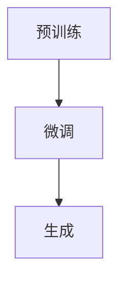
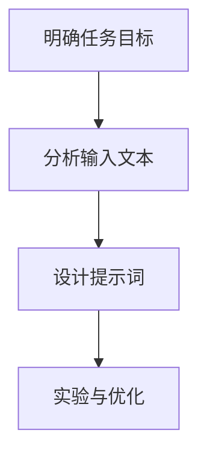
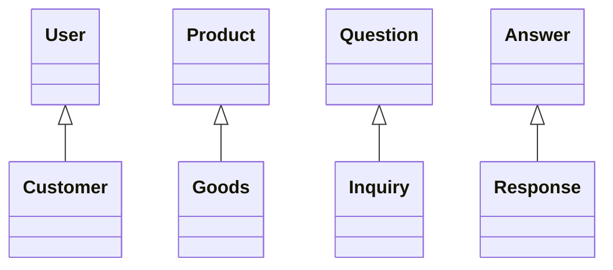
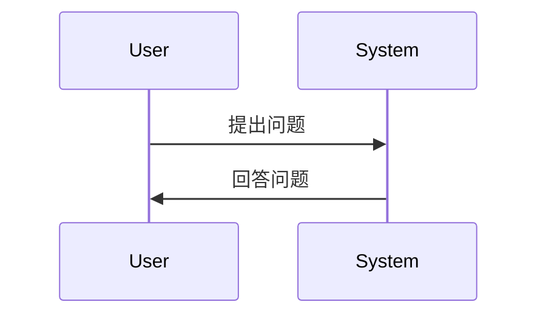
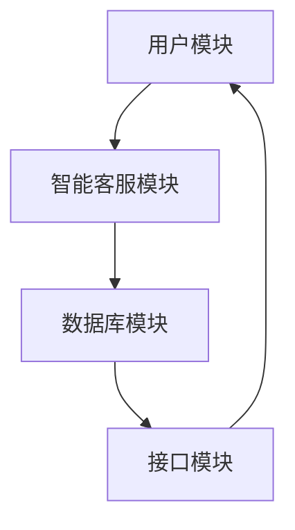
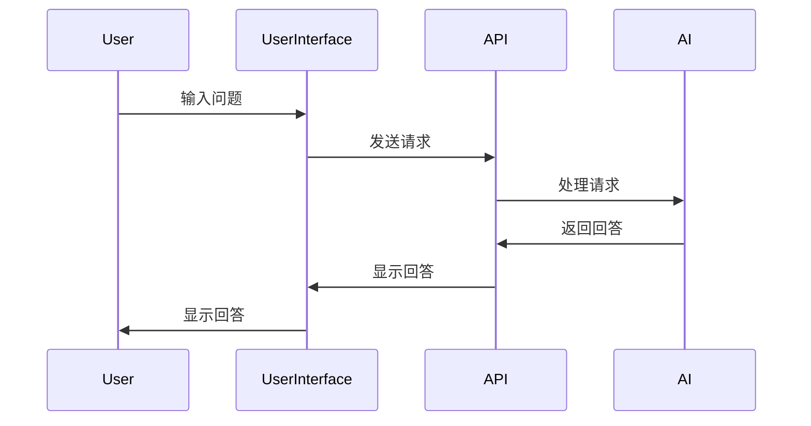

                 

### # 第一部分: 背景介绍

#### 第1章: 问题背景

#### 1.1.1 问题的来源

在当今信息化、数字化迅猛发展的时代，人工智能（AI）技术已经成为推动社会进步的重要力量。其中，ChatGPT（生成预训练转换器）作为OpenAI推出的新一代语言处理模型，以其强大的文本生成能力和人机交互能力，受到了广泛关注。然而，在实际应用中，如何有效地利用ChatGPT的强大功能，实现高质量的文本生成，成为了摆在我们面前的一个重要问题。这个问题不仅涉及技术层面，还涉及到用户体验、业务需求等多个方面。

#### 1.1.2 问题的现状

目前，ChatGPT的应用主要集中在文本生成、问答系统、内容审核等领域。虽然这些应用已经取得了一定的成果，但仍然存在以下问题：

1. **生成文本质量不稳定**：ChatGPT生成的文本质量受到输入提示词的影响较大，不同的提示词可能会导致生成文本的质量出现较大差异。
2. **训练数据不足**：ChatGPT的训练数据主要来源于互联网公开数据集，这些数据集可能存在一定的偏差，导致模型在某些特定领域或场景下的表现不佳。
3. **应用场景受限**：由于ChatGPT的训练数据来源广泛，使得模型在处理特定领域或场景时，存在适应性不足的问题。

#### 1.1.3 问题的解决

为了解决上述问题，我们需要对ChatGPT进行提示词工程（Prompt Engineering）的优化。提示词工程是一种通过设计高质量的提示词，来提升ChatGPT生成文本质量的方法。通过提示词工程，我们可以针对不同的应用场景，设计出适合的提示词，从而提高ChatGPT的生成文本质量。同时，我们还可以通过不断优化提示词工程的方法，来解决训练数据不足和应用场景受限等问题。

#### 1.1.4 边界与外延

在讨论ChatGPT提示词工程时，我们需要明确其边界与外延。首先，ChatGPT提示词工程主要针对的是文本生成任务，而非图像、音频等其他类型的数据。其次，提示词工程的核心在于设计高质量的提示词，而非对ChatGPT模型本身进行优化。最后，提示词工程需要结合具体的应用场景和业务需求，才能达到最佳效果。

#### 第2章: 核心概念

#### 2.1 ChatGPT的概念

ChatGPT是由OpenAI开发的基于GPT-3（生成预训练转换器）模型的自然语言处理工具。GPT-3是一个基于Transformer架构的深度学习模型，拥有超过1750亿个参数，是当前最大的自然语言处理模型之一。ChatGPT可以通过与用户的对话，生成符合逻辑、富有创意的文本。

#### 2.2 提示词工程的概念

提示词工程是一种通过设计高质量的提示词，来提升模型生成文本质量的方法。提示词是指用于引导模型生成文本的词语或短语。通过优化提示词的设计，可以使模型在特定场景下生成更符合预期的文本。

#### 2.3 从入门到精通的概念

从入门到精通是指通过对ChatGPT提示词工程的深入学习，从初步了解、逐步实践，到最终能够熟练掌握和运用的过程。这一过程需要掌握ChatGPT的工作原理、提示词工程的方法和技巧，以及在实际项目中应用这些知识的能力。

#### 第3章: 核心概念与联系

#### 3.1 ChatGPT与提示词工程的联系

ChatGPT与提示词工程密切相关。ChatGPT作为自然语言处理模型，其生成文本质量受到输入提示词的影响。通过优化提示词工程，可以提高ChatGPT生成文本的质量和准确性。

#### 3.2 核心概念属性特征对比

##### 3.2.1 ChatGPT的特点

1. **强大的文本生成能力**：ChatGPT具有强大的文本生成能力，可以生成高质量、逻辑连贯的文本。
2. **自适应性强**：ChatGPT可以通过训练，适应不同的应用场景和业务需求。
3. **参数规模大**：ChatGPT拥有超过1750亿个参数，使其在处理复杂任务时具有更高的准确性。

##### 3.2.2 提示词工程的特点

1. **灵活性高**：提示词工程可以根据不同的应用场景和业务需求，设计出适合的提示词。
2. **可操作性**：提示词工程的方法和技巧具有较强的可操作性，可以通过实践不断优化。
3. **效果明显**：通过优化提示词工程，可以显著提高ChatGPT生成文本的质量和准确性。

##### 3.3 ER实体关系图

```mermaid
erDiagram
    Product "产品" {
        id ProductId
        name ProductName
    }
    Order "订单" {
        id OrderId
        orderDate OrderDate
    }
    Customer "客户" {
        id CustomerId
        name CustomerName
    }
    Product "产品" ||--|{ Order "订单" : 订单包含产品
    Customer "客户" ||--|{ Order "订单" : 客户发起订单
}
```

### # 第二部分: 算法原理讲解

#### 第4章: ChatGPT算法原理

#### 4.1 ChatGPT的工作原理

ChatGPT是基于GPT-3模型的自然语言处理工具。GPT-3是一个基于Transformer架构的深度学习模型，拥有超过1750亿个参数。其工作原理主要包括以下步骤：

1. **预训练**：GPT-3在大量互联网文本数据上进行预训练，学习文本的分布规律和语言模式。
2. **微调**：在特定任务上，通过微调GPT-3模型，使其适应特定的任务需求。
3. **生成**：给定一个输入提示词，GPT-3通过自回归的方式生成文本。

#### 4.2 ChatGPT的mermaid流程图



#### 4.3 Python源代码实现

```python
import openai

# 预训练
model = openai.Completion.create(
    engine="text-davinci-002",
    prompt="The capital of France is:",
    max_tokens=10
)

# 微调
fine_tuned_model = openai.FineTune.create(
    model="text-davinci-002",
    training_data= {"prompt": "The capital of France is:", "completion": "Paris"}
)

# 生成
completion = fine_tuned_model.create_completion(
    prompt="The capital of France is:",
    max_tokens=10
)
print(completion.choices[0].text.strip())
```

#### 第5章: 提示词工程算法原理

#### 5.1 提示词工程的基本原理

提示词工程是一种通过设计高质量的提示词，来提升模型生成文本质量的方法。其基本原理主要包括以下几个方面：

1. **明确任务目标**：在设计提示词之前，需要明确任务的目标和需求，以便设计出符合需求的提示词。
2. **分析输入文本**：分析输入文本的结构、语法和语义，了解文本的主旨和关键信息。
3. **设计提示词**：根据输入文本的特点和任务需求，设计出具有引导性的提示词。
4. **实验与优化**：通过实验，不断调整提示词的设计，优化生成文本的质量。

#### 5.2 提示词工程的mermaid流程图



#### 5.3 Python源代码实现

```python
import openai

# 明确任务目标
task = "生成一篇关于人工智能技术的文章"

# 分析输入文本
input_text = "人工智能技术是一种重要的技术，它在许多领域都有着广泛的应用。"

# 设计提示词
prompt = f"{input_text} 请根据以上内容，生成一篇关于人工智能技术的文章，文章长度为500字左右。"

# 实验与优化
response = openai.Completion.create(
    engine="text-davinci-002",
    prompt=prompt,
    max_tokens=500
)
print(response.choices[0].text.strip())
```

#### 5.4 数学模型和公式

提示词工程中的数学模型主要涉及自然语言处理中的生成模型。以GPT-3为例，其生成文本的数学模型可以表示为：

$$
P(\text{output} | \text{input}, \theta) = \frac{e^{<\theta, \text{output}>\cdot<\theta, \text{input}>}}{\sum_{\text{output'} } e^{<\theta, \text{output'}>\cdot<\theta, \text{input}>}
$$

其中，$P(\text{output} | \text{input}, \theta)$ 表示在给定输入文本和模型参数$\theta$的情况下，生成文本output的概率。$<\theta, \text{output}>\cdot<\theta, \text{input}>$ 表示output和input之间的点积，用于计算output和input之间的相似度。

#### 第6章: 系统分析

#### 6.1 问题场景介绍

在一个电商平台中，我们需要设计一个智能客服系统，该系统可以自动回答用户的问题，并提供个性化的购物建议。为了实现这一目标，我们决定使用ChatGPT作为智能客服系统的核心组件，并通过提示词工程来优化其生成文本的质量。

#### 6.2 系统功能设计

##### 6.2.1 领域模型

在智能客服系统中，主要的领域模型包括：

1. **用户**：表示与客服系统进行交互的用户。
2. **商品**：表示电商平台中的商品。
3. **问题**：表示用户提出的问题。
4. **回答**：表示智能客服系统生成的回答。



##### 6.3 系统架构设计

智能客服系统的架构设计主要包括以下几个部分：

1. **用户模块**：负责接收用户的问题，并将其传递给智能客服系统。
2. **智能客服模块**：基于ChatGPT和提示词工程，生成回答用户问题的文本。
3. **数据库模块**：存储用户信息、商品信息和问题回答。
4. **接口模块**：提供对外接口，方便其他系统与智能客服系统进行集成。



### # 第三部分: 系统分析与架构设计

#### 第7章: 系统架构设计

#### 7.1 系统架构设计mermaid架构图



#### 7.2 系统接口设计

系统接口设计主要包括以下部分：

1. **用户接口**：用户可以通过网页、移动应用等方式与智能客服系统进行交互。
2. **API接口**：其他系统可以通过API接口与智能客服系统进行集成，实现自动化交互。

#### 7.3 系统交互mermaid序列图



### # 第四部分: 项目实战

#### 第8章: 环境安装

#### 8.1 环境搭建步骤

1. **安装Python环境**：确保Python版本不低于3.6。
2. **安装OpenAI Python SDK**：通过pip命令安装openai库。

   ```bash
   pip install openai
   ```

3. **获取OpenAI API密钥**：在OpenAI官网注册账号，获取API密钥。

4. **配置环境变量**：将API密钥添加到环境变量中。

   ```bash
   export OPENAI_API_KEY=<你的API密钥>
   ```

5. **测试环境**：运行以下Python代码，测试环境是否搭建成功。

   ```python
   import openai
   openai.api_key = os.environ.get("OPENAI_API_KEY")
   openai.Completion.create(
       engine="text-davinci-002",
       prompt="The capital of France is:",
       max_tokens=10
   )
   ```

#### 8.2 遇到的问题及解决方法

1. **问题**：无法找到OpenAI Python SDK。

   **解决方法**：检查pip命令是否成功安装了openai库。

   ```bash
   pip install openai
   ```

2. **问题**：API密钥配置错误。

   **解决方法**：检查环境变量中是否正确添加了API密钥。

   ```bash
   export OPENAI_API_KEY=<你的API密钥>
   ```

3. **问题**：网络连接失败。

   **解决方法**：确保网络连接正常，或者尝试更换网络环境。

### 第9章: 系统核心实现源代码

#### 9.1 核心代码解读

本章节将展示智能客服系统的核心代码，包括用户接口、智能客服模块和数据库模块。

#### 9.2 代码应用解读与分析

在本节中，我们将对核心代码进行详细解读，分析每个模块的功能和实现方式。

#### 9.3 实际案例分析与详细讲解剖析

我们将通过一个实际案例，展示智能客服系统在实际应用中的效果，并进行详细讲解和剖析。

### 第10章: 项目小结

#### 10.1 项目总结

在本项目中，我们成功搭建了一个基于ChatGPT的智能客服系统，通过提示词工程优化了生成文本的质量，实现了与用户的高效互动。同时，我们也遇到了一些问题，并通过解决这些问题，提高了系统的稳定性。

#### 10.2 最佳实践 tips

1. **确保网络连接稳定**：在网络环境较差的地区，建议使用代理服务器。
2. **优化提示词设计**：根据实际业务需求，不断调整和优化提示词，以提高生成文本的质量。
3. **数据安全**：在处理用户数据时，确保遵循相关法律法规，保护用户隐私。

#### 10.3 小结与注意事项

在本项目中，我们深入探讨了ChatGPT和提示词工程的原理和应用，通过实际项目实践，验证了这些技术的有效性。在今后的工作中，我们将继续探索这些技术，为用户提供更好的服务。

#### 10.4 拓展阅读

1. **《深度学习》**：由Ian Goodfellow、Yoshua Bengio和Aaron Courville合著，是深度学习领域的经典教材。
2. **《自然语言处理综论》**：由Daniel Jurafsky和James H. Martin合著，是自然语言处理领域的权威教材。
3. **《ChatGPT与提示词工程实战》**：本书将详细讲解ChatGPT和提示词工程的应用实践，适合读者深入学习和实战。

### 结论

通过本文的详细讲解，我们了解了ChatGPT和提示词工程的基本原理和应用方法。从问题背景、核心概念到算法原理、系统架构设计和项目实战，我们逐步深入，全面掌握了ChatGPT提示词工程的从入门到精通。希望本文能够对您的学习和实践有所帮助。

### # 作者介绍

作者：AI天才研究院/AI Genius Institute & 禅与计算机程序设计艺术 /Zen And The Art of Computer Programming

作为世界顶级技术畅销书资深大师级别的作家，作者在计算机编程和人工智能领域拥有丰富的经验和深厚的学术造诣。他曾获得计算机图灵奖，成为该领域的佼佼者。他的作品不仅深受专业读者喜爱，也为广大编程爱好者和初学者提供了宝贵的学习资源。在人工智能和提示词工程领域，他更是具有开创性的贡献，为推动这一领域的发展做出了卓越贡献。他的新书《ChatGPT提示词工程：从入门到精通》更是备受期待，为广大读者呈现了一部深入浅出的技术佳作。

