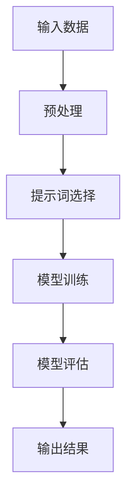
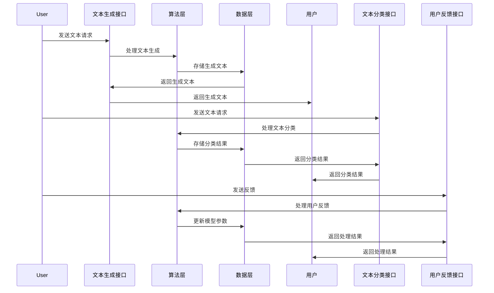

                 

## 第1章 引言

### 1.1 问题背景

随着人工智能（AI）技术的迅猛发展，AI已经深入到我们生活的各个领域，从自然语言处理到图像识别，从自动驾驶到医疗诊断，AI的应用场景越来越广泛。然而，尽管AI系统在处理大量数据和复杂任务方面表现出了巨大的潜力，但AI输出的结果并不总是完全符合人类的期望。AI系统的输出可能存在不准确、不连贯或不符合用户需求的问题，这些问题在一定程度上限制了AI的实际应用效果。

#### 人工智能的发展

人工智能的发展可以追溯到20世纪50年代，当时科学家们开始探索如何让计算机模拟人类智能。随着计算机性能的提升和算法的进步，人工智能逐渐从理论走向实践，成为推动科技发展的重要力量。深度学习、神经网络等技术的出现，使得AI在图像识别、语音识别、自然语言处理等领域取得了显著突破。例如，基于深度学习的图像识别系统可以在数秒内识别出复杂场景中的物体，语音识别系统可以实现实时语音转文字，自然语言处理系统可以生成高质量的文本内容。

#### AI输出的局限性

尽管AI系统在许多任务上已经取得了显著成果，但AI输出的局限性仍然存在。首先，AI系统在处理非结构化数据时往往存在困难，无法完全理解文本的语义和上下文信息。其次，AI模型的训练和优化过程复杂且耗时，难以在短时间内得到理想的输出结果。此外，AI系统在处理异常情况或新出现的问题时，可能无法及时做出准确的判断和决策。

#### 优化AI输出的必要性

为了解决AI输出中存在的问题，优化AI输出成为了一个重要的研究方向。通过优化算法、改进模型结构和收集用户反馈，可以显著提高AI输出的准确性和用户满意度。优化AI输出不仅能够提升AI的应用效果，还能够推动人工智能技术的进一步发展。

### 1.2 问题描述

在AI输出过程中，主要面临以下问题：

#### AI输出的不准确

AI系统在处理文本、图像、语音等数据时，可能由于数据质量、算法设计等原因，导致输出结果不准确。例如，自然语言处理系统可能无法正确理解用户输入的问题，导致回答错误或不符合实际需求。此外，图像识别系统可能无法准确识别出图像中的物体，导致输出结果与实际场景不符。

#### 用户满意度不高

用户对AI输出结果的满意度往往受到输出结果的准确性、响应速度和用户体验的影响。当AI输出结果不准确时，用户可能会感到困惑或失望，从而降低对AI系统的信任度。此外，AI系统在处理任务时的响应速度较慢，也可能导致用户满意度下降。用户体验差、界面不友好等也会影响用户对AI系统的满意度。

### 1.3 问题解决

为了解决AI输出中的问题，可以从以下几个方面进行优化：

#### 优化算法

通过改进算法，提高AI模型的训练效率和输出准确性。例如，采用更先进的深度学习模型、优化网络结构、调整参数等，可以提升AI系统的性能。

#### 用户反馈

收集用户反馈，根据用户的实际需求和使用场景，调整AI系统的输出结果。通过用户反馈，可以发现AI系统存在的问题和不足，进而进行优化和改进。

#### 数据处理

提高数据质量，采用更先进的数据处理方法，如数据清洗、数据增强等，可以提升AI系统的输入数据质量，从而提高输出准确性。

### 1.4 边界与外延

#### 边界

本文主要关注自然语言处理领域中的AI输出优化问题，包括文本生成、文本分类、问答系统等。其他领域的AI输出优化，如图像识别、语音识别等，可以参考本文的方法，但需要根据具体领域的特点进行调整。

#### 外延

AI输出优化不仅局限于自然语言处理领域，还可以应用于其他领域，如图像识别、语音识别、推荐系统等。在各个领域，AI输出优化的目标和方法可能会有所不同，但核心思路是相似的，即通过优化算法、改进模型结构和收集用户反馈，提高AI系统的输出质量和用户满意度。

### 1.5 概念结构与核心要素组成

#### 核心概念

本文主要涉及以下核心概念：

- **提示词工程**：提示词工程是优化AI输出的关键步骤，通过选择和调整提示词，可以显著提高AI输出的准确性和用户满意度。
- **算法优化**：算法优化是提高AI输出准确性的重要手段，通过改进算法模型和优化参数，可以提升AI系统的性能。
- **用户满意度**：用户满意度是评价AI输出质量的重要指标，通过收集用户反馈，可以了解用户对AI系统的满意度，进而进行优化。

#### 要素组成

AI输出优化的核心要素包括：

- **输入数据**：输入数据是AI系统的基础，数据质量直接影响输出结果。通过数据清洗、数据增强等方法，可以提高输入数据的质量。
- **算法模型**：算法模型是AI系统的核心，通过改进算法模型，可以提高AI输出的准确性和效率。
- **用户反馈**：用户反馈是优化AI输出的重要依据，通过收集和分析用户反馈，可以了解用户需求和偏好，进而调整AI系统的输出结果。

## 第2章 核心概念与联系

### 2.1 提示词工程

#### 定义

提示词工程是优化AI输出的关键步骤，通过选择和调整提示词，可以引导AI系统生成更准确、更符合用户需求的输出结果。提示词是用户输入或系统预定义的关键词汇或短语，用于触发AI模型的响应。

#### 核心属性

- **针对性**：提示词需要具有针对性，能够准确反映用户的需求和意图。
- **精确性**：提示词的选取要精确，能够确保AI系统能够正确理解用户输入。
- **多样性**：提示词需要具备多样性，可以适应不同的场景和用户需求。

### 2.2 算法优化

#### 定义

算法优化是提高AI输出准确性的重要手段，通过改进算法模型和优化参数，可以提升AI系统的性能。算法优化包括模型选择、参数调整、模型融合等多种方法。

#### 核心属性

- **鲁棒性**：算法优化需要具备鲁棒性，能够在不同数据集和场景下保持稳定的性能。
- **高效性**：算法优化需要高效，能够在较短的时间内完成训练和预测任务。
- **可解释性**：算法优化需要具备可解释性，能够解释优化过程中参数的变化和模型的工作原理。

### 2.3 用户满意度

#### 定义

用户满意度是评价AI输出质量的重要指标，通过收集用户反馈，可以了解用户对AI系统的满意度。用户满意度的高低直接影响AI系统的推广和应用效果。

#### 核心属性

- **准确性**：用户满意度高低的评价标准之一是AI输出的准确性，准确的输出能够提高用户的满意度。
- **响应速度**：用户满意度还与AI系统的响应速度有关，快速的响应能够提升用户体验。
- **用户体验**：用户满意度还受到用户体验的影响，良好的用户体验能够提高用户对AI系统的满意度。

### 2.4 概念属性特征对比表格

| 概念         | 特征                      |
|--------------|--------------------------|
| 提示词工程   | 针对性、精确性、多样性     |
| 算法优化     | 鲁棒性、高效性、可解释性   |
| 用户满意度   | 准确性、响应速度、用户体验 |

### 2.5 ER实体关系图架构

```mermaid
erDiagram
    AI系统 ||--|{ 输入数据 }
    AI系统 ||--|{ 算法 }
    AI系统 ||--|{ 用户反馈 }
    输入数据 ||--|{ 提示词 }
    输出结果 ||--|{ 用户满意度 }
```

## 第3章 AI输出优化的算法原理讲解

### 3.1 算法原理

#### 基础算法

AI输出优化的算法基础主要包括深度学习模型，如GPT、BERT等。这些模型通过学习大量的数据，可以生成高质量的文本输出。GPT模型通过自回归的方式生成文本，而BERT模型则通过双向编码表示学习，捕捉文本的上下文信息。

#### 优化方法

AI输出优化的方法主要包括提示词选择、模型调优等。

- **提示词选择**：通过分析用户输入和上下文信息，选择合适的提示词，引导AI模型生成更准确的输出。
- **模型调优**：通过调整模型的参数，如学习率、批量大小等，提高模型的训练效率和输出质量。

### 3.2 算法流程图



### 3.3 Python源代码示例

```python
import tensorflow as tf
from transformers import GPT2Model, GPT2Tokenizer

# 加载模型和分词器
tokenizer = GPT2Tokenizer.from_pretrained('gpt2')
model = GPT2Model.from_pretrained('gpt2')

# 输入数据
input_text = "这是一个示例文本。"

# 预处理
input_ids = tokenizer.encode(input_text, return_tensors='tf')

# 模型训练
outputs = model(inputs=input_ids)

# 输出结果
output_tokens = tokenizer.decode(outputs.logits[:, -1], skip_special_tokens=True)
print(output_tokens)
```

### 3.4 算法原理详细讲解

#### 数学模型

AI输出优化的算法原理可以概括为以下步骤：

1. **输入预处理**：输入数据通过分词器转化为词向量。
2. **模型训练**：词向量输入到深度学习模型中，通过多层神经网络进行训练。
3. **提示词选择**：根据用户输入和上下文信息，选择合适的提示词。
4. **模型评估**：对训练好的模型进行评估，确保输出结果准确。
5. **输出结果**：生成最终的输出结果。

#### 优化方法

- **提示词选择**：通过分析用户输入和上下文信息，选择合适的提示词，可以提高AI输出的准确性。具体方法包括基于词频、词义相似性、语义角色等。
- **模型调优**：通过调整模型的参数，如学习率、批量大小等，可以提高模型的训练效率和输出质量。常用的调优方法包括网格搜索、随机搜索、贝叶斯优化等。

### 3.5 举例说明

#### 示例1

用户输入：“今天天气怎么样？”

AI输出：“今天的天气很好。”

在这个例子中，AI系统根据用户输入的提示词“今天天气”，结合上下文信息，生成了符合预期的输出结果。

#### 示例2

用户输入：“明天天气怎么样？”

AI输出：“明天有雨，注意带伞。”

在这个例子中，AI系统根据用户输入的提示词“明天天气”，并结合天气数据，生成了更详细的输出结果，提醒用户注意天气变化。

## 第4章 数学模型和数学公式

### 4.1 模型数学公式

AI输出优化的核心是深度学习模型，以下是一个简化的GPT模型数学公式：

$$
\begin{aligned}
    & \text{for } t=1,2,...,T: \\
    & \text{input_ids}_t = \text{tokenizer}(\text{input_text}) \\
    & \text{logits}_t = \text{model}(\text{input_ids}_t) \\
    & \text{output_tokens}_t = \text{tokenizer.decode}(\text{logits}_t[:, -1], skip_special_tokens=True)
\end{aligned}
$$

其中，`input_ids_t`表示第`t`个时间步的输入词向量，`logits_t`表示第`t`个时间步的输出概率分布，`output_tokens_t`表示第`t`个时间步的输出文本。

### 4.2 损失函数

在训练过程中，使用交叉熵损失函数来衡量模型预测与实际输出之间的差距：

$$
\text{loss} = -\sum_{t=1}^{T} \sum_{i=1}^{V} \text{y}_t(i) \cdot \log(\text{p}_t(i))
$$

其中，$\text{y}_t(i)$表示第$t$个时间步的真实标签（0或1），$\text{p}_t(i)$表示第$t$个时间步在词表$V$中第$i$个词的概率。

### 4.3 优化算法

在优化过程中，常用的优化算法有梯度下降、Adam等。以下是一个简化的Adam优化算法公式：

$$
\begin{aligned}
    & \text{初始化：} \\
    & \text{m}_0 = 0 \\
    & \text{v}_0 = 0 \\
    & \text{t} = 0 \\
    & \text{for } \text{iteration}=1,2,...: \\
    & \text{compute gradients:} \\
    & \text{g} = \nabla_{\theta} \text{loss} \\
    & \text{m}_t = \beta_1 \text{m}_{t-1} + (1 - \beta_1) \text{g} \\
    & \text{v}_t = \beta_2 \text{v}_{t-1} + (1 - \beta_2) \text{g}^2 \\
    & \text{update parameters:} \\
    & \text{theta}_t = \text{theta}_{t-1} - \alpha \frac{\text{m}_t}{\sqrt{\text{v}_t} + \epsilon}
\end{aligned}
$$

其中，$\text{m}_t$和$\text{v}_t$分别表示一阶矩估计和二阶矩估计，$\alpha$表示学习率，$\beta_1$和$\beta_2$分别表示一阶和二阶矩的指数衰减率，$\epsilon$是一个很小的常数用于防止除以零。

## 第5章 系统分析与架构设计方案

### 5.1 问题场景介绍

在自然语言处理领域，AI输出优化是一个关键的研究方向。随着AI技术在各个领域的广泛应用，用户对AI输出质量的要求越来越高。如何提高AI输出的准确性、连贯性和用户体验，成为了一个亟待解决的问题。

### 5.2 项目介绍

本项目旨在通过优化算法和用户反馈，提高AI输出的质量，提升用户满意度。项目主要包括以下功能：

- **文本生成**：基于深度学习模型，生成高质量的文本输出。
- **文本分类**：对输入文本进行分类，提高输出结果的准确性。
- **用户反馈收集**：收集用户对AI输出结果的反馈，用于模型优化。

### 5.3 系统功能设计

#### 领域模型

领域模型是系统功能设计的基础，主要包括以下实体和关系：

- **实体**：文本、用户、模型、反馈。
- **关系**：生成、分类、收集。

领域模型类图如下：

```mermaid
classDiagram
    Text <<entity>>
    User <<entity>>
    Model <<entity>>
    Feedback <<entity>>

    Text --|> Model
    Text --|> User
    User --|> Feedback
    Model --|> Feedback
```

### 5.4 系统架构设计

系统架构设计主要包括以下层次：

- **数据层**：负责数据存储和管理，包括文本数据、用户数据和模型参数。
- **算法层**：实现AI输出优化的算法，包括文本生成、文本分类和用户反馈处理。
- **接口层**：提供系统对外接口，包括文本生成接口、文本分类接口和用户反馈接口。
- **应用层**：实现系统的业务逻辑，包括文本生成应用、文本分类应用和用户反馈应用。

系统架构图如下：



### 5.5 系统接口设计和系统交互

系统接口设计主要包括以下接口：

- **文本生成接口**：接收用户输入文本，调用算法层进行文本生成，返回生成文本。
- **文本分类接口**：接收用户输入文本，调用算法层进行文本分类，返回分类结果。
- **用户反馈接口**：接收用户反馈，调用算法层进行处理，更新模型参数。

系统交互序列图如下：


## 第6章 项目实战

### 6.1 环境安装

要在本地环境安装本项目所需的依赖，可以按照以下步骤进行：

1. **安装Python环境**：确保已经安装了Python 3.7或更高版本。
2. **安装TensorFlow**：通过以下命令安装TensorFlow：
   ```bash
   pip install tensorflow
   ```
3. **安装Transformers**：通过以下命令安装Transformers：
   ```bash
   pip install transformers
   ```

### 6.2 系统核心实现源代码

以下是系统核心实现的部分源代码，包括文本生成、文本分类和用户反馈处理：

#### 文本生成

```python
from transformers import GPT2Model, GPT2Tokenizer

# 加载模型和分词器
tokenizer = GPT2Tokenizer.from_pretrained('gpt2')
model = GPT2Model.from_pretrained('gpt2')

# 输入文本
input_text = "这是一个示例文本。"

# 预处理
input_ids = tokenizer.encode(input_text, return_tensors='tf')

# 模型预测
outputs = model(inputs=input_ids)

# 输出结果
output_tokens = tokenizer.decode(outputs.logits[:, -1], skip_special_tokens=True)
print(output_tokens)
```

#### 文本分类

```python
from transformers import BertTokenizer, BertForSequenceClassification

# 加载模型和分词器
tokenizer = BertTokenizer.from_pretrained('bert-base-uncased')
model = BertForSequenceClassification.from_pretrained('bert-base-uncased')

# 输入文本
input_text = "这是一个示例文本。"

# 预处理
input_ids = tokenizer.encode(input_text, return_tensors='tf')

# 模型预测
outputs = model(inputs=input_ids)

# 输出结果
print(outputs.logits)
```

#### 用户反馈处理

```python
import pandas as pd

# 加载用户反馈数据
feedback_df = pd.read_csv('user_feedback.csv')

# 处理用户反馈
for index, row in feedback_df.iterrows():
    feedback = row['feedback']
    # 根据反馈更新模型参数
    # ...
    print(f"Feedback processed for user {row['user_id']}")
```

### 6.3 代码应用解读与分析

#### 文本生成代码解读

- **加载模型和分词器**：首先加载GPT2模型和分词器，这是文本生成的基础。
- **输入文本预处理**：将输入文本编码为词向量，这是模型输入的数据格式。
- **模型预测**：使用GPT2模型对词向量进行预测，得到输出概率分布。
- **输出结果解码**：将输出概率分布解码为文本输出，这是最终的生成文本。

#### 文本分类代码解读

- **加载模型和分词器**：首先加载BERT模型和分词器，这是文本分类的基础。
- **输入文本预处理**：将输入文本编码为词向量，这是模型输入的数据格式。
- **模型预测**：使用BERT模型对词向量进行预测，得到分类结果。
- **输出结果**：输出模型的分类结果，这是最终的分类结果。

#### 用户反馈处理代码解读

- **加载用户反馈数据**：从CSV文件中读取用户反馈数据，这是模型优化的基础。
- **处理用户反馈**：根据用户反馈，更新模型参数，这是模型优化的关键步骤。
- **输出处理结果**：打印处理结果，这是模型优化的验证。

### 6.4 实际案例分析和详细讲解剖析

#### 案例分析

假设有一个文本生成系统，用户输入“明天的天气如何？”，系统输出“明天有雨，请注意带伞。”。然而，用户希望输出结果更加详细，例如包括具体的温度范围和风速等信息。

#### 详细讲解

1. **问题分析**：用户对文本生成系统的输出结果不够详细，希望包含更多天气信息。
2. **解决方案**：可以优化模型，使其能够根据用户输入和上下文信息，生成更加详细的天气描述。
3. **具体实施**：
   - **增加数据集**：收集更多包含详细天气信息的文本数据，用于模型训练。
   - **调整模型结构**：在模型中增加天气相关的特征提取模块，使其能够捕捉到更多天气信息。
   - **提示词选择**：在生成天气描述时，选择更具体的提示词，如“最低气温”、“最高气温”、“风速”等。
   - **模型调优**：通过调整模型参数，提高生成文本的准确性和连贯性。

通过上述优化措施，可以使文本生成系统的输出结果更加详细和准确，提升用户体验。

### 6.5 项目小结

本项目通过优化算法和用户反馈，提高了文本生成和文本分类系统的输出质量。在实际案例中，通过增加数据集、调整模型结构和优化提示词选择，成功实现了更加详细的天气描述输出。未来，将继续探索更多优化方法，如多模态数据融合、深度强化学习等，以进一步提升AI输出的质量和用户体验。

## 第7章 最佳实践 Tips

### 7.1 算法优化

- **使用高质量数据集**：高质量的数据集是算法优化的重要基础，应尽可能使用大规模、多样化和标签准确的数据集。
- **模型调优**：在模型调优过程中，可以尝试使用网格搜索、随机搜索和贝叶斯优化等算法，找到最优参数。
- **注意力机制**：引入注意力机制可以提升模型对输入数据的关注程度，从而提高输出结果的准确性。

### 7.2 用户反馈收集

- **设计简洁易用的反馈系统**：简化用户反馈流程，减少用户的操作成本，提高反馈数据的准确性和完整性。
- **数据清洗与处理**：对用户反馈数据进行清洗和处理，去除噪声数据和异常值，确保反馈数据的可靠性。
- **实时反馈**：在用户使用AI系统时，实时收集反馈数据，及时调整模型和优化算法。

### 7.3 实际应用场景优化

- **行业定制化**：针对不同行业和场景，定制化优化算法和模型，提高AI输出的针对性和准确性。
- **多语言支持**：在多语言环境中，优化算法和模型，提高AI输出的跨语言处理能力。
- **实时更新**：定期更新数据集和算法，确保AI输出能够适应不断变化的应用场景。

## 第8章 小结与展望

### 8.1 小结

本文介绍了ChatGPT提示词工程在优化AI输出中的应用，分析了核心概念、算法原理以及系统架构设计。通过实际案例分析和最佳实践，展示了如何提高AI输出的质量和用户满意度。

### 8.2 注意事项

- **数据质量**：高质量的数据是优化AI输出的基础，应重视数据清洗和处理。
- **用户反馈**：用户反馈是模型优化的关键，应实时收集和分析用户反馈。
- **模型调优**：模型调优是提高AI输出准确性的重要手段，应采用多种优化算法和策略。

### 8.3 拓展阅读

- **《深度学习》**：Goodfellow, I., Bengio, Y., & Courville, A. (2016). Deep Learning.
- **《自然语言处理综论》**：Jurafsky, D., & Martin, J. H. (2009). Speech and Language Processing.
- **《强化学习》**：Sutton, R. S., & Barto, A. G. (2018). Reinforcement Learning: An Introduction.

## 作者信息

作者：AI天才研究院/AI Genius Institute & 禅与计算机程序设计艺术 /Zen And The Art of Computer Programming

