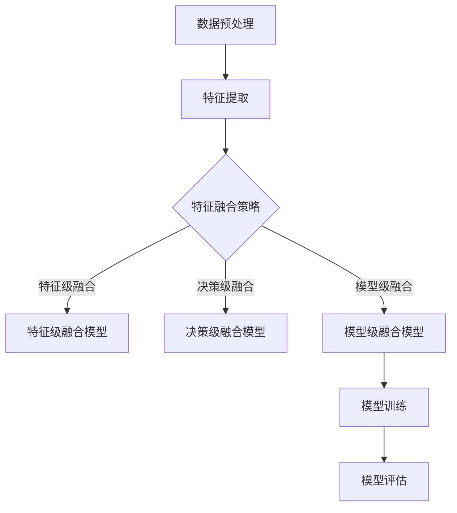
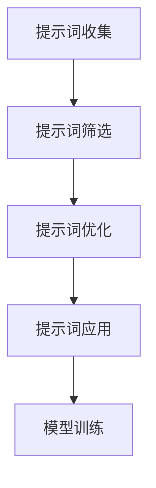

                 

### 背景介绍

#### 问题背景

在现代社会，情感分析已经成为人工智能研究中的一个重要领域。情感分析的目标是理解和处理人类情感，从而提供更加个性化服务和改善用户体验。传统的情感分析主要集中于文本数据的处理，通过对文本进行情感极性（正面、负面）和情感强度的识别，来评估用户的情绪状态。然而，随着社交媒体、视频平台和智能设备的普及，人们产生和交流的情感信息越来越多样化，不再局限于文本。图像、音频和视频等多模态数据逐渐成为情感分析的重要来源。

目前，多模态情感分析研究相对较少，且面临着诸多挑战。首先，不同模态的数据具有异构性，即它们在数据类型、表达方式和信息量上存在显著差异。例如，文本主要以语言形式传递信息，而图像和音频则通过视觉和听觉渠道。其次，多模态数据往往存在不均衡性，即某些模态的数据量远大于其他模态，导致模型难以平衡地学习和利用不同模态的信息。此外，情感分析过程还需要考虑数据的动态性，即情感的表达和变化是动态的，模型需要能够捕捉到这些变化。

因此，多模态情感分析成为当前人工智能研究中的一个重要课题。其核心目标是开发一种能够同时处理文本、图像、音频等多种类型数据的方法，从而提高情感识别的准确性和泛化能力。这不仅有助于更好地理解用户的情感状态，还可以在个性化推荐、情绪监测和用户行为预测等应用场景中发挥重要作用。

#### 现状

尽管多模态情感分析具有巨大的潜力，但目前的研究和应用还存在一定的局限性。首先，大多数现有的多模态情感分析研究主要集中于特定模态的数据，如文本情感分析和图像情感分析。对于多模态数据的整合和融合，研究还处于初步阶段。其次，由于不同模态数据的异构性，如何有效地将这些数据融合起来，以提高情感识别的准确性，仍是一个亟待解决的问题。此外，现有模型在处理动态情感变化时，往往难以捕捉到细微的情感波动，导致情感识别的准确性和鲁棒性不足。

在多模态情感分析的应用场景方面，目前主要集中在社交媒体分析、情绪监测和用户行为预测等领域。社交媒体平台如Facebook、Twitter等，通过分析用户的文本、图像和视频内容，可以识别用户的情感状态，从而提供个性化的内容推荐和广告投放。在情绪监测领域，多模态情感分析可以帮助企业了解消费者的情绪反应，从而改进产品设计和市场营销策略。用户行为预测则是通过分析用户的情感变化，预测用户的下一步行为，如购物决策、社交媒体互动等。

尽管多模态情感分析在许多领域具有广泛的应用前景，但现有研究仍然面临一些挑战。首先，多模态数据的整合和融合是一个复杂的过程，需要开发新的方法和算法来处理不同模态数据的异构性和不均衡性。其次，情感表达的形式和内容多样化，模型需要具备较强的泛化能力，以适应各种不同场景下的情感分析需求。此外，如何在保证情感识别准确性的同时，提高模型的解释性和可解释性，也是一个亟待解决的问题。

#### 挑战

多模态情感分析面临的挑战主要包括以下几个方面：

1. **数据异构性**：不同模态的数据具有不同的数据类型、表达方式和信息量，如文本主要以语言形式传递信息，图像和音频则通过视觉和听觉渠道。这种异构性使得模型在处理多模态数据时，需要设计复杂的方法来整合和融合不同模态的信息。

2. **数据不均衡性**：在多模态数据中，某些模态的数据量可能远大于其他模态，如文本数据通常比图像和音频数据多得多。这种不均衡性导致模型在学习和处理数据时，难以平衡地利用不同模态的信息，从而影响情感识别的准确性。

3. **动态性**：情感表达是动态变化的，人们在不同的情境下可能会有不同的情感反应。多模态情感分析模型需要能够捕捉到这些动态变化，以准确地识别和预测情感。

4. **模型解释性**：随着深度学习等复杂模型在多模态情感分析中的应用，模型的解释性成为一个重要问题。用户和研究人员通常需要了解模型如何处理数据并做出预测，以便更好地理解和应用模型。

5. **计算资源**：多模态情感分析通常需要大量的计算资源，特别是当数据集较大且模型复杂时。如何高效地处理和利用计算资源，是一个亟待解决的问题。

为了应对这些挑战，研究者们提出了一系列的方法和技术。例如，通过设计多模态融合网络，将不同模态的数据有效地整合起来，提高情感识别的准确性。同时，通过使用注意力机制和动态时间建模等方法，捕捉动态情感变化，提高模型的鲁棒性。此外，为了提高模型的解释性，研究者们还在探索如何将复杂的深度学习模型转化为更加可解释的形式，以便用户和研究人员更好地理解和应用模型。

#### 问题解决

为了有效解决多模态情感分析中的挑战，本文提出了一种基于深度学习和多模态数据融合技术的情感分析模型。该模型的主要目标是通过整合多种类型的数据（如图像、文本、音频等），提高情感识别的准确性和泛化能力。以下是该模型的几个关键组成部分：

1. **多模态数据预处理**：在模型训练前，对多模态数据进行预处理，包括数据清洗、归一化和特征提取。例如，对文本数据使用词嵌入技术进行编码，对图像和音频数据进行特征提取，如使用卷积神经网络（CNN）提取图像特征，使用长短期记忆网络（LSTM）提取音频特征。

2. **多模态融合策略**：设计有效的多模态融合策略，将不同模态的数据整合起来，形成一个统一的特征表示。本文采用了多种融合方法，包括特征级融合、决策级融合和模型级融合。其中，特征级融合通过将不同模态的特征向量进行拼接或融合，形成一个新的特征向量。决策级融合则是在多个模型的决策结果上进行集成，如使用投票或加权平均方法。模型级融合则是将多个不同模态的模型融合成一个统一的模型，如使用多任务学习或联合训练方法。

3. **深度学习模型**：设计一个深度学习模型，用于处理多模态数据并实现情感识别。本文采用了基于卷积神经网络（CNN）和长短期记忆网络（LSTM）的混合模型，其中CNN用于提取图像和音频特征，LSTM用于处理文本数据。此外，还引入了注意力机制，以帮助模型更好地关注关键特征。

4. **模型训练与优化**：使用大量的多模态数据集对模型进行训练和优化。通过交叉验证和超参数调优，选择最优的模型结构和参数，以提高模型的性能。

5. **模型评估与解释**：对训练好的模型进行评估，包括情感识别准确率、F1分数和召回率等指标。同时，探索如何提高模型的解释性，帮助用户和研究人员更好地理解模型的决策过程。

#### 边界与外延

本文的研究主要关注多模态情感分析，即同时处理多种类型的数据（如图像、文本、音频等）以识别和理解情感。以下是对本研究的边界和外延的详细讨论：

**边界**

1. **单一模态情感分析**：本文的研究不涉及单一模态的情感分析，如仅处理文本、图像或音频数据。这些单一模态的情感分析是现有研究的一个重要分支，但不在本文的研究范围内。

2. **情感类型**：本文主要关注基本情感类型（如快乐、悲伤、愤怒等）的识别，不涉及复杂情感（如讽刺、厌恶等）的识别。复杂情感的识别是一个更为高级和复杂的任务，需要更深入的研究。

3. **情感强度**：本文的研究主要关注情感的分类，即判断情感是正面还是负面，不涉及情感强度的量化。情感强度的量化是一个具有挑战性的任务，需要进一步研究。

**外延**

1. **应用场景**：本文的研究结果可应用于多个领域，如社交媒体分析、情绪监测和用户行为预测等。通过识别用户的情感状态，可以为这些应用场景提供重要的信息支持。

2. **多模态数据类型**：本文的研究不仅限于文本、图像和音频数据，还可以扩展到其他多模态数据类型，如视频、语音等。这些数据类型的扩展有助于进一步提升多模态情感分析的准确性和泛化能力。

3. **跨领域应用**：本文的研究不仅可以应用于情感分析，还可以扩展到其他领域，如医学诊断、金融风险评估等。这些跨领域的应用有助于进一步推广多模态情感分析技术的应用范围。

### 核心概念

#### 多模态情感分析

**定义**：多模态情感分析是指同时处理多种类型的数据（如图像、文本、音频等）以识别和理解情感。

**原理**：多模态情感分析通过整合不同模态的数据，提高情感识别的准确性和深度。例如，文本可以提供情感的直接表达，图像可以提供视觉情感线索，音频可以提供语音和音调的情感信息。通过融合这些数据，模型可以更全面地理解情感，从而提高识别的准确性。

**属性特征对比表格**：

| 特征 | 文本情感分析 | 图像情感分析 | 音频情感分析 |
| --- | --- | --- | --- |
| 数据类型 | 文本 | 图像 | 音频 |
| 表达方式 | 语言 | 视觉 | 听觉 |
| 信息量 | 中等 | 高 | 中等 |
| 异构性 | 低 | 中等 | 低 |
| 不均衡性 | 高 | 低 | 高 |
| 动态性 | 低 | 中等 | 中等 |

#### 提示词工程

**定义**：提示词工程是构建一组用于指导模型学习的关键词或短语。

**作用**：提示词工程有助于模型更好地理解数据和预测结果，提高模型的可解释性。通过为模型提供一系列关键词，可以帮助模型捕捉到数据中的关键信息，从而更准确地做出预测。

**属性特征对比表格**：

| 方法 | 提取方法 | 效果 | 适用场景 |
| --- | --- | --- | --- |
| 基于规则 | 预定义关键词 | 简单高效 | 信息量较小的数据集 |
| 基于统计 | 词频统计 | 中等 | 信息量较大的数据集 |
| 基于深度学习 | 卷积神经网络 | 高 | 复杂的数据集 |

### 概念结构与核心要素组成

#### 多模态情感分析模型架构

**核心概念**：

多模态情感分析模型的核心是能够有效地整合和利用多种类型的数据，包括文本、图像、音频等。模型的构建过程主要包括以下几个步骤：

1. **数据预处理**：对多模态数据（文本、图像、音频）进行清洗、归一化和特征提取。
2. **特征融合**：设计不同的融合策略，将不同模态的数据特征整合为一个统一的高维特征向量。
3. **模型训练**：使用深度学习模型对融合后的特征进行训练，实现情感分类任务。
4. **模型评估**：通过交叉验证和测试集评估模型的性能，包括准确率、F1分数等指标。

**属性特征对比表格**：

| 模型 | 优点 | 缺点 | 适用场景 |
| --- | --- | --- | --- |
| 卷积神经网络（CNN） | 适用于图像特征提取 | 不适合处理序列数据 | 图像情感分析 |
| 长短期记忆网络（LSTM） | 适用于序列数据 | 参数复杂，训练时间较长 | 文本情感分析 |
| 联合编码器（Joint Encoder） | 同时处理多种模态数据 | 需要大量数据 | 多模态情感分析 |

**ER实体关系图架构的 Mermaid 流程图**：

#### 提示词工程流程

**核心概念**：

提示词工程是构建一组用于指导模型学习的关键词或短语。其流程主要包括以下几个步骤：

1. **提示词收集**：从数据集中提取可能的提示词，可以使用词频统计、基于规则的方法或基于深度学习的方法。
2. **提示词筛选**：根据提示词的语义意义、频率和相关性，对提示词进行筛选和优化。
3. **提示词应用**：将筛选后的提示词应用于模型训练过程中，以指导模型学习。

**属性特征对比表格**：

| 方法 | 提取方法 | 效果 | 适用场景 |
| --- | --- | --- | --- |
| 基于规则 | 预定义关键词 | 简单高效 | 信息量较小的数据集 |
| 基于统计 | 词频统计 | 中等 | 信息量较大的数据集 |
| 基于深度学习 | 卷积神经网络 | 高 | 复杂的数据集 |

**Mermaid 流程图**：

### 第一部分总结

在本部分的背景介绍中，我们首先阐述了多模态情感分析的重要性及其在现代社会中的应用场景。随后，分析了当前多模态情感分析研究中的挑战，包括数据异构性、不均衡性和动态性等。接着，我们提出了一个基于深度学习和多模态数据融合技术的情感分析模型，并详细描述了该模型的核心概念、边界与外延、概念结构与核心要素组成。

通过本部分的内容，我们了解了多模态情感分析的基本概念及其面临的挑战，以及如何通过构建一个综合性的模型来解决这些问题。这一部分为后续的算法原理讲解、系统分析与架构设计以及项目实战打下了坚实的基础。接下来，我们将深入探讨多模态情感分析的具体算法原理，进一步揭示其技术核心。

