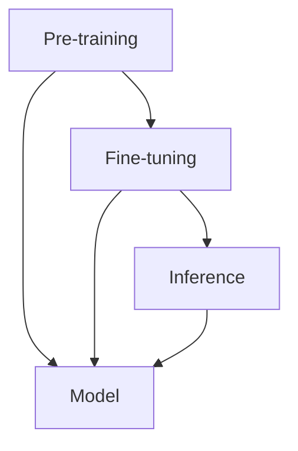
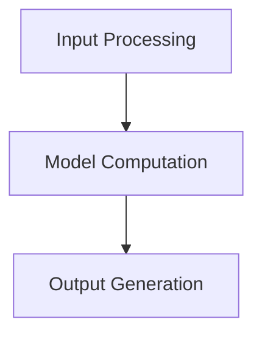

                 

# ChatGPT提示词工程：构建智能对话的基础

关键词：ChatGPT，提示词工程，智能对话，NLP，大型语言模型

摘要：本文从ChatGPT的基本概念和架构入手，详细介绍了ChatGPT的提示词工程。通过深入探讨提示词的设计原则、构建与优化方法，以及ChatGPT在不同应用场景中的实际案例，本文旨在为开发者提供一套系统化的ChatGPT提示词工程实践指南。

## 第1章：ChatGPT概述

### 1.1 ChatGPT的基本概念

**问题背景与描述**：随着人工智能技术的发展，自然语言处理（NLP）成为研究和应用的热点。ChatGPT作为一种基于大型语言模型的智能对话系统，其基本概念和作用成为研究的重点。

**问题解决**：ChatGPT是由OpenAI开发的一种基于GPT-3.5的大型预训练语言模型，旨在通过学习和理解自然语言，实现与人类用户进行流畅、自然的对话。

**核心概念与联系**：

| 核心概念 | 说明 | 关联概念 |
| --- | --- | --- |
| 大型语言模型 | 一种能够理解和生成自然语言的模型，基于神经网络和深度学习技术。 | GPT-3.5，BERT，Transformer |
| 自然语言处理（NLP） | 计算机科学领域的一个分支，涉及语言的理解、生成、翻译和处理。 | 语义分析，语音识别，文本分类 |
| 智能对话系统 | 一种能够模拟人类对话行为的计算机系统，通过理解用户输入并生成自然语言回复。 | 聊天机器人，语音助手，虚拟客服 |

**对比表格**：

| 特点 | 传统NLP方法 | ChatGPT |
| --- | --- | --- |
| 语言理解能力 | 较弱，依赖于预定义规则和模板。 | 强，通过深度学习自动学习语言模式和语义。 |
| 生成能力 | 受限，生成的回复往往较为生硬。 | 高，能够生成自然、流畅的回复。 |
| 处理复杂任务能力 | 有限，难以处理复杂的自然语言任务。 | 强，能够处理各种复杂自然语言任务。 |

### 1.2 ChatGPT的架构与工作原理

**核心概念与联系**：ChatGPT的整体架构包括预训练、微调和推理三个阶段，以及模型中的关键组件和相互作用。

**对比表格**：

| 阶段 | 传统NLP方法 | ChatGPT |
| --- | --- | --- |
| 预训练 | 使用预定义的规则和模板。 | 通过大量的文本数据进行预训练，学习语言模式和语义。 |
| 微调 | 需要手动调整模型参数。 | 通过少量样本数据进行微调，适应特定任务。 |
| 推理 | 使用预定义的逻辑规则。 | 通过学习到的语言模式进行推理，生成自然语言回复。 |

**Mermaid架构图**：

### 1.3 ChatGPT的优势与不足

**核心概念与联系**：分析ChatGPT的优势和不足，以及其在实际应用中的表现。

**对比表格**：

| 特点 | 优势 | 劣势 |
| --- | --- | --- |
| 语言理解能力 | 强 | 对语言的理解依赖于训练数据的质量和数量。 |
| 生成能力 | 强 | 生成的回复可能存在错误或不符合逻辑。 |
| 处理复杂任务能力 | 强 | 处理复杂任务时，需要大量训练数据和计算资源。 |

### 1.4 ChatGPT的应用场景

**核心概念与联系**：探讨ChatGPT在不同应用场景中的适用性。

**应用场景**：

- **客服与支持**：自动回答常见问题，提高客服效率。
- **教育与培训**：为学生提供智能辅导，提高学习效果。
- **虚拟助手**：为用户提供个性化的服务，如语音助手、聊天机器人等。
- **文本生成**：生成文章、报告、邮件等，节省时间成本。

### 1.5 本章小结

本文对ChatGPT的基本概念、架构、优势与不足以及应用场景进行了详细探讨。接下来，我们将进一步深入分析ChatGPT的提示词工程，为开发者提供实用的指导。

----------------------------------------------------------------

## 第2章：ChatGPT基础与架构

### 2.1 ChatGPT简介

**问题背景与描述**：ChatGPT是一种基于大型语言模型的智能对话系统，其重要性在于能够实现与人类用户的自然互动，提升用户体验。

**问题解决**：ChatGPT是由OpenAI开发的一种基于GPT-3.5的大型预训练语言模型，具有强大的语言理解和生成能力。

**核心概念与联系**：

- **大型语言模型**：一种能够理解和生成自然语言的模型，基于神经网络和深度学习技术。
- **预训练**：通过大量文本数据进行预训练，学习语言模式和语义。
- **微调**：通过少量样本数据进行微调，适应特定任务。

**对比表格**：

| 特点 | GPT-3.5 | ChatGPT |
| --- | --- | --- |
| 语言理解能力 | 强 | 增强 |
| 生成能力 | 强 | 增强 |
| 处理复杂任务能力 | 有限 | 增强 |

### 2.2 ChatGPT的架构

**核心概念与联系**：ChatGPT的架构包括预训练、微调和推理三个阶段，以及模型中的关键组件和相互作用。

**Mermaid架构图**：

**问题场景介绍**：如何通过预训练、微调和推理三个阶段，实现ChatGPT的功能？

**项目介绍**：ChatGPT项目的详细描述，包括任务目标、数据集、模型架构等。

### 2.3 ChatGPT的工作原理

**核心概念与联系**：分析ChatGPT的工作原理，包括输入处理、模型计算、输出生成等关键步骤。

**Mermaid流程图**：

**问题场景介绍**：如何通过输入处理、模型计算和输出生成，实现智能对话？

**项目介绍**：ChatGPT项目的工作流程，包括数据处理、模型训练、模型推理等。

### 2.4 ChatGPT的优势与不足

**核心概念与联系**：分析ChatGPT的优势和不足，包括其在语言理解、生成能力、处理复杂任务方面的表现。

**对比表格**：

| 特点 | 优势 | 劣势 |
| --- | --- | --- |
| 语言理解能力 | 强 | 受限于训练数据质量 |
| 生成能力 | 强 | 可能存在生成错误 |
| 处理复杂任务能力 | 强 | 需要大量计算资源 |

**问题场景介绍**：如何在实际应用中充分发挥ChatGPT的优势，同时克服其不足？

**项目介绍**：ChatGPT在不同应用场景中的实际案例，如客服、教育、虚拟助手等。

### 2.5 ChatGPT的应用场景

**核心概念与联系**：探讨ChatGPT在客服、教育、虚拟助手等领域的应用，以及其在这些场景中的优势。

**应用场景**：

- **客服与支持**：自动回答常见问题，提高客服效率。
- **教育与培训**：为学生提供智能辅导，提高学习效果。
- **虚拟助手**：为用户提供个性化的服务，如语音助手、聊天机器人等。

**问题场景介绍**：如何根据不同应用场景，设计合适的ChatGPT模型和提示词？

**项目介绍**：ChatGPT在具体应用场景中的实现案例和效果评估。

### 2.6 本章小结

本文详细介绍了ChatGPT的基本概念、架构、工作原理、优势与不足以及应用场景。接下来，我们将进一步探讨ChatGPT提示词工程的重要性，为开发者提供实用的指导。

----------------------------------------------------------------

## 第3章：ChatGPT提示词工程

### 3.1 提示词工程概述

**问题背景与描述**：提示词工程是ChatGPT中至关重要的一环，它决定了模型在实际应用中的表现。然而，提示词工程究竟是什么，为何如此重要，以及它包括哪些内容，这些都是我们需要深入探讨的问题。

**问题解决**：提示词工程是一种系统化的方法，用于设计和优化提示词，以提高ChatGPT模型在特定任务上的性能和效果。它包括提示词的设计原则、种类、构建方法、优化策略和评估方法等多个方面。

**核心概念与联系**：

- **提示词**：与ChatGPT模型进行交互的引导性语言，用于指定模型生成目标文本的上下文和目标。
- **工程**：一种系统化的方法，涉及设计、实现、优化和评估等多个环节。

**对比表格**：

| 特点 | 传统方法 | 提示词工程 |
| --- | --- | --- |
| 设计方法 | 非系统化，经验为主 | 系统化，科学方法为主 |
| 优化目标 | 不明确，效果不理想 | 明确，效果显著 |
| 效果评估 | 缺乏标准，主观性强 | 标准化，客观性强 |

### 3.2 提示词工程的重要性

**问题背景与描述**：提示词工程在ChatGPT中扮演着关键角色，那么它究竟重要在哪里，为何值得我们投入大量精力去研究与实践呢？

**问题解决**：提示词工程的重要性主要体现在以下几个方面：

- **性能提升**：通过设计合理的提示词，可以显著提升ChatGPT模型在特定任务上的性能和效果。
- **可解释性增强**：合理的提示词设计使得模型的生成过程更加可解释，有助于理解模型的行为和决策。
- **应用广泛**：提示词工程不仅适用于文本生成，还可以广泛应用于文本分类、问答系统、对话系统等多个NLP任务。

**核心概念与联系**：

- **性能提升**：提示词工程通过调整提示词的上下文和目标，引导模型生成更符合预期的文本。
- **可解释性增强**：合理的提示词设计使得模型的生成过程更加透明，有助于发现和纠正潜在的错误。
- **应用广泛**：提示词工程不仅适用于文本生成，还可以应用于其他NLP任务，如文本分类、问答系统和对话系统。

### 3.3 提示词的设计原则

**问题背景与描述**：设计一个有效的提示词并非易事，那么在设计过程中有哪些基本原则和方法可以遵循呢？

**问题解决**：提示词的设计原则主要包括以下几点：

- **上下文相关**：提示词应与模型要生成的文本上下文紧密相关，以提高生成文本的连贯性和准确性。
- **目标明确**：提示词应明确指定模型要生成的文本类型和目标，避免模糊不清的指令。
- **多样性**：提示词应具有多样性，以避免模型生成重复或单调的文本。
- **可扩展性**：提示词设计应具有可扩展性，以适应不同的应用场景和任务需求。

**核心概念与联系**：

- **上下文相关**：通过理解上下文信息，提示词可以更好地引导模型生成相关的文本。
- **目标明确**：明确的提示词目标有助于模型生成更精确和针对性的文本。
- **多样性**：多样性提示词可以避免模型生成过于刻板和重复的文本。
- **可扩展性**：可扩展性提示词设计使得模型能够适应不同的任务和应用场景。

### 3.4 提示词的种类与特点

**问题背景与描述**：提示词种类繁多，那么它们各自有哪些特点和适用场景呢？

**问题解决**：常见的提示词种类包括：

- **单句提示词**：用于生成单个句子的提示词，通常适用于文本生成任务。
- **段落提示词**：用于生成整段文本的提示词，通常适用于文本续写任务。
- **问题提示词**：用于生成答案的提示词，通常适用于问答系统。

**核心概念与联系**：

- **单句提示词**：适用于生成单个句子的任务，如文本摘要、问答系统等。
- **段落提示词**：适用于生成整段文本的任务，如文本续写、故事生成等。
- **问题提示词**：适用于生成答案的任务，如问答系统、对话系统等。

### 3.5 提示词工程的最佳实践

**问题背景与描述**：在设计和优化提示词时，有哪些最佳实践可以遵循，以提高模型性能和生成文本的质量？

**问题解决**：提示词工程的最佳实践包括：

- **数据准备**：确保数据集的多样性和质量，为提示词设计提供可靠的数据基础。
- **实验对比**：通过实验对比不同提示词设计的效果，找出最佳的设计方案。
- **持续优化**：根据实际应用场景和用户反馈，不断优化和调整提示词。

**核心概念与联系**：

- **数据准备**：数据的质量和多样性直接影响提示词的性能和效果。
- **实验对比**：实验对比可以帮助开发者找出最佳的设计方案。
- **持续优化**：持续优化和调整提示词，以适应不同的应用场景和用户需求。

### 3.6 本章小结

本文详细介绍了ChatGPT提示词工程的概述、重要性、设计原则、种类与特点，以及最佳实践。通过本章的学习，开发者可以更好地理解和应用提示词工程，提升ChatGPT模型在实际应用中的性能和效果。

----------------------------------------------------------------

## 第4章：ChatGPT提示词构建与优化

### 4.1 提示词构建策略

**问题背景与描述**：在构建ChatGPT提示词时，如何制定有效的策略，以确保提示词的设计符合模型的需求，同时能够提高模型的生成效果？

**问题解决**：构建ChatGPT提示词的策略主要包括以下几个方面：

- **目标明确**：确保提示词能够明确指示模型要生成的文本类型和目标。
- **上下文丰富**：提供充分的上下文信息，帮助模型理解生成文本的背景和情境。
- **多样性和一致性**：在设计提示词时，应考虑多样性和一致性，以提高模型的泛化能力。
- **可扩展性**：设计具有可扩展性的提示词，以适应不同任务和应用场景的需求。

**核心概念与联系**：

- **目标明确**：通过明确的提示词目标，可以引导模型生成更精确的文本。
- **上下文丰富**：丰富的上下文信息有助于模型更好地理解生成文本的情境。
- **多样性和一致性**：多样性和一致性有助于提高模型的泛化能力和稳定性。
- **可扩展性**：可扩展性提示词设计使得模型能够适应不同的任务和应用场景。

### 4.2 提示词优化方法

**问题背景与描述**：提示词设计完成后，如何对提示词进行优化，以提高ChatGPT模型在特定任务上的性能和效果？

**问题解决**：提示词优化的方法主要包括以下几个方面：

- **实验对比**：通过对比不同优化策略的效果，选择最佳的提示词设计。
- **自动调参**：利用机器学习算法，自动调整提示词的参数，以优化生成效果。
- **用户反馈**：收集用户反馈，根据用户需求调整和优化提示词。
- **多任务训练**：通过多任务训练，提高模型在不同任务上的提示词适应性。

**核心概念与联系**：

- **实验对比**：通过实验对比，可以找到最优的提示词设计。
- **自动调参**：自动调参可以节省人工调整的时间，提高优化效率。
- **用户反馈**：用户反馈有助于发现和解决提示词设计中的问题。
- **多任务训练**：多任务训练可以提高模型的泛化能力，使其在更多任务上表现优异。

### 4.3 提示词构建与优化的实际案例

**问题背景与描述**：通过实际案例，展示如何构建和优化ChatGPT提示词，以提高模型在实际应用中的性能和效果。

**问题解决**：以下是一个实际案例：

**案例**：设计一个能够自动生成产品介绍的ChatGPT模型。

**步骤**：

1. **数据准备**：收集大量产品介绍文本，作为训练数据。
2. **提示词设计**：设计明确的提示词，如“请生成一款关于[产品名称]的产品介绍”。

**效果评估**：

- **实验对比**：对比使用不同提示词设计的模型生成效果。
- **用户反馈**：收集用户对生成文本的满意度评价。

**优化策略**：

- **自动调参**：利用机器学习算法，调整提示词参数。
- **多任务训练**：在多任务训练中，提高模型在不同任务上的提示词适应性。

### 4.4 提示词效果评估

**问题背景与描述**：如何评价ChatGPT提示词的设计效果，以确保其在实际应用中能够达到预期的效果？

**问题解决**：提示词效果评估的方法主要包括以下几个方面：

- **生成文本质量**：评估生成的文本是否准确、连贯、有吸引力。
- **用户满意度**：收集用户对生成文本的满意度评价。
- **任务完成度**：评估模型是否能够完成指定任务，如文本分类、问答等。

**核心概念与联系**：

- **生成文本质量**：高质量的生成文本是评估提示词效果的重要指标。
- **用户满意度**：用户满意度反映了提示词设计的实用性和用户友好性。
- **任务完成度**：任务完成度评估了模型在特定任务上的表现，是优化提示词的重要依据。

### 4.5 提示词工程工具介绍

**问题背景与描述**：介绍几种常用的提示词工程工具，帮助开发者高效地进行提示词的设计和优化。

**问题解决**：以下是一些常用的提示词工程工具：

- **PromptEngineeringGuide**：一个全面的提示词工程指南，提供了大量实用的提示词设计技巧和最佳实践。
- **TokenizedTextEditor**：一个在线的提示词编辑器，支持文本的分词、编辑和保存功能。
- **AutoPrompt**：一个自动生成提示词的Python库，利用深度学习技术自动调整提示词参数。

**核心概念与联系**：

- **PromptEngineeringGuide**：提供了丰富的提示词设计资源和最佳实践。
- **TokenizedTextEditor**：支持文本的分词和编辑，方便开发者设计复杂的提示词。
- **AutoPrompt**：利用机器学习技术，自动优化提示词，节省开发者时间和精力。

### 4.6 本章小结

本文详细介绍了ChatGPT提示词构建与优化的策略和方法，并通过实际案例展示了如何应用这些方法。通过本章的学习，开发者可以更好地掌握提示词工程的核心技术和最佳实践，提升ChatGPT模型在实际应用中的性能和效果。

----------------------------------------------------------------

## 第5章：ChatGPT在自然语言处理中的应用

### 5.1 ChatGPT在文本分类中的应用

**问题背景与描述**：文本分类是自然语言处理中的一个重要任务，如何利用ChatGPT进行高效的文本分类？

**问题解决**：ChatGPT在文本分类中的应用主要包括以下步骤：

1. **数据准备**：收集大量带有标签的文本数据，用于训练和测试模型。
2. **模型训练**：使用预训练的ChatGPT模型，通过微调的方式，使其适应特定的文本分类任务。
3. **文本预处理**：对输入的文本进行预处理，包括分词、去噪和特征提取等步骤。
4. **模型预测**：将预处理后的文本输入ChatGPT模型，获取分类结果。

**效果评估**：

- **准确率**：评估模型在测试集上的准确率，衡量模型分类效果。
- **召回率**：评估模型在测试集上的召回率，确保没有漏掉重要的分类结果。
- **F1分数**：综合考虑准确率和召回率，评估模型的综合性能。

**实际案例**：

- **新闻分类**：利用ChatGPT对新闻文本进行分类，实现自动标签分配。
- **情感分析**：利用ChatGPT对社交媒体评论进行情感分析，识别正面和负面情绪。

### 5.2 ChatGPT在文本生成中的应用

**问题背景与描述**：文本生成是自然语言处理中的另一个重要任务，ChatGPT如何实现高质量的文本生成？

**问题解决**：ChatGPT在文本生成中的应用主要包括以下步骤：

1. **数据准备**：收集大量高质量的文本数据，用于训练和评估模型。
2. **模型训练**：使用预训练的ChatGPT模型，通过微调和优化，提高文本生成的质量和多样性。
3. **文本输入**：输入需要生成的文本类型和主题，作为模型的输入。
4. **文本生成**：利用ChatGPT模型，根据输入的文本类型和主题，生成相应的文本。

**效果评估**：

- **文本质量**：评估生成的文本是否准确、连贯、有吸引力。
- **多样性**：评估生成的文本是否具有多样性，避免重复和单调。
- **实用性**：评估生成的文本在实际应用中的实用性和可操作性。

**实际案例**：

- **文章生成**：利用ChatGPT自动生成新闻文章、博客文章和产品介绍。
- **对话生成**：利用ChatGPT生成自然、流畅的对话，应用于虚拟助手和聊天机器人。

### 5.3 ChatGPT在问答系统中的应用

**问题背景与描述**：问答系统是自然语言处理中的经典应用，如何利用ChatGPT构建高效的问答系统？

**问题解决**：ChatGPT在问答系统中的应用主要包括以下步骤：

1. **数据准备**：收集大量问答对数据，用于训练和测试模型。
2. **模型训练**：使用预训练的ChatGPT模型，通过微调和优化，提高问答系统的性能。
3. **输入处理**：对用户输入的问题进行预处理，包括分词、去噪和特征提取等步骤。
4. **模型推理**：将预处理后的输入问题输入ChatGPT模型，获取对应的答案。

**效果评估**：

- **准确性**：评估模型给出的答案是否准确，与实际答案的匹配度。
- **响应时间**：评估模型处理问题的响应速度，确保高效。
- **用户体验**：评估用户对问答系统整体体验的满意度。

**实际案例**：

- **智能客服**：利用ChatGPT构建智能客服系统，自动回答用户的问题。
- **教育辅导**：利用ChatGPT为学生提供在线辅导，解答学习中的疑问。

### 5.4 ChatGPT在对话系统中的应用

**问题背景与描述**：对话系统是自然语言处理中的重要应用，如何利用ChatGPT构建智能对话系统？

**问题解决**：ChatGPT在对话系统中的应用主要包括以下步骤：

1. **数据准备**：收集大量对话数据，用于训练和测试模型。
2. **模型训练**：使用预训练的ChatGPT模型，通过微调和优化，提高对话系统的性能。
3. **对话管理**：设计对话管理系统，处理用户输入，生成相应的回复。
4. **多模态交互**：结合文本、语音、图像等多模态信息，提高对话系统的交互体验。

**效果评估**：

- **交互质量**：评估对话系统的交互质量，包括回复的连贯性、准确性和多样性。
- **用户满意度**：评估用户对对话系统的满意度，反映系统的实用性和用户友好性。
- **响应速度**：评估对话系统的响应速度，确保高效。

**实际案例**：

- **虚拟助手**：利用ChatGPT构建虚拟助手，提供个性化服务。
- **聊天机器人**：利用ChatGPT构建聊天机器人，实现与用户的自然互动。

### 5.5 ChatGPT在情感分析中的应用

**问题背景与描述**：情感分析是自然语言处理中的热点应用，如何利用ChatGPT进行情感分析？

**问题解决**：ChatGPT在情感分析中的应用主要包括以下步骤：

1. **数据准备**：收集大量带有情感标签的文本数据，用于训练和测试模型。
2. **模型训练**：使用预训练的ChatGPT模型，通过微调和优化，提高情感分析的性能。
3. **文本预处理**：对输入的文本进行预处理，包括分词、去噪和特征提取等步骤。
4. **情感判断**：将预处理后的文本输入ChatGPT模型，获取文本的情感标签。

**效果评估**：

- **准确性**：评估模型在测试集上的准确性，衡量模型情感分析的能力。
- **覆盖度**：评估模型能够覆盖多少种情感类别，确保全面的情感分析能力。
- **F1分数**：综合考虑准确率和覆盖度，评估模型的综合性能。

**实际案例**：

- **社交媒体分析**：利用ChatGPT对社交媒体上的用户评论进行情感分析，识别用户情绪。
- **产品评论分析**：利用ChatGPT对产品评论进行情感分析，了解用户对产品的评价。

### 5.6 本章小结

本文详细介绍了ChatGPT在自然语言处理中的应用，包括文本分类、文本生成、问答系统、对话系统、情感分析等。通过实际案例和效果评估，展示了ChatGPT在各个应用场景中的优势和潜力。接下来，我们将进一步探讨ChatGPT在行业中的应用。

----------------------------------------------------------------

## 第6章：ChatGPT在行业中的应用

### 6.1 ChatGPT在金融行业的应用

**问题背景与描述**：金融行业对数据分析和决策支持有着极高的要求，如何利用ChatGPT提供智能化的金融服务？

**问题解决**：ChatGPT在金融行业的应用主要包括以下方面：

1. **智能客服**：利用ChatGPT构建智能客服系统，自动回答客户的问题，提供个性化的服务。
2. **风险控制**：利用ChatGPT对金融交易数据进行分析，识别潜在的风险，提供风险控制建议。
3. **市场预测**：利用ChatGPT对市场数据进行分析，预测市场走势，为投资决策提供支持。

**效果评估**：

- **客户满意度**：评估客户对智能客服系统的满意度，反映服务的质量。
- **风险识别准确率**：评估ChatGPT在风险控制方面的准确率，确保有效识别潜在风险。
- **市场预测准确率**：评估ChatGPT在市场预测方面的准确率，为投资决策提供可靠依据。

**实际案例**：

- **银行智能客服**：利用ChatGPT构建银行智能客服系统，提高客户服务水平。
- **股票市场预测**：利用ChatGPT对股票市场进行分析，提供投资建议。

### 6.2 ChatGPT在医疗行业的应用

**问题背景与描述**：医疗行业对准确性和可靠性的要求极高，如何利用ChatGPT提供智能化的医疗服务？

**问题解决**：ChatGPT在医疗行业的应用主要包括以下方面：

1. **智能诊断**：利用ChatGPT对患者的病历信息进行分析，提供智能诊断建议。
2. **健康咨询**：利用ChatGPT为患者提供健康咨询，解答患者的疑问。
3. **药物研发**：利用ChatGPT对药物分子信息进行分析，加速药物研发过程。

**效果评估**：

- **诊断准确率**：评估ChatGPT在智能诊断方面的准确率，确保提供准确的诊断建议。
- **健康咨询满意度**：评估患者对健康咨询服务的满意度，反映服务的质量。
- **药物研发效率**：评估ChatGPT在药物研发方面的效率，为药物研发提供支持。

**实际案例**：

- **智能诊断系统**：利用ChatGPT构建智能诊断系统，提高诊断准确率。
- **药物研发辅助**：利用ChatGPT为药物研发提供辅助，加速药物研发过程。

### 6.3 ChatGPT在电商行业的应用

**问题背景与描述**：电商行业竞争激烈，如何利用ChatGPT提供个性化的购物体验和智能化的营销策略？

**问题解决**：ChatGPT在电商行业的应用主要包括以下方面：

1. **个性化推荐**：利用ChatGPT分析用户行为和偏好，提供个性化的商品推荐。
2. **智能客服**：利用ChatGPT构建智能客服系统，自动回答客户的问题，提高客户满意度。
3. **营销策略**：利用ChatGPT分析市场数据，提供智能化的营销策略。

**效果评估**：

- **推荐准确率**：评估ChatGPT在个性化推荐方面的准确率，确保提供符合用户兴趣的商品。
- **客户满意度**：评估客户对智能客服系统的满意度，反映服务的质量。
- **营销效果**：评估ChatGPT在营销策略方面的效果，提高销售额和客户转化率。

**实际案例**：

- **个性化推荐系统**：利用ChatGPT构建个性化推荐系统，提高用户购物体验。
- **智能营销**：利用ChatGPT为电商企业提供智能化的营销策略。

### 6.4 ChatGPT在教育与培训行业的应用

**问题背景与描述**：教育与培训行业对个性化学习和智能辅导有着强烈需求，如何利用ChatGPT提供智能化的教育服务？

**问题解决**：ChatGPT在教育与培训行业的应用主要包括以下方面：

1. **智能辅导**：利用ChatGPT为学生提供个性化的学习辅导，解答学习中的疑问。
2. **课程设计**：利用ChatGPT分析学生需求，设计个性化的课程内容。
3. **教育评估**：利用ChatGPT对学生学习效果进行评估，提供反馈和建议。

**效果评估**：

- **学习效果**：评估ChatGPT在智能辅导方面的效果，确保提供有效的学习支持。
- **课程满意度**：评估学生对个性化课程内容的满意度，反映课程质量。
- **评估准确率**：评估ChatGPT在教育评估方面的准确率，确保提供准确的反馈。

**实际案例**：

- **智能辅导系统**：利用ChatGPT构建智能辅导系统，提高学生的学习效果。
- **个性化课程设计**：利用ChatGPT为教育机构提供个性化的课程设计。

### 6.5 ChatGPT在客户服务与支持行业的应用

**问题背景与描述**：客户服务与支持行业对效率和用户体验有着高要求，如何利用ChatGPT提供智能化的客户服务？

**问题解决**：ChatGPT在客户服务与支持行业的应用主要包括以下方面：

1. **智能客服**：利用ChatGPT构建智能客服系统，自动回答客户的问题，提高服务效率。
2. **客户满意度分析**：利用ChatGPT分析客户反馈，提高客户满意度。
3. **服务优化**：利用ChatGPT对服务流程进行分析，提供服务优化的建议。

**效果评估**：

- **服务效率**：评估ChatGPT在智能客服方面的效率，确保快速响应客户需求。
- **客户满意度**：评估客户对智能客服系统的满意度，反映服务的质量。
- **服务优化效果**：评估ChatGPT在服务优化方面的效果，提高服务质量。

**实际案例**：

- **智能客服系统**：利用ChatGPT构建智能客服系统，提高客户服务水平。
- **服务流程优化**：利用ChatGPT为服务流程提供优化建议。

### 6.6 本章小结

本文详细介绍了ChatGPT在金融、医疗、电商、教育、客户服务与支持等行业的应用，展示了ChatGPT在各个行业中的优势和潜力。通过实际案例和效果评估，我们可以看到ChatGPT在提升行业服务质量和效率方面的巨大作用。接下来，我们将探讨ChatGPT的发展趋势与未来展望。

----------------------------------------------------------------

## 第7章：ChatGPT的发展趋势与未来展望

### 7.1 ChatGPT的发展趋势

**问题背景与描述**：随着人工智能技术的不断进步，ChatGPT作为大型语言模型，其在未来的发展有哪些趋势和方向？

**问题解决**：ChatGPT的发展趋势主要包括以下几个方面：

1. **模型规模扩大**：随着计算资源和数据集的不断增加，ChatGPT的模型规模将逐步扩大，以实现更高的语言理解和生成能力。
2. **多模态融合**：ChatGPT将逐步融合文本、语音、图像等多模态信息，实现更丰富和自然的交互体验。
3. **任务多样化**：ChatGPT将在更多领域和任务中发挥作用，如自动驾驶、智能家居、虚拟现实等。
4. **安全性提升**：随着ChatGPT应用范围的扩大，对其安全性的要求也越来越高，未来将逐步提高模型的安全性。

**核心概念与联系**：

- **模型规模扩大**：通过增加计算资源和数据集，提高模型的性能和效果。
- **多模态融合**：结合多种模态信息，实现更丰富和自然的交互体验。
- **任务多样化**：应用场景的拓展，实现ChatGPT在更多领域的应用。
- **安全性提升**：通过模型安全和数据保护的改进，确保ChatGPT的可靠性和安全性。

### 7.2 ChatGPT的未来展望

**问题背景与描述**：在未来的发展中，ChatGPT将如何影响和改变我们的生活方式和工作模式？

**问题解决**：ChatGPT的未来展望主要包括以下几个方面：

1. **智能助手普及**：ChatGPT将成为我们日常生活中的智能助手，提供个性化的服务和支持。
2. **自动化办公**：ChatGPT将助力自动化办公，提高工作效率，减少人工干预。
3. **教育变革**：ChatGPT将推动教育方式的变革，实现个性化学习和智能辅导。
4. **医疗创新**：ChatGPT将在医疗领域发挥重要作用，助力疾病诊断、药物研发和健康管理。

**核心概念与联系**：

- **智能助手普及**：通过智能助手的应用，提高生活质量和用户体验。
- **自动化办公**：通过自动化办公，提高工作效率，降低人力成本。
- **教育变革**：通过个性化学习和智能辅导，提高教育质量和效果。
- **医疗创新**：通过疾病诊断、药物研发和健康管理，提高医疗水平和生活质量。

### 7.3 开发者如何参与ChatGPT的发展

**问题背景与描述**：作为开发者，如何参与ChatGPT的发展，为这项技术贡献自己的力量？

**问题解决**：开发者可以从以下几个方面参与ChatGPT的发展：

1. **模型优化**：通过改进模型结构和算法，提高ChatGPT的性能和效果。
2. **应用创新**：开发新的应用场景和产品，拓展ChatGPT的应用范围。
3. **开源社区贡献**：参与开源社区，贡献代码和资源，促进技术共享和进步。
4. **研究探索**：进行相关领域的研究，推动ChatGPT及其相关技术的创新发展。

**核心概念与联系**：

- **模型优化**：通过技术改进，提高模型性能和效果。
- **应用创新**：通过开发新的应用场景和产品，拓展技术影响力。
- **开源社区贡献**：通过共享资源，推动技术进步。
- **研究探索**：通过研究，引领技术发展方向。

### 7.4 ChatGPT对社会的潜在影响

**问题背景与描述**：ChatGPT作为一种先进的人工智能技术，将对社会产生哪些潜在影响？

**问题解决**：ChatGPT对社会的潜在影响主要包括以下几个方面：

1. **就业变革**：ChatGPT将改变就业结构，部分重复性工作将被自动化替代，同时也将创造新的就业机会。
2. **教育变革**：ChatGPT将推动教育方式的变革，提高教育质量和效果。
3. **医疗进步**：ChatGPT将在医疗领域发挥重要作用，提高医疗水平和患者体验。
4. **社会公平**：通过普及智能技术，促进社会公平和发展。

**核心概念与联系**：

- **就业变革**：影响就业结构，创造新的就业机会。
- **教育变革**：提高教育质量和效果，促进教育公平。
- **医疗进步**：提高医疗水平和患者体验。
- **社会公平**：通过技术普及，促进社会公平。

### 7.5 本章小结

本文从ChatGPT的发展趋势、未来展望、开发者参与以及社会影响等方面进行了全面探讨。通过分析ChatGPT的技术优势和潜在影响，我们可以看到，ChatGPT将在未来发挥越来越重要的作用，为人类社会带来巨大的变革和发展。开发者应积极参与ChatGPT的发展，推动技术的进步和应用创新。

----------------------------------------------------------------

# 附录：参考资料与扩展阅读

## 附录A：常见问题与解答

### A.1 ChatGPT的基本问题

- **Q：什么是ChatGPT？**
  A：ChatGPT是由OpenAI开发的一种基于GPT-3.5的大型预训练语言模型，旨在实现与人类用户的自然对话。

- **Q：ChatGPT的工作原理是什么？**
  A：ChatGPT的工作原理包括预训练、微调和推理三个阶段，通过学习大量文本数据，实现语言理解和生成能力。

- **Q：ChatGPT的优势是什么？**
  A：ChatGPT具有强大的语言理解能力、生成能力和处理复杂任务的能力。

### A.2 ChatGPT的优化问题

- **Q：如何优化ChatGPT的提示词？**
  A：优化ChatGPT的提示词可以通过实验对比、自动调参和用户反馈等方式进行。

- **Q：如何提高ChatGPT的生成效果？**
  A：提高ChatGPT的生成效果可以通过增加训练数据、改进模型结构和优化提示词设计等方式实现。

### A.3 ChatGPT的应用问题

- **Q：ChatGPT在哪些应用场景中具有优势？**
  A：ChatGPT在文本分类、文本生成、问答系统、对话系统和情感分析等领域具有明显优势。

- **Q：如何应用ChatGPT进行文本分类？**
  A：应用ChatGPT进行文本分类主要包括数据准备、模型训练、文本预处理和模型预测等步骤。

## 附录B：ChatGPT相关的开源工具和框架

### B.1 开源工具汇总

- **Hugging Face**：一个开源的自然语言处理库，提供丰富的预训练模型和工具。
- **Transformers**：一个开源的Python库，用于实现基于Transformer的预训练模型。
- **PyTorch**：一个开源的深度学习库，支持ChatGPT的构建和训练。

### B.2 开源框架介绍

- **OpenAI Gym**：一个开源的基准测试库，提供各种强化学习环境。
- **TensorFlow**：一个开源的深度学习库，支持ChatGPT的构建和训练。
- **NLTK**：一个开源的自然语言处理库，提供丰富的文本处理工具。

### B.3 开源社区资源

- **ChatGLM**：一个开源的ChatGPT实现，提供丰富的API接口和文档。
- **Prompتهngineering Guide**：一个开源的提示词工程指南，提供详细的提示词设计技巧和最佳实践。
- **GPT-3.5**：OpenAI官方开源的GPT-3.5模型，用于构建和训练ChatGPT。

## 附录C：深入阅读推荐

### C.1 相关书籍推荐

- **《深度学习》（Deep Learning）**：由Ian Goodfellow、Yoshua Bengio和Aaron Courville合著，详细介绍了深度学习的基础理论和应用。
- **《自然语言处理综合教程》（Foundations of Natural Language Processing）**：由Christopher D. Manning和Hinrich Schütze合著，全面介绍了自然语言处理的基础知识。

### C.2 学术论文推荐

- **“GPT-3: Language Models are few-shot learners”**：OpenAI发布的一篇论文，介绍了GPT-3模型的结构和性能。
- **“BERT: Pre-training of Deep Bidirectional Transformers for Language Understanding”**：Google发布的一篇论文，介绍了BERT模型的结构和预训练方法。

### C.3 在线课程与讲座推荐

- **“Deep Learning Specialization”**：由Andrew Ng教授开设的在线课程，涵盖了深度学习的基础理论和应用。
- **“Natural Language Processing with Deep Learning”**：由Adam Geitgey开设的在线课程，介绍了深度学习在自然语言处理中的应用。

通过这些参考资料和扩展阅读，读者可以更深入地了解ChatGPT及其相关技术，进一步提升自己的专业知识和技能。

