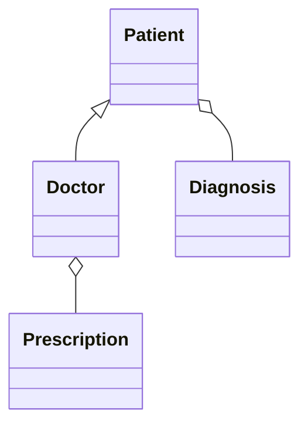
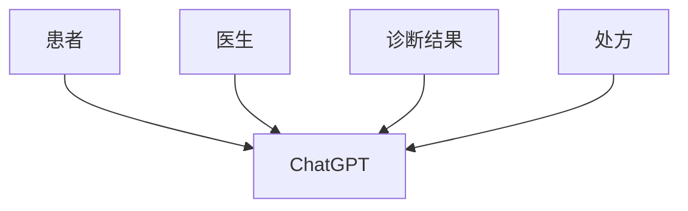
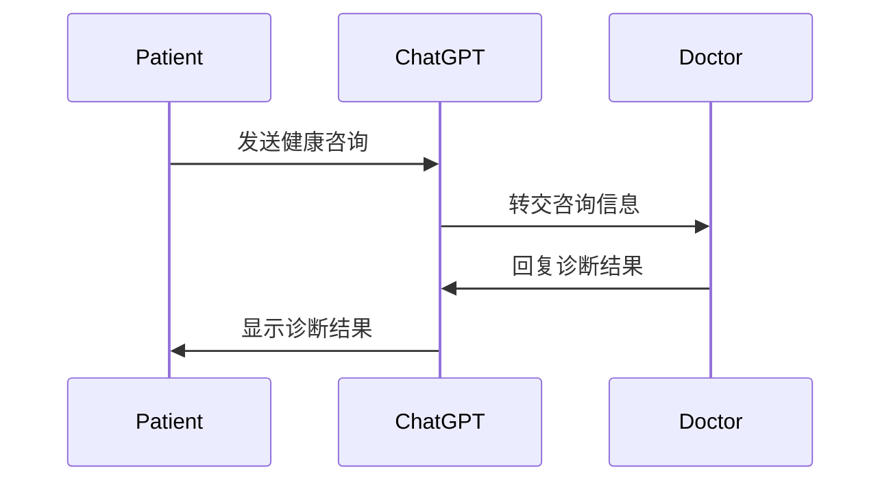
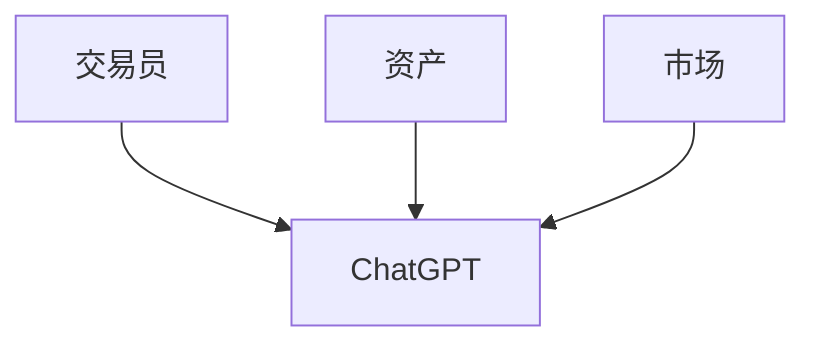
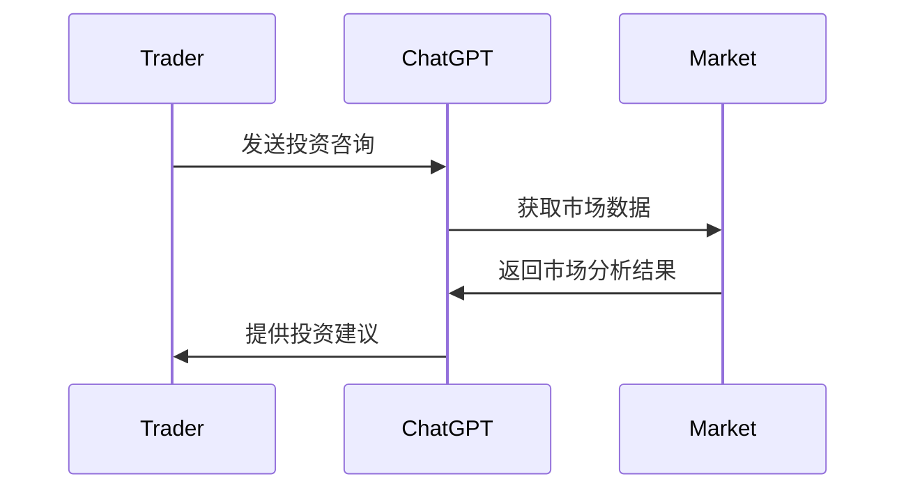

                 

# ChatGPT提示词库：行业专用版

> 关键词：ChatGPT、行业专用版、自然语言处理、应用领域、架构设计、交互流程

> 摘要：本文旨在探讨ChatGPT提示词库在行业专用版中的应用。我们将详细介绍ChatGPT的基本概念、行业专用版的特点与优势，以及其在医疗和金融行业中的具体应用。通过详细的架构设计和交互流程分析，我们希望为读者提供一个清晰、系统的理解。

## 目录大纲

### 第1章：ChatGPT介绍与行业专用版概述

#### 1.1 ChatGPT概述

#### 1.2 行业专用版的特点与优势

#### 1.3 ChatGPT行业专用版的应用领域

### 第2章：医疗行业专用版ChatGPT的应用

#### 2.1 医疗行业需求分析

#### 2.2 医疗行业专用版ChatGPT功能设计

#### 2.3 医疗行业专用版ChatGPT的架构设计

#### 2.4 医疗行业专用版ChatGPT的接口设计

#### 2.5 医疗行业专用版ChatGPT的交互流程

### 第3章：金融行业专用版ChatGPT的应用

#### 3.1 金融行业需求分析

#### 3.2 金融行业专用版ChatGPT功能设计

#### 3.3 金融行业专用版ChatGPT的架构设计

#### 3.4 金融行业专用版ChatGPT的接口设计

#### 3.5 金融行业专用版ChatGPT的交互流程

## 第1章：ChatGPT介绍与行业专用版概述

### 1.1 ChatGPT概述

#### 问题背景

随着人工智能技术的快速发展，自然语言处理（NLP）技术逐渐成为研究的热点。在这一背景下，ChatGPT作为一种基于GPT（Generative Pre-trained Transformer）模型的人工智能聊天机器人，因其强大的语言生成能力和自适应能力，受到了广泛关注。

ChatGPT是由OpenAI开发的一种大型语言模型，其核心思想是通过在大量文本数据上进行预训练，使得模型能够理解和生成人类语言。ChatGPT不仅在日常对话中表现出色，还在各种应用场景中展现出强大的能力，如客服、聊天机器人、文本生成等。

#### 问题描述

ChatGPT的基本功能包括：

1. **文本生成**：根据给定的提示，生成连贯、有意义的文本。
2. **文本理解**：理解输入的文本，并根据上下文进行响应。
3. **对话生成**：与用户进行自然、流畅的对话。

然而，这些功能在通用场景下表现良好，但在特定行业应用中，如医疗、金融等，往往需要更加专业、精准的响应。这就引出了ChatGPT行业专用版的概念。

#### 问题解决

为了满足特定行业的需求，ChatGPT推出了行业专用版。行业专用版ChatGPT在预训练过程中，会针对特定行业的数据进行专门训练，从而提高模型在该领域的专业性和准确性。

#### 边界与外延

ChatGPT的行业专用版虽然提升了模型的专业性，但仍存在一些技术局限：

1. **数据质量**：行业专用版的效果很大程度上取决于训练数据的质量和多样性。
2. **模型规模**：随着行业专用版规模的扩大，模型的训练时间和计算资源需求也会增加。
3. **更新频率**：为了保持模型的最新性，行业专用版需要定期更新。

### 1.2 行业专用版的特点与优势

#### 核心概念

行业专用版ChatGPT的设计理念是：针对特定行业的需求，定制化地训练和优化模型，以提高模型在该领域的专业性和准确性。

#### 概念属性特征对比表格

| 特征对比 | 通用版 | 行业专用版 |
| :--- | :--- | :--- |
| **训练数据** | 广泛的通用数据 | 行业特定的专业数据 |
| **应用场景** | 多样化的通用场景 | 行业特定的专业场景 |
| **准确性** | 较高，但受限于通用数据 | 极高，针对特定行业需求优化 |
| **专业性** | 较高，但受限于通用数据 | 高，针对特定行业专业数据训练 |

#### ER实体关系图架构

```mermaid
erDiagram
    Customer ||--|{ Order : places }  
    Product ||--|{ Order : contains }
```

### 1.3 ChatGPT行业专用版的应用领域

#### 潜在应用领域

ChatGPT行业专用版可以在多个行业应用，包括但不限于：

1. **医疗**：提供医疗咨询服务、病历管理、医学研究等。
2. **金融**：提供金融咨询、投资建议、风险管理等。
3. **教育**：提供在线教育辅导、课程推荐、学习进度跟踪等。
4. **客服**：提供高效、专业的客户服务，提升客户满意度。

#### 企业采用ChatGPT的优势

1. **提高效率**：自动化处理大量文本任务，减少人工干预。
2. **降低成本**：减少人力成本，提高生产效率。
3. **提升客户满意度**：提供个性化、专业的服务，提升客户体验。

#### 挑战与机遇

1. **数据安全与隐私保护**：确保用户数据的安全性和隐私性。
2. **技术更新**：定期更新模型，保持其在行业中的领先地位。
3. **模型可解释性**：提高模型的可解释性，增强用户对模型的信任。

## 第2章：医疗行业专用版ChatGPT的应用

### 2.1 医疗行业需求分析

#### 问题场景介绍

在医疗领域，ChatGPT行业专用版的应用主要包括以下几个方面：

1. **医疗咨询服务**：为患者提供在线医疗咨询，帮助患者快速获取医疗建议。
2. **病历管理**：协助医生管理病历信息，提高病历记录的准确性和完整性。
3. **医学研究**：辅助医学研究人员进行文献检索、数据分析和研究结果预测。

#### 项目介绍

医疗行业专用版ChatGPT的构建与部署，旨在满足上述医疗场景的需求，提供高效、专业的服务。

### 2.2 医疗行业专用版ChatGPT功能设计

#### 系统功能设计（领域模型Mermaid类图）



#### 2.3 医疗行业专用版ChatGPT的架构设计

#### 系统架构设计（Mermaid架构图）



#### 2.4 医疗行业专用版ChatGPT的接口设计

#### 2.5 医疗行业专用版ChatGPT的交互流程



## 第3章：金融行业专用版ChatGPT的应用

### 3.1 金融行业需求分析

#### 问题场景介绍

在金融领域，ChatGPT行业专用版的应用主要包括以下几个方面：

1. **金融咨询**：为投资者提供投资策略、市场分析等建议。
2. **投资建议**：根据投资者的风险偏好和财务状况，提供个性化的投资建议。
3. **风险管理**：对投资组合进行风险评估和优化。

#### 项目介绍

金融行业专用版ChatGPT的构建与部署，旨在为金融从业者提供高效、专业的智能服务。

### 3.2 金融行业专用版ChatGPT功能设计

#### 系统功能设计（领域模型Mermaid类图）

```mermaid
classDiagram
    Trader <|-- ChatGPT
    Asset ||-- Trader : holds
    Market ||-- ChatGPT : analyzes
```

#### 3.3 金融行业专用版ChatGPT的架构设计

#### 系统架构设计（Mermaid架构图）



#### 3.4 金融行业专用版ChatGPT的接口设计

#### 3.5 金融行业专用版ChatGPT的交互流程



## 结束语

ChatGPT提示词库的行业专用版为各个行业提供了强大的支持，通过定制化的训练和优化，ChatGPT能够在医疗、金融等特定领域展现出极高的专业性和准确性。未来，随着技术的不断进步和应用场景的拓展，ChatGPT行业专用版有望在更多领域发挥重要作用。

### 作者

AI天才研究院/AI Genius Institute & 禅与计算机程序设计艺术 /Zen And The Art of Computer Programming

### 注意事项

1. **数据安全和隐私保护**：在使用ChatGPT行业专用版时，确保用户数据的安全性和隐私性。
2. **持续更新与优化**：定期更新模型，以保持其在行业中的领先地位。
3. **模型可解释性**：提高模型的可解释性，增强用户对模型的信任。

### 拓展阅读

1. [OpenAI官方文档](https://openai.com/docs/)
2. [自然语言处理基础教程](https://nlp.stanford.edu/angenette/nlp.html)
3. [金融科技发展趋势](https://www.fintech.fund/trends/)

