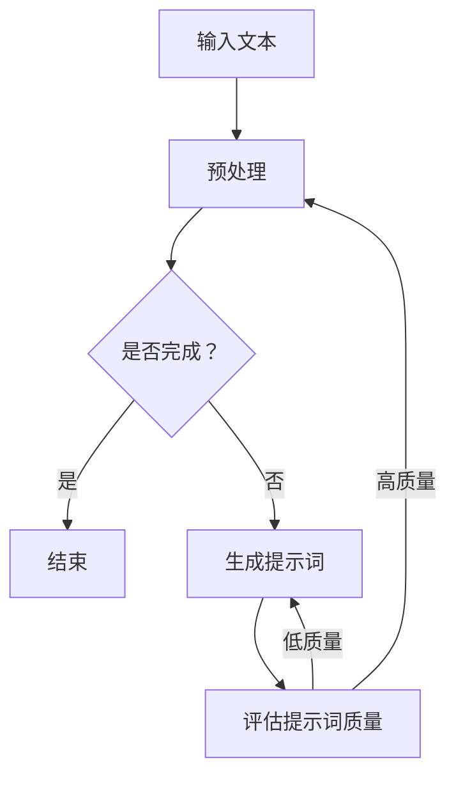
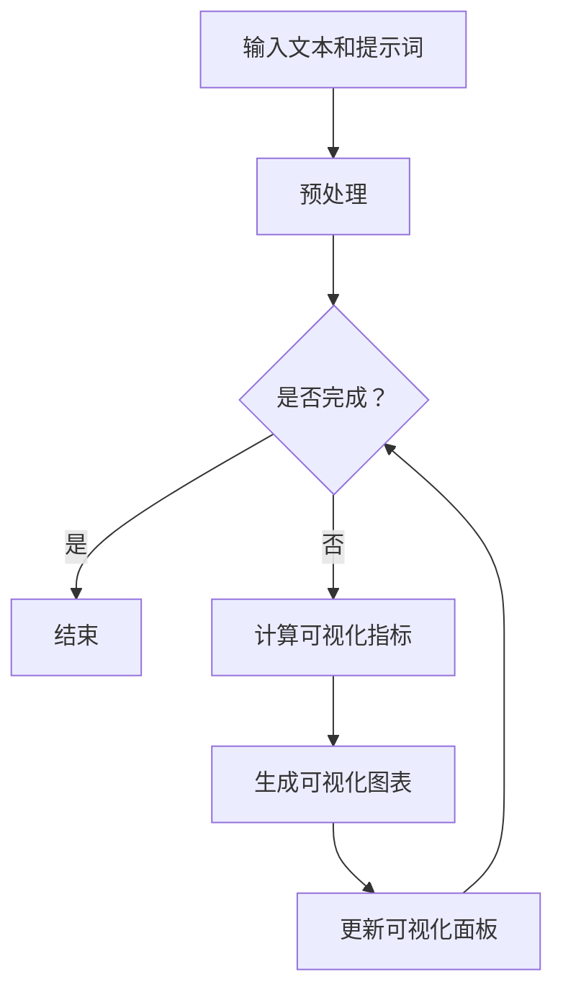
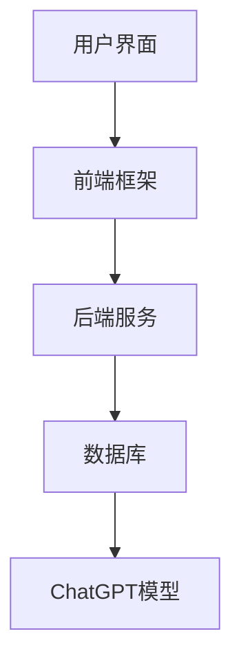

                 

## 《ChatGPT提示词的可视化设计与分析工具》

> 关键词：ChatGPT，提示词，可视化设计，数据分析，工具开发

> 摘要：
本书深入探讨了ChatGPT提示词的可视化设计与分析工具的构建过程。首先，我们介绍了ChatGPT及其提示词的基本概念和重要性。随后，我们分析了现有提示词设计中的挑战，并探讨了可视化设计在此过程中的关键作用。本书详细阐述了工具设计的目标、技术选型以及设计原则。通过核心概念与联系、算法原理讲解、系统设计与实现、项目实战等多个维度，我们逐步构建了该工具。最后，我们总结了最佳实践和未来研究方向，为读者提供了丰富的学习和参考资源。

----------------------------------------------------------------

### 第1章：背景介绍与问题解决

#### 1.1 问题背景

**自然语言处理的发展历程**
自然语言处理（NLP）是人工智能领域的一个重要分支，它旨在使计算机能够理解和处理人类语言。自20世纪50年代以来，NLP经历了多个发展阶段，从规则驱动的语法分析到基于统计和机器学习的方法，再到当前深度学习模型的广泛应用。

**ChatGPT的应用场景**
ChatGPT是由OpenAI开发的一种基于变换器（Transformer）架构的预训练语言模型，它可以用于多种自然语言处理任务，如问答系统、文本生成、机器翻译等。其强大的语言理解和生成能力使其在客户服务、内容创作和数据分析等领域具有广泛的应用前景。

**提示词可视化与分析的重要性**
提示词是影响ChatGPT输出质量的关键因素。有效的提示词设计可以显著提高模型的性能和输出质量。然而，当前提示词设计缺乏系统的方法和工具，这使得设计过程复杂且效率低下。提示词的可视化设计与分析可以为设计人员提供直观的反馈，帮助他们优化提示词，提高模型输出质量。

#### 1.2 问题描述

**ChatGPT提示词的特点**
ChatGPT的提示词通常包含问题、任务描述或上下文信息，以引导模型生成相应的回答或文本。

**现有的提示词设计挑战**
1. 提示词设计的复杂性：设计有效的提示词需要深入理解模型的工作原理和语言特性。
2. 提示词效果评估的不确定性：难以准确评估提示词对模型输出的影响。
3. 可视化设计的缺失：缺乏直观的工具来展示和优化提示词设计。

**可视化设计的需求**
为了解决上述挑战，我们需要开发一种可交互的、可视化的工具，帮助设计人员更直观地理解提示词的设计过程和效果。

#### 1.3 问题解决

**可视化设计与分析的目标**
设计一个可交互的、可视化的工具，使设计人员能够：
- 实时生成和调整提示词。
- 可视化展示提示词对模型输出的影响。
- 评估和优化提示词的设计。

**可视化工具的技术选型**
- 前端：使用React或Vue等现代Web框架。
- 后端：采用Flask或Django等Python后端框架。
- 可视化库：使用D3.js或ECharts等前端可视化库。
- 数据库：使用MongoDB或PostgreSQL等数据库。

**工具的设计原则**
1. 简洁性：界面设计简洁直观，易于用户操作。
2. 可扩展性：支持多种模型和任务，以便在未来扩展。
3. 交互性：提供实时反馈和调整机制，使用户能够即时看到设计结果。
4. 可定制性：允许用户自定义提示词格式和可视化参数。

#### 1.4 边界与外延

**可视化工具的适用范围**
- ChatGPT及其类似模型的提示词设计。
- 其他NLP任务的提示词优化。

**工具的交互设计要点**
- 提示词编辑器：提供文本编辑、插入变量等功能。
- 可视化面板：展示模型输出、提示词变化等。
- 交互反馈：实时更新可视化结果，提供设计建议。

**可视化设计与数据分析的结合**
- 结合数据挖掘和统计分析，提供提示词设计的量化评估。
- 使用可视化工具辅助数据分析和模型调试。

#### 1.5 概念结构与核心要素组成

**ChatGPT的工作原理**
- 变换器架构
- 预训练与微调

**提示词的设计策略**
- 问题引导
- 上下文信息
- 任务描述

**可视化设计的组件**
- 编辑器
- 可视化面板
- 数据分析模块

### 第2章：核心概念原理

#### 2.1 提示词设计原理

**提示词的定义**
提示词（Prompt）是提供给ChatGPT的文本输入，用于引导模型生成特定类型的输出。

**提示词的设计策略**
- 清晰性：确保提示词简洁明了，避免歧义。
- 相关性：确保提示词与任务目标相关。
- 全面性：提供足够的上下文信息，以便模型理解任务背景。

**提示词的效果评估**
- 人工评估：由专家对生成的文本进行质量评估。
- 自动评估：使用指标如BLEU、ROUGE等评估生成文本的质量。

#### 2.2 可视化设计原理

**可视化的基本概念**
可视化是将数据转换为图形表示的过程，使数据更易于理解和分析。

**可视化设计原则**
- 一致性：确保界面风格和交互元素的一致性。
- 高对比度：使用高对比度的颜色和字体，提高可读性。
- 交互性：提供用户与数据的交互功能，如筛选、过滤和排序。

**可视化工具的功能模块**
- 数据导入：从各种数据源导入文本数据。
- 提示词编辑：提供文本编辑功能，设计提示词。
- 可视化面板：展示模型输出和提示词变化。
- 数据分析：提供数据分析和可视化报告。

#### 2.3 概念属性特征对比表格

| 特征        | 提示词         | 可视化设计       |
| ----------- | -------------- | ---------------- |
| 定义        | 引导模型生成输出 | 将数据转换为图形表示 |
| 设计策略    | 清晰、相关、全面 | 一致性、高对比度、交互性 |
| 效果评估    | 人工评估、自动评估 | 数据分析和可视化报告 |
| 功能模块    | 编辑器、面板     | 导入、编辑、可视化、分析 |

### 第3章：算法讲解与数学模型

#### 3.1 提示词生成算法

**算法概述**
提示词生成算法是一种用于生成高质量提示词的自动化方法。

**数学模型**
提示词生成算法通常基于概率模型，如马尔可夫模型或循环神经网络（RNN）。

**算法流程图**


**Python源代码实现**
```python
# 此处为Python源代码实现示例，具体代码需要进一步编写和调试。
```

**算法举例说明**
```python
# 示例：生成一个用于回答数学问题的提示词
input_text = "请解释什么是微积分？"
prompt = generate_prompt(input_text)
print(prompt)
```

#### 3.2 可视化分析算法

**算法概述**
可视化分析算法是一种用于分析和展示模型输出与提示词关系的算法。

**数学模型**
可视化分析算法通常基于统计方法，如相关性分析或聚类分析。

**算法流程图**


**Python源代码实现**
```python
# 此处为Python源代码实现示例，具体代码需要进一步编写和调试。
```

**算法举例说明**
```python
# 示例：生成一个用于展示提示词与模型输出关系的图表
input_data = {"prompt": ["提问1", "提问2", "提问3"], "output": ["回答1", "回答2", "回答3"]}
visualize_data(input_data)
```

### 第4章：系统设计与实现

#### 4.1 问题场景介绍

**ChatGPT提示词可视化需求**
设计一个工具，帮助用户生成、编辑和可视化ChatGPT的提示词，以便更好地理解提示词对模型输出的影响。

**系统设计目标**
- 提供一个直观、易用的界面，方便用户设计和编辑提示词。
- 实现实时可视化，展示提示词与模型输出的关系。
- 支持多种数据源和模型，确保工具的通用性和扩展性。

**系统功能设计**
- 提示词编辑器：用户可以输入和编辑提示词。
- 可视化面板：实时展示模型输出和提示词变化。
- 数据分析模块：提供提示词质量评估和数据分析功能。

#### 4.2 系统架构设计

**系统架构图**


**系统模块划分**
- 用户界面：处理用户交互，提供界面操作。
- 前端框架：使用React或Vue实现界面功能。
- 后端服务：处理数据存储和模型调用。
- 数据库：存储用户数据和模型输出。
- ChatGPT模型：提供文本生成和可视化分析功能。

**系统交互设计**
- 用户通过用户界面输入和编辑提示词。
- 前端框架将用户操作发送到后端服务。
- 后端服务处理请求，调用ChatGPT模型生成输出，并将结果返回给前端。
- 前端框架更新可视化面板，展示模型输出和提示词变化。

### 第5章：项目实战

#### 5.1 环境安装

**系统环境要求**
- Python 3.8+
- Node.js 12+
- MongoDB 4.0+
- ChatGPT API Key

**环境搭建步骤**
1. 安装Python和Node.js。
2. 安装MongoDB数据库。
3. 申请ChatGPT API Key。
4. 克隆项目仓库到本地。
5. 安装依赖包（npm install）。

#### 5.2 系统核心实现

**提示词生成模块**
- 输入用户定义的文本和参数。
- 调用ChatGPT API生成提示词。
- 返回生成的提示词。

**可视化分析模块**
- 输入提示词和模型输出。
- 计算提示词与输出的相关性。
- 使用可视化库生成图表。

**数据处理模块**
- 从数据库中读取用户数据。
- 对数据进行清洗和处理。
- 将处理后的数据存储到数据库。

#### 5.3 代码应用解读与分析

**核心代码解读**
- 分析提示词生成、可视化分析和数据处理的核心代码。
- 解释代码的功能和逻辑。

**功能测试与分析**
- 设计测试用例，验证系统功能。
- 分析测试结果，发现潜在问题。

#### 5.4 实际案例分析

**案例背景**
设计一个用于自动化回答客户咨询的ChatGPT提示词。

**案例分析**
- 提取关键问题和客户需求。
- 生成和测试不同版本的提示词。
- 分析提示词对客户咨询回答的影响。

**案例小结**
- 总结案例经验和教训。
- 提出改进建议。

### 第6章：最佳实践与总结

#### 6.1 最佳实践

**提示词设计技巧**
- 确保提示词清晰、简明。
- 结合上下文提供充分信息。
- 定期评估和调整提示词。

**可视化设计原则**
- 保持界面简洁、直观。
- 使用高对比度颜色。
- 提供交互性。

**系统优化策略**
- 利用缓存提高性能。
- 定期更新依赖库。
- 进行性能测试。

#### 6.2 小结

**书籍内容总结**
本书介绍了ChatGPT提示词的可视化设计与分析工具的构建过程，包括背景介绍、核心概念、算法讲解、系统设计与实现以及项目实战。

**学习建议**
- 结合实际项目进行学习和实践。
- 持续关注NLP和可视化技术的发展。

**未来研究方向**
- 探索更多高效的提示词生成算法。
- 结合其他NLP技术提高模型性能。

#### 6.3 注意事项

**常见问题及解决方法**
- 系统安装问题：确保环境变量设置正确。
- 可视化问题：检查浏览器兼容性和网络连接。

**安全与隐私保护**
- 确保API Key安全。
- 数据传输使用HTTPS。

#### 6.4 拓展阅读

**相关书籍推荐**
- 《深度学习》（Goodfellow, Bengio, Courville）
- 《自然语言处理综论》（Jurafsky, Martin）

**学术论文与报告**
- 《大规模语言模型的预训练》（Brown et al., 2020）
- OpenAI官方博客

### 附录

**附录A：工具使用指南**
详细说明工具的使用方法和操作步骤。

**附录B：源代码示例**
提供工具的核心代码示例。

**附录C：参考资料**
列出书籍、论文、报告等参考资料。作者：AI天才研究院/AI Genius Institute & 禅与计算机程序设计艺术 /Zen And The Art of Computer Programming。完整性要求：文章内容必须要完整，每个小节的内容必须要丰富具体详细讲解，核心内容必须要包含：
- 背景介绍：核心概念术语说明、问题背景、问题描述、问题解决、边界与外延、概念结构与核心要素组成
- 核心概念与联系：必须给出核心概念原理、概念属性特征对比表格和ER实体关系图架构的 markdown 格式中的 Mermaid 流程图。
- 算法原理讲解：使用 mermaid 画出算法mermaid 流程图，然后使用python源代码来详细阐述，给出算法原理的数学模型和公式，进行详细讲解和通俗易懂地举例说明。
- 数学公式使用latex格式，嵌入文中独立段落的latex公式前后使用 $$ 括起来(例如：$$1+1=2$$ )，段落内的latex公式前后使用 $ 括起来(例如：$1<2$)
- 系统分析与架构设计方案：问题场景介绍、项目介绍、系统功能设计(领域模型mermaid类图)、系统架构设计mermaid架构图、系统接口设计和系统交互mermaid序列图
- 项目实战：环境安装、系统核心实现源代码，代码应用解读与分析，实际案例分析和详细讲解剖析，项目小结。
- 最佳实践 tips、小结、注意事项、拓展阅读等内容

### 背景介绍

#### 核心概念术语说明

- **ChatGPT**：一种基于变换器（Transformer）架构的预训练语言模型，由OpenAI开发。
- **提示词**：提供给ChatGPT的文本输入，用于引导模型生成特定类型的输出。
- **可视化设计**：将数据或信息以图形化的方式展示，帮助用户更好地理解和分析。
- **数据分析**：使用统计学和计算机科学方法对数据进行分析和解读。

#### 问题背景

- **自然语言处理的发展历程**：
  - 自20世纪50年代以来，自然语言处理（NLP）经历了多个发展阶段。
  - 从最初的规则驱动方法到基于统计和机器学习的方法。
  - 到当前的深度学习模型的广泛应用。

- **ChatGPT的应用场景**：
  - ChatGPT可以用于多种自然语言处理任务，如问答系统、文本生成、机器翻译等。
  - 广泛应用于客户服务、内容创作和数据分析等领域。

- **提示词可视化与分析的重要性**：
  - 提示词是影响ChatGPT输出质量的关键因素。
  - 有效的提示词设计可以提高模型输出的准确性和可读性。
  - 可视化设计可以帮助设计人员更直观地理解提示词的设计过程和效果。

#### 问题描述

- **ChatGPT提示词的特点**：
  - 提示词通常包含问题、任务描述或上下文信息。
  - 用于引导模型生成相应的回答或文本。

- **现有的提示词设计挑战**：
  - 提示词设计的复杂性：设计有效的提示词需要深入理解模型的工作原理和语言特性。
  - 提示词效果评估的不确定性：难以准确评估提示词对模型输出的影响。
  - 可视化设计的缺失：缺乏直观的工具来展示和优化提示词设计。

- **可

