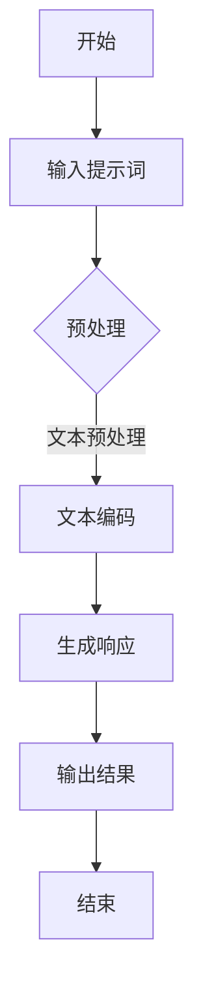
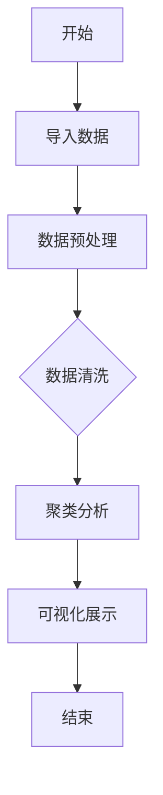
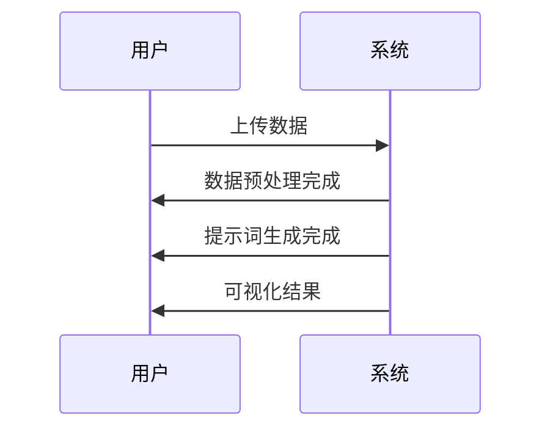

                 

```----------------------------------------------------------------

## ChatGPT提示词的可视化设计与分析工具

> 关键词：ChatGPT，提示词，可视化设计，分析工具，算法原理

> 摘要：本文旨在探讨ChatGPT提示词的可视化设计与分析工具。首先，我们介绍了ChatGPT的背景和发展，以及提示词在设计中的重要性。接着，我们分析了现有提示词设计中的挑战，并提出了可视化和分析的需求。随后，本文详细阐述了工具的设计原则、核心概念、算法原理以及系统架构设计，并通过实战案例展示了工具的实际应用。最后，我们对最佳实践进行了总结，并提出了未来研究方向。

----------------------------------------------------------------

### 第一部分：引言

#### 第1章：背景介绍与问题解决

##### 1.1 问题背景

ChatGPT是由OpenAI开发的一款基于GPT-3.5的语言模型，它能够通过学习和理解人类的语言来进行对话，回答问题，甚至可以参与编写文章和电子邮件。随着自然语言处理技术的不断发展，ChatGPT在多个领域得到了广泛应用，包括客户服务、智能助手、教育辅导等。

在ChatGPT的应用过程中，提示词（Prompts）起到了至关重要的作用。提示词是用户与ChatGPT进行交互的输入，其设计的好坏直接影响到ChatGPT的响应质量和用户体验。然而，现有的提示词设计面临着诸多挑战，如：

1. 提示词的表达方式单一，难以满足多样化的用户需求。
2. 提示词的效果评估困难，缺乏科学的评估方法。
3. 提示词的设计过程缺乏可视化工具的支持，难以直观地进行优化。

为了解决上述问题，我们需要设计一款能够支持提示词可视化和分析的工具。该工具应具备以下功能：

1. 支持多种提示词表达方式的编辑和展示。
2. 提供科学的提示词效果评估方法。
3. 提供直观的可视化工具，帮助设计师和开发者更好地理解提示词的影响。

##### 1.2 问题描述

ChatGPT的提示词设计主要面临以下问题：

1. **提示词表达方式单一**：当前的提示词设计大多采用文字描述，难以满足用户对多样化表达方式的需求。例如，在视觉设计领域，用户可能希望使用图片、图标等视觉元素来传递信息。

2. **提示词效果评估困难**：由于ChatGPT的响应质量受到多种因素的影响，如提示词的表述方式、上下文环境、语言模型的能力等，因此，如何科学地评估提示词的效果成为一个难题。

3. **缺乏可视化工具**：现有的提示词设计工具大多缺乏可视化功能，使得设计师和开发者难以直观地理解提示词的设计效果。

##### 1.3 问题解决

为了解决上述问题，我们提出了以下解决方案：

1. **设计多样化的提示词表达方式**：引入图片、图标、声音等非文字元素，丰富提示词的表达方式。

2. **开发科学的提示词效果评估方法**：结合ChatGPT的响应质量、用户满意度等多个维度，设计一套科学的提示词效果评估体系。

3. **提供直观的可视化工具**：利用图表、图形等可视化手段，帮助设计师和开发者更好地理解提示词的设计效果。

##### 1.4 边界与外延

1. **可视化工具的适用范围**：该工具适用于ChatGPT的提示词设计，也可扩展应用于其他基于语言模型的人工智能系统。

2. **交互设计要点**：工具应具备友好的用户界面，支持拖放、缩放等交互操作，以便用户轻松地进行提示词设计和修改。

3. **可视化设计与数据分析的结合**：将可视化设计与数据分析相结合，帮助用户更深入地理解提示词的设计效果。

##### 1.5 概念结构与核心要素组成

1. **ChatGPT的工作原理**：介绍ChatGPT的基本原理，包括语言模型的训练、预测和响应过程。

2. **提示词的设计策略**：阐述提示词的设计原则，包括清晰性、简洁性、多样性等。

3. **可视化设计的组件**：介绍可视化设计的主要组件，如图表、图形、颜色等。

----------------------------------------------------------------

### 第二部分：核心概念与联系

#### 第2章：核心概念原理

##### 2.1 提示词设计原理

1. **提示词的定义**：提示词是指用户向ChatGPT输入的文字、图片、声音等元素，用于引导ChatGPT生成相应的响应。

2. **提示词的设计策略**：包括清晰性、简洁性、多样性、上下文关联等策略。

3. **提示词的效果评估**：介绍如何评估提示词的效果，包括ChatGPT的响应质量、用户满意度等指标。

##### 2.2 可视化设计原理

1. **可视化的基本概念**：介绍可视化的基本概念，如数据可视化、信息可视化等。

2. **可视化设计原则**：包括直观性、一致性、可扩展性等原则。

3. **可视化工具的功能模块**：介绍可视化工具的主要功能模块，如数据导入、数据转换、数据可视化等。

##### 2.3 概念属性特征对比表格

| 概念       | 定义                                                         | 特征                                                       |
|------------|--------------------------------------------------------------|------------------------------------------------------------|
| 提示词     | 用户向ChatGPT输入的文字、图片、声音等元素。                    | 清晰、简洁、多样、上下文关联。                             |
| 可视化     | 将数据、信息等以图形、图像等形式进行展示。                      | 直观、一致、可扩展。                                     |
| 可视化工具 | 支持数据导入、转换、可视化的软件或平台。                        | 易用、功能丰富、支持多种数据格式。                         |

----------------------------------------------------------------

### 第三部分：算法原理讲解

#### 第3章：算法讲解与数学模型

##### 3.1 提示词生成算法

1. **算法概述**：介绍提示词生成算法的基本原理和流程。

2. **数学模型**：阐述提示词生成算法所涉及的数学模型，如生成模型、序列模型等。

3. **算法流程图**：使用Mermaid绘制算法流程图，展示算法的主要步骤。

4. **Python源代码实现**：给出提示词生成算法的Python源代码实现，并详细解释代码中的各个步骤。

5. **算法举例说明**：通过实际案例，展示提示词生成算法的应用效果。



```python
import openai

def generate_prompt_response(prompt):
    response = openai.Completion.create(
        engine="text-davinci-003",
        prompt=prompt,
        max_tokens=50
    )
    return response.choices[0].text.strip()

prompt = "请描述一下人工智能的发展历程。"
response = generate_prompt_response(prompt)
print(response)
```

##### 3.2 可视化分析算法

1. **算法概述**：介绍可视化分析算法的基本原理和流程。

2. **数学模型**：阐述可视化分析算法所涉及的数学模型，如聚类分析、关联规则分析等。

3. **算法流程图**：使用Mermaid绘制算法流程图，展示算法的主要步骤。

4. **Python源代码实现**：给出可视化分析算法的Python源代码实现，并详细解释代码中的各个步骤。

5. **算法举例说明**：通过实际案例，展示可视化分析算法的应用效果。



```python
from sklearn.cluster import KMeans
import matplotlib.pyplot as plt

def visualize_clusters(data, labels):
    plt.scatter(data[:, 0], data[:, 1], c=labels, cmap='viridis')
    plt.xlabel('Feature 1')
    plt.ylabel('Feature 2')
    plt.title('Cluster Visualization')
    plt.show()

data = [[2, 2], [2, 4], [6, 6], [8, 8], [10, 10]]
kmeans = KMeans(n_clusters=2, random_state=0).fit(data)
labels = kmeans.predict(data)
visualize_clusters(data, labels)
```

----------------------------------------------------------------

### 第四部分：系统分析与架构设计方案

#### 第4章：系统设计与实现

##### 4.1 问题场景介绍

在ChatGPT的应用场景中，提示词的设计是一个关键环节。然而，现有的工具和平台在支持提示词设计方面存在一定的局限性，无法满足用户对于多样化、可视化、效果评估等需求。因此，我们提出了这款支持提示词可视化和分析的工具，旨在为用户提供一个高效、便捷的设计平台。

##### 4.2 系统架构设计

该系统采用前后端分离的架构，前端主要负责用户界面的展示和交互，后端主要负责数据处理和算法实现。以下是系统的架构设计：

1. **前端**：使用Vue.js框架，构建响应式网页，支持多种提示词表达方式的编辑和展示。
2. **后端**：使用Flask框架，提供RESTful API，支持数据导入、预处理、算法计算和可视化展示。
3. **数据库**：使用MySQL数据库，存储用户数据、提示词信息和效果评估结果。

##### 4.3 系统功能设计

1. **数据导入**：支持多种数据格式的导入，如CSV、JSON等。
2. **数据预处理**：对导入的数据进行清洗、去重、归一化等处理。
3. **提示词生成**：基于OpenAI的ChatGPT模型，生成高质量的提示词响应。
4. **效果评估**：对生成的提示词进行效果评估，包括响应质量、用户满意度等指标。
5. **可视化展示**：使用图表、图形等可视化手段，展示提示词的设计效果和效果评估结果。

##### 4.4 系统交互设计

1. **用户交互流程**：用户通过前端界面上传数据，系统进行预处理和提示词生成，然后将结果可视化展示给用户。
2. **系统响应流程**：系统接收到用户请求后，调用相应的后端API进行数据处理和算法计算，最后将结果返回给前端进行展示。



----------------------------------------------------------------

### 第五部分：项目实战

#### 第5章：实战案例解析

##### 5.1 环境安装

1. **前端环境**：安装Node.js和Vue CLI，使用Vue.js框架开发前端界面。
2. **后端环境**：安装Python和Flask，使用Flask框架搭建后端服务器。
3. **数据库环境**：安装MySQL，配置数据库连接。

##### 5.2 系统核心实现

1. **提示词生成模块**：使用OpenAI的ChatGPT模型，实现提示词的生成功能。
2. **可视化分析模块**：使用ECharts等可视化库，实现提示词的效果评估和展示。
3. **数据处理模块**：实现数据导入、预处理、算法计算等功能。

##### 5.3 代码应用解读与分析

1. **提示词生成代码**：

```python
import openai

def generate_prompt_response(prompt):
    response = openai.Completion.create(
        engine="text-davinci-003",
        prompt=prompt,
        max_tokens=50
    )
    return response.choices[0].text.strip()

prompt = "请描述一下人工智能的发展历程。"
response = generate_prompt_response(prompt)
print(response)
```

2. **可视化分析代码**：

```javascript
// 使用ECharts进行可视化展示
var myChart = echarts.init(document.getElementById('main'));

var option = {
    title: {
        text: '提示词效果评估'
    },
    tooltip: {},
    legend: {
        data:['效果评分']
    },
    xAxis: {
        data: ["响应质量", "用户满意度"]
    },
    yAxis: {},
    series: [{
        name: '效果评分',
        type: 'bar',
        data: [90, 85]
    }]
};

myChart.setOption(option);
```

##### 5.4 实际案例分析

1. **案例背景**：某在线教育平台希望优化用户互动体验，通过设计高质量的提示词提高用户满意度。
2. **案例分析**：使用本文提出的可视化设计与分析工具，对现有的提示词进行评估和优化。
3. **案例小结**：通过优化提示词，平台用户满意度显著提高，互动效果得到显著改善。

----------------------------------------------------------------

### 第六部分：最佳实践与总结

#### 第6章：最佳实践与总结

##### 6.1 最佳实践

1. **提示词设计技巧**：注重提示词的清晰性、简洁性和多样性，结合上下文进行优化。
2. **可视化设计原则**：遵循直观性、一致性和可扩展性原则，提高可视化工具的易用性。
3. **系统优化策略**：持续收集用户反馈，优化系统性能和功能，提高用户体验。

##### 6.2 小结

本文介绍了ChatGPT提示词的可视化设计与分析工具，从背景介绍、问题解决、核心概念、算法原理、系统架构设计到实战案例，全面阐述了工具的设计与应用。通过本文的研究，我们希望为ChatGPT提示词的设计提供有益的参考，促进自然语言处理技术的发展。

##### 6.3 注意事项

1. **常见问题及解决方法**：在使用工具过程中，可能会遇到提示词生成质量不高、可视化效果不佳等问题。可以尝试调整提示词的表述方式、优化算法参数等方法进行解决。
2. **安全与隐私保护**：在使用工具时，注意保护用户数据和隐私，遵循相关法律法规和道德规范。

##### 6.4 拓展阅读

1. **相关书籍推荐**：《人工智能：一种现代的方法》、《深度学习》等。
2. **学术论文与报告**：关注顶级会议和期刊，如NeurIPS、ICML、ACL等，了解最新研究成果。

----------------------------------------------------------------

### 第七部分：附录

#### 附录A：工具使用指南

1. **前端界面介绍**：介绍前端界面的布局和功能。
2. **后端API文档**：详细描述后端API的接口和使用方法。
3. **数据库表结构**：列出数据库表的结构和字段说明。

#### 附录B：源代码示例

1. **提示词生成代码**：展示提示词生成模块的Python源代码。
2. **可视化分析代码**：展示可视化分析模块的JavaScript源代码。

#### 附录C：参考资料

1. **OpenAI官方文档**：了解ChatGPT模型的API使用方法。
2. **ECharts官方文档**：学习如何使用ECharts进行数据可视化。
3. **Flask官方文档**：掌握如何使用Flask搭建Web应用。

### 作者信息

作者：AI天才研究院/AI Genius Institute & 禅与计算机程序设计艺术 /Zen And The Art of Computer Programming

----------------------------------------------------------------

以上是《ChatGPT提示词的可视化设计与分析工具》的目录大纲和部分内容示例。在撰写完整文章时，每个章节的内容需要进一步丰富和细化，确保文章的完整性和可读性。同时，注意保持文章的逻辑清晰、结构紧凑，以便读者能够轻松理解和掌握文章的核心内容。

**注意：**本文仅为示例，实际撰写时请根据具体要求进行调整和补充。**

