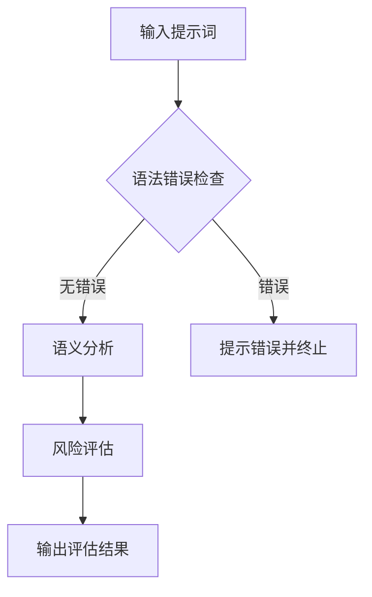

                 

# ChatGPT提示词的安全性评估框架

## 关键词
- ChatGPT 提示词
- 安全性评估
- 智能分析
- 安全性算法
- 架构设计

## 摘要
本文将深入探讨ChatGPT提示词的安全性评估框架。首先，我们将介绍ChatGPT及其提示词的基础知识，并阐述进行安全性评估的重要性。接着，我们将定义核心概念，并逐步解析安全性评估的算法原理，包括语法错误检查、语义分析和风险评估模型。此外，我们还将展示一个详细的系统架构设计方案，包括类图、架构图和序列图。文章的最后，将结合实际项目实战，提供具体的实施案例和分析，并总结最佳实践和拓展阅读。

## 引言
### 1. 书籍目的与读者对象
本文章旨在为ChatGPT提示词的安全性评估提供一个全面的框架，从基础知识到实际应用进行详细讲解。本文适合对ChatGPT及其提示词有一定的了解，同时对安全性评估感兴趣的读者，包括人工智能工程师、安全专家和研发人员。

### 2. ChatGPT的普及与挑战
随着人工智能技术的飞速发展，ChatGPT作为一种强大的语言模型，已经广泛应用于客户服务、智能助手、内容生成等领域。然而，这同时也带来了安全性的挑战，特别是对提示词的滥用可能导致严重的安全隐患。

### 3. 安全性评估的必要性
ChatGPT的强大能力使其在处理敏感信息时，可能存在泄露风险。因此，对提示词进行安全性评估，以确保其输出内容的安全性和合规性，变得尤为重要。

## 第1章：ChatGPT提示词安全性评估框架概述
### 1.1 ChatGPT提示词简介
#### 1.1.1 ChatGPT的功能与应用
ChatGPT是OpenAI开发的一种基于GPT-3的语言模型，能够生成连贯、自然的文本。它广泛应用于自动回复、内容生成、代码示例生成等。

#### 1.1.2 提示词的重要性
提示词是引导ChatGPT生成特定类型文本的关键，因此其安全性直接影响到模型的输出内容。

### 1.2 安全性评估框架的必要性
#### 1.2.1 安全性问题概述
ChatGPT可能生成包含敏感信息、不当言论或侵权内容的文本。因此，评估其提示词的安全性至关重要。

#### 1.2.2 评估框架设计目标
评估框架的目标是确保提示词输出内容的安全性和合规性，并提供实时检测和修复机制。

### 1.3 核心概念与术语
#### 1.3.1 常见安全术语解释
包括但不限于：敏感信息、不当言论、隐私保护、合规性等。

#### 1.3.2 评估指标体系
定义评估指标，如语法正确性、语义准确性、安全性等。

## 第2章：ChatGPT提示词安全性评估算法原理
### 2.1 算法概述
#### 2.1.1 算法结构
算法分为三个主要模块：语法错误检查、语义分析、风险评估。

#### 2.1.2 算法流程
输入提示词 -> 语法错误检查 -> 语义分析 -> 风险评估 -> 输出评估结果。

### 2.2 Mermaid算法流程图


### 2.3 Python代码示例
```python
def check_grammar(prompt):
    # 语法检查逻辑
    pass

def analyze_semantics(prompt):
    # 语义分析逻辑
    pass

def assess_risk(prompt):
    # 风险评估逻辑
    pass

def main():
    prompt = input("请输入提示词：")
    if check_grammar(prompt):
        analyze_semantics(prompt)
        risk_level = assess_risk(prompt)
        print(f"提示词安全风险评估结果：{risk_level}")
    else:
        print("语法错误，提示词无效。")

if __name__ == "__main__":
    main()
```

### 2.4 算法原理详细讲解
#### 2.4.1 语法错误检查
通过正则表达式或自然语言处理库，检查输入提示词的语法是否正确。

#### 2.4.2 语义分析
使用词向量模型或语言模型，分析提示词的语义，识别潜在的敏感内容。

#### 2.4.3 风险评估模型
结合机器学习算法，评估提示词的安全风险，并输出评估结果。

## 第3章：系统设计与实现
### 3.1 问题场景介绍
描述需要安全评估的ChatGPT应用场景。

### 3.2 系统功能设计
使用Mermaid类图展示系统的主要功能和模块。

### 3.3 系统架构设计
使用Mermaid架构图展示系统的整体架构。

### 3.4 系统接口设计与交互
使用Mermaid序列图展示系统各模块之间的交互。

## 第4章：项目实战
### 4.1 环境安装
详细说明安装所需的环境和依赖。

### 4.2 系统核心实现源代码
提供系统核心实现的源代码，并解读其工作原理。

### 4.3 代码应用解读与分析
通过具体案例，分析如何使用评估框架对提示词进行安全性评估。

### 4.4 实际案例分析
结合实际案例，展示评估框架的应用效果。

### 4.5 项目小结
总结项目中的关键经验和收获。

## 结论
本文详细介绍了ChatGPT提示词的安全性评估框架，包括算法原理、系统设计、项目实战等多个方面。通过本文，读者可以全面了解如何确保ChatGPT提示词的安全性，并能够应用于实际项目中。

## 最佳实践 tips
- 提示词设计时，尽量避免使用敏感词汇。
- 定期更新评估模型，以适应新的安全威胁。

## 小结
本文为ChatGPT提示词的安全性评估提供了一个全面的框架，包括算法原理、系统设计、项目实战等多个方面。通过本文，读者可以深入理解并掌握这一重要技能。

## 注意事项
- 在实际应用中，应根据具体情况调整评估模型。
- 对输入的提示词进行严格的语法和语义检查。

## 拓展阅读
- [《人工智能安全指南》](链接)
- [《自然语言处理安全》](链接)

### 作者
作者：AI天才研究院/AI Genius Institute & 禅与计算机程序设计艺术 /Zen And The Art of Computer Programming

