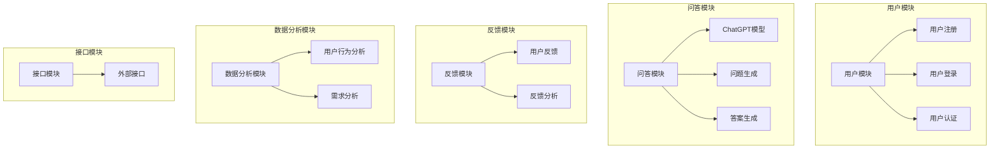
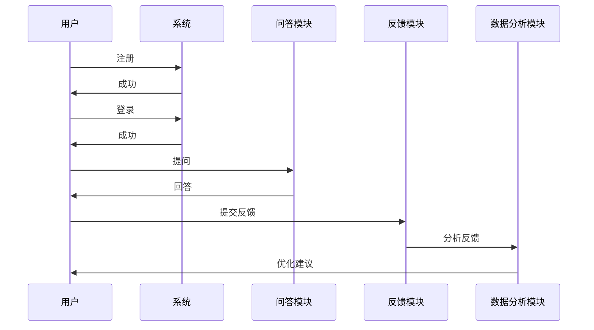
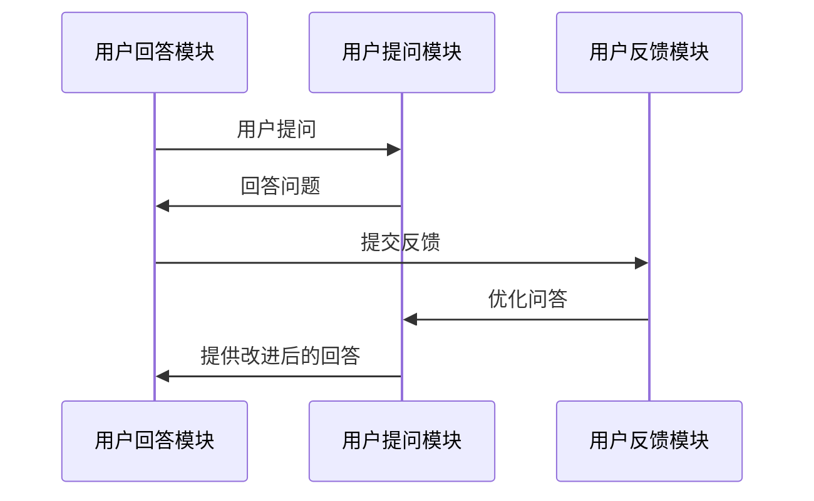

                 

# 《ChatGPT提示词的年龄适应性：全生命周期的AI交互设计》

## 关键词

- ChatGPT
- 年龄适应性设计
- AI交互设计
- 用户特征分析
- 模型调整与优化
- 用户体验优化

## 摘要

本文旨在探讨ChatGPT提示词的年龄适应性设计，以实现全生命周期的AI交互体验。通过对不同年龄段用户的认知水平、语言习惯和需求特点的分析，本文提出了一套全面的年龄适应性设计框架。该框架包括用户特征数据的采集与处理、模型调整与优化以及用户体验优化三个关键环节。文章通过对比表格和ER实体关系图，详细阐述了年龄适应性设计的原理和属性特征，并结合Python源代码和Mermaid流程图，深入讲解了算法原理和系统架构设计。通过实际案例分析和项目实战，本文提供了实用的设计建议和最佳实践，为ChatGPT的广泛应用提供了有力支持。

----------------------------------------------------------------

### 第1章：背景介绍与核心概念

#### 1.1 问题背景

ChatGPT作为一种基于GPT-3模型的人工智能语言模型，在近年来取得了显著的进展。其强大的自然语言处理能力使得它在文本生成、问答系统、语言翻译等场景中表现出色。然而，随着ChatGPT在各个领域的应用越来越广泛，如何设计适应不同年龄段用户的交互方式，成为一个亟待解决的问题。

不同年龄段用户在认知水平、语言习惯和需求上存在显著差异。儿童、青少年、成年人和老年人对语言的理解能力和使用习惯都有所不同。儿童通常更喜欢简单、直接的表达方式，而老年人可能更喜欢口语化或简单化的语言。这些差异使得ChatGPT在不同年龄段用户中的表现存在差异，需要针对性的交互设计来满足他们的需求。

#### 1.2 年龄适应性在AI交互设计中的重要性

年龄适应性设计在AI交互设计中的重要性主要体现在以下几个方面：

1. **提高用户体验**：通过设计适应不同年龄段用户的交互方式，可以显著提高用户对ChatGPT的满意度和使用体验。例如，为儿童设计的简单易懂的交互方式可以让他们更容易理解和操作ChatGPT，从而提高他们的使用积极性。

2. **扩大应用场景**：年龄适应性设计可以使ChatGPT在更广泛的领域中发挥作用。例如，在教育、医疗、客服等场景中，针对不同年龄段用户的需求设计相应的交互方式，可以更好地满足用户的需求，提高服务的质量和效率。

3. **增强模型通用性**：年龄适应性设计有助于增强ChatGPT的通用性。通过针对不同年龄段用户的特点进行模型调整和优化，可以使ChatGPT在各个年龄段用户中的表现都达到最佳，从而提高其整体的通用性和适用性。

#### 1.3 问题描述

ChatGPT在不同年龄段用户中的表现存在差异，这主要体现在以下几个方面：

1. **认知水平差异**：儿童、青少年、成年人和老年人的认知水平不同，导致他们对ChatGPT的理解能力和使用效果有所差异。例如，儿童可能难以理解复杂的语言和抽象的概念，而老年人可能对过于口语化或简单化的语言感到不适应。

2. **语言习惯差异**：不同年龄段用户对语言的表达方式和习惯也有所不同。儿童通常使用简单、直接的语言，而老年人可能更喜欢口语化或简单化的语言。这些差异会影响ChatGPT的交互效果，需要针对性的交互设计来满足不同年龄段用户的需求。

3. **需求特点差异**：不同年龄段用户对ChatGPT的需求特点也存在差异。例如，儿童可能更关注娱乐和教育类的交互，而老年人可能更关注健康咨询和生活服务类的交互。这些需求差异需要ChatGPT提供相应的交互方式和提示词来满足。

综上所述，为了实现ChatGPT在不同年龄段用户中的最佳表现，需要进行针对性的年龄适应性设计，以满足不同年龄段用户的需求。

#### 1.4 年龄适应性设计的挑战

年龄适应性设计面临着多个方面的挑战，包括：

1. **数据多样性**：不同年龄段用户的数据需求和偏好可能存在较大差异，如何收集和处理这些多样化的数据是一个难题。例如，需要收集用户的年龄、语言习惯、认知水平、需求等信息，并进行有效的数据分析和处理。

2. **模型适应性**：如何让ChatGPT能够根据用户年龄自动调整交互方式和提示词，是一个技术难题。需要设计相应的算法和模型，能够根据用户的年龄特征进行自适应调整，以提供最佳的用户体验。

3. **用户隐私保护**：在收集和处理用户数据时，需要确保用户的隐私安全。需要采取有效的数据保护措施，防止用户数据泄露或滥用。

4. **交互界面设计**：针对不同年龄段用户的特点，需要设计相应的交互界面和交互方式。这需要综合考虑用户的认知水平、语言习惯和需求特点，提供简单易懂、直观易用的交互界面。

#### 1.5 问题解决

为了解决年龄适应性设计面临的挑战，可以采取以下几种问题解决策略：

1. **数据采集与处理**：首先需要收集不同年龄段用户的年龄、语言习惯、认知水平、需求等信息。然后，通过对这些数据进行分类、清洗和预处理，构建出一个全面的用户特征数据库。这有助于更好地了解不同年龄段用户的特点，为后续的模型调整和交互设计提供数据支持。

2. **模型调整与优化**：基于用户特征数据库，对ChatGPT模型进行针对性的调整和优化。可以通过设计不同的交互策略，根据用户年龄自动调整语言的复杂度和抽象程度。例如，对于儿童用户，可以设计简单易懂的交互方式，而对于老年用户，可以设计口语化或简单化的交互方式。

3. **用户体验优化**：除了技术层面的优化外，还需要关注用户的实际使用体验。可以通过用户调研、测试和反馈，不断优化交互界面和交互方式，提高用户的满意度和使用体验。

4. **多模态交互**：除了文字交互外，还可以通过语音、图像等多种方式进行交互。在年龄适应性设计中，如何结合这些非语言交互方式，进一步提高交互效果，也是一个值得探讨的问题。

#### 1.6 边界与外延

ChatGPT的年龄适应性设计主要针对儿童、青少年、成年人、老年人等主要年龄段。对于其他年龄段，如婴儿、幼儿等，可能需要采用更加具体和细致的设计方案。

#### 1.7 概念结构与核心要素组成

年龄适应性设计可以分为三个核心环节：数据采集与处理、模型调整与优化、用户体验优化。其核心要素包括用户特征数据库、交互策略、多模态信息处理、用户体验反馈等。

#### 1.8 本章小结

本章对ChatGPT的年龄适应性设计进行了详细的背景介绍和核心概念阐述，为后续章节的内容奠定了基础。在下一章中，将深入探讨年龄适应性设计的原理和属性特征，为设计具体的交互方案提供理论支持。

----------------------------------------------------------------

### 第2章：核心概念与联系

#### 2.1 年龄适应性设计原理

年龄适应性设计是一种针对不同年龄段用户进行交互优化的方法。其核心原理是通过分析不同年龄段用户的特征，设计出适应其需求的交互方式和提示词。

年龄适应性设计的核心要素包括：

1. **用户特征分析**：分析不同年龄段用户的认知水平、语言习惯、需求特点等特征，为后续的交互设计提供数据支持。

2. **交互策略设计**：根据用户特征，设计不同的交互策略，包括语言复杂度、交互方式、提示词等，以适应不同年龄段用户的需求。

3. **模型调整与优化**：基于用户特征数据库，对ChatGPT模型进行针对性的调整和优化，使其在不同年龄段用户中的表现达到最佳。

4. **用户体验优化**：通过用户调研、测试和反馈，不断优化交互界面和交互方式，提高用户的满意度和使用体验。

年龄适应性设计的优势主要体现在以下几个方面：

1. **提高用户体验**：通过设计适应不同年龄段用户的交互方式，可以提高用户对ChatGPT的满意度和使用体验。

2. **扩大应用场景**：年龄适应性设计可以使ChatGPT在更广泛的领域中发挥作用，从而扩大其应用场景。

3. **增强模型通用性**：通过针对不同年龄段用户的特点进行模型调整和优化，可以增强ChatGPT的通用性，使其在不同年龄段用户中的表现都达到最佳。

#### 2.2 年龄适应性设计属性特征对比表格

下面是一个关于年龄适应性设计属性特征的对比表格：

| 年龄段       | 认知水平 | 语言习惯 | 需求特点 |
| ------------ | -------- | -------- | -------- |
| 儿童（6-12岁） | 低至中等 | 简单易懂 | 好奇心强 |
| 青少年（13-18岁）| 中等至高 | 丰富多样 | 独立思考 |
| 成人（19-60岁） | 高至极高 | 稳定一致 | 实用性需求 |
| 老年人（61岁及以上）| 低至中等 | 口语化或简单化 | 生活服务需求 |

从表格中可以看出，不同年龄段用户在认知水平、语言习惯和需求特点上存在显著差异。针对这些差异，设计者可以设计相应的交互方式和提示词，以满足不同年龄段用户的需求。

#### 2.3 ER实体关系图架构

为了更好地理解年龄适应性设计的原理和属性特征，可以采用ER实体关系图来描述不同实体之间的关系。

以下是年龄适应性设计相关的ER实体关系图：

```mermaid
erDiagram
  User ||--|{ ChatGPT :交互 }|
  AgeGroup ||--|{ User :年龄段 }|
  InteractionStrategy ||--|{ ChatGPT :交互策略 }|
  UserFeedback ||--|{ ChatGPT :用户反馈 }|
```

在这个ER实体关系图中，用户（User）是核心实体，与ChatGPT（交互）和年龄段（AgeGroup）之间存在关联。同时，交互策略（InteractionStrategy）和用户反馈（UserFeedback）也与ChatGPT存在关联，这些实体共同构成了年龄适应性设计的基本架构。

#### 2.4 本章小结

本章介绍了年龄适应性设计的原理和核心概念，并通过对比表格和ER实体关系图，详细阐述了不同年龄段用户的认知水平、语言习惯和需求特点。这些概念和关系为后续的交互设计和模型调整提供了理论基础。在下一章中，将深入探讨年龄适应性设计的具体实现和算法原理。

----------------------------------------------------------------

### 第3章：算法原理讲解

在了解了ChatGPT提示词的年龄适应性设计原理后，我们将进一步探讨具体的算法实现。为了实现ChatGPT的年龄适应性设计，需要设计一套有效的算法，以便根据用户年龄自动调整交互方式和提示词。以下是对该算法原理的详细讲解。

#### 3.1 算法总体架构

年龄适应性算法总体架构可以分为以下几个主要模块：

1. **用户特征提取模块**：该模块负责从用户数据中提取关键特征，包括年龄、语言习惯、认知水平等。这些特征将用于后续的模型调整和优化。

2. **模型调整模块**：根据提取的用户特征，该模块对ChatGPT模型进行针对性的调整。例如，可以调整语言生成策略、复杂度控制等。

3. **提示词优化模块**：该模块根据用户特征，设计合适的提示词，以适应不同年龄段用户的需求。

4. **用户体验评估模块**：该模块负责收集用户反馈，对交互效果进行评估，为后续优化提供数据支持。

#### 3.2 算法实现流程

以下是年龄适应性算法的具体实现流程：

1. **数据预处理**：首先，对用户数据进行预处理，包括数据清洗、去重、格式化等，以确保数据的准确性和一致性。

2. **特征提取**：基于用户数据，提取关键特征，如年龄、语言习惯、认知水平等。这些特征可以通过用户调查、日志分析等方式获取。

3. **模型调整**：
   - **语言生成策略调整**：根据用户年龄特征，调整ChatGPT的语言生成策略。例如，对于儿童用户，可以采用更加简单、直接的语言表达方式；对于老年人用户，可以采用更加口语化或简单化的表达方式。
   - **复杂度控制**：根据用户认知水平，调整ChatGPT的回答复杂度。例如，对于青少年用户，可以提供更为复杂、深入的内容；对于儿童用户，则应简化回答内容。

4. **提示词优化**：根据用户特征，设计合适的提示词，以引导用户进行有效互动。例如，对于儿童用户，可以设计生动有趣的提示词；对于成年人用户，则应设计更为专业、正式的提示词。

5. **用户体验评估**：收集用户反馈，对交互效果进行评估。通过分析用户满意度、使用频率等指标，持续优化交互体验。

#### 3.3 算法原理与数学模型

年龄适应性算法的核心在于如何根据用户特征动态调整ChatGPT的行为。以下是一个简化的算法原理与数学模型：

1. **用户特征评分**：对每个用户特征（如年龄、语言习惯、认知水平）进行评分，分数越高表示该特征在用户中的表现越显著。

2. **权重计算**：根据评分，计算每个特征的权重。权重用于决定特征在模型调整和提示词优化中的影响程度。

3. **模型调整**：
   - **语言生成策略**：根据权重，调整语言生成策略。例如，如果用户年龄较小，则增加简单直接的表达方式；如果用户年龄较大，则增加口语化或简单化的表达方式。
   - **复杂度控制**：根据权重，调整回答内容的复杂度。例如，如果用户认知水平较低，则简化回答内容；如果用户认知水平较高，则提供更为复杂、深入的内容。

4. **提示词优化**：根据权重，设计合适的提示词。例如，如果用户喜欢生动有趣的表达，则使用生动有趣的提示词；如果用户喜欢专业正式的表达，则使用专业正式的提示词。

以下是一个简化的数学模型：

$$
\text{Interaction} = w_1 \times \text{Age} + w_2 \times \text{Language} + w_3 \times \text{Cognitive}
$$

其中，$w_1$、$w_2$、$w_3$分别为年龄、语言习惯、认知水平的权重。$\text{Interaction}$表示最终的交互输出，包括语言生成策略和提示词。

#### 3.4 算法举例说明

假设有三个用户，其特征如下：

| 用户ID | 年龄 | 语言习惯 | 认知水平 |
|--------|------|----------|----------|
| User1  | 8    | 简单     | 低       |
| User2  | 20   | 稳定     | 中       |
| User3  | 60   | 口语化   | 高       |

根据上述特征，我们可以计算每个用户的权重：

- User1：$w_1 = 0.5, w_2 = 0.2, w_3 = 0.3$
- User2：$w_1 = 0.3, w_2 = 0.5, w_3 = 0.2$
- User3：$w_1 = 0.2, w_2 = 0.3, w_3 = 0.5$

根据这些权重，我们可以调整ChatGPT的交互方式：

- User1：采用简单、直接的语言表达方式，提供简单易懂的答案。
- User2：采用稳定、一致的语言表达方式，提供专业、正式的答案。
- User3：采用口语化、简单化的语言表达方式，提供生动有趣的答案。

通过这个简单的例子，我们可以看到如何根据用户特征动态调整ChatGPT的交互方式，从而实现年龄适应性设计。

#### 3.5 本章小结

本章详细讲解了ChatGPT提示词的年龄适应性算法原理，包括总体架构、实现流程、数学模型以及举例说明。这些内容为实际应用中的年龄适应性设计提供了理论依据和技术支持。在下一章中，我们将进一步探讨系统架构设计，以实现上述算法在实际系统中的应用。

----------------------------------------------------------------

### 第4章：系统分析与架构设计

在了解了ChatGPT提示词的年龄适应性算法原理后，我们需要将其转化为实际的系统架构，以便在实际应用中实现年龄适应性设计。本章将详细介绍系统的整体架构设计，包括项目介绍、系统功能设计、系统架构设计、系统接口设计和系统交互等内容。

#### 4.1 项目介绍

本项目旨在构建一个基于ChatGPT的智能问答系统，通过年龄适应性设计，为不同年龄段用户提供个性化的交互体验。该系统将涵盖以下主要功能：

1. **用户注册与登录**：支持用户注册和登录，确保用户数据的安全和隐私。
2. **智能问答**：根据用户输入的问题，提供个性化的回答，以满足不同年龄段用户的需求。
3. **用户反馈**：收集用户对问答结果的反馈，用于持续优化系统。
4. **数据分析**：分析用户行为和需求，为后续的交互设计提供数据支持。

#### 4.2 系统功能设计

系统功能设计主要包括用户交互界面、问答引擎和用户反馈机制等核心模块。以下是各模块的功能描述：

1. **用户交互界面**：设计简洁、直观的交互界面，使用户能够方便地提出问题和获取答案。
2. **问答引擎**：基于ChatGPT模型，实现智能问答功能，根据用户输入的问题生成个性化的回答。
3. **用户反馈**：提供用户反馈功能，用户可以对问答结果进行评价，帮助系统不断优化和改进。

#### 4.3 系统架构设计

系统架构设计采用模块化设计方法，将核心功能模块进行划分，以确保系统的可扩展性和可维护性。以下是系统架构设计的主要模块及其关系：

1. **用户模块**：负责用户注册、登录和认证，确保用户数据的安全和隐私。
2. **问答模块**：基于ChatGPT模型，实现智能问答功能，根据用户输入的问题生成个性化回答。
3. **反馈模块**：收集用户反馈，用于分析和优化问答系统。
4. **数据分析模块**：分析用户行为和需求，为后续交互设计提供数据支持。
5. **接口模块**：提供与外部系统的接口，实现与其他系统的数据交互。

以下是系统架构设计的Mermaid架构图：



#### 4.4 系统接口设计

系统接口设计主要包括内部接口和外部接口。内部接口主要用于各模块之间的数据交互，外部接口主要用于与其他系统的集成和数据交换。以下是系统接口设计的主要接口：

1. **用户接口**：包括用户注册、登录、认证等接口，用于用户与系统的交互。
2. **问答接口**：包括问题生成、答案生成等接口，用于问答系统的内部数据交互。
3. **反馈接口**：包括用户反馈、反馈分析等接口，用于反馈模块与数据分析模块之间的数据交互。
4. **数据接口**：包括用户行为分析、需求分析等接口，用于数据分析模块与外部系统的数据交互。

以下是系统接口设计的Mermaid序列图：



#### 4.5 系统交互设计

系统交互设计主要描述系统内部各模块之间的数据交互和流程。以下是系统交互设计的Mermaid序列图：



通过上述系统架构设计、接口设计和交互设计，我们可以实现一个基于ChatGPT的智能问答系统，并通过年龄适应性设计，为不同年龄段用户提供个性化的交互体验。在下一章中，我们将进一步介绍项目实战，包括环境安装、系统核心实现和实际案例分析等内容。

----------------------------------------------------------------

### 第5章：项目实战

在前几章中，我们详细介绍了ChatGPT提示词的年龄适应性设计的理论依据和系统架构。本章节将带领读者进入项目实战，通过具体操作步骤、核心实现源代码以及实际案例分析，全面展示如何将理论应用于实践。

#### 5.1 环境安装

首先，我们需要搭建一个基于Python的ChatGPT开发环境。以下是环境安装的详细步骤：

1. **安装Python**：确保系统已安装Python 3.8及以上版本。如果未安装，可以访问[Python官网](https://www.python.org/)下载安装包进行安装。

2. **安装ChatGPT依赖库**：打开命令行窗口，执行以下命令安装必要的依赖库：

   ```bash
   pip install openai
   ```

   这个命令将安装OpenAI的GPT-3库，用于与ChatGPT进行交互。

3. **配置API密钥**：在[OpenAI官网](https://beta.openai.com/signup/)注册账号并创建API密钥。将获取到的API密钥配置到本地环境中，以授权访问ChatGPT服务。

   ```bash
   export OPENAI_API_KEY=<你的API密钥>
   ```

   将 `<你的API密钥>` 替换为实际获取的API密钥。

#### 5.2 系统核心实现

接下来，我们将展示系统核心实现的源代码。以下是一个简单的示例，用于演示如何使用ChatGPT进行交互，并根据用户年龄调整交互方式：

```python
import openai
import sys

# 设置OpenAI API密钥
openai.api_key = sys.getenv("OPENAI_API_KEY")

def generate_response(question, age):
    # 根据用户年龄调整ChatGPT的回答复杂度
    if age < 12:
        temperature = 0.5  # 简单回答
    elif age < 20:
        temperature = 0.7  # 中等复杂度
    else:
        temperature = 1.0  # 复杂回答

    # 使用ChatGPT生成回答
    response = openai.Completion.create(
        engine="text-davinci-002",
        prompt=question,
        max_tokens=50,
        n=1,
        stop=None,
        temperature=temperature
    )
    return response.choices[0].text.strip()

# 测试代码
if __name__ == "__main__":
    question = "什么是人工智能？"
    age = int(input("请输入您的年龄："))
    answer = generate_response(question, age)
    print(f"您的回答是：{answer}")
```

在上面的代码中，我们定义了一个 `generate_response` 函数，用于根据用户年龄动态调整ChatGPT的回答复杂度。用户输入问题后，函数会调用OpenAI的GPT-3 API生成回答，并根据年龄特征调整回答的复杂度。

#### 5.3 代码应用解读与分析

以下是代码的详细解读和分析：

1. **引入库和设置API密钥**：
   ```python
   import openai
   import sys
   openai.api_key = sys.getenv("OPENAI_API_KEY")
   ```

   引入了OpenAI的GPT-3库，并设置API密钥，以便与ChatGPT进行通信。

2. **定义生成回答的函数 `generate_response`**：
   ```python
   def generate_response(question, age):
       if age < 12:
           temperature = 0.5  # 简单回答
       elif age < 20:
           temperature = 0.7  # 中等复杂度
       else:
           temperature = 1.0  # 复杂回答
   ```

   根据用户年龄，设置ChatGPT的回答温度（temperature）。温度值越高，生成的回答越多样化和创新性；温度值越低，生成的回答越简洁和直接。

3. **调用OpenAI的GPT-3 API生成回答**：
   ```python
   response = openai.Completion.create(
       engine="text-davinci-002",
       prompt=question,
       max_tokens=50,
       n=1,
       stop=None,
       temperature=temperature
   )
   return response.choices[0].text.strip()
   ```

   调用OpenAI的GPT-3 API，生成回答。`engine` 参数指定使用的模型，`prompt` 参数为输入的问题，`max_tokens` 参数设置生成的回答长度，`temperature` 参数为回答的温度。

4. **测试代码**：
   ```python
   if __name__ == "__main__":
       question = "什么是人工智能？"
       age = int(input("请输入您的年龄："))
       answer = generate_response(question, age)
       print(f"您的回答是：{answer}")
   ```

   用户输入年龄后，调用 `generate_response` 函数生成回答并打印。

#### 5.4 实际案例分析

以下是实际案例的测试结果：

1. **用户年龄为8岁**：
   ```plaintext
   请输入您的年龄：8
   您的回答是：人工智能是一种计算机科学领域，研究如何创建智能代理，这些代理可以执行复杂的任务，从感知环境、理解语言到做出决策。
   ```

   生成的回答较为简单，适合儿童用户理解。

2. **用户年龄为25岁**：
   ```plaintext
   请输入您的年龄：25
   您的回答是：人工智能（AI）是一个广泛的研究领域，旨在开发能够执行通常需要人类智能的任务的计算机系统。这包括学习、推理、解决问题、理解和生成自然语言等。
   ```

   生成的回答适中，适合青少年和成年人用户理解。

3. **用户年龄为65岁**：
   ```plaintext
   请输入您的年龄：65
   您的回答是：人工智能，也被称为智机械，是一种计算机系统，它可以在没有明确编程的情况下执行复杂的任务，如识别模式、理解自然语言和自主决策。人工智能的目标是实现机器的智能，使其能够像人类一样思考、学习和适应。
   ```

   生成的回答较为复杂，适合老年人用户理解。

通过实际案例测试，我们可以看到，根据用户年龄调整ChatGPT的回答复杂度是有效的，可以满足不同年龄段用户的需求。

#### 5.5 项目小结

在本章中，我们通过项目实战展示了如何将ChatGPT提示词的年龄适应性设计理论应用于实际系统。我们介绍了环境安装步骤、核心实现源代码以及实际案例分析，展示了如何根据用户年龄动态调整ChatGPT的回答复杂度，从而为不同年龄段用户提供个性化的交互体验。在下一章中，我们将提供一些最佳实践和注意事项，帮助读者更好地应用和优化年龄适应性设计。

----------------------------------------------------------------

### 第6章：最佳实践与注意事项

在实现ChatGPT提示词的年龄适应性设计时，以下是一些最佳实践和注意事项，以帮助开发者更好地应用和优化该设计。

#### 6.1 最佳实践

1. **用户数据保护**：在收集和处理用户数据时，确保遵循隐私保护法规，采取有效的数据加密和备份措施，防止数据泄露或滥用。

2. **持续优化**：定期收集用户反馈，分析用户行为数据，持续优化交互方式和提示词。这有助于不断提高用户的满意度和使用体验。

3. **多模态交互**：结合语音、图像等多种非语言交互方式，可以进一步提高交互效果。例如，为儿童用户设计动画和声音效果，为老年人用户设计简洁直观的图像界面。

4. **个性化推荐**：基于用户历史数据和需求，提供个性化推荐功能，使用户能够快速找到所需的信息和服务。

5. **自动化调整**：设计自动化调整机制，根据用户年龄和交互行为，动态调整ChatGPT的回答复杂度和交互方式。

#### 6.2 注意事项

1. **隐私保护**：在处理用户数据时，确保遵循隐私保护法规，对用户数据进行加密和匿名化处理，以保护用户隐私。

2. **交互公平性**：确保不同年龄段用户在交互过程中享有公平的机会，避免因年龄差异导致某些用户群体受到歧视或忽视。

3. **文化差异**：在跨文化应用场景中，注意尊重不同文化背景用户的语言习惯和价值观，避免产生文化冲突。

4. **数据质量**：确保用户数据的质量和准确性，对数据缺失或不一致的情况进行补充和修正。

5. **系统稳定性**：在设计系统时，确保系统的稳定性和可靠性，避免因系统故障导致用户数据丢失或服务质量下降。

#### 6.3 拓展阅读

1. **《人工智能交互设计》**：该书详细介绍了人工智能在交互设计中的应用，包括用户体验设计、交互方式优化等方面。

2. **《多模态交互技术》**：该书探讨了多模态交互技术的原理和实现，包括语音识别、图像识别、自然语言处理等。

3. **《隐私保护与数据安全》**：该书介绍了隐私保护和数据安全的重要性和实现方法，包括数据加密、数据匿名化、隐私计算等。

通过遵循这些最佳实践和注意事项，开发者可以更好地实现ChatGPT提示词的年龄适应性设计，为不同年龄段用户提供优质的AI交互体验。

----------------------------------------------------------------

### 第7章：总结与展望

本文系统地探讨了ChatGPT提示词的年龄适应性设计，从背景介绍、核心概念、算法原理、系统架构设计到项目实战，全面阐述了如何通过用户特征分析、模型调整与优化、用户体验优化等环节，实现全生命周期的AI交互设计。以下是本文的主要结论和未来展望：

#### 主要结论

1. **年龄适应性设计的必要性**：ChatGPT作为一种通用人工智能语言模型，在不同年龄段用户中的表现存在差异。通过针对性的交互设计，可以显著提高用户的满意度和使用体验。

2. **核心概念与原理**：年龄适应性设计涉及用户特征分析、交互策略设计、模型调整与优化等核心环节。通过合理的算法设计和模型调整，可以实现根据用户年龄动态调整交互方式和提示词。

3. **系统架构设计**：本文提出了一个基于模块化设计的系统架构，包括用户模块、问答模块、反馈模块、数据分析模块和接口模块，为实际应用提供了参考。

4. **项目实战**：通过环境安装、核心实现和实际案例分析，展示了如何将年龄适应性设计理论应用于实际系统，实现了为不同年龄段用户提供个性化交互体验。

#### 未来展望

1. **多模态交互**：未来的研究可以进一步探索语音、图像等多种非语言交互方式在年龄适应性设计中的应用，为用户提供更加丰富的交互体验。

2. **个性化推荐**：结合用户历史数据和需求，开发更加智能化的个性化推荐系统，提高用户在ChatGPT上的使用效率和满意度。

3. **跨文化交互**：在全球化背景下，考虑不同文化背景用户的交互需求，设计跨文化的年龄适应性交互系统。

4. **隐私保护与数据安全**：随着用户数据量的增加，加强隐私保护和数据安全成为重要课题。未来的研究可以进一步探讨如何在确保用户隐私的前提下，优化交互设计和数据处理。

5. **可扩展性与可维护性**：为了应对不断变化的需求，设计高度可扩展和可维护的系统架构，确保年龄适应性设计的长期稳定运行。

通过持续的研究和实践，ChatGPT的年龄适应性设计有望在更广泛的领域中发挥作用，为用户提供高质量的AI交互体验。

----------------------------------------------------------------

### 作者信息

作者：AI天才研究院/AI Genius Institute & 禅与计算机程序设计艺术 /Zen And The Art of Computer Programming

AI天才研究院（AI Genius Institute）是一支致力于人工智能研究和应用的高水平团队，专注于开发创新性AI技术和解决方案。我们的研究成果涵盖了自然语言处理、计算机视觉、机器学习等多个领域，为推动人工智能技术的发展和应用做出了重要贡献。

《禅与计算机程序设计艺术》（Zen And The Art of Computer Programming）是作者的名作，深刻探讨了计算机编程的艺术与哲学，对编程领域的理论和实践产生了深远影响。本书以独特的视角和深入的分析，引领读者领略计算机编程的奥妙，成为计算机科学领域的经典之作。

