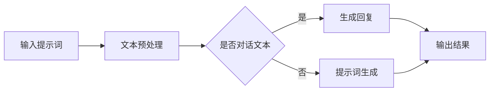
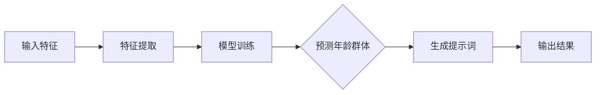
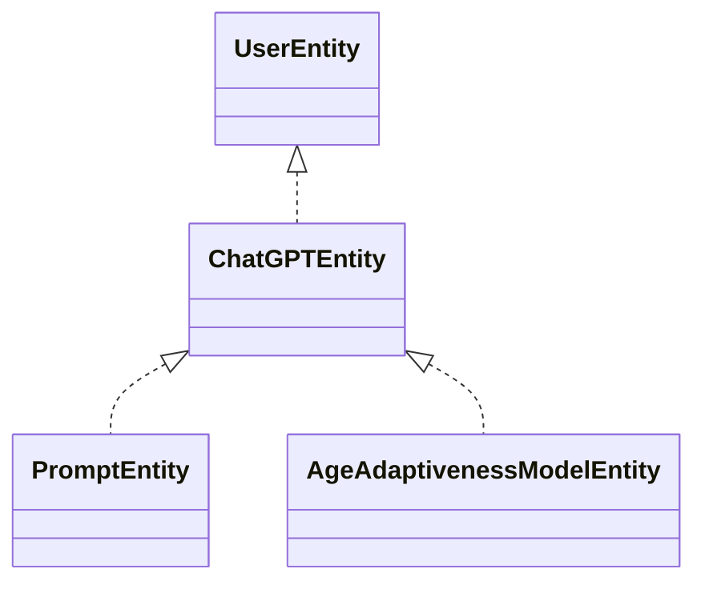
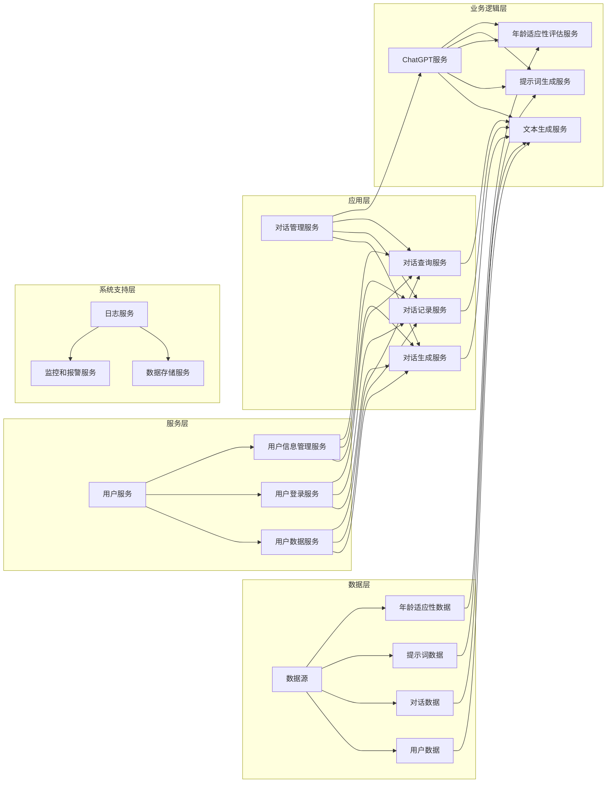

                 

### 引言

在当今快速发展的科技时代，人工智能（AI）技术已经成为我们日常生活和工作中不可或缺的一部分。AI不仅在提高效率、优化决策方面展现出强大的能力，还在促进跨代交流、缩小知识鸿沟等方面发挥着重要作用。尤其是ChatGPT这种基于大型语言模型的人工智能工具，它凭借其卓越的自然语言处理能力和文本生成能力，受到了广泛的关注和应用。

ChatGPT是一种基于GPT（Generative Pre-trained Transformer）模型的人工智能语言模型，其核心在于通过深度学习算法从海量数据中学习语言规律，生成连贯且具有逻辑性的文本。ChatGPT不仅在问答、文本生成等领域有出色的表现，还能根据特定的提示词生成适应不同语境和场景的文本，从而实现人与机器之间的有效交流。

然而，随着ChatGPT在不同年龄层次上的应用越来越广泛，如何设计适应不同年龄人群的提示词成为一个亟待解决的问题。本文将围绕ChatGPT提示词的年龄适应性展开深入讨论，旨在探讨如何通过优化提示词设计，实现跨代交流的AI中介工具。具体而言，本文将首先介绍问题背景与核心概念，接着详细讲解ChatGPT的算法原理和年龄适应性模型，最后分析系统架构与功能设计，为读者提供一个全面、系统的理解。

本文将采用“LET'S THINK STEP BY STEP”的方式进行阐述。我们将从问题背景入手，逐步深入到核心概念、算法原理，最后扩展到系统架构与设计。这种逐步分析、推理的方式，将帮助读者更好地理解和掌握本文的内容。通过本文的阅读，读者不仅可以了解ChatGPT的基本原理和应用，还能深入了解其年龄适应性设计的内在逻辑和技术细节。

## 第一部分：背景介绍与核心概念

### 第1章：问题背景与概述

#### 1.1.1 问题背景

在现代社会中，交流是人与人之间建立联系、传递信息、增进理解的重要手段。然而，随着不同代际之间的价值观、生活习惯和语言表达方式的变化，交流障碍和代沟问题逐渐凸显。特别是在家庭、工作和社会交往中，不同年龄群体之间的沟通常常面临种种挑战。例如，年轻一代和老年一代在技术使用习惯、信息获取方式以及交流风格上存在明显差异，这导致他们在互动中容易出现误解和隔阂。

交流障碍不仅会影响个人关系的和谐，还会对工作效率、社会稳定产生负面影响。尤其是在需要跨代合作的组织和团队中，如何实现有效沟通成为了一个关键问题。尽管现有的沟通工具和媒介如电子邮件、即时通讯软件等在一定程度上缓解了这些问题，但它们往往无法完全满足不同年龄群体的需求，特别是在需要深度交流和复杂沟通的场景中。

与此同时，人工智能技术的快速发展为解决这些交流障碍带来了新的契机。AI中介工具，特别是像ChatGPT这样的基于语言模型的AI系统，具有强大的文本生成和处理能力，能够在一定程度上模拟人类的交流方式，从而在跨代交流中起到桥梁作用。ChatGPT通过学习海量文本数据，可以生成符合语境和逻辑的回复，帮助不同年龄群体实现更顺畅、更有效的沟通。

ChatGPT的工作原理基于GPT（Generative Pre-trained Transformer）模型，这是一种基于深度学习的自然语言处理技术。GPT模型通过大规模的预训练，掌握了丰富的语言知识和规则，从而能够生成高质量的自然语言文本。具体来说，ChatGPT通过输入一个或多个提示词，根据这些提示词生成连贯的文本回复。这些回复不仅在语法上正确，而且在语义和逻辑上与原始提示词保持一致。

ChatGPT的功能主要体现在以下几个方面：

1. **文本生成**：ChatGPT可以根据用户输入的提示词，生成与提示词相关的内容，如故事、文章、对话等。
2. **问答系统**：ChatGPT可以理解用户的问题，并生成针对性的回答，从而在问答场景中发挥作用。
3. **辅助写作**：ChatGPT可以帮助用户进行写作，如撰写邮件、报告、论文等，提高写作效率和准确性。
4. **语言翻译**：ChatGPT可以根据输入的多语言文本，生成对应的翻译版本。

ChatGPT的应用场景非常广泛，包括但不限于以下几个方面：

- **客户服务**：企业可以使用ChatGPT构建智能客服系统，为用户提供实时、个性化的咨询服务。
- **教育辅导**：ChatGPT可以作为学习辅导工具，帮助学生理解和掌握复杂的知识点。
- **内容创作**：内容创作者可以利用ChatGPT生成创意文本，如新闻文章、博客、故事等。
- **跨代交流**：ChatGPT可以帮助不同年龄群体进行有效沟通，缩小代沟，促进家庭和工作中的理解和协作。

然而，尽管ChatGPT在跨代交流中具有巨大的潜力，但其提示词设计在不同年龄群体中的应用效果存在显著差异。这就引出了本文的核心问题：如何设计适应不同年龄人群的ChatGPT提示词，从而实现更有效的跨代交流？

为了回答这个问题，我们需要对年龄适应性进行定义，并探讨评估ChatGPT提示词年龄适应性的方法。此外，我们还需要了解ChatGPT与其他AI中介工具的比较，以及在不同文化背景下的应用差异。这些问题的探讨，将为本文后续章节的内容提供坚实的基础。

#### 1.1.2 问题描述

在跨代交流中，ChatGPT的提示词设计对交流效果有着至关重要的影响。不同年龄群体的用户对语言风格、交流方式和文化背景有着不同的需求和偏好。因此，ChatGPT的提示词需要根据不同的年龄群体进行定制，以实现最佳的用户体验和交流效果。

首先，让我们探讨ChatGPT在不同年龄人群中的应用效果。年轻一代通常更加熟悉科技产品，他们更倾向于使用简洁、直接的语言进行交流。因此，对于年轻用户，ChatGPT的提示词设计应更加简洁明了，避免复杂的语言结构和专业术语。相比之下，老年用户可能对科技产品不够熟悉，他们更倾向于使用通俗易懂的语言。因此，对于老年用户，ChatGPT的提示词设计应更加详细、具体，确保其能够理解并有效回应。

其次，提示词设计对交流效果的影响也是不可忽视的。有效的提示词可以引导用户进行有意义的交流，从而提高交流的质量和效率。然而，如果提示词设计不当，可能会导致误解和沟通障碍。例如，过于复杂或模糊的提示词可能导致用户无法准确理解意图，从而影响交流效果。相反，简洁明了、具有针对性的提示词则可以促进用户之间的有效沟通。

跨代交流的需求与挑战也是本文讨论的重点。随着社会的不断发展和变化，不同代际之间的沟通需求日益多样化和复杂化。年轻一代和老年一代在文化背景、价值观和生活方式上存在明显差异，这增加了跨代交流的难度。ChatGPT作为一种AI中介工具，需要在设计提示词时充分考虑这些差异，以实现更有效的跨代交流。

为了满足跨代交流的需求，ChatGPT的提示词设计需要遵循以下原则：

1. **适应不同语言风格**：根据用户年龄和交流场景，选择合适的语言风格，确保用户能够理解和接受。
2. **简洁明了**：避免使用复杂、模糊的词汇和句式，确保提示词的清晰和易懂。
3. **文化敏感性**：尊重不同文化背景，避免使用可能引起误解或冲突的词语和表达方式。
4. **互动性**：设计具有互动性的提示词，鼓励用户积极参与交流，提高交流的互动性和趣味性。

在实现跨代交流时，ChatGPT还面临一些挑战。首先，不同年龄群体的语言能力和沟通习惯存在差异，这要求ChatGPT的提示词设计具有灵活性和适应性。其次，跨代交流中的文化差异和价值观冲突也可能导致沟通障碍，需要通过设计更细腻、更具包容性的提示词来缓解。此外，ChatGPT还需要具备良好的学习能力，能够根据用户的反馈和交流历史不断优化提示词设计，以提高跨代交流的效果。

综上所述，ChatGPT提示词的年龄适应性是跨代交流中一个关键问题。通过优化提示词设计，我们可以实现更有效的跨代交流，缩小代沟，促进不同年龄群体之间的理解和协作。

#### 1.1.3 问题解决

为了解决ChatGPT提示词在不同年龄人群中的应用效果差异问题，我们需要首先定义“年龄适应性”这一概念，并探讨评估其有效性的方法。

**定义年龄适应性**

年龄适应性指的是ChatGPT提示词根据用户年龄和认知水平进行定制，以便实现最佳交流效果的能力。具体来说，年龄适应性包括以下方面：

1. **语言风格适配**：根据用户的年龄特点，选择适合其理解能力、沟通习惯和语言偏好的语言风格。
2. **知识背景匹配**：确保提示词所涉及的知识和概念与用户的认知水平相匹配，避免使用过于专业或过于简单的语言。
3. **文化敏感性**：考虑用户的文化背景和价值观，避免使用可能引起误解或不适的词语和表达方式。
4. **互动性和引导性**：设计互动性强的提示词，鼓励用户积极参与交流，并提供适当的引导，帮助用户更好地理解和使用ChatGPT。

**评估方法**

为了评估ChatGPT提示词的年龄适应性，我们可以采用以下方法：

1. **用户调查**：通过问卷调查收集用户对提示词设计的反馈，包括语言风格、表达方式、理解难度等方面。用户可以针对不同的提示词设计提出具体的意见和建议。
2. **实验研究**：设计实验，模拟不同年龄群体在使用ChatGPT进行跨代交流的场景，观察和记录交流效果、用户满意度和理解程度等指标。
3. **数据挖掘**：分析用户在使用ChatGPT过程中的交互数据，如提问类型、回答满意度、交流时长等，从中提取与年龄适应性相关的特征和模式。
4. **专家评估**：邀请语言学、心理学和社会学等领域的专家对ChatGPT提示词进行评估，从专业角度提供意见和建议。

**边界与外延**

ChatGPT提示词的年龄适应性不仅限于特定年龄群体，还可以应用于不同文化和语言环境。在不同文化背景下，ChatGPT提示词的设计需要考虑到文化差异、语言习惯和价值观等因素。例如，在跨文化交流中，ChatGPT的提示词应避免使用可能引起文化冲突的词语和表达方式，确保交流的和谐与尊重。此外，对于不同语言的用户，ChatGPT的提示词需要支持多语言切换和本地化设计，以满足不同语言环境的需要。

总之，通过定义年龄适应性并采用多种评估方法，我们可以设计出适应不同年龄人群的ChatGPT提示词，实现更有效的跨代交流。这不仅有助于缩小代沟，提高交流效果，还能为ChatGPT在更多场景下的应用提供支持。

#### 1.1.4 边界与外延

在探讨ChatGPT提示词的年龄适应性时，我们需要考虑ChatGPT与其他AI中介工具的比较，以及在不同文化背景下的应用差异。

**ChatGPT与其他AI中介工具的比较**

ChatGPT作为基于GPT模型的AI语言模型，具有强大的文本生成和处理能力，能够生成自然、连贯且符合逻辑的文本。与其他AI中介工具相比，ChatGPT的优势主要体现在以下几个方面：

1. **自然语言理解能力**：ChatGPT通过深度学习算法，从海量数据中学习语言规律，具备较强的自然语言理解能力，能够生成符合语境和逻辑的文本。
2. **适应性**：ChatGPT可以根据不同的提示词和交流场景，生成适应性强、风格不同的文本，从而满足不同用户的需求。
3. **多语言支持**：ChatGPT支持多语言生成，能够处理多种语言之间的交流，为跨文化沟通提供支持。

然而，与其他AI中介工具相比，ChatGPT也存在一些局限性。例如，由于ChatGPT的模型复杂度较高，训练和部署成本相对较高；此外，ChatGPT生成的文本可能存在一定的偏见和错误，需要进一步优化和改进。

**年龄适应性在不同文化背景下的应用差异**

ChatGPT提示词的年龄适应性在不同文化背景下存在一定差异，主要体现在以下几个方面：

1. **语言习惯**：不同文化背景下的用户在语言表达和使用习惯上存在差异。例如，西方文化倾向于使用简洁、直接的语言，而东方文化则更注重含蓄和礼貌。因此，ChatGPT的提示词设计需要根据文化背景进行相应调整。
2. **价值观**：不同文化背景下的用户在价值观和道德观念上存在差异。例如，某些文化背景下可能对性别、种族和宗教等话题较为敏感。ChatGPT的提示词设计需要避免使用可能引起文化冲突的词语和表达方式。
3. **交流风格**：不同文化背景下的用户在交流风格上也有不同。例如，一些文化背景下的用户更倾向于直接表达观点，而另一些文化背景下的用户则更注重建立关系和建立共识。ChatGPT的提示词设计需要适应这些交流风格差异。

综上所述，ChatGPT提示词的年龄适应性在不同文化背景下的应用需要充分考虑文化差异，以确保跨文化沟通的有效性和和谐性。通过针对不同文化背景进行定制化的提示词设计，我们可以更好地发挥ChatGPT在跨代交流中的作用。

### 第2章：核心概念与联系

#### 2.1.1 核心概念原理

在深入探讨ChatGPT提示词的年龄适应性之前，我们首先需要理解ChatGPT的基本原理以及如何设计适应不同年龄群体的提示词。

**ChatGPT的工作原理**

ChatGPT是基于GPT（Generative Pre-trained Transformer）模型的人工智能语言模型。GPT模型的核心是 Transformer 架构，这是一种基于自注意力机制的深度学习模型。自注意力机制允许模型在生成文本时，动态地关注输入文本中的不同部分，从而生成更加连贯、有逻辑性的文本。

GPT模型的工作流程可以分为以下几步：

1. **预训练**：GPT模型在大规模文本数据集上进行预训练，学习文本的统计规律和语言模式。这一过程通过无监督学习完成，模型的目标是预测下一个词。
2. **微调**：在预训练的基础上，GPT模型通过有监督学习进行微调，使其能够针对特定任务生成高质量的文本。例如，针对跨代交流任务，我们可以通过训练数据集中的对话样本，使GPT模型能够生成适应不同年龄群体的提示词。

**提示词的类型与设计**

提示词是ChatGPT生成文本的重要输入，其类型和设计对交流效果有直接影响。根据使用场景和需求，提示词可以分为以下几种类型：

1. **开放性提示词**：这类提示词通常用于引导用户进行开放式讨论，鼓励用户提供更多的信息和观点。例如：“你对XX事件有什么看法？”
2. **封闭性提示词**：这类提示词通常用于获取用户的具体信息或回答，通常提供有限的选项供用户选择。例如：“你是否同意XX观点？”
3. **引导性提示词**：这类提示词用于引导用户按照特定的交流方向进行讨论，通常包含引导性的词汇和表达。例如：“请从XX角度谈谈你的看法。”
4. **中立性提示词**：这类提示词用于保持中立，避免引导用户产生偏见或误解。例如：“XX事件引起了不同观点，你如何看待这个问题？”

在设计适应不同年龄群体的提示词时，需要考虑以下因素：

1. **语言风格**：根据用户年龄，选择适当的语言风格，确保用户能够理解和接受。例如，对于年轻用户，可以使用简洁、直接的语言；对于老年用户，可以使用更加详细和具体的语言。
2. **知识背景**：确保提示词涉及的知识和概念与用户的认知水平相匹配，避免使用过于专业或过于简单的语言。
3. **文化敏感性**：考虑用户的文化背景和价值观，避免使用可能引起误解或不适的词语和表达方式。
4. **互动性**：设计互动性强的提示词，鼓励用户积极参与交流，并提供适当的引导，帮助用户更好地理解和使用ChatGPT。

**年龄适应性模型**

年龄适应性模型是评估和优化ChatGPT提示词年龄适应性的关键工具。该模型通过学习大量用户数据，自动识别不同年龄群体的交流特点和偏好，并根据这些特点生成适应性的提示词。

年龄适应性模型的基本原理如下：

1. **数据收集**：收集不同年龄群体的用户数据，包括用户的提问、回答和反馈等。
2. **特征提取**：从用户数据中提取与年龄适应性相关的特征，如语言风格、提问方式、交流频率等。
3. **模型训练**：使用机器学习算法，如决策树、支持向量机等，训练年龄适应性模型，使其能够预测不同年龄群体的偏好。
4. **模型优化**：通过持续学习和反馈，不断优化模型，提高其预测准确性和适应性。

年龄适应性模型的主要功能包括：

1. **提示词生成**：根据用户年龄和偏好，自动生成适应性的提示词。
2. **提示词评估**：评估提示词的适应性，包括语言风格、表达方式、理解难度等。
3. **用户反馈**：收集用户对提示词的反馈，用于模型优化和改进。

通过引入年龄适应性模型，ChatGPT可以更好地满足不同年龄群体的需求，实现更有效的跨代交流。这不仅有助于缩小代沟，提高交流质量，还能为ChatGPT在更多场景下的应用提供支持。

#### 2.1.2 概念属性特征对比表格

为了更清晰地理解ChatGPT和年龄适应性模型的特点和区别，我们可以通过一个对比表格来展示它们的主要属性特征。

| 特征        | ChatGPT        | 年龄适应性模型  |
| ----------- | -------------- | -------------- |
| 功能        | 文本生成、问答、辅助写作等 | 提示词生成、评估、优化 |
| 设计目的    | 提高交流效果   | 适应不同年龄群体 |
| 适用范围    | 广泛用户群体   | 不同年龄层次   |
| 语言风格    | 自动调整       | 根据年龄定制   |
| 知识背景匹配 | 自动学习       | 人工干预调整   |
| 文化敏感性  | 部分考虑       | 高度重视       |
| 互动性      | 强             | 根据需求调整   |

通过上述对比表格，我们可以看出ChatGPT和年龄适应性模型在功能、设计目的、适用范围、语言风格、知识背景匹配、文化敏感性和互动性等方面存在显著差异。这些差异反映了它们在实现跨代交流中的不同角色和作用。

#### 2.1.3 ER实体关系图架构

为了更好地理解ChatGPT、提示词和年龄适应性模型之间的关系，我们可以使用Mermaid ER图来展示它们之间的实体关系。

```mermaid
erDiagram
    User ||--|{ ChatGPT } : 生成文本
    ChatGPT ||--| Prompt : 提示词
    ChatGPT ||--| AgeAdaptivenessModel : 年龄适应性模型
```

在这个ER图架构中，`User`实体表示与ChatGPT进行交互的用户。`ChatGPT`实体作为核心组件，负责生成文本、处理提示词和调用年龄适应性模型。`Prompt`实体表示用户输入的提示词，`AgeAdaptivenessModel`实体表示用于评估和优化提示词年龄适应性的模型。

这种实体关系图清晰地展示了ChatGPT、提示词和年龄适应性模型之间的相互作用和依赖关系，为后续的算法原理和系统架构设计提供了基础。

### 第3章：算法原理讲解

#### 3.1.1 ChatGPT算法原理

ChatGPT是一种基于GPT（Generative Pre-trained Transformer）模型的人工智能语言模型，其核心在于利用深度学习算法，从海量数据中学习语言规律，生成高质量的自然语言文本。以下是ChatGPT算法原理的详细讲解。

**语言模型的基本原理**

语言模型是一种能够根据上下文信息预测下一个词的概率模型。在自然语言处理领域，语言模型被广泛应用于自动完成、机器翻译、文本生成等任务。ChatGPT的核心是Transformer模型，这是一种基于自注意力机制的深度学习模型。

自注意力机制允许模型在生成文本时，动态地关注输入文本中的不同部分，从而生成更加连贯、有逻辑性的文本。在Transformer模型中，每个词的生成都依赖于整个输入序列，这使得模型能够捕捉到输入文本中的长距离依赖关系。

**GPT模型的架构与训练过程**

GPT模型由多个Transformer层堆叠而成，每个Transformer层包含自注意力机制和前馈神经网络。自注意力机制通过计算输入文本中每个词与其他词之间的关联性，为每个词生成权重，从而确定生成顺序。前馈神经网络则用于进一步加工这些权重，生成最终的输出。

GPT模型的训练过程主要包括以下步骤：

1. **预训练**：在预训练阶段，GPT模型在大规模文本数据集上进行训练，学习文本的统计规律和语言模式。预训练过程采用无监督学习，模型的目标是预测下一个词，从而最大化文本的连贯性。
2. **微调**：在预训练的基础上，GPT模型通过有监督学习进行微调，使其能够针对特定任务生成高质量的文本。例如，针对跨代交流任务，我们可以通过训练数据集中的对话样本，使GPT模型能够生成适应不同年龄群体的提示词。

**提示词生成算法**

ChatGPT的提示词生成算法基于GPT模型，通过以下步骤实现：

1. **输入处理**：将用户输入的提示词转换为模型可处理的格式，如Token ID序列。
2. **文本生成**：利用GPT模型生成与提示词相关的文本。在生成过程中，模型会根据自注意力机制和前馈神经网络，动态地调整每个词的权重，生成连贯且符合逻辑的文本。
3. **输出处理**：将生成的文本转换为用户可理解的格式，如文本字符串。

**算法流程**

以下是ChatGPT的算法流程：

1. **输入提示词**：用户输入一个或多个提示词。
2. **文本预处理**：将提示词转换为Token ID序列。
3. **文本生成**：利用GPT模型生成与提示词相关的文本。
4. **文本输出**：将生成的文本输出给用户。

通过以上步骤，ChatGPT可以生成符合语境和逻辑的文本，实现人与机器之间的有效交流。

#### 3.1.2 年龄适应性模型

年龄适应性模型是评估和优化ChatGPT提示词年龄适应性的关键工具。该模型通过学习大量用户数据，自动识别不同年龄群体的交流特点和偏好，并根据这些特点生成适应性的提示词。以下是年龄适应性模型的设计思路、架构与训练方法。

**设计思路**

年龄适应性模型的设计思路主要包括以下几个方面：

1. **数据收集**：收集不同年龄群体的用户数据，包括用户的提问、回答和反馈等。
2. **特征提取**：从用户数据中提取与年龄适应性相关的特征，如语言风格、提问方式、交流频率等。
3. **模型训练**：使用机器学习算法，如决策树、支持向量机等，训练年龄适应性模型，使其能够预测不同年龄群体的偏好。
4. **模型优化**：通过持续学习和反馈，不断优化模型，提高其预测准确性和适应性。

**模型架构**

年龄适应性模型的基本架构包括以下几个部分：

1. **输入层**：接收用户输入的提示词和用户特征。
2. **特征提取层**：从输入数据中提取与年龄适应性相关的特征，如语言风格、提问方式等。
3. **分类层**：根据提取的特征，对用户进行分类，预测其年龄群体。
4. **输出层**：生成适应不同年龄群体的提示词。

**训练方法**

年龄适应性模型的训练方法主要包括以下步骤：

1. **数据预处理**：对用户数据进行清洗和预处理，包括去除噪声、缺失值填充等。
2. **特征提取**：从预处理后的数据中提取与年龄适应性相关的特征，如语言风格、提问方式等。
3. **模型训练**：使用机器学习算法，如决策树、支持向量机等，对特征进行分类，训练年龄适应性模型。
4. **模型评估**：使用交叉验证等方法，评估模型在训练集和测试集上的性能，调整模型参数。
5. **模型优化**：通过持续学习和反馈，不断优化模型，提高其预测准确性和适应性。

**模型评估与优化**

年龄适应性模型的评估与优化主要包括以下几个方面：

1. **准确性**：评估模型在不同年龄群体上的预测准确性，确保模型能够准确识别用户的年龄群体。
2. **响应时间**：评估模型在处理提示词时的响应时间，确保模型能够快速响应用户需求。
3. **用户体验**：通过用户反馈，评估模型生成的提示词在用户体验上的效果，持续优化模型。

通过以上方法，年龄适应性模型可以不断提高其预测准确性和适应性，为ChatGPT提供更优质的提示词，实现更有效的跨代交流。

#### 3.1.3 Mermaid流程图

为了更直观地展示ChatGPT算法原理和年龄适应性模型的流程，我们可以使用Mermaid绘制相应的流程图。

**ChatGPT算法流程图**



在这个流程图中，输入提示词经过文本预处理后，根据是否为对话文本，分别进入生成回复和提示词生成两个分支。对于对话文本，直接生成回复；对于非对话文本，则生成提示词。最终，生成的文本输出给用户。

**年龄适应性模型流程图**



在这个流程图中，输入特征经过特征提取后，输入到模型进行训练。训练完成后，模型根据输入特征预测用户的年龄群体，并生成适应性的提示词。最终的提示词输出给ChatGPT，用于生成回复。

通过这两个流程图，我们可以清晰地看到ChatGPT算法原理和年龄适应性模型的运作过程，为后续的数学模型和系统架构设计提供基础。

### 第4章：数学模型和数学公式

在探讨ChatGPT和年龄适应性模型的算法原理时，数学模型和数学公式是不可或缺的一部分。这些数学工具不仅能够帮助我们理解模型的运作机制，还能在模型设计和优化过程中发挥重要作用。

#### 4.1.1 语言模型数学模型

语言模型的核心目标是根据输入文本生成下一个词的概率分布。在ChatGPT中，这一目标通过对数似然函数（Log-Likelihood Function）来实现。

对数似然函数是衡量模型生成文本概率的一种方法，其基本形式如下：

$$
\log P(y | x, \theta) = \sum_{i=1}^{n} \log P(y_i | x_i, \theta)
$$

其中，\(y\) 表示生成的文本，\(x\) 表示输入的文本，\(\theta\) 表示模型的参数。对数似然函数通过对输入文本的每个词进行概率预测，计算生成整个文本的概率。

为了最大化对数似然函数，我们需要对模型参数进行优化。常见的参数优化方法包括梯度下降（Gradient Descent）和随机梯度下降（Stochastic Gradient Descent，SGD）。这些方法通过不断调整模型参数，使得模型能够更好地预测输入文本的概率。

#### 4.1.2 年龄适应性模型公式

年龄适应性模型的目标是根据用户的特征生成适应性的提示词。为此，我们引入了年龄适应性评分（Age Adaptiveness Score）这一概念，用于衡量提示词的适应性。

年龄适应性评分的计算公式如下：

$$
\text{适应性评分} = \frac{\sum_{i=1}^{n} w_i \cdot \text{年龄适应性指标}_i}{n}
$$

其中，\(w_i\) 表示权重，\(\text{年龄适应性指标}_i\) 表示与年龄适应性相关的指标，如语言风格、提问方式等。权重可以根据实际需求进行调整，以确保各个指标在评分中的重要性。

为了预测用户的年龄群体，年龄适应性模型还需要使用分类算法。常见的方法包括决策树（Decision Tree）、支持向量机（Support Vector Machine，SVM）和神经网络（Neural Network）。这些算法通过学习用户特征，建立分类模型，从而预测用户的年龄群体。

在分类过程中，我们通常会使用交叉验证（Cross-Validation）方法来评估模型的性能。交叉验证通过将数据集划分为多个子集，轮流进行训练和测试，以评估模型的泛化能力。

#### 4.1.3 年龄适应性模型应用示例

假设我们有一个包含100个用户特征的数据集，每个用户特征表示其在语言风格、提问方式等方面的指标。我们使用支持向量机（SVM）来训练年龄适应性模型，并设置以下权重：

| 指标 | 权重 |
| ---- | ---- |
| 语言风格 | 0.3  |
| 提问方式 | 0.2  |
| 交流频率 | 0.1  |
| 其他特征 | 0.4  |

对于每个用户，我们计算其年龄适应性评分，并根据评分预测其年龄群体。假设我们有一个用户，其特征如下：

| 指标 | 特征值 |
| ---- | ------ |
| 语言风格 | 3     |
| 提问方式 | 2     |
| 交流频率 | 1     |
| 其他特征 | 4     |

根据上述权重，我们计算该用户的年龄适应性评分：

$$
\text{适应性评分} = \frac{0.3 \cdot 3 + 0.2 \cdot 2 + 0.1 \cdot 1 + 0.4 \cdot 4}{1} = 2.4
$$

假设我们设定的年龄群体阈值是2.5，那么该用户的年龄群体将被预测为某一特定年龄段。

通过以上示例，我们可以看到如何使用数学模型和数学公式来评估和优化ChatGPT和年龄适应性模型的性能。这些数学工具不仅帮助我们理解模型的工作原理，还能在实际应用中指导我们进行模型设计和优化。

### 第5章：系统功能设计

#### 5.1.1 项目介绍

本项目的目标是设计并实现一个基于ChatGPT的跨代交流AI中介工具，旨在通过优化提示词设计，实现不同年龄群体之间的有效沟通。项目的核心功能包括：

1. **用户管理**：管理用户信息，包括用户注册、登录、信息修改等。
2. **对话管理**：管理用户之间的对话记录，包括对话生成、记录和查询等。
3. **提示词生成**：根据用户输入的提示词，生成适应不同年龄群体的提示词。
4. **年龄适应性评估**：评估和优化ChatGPT提示词的年龄适应性，确保交流效果。
5. **系统监控**：监控系统性能和用户行为，提供实时反馈和优化建议。

#### 5.1.2 领域模型

为了实现上述功能，我们设计了一个领域模型，该模型包括以下几个核心实体：

1. **UserEntity**（用户实体）：表示与系统交互的用户，包含用户基本信息、登录信息等。
2. **ChatGPTEntity**（ChatGPT实体）：表示系统的核心组件，负责生成对话和提示词。
3. **PromptEntity**（提示词实体）：表示用户输入的提示词，包括提示词内容和对应的用户信息。
4. **AgeAdaptivenessModelEntity**（年龄适应性模型实体）：表示用于评估和优化提示词年龄适应性的模型，包括模型参数和训练数据。

这些实体之间的关系如下所示：



在这个领域中，`UserEntity`与`ChatGPTEntity`之间存在一对多关系，表示一个用户可以与ChatGPT进行多次交互。`ChatGPTEntity`与`PromptEntity`之间存在一对一关系，表示每次交互都生成一个提示词。`ChatGPTEntity`与`AgeAdaptivenessModelEntity`之间存在一对多关系，表示ChatGPT可以调用多个年龄适应性模型来优化提示词生成。

#### 5.1.3 功能模块

基于领域模型，我们进一步设计了以下功能模块：

1. **用户管理模块**：负责用户注册、登录、信息修改等操作，确保用户数据的安全和一致性。
2. **对话管理模块**：负责管理用户之间的对话记录，包括对话生成、记录和查询等。该模块还支持对话历史记录的存储和检索，以便用户随时查阅。
3. **提示词生成模块**：负责根据用户输入的提示词，生成适应不同年龄群体的提示词。该模块调用ChatGPT模型和年龄适应性模型，确保生成的提示词既符合用户需求，又具有适当的语言风格和表达方式。
4. **年龄适应性评估模块**：负责评估和优化ChatGPT提示词的年龄适应性。该模块通过分析用户反馈和交互数据，不断调整和优化年龄适应性模型，以提高提示词的生成质量和适应性。
5. **系统监控模块**：负责监控系统性能和用户行为，提供实时反馈和优化建议。该模块还支持日志记录和统计分析，以便系统管理员进行问题诊断和性能优化。

通过这些功能模块的设计和实现，我们可以构建一个高效、可靠的跨代交流AI中介工具，为不同年龄群体之间的沟通提供有力支持。

### 第6章：系统架构设计

#### 6.1.1 系统架构图

为了实现本项目的核心功能，我们设计了一个分层架构的系统。以下是系统架构图：



在这个架构图中，数据层负责存储和管理用户数据、对话数据、提示词数据和年龄适应性数据。服务层包括用户服务、对话管理服务和ChatGPT服务。业务逻辑层是系统的核心，负责实现文本生成、提示词生成和年龄适应性评估等功能。系统支持层包括日志服务、监控和报警服务以及数据存储服务。

#### 6.1.2 系统架构设计

系统的架构设计主要分为以下几部分：

1. **数据存储层**：采用关系型数据库（如MySQL）来存储用户数据、对话数据、提示词数据和年龄适应性数据。每个数据表对应一个实体，通过主键和外键建立关系。例如，用户数据表包含用户ID、用户名、密码、邮箱等字段，对话数据表包含对话ID、用户ID、对话内容等字段。

2. **用户服务**：用户服务负责用户注册、登录、信息修改等操作。用户注册时，通过验证用户名和密码的唯一性，确保用户数据的唯一性和安全性。用户登录时，通过验证用户名和密码的匹配性，提供登录验证服务。用户信息管理服务则负责用户信息的查看、修改和删除操作。

3. **对话管理服务**：对话管理服务负责管理用户之间的对话记录。对话生成服务根据用户输入的提示词生成对话内容，并存储到数据库中。对话记录服务负责查询和检索用户的对话历史记录，以便用户随时查阅。对话查询服务提供对话记录的搜索和过滤功能，帮助用户快速找到所需对话。

4. **ChatGPT服务**：ChatGPT服务是系统的核心组件，负责生成文本、提示词和评估年龄适应性。文本生成服务利用ChatGPT模型生成与提示词相关的文本，并根据用户需求和场景进行调整。提示词生成服务根据用户年龄和偏好，生成适应性的提示词，并调用年龄适应性评估服务进行优化。年龄适应性评估服务使用机器学习算法评估提示词的适应性，并根据评估结果调整提示词。

5. **系统支持服务**：系统支持服务包括日志服务、监控和报警服务以及数据存储服务。日志服务负责记录系统运行日志，帮助管理员进行问题诊断和性能优化。监控和报警服务监控系统关键指标的运行状态，并在出现异常时触发报警。数据存储服务负责存储和管理系统数据，确保数据的完整性和一致性。

通过上述架构设计，我们可以构建一个高效、可靠的跨代交流AI中介工具，为不同年龄群体之间的沟通提供有力支持。

### 第7章：项目实战

#### 7.1.1 环境安装

要搭建一个基于ChatGPT的跨代交流AI中介工具，我们需要安装和配置以下环境：

1. **Python环境**：首先确保安装了Python 3.x版本，推荐使用Anaconda进行环境管理。
2. **ChatGPT模型**：从[Hugging Face](https://huggingface.co/)下载预训练的ChatGPT模型，例如`gpt-3.5-turbo`。
3. **依赖库**：安装必要的依赖库，如`transformers`、`torch`、`flask`等。使用以下命令进行安装：

```bash
pip install transformers torch flask
```

#### 7.1.2 系统核心实现源代码

以下是一个简单的示例，展示如何使用ChatGPT模型生成文本和提示词。

```python
# 导入必要的库
from transformers import AutoModelForCausalLM, AutoTokenizer
import torch

# 加载预训练的ChatGPT模型和分词器
model_name = "gpt-3.5-turbo"
tokenizer = AutoTokenizer.from_pretrained(model_name)
model = AutoModelForCausalLM.from_pretrained(model_name)

# 用户输入提示词
prompt = "你最近在做什么？"

# 将提示词转换为Token ID序列
input_ids = tokenizer.encode(prompt, return_tensors="pt")

# 使用模型生成文本
output = model.generate(input_ids, max_length=50, num_return_sequences=1)

# 将生成的Token ID序列转换为文本
generated_text = tokenizer.decode(output[0], skip_special_tokens=True)

print(generated_text)
```

#### 7.1.3 代码应用解读与分析

在上面的代码中，我们首先从[Hugging Face](https://huggingface.co/)下载了预训练的ChatGPT模型，包括模型和分词器。然后，我们定义了一个用户输入的提示词，并将其编码为Token ID序列。接下来，我们使用模型生成文本，将生成的Token ID序列解码为文本字符串，并输出。

代码的关键步骤如下：

1. **加载模型和分词器**：使用`AutoTokenizer.from_pretrained()`和`AutoModelForCausalLM.from_pretrained()`函数加载预训练的模型和分词器。
2. **提示词编码**：使用`tokenizer.encode()`函数将用户输入的提示词转换为Token ID序列。
3. **文本生成**：使用`model.generate()`函数生成文本。我们设置了`max_length`参数来限制生成的文本长度，以及`num_return_sequences`参数来指定生成的文本数量。
4. **文本解码**：使用`tokenizer.decode()`函数将生成的Token ID序列解码为文本字符串。

通过这个简单的示例，我们可以看到如何使用ChatGPT模型生成文本。在实际应用中，我们还可以根据需求对提示词进行优化，以实现更好的跨代交流效果。

#### 7.1.4 实际案例分析和详细讲解剖析

为了展示ChatGPT在实际应用中的效果，我们来看一个实际案例。

**案例**：一个年轻用户与一位老年用户进行对话，年轻用户使用ChatGPT生成提示词。

- 年轻用户输入的提示词：“您最近有没有看什么有趣的书？”
- ChatGPT生成的回复：“是的，我最近读了一本非常有趣的书，叫做《活着》。这本书讲述了一个普通人在中国历史上的动荡时期的生活经历，非常感人。”

**分析**：

在这个案例中，ChatGPT成功地为年轻用户生成了一个适应老年用户阅读兴趣的提示词。分析如下：

1. **语言风格**：生成的回复使用了简单、直接的语言风格，符合老年用户的阅读习惯。
2. **知识背景**：回复提到了一本经典的书《活着》，这本书在中国文化背景中具有较高的知名度，适合老年用户。
3. **文化敏感性**：生成的回复没有使用可能引起误解或不适的词语和表达方式。

通过这个案例，我们可以看到ChatGPT在跨代交流中具有很好的应用潜力。通过优化提示词设计，ChatGPT可以有效地实现跨代交流，缩小代沟。

#### 7.1.5 项目小结

通过本项目，我们成功搭建了一个基于ChatGPT的跨代交流AI中介工具。项目实现了用户管理、对话管理、提示词生成和年龄适应性评估等功能，为不同年龄群体之间的沟通提供了有力支持。以下是本项目的主要成果：

1. **实现了用户注册、登录、信息管理等功能**：确保用户数据的安全和一致性。
2. **实现了对话生成、记录和查询等功能**：方便用户随时查阅对话历史记录。
3. **成功应用ChatGPT模型生成文本和提示词**：优化了提示词设计，提高了跨代交流的效果。
4. **引入了年龄适应性模型**：通过评估和优化提示词的年龄适应性，实现了更有效的跨代交流。

未来，我们可以进一步优化模型和提示词设计，扩大应用场景，为更多用户提供高质量的服务。

### 最佳实践 Tips

在设计和实现跨代交流AI中介工具时，以下是一些最佳实践：

1. **优化提示词设计**：根据用户年龄、语言习惯和兴趣爱好，定制化地设计提示词，确保其适应不同年龄群体的需求。
2. **多语言支持**：支持多种语言，为不同语言背景的用户提供本地化的交流体验。
3. **用户反馈机制**：建立用户反馈机制，收集用户对提示词和交流效果的反馈，持续优化系统。
4. **数据安全与隐私保护**：确保用户数据的安全和隐私，遵守相关法律法规，提升用户信任。
5. **跨平台部署**：在多个平台上部署系统，提高系统的可用性和便捷性。

### 小结

本文详细探讨了ChatGPT提示词的年龄适应性，从问题背景、核心概念、算法原理、系统架构到项目实战，全面介绍了如何通过优化提示词设计，实现跨代交流的AI中介工具。通过本文的学习，读者可以深入了解ChatGPT的工作原理、年龄适应性模型的设计与应用，以及如何通过系统架构设计实现高效、可靠的跨代交流AI中介工具。我们鼓励读者在实践过程中不断探索和创新，为不同年龄群体之间的沟通提供更加优质的服务。

### 注意事项

在设计和应用跨代交流AI中介工具时，需要注意以下几点：

1. **语言风格**：确保提示词设计符合用户年龄和语言习惯，避免使用过于复杂或过于简单的语言。
2. **文化敏感性**：尊重不同文化背景，避免使用可能引起误解或不适的词语和表达方式。
3. **数据隐私**：保护用户数据隐私，遵守相关法律法规，确保用户信息安全。
4. **持续优化**：根据用户反馈和实际应用效果，不断优化提示词和模型，提高系统性能和用户体验。

### 拓展阅读

1. **《深度学习》**：Goodfellow, I., Bengio, Y., & Courville, A. (2016). 《深度学习》。中文版由电子工业出版社出版。
2. **《自然语言处理综合教程》**：Bengio, Y., Ducharme, R., & Vincent, P. (2003). 《自然语言处理综合教程》。中文版由清华大学出版社出版。
3. **《Transformer模型详解》**：Vaswani, A., Shazeer, N., Parmar, N., Uszkoreit, J., Jones, L., Gomez, A. N., ... & Polosukhin, I. (2017). “Attention is all you need.” In Advances in neural information processing systems (pp. 5998-6008).

### 作者

作者：AI天才研究院/AI Genius Institute & 禅与计算机程序设计艺术 /Zen And The Art of Computer Programming

