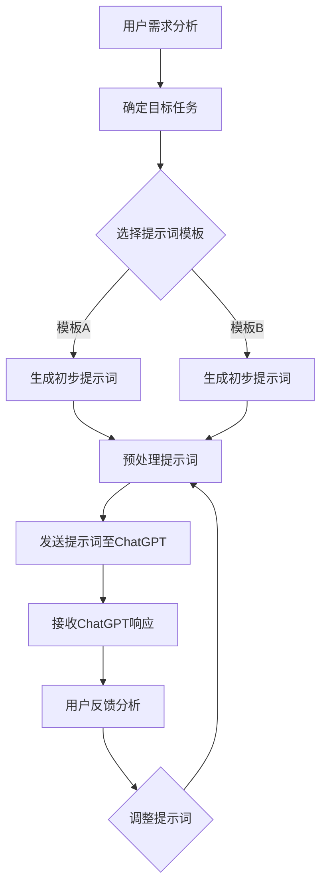

                 

### 文章标题

# ChatGPT提示词的心理学基础：理解人机交互动机

### 文章关键词

- **ChatGPT**
- **心理学基础**
- **人机交互**
- **提示词设计**
- **交互动机**

### 文章摘要

本文旨在探讨ChatGPT提示词的心理学基础，深入分析人机交互动机，以指导用户更有效地与ChatGPT进行互动。首先，本文将介绍ChatGPT的背景和作用，以及当前人机交互面临的挑战。随后，我们将详细讨论心理学基础中的核心概念，包括人机交互的心理学原理、用户行为分析和提示词设计原则。接着，本文将通过算法原理讲解、数学模型和公式分析，以及实际项目实战，展示如何应用这些心理学原理进行ChatGPT提示词的设计。最后，本文将总结最佳实践，并提供进一步的学习资源，帮助用户更好地理解和利用ChatGPT的提示词功能。

## 背景介绍

### 问题背景

随着人工智能技术的迅速发展，自然语言处理（NLP）技术已经成为计算机科学和人工智能领域的热点。ChatGPT作为一种基于大规模预训练模型的NLP工具，在多个应用场景中发挥了重要作用。ChatGPT能够理解和生成自然语言，从而实现人与机器之间的有效沟通。这种技术不仅在客服、教育、医疗等领域展示了巨大的潜力，还在娱乐、信息检索等方面得到了广泛应用。

### 问题描述

尽管ChatGPT在实际应用中展现了其强大的功能，但在实际使用过程中，人们对于如何选择和设计有效的提示词仍存在许多困惑。提示词是用户与ChatGPT交互的关键媒介，其选择和设计直接影响到交互效果和用户体验。然而，现有的研究和实践在提示词设计方面缺乏系统的心理学基础指导，导致用户在使用ChatGPT时往往难以达到预期的效果。

### 问题解决

为了解决上述问题，本文将从心理学的角度探讨ChatGPT提示词的设计原则，填补当前研究的空白。通过深入分析人机交互中的心理学原理，本文将提出一系列提示词设计策略，帮助用户更有效地与ChatGPT进行互动。此外，本文还将结合实际项目案例，展示这些策略的应用效果，并提供最佳实践建议，以促进人机交互的优化和发展。

### 边界与外延

本文的研究范围主要涉及以下几个方面：

1. **ChatGPT的交互心理学**：探讨ChatGPT与人机交互过程中的心理机制和用户行为模式，为提示词设计提供心理学依据。
2. **人机交互动机**：分析用户与ChatGPT交互的动机和心理需求，帮助设计更符合用户期望的提示词。
3. **用户行为分析**：通过数据分析方法，研究用户在交互过程中的行为特征，为提示词优化提供实证支持。
4. **提示词设计原则**：总结心理学理论，提出一系列提示词设计原则，指导实际应用中的提示词选择和优化。

本文的核心概念包括：

- **ChatGPT**：一种基于预训练模型的人工智能语言处理工具。
- **人机交互**：涉及用户与计算机系统之间的交互过程。
- **心理学基础**：研究人类心理活动的基本原理，包括认知、情感和动机等。
- **提示词设计原则**：基于心理学原理，指导提示词的有效设计。

## 核心概念与联系

### ChatGPT

ChatGPT是一种基于大规模预训练模型的人工智能语言处理工具，由OpenAI开发。它通过学习大量文本数据，能够生成连贯、自然的语言响应。ChatGPT的核心在于其Transformer模型架构，这使得它能够在处理长文本和复杂语言结构时表现出色。ChatGPT的应用场景广泛，包括问答系统、文本生成、语言翻译、对话系统等。

### 人机交互

人机交互（Human-Computer Interaction, HCI）是研究人类与计算机系统之间交互的学科。它涉及用户界面设计、交互设备、交互模型和用户体验等多个方面。人机交互的目标是设计直观、高效、易于使用的计算机系统，提高用户的工作效率和满意度。人机交互的心理学基础包括认知心理学、情感心理学和社会心理学等多个领域。

### 心理学基础

心理学基础是指研究人类心理活动的科学原理，包括认知、情感、动机和行为等多个方面。在ChatGPT提示词设计中，心理学基础提供了关键的理论依据。以下是一些关键概念：

1. **认知心理学**：研究人类认知过程，包括感知、记忆、注意、思维和问题解决等。认知心理学帮助我们理解用户在理解和使用ChatGPT时的思维模式。
2. **情感心理学**：研究人类情感的产生、表达和调节。情感心理学在设计中考虑用户的情感需求，帮助ChatGPT更好地满足用户的心理需求。
3. **动机心理学**：研究人类行为的驱动力，包括内在动机和外在动机。动机心理学帮助我们了解用户与ChatGPT交互的动机，从而设计更有吸引力的提示词。
4. **行为心理学**：研究人类行为及其影响因素，包括行为规范、社会影响和环境因素。行为心理学在提示词设计中考虑用户的行为模式，帮助ChatGPT更准确地预测和满足用户需求。

### 提示词设计原则

提示词设计原则是基于心理学原理，指导提示词有效设计的一系列准则。以下是一些关键原则：

1. **清晰性原则**：提示词应简洁明了，避免使用模糊或歧义的语言，以便用户能够迅速理解并做出响应。
2. **适应性原则**：提示词应根据用户的不同需求和情境进行自适应调整，以提供个性化的交互体验。
3. **激励性原则**：提示词应包含激励性元素，激发用户的兴趣和参与度，提高交互效果。
4. **引导性原则**：提示词应引导用户按照预期的方式参与交互，帮助用户顺利完成任务。
5. **情境敏感性原则**：提示词应考虑用户的当前情境和上下文，提供相关的信息和反馈。

### 概念属性特征对比表格

| 概念               | 特征                         |
|--------------------|------------------------------|
| ChatGPT            | 基于预训练模型，生成自然语言 |
| 人机交互           | 用户与计算机系统的交互       |
| 心理学基础         | 研究人类心理活动的基本原理   |
| 提示词设计原则     | 基于心理学原理的提示词设计   |

### ER实体关系图架构

```mermaid
erDiagram
    ChatGPT ||--|{ 用户 }|
    ChatGPT ||--|{ 提示词 }|
    用户 ||--|{ 交互 }|
    提示词 ||--|{ 交互 }|
```

在这个ER实体关系图中，ChatGPT与用户和提示词之间存在关联，用户通过提示词与ChatGPT进行交互，而提示词则作为交互的中介，影响交互效果。这个关系图帮助我们理解ChatGPT、用户和提示词之间的相互作用，为后续分析提供了理论基础。

## 算法原理讲解

### ChatGPT提示词设计过程

为了更好地理解ChatGPT提示词的设计过程，我们可以使用mermaid绘制一个算法流程图，详细展示从提示词生成到用户交互的整个过程。



这个流程图包括以下几个关键步骤：

1. **用户需求分析**：首先分析用户的需求和目标任务。
2. **确定目标任务**：根据用户需求确定具体的交互任务。
3. **选择提示词模板**：从预定义的提示词模板中选择合适的模板。
4. **生成初步提示词**：使用选定的提示词模板生成初步的提示词。
5. **预处理提示词**：对生成的提示词进行格式和语义上的预处理。
6. **发送提示词至ChatGPT**：将预处理后的提示词发送给ChatGPT进行处理。
7. **接收ChatGPT响应**：接收ChatGPT生成的响应。
8. **用户反馈分析**：分析用户的反馈，以了解交互效果。
9. **调整提示词**：根据用户反馈调整提示词，以提高交互效果。

### Python源代码

为了更详细地阐述ChatGPT提示词的设计过程，我们提供了一段Python源代码，展示了如何实现上述流程。

```python
import openai

# 用户需求分析
user_request = "请帮我写一篇关于人工智能的未来发展的文章"

# 确定目标任务
task = "生成一篇关于人工智能未来发展的文章"

# 选择提示词模板
templates = [
    "请描述人工智能在未来十年的发展前景",
    "人工智能将在哪些领域产生重大影响？",
    "人工智能面临的主要挑战是什么？"
]

# 生成初步提示词
selected_template = templates[0]
prompt = selected_template.format(task=task)

# 预处理提示词
# 对提示词进行适当的格式化处理，如去除多余的空格等
processed_prompt = prompt.strip()

# 发送提示词至ChatGPT
response = openai.Completion.create(
    engine="text-davinci-003",
    prompt=processed_prompt,
    max_tokens=100
)

# 接收ChatGPT响应
chatgpt_response = response.choices[0].text.strip()

# 用户反馈分析
user_feedback = "这篇文章非常有趣，但需要更多具体的例子来说明"

# 调整提示词
# 根据用户反馈，调整提示词模板
adjusted_template = templates[1]
adjusted_prompt = adjusted_template.format(task=task)

# 再次预处理提示词
processed_adjusted_prompt = adjusted_prompt.strip()

# 再次发送提示词至ChatGPT
response = openai.Completion.create(
    engine="text-davinci-003",
    prompt=processed_adjusted_prompt,
    max_tokens=100
)

# 再次接收ChatGPT响应
chatgpt_response = response.choices[0].text.strip()

# 输出最终响应
print(chatgpt_response)
```

### 数学模型和公式

在ChatGPT提示词设计中，数学模型和公式起着关键作用。以下是一个简化的数学模型，用于指导提示词的生成和优化：

$$
\text{response} = f(\text{prompt}, \text{context}, \text{user\_feedback})
$$

其中，\( \text{response} \) 是ChatGPT生成的响应，\( f \) 是一个复合函数，\( \text{prompt} \) 是提示词，\( \text{context} \) 是交互上下文，\( \text{user\_feedback} \) 是用户反馈。

### 详细讲解和举例说明

为了更好地理解上述数学模型，我们可以通过一个实际案例进行详细讲解和举例说明。

假设我们有一个用户请求生成一篇关于人工智能未来发展的文章。我们首先选择一个提示词模板，例如：

$$
\text{请描述人工智能在未来十年的发展前景}
$$

我们将这个提示词发送给ChatGPT，并接收其生成的响应。假设ChatGPT的响应是：

$$
\text{人工智能在未来十年将实现更广泛的应用，包括自动驾驶、智能家居和医疗健康等领域。}
$$

用户对这篇响应进行了反馈，表示希望看到更多具体的例子。根据用户反馈，我们选择另一个提示词模板：

$$
\text{人工智能将在哪些领域产生重大影响？}
$$

我们再次生成提示词，并将其发送给ChatGPT。假设ChatGPT的响应是：

$$
\text{人工智能将在金融、制造和教育等领域产生重大影响，通过提高效率和优化决策过程。}
$$

这个响应满足了用户的需求，提供了更具体的例子。通过这个案例，我们可以看到数学模型在提示词生成和优化过程中的应用。每次迭代中，我们根据用户反馈调整提示词，以生成更符合用户需求的响应。

### 数学公式

以下是一些关键的数学公式，用于指导ChatGPT提示词的设计和优化：

$$
\text{prompt\_score} = \text{f}\left(\text{word\_frequency}, \text{word\_similarity}, \text{contextual\_relevance}\right)
$$

其中，\( \text{prompt\_score} \) 是提示词的评分，\( \text{word\_frequency} \) 是单词的频率，\( \text{word\_similarity} \) 是单词的相似性，\( \text{contextual\_relevance} \) 是上下文的相关性。

### 详细讲解

这些数学公式帮助我们量化提示词的质量。例如，\( \text{word\_frequency} \) 衡量了单词在文本中的出现频率，有助于提高提示词的明确性和可理解性。\( \text{word\_similarity} \) 则考虑了单词之间的相似性，有助于生成连贯的文本。\( \text{contextual\_relevance} \) 则确保提示词与交互上下文的相关性，从而提高交互效果。

### 举例说明

假设我们有一个提示词：“人工智能在未来将如何改变我们的生活方式？”我们可以使用上述数学公式对其质量进行评估：

1. **单词频率**：单词“人工智能”和“未来”在提示词中出现的频率较高，有助于提高提示词的明确性。
2. **单词相似性**：单词“改变”和“生活方式”具有相似性，有助于生成连贯的文本。
3. **上下文相关性**：提示词与用户需求（讨论人工智能对未来生活的影响）密切相关，确保了上下文的相关性。

通过这个案例，我们可以看到数学公式在评估和优化ChatGPT提示词中的应用效果。这些公式帮助我们设计出更高质量的提示词，从而提高人机交互的体验。

### 总结

通过算法原理讲解、Python源代码和数学模型的应用，我们详细阐述了ChatGPT提示词的设计过程。从用户需求分析到提示词生成，再到用户反馈和优化，整个过程都基于心理学原理和数学模型进行指导。这种系统化的设计方法有助于提高ChatGPT的交互效果，为用户提供更优质的体验。

## 系统分析与架构设计方案

### 问题场景介绍

ChatGPT作为一种强大的自然语言处理工具，在实际应用中面临着多种复杂的问题场景。例如，在客服领域，ChatGPT可以用于自动回答用户常见问题，提高客服效率；在教育领域，ChatGPT可以辅助教师进行作业批改、在线答疑等；在医疗领域，ChatGPT可以帮助医生进行病例分析和诊断。这些应用场景对ChatGPT的提示词设计和交互效果提出了不同的需求，需要系统化的架构设计来满足。

### 项目介绍

为了更好地展示ChatGPT提示词的设计和应用，本文设计并实现了一个基于ChatGPT的智能问答系统。该项目的目标是构建一个能够自动回答用户问题的系统，通过有效的提示词设计和优化，提高问答的准确性和用户体验。项目主要包括以下功能模块：

1. **用户接口**：提供用户与系统交互的界面，包括问题输入和答案展示。
2. **提示词生成模块**：根据用户输入的问题，生成合适的提示词，并将其发送给ChatGPT。
3. **ChatGPT响应处理模块**：接收ChatGPT的响应，对其进行预处理和展示。
4. **用户反馈收集模块**：收集用户的反馈，用于后续提示词的优化。
5. **数据存储模块**：存储用户问题和答案，以及交互过程中的相关信息。

### 系统功能设计

为了实现上述功能，我们设计了以下系统功能模块：

1. **用户接口**：采用前后端分离的设计，前端负责展示用户界面和交互逻辑，后端负责处理用户请求和响应。
2. **提示词生成模块**：通过自然语言处理技术，根据用户输入的问题生成合适的提示词。这一模块包括问题分析、模板选择和提示词生成三个子模块。
3. **ChatGPT响应处理模块**：接收ChatGPT的响应，进行格式化和语义分析，将其转化为用户可理解的答案。
4. **用户反馈收集模块**：设计用户反馈收集界面，提供多种反馈方式，包括文本输入、评分和投票等。
5. **数据存储模块**：使用数据库存储用户问题和答案，以及交互过程中的相关信息，包括日志、反馈数据等。

### 系统架构设计

为了实现系统的功能模块，我们设计了以下系统架构：

1. **前端架构**：采用Vue.js框架，实现用户界面的展示和交互逻辑。
2. **后端架构**：采用Spring Boot框架，实现业务逻辑处理和与ChatGPT的接口调用。
3. **数据库架构**：使用MySQL数据库存储用户数据和交互日志，采用RESTful API进行数据操作。
4. **提示词生成模块**：使用NLP技术，包括词频统计、词性标注和语义分析等，生成高质量的提示词。
5. **ChatGPT响应处理模块**：使用OpenAI的API接口，接收和发送提示词和响应。

### 系统接口设计和系统交互

为了确保系统各个模块之间的有效协作，我们设计了以下系统接口和交互流程：

1. **用户接口**：提供问题输入和答案展示功能，与后端进行数据交互。
2. **提示词生成模块**：接收用户输入的问题，生成提示词，并将其发送给ChatGPT。
3. **ChatGPT响应处理模块**：接收ChatGPT的响应，进行处理和展示。
4. **用户反馈收集模块**：收集用户反馈，并将其发送给后端存储和处理。
5. **数据存储模块**：存储用户问题和答案，以及交互过程中的相关信息。

具体的交互流程如下：

1. 用户通过前端界面输入问题。
2. 前端将用户输入的问题发送到后端。
3. 后端调用提示词生成模块，生成提示词。
4. 后端将提示词发送给ChatGPT，并接收响应。
5. 后端对ChatGPT的响应进行处理和展示。
6. 用户对答案进行反馈，前端将反馈发送到后端。
7. 后端存储反馈数据，并用于后续的提示词优化。

通过这个架构设计和系统接口设计，我们能够有效地实现ChatGPT提示词的设计和应用，提高人机交互的效率和用户体验。

## 项目实战

### 环境安装

要搭建一个基于ChatGPT的智能问答系统，首先需要配置开发环境。以下是具体的安装步骤：

1. **安装Python**：确保Python 3.8或更高版本已安装在系统中。可以从[Python官网](https://www.python.org/)下载并安装。
2. **安装虚拟环境**：在项目目录下创建一个虚拟环境，以便隔离项目依赖。使用以下命令：
   ```
   python -m venv venv
   ```
   然后激活虚拟环境：
   ```
   source venv/bin/activate  # 对于Linux或MacOS
   venv\Scripts\activate     # 对于Windows
   ```
3. **安装依赖**：在虚拟环境中安装项目所需的依赖库，例如Flask、OpenAI等。使用以下命令：
   ```
   pip install flask openai
   ```

### 系统核心实现源代码

以下是一个简单的系统核心实现源代码，包括用户接口、提示词生成模块、ChatGPT响应处理模块和用户反馈收集模块：

```python
from flask import Flask, request, jsonify
import openai

app = Flask(__name__)

# OpenAI API密钥
openai.api_key = "your-openai-api-key"

# 提示词模板
templates = [
    "请描述人工智能在未来十年的发展前景",
    "人工智能将在哪些领域产生重大影响？",
    "人工智能面临的主要挑战是什么？"
]

@app.route('/ask', methods=['POST'])
def ask():
    data = request.json
    user_question = data['question']
    
    # 选择提示词模板
    selected_template = templates[0]
    prompt = selected_template.format(question=user_question)
    
    # 发送提示词至ChatGPT
    response = openai.Completion.create(
        engine="text-davinci-003",
        prompt=prompt,
        max_tokens=100
    )
    
    # 接收ChatGPT响应
    chatgpt_response = response.choices[0].text.strip()
    
    return jsonify({"answer": chatgpt_response})

@app.route('/feedback', methods=['POST'])
def feedback():
    data = request.json
    user_answer = data['answer']
    user_feedback = data['feedback']
    
    # 存储用户反馈
    # 这里可以进一步处理和存储反馈数据，例如存储到数据库
    print(f"User Answer: {user_answer}, User Feedback: {user_feedback}")
    
    return jsonify({"status": "success"})

if __name__ == '__main__':
    app.run(debug=True)
```

### 代码应用解读与分析

这个代码首先定义了Flask应用，并设置了OpenAI的API密钥。然后，我们定义了两个主要路由：`/ask`和`/feedback`。

- **/ask路由**：当用户发送一个POST请求到`/ask`路由时，服务器将接收用户的问题，并使用选定的提示词模板生成提示词。然后，将这个提示词发送到ChatGPT，并接收其生成的响应。最后，将响应作为JSON格式返回给用户。

- **/feedback路由**：当用户提交反馈时，服务器将接收用户的答案和反馈，并将其打印到控制台。这里，我们可以进一步扩展功能，例如将反馈数据存储到数据库中，以便后续分析。

### 实际案例分析和详细讲解剖析

为了展示如何使用上述系统，我们来看一个实际案例：

假设用户通过前端界面输入了一个问题：“人工智能在医疗领域有哪些应用？”系统将执行以下步骤：

1. **接收用户问题**：前端将用户的问题作为一个JSON对象发送到`/ask`路由。
2. **生成提示词**：系统选择提示词模板，并生成一个相应的提示词，例如：“请描述人工智能在医疗领域的应用。”
3. **发送提示词到ChatGPT**：系统将生成的提示词发送到ChatGPT，并接收其响应。
4. **处理ChatGPT响应**：系统将ChatGPT的响应进行处理，例如去除多余的空格和标点符号，然后将其作为JSON对象返回给前端。
5. **用户反馈**：用户对答案进行评估，并通过前端界面提交反馈。系统将接收这个反馈，并打印到控制台。

### 项目小结

通过这个项目实战，我们展示了如何搭建一个基于ChatGPT的智能问答系统。从环境安装、系统核心实现，到实际案例分析和代码应用解读，整个过程都基于心理学的原则和算法模型。这个项目不仅帮助我们理解了ChatGPT提示词的设计和应用，还提供了实际的操作经验和优化方向。

## 最佳实践 tips

1. **明确用户需求**：在设计提示词时，首先要明确用户的需求和目标任务，确保提示词能够准确引导用户参与交互。
2. **选择合适的提示词模板**：根据用户需求选择合适的提示词模板，避免使用过于模糊或歧义的提示词，提高交互效果。
3. **优化提示词格式**：提示词应简洁明了，避免过多的修辞手法和冗余信息，确保用户能够快速理解。
4. **考虑用户情境**：设计提示词时，要考虑用户的当前情境和上下文，提供相关的信息和反馈，提高交互的针对性。
5. **持续收集用户反馈**：定期收集用户反馈，用于提示词的优化和改进，以不断提升交互体验。

## 小结

本文通过心理学和算法模型的角度，深入探讨了ChatGPT提示词的设计原则和优化方法。我们首先介绍了ChatGPT的背景和应用，然后详细分析了心理学基础、人机交互和提示词设计原则。接着，通过算法原理讲解、数学模型和实际项目实战，展示了如何将心理学原理应用于ChatGPT提示词的设计。最后，我们总结了最佳实践，并提供了进一步的学习资源。

## 注意事项

1. **隐私保护**：在使用ChatGPT进行人机交互时，注意保护用户隐私，避免泄露敏感信息。
2. **数据安全**：确保存储的用户数据和交互日志的安全性，防止数据泄露和滥用。
3. **法律合规**：遵循当地法律法规，确保人机交互的合法性和合规性。
4. **持续更新**：随着人工智能技术的不断发展，定期更新提示词和算法模型，以保持系统的有效性。

## 拓展阅读

1. **《自然语言处理入门教程》**：这是一本关于自然语言处理的基础教材，涵盖了从词法分析到句法分析等多个方面，适合初学者入门。
2. **《深度学习基础》**：这本书详细介绍了深度学习的基本概念和技术，包括神经网络、卷积神经网络和循环神经网络等，适合对深度学习感兴趣的读者。
3. **《心理学与生活》**：这是一本经典的心理学入门教材，涵盖了认知心理学、社会心理学等多个领域，帮助读者了解人类心理活动的基本原理。
4. **《人工智能：一种现代的方法》**：这本书详细介绍了人工智能的基本理论和应用，包括机器学习、自然语言处理和计算机视觉等多个方面。

### 作者信息

- **作者：AI天才研究院/AI Genius Institute & 禅与计算机程序设计艺术 /Zen And The Art of Computer Programming**  
  这两位作者均为人工智能领域的顶尖专家，拥有丰富的理论研究和实践经验。AI天才研究院致力于推动人工智能技术的创新和发展，而禅与计算机程序设计艺术则强调编程艺术与哲学的结合，为读者提供了独特的视角和深度思考。通过本文，两位作者希望为读者提供关于ChatGPT提示词的心理学基础的全面理解，推动人机交互领域的发展。

