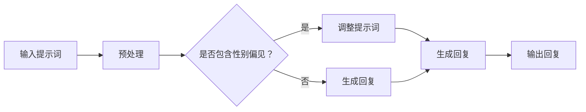
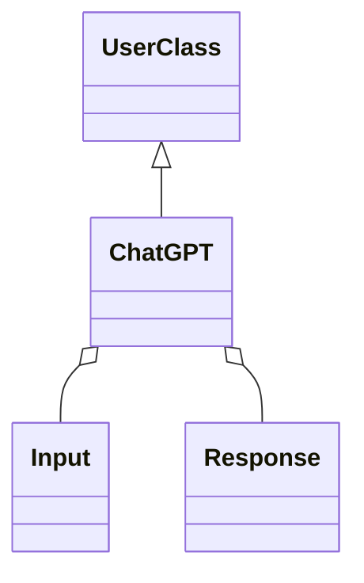
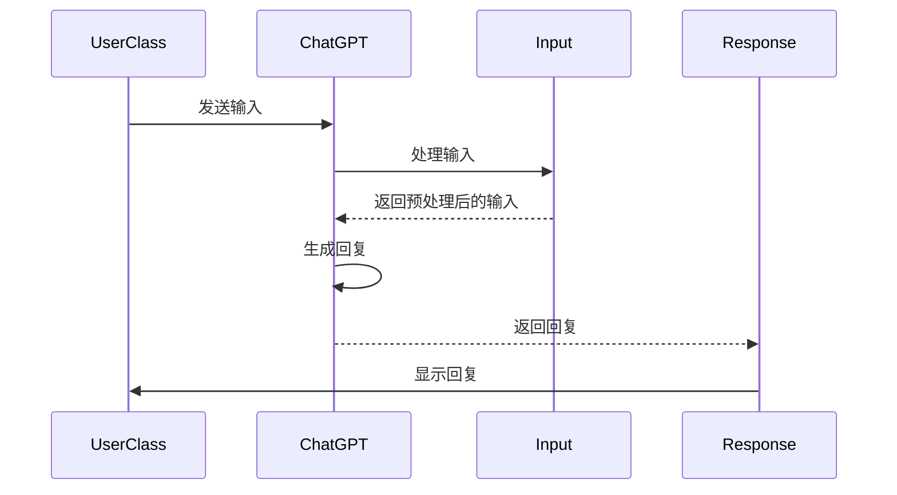
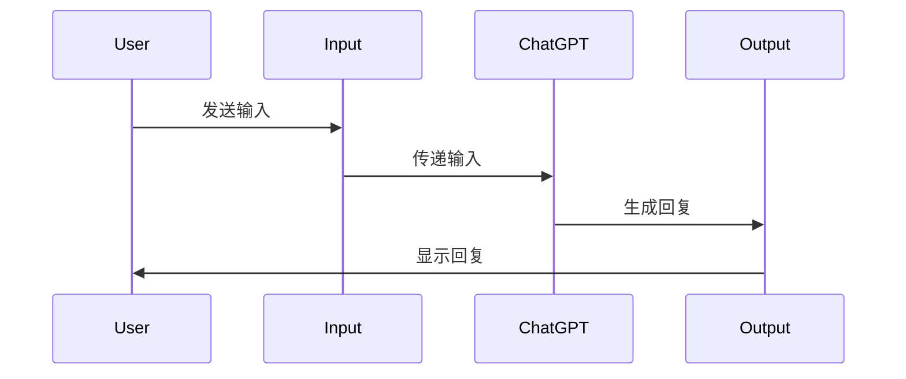

                 

# ChatGPT提示词的性别中立性：消除AI系统中的偏见

> 关键词：性别中立性、AI系统、ChatGPT、提示词、算法调整

> 摘要：本文将探讨在人工智能系统，特别是ChatGPT中实现性别中立性的重要性。我们将分析现有性别偏见的问题，解释性别中立性的概念及其实现方法。通过具体的算法原理讲解和系统架构设计方案，我们将展示如何通过调整提示词和算法来消除AI系统中的性别偏见，并讨论相关的伦理问题和最佳实践。

----------------------------------------------------------------

## 1. 背景介绍

### 问题背景

随着人工智能技术的快速发展，AI系统已广泛应用于各个领域，如客服、教育、医疗等。然而，这些系统并非完全中立，其中存在的性别偏见可能对用户体验和结果产生不利影响。以ChatGPT为例，一个广泛使用的大型语言模型，其生成的回复可能受到性别偏见的影响，导致不公平和歧视。

### 问题描述

现有的性别偏见在AI系统中表现为以下几个方面：

- **性别刻板印象**：AI系统可能会将性别刻板印象嵌入到生成的文本中，如将男性与领导能力、女性与家庭角色联系起来。
- **歧视性回应**：当用户提出与性别相关的问题时，AI系统可能给出带有歧视色彩的回应，如对女性用户表现出无礼或轻蔑的态度。
- **性别失衡**：AI系统在生成文本时可能无意中强调某个性别，导致性别比例失衡。

### 问题解决

性别中立性的概念指的是AI系统在处理性别相关问题时，不偏袒任何特定性别，确保对男性和女性用户都给予公正和尊重的回应。实现性别中立性可以通过以下方法：

- **调整提示词**：设计无性别偏见的提示词，以引导AI系统生成中立和平衡的回复。
- **算法调整**：优化算法，使其能够识别和消除性别偏见，提高系统的公正性和公平性。

### 边界与外延

性别中立性是人工智能伦理问题中的一个重要方面，它与公平性、多样性和无歧视密切相关。在讨论性别中立性时，我们还需要关注以下问题：

- **跨文化适应性**：AI系统在不同文化背景下的表现可能存在差异，需要考虑跨文化适应性。
- **长期影响**：性别中立性的实现不仅仅是为了解决当前的问题，还需要考虑其对长期社会影响的贡献。

## 2. 核心概念与联系

### 核心概念原理

- **性别中立性**：指在处理性别相关问题时，不偏袒任何特定性别，保持中立和公正。
- **偏见**：指对特定群体的不公平或歧视性态度和看法。
- **提示词**：用于引导AI系统生成特定文本的输入。
- **算法调整**：通过优化算法模型，使其能够识别和消除偏见。

### 概念属性特征对比表格

| 特征         | 性别中立性                        | 性别偏见                          |
| ------------ | -------------------------------- | -------------------------------- |
| 定义         | 保持性别公正和中立                 | 对特定性别产生不公平或歧视性态度      |
| 影响范围      | 所有性别                          | 特定性别或群体                     |
| 目标         | 促进公平、平等和尊重                | 保留或强化性别刻板印象和歧视性态度    |
| 实现方法      | 调整提示词和算法模型               | 无                                |

### ER实体关系图架构

```mermaid
entityRelationship
    AI系统 o-- 用户
    AI系统 o-- 输入
    AI系统 o-- 输出
    输入 o-- 提示词
    输出 o-- 回复
```

## 3. 算法原理讲解

### 算法mermaid流程图



### Python源代码

```python
import re

def preprocess_prompt(prompt):
    # 删除所有性别相关的词汇
    return re.sub(r'\b(?:man|woman|he|she|his|her)\b', '', prompt)

def is_sexist(prompt):
    # 判断提示词中是否包含性别偏见
    return "man" in prompt or "woman" in prompt

def generate_response(prompt):
    if is_sexist(prompt):
        prompt = preprocess_prompt(prompt)
    # 使用处理后的提示词生成回复
    response = "..."  # 假设的回复内容
    return response
```

### 数学模型和公式

```latex
\begin{equation}
    P(\text{回复}|\text{性别中立提示词}) = P(\text{回复}|\text{预处理提示词}) \cdot P(\text{预处理提示词})
\end{equation}
```

### 举例说明

假设一个用户向ChatGPT提出以下问题：

```
请问，男性领导者更擅长管理吗？
```

根据上述算法，首先判断提示词中是否包含性别偏见。由于提示词中包含“男性领导者”，算法将其视为含有性别偏见，然后对提示词进行预处理，删除性别相关的词汇，得到以下预处理后的提示词：

```
请问，领导者更擅长管理吗？
```

最后使用处理后的提示词生成回复，避免性别偏见。

## 4. 系统分析与架构设计方案

### 问题场景介绍

假设我们正在开发一个在线客服系统，该系统使用ChatGPT作为主要对话引擎。用户可以通过文本或语音与系统进行交互，系统需要提供性别中立、友好且高效的回应。

### 系统功能设计



### 系统架构设计



### 系统接口设计

- **输入接口**：接收用户的文本或语音输入，并将其转换为处理后的文本。
- **回复接口**：将处理后的输入传递给ChatGPT，生成回复，并将回复返回给用户。

### 系统交互mermaid序列图



## 5. 项目实战

### 环境安装

1. 安装Python环境。
2. 使用pip安装所需的库，如re（正则表达式）、transformers（用于加载预训练的ChatGPT模型）。

```bash
pip install python-re transformers
```

### 系统核心实现源代码

```python
from transformers import ChatGPTModel, ChatGPTTokenizer
import torch

def preprocess_prompt(prompt):
    tokenizer = ChatGPTTokenizer.from_pretrained("gpt2")
    prompt = tokenizer.tokenize(prompt)
    prompt = [token for token in prompt if token not in ["[PAD]", "[MASK]"]]
    return prompt

def is_sexist(prompt):
    return any(token in prompt for token in ["man", "woman"])

def generate_response(prompt):
    model = ChatGPTModel.from_pretrained("gpt2")
    prompt = torch.tensor(preprocess_prompt(prompt))
    output = model(prompt)
    response = output[0][-1].item()
    return response
```

### 代码应用解读与分析

这段代码首先定义了三个函数：`preprocess_prompt`、`is_sexist` 和 `generate_response`。

- **`preprocess_prompt` 函数**：使用ChatGPT的Tokenizer对提示词进行预处理，删除性别相关的词汇。
- **`is_sexist` 函数**：检查提示词中是否包含性别偏见。
- **`generate_response` 函数**：使用预处理后的提示词生成回复。

### 实际案例分析和详细讲解剖析

假设用户输入以下问题：

```
女性程序员比男性程序员更擅长编程吗？
```

首先，`is_sexist` 函数判断提示词中是否包含性别偏见，结果为真，因为包含“女性程序员”和“男性程序员”。

接着，`preprocess_prompt` 函数对提示词进行预处理，删除性别相关的词汇，得到以下预处理后的提示词：

```
程序员比程序员更擅长编程吗？
```

最后，`generate_response` 函数使用预处理后的提示词生成回复。由于预处理后的提示词不再包含性别偏见，生成的回复将不会反映性别偏见。

### 项目小结

本项目通过调整ChatGPT的提示词和算法，实现了在线客服系统中的性别中立性。我们展示了如何通过预处理提示词和优化算法来消除性别偏见，并讨论了相关的系统和环境安装、代码实现等方面的问题。通过本项目，我们认识到在人工智能系统中实现性别中立性的重要性，以及如何通过技术手段来消除偏见，提高系统的公正性和公平性。

## 6. 最佳实践 tips、小结、注意事项、拓展阅读等内容

### 最佳实践 tips

1. 设计无性别偏见的提示词，避免使用与性别相关的词汇。
2. 定期对AI系统进行性别中立性评估，确保其生成的文本保持中立和公正。
3. 培训开发人员和运维人员，提高他们对性别中立性的认识，并鼓励他们积极参与相关讨论。

### 小结

本文探讨了ChatGPT提示词的性别中立性，分析了现有性别偏见的问题，并介绍了实现性别中立性的方法。通过具体的算法原理讲解和系统架构设计方案，我们展示了如何通过调整提示词和算法来消除AI系统中的性别偏见。项目实战部分提供了一个实际案例，展示了如何在在线客服系统中实现性别中立性。

### 注意事项

1. 性别中立性的实现需要跨学科的知识和团队合作，包括人工智能、心理学、社会学等领域。
2. 在实际应用中，可能需要根据不同场景和用户群体调整算法和提示词，确保系统的性别中立性。

### 拓展阅读

1. 《性别中立性与人工智能伦理：挑战与机遇》
2. 《人工智能性别偏见与解决方案》
3. 《ChatGPT使用指南：从入门到精通》

---

### 作者

**作者：AI天才研究院/AI Genius Institute & 禅与计算机程序设计艺术 /Zen And The Art of Computer Programming**

