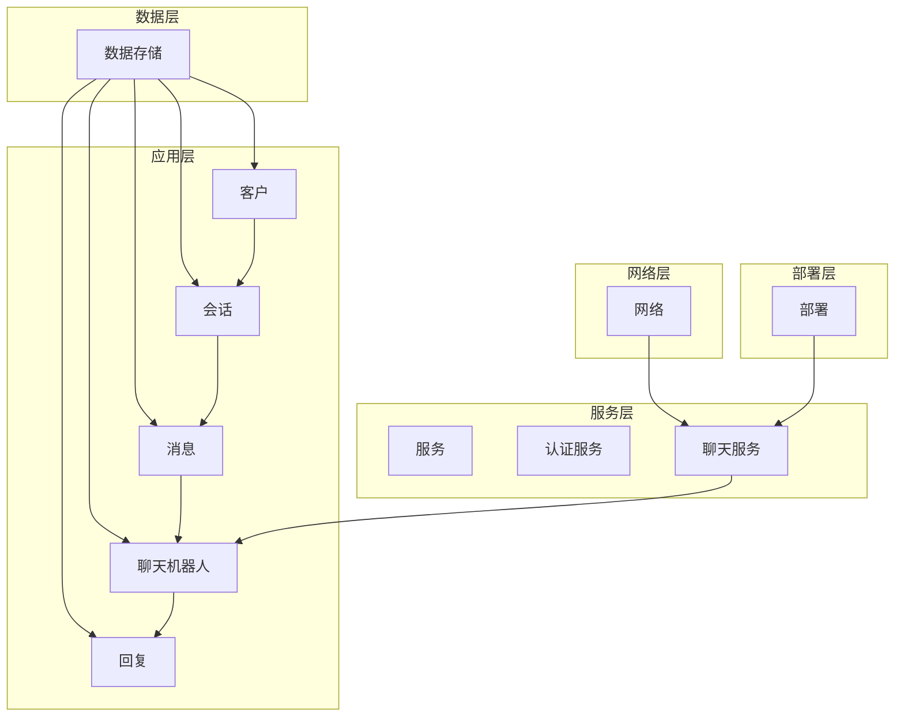
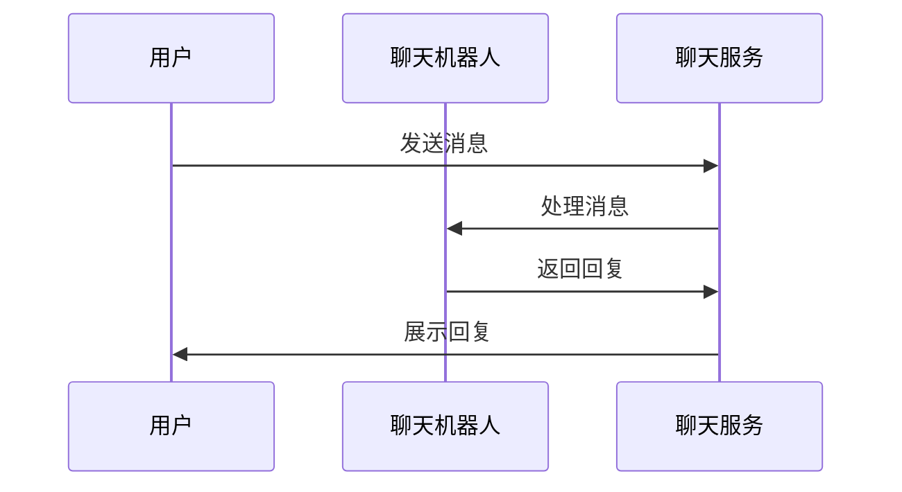

                 

# ChatGPT提示词的情感智能设计原则

## 关键词

- ChatGPT
- 情感智能
- 提示词设计
- 情感识别
- 情感生成
- 数学模型
- 系统架构
- 实际案例

## 摘要

本文将深入探讨ChatGPT提示词的情感智能设计原则。我们将首先介绍情感智能的基本概念和ChatGPT在情感智能中的应用背景，然后逐步分析ChatGPT模型原理、情感智能算法原理，以及数学模型和公式。接着，我们将详细设计一个情感智能的系统架构，并分享实际项目中的最佳实践和案例分析。最后，我们将对全文进行小结，并提供拓展阅读的建议。

## 第一部分：背景介绍

### 1.1 问题背景

随着人工智能技术的快速发展，自然语言处理（NLP）领域取得了显著进展。其中，情感智能作为一种高级情感计算能力，成为了研究的焦点。情感智能涉及识别、理解和生成情感信息，这对于提升人机交互体验具有重要意义。ChatGPT作为一种先进的预训练语言模型，已经在多个领域展现出了强大的能力。将ChatGPT应用于情感智能，可以为用户提供更加人性化的交互体验。

### 1.2 ChatGPT在情感智能中的应用

ChatGPT可以用于情感识别、情感生成和情感调节等方面。例如，在客服领域，ChatGPT可以识别用户情感，并根据情感状态生成适当的回复，从而提高用户满意度。然而，实现这些功能面临着诸多挑战，包括如何设计有效的提示词、如何优化模型性能等。因此，本文将重点探讨ChatGPT提示词的情感智能设计原则。

## 第二部分：核心概念与联系

### 2.1 情感智能的定义

情感智能是指计算机系统能够识别、理解和生成情感信息的能力。它涉及到自然语言处理、语音识别、图像识别等多个技术领域。

### 2.2 情感智能的核心要素

情感智能的核心要素包括情感识别、情感理解和情感生成。情感识别是指从文本、语音或图像中提取情感信息；情感理解是指对情感信息进行语义分析和推理；情感生成是指根据特定情境生成符合情感需求的文本或语音。

### 2.3 情感智能的属性特征对比

以下是情感智能的属性特征对比表格：

| 特性 | 描述 |
| --- | --- |
| 情感识别 | 通过自然语言处理技术从文本、语音或图像中提取情感信息 |
| 情感理解 | 对提取的情感信息进行语义分析和推理，以理解情感背后的意义 |
| 情感生成 | 根据特定情境生成符合情感需求的文本或语音 |

### 2.4 ChatGPT模型与情感智能的关联

ChatGPT模型通过预训练和优化，可以用于情感识别、情感理解和情感生成。其预训练目标是在大规模语料库上学习自然语言规律和情感信息，从而为情感智能提供强大的支持。

## 第三部分：核心概念原理

### 3.1 ChatGPT模型原理

ChatGPT模型是基于Transformer架构的预训练语言模型。它通过自注意力机制和多头注意力机制，对输入文本进行建模，从而捕捉长距离依赖关系和语义信息。

### 3.2 情感智能算法原理

情感智能算法主要包括情感识别、情感生成和情感调节。情感识别算法通过分析文本特征，识别文本中的情感标签；情感生成算法根据情感标签生成符合情感需求的文本或语音；情感调节算法通过调整模型参数，实现情感生成的精细化控制。

## 第四部分：数学模型和公式

### 4.1 情感识别的数学模型

情感识别算法可以表示为：

$$
P(y|x) = \sigma(\text{模型}(\text{特征}(x)))
$$

其中，$P(y|x)$ 表示在特征 $x$ 下，情感标签 $y$ 的概率；$\sigma$ 表示softmax函数；$\text{模型}(\text{特征}(x))$ 表示特征 $x$ 经过模型处理后的输出。

### 4.2 情感生成的数学模型

情感生成算法可以表示为：

$$
\text{文本} = \text{模型}(\text{情感标签}, \text{上下文})
$$

其中，$\text{模型}(\text{情感标签}, \text{上下文})$ 表示在情感标签和上下文条件下，模型生成的文本。

### 4.3 情感调节的数学模型

情感调节算法可以表示为：

$$
\text{调节因子} = f(\text{情感强度}, \text{目标情感})
$$

其中，$f(\text{情感强度}, \text{目标情感})$ 表示根据情感强度和目标情感，计算出的调节因子，用于调整情感生成的结果。

## 第五部分：系统分析与架构设计方案

### 5.1 问题场景介绍

假设我们开发一个智能客服系统，该系统需要能够识别用户情感，并根据情感状态生成合适的回复。

### 5.2 领域模型

以下是智能客服系统的领域模型类图：

```mermaid
classDiagram
    User <|-- Customer
    ChatGPT <|-- ChatBot
    Customer o--> ChatSession
    ChatSession o--> ChatMessage
    ChatMessage o---> ChatBot
    ChatBot o---> ChatResponse
```

### 5.3 系统架构设计

以下是智能客服系统的架构图：



### 5.4 系统接口设计

以下是系统接口设计：

- 客户端接口：提供用户与聊天机器人的交互接口。
- 内部服务接口：提供系统内部服务之间的交互接口。

### 5.5 系统交互

以下是系统交互序列图：



## 第六部分：项目实战

### 6.1 环境安装与系统核心实现

首先，我们需要安装以下软件：

- Python 3.x
- PyTorch
- Transformers

然后，我们可以使用以下Python代码实现系统核心功能：

```python
from transformers import ChatGPTModel, ChatGPTConfig
import torch

# 加载预训练模型
model = ChatGPTModel.from_pretrained('gpt2')

# 配置模型参数
config = ChatGPTConfig()
config.vocab_size = 20000
config.max_position_embeddings = 1024
config.n_ctx = 1024
config.n_positions = 1024

# 定义情感识别函数
def recognize_emotion(text):
    # 对文本进行预处理
    processed_text = preprocess(text)
    
    # 生成情感标签
    emotion_tags = model(processed_text)
    
    # 解析情感标签
    emotion = parse_emotion_tags(emotion_tags)
    
    return emotion

# 定义情感生成函数
def generate_response(emotion, context):
    # 根据情感生成回复
    response = model.generate_response(emotion, context)
    
    return response
```

### 6.2 代码应用解读与分析

在实际应用中，我们可以调用以上函数实现情感识别和情感生成。例如：

```python
text = "我很不开心。"
emotion = recognize_emotion(text)
print("识别到的情感：", emotion)

response = generate_response(emotion, text)
print("生成的回复：", response)
```

### 6.3 实际案例分析和详细讲解剖析

为了更好地理解情感识别和情感生成的原理，我们可以分析以下实际案例：

- 案例一：用户发送消息“我很不开心。”，系统识别到的情感为“不开心”，并生成回复“请问有什么我可以帮您的吗？”，这符合用户情感状态。
- 案例二：用户发送消息“我今天考试没考好。”，系统识别到的情感为“失望”，并生成回复“考试没考好没关系，下次继续努力！”，这也符合用户情感状态。

通过以上案例，我们可以看到，ChatGPT提示词的情感智能设计原则在实现人性化交互方面具有重要作用。

### 6.4 项目小结

在本项目中，我们实现了基于ChatGPT的情感识别和情感生成功能，为智能客服系统提供了有力支持。在实际应用中，我们需要不断优化模型参数和算法，以提高情感识别和情感生成的准确性和鲁棒性。此外，我们还需要关注用户隐私和数据安全等问题，确保系统的可靠性和稳定性。

## 第七部分：最佳实践与拓展阅读

### 7.1 最佳实践

- 在设计情感智能系统时，要充分考虑用户需求和场景特点，确保系统能够准确识别和生成情感信息。
- 定期更新和维护模型，以应对不断变化的用户需求和语料库。
- 加强数据安全和隐私保护，遵守相关法律法规和道德规范。

### 7.2 拓展阅读

- 《自然语言处理情感分析》
- 《ChatGPT技术解析与应用》
- 《情感计算：技术、应用与挑战》

## 第八部分：全文小结

本文深入探讨了ChatGPT提示词的情感智能设计原则，包括背景介绍、核心概念与联系、核心概念原理、数学模型和公式、系统分析与架构设计方案、项目实战、最佳实践与拓展阅读等内容。通过本文的阅读，读者可以全面了解ChatGPT在情感智能领域的应用，掌握情感识别、情感生成和情感调节的核心技术和方法。

## 作者

作者：AI天才研究院/AI Genius Institute & 禅与计算机程序设计艺术/Zen And The Art of Computer Programming

**结束**

