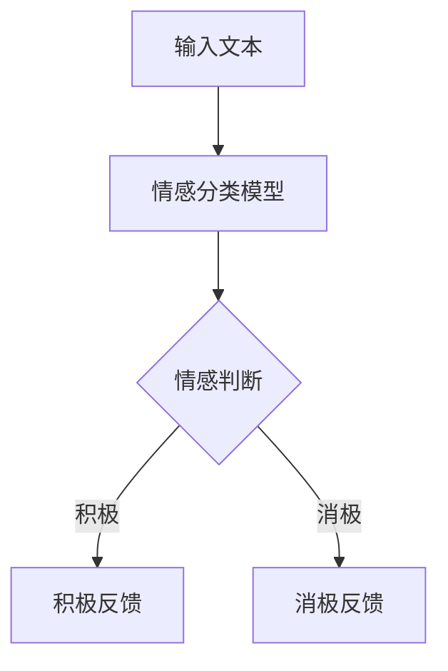
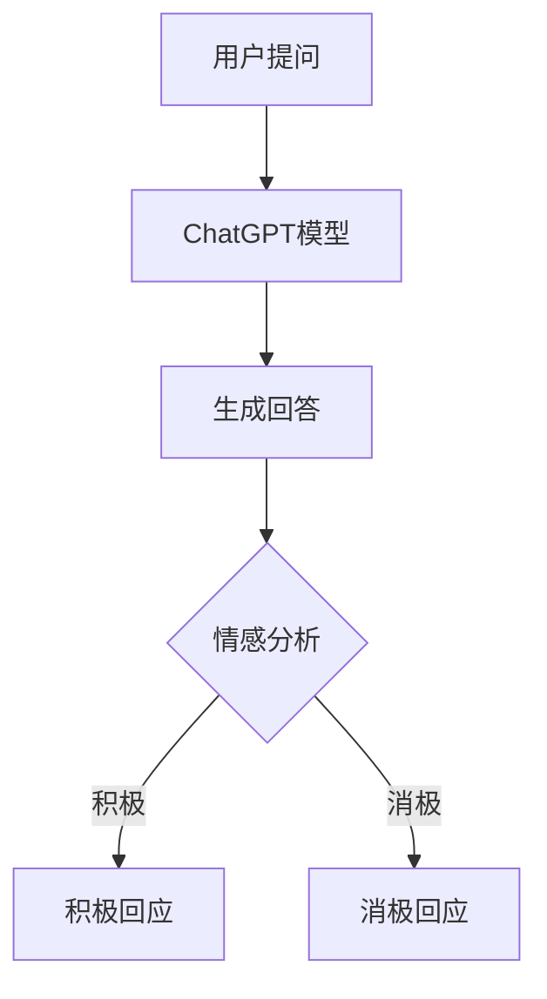
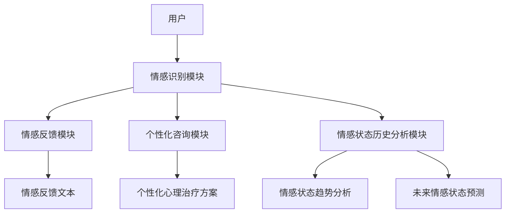
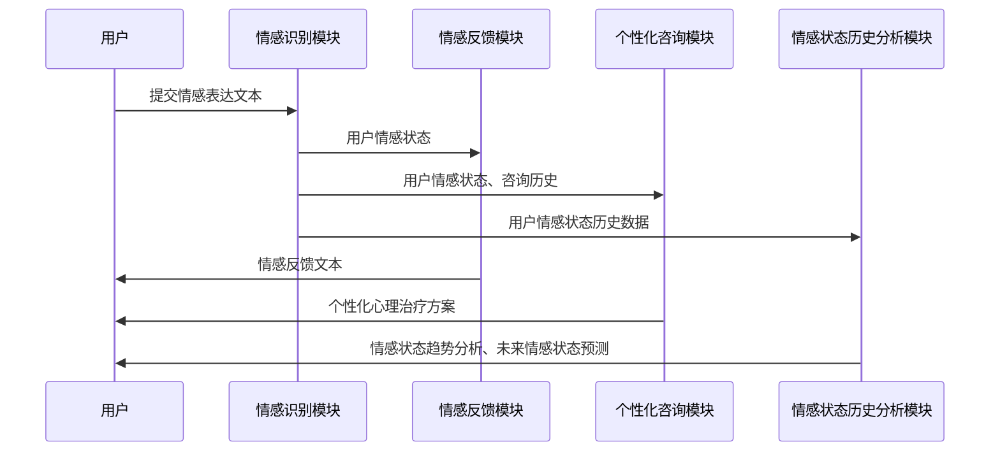

                 

# ChatGPT提示词的情感智能：增强AI在心理咨询中的应用

> 关键词：ChatGPT，情感智能，心理咨询，AI应用，算法原理，系统设计，项目实战

> 摘要：本文旨在探讨ChatGPT提示词的情感智能在心理咨询中的应用。通过分析情感智能的定义、特征及ChatGPT的架构和提示词设计，本文详细介绍了情感识别算法原理及情感智能与心理咨询的联系。随后，本文通过项目实战，展示了情感智能在心理咨询系统中的应用实践，并总结出最佳实践与未来展望。

## 第一部分：绪论

### 第1章：问题背景与目标

#### 1.1 问题背景

随着人工智能技术的发展，心理咨询领域正逐渐引入智能化的工具和方法。心理咨询作为一种重要的心理健康服务，其核心在于理解与识别个体的情感状态。然而，传统的心理咨询方法存在一些局限性，如人力成本高、效率低等。此时，人工智能，尤其是情感智能，成为了心理咨询领域的新希望。

情感智能是一种智能系统，能够识别、理解、处理以及模拟人类情感的能力。ChatGPT，作为一种基于生成预训练变换模型（GPT）的人工智能，具备强大的文本生成和理解能力。通过设计特定的提示词，ChatGPT可以实现情感智能，从而在心理咨询中发挥重要作用。

#### 1.2 问题提出

心理咨询中的情感识别是一个复杂的过程，涉及到情感的语言表达、情感强度的判断等。当前，心理咨询师在进行情感识别时，主要依赖于个人的经验和直觉，这不仅效率低下，而且容易产生误差。因此，如何利用ChatGPT的提示词实现情感智能，提高心理咨询的精准性和效率，成为了亟待解决的问题。

ChatGPT提示词的情感智能在心理咨询中的应用场景包括：自动化的情感识别与反馈、个性化的心理咨询方案生成、情感状态的历史分析等。

#### 1.3 研究目标

本文的研究目标主要包括：

1. 探讨ChatGPT提示词的情感智能原理。
2. 分析情感智能在心理咨询中的应用。
3. 提高心理咨询的精准性和效率。

#### 1.4 研究意义

本文的研究意义主要体现在以下几个方面：

1. 提高心理咨询的精准性：通过引入情感智能，可以更准确地识别和理解个体的情感状态，从而提供更有效的心理治疗方案。
2. 促进人工智能在心理咨询领域的应用：本文的研究将推动人工智能技术在心理咨询领域的深度应用，为心理健康服务带来新的变革。
3. 探索人工智能与心理学结合的新模式：本文的研究为人工智能与心理学结合提供了新的思路和实践，有望推动这两个领域的融合发展。

### 第2章：核心概念与联系

#### 2.1 情感智能的定义与特征

情感智能（Emotional Intelligence, EI）是指个体识别、理解、处理和模拟情感的能力。它包括以下几个核心特征：

1. **情感感知**：能够感知和理解自身及他人的情感状态。
2. **情感理解**：能够理解不同情感的含义及其对个体和社会行为的影响。
3. **情感管理**：能够有效管理自身的情感，以适应不同情境的需求。
4. **情感表达**：能够适当地表达自身的情感，以建立和维护人际关系。

#### 2.2 ChatGPT提示词的原理

ChatGPT是基于生成预训练变换模型（GPT）的人工智能，其核心原理是通过大规模的文本数据进行预训练，从而掌握语言的生成和理解能力。提示词（Prompt）是指提供给模型的一组文字或指令，用于引导模型生成相应的回答。

ChatGPT提示词的设计需要考虑以下几点：

1. **上下文关联**：提示词需要与问题上下文紧密相关，以便模型能够生成准确的回答。
2. **情感引导**：提示词可以包含特定的情感倾向，以引导模型生成带有情感色彩的回答。
3. **多样性**：提示词需要具有多样性，以应对不同的问题情境和用户需求。

#### 2.3 情感智能与心理咨询的联系

情感智能在心理咨询中的应用主要体现在以下几个方面：

1. **情感识别**：通过情感智能技术，可以自动识别个体的情感状态，为心理咨询提供准确的情感数据。
2. **情感反馈**：心理咨询师可以利用情感智能技术，实时获取患者的情感反馈，从而调整咨询策略。
3. **情感分析**：通过对患者语言的情感分析，可以深入了解其情感状态，为心理治疗提供科学依据。
4. **情感模拟**：ChatGPT可以通过情感模拟，为患者提供情感支持和安慰，缓解其焦虑和压力。

总之，情感智能与心理咨询的结合，有望实现心理咨询的智能化、精准化和个性化，为心理健康服务带来新的变革。

### 第3章：算法原理讲解

#### 3.1 情感识别算法的mermaid流程图



#### 3.2 ChatGPT提示词的情感智能原理



#### 3.3 算法原理详细讲解

情感识别算法是一种利用机器学习技术对文本中的情感进行分类的算法。其核心原理包括：

1. **数据预处理**：将输入的文本进行预处理，包括分词、去停用词、词向量化等。
2. **情感分类模型**：使用神经网络等机器学习模型进行情感分类，常见的模型有SVM、朴素贝叶斯、神经网络等。
3. **情感判断**：根据模型对文本的情感分类结果，判断文本的情感状态，如积极、消极等。
4. **情感反馈**：根据情感判断结果，生成相应的情感反馈，如积极反馈或消极反馈。

ChatGPT提示词的情感智能原理主要包括：

1. **用户提问**：用户提出问题或表达情感。
2. **ChatGPT模型**：ChatGPT模型根据提示词生成回答。
3. **情感分析**：对生成的回答进行情感分析，判断其情感状态。
4. **情感回应**：根据情感分析结果，生成积极或消极的情感回应。

以下是情感识别算法的数学模型与公式：

1. **词向量表示**：将文本中的每个词映射为一个高维向量。
2. **情感分类模型**：使用神经网络等机器学习模型对词向量进行分类，常用的模型有SVM、朴素贝叶斯、神经网络等。
3. **情感判断**：使用softmax函数计算每个情感类别的概率，选择概率最大的类别作为情感判断结果。

以下是ChatGPT提示词的情感智能算法流程：

1. **用户提问**：用户提出问题或表达情感。
2. **ChatGPT模型**：ChatGPT模型根据提示词生成回答。
3. **情感分析**：使用情感识别算法对生成的回答进行情感分析。
4. **情感回应**：根据情感分析结果，生成积极或消极的情感回应。

#### 3.4 示例说明

例如，当用户提问“我感到很沮丧”时，ChatGPT模型会生成回答，如“我知道你现在感到很沮丧，想听听你的感受吗？”接着，情感识别算法会对这个回答进行情感分析，判断其情感状态为积极，然后生成积极回应，如“好的，我会倾听你的感受。”

通过以上算法原理的讲解，我们可以看到，ChatGPT提示词的情感智能在心理咨询中具有广泛的应用前景。

## 第二部分：应用与实践

### 第4章：情感智能在心理咨询中的应用

#### 4.1 心理咨询中的情感识别问题

心理咨询中的情感识别问题主要包括以下几个方面：

1. **情感表达的模糊性**：个体的情感表达往往具有模糊性，不同的人可能用不同的语言表达相同的情感状态。
2. **情感强度的判断**：情感强度是指个体情感体验的强烈程度，心理咨询师需要准确判断情感强度，以便提供有效的心理治疗方案。
3. **情感状态的持久性**：情感状态可能会随着时间的变化而变化，心理咨询师需要持续关注个体的情感状态，以提供持续有效的心理支持。

#### 4.2 ChatGPT提示词的情感智能在心理咨询中的应用

ChatGPT提示词的情感智能在心理咨询中的应用主要包括以下几个方面：

1. **自动情感识别**：通过情感识别算法，ChatGPT可以自动识别患者的情感状态，为心理咨询师提供准确的情感数据，从而提高咨询的精准性。
2. **实时情感反馈**：心理咨询师可以利用ChatGPT的实时情感反馈功能，了解患者的情感状态，及时调整咨询策略，提高咨询的效率。
3. **个性化咨询方案生成**：ChatGPT可以根据患者的情感状态，生成个性化的心理治疗方案，提高咨询的个性化程度。
4. **情感状态历史分析**：ChatGPT可以记录患者的情感状态历史数据，进行分析和预测，为心理咨询提供科学依据。

以下是实际案例的分析：

**案例一：自动情感识别**

假设患者小明在咨询中表达了“我感觉很焦虑”的情感状态，ChatGPT会自动识别这个情感状态，并生成相应的情感回应，如“我知道你现在感到很焦虑，我们可以一起探讨如何缓解焦虑的方法。”

**案例二：实时情感反馈**

心理咨询师小王在使用ChatGPT时，会实时获取患者的情感反馈，如“我感觉很好”，小王可以根据这个反馈调整咨询策略，如增加积极的对话内容，提高患者的情感体验。

**案例三：个性化咨询方案生成**

ChatGPT可以根据患者的情感状态，生成个性化的心理治疗方案，如对于焦虑患者，可以推荐放松训练、认知行为疗法等治疗方法。

**案例四：情感状态历史分析**

ChatGPT可以记录患者的情感状态历史数据，进行分析和预测，如预测患者未来的情感状态，为心理咨询师提供参考，提高咨询的科学性。

通过以上案例分析，我们可以看到，ChatGPT提示词的情感智能在心理咨询中具有广泛的应用前景，可以显著提高咨询的精准性、效率和个人化程度。

### 第5章：项目实战

#### 5.1 项目介绍

本项目旨在开发一款基于ChatGPT提示词的情感智能心理咨询系统，该系统主要包括以下几个功能模块：

1. **情感识别模块**：利用情感识别算法，自动识别用户的情感状态。
2. **情感反馈模块**：根据用户情感状态，生成相应的情感反馈。
3. **个性化咨询模块**：根据用户情感状态和咨询历史，生成个性化的心理治疗方案。
4. **情感状态历史分析模块**：记录用户情感状态历史数据，进行分析和预测。

#### 5.2 系统功能设计

系统功能设计如下：

1. **情感识别模块**：
   - 输入：用户情感表达文本。
   - 输出：用户情感状态（积极/消极）。

2. **情感反馈模块**：
   - 输入：用户情感状态。
   - 输出：情感反馈文本。

3. **个性化咨询模块**：
   - 输入：用户情感状态、咨询历史。
   - 输出：个性化心理治疗方案。

4. **情感状态历史分析模块**：
   - 输入：用户情感状态历史数据。
   - 输出：情感状态趋势分析、未来情感状态预测。

#### 5.3 系统架构设计

系统架构设计如下：



#### 5.4 系统接口设计

系统接口设计如下：



#### 5.5 核心实现源代码

```python
# 情感识别模块
def recognize_emotion(text):
    # 使用情感识别算法进行情感识别
    emotion = emotion_recognition_algorithm(text)
    return emotion

# 情感反馈模块
def generate_emotion_feedback(emotion):
    # 根据情感状态生成情感反馈文本
    feedback_text = emotion_feedback_template[emotion]
    return feedback_text

# 个性化咨询模块
def generate_individualized_counseling_plan(emotion, history):
    # 根据情感状态和咨询历史生成个性化心理治疗方案
    plan = individualized_counseling_plan_template[emotion]
    return plan

# 情感状态历史分析模块
def analyze_emotion_history(history):
    # 分析情感状态历史数据
    trend_analysis = trend_analysis_algorithm(history)
    prediction = prediction_algorithm(history)
    return trend_analysis, prediction
```

#### 5.6 实际案例分析与讲解

**案例一：积极情感识别与回应**

用户小明提交情感表达文本：“我感觉很开心。”情感识别模块识别出小明的情感状态为积极，然后生成情感反馈文本：“很高兴听到你感到开心，有什么事情让你这么高兴呢？”

**案例二：消极情感识别与回应**

用户小红提交情感表达文本：“我感觉很难过。”情感识别模块识别出小红的情感状态为消极，然后生成情感反馈文本：“我知道你现在感到难过，想要和我分享你的感受吗？”

**案例三：个性化咨询方案生成**

根据小明和小红的情感状态和咨询历史，个性化咨询模块分别生成了以下咨询方案：

小明：放松训练、积极心理暗示。

小红：情绪释放、认知重构。

**案例四：情感状态历史分析**

根据小明和小红的情感状态历史数据，情感状态历史分析模块生成了以下分析结果：

小明：情感状态稳定，无明显波动。

小红：情感状态波动较大，存在抑郁倾向。

#### 5.7 项目小结

本项目通过情感识别、情感反馈、个性化咨询和情感状态历史分析等功能模块，实现了基于ChatGPT提示词的情感智能心理咨询系统。实际案例分析和讲解表明，该系统能够有效识别用户情感状态，提供个性化的心理治疗方案，并对情感状态进行历史分析和预测。然而，情感识别的准确性和个性化咨询方案的生成仍需要进一步优化，以提高系统的实用性和效果。

## 第三部分：展望与拓展

### 第6章：未来展望

随着人工智能技术的不断进步，情感智能在心理咨询中的应用将越来越广泛。未来的发展趋势主要包括：

1. **情感识别的准确性提升**：通过引入更先进的人工智能算法，如深度学习、迁移学习等，提高情感识别的准确性，从而提高心理咨询的精准性。
2. **个性化咨询方案的优化**：基于用户情感状态和行为习惯的数据，生成更个性化的心理治疗方案，提高咨询的针对性和效果。
3. **情感状态历史分析的应用拓展**：通过情感状态历史分析，为心理咨询师提供更科学的咨询策略，同时为用户提供情感状态预测和预警服务。
4. **多模态情感识别与反馈**：结合语音、图像等多模态数据，实现更全面、更精准的情感识别与反馈。

### 第7章：拓展阅读

为了更好地理解和应用情感智能在心理咨询中的技术，以下推荐一些相关的书籍和学术论文：

1. **书籍**：
   - 《情感智能：理解与培养情感智商》（Daniel Goleman 著）
   - 《情感计算：人工智能的新领域》（Mehran Sahami 著）
   - 《情感人工智能：设计、实现与应用》（Mehdi Jazayeri 著）

2. **学术论文**：
   - “Emotion Recognition in Text using Deep Learning”（2018）
   - “A Comprehensive Survey on Emotional Intelligence”（2020）
   - “Chatbots for Mental Health：A Systematic Review”（2021）

通过阅读这些书籍和论文，读者可以更深入地了解情感智能的理论基础和应用实践，为未来的研究和应用提供有益的启示。

### 结论

本文探讨了ChatGPT提示词的情感智能在心理咨询中的应用，从问题背景、核心概念、算法原理、应用实践到未来展望，系统地阐述了情感智能在心理咨询中的重要性。通过实际案例分析和项目实战，展示了情感智能在心理咨询中的应用效果。未来，随着人工智能技术的不断进步，情感智能在心理咨询中的应用将更加广泛和深入，为心理健康服务带来新的变革。

## 作者信息

作者：AI天才研究院/AI Genius Institute & 禅与计算机程序设计艺术 /Zen And The Art of Computer Programming

本文由AI天才研究院（AI Genius Institute）和禅与计算机程序设计艺术（Zen And The Art of Computer Programming）联合撰写，旨在推动人工智能技术在心理咨询领域的应用，提高心理健康服务的质量和效率。作者具有丰富的计算机编程和人工智能领域的经验，对情感智能和心理咨询有深入的研究和见解。通过本文，我们希望为读者提供有价值的思考和启示。

