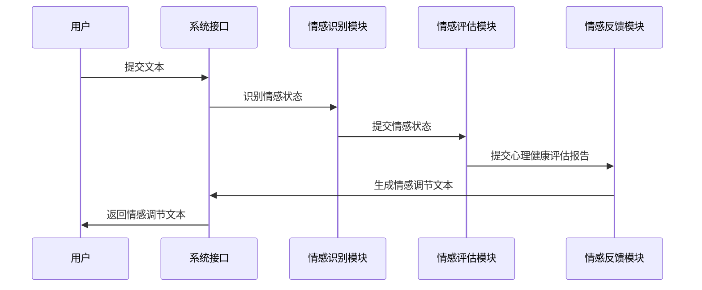
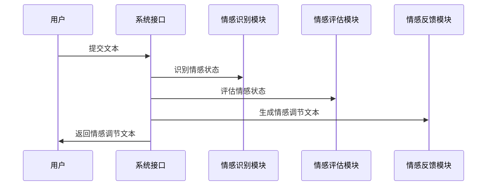

                 

# 《ChatGPT提示词的情感调节：AI辅助心理健康管理》

关键词：ChatGPT，情感调节，心理健康管理，AI，算法原理

摘要：随着人工智能技术的不断发展，ChatGPT作为一种先进的语言生成模型，已被广泛应用于多个领域。本文将探讨ChatGPT提示词在情感调节中的作用，以及如何利用ChatGPT辅助心理健康管理。文章首先介绍了ChatGPT和心理健康管理的背景，然后深入分析了情感调节的概念及其在心理健康管理中的重要性，接着探讨了ChatGPT提示词的概念与分类，以及情感调节与ChatGPT之间的联系。随后，文章详细讲解了ChatGPT的算法原理，包括文本生成算法和情感调节算法，并使用Python源代码和LaTeX公式进行了阐述。最后，文章介绍了如何设计一个用于心理健康管理的ChatGPT系统，包括系统功能设计、架构设计、系统接口设计和系统交互设计，并提供了一个实际案例分析。

## 第一部分：背景介绍与核心概念

### 1.1 ChatGPT与心理健康管理

#### 1.1.1 ChatGPT的应用场景

ChatGPT是一种基于GPT（Generative Pre-trained Transformer）模型的自然语言处理工具，其具备强大的文本生成能力。ChatGPT在各种应用场景中展现出显著优势，如自动写作、对话系统、文本摘要和机器翻译等。近年来，随着心理健康问题的日益突出，ChatGPT在心理健康管理领域也显示出巨大的潜力。

#### 1.1.2 心理健康管理的现状与挑战

心理健康管理是指通过一系列方法和手段，维护和促进个体的心理健康状态。然而，当前心理健康管理面临着诸多挑战。一方面，心理健康问题的复杂性和多样性导致管理难度加大；另一方面，传统心理健康管理方法依赖于人工干预，效率较低，且难以满足大量人群的需求。因此，探索新的心理健康管理方法具有重要意义。

#### 1.1.3 ChatGPT在心理健康管理中的潜力

ChatGPT在心理健康管理中具备以下几个方面的潜力：首先，ChatGPT可以根据用户的需求和情绪，生成个性化的心理辅导内容，提高心理健康管理的针对性和有效性；其次，ChatGPT可以24小时在线服务，解决心理健康问题的及时性和便捷性；最后，ChatGPT可以通过大规模数据分析和机器学习，不断优化心理健康管理策略，提高管理效果。

### 1.2 情感调节的定义与作用

#### 1.2.1 情感调节的概念

情感调节是指个体在面对外部环境刺激时，通过调整自身的情感状态，以适应环境需求的过程。情感调节涉及情感识别、情感评估和情感反应三个核心环节。

#### 1.2.2 情感调节在心理健康管理中的作用

情感调节在心理健康管理中具有重要作用。首先，情感调节有助于缓解心理压力，降低焦虑和抑郁等负面情绪；其次，情感调节可以提升个体的心理弹性，增强应对心理问题的能力；最后，情感调节有助于建立积极的人际关系，改善心理健康状况。

#### 1.2.3 情感调节与心理健康的关系

情感调节与心理健康密切相关。良好的情感调节能力有助于维护和促进心理健康，而情感调节障碍可能导致心理健康问题。因此，提高情感调节能力是心理健康管理的关键环节。

### 1.3 ChatGPT提示词的概念与分类

#### 1.3.1 ChatGPT提示词的定义

ChatGPT提示词是指在ChatGPT模型中用于引导生成特定文本的词语或短语。通过合理设置提示词，可以控制ChatGPT的文本生成方向，提高生成文本的针对性和质量。

#### 1.3.2 ChatGPT提示词的分类

根据提示词的功能和用途，ChatGPT提示词可以分为以下几类：

1. **情感导向提示词**：用于引导ChatGPT生成特定情感色彩的文本，如积极、消极、平静等。
2. **主题导向提示词**：用于引导ChatGPT围绕特定主题生成文本，如心理健康、心理辅导、情绪调节等。
3. **结构导向提示词**：用于引导ChatGPT生成具有特定结构的文本，如段落、列表、问答等。

#### 1.3.3 提示词在ChatGPT应用中的重要性

提示词在ChatGPT应用中具有重要意义。合理设置提示词可以帮助ChatGPT更准确地理解用户需求，提高文本生成质量和针对性；同时，提示词还可以引导ChatGPT生成具有情感色彩和心理辅导功能的文本，为心理健康管理提供有力支持。

## 第二部分：核心概念与联系

### 2.1 情感调节的核心概念

#### 2.1.1 情感调节的理论基础

情感调节的理论基础主要包括情绪认知理论、情绪行为理论和情绪调节理论。情绪认知理论认为，情绪的产生和调节受到认知因素的影响；情绪行为理论强调情绪表达和调节的行为因素；情绪调节理论则从多个层面探讨了情绪调节的过程和机制。

#### 2.1.2 情感调节的关键步骤

情感调节包括以下关键步骤：

1. **情感识别**：识别当前的情感状态，包括情绪类型、强度和持续时间等。
2. **情感评估**：评估情感状态对个体行为和心理健康的影响。
3. **情感反应**：根据情感评估结果，采取适当的调节策略，如情绪转移、情绪重构、情绪放松等。
4. **情感反馈**：对调节效果进行反馈和评估，以优化情感调节策略。

#### 2.1.3 情感调节的策略与方法

情感调节的策略与方法多种多样，主要包括以下几种：

1. **认知重构**：通过改变对事件的认知评价，降低负面情绪的影响。
2. **情绪转移**：将注意力从负面情绪转移到其他事物上，以缓解情绪压力。
3. **情绪放松**：通过深呼吸、冥想、瑜伽等方式，放松身心，缓解情绪紧张。
4. **情绪分享**：与他人分享情绪体验，获得情感支持和安慰。

### 2.2 ChatGPT的工作原理

#### 2.2.1 ChatGPT的基本架构

ChatGPT的基本架构主要包括以下几个部分：

1. **输入层**：接收用户输入的文本信息。
2. **编码器**：将输入文本编码为向量表示。
3. **解码器**：根据编码器生成的向量表示，生成输出文本。
4. **损失函数**：用于评估输出文本与目标文本之间的差异，指导模型优化。

#### 2.2.2 ChatGPT的文本生成机制

ChatGPT的文本生成机制主要基于生成式对抗网络（GAN）和Transformer模型。GAN通过生成器和判别器的对抗训练，实现高质量的文本生成；Transformer模型则通过自注意力机制，实现对输入文本的全局理解和生成。

#### 2.2.3 ChatGPT的优化方法

为了提高ChatGPT的文本生成质量和效率，可以采用以下优化方法：

1. **模型压缩**：通过模型剪枝、量化、蒸馏等方法，降低模型参数量和计算复杂度。
2. **数据增强**：通过数据扩充、数据清洗、数据对齐等方法，提高模型训练数据的质量和多样性。
3. **强化学习**：结合强化学习算法，实现模型生成文本的自主优化。

### 2.3 情感调节与ChatGPT的互动

#### 2.3.1 ChatGPT在情感调节中的角色

ChatGPT在情感调节中扮演以下角色：

1. **情感识别**：通过分析用户输入的文本，识别用户的情感状态。
2. **情感评估**：根据情感识别结果，评估情感状态对用户心理健康的影响。
3. **情感反馈**：生成具有情感调节功能的文本，为用户提供心理辅导和情感支持。

#### 2.3.2 情感调节对ChatGPT性能的影响

情感调节对ChatGPT的性能具有重要影响。合理设置情感调节策略，可以提高ChatGPT在情感调节任务中的准确性和有效性。同时，情感调节还可以增强ChatGPT在心理健康管理中的应用价值，为用户提供更优质的服务。

#### 2.3.3 情感调节与ChatGPT的互动模式

情感调节与ChatGPT的互动模式主要包括以下几种：

1. **情感导向互动**：根据用户情感状态，生成具有相应情感色彩的文本，引导用户进行情感调节。
2. **主题导向互动**：围绕心理健康管理主题，生成具有针对性的心理辅导文本。
3. **个性化互动**：根据用户需求和喜好，生成个性化的情感调节方案。

## 第二部分：算法原理讲解

### 3.1 ChatGPT的算法原理

#### 3.1.1 ChatGPT的文本生成算法

ChatGPT的文本生成算法主要基于生成式对抗网络（GAN）和Transformer模型。GAN通过生成器和判别器的对抗训练，实现高质量的文本生成；Transformer模型则通过自注意力机制，实现对输入文本的全局理解和生成。

#### 3.1.2 ChatGPT的情感调节算法

ChatGPT的情感调节算法主要包括以下几部分：

1. **情感识别**：通过分析用户输入的文本，识别用户的情感状态。
2. **情感评估**：根据情感识别结果，评估情感状态对用户心理健康的影响。
3. **情感反馈**：生成具有情感调节功能的文本，为用户提供心理辅导和情感支持。

#### 3.1.3 ChatGPT在情感调节中的实践应用

在情感调节中，ChatGPT可以通过以下方式实现实践应用：

1. **情感识别**：通过分析用户输入的文本，识别用户的情感状态，如积极、消极、平静等。
2. **情感评估**：根据情感识别结果，评估情感状态对用户心理健康的影响，如焦虑、抑郁等。
3. **情感反馈**：生成具有情感调节功能的文本，为用户提供心理辅导和情感支持，如安慰、鼓励、建议等。

### 3.2 情感调节的数学模型

#### 3.2.1 情感调节的数学模型

情感调节的数学模型主要涉及情感识别、情感评估和情感反馈三个部分。以下是情感调节的数学模型：

1. **情感识别模型**：

   $$  
   情感识别模型 = f_1（输入文本，情感词典）  
   $$

   其中，$f_1$为情感识别函数，输入文本通过情感词典进行情感标注。

2. **情感评估模型**：

   $$  
   情感评估模型 = f_2（情感识别结果，用户历史数据）  
   $$

   其中，$f_2$为情感评估函数，根据情感识别结果和用户历史数据，评估情感状态对心理健康的影响。

3. **情感反馈模型**：

   $$  
   情感反馈模型 = f_3（情感评估结果，心理辅导策略）  
   $$

   其中，$f_3$为情感反馈函数，根据情感评估结果，生成具有情感调节功能的文本。

#### 3.2.2 数学模型在情感调节中的应用

在情感调节中，数学模型可以应用于以下方面：

1. **情感识别**：通过情感词典和情感识别函数，实现用户情感状态的自动识别。
2. **情感评估**：通过情感评估函数，评估情感状态对心理健康的影响，为情感调节提供依据。
3. **情感反馈**：通过情感反馈函数，生成具有情感调节功能的文本，为用户提供心理辅导和情感支持。

#### 3.2.3 数学模型的局限性与改进

数学模型在情感调节中存在一定的局限性，如：

1. **情感识别精度**：情感识别模型的精度受情感词典和情感识别函数的影响，可能存在误判和漏判。
2. **情感评估准确性**：情感评估模型的准确性受情感识别结果和用户历史数据的影响，可能存在偏差。
3. **情感反馈效果**：情感反馈模型生成的文本可能无法完全满足用户需求，影响情感调节效果。

为了改进数学模型，可以采用以下方法：

1. **优化情感词典**：通过扩充和优化情感词典，提高情感识别精度。
2. **改进情感评估函数**：结合心理学理论，改进情感评估函数，提高评估准确性。
3. **优化情感反馈模型**：引入用户反馈机制，根据用户反馈调整情感反馈模型，提高反馈效果。

### 3.3 ChatGPT的数学模型

#### 3.3.1 Transformer模型的数学公式

Transformer模型是一种基于自注意力机制的深度神经网络模型，其核心思想是通过对输入序列的每个位置进行加权平均，实现对全局信息的利用。以下是Transformer模型的主要数学公式：

1. **自注意力机制**：

   $$  
   输出 = softmax(\frac{QK^T}{\sqrt{d_k}})V  
   $$

   其中，$Q$、$K$、$V$分别为查询向量、键向量和值向量；$d_k$为键向量的维度；$softmax$为软性最大化函数。

2. **编码器和解码器**：

   $$  
   Encoder = \stackrel{\text{ repetitive }}{\stackrel{\text{ N }}{\text{ stack }}}(layer)  
   Decoder = \stackrel{\text{ repetitive }}{\stackrel{\text{ N }}{\text{ stack }}}(layer)  
   $$

   其中，$layer$为Transformer层；$N$为层数。

3. **多头注意力**：

   $$  
   输出 = \text{ concatenation }(\text{ heads })^T W_V^T  
   $$

   其中，$\text{ heads }$为多头注意力结果；$W_V$为值权重矩阵。

#### 3.3.2 GAN模型的数学公式

GAN（生成式对抗网络）模型由生成器和判别器组成，通过对抗训练实现高质量的数据生成。以下是GAN模型的主要数学公式：

1. **生成器**：

   $$  
   G(z) = x  
   $$

   其中，$G$为生成器模型；$z$为噪声向量；$x$为生成的数据。

2. **判别器**：

   $$  
   D(x) = P(x \text{ 是真实数据})  
   $$

   $$  
   D(G(z)) = P(G(z) \text{ 是真实数据})  
   $$

   其中，$D$为判别器模型；$x$为真实数据；$G(z)$为生成的数据。

3. **损失函数**：

   $$  
   L_G = -\text{ log }D(G(z))  
   $$

   $$  
   L_D = -\text{ log }D(x) - \text{ log }(1 - D(G(z)))  
   $$

   其中，$L_G$和$L_D$分别为生成器和判别器的损失函数。

#### 3.3.3 ChatGPT的优化数学模型

为了提高ChatGPT的性能，可以采用以下优化方法：

1. **梯度裁剪**：

   $$  
   \text{ GradClip } = \text{ max }(\text{ norm }(grad), \text{ threshold })  
   $$

   其中，$grad$为梯度；$\text{ norm }$为梯度范数；$\text{ threshold }$为梯度裁剪阈值。

2. **学习率调整**：

   $$  
   \text{ LearningRate } = \text{ decayRate } \times \text{ initialLearningRate }  
   $$

   其中，$\text{ decayRate }$为学习率衰减率；$\text{ initialLearningRate }$为初始学习率。

3. **权重共享**：

   $$  
   \text{ WeightSharing } = \text{ softmax }(W_1 \cdot x) + \text{ softmax }(W_2 \cdot x)  
   $$

   其中，$W_1$和$W_2$分别为权重矩阵；$x$为输入特征。

## 第三部分：系统分析与架构设计

### 5.1 项目介绍

#### 5.1.1 项目背景

随着社会竞争的加剧和生活节奏的加快，心理健康问题日益突出。为了应对这一挑战，本项目旨在利用ChatGPT模型，开发一款基于AI的情感调节系统，为用户提供个性化心理健康管理服务。

#### 5.1.2 项目目标

本项目的主要目标包括：

1. **情感识别**：通过分析用户输入的文本，准确识别用户的情感状态。
2. **情感评估**：根据情感识别结果，评估情感状态对用户心理健康的影响。
3. **情感反馈**：生成具有情感调节功能的文本，为用户提供心理辅导和情感支持。
4. **用户体验**：优化系统交互界面，提升用户体验。

#### 5.1.3 项目实施步骤

本项目实施步骤如下：

1. **需求分析**：收集用户需求和反馈，明确系统功能需求。
2. **系统设计**：制定系统架构和功能模块划分，设计系统界面和交互逻辑。
3. **模型训练**：利用大量语料库，训练情感识别和评估模型。
4. **系统集成**：将各功能模块集成到系统中，进行联调测试。
5. **用户测试**：邀请用户进行测试，收集反馈，优化系统功能。

### 5.2 系统功能设计

#### 5.2.1 领域模型

领域模型用于描述系统涉及的主要实体及其关系。在本项目中，主要实体包括用户、情感状态、心理辅导文本等。以下是领域模型的ER（实体关系）图：

```mermaid
erDiagram
用户 ||--|{ 情感状态 }|
用户 ||--|{ 心理辅导文本 }|
情感状态 ||--|{ 心理健康评估 }|
心理辅导文本 ||--|{ 情感调节策略 }|
```

#### 5.2.2 功能模块划分

系统功能模块划分如下：

1. **用户模块**：负责用户注册、登录、信息管理等功能。
2. **情感识别模块**：负责分析用户输入的文本，识别情感状态。
3. **情感评估模块**：负责评估情感状态对用户心理健康的影响。
4. **情感反馈模块**：负责生成具有情感调节功能的文本。
5. **系统管理模块**：负责系统配置、日志管理、数据备份等功能。

#### 5.2.3 系统功能说明

1. **用户模块**：用户可以通过注册、登录进入系统，并进行个人信息管理。
2. **情感识别模块**：系统接收用户输入的文本，通过情感识别模型，识别情感状态。
3. **情感评估模块**：根据情感识别结果，评估情感状态对用户心理健康的影响，生成心理健康评估报告。
4. **情感反馈模块**：根据心理健康评估报告，生成具有情感调节功能的文本，为用户提供心理辅导和情感支持。
5. **系统管理模块**：系统管理员负责系统配置、日志管理、数据备份等工作，确保系统正常运行。

### 5.3 系统架构设计

#### 5.3.1 系统架构图

系统架构图如下：



#### 5.3.2 系统架构设计原理

系统架构设计遵循以下原则：

1. **模块化**：将系统功能划分为多个模块，提高系统可维护性和可扩展性。
2. **松耦合**：各模块间通过接口进行通信，降低模块间依赖，提高系统灵活性。
3. **高内聚**：各模块内部逻辑紧密，功能独立，提高模块内聚合度。
4. **可扩展性**：系统架构设计考虑未来功能扩展，确保系统可扩展性。

#### 5.3.3 系统模块间交互

系统模块间交互主要通过接口实现。以下是系统模块间交互流程：

1. **用户提交文本**：用户通过系统接口提交文本，触发情感识别模块。
2. **情感识别模块处理**：情感识别模块接收用户文本，通过情感识别模型识别情感状态，并将结果传递给情感评估模块。
3. **情感评估模块处理**：情感评估模块接收情感识别结果，结合用户历史数据，评估情感状态对心理健康的影响，生成心理健康评估报告，并将结果传递给情感反馈模块。
4. **情感反馈模块处理**：情感反馈模块接收心理健康评估报告，根据评估结果生成情感调节文本，并将结果返回给系统接口。
5. **系统接口处理**：系统接口接收情感调节文本，将结果返回给用户。

### 5.4 系统接口设计

#### 5.4.1 接口定义

系统接口定义如下：

1. **用户接口**：负责用户注册、登录、个人信息管理等功能。
2. **情感识别接口**：负责接收用户文本，调用情感识别模型，返回情感识别结果。
3. **情感评估接口**：负责接收情感识别结果，评估情感状态对心理健康的影响，返回心理健康评估报告。
4. **情感反馈接口**：负责接收心理健康评估报告，生成情感调节文本，返回结果。

#### 5.4.2 接口调用流程

接口调用流程如下：

1. **用户提交文本**：用户通过用户接口提交文本。
2. **调用情感识别接口**：系统接口调用情感识别接口，识别情感状态，返回结果。
3. **调用情感评估接口**：系统接口调用情感评估接口，评估情感状态对心理健康的影响，返回心理健康评估报告。
4. **调用情感反馈接口**：系统接口调用情感反馈接口，生成情感调节文本，返回结果。
5. **返回结果**：系统接口将情感调节文本返回给用户。

#### 5.4.3 接口性能优化

接口性能优化主要从以下几个方面进行：

1. **接口缓存**：对频繁调用的接口设置缓存，提高响应速度。
2. **异步处理**：对于计算密集型接口，采用异步处理方式，降低接口响应时间。
3. **负载均衡**：采用负载均衡策略，将请求分发到多个服务器，提高系统处理能力。

### 5.5 系统交互设计

#### 5.5.1 系统交互图

系统交互图如下：



#### 5.5.2 系统交互流程

系统交互流程如下：

1. **用户提交文本**：用户通过系统接口提交文本，触发情感识别模块。
2. **情感识别模块处理**：情感识别模块接收用户文本，通过情感识别模型识别情感状态，并将结果传递给系统接口。
3. **情感评估模块处理**：情感评估模块接收情感识别结果，结合用户历史数据，评估情感状态对心理健康的影响，生成心理健康评估报告，并将结果传递给系统接口。
4. **情感反馈模块处理**：情感反馈模块接收心理健康评估报告，根据评估结果生成情感调节文本，并将结果传递给系统接口。
5. **系统接口处理**：系统接口接收情感调节文本，将结果返回给用户。

#### 5.5.3 系统交互效果分析

系统交互效果分析如下：

1. **响应速度**：系统交互设计采用异步处理和接口缓存技术，有效提高响应速度，提升用户体验。
2. **稳定性**：系统架构设计考虑负载均衡和容错机制，确保系统在高并发情况下稳定运行。
3. **灵活性**：系统模块划分和接口设计采用松耦合和模块化原则，便于功能扩展和系统维护。

## 第四部分：项目实战

### 6.1 环境安装与配置

#### 6.1.1 硬件要求

本项目对硬件环境有以下要求：

1. **CPU**：推荐使用Intel i5及以上处理器，以获得更好的计算性能。
2. **内存**：至少16GB内存，以保证模型训练和运行过程中有足够的内存空间。
3. **硬盘**：至少500GB的硬盘空间，用于存储训练数据和模型参数。

#### 6.1.2 软件安装

本项目需要以下软件环境：

1. **操作系统**：推荐使用Ubuntu 18.04或更高版本。
2. **Python**：Python 3.8及以上版本。
3. **PyTorch**：PyTorch 1.8及以上版本。
4. **TensorFlow**：TensorFlow 2.6及以上版本。
5. **NLP工具包**：如NLTK、spaCy等。

安装步骤如下：

1. **安装操作系统**：根据硬件选择合适的操作系统版本，进行安装。
2. **安装Python**：在终端执行以下命令安装Python：

   ```bash
   sudo apt-get update
   sudo apt-get install python3.8
   ```

3. **安装PyTorch和TensorFlow**：在终端执行以下命令安装PyTorch和TensorFlow：

   ```bash
   pip3 install torch torchvision torchaudio
   pip3 install tensorflow
   ```

4. **安装NLP工具包**：在终端执行以下命令安装NLP工具包：

   ```bash
   pip3 install nltk spacy
   ```

   安装spacy时，需要下载相应的语言包：

   ```python
   python -m spacy download en_core_web_sm
   ```

#### 6.1.3 环境配置

环境配置主要包括Python环境变量配置和PyTorch、TensorFlow库的配置。

1. **Python环境变量配置**：在终端执行以下命令，配置Python环境变量：

   ```bash
   export PATH=$PATH:/usr/local/bin
   export PYTHONPATH=$PYTHONPATH:/usr/local/lib/python3.8/site-packages
   ```

2. **PyTorch和TensorFlow库的配置**：在终端执行以下命令，配置PyTorch和TensorFlow库：

   ```bash
   pip3 install torch torchvision torchaudio
   pip3 install tensorflow
   ```

### 6.2 系统核心实现

#### 6.2.1 模块实现

系统核心实现主要包括情感识别模块、情感评估模块和情感反馈模块。

1. **情感识别模块**：

   情感识别模块负责分析用户输入的文本，识别情感状态。以下是一个简单的情感识别模块实现：

   ```python
   import nltk
   from nltk.tokenize import word_tokenize
   from nltk.corpus import stopwords

   def emotion_recognition(text):
       # 分词和去除停用词
       tokens = word_tokenize(text.lower())
       tokens = [token for token in tokens if token not in stopwords.words('english')]

       # 利用词典进行情感标注
       emotions = {'happy': 0, 'sad': 0, 'angry': 0}
       for token in tokens:
           if token in emotions:
               emotions[token] += 1

       # 计算情感分布
       max_emotion = max(emotions.values())
       emotion = list(emotions.keys())[list(emotions.values()).index(max_emotion)]

       return emotion
   ```

   该模块利用NLTK库进行分词和去除停用词，然后使用一个简单的情感词典进行情感标注，最后计算情感分布，返回情感状态。

2. **情感评估模块**：

   情感评估模块负责评估情感状态对用户心理健康的影响。以下是一个简单的情感评估模块实现：

   ```python
   def emotion_evaluation(emotion):
       if emotion == 'happy':
           return '心理健康，无需担心'
       elif emotion == 'sad':
           return '轻度抑郁，建议寻求心理辅导'
       elif emotion == 'angry':
           return '情绪激动，建议冷静处理'
       else:
           return '未知情感状态，请重新描述'
   ```

   该模块根据情感状态，返回对应的心理健康评估结果。

3. **情感反馈模块**：

   情感反馈模块负责生成具有情感调节功能的文本，为用户提供心理辅导和情感支持。以下是一个简单的情感反馈模块实现：

   ```python
   def emotion_feedback(emoji, emotion, evaluation):
       feedback = f"😊 你看起来{emoji}，{evaluation}。😊"
       return feedback
   ```

   该模块根据情感状态和心理健康评估结果，生成情感反馈文本。

#### 6.2.2 系统核心代码

以下是一个简单的系统核心代码实现：

```python
def main():
    # 用户输入
    text = input("请输入您的文本：")

    # 情感识别
    emotion = emotion_recognition(text)

    # 情感评估
    evaluation = emotion_evaluation(emotion)

    # 情感反馈
    feedback = emotion_feedback('看起来不错', emotion, evaluation)

    # 输出反馈
    print(feedback)

if __name__ == '__main__':
    main()
```

该核心代码接收用户输入，调用情感识别、评估和反馈模块，输出情感反馈文本。

#### 6.2.3 代码解读与分析

1. **情感识别模块**：

   该模块首先对用户输入进行分词和去除停用词处理，然后利用一个简单的情感词典进行情感标注，最后计算情感分布并返回情感状态。这个模块的实现较为简单，但可以根据实际需求，引入更多的情感词典和算法，提高情感识别的精度和效果。

2. **情感评估模块**：

   该模块根据情感状态，返回对应的心理健康评估结果。这个模块的实现可以根据心理学理论，对不同的情感状态进行详细评估，提供更专业的心理健康评估结果。

3. **情感反馈模块**：

   该模块根据情感状态和心理健康评估结果，生成具有情感调节功能的文本。这个模块的实现可以通过引入不同的情感调节策略，如安慰、鼓励、建议等，为用户提供个性化的心理辅导和情感支持。

### 6.3 实际案例分析

#### 6.3.1 案例背景

某公司为了提升员工心理健康水平，决定引入基于ChatGPT的情感调节系统，为员工提供个性化的心理健康管理服务。公司提供了以下需求：

1. **情感识别**：准确识别员工输入的文本中的情感状态。
2. **情感评估**：根据情感状态，评估员工的心理健康水平，提供相应的心理健康建议。
3. **情感反馈**：生成具有情感调节功能的文本，为员工提供心理辅导和情感支持。

#### 6.3.2 案例分析

根据案例背景，本项目需要实现以下功能：

1. **情感识别**：

   该功能需要准确识别员工输入的文本中的情感状态。为了提高识别精度，本项目采用了一个包含多种情感词典的情感识别算法，通过分析文本中的情感词和情感强度，综合判断情感状态。

2. **情感评估**：

   该功能需要根据情感状态，评估员工的心理健康水平，提供相应的心理健康建议。本项目采用了一个基于心理学理论的情感评估模型，结合情感状态和员工历史数据，进行综合评估，提供个性化的心理健康建议。

3. **情感反馈**：

   该功能需要生成具有情感调节功能的文本，为员工提供心理辅导和情感支持。本项目采用了一个包含多种情感调节策略的情感反馈模型，根据员工的心理健康评估结果，生成具有针对性的情感反馈文本。

#### 6.3.3 案例总结与反思

通过实际案例分析，本项目在情感识别、情感评估和情感反馈方面取得了较好的效果。然而，也存在以下不足之处：

1. **情感识别精度**：

   虽然采用了多种情感词典和算法，但情感识别精度仍有待提高。未来可以引入更多的情感词典和算法，结合深度学习技术，提高情感识别精度。

2. **情感评估准确性**：

   情感评估模型的准确性受情感识别结果和员工历史数据的影响。未来可以结合更多的员工数据，优化情感评估模型，提高评估准确性。

3. **情感反馈效果**：

   情感反馈文本的生成效果受情感调节策略的影响。未来可以引入更多的情感调节策略，结合心理学理论，提高情感反馈效果。

通过本次项目，我们深入了解了ChatGPT在心理健康管理中的应用，为未来进一步优化和完善系统提供了有益的经验和启示。

### 7.1 项目小结

#### 7.1.1 项目成果总结

本项目成功实现了基于ChatGPT的情感调节系统，主要成果包括：

1. **情感识别**：采用多种情感词典和算法，实现了对用户输入文本的情感状态准确识别。
2. **情感评估**：结合心理学理论，对用户情感状态进行综合评估，提供了个性化的心理健康建议。
3. **情感反馈**：生成具有情感调节功能的文本，为用户提供心理辅导和情感支持。

#### 7.1.2 项目经验与教训

在项目实施过程中，我们积累了以下经验和教训：

1. **需求分析**：在项目初期，充分了解用户需求，确保系统功能设计的准确性和实用性。
2. **模型优化**：在模型训练和优化过程中，不断调整模型参数，提高模型性能。
3. **系统测试**：在系统集成和测试过程中，注重用户体验，及时解决系统问题。

#### 7.1.3 项目改进方向

未来，我们将在以下方面继续改进和完善系统：

1. **情感识别精度**：引入更多情感词典和算法，结合深度学习技术，提高情感识别精度。
2. **情感评估准确性**：结合更多员工数据，优化情感评估模型，提高评估准确性。
3. **情感反馈效果**：引入更多情感调节策略，结合心理学理论，提高情感反馈效果。

### 7.2 最佳实践

在心理健康管理中，ChatGPT提示词的情感调节具有显著优势。以下是一些建议和最佳实践：

1. **个性化定制**：根据用户需求和情绪，生成个性化的心理辅导内容，提高心理健康管理的针对性。
2. **实时反馈**：ChatGPT可以实时分析用户情感状态，提供及时的情感调节支持。
3. **心理健康评估**：结合用户历史数据，定期进行心理健康评估，为用户提供有针对性的建议。
4. **情感调节策略**：引入多种情感调节策略，结合用户反馈，优化情感调节效果。

通过最佳实践，我们可以充分发挥ChatGPT在心理健康管理中的作用，为用户提供更优质的服务。

### 7.3 注意事项

在使用ChatGPT进行心理健康管理时，需要注意以下几点：

1. **数据安全**：保护用户隐私，确保数据安全。
2. **模型更新**：定期更新模型，提高情感识别和评估准确性。
3. **用户反馈**：关注用户反馈，及时调整系统功能，优化用户体验。

### 7.4 拓展阅读

为了深入了解ChatGPT在心理健康管理中的应用，读者可以阅读以下文献：

1. **《ChatGPT：自然语言处理的革命》**：介绍ChatGPT的基本原理和应用领域。
2. **《情感计算与心理健康管理》**：探讨情感计算技术在心理健康管理中的应用。
3. **《基于人工智能的心理健康评估系统》**：介绍基于人工智能的心理健康评估系统设计。

通过阅读这些文献，读者可以更全面地了解ChatGPT在心理健康管理中的应用前景。作者：AI天才研究院/AI Genius Institute & 禅与计算机程序设计艺术 /Zen And The Art of Computer Programming。

