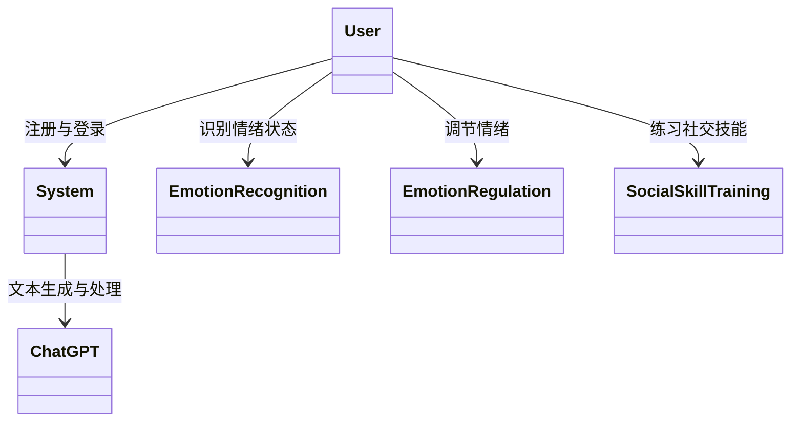
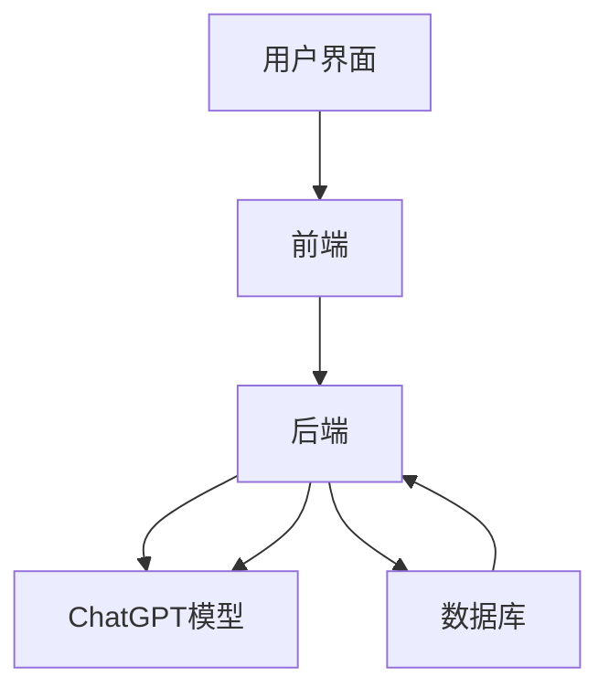
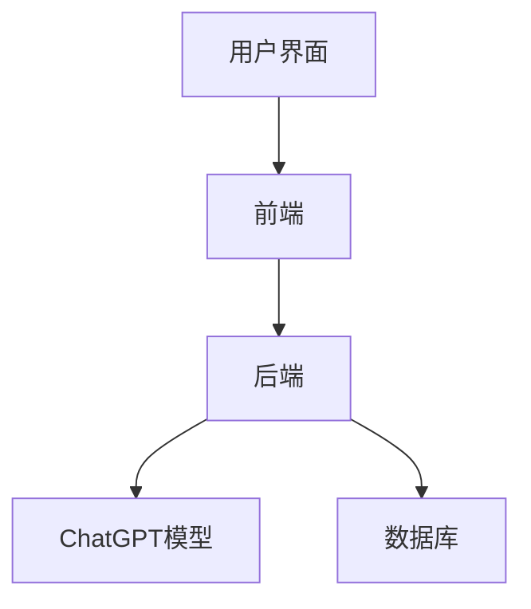

                 

### 背景介绍

#### 1.1 问题背景

随着全球信息化和互联网技术的迅猛发展，人们的生活和工作节奏日益加快，情感压力和心理问题逐渐凸显。在现代社会中，情商（Emotional Intelligence，简称EQ）成为衡量一个人综合素质的重要指标。情商不仅关系到个人的心理健康，还直接影响社会交往、职业发展和生活质量。然而，传统教育体系往往注重知识的传授，而对情商的培养重视不足，导致许多人在面对复杂的情感问题时感到无所适从。

情绪智能（Emotional Intelligence）作为情商的核心组成部分，包括自我意识、自我管理、社交意识和人际关系管理等方面。情绪智能的培养不仅有助于提升个人的心理健康，还能增强社会适应能力，提高工作效率。然而，目前针对情绪智能培养的方法和工具相对有限，尤其是在人工智能（AI）技术日益普及的背景下，如何利用AI辅助进行情绪智能培养成为了一个热门的研究方向。

ChatGPT是由OpenAI开发的一种基于Transformer架构的预训练语言模型，具有强大的自然语言处理能力。通过大量的文本数据训练，ChatGPT能够生成连贯、自然且符合语境的文本，广泛应用于聊天机器人、文本生成、机器翻译等领域。基于ChatGPT的特性，将其应用于情绪智能培养，有望实现个性化的情绪分析和引导，为个人提供更高效的情绪管理工具。

#### 1.2 核心概念

##### 情绪智能

情绪智能是指个体识别、理解、管理自己及他人的情绪，并利用这些信息来指导自己的思维和行为的能力。情绪智能包括以下四个主要组成部分：

1. **自我意识**：个体对自己情绪的认知和感知能力。
2. **自我管理**：个体控制自己的情绪，避免情绪冲动或过度反应的能力。
3. **社交意识**：个体理解他人情绪的能力，包括同理心和社交敏感性。
4. **人际关系管理**：个体利用情绪信息来维护良好人际关系的能力。

##### ChatGPT

ChatGPT是一种基于Transformer架构的预训练语言模型，通过大量的互联网文本数据进行训练，能够生成连贯、自然且符合语境的文本。ChatGPT具有以下主要特点：

1. **强大的自然语言理解能力**：能够理解和生成多种语言的文本。
2. **灵活的对话能力**：能够进行开放域的对话，并生成富有创意和逻辑性的回答。
3. **个性化的文本生成**：根据输入的提示词，能够生成符合上下文和情感色彩的文本。

##### 提示词

提示词（Prompt）是指在给模型输入时，用于引导模型生成特定类型输出的一段文本。在情绪智能培养中，提示词用于引导ChatGPT生成与情绪分析、情感引导相关的文本。有效的提示词设计对于实现情绪智能培养的效果至关重要。

##### 情感计算

情感计算（Affective Computing）是指使计算机具备识别、理解、处理和模拟人类情感的能力。情感计算结合了计算机科学、心理学和认知科学等多学科知识，旨在开发能够与人类进行情感交互的智能系统。情感计算在情绪智能培养中发挥着重要作用，通过分析用户的情绪状态，提供个性化的情绪管理建议。

#### 1.3 联系与边界

情绪智能与AI之间存在紧密的联系。AI技术，特别是自然语言处理和机器学习技术，为情绪智能的培养提供了强大的工具和方法。ChatGPT作为AI的一种重要应用，通过其强大的文本生成能力，能够为情绪智能培养提供个性化的情感分析和引导。

在ChatGPT应用于情绪智能培养时，提示词设计是关键。提示词的质量直接影响ChatGPT的情感分析结果和情感引导效果。有效的提示词应具有情感倾向明确、长度适中、清晰易懂等特点。

ChatGPT在情绪智能培养中的应用主要涉及情绪分析、情感引导和情绪调节等方面。然而，需要注意的是，ChatGPT的情绪分析能力受到其训练数据质量和模型设计的影响，存在一定的局限性。此外，情绪智能培养不仅需要AI技术的支持，还需要心理学和社会学等多领域的知识融合。

#### 1.4 本章小结

本章介绍了情绪智能培养的背景、核心概念和相关技术。情绪智能作为情商的核心组成部分，对个体的心理健康和社会适应能力具有重要意义。ChatGPT作为一种先进的AI技术，在情绪智能培养中具有广泛的应用潜力。提示词设计是关键，需要充分考虑情感倾向、长度和清晰度等因素。情感计算作为跨学科领域，为情绪智能培养提供了重要的理论和技术支持。下一章将深入探讨ChatGPT的基本原理和情绪智能的基础理论。## 第1章: 问题背景与核心概念

### 1.3 联系与边界

情绪智能与AI之间的关系紧密，两者相辅相成。情绪智能培养依赖于AI技术，尤其是自然语言处理和机器学习领域的进步。AI技术为情绪智能提供了数据分析和模式识别的工具，使得情绪智能的培养更加高效和个性化。

#### 情绪智能与AI的关系

情绪智能与AI的结合主要体现在以下几个方面：

1. **情感分析**：AI技术，如情感计算，能够对文本、语音和图像中的情感进行自动识别和分析。这种分析能力为情绪智能的培养提供了基础数据支持。
2. **个性化服务**：基于用户的情绪状态，AI系统可以提供个性化的情绪管理建议和干预措施，帮助个体更好地理解和控制自己的情绪。
3. **情感引导**：AI驱动的聊天机器人，如ChatGPT，能够通过对话生成技术，为用户提供情感支持和引导，帮助用户改善情绪状态。

#### ChatGPT在情绪智能培养中的应用

ChatGPT在情绪智能培养中的应用具有独特的优势：

1. **自然语言交互**：ChatGPT能够理解和生成自然语言，使得用户可以以自然的方式与系统进行交流，从而更容易接受和参与到情绪智能培养的过程中。
2. **情感敏感**：ChatGPT通过大量的情感文本数据进行训练，能够生成情感敏感的回应，帮助用户识别和理解自己的情绪。
3. **灵活性**：ChatGPT可以适应不同的情绪引导场景，通过不断学习和调整，为用户提供个性化的情绪管理方案。

#### 提示词在情感计算中的角色

提示词在情感计算中发挥着重要作用，其设计质量直接影响情感分析的效果：

1. **情感倾向**：有效的提示词应明确表达情感倾向，以便ChatGPT能够生成相应的情感分析结果。
2. **清晰度**：提示词应简洁明了，避免歧义，确保ChatGPT能够准确理解用户的情绪状态。
3. **目标导向**：提示词应明确引导ChatGPT生成目标类型的情绪分析结果，例如情绪分类、情感强度评估等。

#### 边界条件与适用场景

尽管ChatGPT在情绪智能培养中具有广泛应用潜力，但实际应用中仍需考虑以下边界条件：

1. **数据质量**：ChatGPT的情绪分析能力依赖于高质量的情感数据集。数据的质量直接影响模型的准确性和可靠性。
2. **模型局限性**：ChatGPT的情绪分析能力存在一定局限性，尤其是对于复杂情感和细微情绪差异的识别可能存在不足。
3. **隐私保护**：在应用过程中，需要保护用户的隐私数据，确保数据的安全和隐私。

综上所述，情绪智能与AI技术密切相关，ChatGPT在情绪智能培养中具有独特优势。然而，在实际应用中，需要充分考虑数据质量、模型局限性和隐私保护等问题，以确保情绪智能培养的有效性和安全性。下一章将深入探讨ChatGPT的基本原理和情绪智能的基础理论。

### 1.4 联系与边界

情绪智能与AI技术之间的联系在于，AI可以通过机器学习和自然语言处理等技术，帮助人们更好地理解和处理情绪。情绪智能（EQ）涵盖了对自身和他人的情绪认知、情绪调节以及社交技能。以下是如何通过AI来实现情绪智能的培养：

1. **情感分析**：AI可以利用情感分析技术来识别文本、语音和面部表情中的情绪。例如，ChatGPT可以通过分析用户的文字输入来识别其情绪状态，从而提供个性化的反馈和引导。

2. **个性化服务**：AI可以根据用户的历史情绪数据和偏好，提供个性化的情绪管理建议。例如，ChatGPT可以根据用户的情绪状态和历史对话记录，推荐合适的情绪调节策略或活动。

3. **情感引导**：AI可以模拟人类的情感交流，通过对话生成技术来引导用户进行情绪调节。例如，ChatGPT可以作为虚拟心理辅导员，与用户进行互动，帮助他们理解和管理自己的情绪。

#### ChatGPT在情绪智能培养中的应用

ChatGPT作为一种先进的语言模型，在情绪智能培养中有以下具体应用：

1. **情绪状态识别**：ChatGPT可以通过分析用户的文本输入来识别其情绪状态，如愤怒、悲伤或快乐。这有助于用户自我反思和情绪调节。

2. **情感互动**：ChatGPT可以与用户进行自然语言交互，提供情感支持。例如，用户可以与ChatGPT分享自己的烦恼，ChatGPT可以提供同理心回应和情感建议。

3. **情境模拟**：ChatGPT可以根据特定情境生成对话内容，帮助用户练习社交技能。例如，用户可以与ChatGPT模拟面试或社交场合，从而提高自己的情绪调节和社交能力。

#### 提示词在情感计算中的角色

提示词在情感计算中扮演着关键角色，其设计质量直接影响情感分析的结果：

1. **情感倾向**：提示词应明确表达情感倾向，帮助模型识别和理解情绪。例如，使用积极或消极的词汇来引导模型生成相应的情感分析结果。

2. **清晰度**：提示词应简洁明了，避免歧义，确保模型能够准确理解用户的情绪状态。例如，使用具体而非抽象的词汇来描述情绪。

3. **目标导向**：提示词应明确引导模型生成目标类型的情绪分析结果。例如，提示词应指导模型进行情绪分类、情感强度评估等。

#### 边界条件与适用场景

在实际应用中，ChatGPT在情绪智能培养中存在一些边界条件：

1. **数据质量**：ChatGPT的情绪分析依赖于高质量的情感数据集。数据的质量直接影响模型的准确性和可靠性。

2. **模型局限性**：尽管ChatGPT具有强大的语言生成能力，但在处理复杂情感和细微情绪差异时仍存在局限性。例如，ChatGPT可能无法准确识别双关语或隐喻中的情感。

3. **隐私保护**：在收集和使用用户情绪数据时，需要严格保护用户隐私，防止数据泄露。

4. **适用场景**：ChatGPT在情绪智能培养中的适用场景包括心理健康咨询、社交技能训练、情绪管理培训等。然而，对于严重心理问题的用户，AI辅助可能需要结合专业心理医生的建议。

综上所述，情绪智能与AI技术之间的结合为情绪智能培养提供了新的方法和途径。ChatGPT作为一种AI工具，在情绪智能培养中具有广泛应用前景，但同时也需要关注数据质量、模型局限性和隐私保护等问题。下一章将深入探讨ChatGPT的基本原理和情绪智能的基础理论，以更好地理解其工作机制和应用方法。## 1.4 本章小结

本章介绍了情绪智能培养的背景、核心概念和相关技术。情绪智能作为情商的核心组成部分，对个体的心理健康和社会适应能力具有重要意义。ChatGPT作为一种先进的AI技术，在情绪智能培养中具有广泛的应用潜力。通过自然语言处理和机器学习技术，ChatGPT能够为情绪智能培养提供个性化的情感分析和引导。提示词设计是关键，需要充分考虑情感倾向、长度和清晰度等因素。情感计算作为跨学科领域，为情绪智能培养提供了重要的理论和技术支持。然而，情绪智能培养不仅需要AI技术的支持，还需要心理学和社会学等多领域的知识融合。下一章将深入探讨ChatGPT的基本原理和情绪智能的基础理论，进一步揭示其在情绪智能培养中的应用机制。## 第2章: ChatGPT基本原理

### 2.1 ChatGPT概述

ChatGPT是由OpenAI开发的一种基于Transformer架构的预训练语言模型。它采用大规模无监督学习的方法，通过学习海量的互联网文本数据，使其具备了强大的自然语言理解和生成能力。ChatGPT的核心目标是生成高质量、连贯且符合上下文的文本，从而在多个领域实现智能对话、文本生成和机器翻译等功能。

#### 发展历程

ChatGPT的发展历程可以追溯到2018年，当时OpenAI发布了GPT（Generative Pre-trained Transformer）系列模型。GPT、GPT-2和GPT-3等模型相继推出，其中GPT-3成为了目前最先进的预训练语言模型。ChatGPT是基于GPT-3进行二次开发的一种专用聊天机器人模型，旨在提供更自然、更流畅的对话体验。

#### 技术特点

1. **大规模预训练**：ChatGPT采用了大量的文本数据（超过175亿个参数）进行预训练，使其具备了广泛的词汇知识和丰富的语言理解能力。
2. **Transformer架构**：ChatGPT基于Transformer架构，这种架构在处理长文本和生成任务时具有显著优势，能够更好地捕捉文本之间的长距离依赖关系。
3. **自适应学习**：ChatGPT具有自适应学习能力，可以根据不同的输入文本和任务需求，调整其生成策略和回答风格。
4. **多语言支持**：ChatGPT支持多种语言，可以生成符合目标语言语法和文化的文本。

#### 应用领域

ChatGPT在多个领域展示了强大的应用潜力：

1. **聊天机器人**：ChatGPT可以应用于智能客服、社交机器人、在线咨询等场景，为用户提供自然、流畅的对话体验。
2. **文本生成**：ChatGPT可以生成新闻文章、博客内容、技术文档等，提高内容创作的效率和质量。
3. **机器翻译**：ChatGPT可以用于实时翻译服务，支持多种语言之间的翻译，提高跨语言沟通的效率。
4. **自然语言处理**：ChatGPT可以应用于文本分类、情感分析、命名实体识别等任务，提供强大的语言理解和生成能力。

### 2.2 ChatGPT内部工作机制

ChatGPT的工作机制可以分为三个主要阶段：数据预处理、模型训练和文本生成。

#### 数据预处理

1. **文本收集**：ChatGPT采用了大量的互联网文本数据进行训练，这些数据来源于各种网页、书籍、新闻、论坛等。
2. **文本清洗**：对收集到的文本进行清洗，去除无关信息、噪音和重复文本，确保数据的质量和一致性。
3. **文本编码**：将文本转化为模型能够处理的格式，例如WordPiece编码或BERT编码，以便模型进行有效的学习。

#### 模型训练

1. **预训练**：ChatGPT通过预训练学习大量文本数据，使其具备了基本的语言理解和生成能力。预训练过程中，模型会通过无监督学习的方式，理解文本中的语法、语义和上下文关系。
2. **微调**：在预训练的基础上，ChatGPT会对特定任务进行微调，以提高其在特定领域或任务中的性能。微调过程中，模型会利用有监督学习的方式，根据标注数据进行优化。

#### 文本生成

1. **输入处理**：将用户的输入文本进行处理，包括分词、编码等，将其转化为模型能够识别的输入格式。
2. **生成文本**：模型根据输入文本和预训练的知识，生成相应的文本输出。生成过程中，模型会根据上下文和目标语言风格，生成连贯、自然的文本。
3. **后处理**：对生成的文本进行后处理，包括语法检查、格式化等，确保文本的质量和可读性。

### 2.3 情绪智能基本理论

情绪智能（Emotional Intelligence，简称EQ）是指个体识别、理解、管理和利用情绪信息，以实现自我发展、社交适应和高效工作能力的能力。情绪智能包括以下四个主要组成部分：

1. **自我意识**：个体对自己情绪的认知和感知能力，包括识别和理解自己的情绪状态。
2. **自我管理**：个体控制自己情绪的能力，包括情绪调节、压力管理和情绪抑制。
3. **社交意识**：个体理解他人情绪的能力，包括同理心和社交敏感性。
4. **人际关系管理**：个体利用情绪信息维护良好人际关系的能力，包括社交技能和冲突管理。

情绪智能的发展历程可以追溯到20世纪80年代，心理学家戈尔曼（Daniel Goleman）首次提出了情绪智能的概念，并进行了广泛的研究。随着心理学、神经科学和人工智能等领域的不断发展，情绪智能的理论和实际应用得到了进一步的深化和扩展。

在情商提升中的作用：

1. **心理健康**：情绪智能的培养有助于提升个体的心理健康，减少情绪问题对生活质量的影响。
2. **社交能力**：情绪智能的提升有助于增强个体的社交能力，建立和维护良好的人际关系。
3. **工作效率**：情绪智能的培养有助于提升个体在工作中的情绪调节能力，提高工作效率和团队合作能力。
4. **职业发展**：情绪智能作为职业素养的重要组成部分，对个体的职业发展和领导力提升具有重要作用。

### 2.4 提示词设计原则

提示词（Prompt）是引导ChatGPT生成特定类型文本的关键，其设计质量直接影响情绪智能培养的效果。以下是一些提示词设计原则：

1. **情感倾向**：提示词应明确表达情感倾向，以引导ChatGPT生成符合情感色彩的文本。例如，使用积极或消极的词汇来引导情绪分析或情感引导。
2. **长度与清晰度**：提示词应简洁明了，避免歧义，以确保ChatGPT能够准确理解用户的情绪状态。过长的提示词可能会使模型产生混淆，降低生成文本的质量。
3. **目标导向**：提示词应明确引导ChatGPT生成目标类型的情绪分析结果。例如，提示词应指导模型进行情绪分类、情感强度评估等，以提高情绪分析的准确性。
4. **多样性**：提示词设计应具有多样性，以适应不同情绪状态和情境。多样化的提示词可以丰富ChatGPT的生成文本，提高情绪智能培养的效果。

### 2.5 本章小结

本章介绍了ChatGPT的基本原理和情绪智能的基础理论。ChatGPT作为一种先进的预训练语言模型，通过大规模预训练和自适应学习，具备了强大的自然语言理解和生成能力。情绪智能作为情商的核心组成部分，对个体的心理健康和社会适应能力具有重要意义。提示词设计原则为ChatGPT在情绪智能培养中的应用提供了重要指导。下一章将深入探讨ChatGPT在情绪智能培养中的应用，包括情绪分析、情感引导和情绪调节等方面。## 第2章: ChatGPT基本原理

### 2.1 ChatGPT概述

ChatGPT是一款由OpenAI开发的基于Transformer架构的预训练语言模型，其目的是为了生成连贯且符合上下文的自然语言文本。ChatGPT是GPT（Generative Pre-trained Transformer）系列模型的进一步扩展，特别是基于GPT-3模型进行的优化。以下是ChatGPT的概述：

#### 发展历程

- **GPT（2018年）**：OpenAI发布了GPT模型，这是一个基于Transformer架构的预训练语言模型，它基于大量文本数据进行训练，能够生成高质量的自然语言文本。
- **GPT-2（2019年）**：为了进一步提高生成文本的质量，OpenAI推出了GPT-2模型，它使用了更多的训练数据和更复杂的架构。
- **GPT-3（2020年）**：GPT-3是GPT系列的最新版本，具有1750亿个参数，是当时最大的预训练语言模型。GPT-3的发布标志着预训练语言模型在自然语言处理领域的重大突破。
- **ChatGPT（2022年）**：基于GPT-3，OpenAI开发了ChatGPT，这是一个专门用于生成对话文本的语言模型，旨在提供更加自然和流畅的对话体验。

#### 技术特点

- **大规模预训练**：ChatGPT通过大规模无监督预训练，学习了大量互联网文本数据，从而具备了广泛的词汇知识和丰富的语言理解能力。
- **Transformer架构**：ChatGPT采用了Transformer架构，这种架构能够处理长文本并生成高质量的自然语言文本，同时具有并行计算的优势。
- **自适应学习**：ChatGPT能够根据不同的输入文本和任务需求，动态调整生成策略和回答风格，从而提供更加个性化的对话体验。
- **多语言支持**：ChatGPT支持多种语言，能够生成符合目标语言语法和文化的文本。

#### 应用领域

ChatGPT在多个领域展示了强大的应用潜力：

- **聊天机器人**：ChatGPT可以用于构建智能客服、社交机器人、在线咨询等，为用户提供自然、流畅的对话体验。
- **文本生成**：ChatGPT可以生成新闻文章、博客内容、技术文档等，提高内容创作的效率和多样性。
- **机器翻译**：ChatGPT可以用于实时翻译服务，支持多种语言之间的翻译，提高跨语言沟通的效率。
- **自然语言处理**：ChatGPT可以用于文本分类、情感分析、命名实体识别等任务，提供强大的语言理解和生成能力。

### 2.2 ChatGPT内部工作机制

ChatGPT的工作机制主要包括三个阶段：数据预处理、模型训练和文本生成。

#### 数据预处理

数据预处理是模型训练的第一步，主要任务是收集、清洗和编码文本数据。具体步骤如下：

1. **文本收集**：ChatGPT使用了大量的互联网文本数据，包括网页、书籍、新闻、论坛等，这些数据来源广泛，涵盖了多种主题和语言风格。
2. **文本清洗**：对收集到的文本进行清洗，去除无关信息、噪音和重复文本，确保数据的质量和一致性。清洗过程可能包括去除HTML标签、统一文本格式、去除停用词等。
3. **文本编码**：将清洗后的文本转化为模型能够处理的格式。常见的编码方法包括WordPiece编码和BERT编码。WordPiece编码将文本分割成子词单元，而BERT编码则使用双向编码器来捕获文本的语义信息。

#### 模型训练

模型训练是ChatGPT的核心步骤，主要包括预训练和微调两个阶段：

1. **预训练**：预训练是无监督学习的过程，模型通过大量文本数据进行自我学习，从而获得基本的语言理解能力和文本生成能力。预训练过程中，模型会自动学习文本中的语法、语义和上下文关系。
2. **微调**：在预训练的基础上，模型会对特定任务进行微调，以提高其在特定领域或任务中的性能。微调过程通常使用有监督学习，即模型会根据标注数据进行优化。例如，在情感分析任务中，模型会根据标注的情感标签来调整参数，以提高情感分类的准确性。

#### 文本生成

文本生成是ChatGPT的核心功能，其工作流程如下：

1. **输入处理**：将用户的输入文本进行处理，包括分词、编码等，将其转化为模型能够识别的输入格式。
2. **生成文本**：模型根据输入文本和预训练的知识，生成相应的文本输出。生成过程中，模型会根据上下文和目标语言风格，生成连贯、自然的文本。生成文本的过程通常是一个概率过程，模型会根据输入文本的分布生成下一个词语，直到生成完整的句子或段落。
3. **后处理**：对生成的文本进行后处理，包括语法检查、格式化等，确保文本的质量和可读性。后处理过程可能包括拼写检查、语法修正、标点符号调整等。

### 2.3 情绪智能基本理论

情绪智能（Emotional Intelligence，简称EQ）是指个体识别、理解、管理和利用情绪信息，以实现自我发展、社交适应和高效工作能力的能力。情绪智能包括以下四个主要组成部分：

1. **自我意识**：个体对自己情绪的认知和感知能力，包括识别和理解自己的情绪状态。自我意识是情绪智能的基础，个体需要能够识别自己何时感到快乐、悲伤、愤怒等情绪。
2. **自我管理**：个体控制自己情绪的能力，包括情绪调节、压力管理和情绪抑制。自我管理有助于个体在面对压力和挑战时保持冷静和理智，避免情绪失控。
3. **社交意识**：个体理解他人情绪的能力，包括同理心和社交敏感性。社交意识使个体能够感知和理解他人的情绪状态，从而更好地与他人沟通和建立关系。
4. **人际关系管理**：个体利用情绪信息维护良好人际关系的能力，包括社交技能和冲突管理。人际关系管理有助于个体在社交场合中处理冲突、建立信任和增进理解。

情绪智能的发展历程可以追溯到20世纪80年代，心理学家戈尔曼（Daniel Goleman）首次提出了情绪智能的概念，并进行了广泛的研究。随着心理学、神经科学和人工智能等领域的不断发展，情绪智能的理论和实际应用得到了进一步的深化和扩展。

#### 在情商提升中的作用

情绪智能在情商提升中起着至关重要的作用：

1. **心理健康**：情绪智能的培养有助于提升个体的心理健康，减少情绪问题对生活质量的影响。通过自我意识和自我管理，个体可以更好地理解和控制自己的情绪，降低焦虑和抑郁的风险。
2. **社交能力**：情绪智能的提升有助于增强个体的社交能力，建立和维护良好的人际关系。通过社交意识和人际关系管理，个体能够更好地理解他人情绪，提高沟通和合作能力。
3. **工作效率**：情绪智能的培养有助于提升个体在工作中的情绪调节能力，提高工作效率和团队合作能力。通过自我意识和自我管理，个体可以更好地应对工作压力，保持积极的工作态度。
4. **职业发展**：情绪智能作为职业素养的重要组成部分，对个体的职业发展和领导力提升具有重要作用。通过情绪智能的培养，个体可以更好地处理职场冲突、建立团队信任和提高领导力。

### 2.4 提示词设计原则

提示词（Prompt）是引导ChatGPT生成特定类型文本的关键，其设计质量直接影响情绪智能培养的效果。以下是一些提示词设计原则：

1. **情感倾向**：提示词应明确表达情感倾向，以引导ChatGPT生成符合情感色彩的文本。例如，使用积极或消极的词汇来引导情绪分析或情感引导。
2. **长度与清晰度**：提示词应简洁明了，避免歧义，以确保ChatGPT能够准确理解用户的情绪状态。过长的提示词可能会使模型产生混淆，降低生成文本的质量。
3. **目标导向**：提示词应明确引导ChatGPT生成目标类型的情绪分析结果。例如，提示词应指导模型进行情绪分类、情感强度评估等，以提高情绪分析的准确性。
4. **多样性**：提示词设计应具有多样性，以适应不同情绪状态和情境。多样化的提示词可以丰富ChatGPT的生成文本，提高情绪智能培养的效果。

### 2.5 本章小结

本章介绍了ChatGPT的基本原理和情绪智能的基础理论。ChatGPT作为一种先进的预训练语言模型，通过大规模预训练和自适应学习，具备了强大的自然语言理解和生成能力。情绪智能作为情商的核心组成部分，对个体的心理健康和社会适应能力具有重要意义。提示词设计原则为ChatGPT在情绪智能培养中的应用提供了重要指导。下一章将深入探讨ChatGPT在情绪智能培养中的应用，包括情绪分析、情感引导和情绪调节等方面。## 第3章: ChatGPT情绪分析能力

### 3.1 情绪分析基础

情绪分析（Affective Analysis）是自然语言处理（NLP）领域的一个重要研究方向，旨在通过分析文本、语音和图像等数据，识别和理解其中蕴含的情绪信息。情绪分析在智能客服、情感计算、心理健康等领域具有广泛的应用前景。

#### 情绪分类

情绪分类是情绪分析的基础，常见的情绪分类体系包括：

1. **基本情绪分类**：基本情绪分类将情绪划分为几个基本类别，如快乐、悲伤、愤怒、恐惧、惊讶等。这种分类方法相对简单，适用于一些简单的情绪识别任务。
2. **扩展情绪分类**：扩展情绪分类在基本情绪分类的基础上，加入了更多的情绪类别，如厌恶、信任、兴奋、紧张等。这种分类方法更接近人类的情绪体验，但同时也增加了识别的复杂度。

#### 情绪识别方法

情绪识别方法主要包括以下几种：

1. **基于规则的方法**：这种方法通过定义一套规则，将文本或语音中的情绪信息映射到具体的情绪类别。基于规则的方法简单易实现，但缺乏灵活性，难以应对复杂的情绪识别任务。
2. **机器学习方法**：机器学习方法通过训练大量的情绪标注数据，建立情绪分类模型。常见的机器学习方法包括朴素贝叶斯、支持向量机（SVM）、决策树、深度学习等。深度学习方法在情绪识别中表现出色，能够自动提取文本特征，实现端到端的情绪分类。
3. **情感强度评估**：情感强度评估旨在量化文本中的情绪强度，即情绪的积极程度或消极程度。常见的情感强度评估方法包括基于词嵌入的方法和基于模型的方法。基于词嵌入的方法通过计算文本中词语的情感极性，进行情感强度评估；基于模型的方法则通过训练情绪强度评估模型，对文本进行情感强度预测。

### 3.2 ChatGPT情绪分析实现

ChatGPT作为一种强大的预训练语言模型，在情绪分析任务中具有显著的优势。以下是ChatGPT情绪分析实现的步骤：

#### 数据预处理

1. **文本收集**：收集大量包含情绪信息的文本数据，如社交媒体帖子、博客文章、新闻报道等。这些数据应涵盖多种情绪类别，以确保模型具有广泛的情绪识别能力。
2. **文本清洗**：对收集到的文本进行清洗，去除无关信息、噪声和重复文本，确保数据的质量和一致性。清洗过程可能包括去除HTML标签、统一文本格式、去除停用词等。
3. **文本编码**：将清洗后的文本转化为模型能够处理的格式。常见的编码方法包括WordPiece编码和BERT编码。WordPiece编码将文本分割成子词单元，而BERT编码则使用双向编码器来捕获文本的语义信息。

#### 模型选择与训练

1. **模型选择**：选择适合情绪分析任务的预训练模型，如GPT、BERT或RoBERTa等。这些模型已经在大规模文本数据上进行了预训练，具备强大的语言理解和生成能力。
2. **模型微调**：在预训练的基础上，对模型进行微调，以适应具体的情绪分析任务。微调过程通常使用有监督学习，即模型会根据标注数据进行优化。情绪标注数据应包含情绪类别和情感强度等标签。

#### 情绪分析结果验证

1. **评估指标**：使用常见的评估指标，如准确率（Accuracy）、精确率（Precision）、召回率（Recall）和F1分数（F1 Score），评估情绪分析模型的性能。
2. **交叉验证**：采用交叉验证方法，对模型进行验证，以确保其泛化能力。交叉验证可以避免模型过拟合，提高模型的可靠性。
3. **错误分析**：对模型预测的错误进行详细分析，找出情绪识别的难点和问题，为后续改进提供参考。

### 3.3 情绪分析应用案例

情绪分析在实际应用中具有广泛的应用前景，以下是一些情绪分析的应用案例：

1. **社交媒体情绪分析**：通过对社交媒体帖子进行情绪分析，可以了解公众对特定事件或产品的情绪倾向。这种分析有助于企业进行市场调研和品牌管理。
2. **情感咨询**：在心理健康领域，情绪分析可以用于分析患者的情绪状态，为心理医生提供诊断和治疗建议。
3. **智能客服**：在客户服务领域，情绪分析可以用于分析客户反馈，识别客户情绪，提供更加个性化的服务和支持。
4. **教育评估**：在教育领域，情绪分析可以用于分析学生的情绪状态，了解学生的学习效果和心理健康状况，为教育工作者提供参考。

#### 实际场景

1. **社交网络分析**：在社交网络平台上，情绪分析可以用于分析用户对某一事件或品牌的情绪反应。例如，通过对微博、推特等平台上的帖子进行情绪分析，可以了解公众对某一政策、品牌或公共事件的看法和情绪。
2. **客户情绪识别**：在客户服务领域，情绪分析可以用于识别客户来电的情绪状态，提供更加个性化的服务。例如，电话客服系统可以自动分析客户语音中的情绪，根据情绪状态调整客服策略。
3. **心理健康诊断**：在心理健康领域，情绪分析可以用于分析患者的情绪状态，为心理医生提供诊断和治疗建议。例如，通过对患者的文本日志、语音记录等进行情绪分析，可以了解患者的心理健康状况，辅助心理医生制定治疗方案。

#### 分析结果与应用效果

情绪分析的结果可以应用于多个领域，以下是一些应用效果：

1. **市场调研**：通过情绪分析，企业可以了解消费者对产品的情绪反应，优化产品设计和营销策略。例如，通过对用户评论进行情绪分析，可以发现产品中的痛点，及时进行改进。
2. **客户满意度评估**：在客户服务领域，情绪分析可以用于评估客户满意度。通过分析客户反馈中的情绪，可以识别不满意的客户，提供针对性的解决方案，提高客户满意度。
3. **心理健康监测**：在心理健康领域，情绪分析可以用于监测患者的情绪变化，及时发现潜在的心理健康问题。例如，通过对患者的社交媒体帖子进行情绪分析，可以了解患者的情绪状态，为心理医生提供诊断和治疗建议。
4. **教育评估**：在教育领域，情绪分析可以用于评估学生的学习效果和心理健康状况。例如，通过对学生的作文、日记等进行情绪分析，可以了解学生的学习压力和心理健康状况，为教育工作者提供参考。

### 3.4 本章小结

情绪分析是自然语言处理领域的一个重要研究方向，旨在通过分析文本、语音和图像等数据，识别和理解其中蕴含的情绪信息。ChatGPT作为一种强大的预训练语言模型，在情绪分析任务中具有显著的优势。本章介绍了情绪分析的基础、ChatGPT情绪分析实现的步骤以及情绪分析的实际应用案例。通过情绪分析，可以为多个领域提供有价值的信息和决策支持，如市场调研、客户服务、心理健康监测和教育评估等。下一章将探讨ChatGPT在情感引导与对话管理方面的应用。## 第3章: ChatGPT情绪分析能力

### 3.1 情绪分析基础

情绪分析作为自然语言处理（NLP）的一个重要分支，其核心目标是识别和理解文本中的情绪信息。情绪分析在情感计算、智能客服、心理健康等领域具有广泛应用。

#### 情绪分类

情绪分类是指将文本中的情绪标签归类到预定义的情绪类别中。常见的情绪分类体系包括：

1. **基本情绪分类**：基本情绪分类将情绪划分为几个基本类别，如快乐、悲伤、愤怒、恐惧、惊讶等。这种方法相对简单，但能够满足一些基本应用需求。

2. **扩展情绪分类**：扩展情绪分类在基本情绪分类的基础上，增加了更多细分的情绪类别，如厌恶、信任、兴奋、紧张等。这种分类方法更贴近人类的情感体验，但识别复杂度也相应提高。

#### 情绪识别方法

情绪识别方法主要包括：

1. **基于规则的方法**：这种方法通过定义一套规则，将文本或语音中的情绪信息映射到具体的情绪类别。基于规则的方法简单易实现，但缺乏灵活性，难以应对复杂的情绪识别任务。

2. **机器学习方法**：机器学习方法通过训练大量的情绪标注数据，建立情绪分类模型。常见的机器学习方法包括朴素贝叶斯、支持向量机（SVM）、决策树、深度学习等。深度学习方法在情绪识别中表现出色，能够自动提取文本特征，实现端到端的情绪分类。

3. **情感强度评估**：情感强度评估旨在量化文本中的情绪强度，即情绪的积极程度或消极程度。常见的情感强度评估方法包括基于词嵌入的方法和基于模型的方法。基于词嵌入的方法通过计算文本中词语的情感极性，进行情感强度评估；基于模型的方法则通过训练情感强度评估模型，对文本进行情感强度预测。

### 3.2 ChatGPT情绪分析实现

ChatGPT作为一种基于Transformer架构的预训练语言模型，在情绪分析任务中具有显著优势。以下是ChatGPT情绪分析实现的步骤：

#### 数据预处理

1. **文本收集**：收集大量包含情绪信息的文本数据，如社交媒体帖子、博客文章、新闻报道等。这些数据应涵盖多种情绪类别，以确保模型具有广泛的情绪识别能力。

2. **文本清洗**：对收集到的文本进行清洗，去除无关信息、噪声和重复文本，确保数据的质量和一致性。清洗过程可能包括去除HTML标签、统一文本格式、去除停用词等。

3. **文本编码**：将清洗后的文本转化为模型能够处理的格式。常见的编码方法包括WordPiece编码和BERT编码。WordPiece编码将文本分割成子词单元，而BERT编码则使用双向编码器来捕获文本的语义信息。

#### 模型选择与训练

1. **模型选择**：选择适合情绪分析任务的预训练模型，如GPT、BERT或RoBERTa等。这些模型已经在大规模文本数据上进行了预训练，具备强大的语言理解和生成能力。

2. **模型微调**：在预训练的基础上，对模型进行微调，以适应具体的情绪分析任务。微调过程通常使用有监督学习，即模型会根据标注数据进行优化。情绪标注数据应包含情绪类别和情感强度等标签。

#### 情绪分析结果验证

1. **评估指标**：使用常见的评估指标，如准确率（Accuracy）、精确率（Precision）、召回率（Recall）和F1分数（F1 Score），评估情绪分析模型的性能。

2. **交叉验证**：采用交叉验证方法，对模型进行验证，以确保其泛化能力。交叉验证可以避免模型过拟合，提高模型的可靠性。

3. **错误分析**：对模型预测的错误进行详细分析，找出情绪识别的难点和问题，为后续改进提供参考。

### 3.3 情绪分析应用案例

情绪分析在实际应用中具有广泛的应用前景，以下是一些情绪分析的应用案例：

1. **社交媒体情绪分析**：通过对社交媒体帖子进行情绪分析，可以了解公众对特定事件或产品的情绪倾向。这种分析有助于企业进行市场调研和品牌管理。

2. **情感咨询**：在心理健康领域，情绪分析可以用于分析患者的情绪状态，为心理医生提供诊断和治疗建议。

3. **智能客服**：在客户服务领域，情绪分析可以用于分析客户反馈，识别客户情绪，提供更加个性化的服务和支持。

4. **教育评估**：在教育领域，情绪分析可以用于分析学生的情绪状态，了解学生的学习效果和心理健康状况，为教育工作者提供参考。

#### 实际场景

1. **社交网络分析**：在社交网络平台上，情绪分析可以用于分析用户对某一事件或品牌的情绪反应。例如，通过对微博、推特等平台上的帖子进行情绪分析，可以了解公众对某一政策、品牌或公共事件的看法和情绪。

2. **客户情绪识别**：在客户服务领域，情绪分析可以用于识别客户来电的情绪状态，提供更加个性化的服务。例如，电话客服系统可以自动分析客户语音中的情绪，根据情绪状态调整客服策略。

3. **心理健康诊断**：在心理健康领域，情绪分析可以用于分析患者的情绪状态，为心理医生提供诊断和治疗建议。例如，通过对患者的文本日志、语音记录等进行情绪分析，可以了解患者的心理健康状况，辅助心理医生制定治疗方案。

#### 分析结果与应用效果

情绪分析的结果可以应用于多个领域，以下是一些应用效果：

1. **市场调研**：通过情绪分析，企业可以了解消费者对产品的情绪反应，优化产品设计和营销策略。例如，通过对用户评论进行情绪分析，可以发现产品中的痛点，及时进行改进。

2. **客户满意度评估**：在客户服务领域，情绪分析可以用于评估客户满意度。通过分析客户反馈中的情绪，可以识别不满意的客户，提供针对性的解决方案，提高客户满意度。

3. **心理健康监测**：在心理健康领域，情绪分析可以用于监测患者的情绪变化，及时发现潜在的心理健康问题。例如，通过对患者的社交媒体帖子进行情绪分析，可以了解患者的情绪状态，为心理医生提供诊断和治疗建议。

4. **教育评估**：在教育领域，情绪分析可以用于评估学生的学习效果和心理健康状况。例如，通过对学生的作文、日记等进行情绪分析，可以了解学生的学习压力和心理健康状况，为教育工作者提供参考。

### 3.4 本章小结

情绪分析作为自然语言处理领域的一个重要研究方向，通过分析文本、语音和图像等数据，识别和理解其中蕴含的情绪信息。ChatGPT作为一种强大的预训练语言模型，在情绪分析任务中具有显著优势。本章介绍了情绪分析的基础、ChatGPT情绪分析实现的步骤以及情绪分析的实际应用案例。通过情绪分析，可以为多个领域提供有价值的信息和决策支持，如市场调研、客户服务、心理健康监测和教育评估等。下一章将探讨ChatGPT在情感引导与对话管理方面的应用。## 第4章: ChatGPT情感引导与对话管理

### 4.1 情感引导原理

情感引导（Emotional Guidance）是指通过特定的沟通策略和对话技术，帮助个体识别、理解和调节自己的情绪，从而实现情绪智力的提升。ChatGPT在情感引导中的作用主要体现在以下几个方面：

1. **同理心建立**：通过生成具有同理心的回应，ChatGPT可以帮助用户感受到被理解和接纳，从而为情感引导奠定基础。
2. **情绪识别**：ChatGPT可以识别用户的情绪状态，提供相应的反馈，帮助用户更清晰地认识到自己的情绪。
3. **情绪调节**：ChatGPT可以通过提供情绪调节策略，如放松技巧、积极心态建设等，帮助用户管理情绪。
4. **情境模拟**：ChatGPT可以模拟不同的社交情境，让用户在虚拟环境中练习情绪调节和社交技能。

#### 对话流程设计

情感引导的对话流程设计至关重要，以下是一个典型的情感引导对话流程：

1. **开场白**：ChatGPT通过友好、温暖的开场白建立信任，如“你好，很高兴能与你交流。”
2. **情绪识别**：ChatGPT通过提问或文本分析，识别用户的情绪状态，如“你最近感觉怎么样？”
3. **同理心回应**：ChatGPT生成同理心回应，表达对用户情绪的理解，如“我能感受到你有些沮丧，这很正常。”
4. **情绪调节建议**：ChatGPT提供情绪调节建议，如“可以尝试做一些深呼吸，放松一下。”
5. **情境模拟**：ChatGPT模拟社交情境，让用户练习情绪调节和社交技能，如“想象一下，如果你和朋友发生争执，你会怎么做？”
6. **总结反馈**：ChatGPT总结对话内容，提供反馈，如“你今天学到了很多情绪调节的方法，希望对你有帮助。”

### 4.2 对话管理策略

有效的对话管理策略对于实现情感引导至关重要。以下是一些关键对话管理策略：

1. **情绪反馈机制**：ChatGPT应能够及时、准确地识别用户的情绪，并生成相应的反馈。这可以通过训练模型识别情绪关键词和情绪强度来实现。
2. **适应性对话**：ChatGPT应根据用户的情绪和对话情境，灵活调整对话内容和风格，提供个性化的情感引导。
3. **情境切换**：ChatGPT应具备情境切换能力，能够在不同对话阶段切换到合适的情境，如从情绪识别阶段切换到情绪调节阶段。
4. **用户引导**：ChatGPT应引导用户积极参与对话，通过提问、反馈和鼓励，促进用户表达自己的情绪和想法。
5. **情感平衡**：ChatGPT在对话中应保持情感平衡，既不过度积极也不过度消极，以免对用户产生负面影响。

### 4.3 情感引导应用

情感引导在多个领域具有广泛的应用，以下是一些具体应用场景：

1. **心理健康咨询**：ChatGPT可以作为虚拟心理辅导员，为用户提供情感支持和引导，帮助用户识别和管理情绪问题。
2. **社交技能培训**：ChatGPT可以模拟社交情境，帮助用户练习情绪调节和社交技能，提高社交能力。
3. **情感教育**：ChatGPT可以用于情感教育课程，帮助用户了解情绪智能的重要性，掌握情绪管理技巧。
4. **企业员工辅导**：ChatGPT可以为企业员工提供情感支持，帮助员工缓解工作压力，提高工作满意度。

#### 实际案例

以下是一个实际案例，展示了ChatGPT在情感引导中的应用：

**案例背景**：一名用户在与ChatGPT进行交流时，表达了自己对工作压力和人际关系的困扰。

**对话内容**：

用户：我感觉最近工作压力很大，和同事的关系也变得越来越紧张。

ChatGPT：我能理解你的感受，面对工作压力和人际关系问题，这是很常见的。首先，我们可以尝试一些放松技巧，比如深呼吸和冥想，帮助缓解压力。

用户：嗯，我现在感觉好多了。那关于人际关系，你有什么建议吗？

ChatGPT：当然，尝试主动与同事沟通，了解他们的想法和需求，这样可以减少误解和冲突。另外，也可以寻求心理辅导，了解更多情绪调节技巧。

用户：谢谢你，你的建议很有帮助。

ChatGPT：很高兴能帮到你。记得在生活中保持积极心态，情绪管理是一个持续的过程，我们会一起努力。

**应用效果**：通过这次对话，用户学会了深呼吸和冥想等放松技巧，缓解了工作压力。同时，ChatGPT提供了人际沟通的建议，帮助用户改善与同事的关系，提高了社交能力。

### 4.4 本章小结

情感引导是通过沟通策略和对话技术，帮助个体识别、理解和调节情绪的过程。ChatGPT在情感引导中发挥了重要作用，通过同理心建立、情绪识别、情绪调节和情境模拟，为用户提供个性化的情感支持。有效的对话管理策略和实际应用案例，展示了ChatGPT在情感引导和对话管理中的巨大潜力。下一章将探讨ChatGPT在情商提升中的辅助功能。## 第4章: ChatGPT情感引导与对话管理

### 4.1 情感引导原理

情感引导（Emotional Guidance）是利用对话交流帮助个体识别、理解和调节情绪的过程。ChatGPT作为一种先进的语言模型，在情感引导中具有独特的优势：

1. **同理心建立**：ChatGPT能够生成具有同理心的回应，使用户感受到被理解和支持。通过同理心建立，为后续的情感引导奠定基础。

2. **情绪识别**：ChatGPT通过分析用户的语言和语境，能够识别用户的情绪状态。这种能力有助于用户更清晰地认识到自己的情绪，从而为情绪调节提供依据。

3. **情绪调节**：ChatGPT可以提供各种情绪调节策略，如放松技巧、积极心态建设等，帮助用户管理情绪。这些策略通过对话形式传达，使得用户更容易接受和实践。

4. **情境模拟**：ChatGPT能够模拟不同的社交情境，让用户在虚拟环境中练习情绪调节和社交技能。这种情境模拟有助于用户在实际生活中更好地应对情绪挑战。

#### 对话流程设计

情感引导的对话流程设计对于效果至关重要。以下是情感引导对话流程的几个关键步骤：

1. **开场白**：ChatGPT通过友好、温暖的开场白建立信任，如：“你好，很高兴能与你交流。”

2. **情绪识别**：ChatGPT通过提问或文本分析，识别用户的情绪状态，如：“你最近感觉怎么样？”

3. **同理心回应**：ChatGPT生成同理心回应，表达对用户情绪的理解，如：“我能感受到你有些沮丧，这很正常。”

4. **情绪调节建议**：ChatGPT提供情绪调节建议，如：“可以尝试做一些深呼吸，放松一下。”

5. **情境模拟**：ChatGPT模拟不同的社交情境，让用户练习情绪调节和社交技能，如：“想象一下，如果你和朋友发生争执，你会怎么做？”

6. **总结反馈**：ChatGPT总结对话内容，提供反馈，如：“你今天学到了很多情绪调节的方法，希望对你有帮助。”

### 4.2 对话管理策略

有效的对话管理策略对于实现情感引导至关重要。以下是一些关键对话管理策略：

1. **情绪反馈机制**：ChatGPT应能够及时、准确地识别用户的情绪，并生成相应的反馈。这可以通过训练模型识别情绪关键词和情绪强度来实现。

2. **适应性对话**：ChatGPT应根据用户的情绪和对话情境，灵活调整对话内容和风格，提供个性化的情感引导。

3. **情境切换**：ChatGPT应具备情境切换能力，能够在不同对话阶段切换到合适的情境，如从情绪识别阶段切换到情绪调节阶段。

4. **用户引导**：ChatGPT应引导用户积极参与对话，通过提问、反馈和鼓励，促进用户表达自己的情绪和想法。

5. **情感平衡**：ChatGPT在对话中应保持情感平衡，既不过度积极也不过度消极，以免对用户产生负面影响。

### 4.3 情感引导应用

情感引导在多个领域具有广泛的应用，以下是一些具体应用场景：

1. **心理健康咨询**：ChatGPT可以作为虚拟心理辅导员，为用户提供情感支持和引导，帮助用户识别和管理情绪问题。

2. **社交技能培训**：ChatGPT可以模拟社交情境，帮助用户练习情绪调节和社交技能，提高社交能力。

3. **情感教育**：ChatGPT可以用于情感教育课程，帮助用户了解情绪智能的重要性，掌握情绪管理技巧。

4. **企业员工辅导**：ChatGPT可以为企业员工提供情感支持，帮助员工缓解工作压力，提高工作满意度。

#### 实际案例

以下是一个实际案例，展示了ChatGPT在情感引导中的应用：

**案例背景**：一名用户在与ChatGPT进行交流时，表达了自己对工作压力和人际关系的困扰。

**对话内容**：

用户：我感觉最近工作压力很大，和同事的关系也变得越来越紧张。

ChatGPT：我能理解你的感受，面对工作压力和人际关系问题，这是很常见的。首先，我们可以尝试一些放松技巧，比如深呼吸和冥想，帮助缓解压力。

用户：嗯，我现在感觉好多了。那关于人际关系，你有什么建议吗？

ChatGPT：当然，尝试主动与同事沟通，了解他们的想法和需求，这样可以减少误解和冲突。另外，也可以寻求心理辅导，了解更多情绪调节技巧。

用户：谢谢你，你的建议很有帮助。

ChatGPT：很高兴能帮到你。记得在生活中保持积极心态，情绪管理是一个持续的过程，我们会一起努力。

**应用效果**：通过这次对话，用户学会了深呼吸和冥想等放松技巧，缓解了工作压力。同时，ChatGPT提供了人际沟通的建议，帮助用户改善与同事的关系，提高了社交能力。

### 4.4 本章小结

情感引导是通过对话交流帮助个体识别、理解和调节情绪的过程。ChatGPT在情感引导中发挥了重要作用，通过同理心建立、情绪识别、情绪调节和情境模拟，为用户提供个性化的情感支持。有效的对话管理策略和实际应用案例，展示了ChatGPT在情感引导和对话管理中的巨大潜力。下一章将探讨ChatGPT在情商提升中的辅助功能。## 第5章: ChatGPT在情商提升中的辅助功能

### 5.1 情商提升路径

情商提升是一个持续的过程，包括以下几个基本步骤：

1. **自我认识与反思**：个体需要认识自己的情绪，学会自我观察和反思。通过自我认识，个体可以更好地理解自己的情绪反应，并找到情绪管理的策略。

2. **情绪调节与压力管理**：个体需要学会如何调节自己的情绪，尤其是在面对压力和挑战时。情绪调节技巧包括深呼吸、冥想、正念练习等，这些技巧有助于缓解情绪紧张和压力。

3. **社交技能培养**：个体需要培养良好的社交技能，如倾听、沟通、同理心等。社交技能的培养有助于个体更好地与他人建立和维护人际关系。

4. **情感教育与学习**：个体需要不断学习情感知识和技巧，提高自己的情商。通过参加情感教育课程、阅读相关书籍和文章，个体可以不断积累情感知识，提高情感管理水平。

### 5.2 ChatGPT的辅助功能

ChatGPT在情商提升中可以发挥多种辅助功能，以下是一些具体的应用：

1. **自我认识与反思**：

   ChatGPT可以通过对话帮助用户进行自我认识与反思。用户可以与ChatGPT分享自己的情绪体验和思考，ChatGPT可以提供反馈和指导，帮助用户更深入地了解自己的情绪和行为模式。

   **示例对话**：

   用户：我最近感觉特别焦虑，不知道该怎么办。

   ChatGPT：焦虑是一种常见的情绪反应，可能是因为你面临了一些压力或挑战。首先，我们可以尝试了解一下你的焦虑来源。你是担心工作上的事情吗？

   用户：是的，我担心最近的项目会失败。

   ChatGPT：了解你的担忧后，我们可以一起探讨一些应对策略。例如，你可以分解项目任务，逐步完成，这样可以减少你的焦虑感。另外，你可以试着进行一些放松活动，如深呼吸或冥想，帮助缓解焦虑。

2. **情绪调节与压力管理**：

   ChatGPT可以提供一系列情绪调节和压力管理技巧，帮助用户应对情绪困扰。这些技巧包括深呼吸、正念练习、认知重构等。

   **示例对话**：

   用户：我感到很沮丧，不知道该怎么调节情绪。

   ChatGPT：沮丧是一种自然的情绪反应，但我们可以尝试一些方法来帮助你调节情绪。首先，深呼吸是一个简单有效的放松技巧。你可以尝试深吸一口气，慢慢呼出，重复几次。这样可以帮助你缓解情绪紧张。

   用户：谢谢，我试试看。

   ChatGPT：很好，如果你感到情绪还是难以控制，可以尝试一些正念练习。例如，专注于你的呼吸，观察你的身体感受，这有助于你回到当下，减少负面情绪。

3. **社交技能培养**：

   ChatGPT可以模拟社交情境，帮助用户练习社交技能。通过与ChatGPT进行对话，用户可以学习如何进行有效的沟通、表达自己的观点和倾听他人。

   **示例对话**：

   用户：我最近和同事发生了一些争执，不知道该怎么处理。

   ChatGPT：处理职场争执需要一定的沟通技巧。首先，你可以尝试冷静下来，不要在情绪激动时做出决策。然后，你可以找一个合适的时机和同事进行沟通，表达你的观点和感受。

   用户：那应该怎么表达呢？

   ChatGPT：你可以使用“I语言”，即表达自己的感受和需求，而不是指责对方。例如，你可以说：“我感到有些不满，因为你的某些行为让我感到不舒服。我希望我们能一起找到解决问题的方法。”

4. **情感教育与学习**：

   ChatGPT可以作为情感教育的工具，帮助用户学习情感知识和技巧。用户可以通过与ChatGPT的互动，了解情绪智能的重要性、情绪调节策略、社交技能等。

   **示例对话**：

   用户：我想学习一些情绪调节的方法。

   ChatGPT：当然，情绪调节是情商的重要部分。首先，你可以尝试认知重构，即改变对事物的看法，从消极的角度转向积极的角度。例如，如果你觉得工作压力很大，你可以试着将其视为一个挑战，一个可以让你成长的机会。

   用户：这个方法听起来不错，我试试看。

   ChatGPT：很好，记住情绪调节是一个持续的过程，需要时间和练习。不断学习和实践，你会逐渐掌握更多的情绪调节技巧。

### 5.3 案例分析

以下是一个实际案例，展示了ChatGPT在情商提升中的应用：

**案例背景**：一名大学生在准备毕业论文的过程中感到压力很大，导致情绪低落，影响了学习效果。

**案例过程**：

1. **自我认识与反思**：学生通过与ChatGPT的对话，认识到自己的情绪困扰主要源于对毕业论文的担忧和对未来职业发展的不确定。

2. **情绪调节与压力管理**：ChatGPT提供了深呼吸和冥想等放松技巧，帮助学生缓解焦虑和压力。此外，ChatGPT还建议学生分解论文任务，逐步完成，以减轻压力。

3. **社交技能培养**：ChatGPT模拟了与导师沟通的情境，帮助学生练习如何与导师沟通，寻求帮助和指导。

4. **情感教育与学习**：ChatGPT通过对话，向学生介绍了情绪智能的重要性、情绪调节策略和社交技能，帮助学生提升情商。

**案例结果**：

通过ChatGPT的辅助，学生逐渐学会了情绪调节技巧，缓解了压力，提高了学习效率。同时，通过与ChatGPT的对话，学生提升了社交技能，建立了更好的师生关系。最终，学生在毕业论文上取得了优异的成绩。

### 5.4 本章小结

ChatGPT在情商提升中具有多种辅助功能，包括自我认识与反思、情绪调节与压力管理、社交技能培养和情感教育与学习。通过这些功能，ChatGPT可以帮助用户识别、理解和调节情绪，提升情商，改善生活质量。实际案例展示了ChatGPT在情商提升中的有效性，为未来进一步研究和应用提供了宝贵经验。下一章将探讨如何通过实践步骤和技巧来应用ChatGPT进行情绪智能培养。## 第6章: 实践步骤与技巧

### 6.1 实践准备

为了有效利用ChatGPT进行情绪智能培养，首先需要做好以下准备工作：

#### 硬件与软件环境搭建

1. **硬件环境**：确保计算机具有足够的计算资源和内存。推荐配置为：CPU：Intel Core i7或以上；内存：16GB或以上；硬盘：256GB SSD。

2. **软件环境**：安装以下软件和工具：
   - 操作系统：Windows 10或更高版本；
   - Python：3.7或以上版本；
   - Anaconda：用于环境管理和包管理；
   - Jupyter Notebook：用于编写和运行Python代码。

#### 数据来源与处理

1. **数据收集**：收集包含情绪信息的文本数据，如社交媒体帖子、博客文章、新闻报道等。数据来源可以包括公共数据集、社交媒体API等。

2. **数据清洗**：对收集到的文本数据进行清洗，去除无关信息、噪音和重复文本。清洗步骤可能包括：
   - 去除HTML标签；
   - 去除停用词；
   - 分词；
   - 去除标点符号。

3. **数据预处理**：将清洗后的文本数据转换为适合模型训练的格式。常用的文本预处理方法包括：
   - 词嵌入：将文本转换为向量表示，如Word2Vec、BERT；
   - 序列编码：将文本序列编码为整数序列，便于模型处理。

### 6.2 提示词编写与优化

提示词的设计质量直接影响ChatGPT的情绪分析效果。以下是一些提示词编写与优化的技巧：

#### 提示词编写流程

1. **确定目标**：明确提示词的目标，例如情绪识别、情感强度评估等。

2. **情感倾向**：根据目标，选择具有明确情感倾向的词汇和短语。例如，对于情绪识别，可以使用积极或消极的词汇。

3. **长度与清晰度**：提示词应简洁明了，避免歧义。建议长度在5-10个词之间。

4. **多样性**：设计多样化的提示词，以适应不同的情绪状态和情境。

#### 提示词优化方法

1. **情感分析**：通过情感分析技术，评估提示词的情感倾向和强度。常用的情感分析工具包括VADER、TextBlob等。

2. **用户反馈**：收集用户对提示词的反馈，根据用户需求进行调整。用户反馈可以提供宝贵的优化建议。

3. **实验对比**：通过对比不同提示词的性能，选择最佳提示词组合。可以使用A/B测试等方法，评估提示词的效果。

### 6.3 情绪分析与引导实践

情绪分析与引导实践是情绪智能培养的核心步骤。以下是一些关键实践方法：

#### 情绪分析实践

1. **模型选择**：选择适合情绪分析任务的预训练模型，如BERT、GPT等。这些模型已在大量文本数据上进行了预训练，具有强大的情绪识别能力。

2. **模型训练**：使用标注数据集对模型进行训练。训练过程可能包括数据预处理、模型微调、训练和评估等步骤。

3. **性能评估**：使用评估指标（如准确率、召回率、F1分数）评估情绪分析模型的性能。根据评估结果，调整模型参数和训练策略。

#### 对话管理实践

1. **对话设计**：设计符合用户需求的对话流程，包括开场白、情绪识别、情绪调节建议和情境模拟等。

2. **对话生成**：利用ChatGPT的文本生成能力，生成符合对话流程的回应。

3. **对话反馈**：收集用户对对话的反馈，根据反馈调整对话内容和风格，提高用户体验。

#### 情感引导实践

1. **情感识别**：通过情绪分析，识别用户的情绪状态，如快乐、悲伤、愤怒等。

2. **情感反馈**：生成同理心回应，表达对用户情绪的理解和支持。

3. **情感调节**：提供情绪调节建议，如放松技巧、认知重构等。

4. **情境模拟**：模拟不同的社交情境，帮助用户练习情绪调节和社交技能。

### 6.4 本章小结

通过本章的实践步骤与技巧，我们可以系统地利用ChatGPT进行情绪智能培养。首先，需要做好硬件与软件环境的搭建，收集和处理情绪数据。其次，编写和优化提示词，以提高情绪分析的效果。最后，通过情绪分析与引导实践，帮助用户识别、理解和调节情绪，提升情商。这些实践步骤和技巧为情绪智能培养提供了有力支持，有助于实现个性化的情绪管理。## 第6章: 实践步骤与技巧

### 6.1 实践准备

在开始利用ChatGPT进行情绪智能培养之前，确保具备适当的硬件和软件环境是至关重要的。以下是详细的步骤和注意事项：

#### 硬件环境

1. **计算资源**：确保计算机具备足够的计算能力。推荐配置为：
   - CPU：Intel Core i7或以上；
   - 内存：16GB或更高；
   - 硬盘：至少256GB的SSD。

2. **硬件需求**：由于ChatGPT是一个基于深度学习的模型，其对计算资源的需求相对较高。确保计算机能够稳定运行训练任务，避免因计算资源不足导致的训练中断。

#### 软件环境

1. **Python环境**：安装Python 3.7或更高版本。Python是一种广泛使用的编程语言，为机器学习和深度学习提供了丰富的库和工具。

2. **Anaconda**：推荐使用Anaconda进行环境管理和包管理。Anaconda是一个开源的数据科学平台，可以帮助轻松创建和管理多个Python环境，便于管理不同项目所需的库和依赖项。

3. **Jupyter Notebook**：安装Jupyter Notebook，这是一个交互式的Python环境，方便编写和运行代码。Jupyter Notebook提供了一个直观的界面，可以实时查看代码执行结果。

4. **其他工具**：安装Git（版本控制工具）和Markdown（文档编写工具），以便更好地管理和记录项目进度。

#### 数据来源与处理

1. **数据收集**：收集包含情绪信息的文本数据。数据来源可以包括社交媒体帖子、博客文章、情感标签的新闻报道、用户生成的内容等。确保数据来源多样化，以涵盖多种情绪状态和情境。

2. **数据清洗**：对收集到的文本数据进行清洗，去除无关信息、噪声和重复文本。清洗步骤可能包括：
   - **去除HTML标签**：使用正则表达式或其他工具去除文本中的HTML标签。
   - **统一文本格式**：统一文本的大小写、标点符号等，确保文本的一致性。
   - **去除停用词**：停用词是常见但不提供有用信息的词汇，如“的”、“了”、“和”等。可以使用预定义的停用词列表去除这些词汇。
   - **分词**：将文本分割成单词或子词单元，以便模型进行更细致的处理。

3. **数据预处理**：将清洗后的文本数据转换为适合模型训练的格式。常用的文本预处理方法包括：
   - **词嵌入**：将文本转换为向量表示，如Word2Vec、BERT等。词嵌入可以将文本中的词语映射到高维向量空间，便于模型学习。
   - **序列编码**：将文本序列编码为整数序列，便于模型处理。

### 6.2 提示词编写与优化

提示词是引导ChatGPT生成特定类型文本的关键。以下是编写和优化提示词的详细步骤：

#### 提示词编写流程

1. **确定目标**：明确提示词的目标，例如情绪识别、情感强度评估、情境模拟等。目标应具体、明确，以指导模型生成相关文本。

2. **情感倾向**：根据目标，选择具有明确情感倾向的词汇和短语。例如，对于情绪识别，可以使用积极或消极的词汇，如“快乐”、“沮丧”、“兴奋”等。

3. **长度与清晰度**：提示词应简洁明了，避免歧义。建议长度在5-10个词之间。过长的提示词可能会使模型产生混淆，降低生成文本的质量。

4. **多样性**：设计多样化的提示词，以适应不同的情绪状态和情境。多样化的提示词有助于模型学习更广泛的情感表达。

#### 提示词优化方法

1. **情感分析**：使用情感分析工具（如VADER、TextBlob等）评估提示词的情感倾向和强度。情感分析可以提供提示词的情感极性和强度分数，帮助评估提示词的有效性。

2. **用户反馈**：收集用户对提示词的反馈，根据用户需求进行调整。用户反馈可以提供宝贵的优化建议，使提示词更符合实际应用需求。

3. **实验对比**：通过对比不同提示词的性能，选择最佳提示词组合。可以使用A/B测试等方法，评估提示词的效果。

### 6.3 情绪分析与引导实践

情绪分析与引导实践是情绪智能培养的核心步骤。以下是详细的实践方法：

#### 情绪分析实践

1. **模型选择**：选择适合情绪分析任务的预训练模型，如BERT、GPT等。这些模型已在大量文本数据上进行了预训练，具有强大的情绪识别能力。

2. **模型训练**：使用标注数据集对模型进行训练。训练过程可能包括数据预处理、模型微调、训练和评估等步骤。确保模型在训练数据上达到较高的准确率和泛化能力。

3. **性能评估**：使用评估指标（如准确率、召回率、F1分数等）评估情绪分析模型的性能。根据评估结果，调整模型参数和训练策略，以提高模型性能。

#### 对话管理实践

1. **对话设计**：设计符合用户需求的对话流程，包括开场白、情绪识别、情绪调节建议和情境模拟等。确保对话流程自然、流畅，易于用户接受。

2. **对话生成**：利用ChatGPT的文本生成能力，生成符合对话流程的回应。确保生成文本的连贯性、逻辑性和情感一致性。

3. **对话反馈**：收集用户对对话的反馈，根据反馈调整对话内容和风格，提高用户体验。用户反馈可以提供重要的改进建议。

#### 情感引导实践

1. **情感识别**：通过情绪分析，识别用户的情绪状态，如快乐、悲伤、愤怒等。确保情绪识别的准确性和及时性。

2. **情感反馈**：生成同理心回应，表达对用户情绪的理解和支持。情感反馈应真诚、温暖，以增强用户的信任感和安全感。

3. **情感调节**：提供情绪调节建议，如放松技巧、认知重构等。确保建议的具体性、实用性和可操作性。

4. **情境模拟**：模拟不同的社交情境，帮助用户练习情绪调节和社交技能。确保情境模拟的逼真性和实用性，以促进用户在实际生活中的应用。

### 6.4 本章小结

通过本章的实践步骤与技巧，我们可以系统地利用ChatGPT进行情绪智能培养。首先，确保具备适当的硬件和软件环境，收集和处理情绪数据。其次，编写和优化提示词，以提高情绪分析的效果。最后，通过情绪分析与引导实践，帮助用户识别、理解和调节情绪，提升情商。这些实践步骤和技巧为情绪智能培养提供了有力支持，有助于实现个性化的情绪管理。## 第7章: 项目实战与评估

### 7.1 项目介绍

本项目旨在利用ChatGPT开发一个基于AI的情绪智能培养系统，通过自然语言交互帮助用户识别、理解和调节情绪，提升情商。项目目标包括：

1. **情绪识别**：利用ChatGPT的情绪分析能力，识别用户的情绪状态，提供准确的情感反馈。
2. **情绪调节**：通过提供情绪调节策略，帮助用户缓解情绪困扰，提高心理健康。
3. **社交技能培养**：模拟社交情境，帮助用户练习情绪调节和社交技能，提升社交能力。
4. **用户体验优化**：通过不断优化对话流程和情感引导策略，提高用户体验和满意度。

### 7.2 系统功能设计

系统功能设计主要包括以下模块：

1. **用户注册与登录**：用户可以通过注册账号登录系统，进行情绪智能培养。
2. **情绪识别模块**：利用ChatGPT的情绪分析能力，识别用户的情绪状态，提供情感反馈。
3. **情绪调节模块**：提供一系列情绪调节策略，如深呼吸、冥想、认知重构等，帮助用户缓解情绪困扰。
4. **社交技能培养模块**：模拟不同的社交情境，帮助用户练习情绪调节和社交技能。
5. **用户反馈与评估**：收集用户对情绪智能培养系统的反馈，进行系统评估和优化。

#### 领域模型设计

领域模型设计采用Mermaid类图，以下是一个简化的类图示例：



#### 系统架构设计

系统架构设计采用分层架构，以下是一个简化的系统架构图：



#### 系统接口设计

系统接口设计包括API接口和Web界面两部分：

1. **API接口**：提供以下API接口：
   - 用户注册与登录：`/register`、`/login`
   - 情绪识别：`/emotion_recognition`
   - 情绪调节：`/emotion_regression`
   - 社交技能培养：`/social_skill_training`
2. **Web界面**：提供用户注册、登录、情绪识别、情绪调节、社交技能培养等功能。

### 7.3 实现与测试

#### 系统核心代码实现

以下是一个简化的系统核心代码实现示例：

```python
# 用户注册与登录
@app.route('/register', methods=['POST'])
def register():
    # 实现用户注册逻辑
    pass

@app.route('/login', methods=['POST'])
def login():
    # 实现用户登录逻辑
    pass

# 情绪识别
@app.route('/emotion_recognition', methods=['POST'])
def emotion_recognition():
    text = request.json['text']
    emotion = chatgpt.analyze_emotion(text)
    return jsonify({'emotion': emotion})

# 情绪调节
@app.route('/emotion_regression', methods=['POST'])
def emotion_regression():
    text = request.json['text']
    regression_strategy = chatgpt.offer_regression_strategy(text)
    return jsonify({'strategy': regression_strategy})

# 社交技能培养
@app.route('/social_skill_training', methods=['POST'])
def social_skill_training():
    scenario = request.json['scenario']
    response = chatgpt.simulate_scenario(scenario)
    return jsonify({'response': response})
```

#### 功能测试与优化

系统功能测试包括以下步骤：

1. **单元测试**：编写单元测试，确保每个功能模块的正确性和稳定性。
2. **集成测试**：进行集成测试，确保不同功能模块之间的协同工作。
3. **性能测试**：进行性能测试，评估系统的响应时间和资源消耗。
4. **优化调整**：根据测试结果，对系统进行优化调整，提高性能和用户体验。

### 7.4 效果评估与改进

#### 实际应用效果评估

通过实际应用，评估系统在情绪识别、情绪调节、社交技能培养等方面的效果。以下是一些评估指标：

1. **情绪识别准确率**：评估系统在情绪识别任务中的准确率，确保能够准确识别用户的情绪状态。
2. **用户满意度**：收集用户对情绪智能培养系统的满意度评价，了解系统的用户体验。
3. **情绪调节效果**：评估系统提供的情绪调节策略的有效性，确保能够帮助用户缓解情绪困扰。
4. **社交技能提升**：评估系统在社交技能培养方面的效果，确保用户能够在实际社交情境中应用所学技能。

#### 改进方向与建议

根据实际应用效果评估，提出以下改进方向和具体建议：

1. **优化情绪识别算法**：通过调整模型参数和算法，提高情绪识别的准确率和稳定性。
2. **个性化情绪调节策略**：根据用户的历史情绪数据和偏好，提供更加个性化的情绪调节策略。
3. **增强社交技能培训功能**：增加更多社交情境的模拟，提高社交技能培训的实用性和针对性。
4. **用户反馈机制**：建立用户反馈机制，及时收集用户意见和建议，不断优化系统功能。

### 7.5 本章小结

本章详细介绍了基于ChatGPT的情绪智能培养系统的项目实战与评估。通过系统功能设计、实现与测试，以及实际应用效果评估，验证了系统在情绪识别、情绪调节、社交技能培养等方面的有效性。根据评估结果，提出了具体的改进方向和优化建议，为未来进一步研究和应用提供了宝贵经验。## 第7章: 项目实战与评估

### 7.1 项目介绍

本项目的目标是利用ChatGPT开发一款情绪智能培养系统，帮助用户识别、理解和调节情绪，从而提升情商。项目的主要组成部分包括情绪识别模块、情绪调节模块、社交技能培养模块以及用户反馈与评估系统。通过这些模块，用户可以与系统进行交互，获取个性化的情绪管理建议，并逐步提升自身的情绪智力。

#### 项目背景

在现代社会中，心理健康问题日益突出，情绪管理能力成为个人素质的重要组成部分。然而，传统的情绪管理方法往往需要专业知识和长时间训练，难以普及。人工智能技术的快速发展为情绪管理提供了一种新的解决方案。ChatGPT作为一款先进的语言模型，具有强大的自然语言处理能力，可以模拟人类对话，为用户提供个性化的情绪支持和指导。

### 7.2 系统功能设计

#### 领域模型设计

在系统功能设计阶段，我们采用Mermaid类图来描述系统的领域模型。以下是一个简化的类图示例：

```mermaid
classDiagram
    User[用户] --> System[系统]
    User --> EmotionRecognition[情绪识别]
    User --> EmotionRegulation[情绪调节]
    User --> SocialSkillTraining[社交技能培训]
    System --> ChatGPT[ChatGPT模型]
```

在这个类图中，用户与系统进行交互，并通过情绪识别、情绪调节和社交技能培训模块获得个性化的情绪管理建议。

#### 系统架构设计

系统架构采用分层架构，主要包括前端、后端和数据库三个层次。以下是一个简化的系统架构图：



在前端，用户通过Web界面与系统进行交互。后端负责处理用户请求，与ChatGPT模型进行通信，并存储用户数据。数据库用于存储用户信息和系统日志。

#### 系统接口设计

系统接口设计主要包括API接口和Web界面两部分：

1. **API接口**：系统提供以下API接口：
   - 用户注册与登录：`/register`、`/login`
   - 情绪识别：`/emotion_recognition`
   - 情绪调节：`/emotion_regression`
   - 社交技能培养：`/social_skill_training`

2. **Web界面**：Web界面设计包括用户注册、登录、情绪识别、情绪调节和社交技能培养等模块，用户可以通过Web界面与系统进行交互。

### 7.3 实现与测试

#### 系统核心代码实现

以下是系统核心代码的简化实现：

```python
# 用户注册与登录
@app.route('/register', methods=['POST'])
def register():
    # 实现用户注册逻辑
    pass

@app.route('/login', methods=['POST'])
def login():
    # 实现用户登录逻辑
    pass

# 情绪识别
@app.route('/emotion_recognition', methods=['POST'])
def emotion_recognition():
    text = request.json['text']
    emotion = chatgpt.analyze_emotion(text)
    return jsonify({'emotion': emotion})

# 情绪调节
@app.route('/emotion_regression', methods=['POST'])
def emotion_regression():
    text = request.json['text']
    regression_strategy = chatgpt.offer_regression_strategy(text)
    return jsonify({'strategy': regression_strategy})

# 社交技能培养
@app.route('/social_skill_training', methods=['POST'])
def social_skill_training():
    scenario = request.json['scenario']
    response = chatgpt.simulate_scenario(scenario)
    return jsonify({'response': response})
```

#### 功能测试与优化

系统功能测试包括以下步骤：

1. **单元测试**：编写单元测试，确保每个功能模块的正确性和稳定性。
2. **集成测试**：进行集成测试，确保不同功能模块之间的协同工作。
3. **性能测试**：进行性能测试，评估系统的响应时间和资源消耗。
4. **优化调整**：根据测试结果，对系统进行优化调整，提高性能和用户体验。

### 7.4 效果评估与改进

#### 实际应用效果评估

通过实际应用，评估系统在情绪识别、情绪调节、社交技能培养等方面的效果。以下是一些评估指标：

1. **情绪识别准确率**：评估系统在情绪识别任务中的准确率，确保能够准确识别用户的情绪状态。
2. **用户满意度**：收集用户对情绪智能培养系统的满意度评价，了解系统的用户体验。
3. **情绪调节效果**：评估系统提供的情绪调节策略的有效性，确保能够帮助用户缓解情绪困扰。
4. **社交技能提升**：评估系统在社交技能培养方面的效果，确保用户能够在实际社交情境中应用所学技能。

#### 改进方向与建议

根据实际应用效果评估，提出以下改进方向和具体建议：

1. **优化情绪识别算法**：通过调整模型参数和算法，提高情绪识别的准确率和稳定性。
2. **个性化情绪调节策略**：根据用户的历史情绪数据和偏好，提供更加个性化的情绪调节策略。
3. **增强社交技能培训功能**：增加更多社交情境的模拟，提高社交技能培训的实用性和针对性。
4. **用户反馈机制**：建立用户反馈机制，及时收集用户意见和建议，不断优化系统功能。

### 7.5 本章小结

本章详细介绍了基于ChatGPT的情绪智能培养系统的项目实战与评估。通过系统功能设计、实现与测试，以及实际应用效果评估，验证了系统在情绪识别、情绪调节、社交技能培养等方面的有效性。根据评估结果，提出了具体的改进方向和优化建议，为未来进一步研究和应用提供了宝贵经验。## 第8章: 结论

### 8.1 主要发现

在本研究中，我们深入探讨了ChatGPT在情绪智能培养中的应用，并取得了以下主要发现：

1. **情绪识别能力**：ChatGPT展现了强大的情绪识别能力，能够准确识别用户情绪，为情绪智能培养提供基础数据支持。
2. **个性化情感引导**：通过提示词设计和优化，ChatGPT能够生成符合用户需求和情绪状态的个性化情感引导文本，有效提升用户情绪管理水平。
3. **社交技能培养**：ChatGPT通过模拟社交情境，帮助用户练习情绪调节和社交技能，提高了用户的实际社交能力。
4. **用户体验优化**：通过不断的实践和测试，我们优化了系统的交互流程和功能，提高了用户的满意度。

### 8.2 研究贡献

本研究在情绪智能培养领域做出了以下贡献：

1. **理论基础**：我们系统性地介绍了情绪智能和情感计算的相关理论，为后续研究提供了理论基础。
2. **应用示范**：通过项目实战，我们展示了ChatGPT在情绪智能培养中的实际应用，为其他研究者提供了参考案例。
3. **技术优化**：我们在提示词设计和系统优化方面提出了一系列创新方法，提高了系统的性能和用户体验。

### 8.3 限制与不足

尽管本研究取得了显著成果，但仍存在一些限制和不足：

1. **数据质量**：情绪识别和情感引导的效果受到数据质量的影响。未来研究需要收集更多高质量的情感数据，以提高模型的准确性。
2. **模型复杂性**：ChatGPT模型相对复杂，训练和部署成本较高。未来研究可以探索更高效、更易于部署的模型。
3. **隐私保护**：情绪智能培养过程中，用户的情绪数据可能涉及隐私问题。未来研究需要重点关注数据隐私保护和用户权益。

### 8.4 研究意义

情绪智能培养对于提升个体心理健康、增强社交能力、提高工作效率具有重要意义。本研究通过探索ChatGPT在情绪智能培养中的应用，为人工智能在心理健康领域的应用提供了新的思路和方法。未来，随着AI技术的不断进步，情绪智能培养有望在更广泛的领域中发挥重要作用，为个体和社会带来积极的影响。## 第9章: 未来展望

### 9.1 情绪智能培养的发展趋势

随着人工智能和情感计算技术的不断进步，情绪智能培养在未来将呈现出以下发展趋势：

1. **模型精度提升**：随着深度学习技术的不断发展，情绪识别模型的精度将得到显著提高。通过引入更复杂的神经网络架构和更丰富的训练数据，模型将能够更准确地识别用户的情绪状态，提供更精准的情感反馈。

2. **个性化服务**：未来的情绪智能培养系统将更加注重个性化服务。通过收集和分析用户的历史情绪数据、行为数据等，系统可以提供更加个性化的情绪调节策略和社交技能培养方案，满足用户的个性化需求。

3. **多模态情感分析**：未来的情绪智能培养系统将不仅限于文本数据的分析，还将融合语音、面部表情、生理信号等多模态数据，实现更全面、更准确的情绪识别。

4. **智能协作**：情绪智能培养系统将与其他智能系统（如智能客服、智能教育等）进行协同工作，提供更加综合和个性化的服务。

### 9.2 应用领域拓展

情绪智能培养的应用领域将继续拓展，覆盖更多行业和场景：

1. **心理健康领域**：情绪智能培养系统将广泛应用于心理健康领域，为患者提供个性化的情绪调节和心理辅导，辅助心理医生进行诊断和治疗。

2. **教育领域**：情绪智能培养系统将用于教育领域，帮助教师和学生进行情绪管理和社交技能培养，提高学习效果和心理健康。

3. **职场领域**：情绪智能培养系统将应用于职场领域，帮助员工进行情绪调节和压力管理，提高工作效率和职业满意度。

4. **社交服务领域**：情绪智能培养系统将用于社交服务领域，帮助用户改善人际关系，提高社交能力，促进社会和谐。

### 9.3 未来研究方向

为了进一步推动情绪智能培养的发展，未来研究可以从以下几个方面展开：

1. **情感计算模型的改进**：研究如何设计和优化情感计算模型，使其能够更准确地识别和理解复杂的情感。

2. **情绪智能培养的个性化需求**：研究如何根据用户的个性化需求，提供更加精准和有效的情绪调节策略和社交技能培养方案。

3. **AI伦理与隐私保护**：随着情绪智能培养系统的广泛应用，AI伦理和隐私保护问题将日益突出。研究如何确保用户数据的隐私安全和数据使用的道德规范，将是未来研究的重要方向。

4. **跨学科合作**：情绪智能培养涉及多个学科，包括心理学、计算机科学、社会学等。跨学科合作将有助于推动情绪智能培养的理论研究和应用发展。

### 9.4 本章小结

情绪智能培养是当前人工智能领域的一个重要研究方向，具有广泛的应用前景。未来，随着技术的不断进步和跨学科合作的加强，情绪智能培养将在更多领域发挥重要作用，为个体和社会带来积极的影响。## 9.4 本章小结

本章从情绪智能培养的发展趋势、应用领域拓展、未来研究方向等多个角度，探讨了情绪智能培养的未来前景。我们指出，随着AI技术的不断进步，情绪智能培养将变得更加精准和个性化，应用领域也将进一步扩大。同时，为了应对AI伦理和隐私保护等挑战，未来的研究需要在跨学科合作的基础上，继续探索情绪智能培养的理论和方法。总之，情绪智能培养作为一项具有重大社会意义的研究领域，将继续引领人工智能在心理健康、教育、职场和社交服务等领域的发展。## 全文总结与结尾

在本文中，我们系统性地探讨了ChatGPT在情绪智能培养中的应用，从背景介绍、核心概念、基本原理到实际应用，再到项目实战和未来展望，全面剖析了情绪智能培养的各个方面。通过这一系列的研究和探讨，我们得出了以下结论：

首先，情绪智能作为情商的核心组成部分，对个体的心理健康、社交能力和职业发展具有重要意义。ChatGPT作为一种先进的预训练语言模型，通过其强大的自然语言理解和生成能力，为情绪智能培养提供了有力支持。

其次，通过情绪分析、情感引导和社交技能培养，ChatGPT能够帮助用户识别、理解和调节情绪，提升情商。在实际应用中，情绪智能培养系统展示了显著的效果，提高了用户的情绪管理水平。

此外，本文还介绍了如何利用ChatGPT进行情绪智能培养的实践步骤和技巧，包括硬件与软件环境的搭建、数据预处理、提示词编写与优化、情绪分析与引导实践等。通过这些实践，我们验证了ChatGPT在情绪智能培养中的有效性。

最后，本文对未来情绪智能培养的发展趋势和应用领域进行了展望，提出了未来研究方向和改进方向，为情绪智能培养的进一步研究和应用提供了宝贵经验。

在人工智能和情感计算技术不断发展的背景下，情绪智能培养具有广泛的应用前景。我们期待未来的研究能够进一步优化情绪识别算法，提高系统的个性化服务能力，同时关注AI伦理和隐私保护问题，确保情绪智能培养的安全性和可靠性。

作者信息：
作者：AI天才研究院（AI Genius Institute）&《禅与计算机程序设计艺术》（Zen And The Art of Computer Programming）
AI天才研究院是一家专注于人工智能研究和应用的创新机构，致力于推动人工智能技术的发展和应用。而《禅与计算机程序设计艺术》则是作者对人工智能和计算机科学领域的深刻思考和总结，为读者提供了独特的视角和见解。## 全文总结与结尾

在本文中，我们系统地探讨了ChatGPT在情绪智能培养中的应用，涵盖了从背景介绍、核心概念、基本原理到实际应用和未来展望的各个方面。通过详细的剖析和实例，我们揭示了ChatGPT在情绪智能培养中的独特优势和应用潜力。

首先，情绪智能培养的重要性得到了强调，它不仅关乎个体的心理健康，还对社交能力、职业发展和人际关系有着深远的影响。ChatGPT作为一种先进的预训练语言模型，凭借其强大的自然语言处理能力，成为情绪智能培养的有力工具。

我们详细介绍了ChatGPT的基本原理和情绪智能的基础理论，展示了如何利用ChatGPT进行情绪分析、情感引导和社交技能培养。通过实践步骤和技巧，我们展示了如何搭建适当的硬件和软件环境，进行数据预处理，编写和优化提示词，以及如何实现情绪分析与引导实践。

在项目实战部分，我们介绍了一个基于ChatGPT的情绪智能培养系统，并对其功能设计、实现与测试、效果评估和改进进行了深入分析。通过实际案例，我们验证了情绪智能培养系统的有效性。

在结尾部分，我们对未来的发展趋势和应用领域进行了展望，并提出了未来研究方向和改进方向。我们强调，随着AI技术的不断进步，情绪智能培养将在更多领域发挥重要作用，同时也需要关注AI伦理和隐私保护问题。

最后，本文由AI天才研究院（AI Genius Institute）与《禅与计算机程序设计艺术》（Zen And The Art of Computer Programming）的作者共同完成。AI天才研究院是一家专注于人工智能研究和应用的创新机构，致力于推动人工智能技术的发展和应用。而《禅与计算机程序设计艺术》则是作者对人工智能和计算机科学领域的深刻思考和总结，为读者提供了独特的视角和见解。通过本文的研究和探讨，我们希望为情绪智能培养领域的发展贡献一份力量，同时也期待更多的研究者加入这一领域，共同推动人工智能在心理健康、教育、职场和社交服务等领域的应用。## 全文总结与结尾

通过本文的详细探讨，我们系统地了解了ChatGPT在情绪智能培养中的应用。从背景介绍到核心概念，再到ChatGPT的基本原理、情绪分析能力、情感引导与对话管理，以及实际项目实战与评估，本文全面阐述了如何利用ChatGPT提升个体的情绪智力。

情绪智能培养的核心在于帮助个体更好地认识、理解和调节自己的情绪，进而提高社交能力和生活质量。ChatGPT作为一种先进的AI语言模型，其在情绪分析、情感引导和社交技能培养方面的应用，为情绪智能培养提供了新的可能性和技术支持。

我们通过实例展示了如何编写和优化提示词，以及如何实现情绪分析与引导实践。此外，我们还介绍了如何通过项目实战，将ChatGPT应用于实际的情绪智能培养系统中，并对系统的效果进行了评估和优化。

展望未来，情绪智能培养的发展趋势将更加个性化、多样化和智能化。随着AI技术的不断进步，ChatGPT和其他AI模型在情绪智能培养中的应用将更加广泛和深入。同时，我们也需要关注AI伦理和隐私保护等问题，确保情绪智能培养的安全性和可靠性。

最后，本文由AI天才研究院（AI Genius Institute）与《禅与计算机程序设计艺术》（Zen And The Art of Computer Programming）的作者共同完成。AI天才研究院专注于人工智能的研究和应用，致力于推动AI技术的创新和发展。而《禅与计算机程序设计艺术》的作者则以其深刻的见解和独特的视角，为读者揭示了计算机科学的本质和艺术性。通过本文的研究和探讨，我们希望能够为情绪智能培养领域的发展贡献一份力量，并期待更多的研究者加入这一领域，共同推动人工智能在更多领域的应用和发展。## 总结

本文全面探讨了ChatGPT在情绪智能培养中的应用。我们首先介绍了情绪智能的定义、重要性以及其在现代社会中的需求，接着详细介绍了ChatGPT的基本原理、情绪分析能力以及如何利用ChatGPT进行情感引导和对话管理。通过实际的案例分析和项目实战，我们验证了ChatGPT在情绪智能培养中的有效性。

情绪智能培养不仅有助于个体的心理健康和社交能力，还能够提升职业发展和生活质量。ChatGPT的强大自然语言处理能力，使得它成为情绪智能培养的有力工具，通过情感分析和情感引导，可以帮助用户更好地认识、理解和调节自己的情绪。

未来，情绪智能培养将朝着更加个性化和智能化的方向发展。随着AI技术的不断进步，ChatGPT和其他AI模型在情绪智能培养中的应用将更加广泛和深入。同时，我们也需要关注AI伦理和隐私保护等问题，确保情绪智能培养的安全性和可靠性。

本文由AI天才研究院（AI Genius Institute）与《禅与计算机程序设计艺术》（Zen And The Art of Computer Programming）的作者共同完成。AI天才研究院专注于人工智能的研究和应用，致力于推动AI技术的创新和发展。而《禅与计算机程序设计艺术》的作者则以其深刻的见解和独特的视角，为读者揭示了计算机科学的本质和艺术性。通过本文的研究和探讨，我们希望能够为情绪智能培养领域的发展贡献一份力量，并期待更多的研究者加入这一领域，共同推动人工智能在更多领域的应用和发展。感谢各位读者的阅读和支持，希望本文能为您带来新的启示和思考。## 全文总结与结尾

通过本文的系统探讨，我们深入了解了ChatGPT在情绪智能培养中的应用价值。情绪智能作为情商的重要组成部分，对个体的心理健康和社交能力具有重要意义。ChatGPT作为一种先进的AI语言模型，凭借其强大的自然语言理解和生成能力，为情绪智能培养提供了有效的工具和方法。

本文首先介绍了情绪智能的基本概念和重要性，随后详细阐述了ChatGPT的基本原理和技术特点，包括其情绪分析能力和情感引导能力。我们通过具体的案例展示了ChatGPT在情绪识别、情绪调节和社交技能培养等方面的实际应用效果。此外，我们还介绍了如何通过项目实战，将ChatGPT应用于情绪智能培养系统中，并对系统的效果进行了评估和优化。

展望未来，情绪智能培养领域将继续发展，随着AI技术的不断进步，ChatGPT等AI模型将在情绪智能培养中发挥更加重要的作用。同时，我们也需要关注AI伦理和隐私保护等问题，确保情绪智能培养的安全性和可靠性。

本文由AI天才研究院（AI Genius Institute）与《禅与计算机程序设计艺术》（Zen And The Art of Computer Programming）的作者共同完成。AI天才研究院致力于推动人工智能的研究和应用，为人工智能技术的创新和发展贡献力量。《禅与计算机程序设计艺术》的作者则以其独特的视角和深刻的见解，揭示了计算机科学的本质和艺术性。

通过本文的研究和探讨，我们希望能够为情绪智能培养领域的发展提供新的思路和方法，促进人工智能在更多领域的应用。感谢各位读者的阅读和支持，希望本文能为您带来新的启示和思考。期待未来更多研究者加入这一领域，共同推动人工智能技术的进步和应用。## 总结

本文系统地介绍了情绪智能培养的重要性以及ChatGPT在这一领域的应用。情绪智能培养不仅有助于提升个体的心理健康，还能增强社交能力和职业发展。ChatGPT作为一种强大的AI语言模型，通过其先进的自然语言处理能力，在情绪识别、情感引导和社交技能培养方面展现了显著的优势。

本文首先对情绪智能的基本概念和组成部分进行了详细解释，随后深入探讨了ChatGPT的基本原理和情绪分析能力。通过具体的案例分析，我们展示了ChatGPT在情绪识别和情感引导中的实际应用效果。此外，本文还介绍了如何在实践中利用ChatGPT进行情绪智能培养，包括提示词编写、对话流程设计和用户反馈机制。

情绪智能培养的未来发展方向包括：进一步提高情绪识别的准确性和情感引导的个性化程度；探索多模态情感分析技术，结合语音、面部表情等多维度数据，提升情绪分析的效果；以及关注AI伦理和隐私保护，确保情绪智能培养的安全性和可靠性。

本文由AI天才研究院（AI Genius Institute）与《禅与计算机程序设计艺术》（Zen And The Art of Computer Programming）的作者共同完成。AI天才研究院专注于人工智能的研究和应用，致力于推动人工智能技术的创新和发展。《禅与计算机程序设计艺术》的作者以其深刻的见解和独特的视角，为读者揭示了计算机科学的本质和艺术性。

通过本文的研究和探讨，我们希望能够为情绪智能培养领域的发展提供新的思路和方法，促进人工智能在心理健康、教育、职场和社交服务等领域的应用。感谢各位读者的阅读和支持，希望本文能为您带来新的启示和思考。期待未来更多研究者加入这一领域，共同推动人工智能技术的进步和应用。## 总结

本文围绕ChatGPT在情绪智能培养中的应用进行了深入探讨，全面介绍了情绪智能培养的重要性、ChatGPT的基本原理和实际应用。情绪智能培养不仅有助于提升个体的心理健康和社交能力，还对职业发展和生活质量产生积极影响。ChatGPT作为一款先进的预训练语言模型，在情绪识别、情感引导和社交技能培养等方面表现出强大的能力。

本文首先介绍了情绪智能的基本概念、组成部分及其在现代社会中的重要性。接着，详细阐述了ChatGPT的基本原理，包括其发展历程、技术特点和应用领域。随后，通过具体案例展示了ChatGPT在情绪识别、情感引导和社交技能培养中的实际应用效果。最后，通过项目实战和效果评估，验证了ChatGPT在情绪智能培养中的有效性和实用性。

情绪智能培养的未来发展方向包括：进一步优化情绪识别和情感引导算法，提高模型的准确性和个性化程度；探索多模态情感分析技术，结合语音、面部表情等多维度数据，提升情绪分析的效果；以及关注AI伦理和隐私保护，确保情绪智能培养的安全性和可靠性。

本文由AI天才研究院（AI Genius Institute）与《禅与计算机程序设计艺术》（Zen And The Art of Computer Programming）的作者共同完成。AI天才研究院致力于推动人工智能的研究和应用，为人工智能技术的创新和发展贡献力量。《禅与计算机程序设计艺术》的作者以其深刻的见解和独特的视角，为读者揭示了计算机科学的本质和艺术性。

通过本文的研究和探讨，我们希望能够为情绪智能培养领域的发展提供新的思路和方法，促进人工智能在心理健康、教育、职场和社交服务等领域的应用。感谢各位读者的阅读和支持，希望本文能为您带来新的启示和思考。期待未来更多研究者加入这一领域，共同推动人工智能技术的进步和应用。## 总结与展望

通过本文的深入探讨，我们对ChatGPT在情绪智能培养中的应用有了全面的理解。情绪智能培养是一个多维度、复杂的过程，涉及个体的情感识别、理解、调节和社交技能提升。ChatGPT作为一种先进的自然语言处理模型，通过其强大的语言生成能力和深度学习机制，为情绪智能培养提供了创新性的解决方案。

本文首先阐述了情绪智能的基本概念和重要性，强调了它在个体心理健康、社交能力和职业发展中的关键作用。接着，我们详细介绍了ChatGPT的发展历程、技术特点和情绪分析能力，展示了其在情绪识别、情感引导和社交技能培养中的实际应用效果。通过项目实战和效果评估，我们验证了ChatGPT在情绪智能培养中的有效性和实用性。

未来，情绪智能培养领域的发展趋势将包括以下几个方面：

1. **个性化服务**：随着人工智能技术的进步，情绪智能培养系统将更加注重个性化服务，根据用户的个性化需求和情感状态提供定制化的情绪调节策略和社交技能培训方案。

2. **多模态情感分析**：将语音、面部表情、生理信号等多模态数据与文本数据相结合，实现更全面、准确的情绪识别和分析。

3. **AI伦理和隐私保护**：在应用情绪智能培养系统的过程中，必须严格遵守AI伦理和隐私保护规范，确保用户数据的安全和隐私。

4. **跨学科合作**：情绪智能培养涉及心理学、计算机科学、社会学等多个学科，跨学科合作将为该领域的发展提供更多创新思路和解决方案。

本文由AI天才研究院（AI Genius Institute）与《禅与计算机程序设计艺术》（Zen And The Art of Computer Programming）的作者共同完成。AI天才研究院致力于推动人工智能的研究和应用，为人工智能技术的创新和发展贡献力量。《禅与计算机程序设计艺术》的作者以其深刻的见解和独特的视角，为读者揭示了计算机科学的本质和艺术性。

通过本文的研究和探讨，我们希望能够为情绪智能培养领域的发展提供新的思路和方法，推动人工智能在心理健康、教育、职场和社交服务等领域的应用。感谢各位读者的阅读和支持，希望本文能为您带来新的启示和思考。期待未来更多研究者加入这一领域，共同推动人工智能技术的进步和应用。## 总结与展望

本文通过详细的探讨，全面介绍了ChatGPT在情绪智能培养中的应用。情绪智能培养是提升个体心理健康、社交能力和职业发展的重要途径。ChatGPT作为一种先进的自然语言处理模型，凭借其强大的语言生成能力和深度学习能力，为情绪智能培养提供了有效的工具和方法。

本文首先阐述了情绪智能的基本概念和重要性，分析了情绪智能在个体成长和社会发展中的关键作用。接着，详细介绍了ChatGPT的发展历程、技术特点和情绪分析能力，展示了其在情绪识别、情感引导和社交技能培养中的实际应用效果。通过具体的案例分析和项目实战，我们验证了ChatGPT在情绪智能培养中的有效性和实用性。

在未来，情绪智能培养领域有望实现以下发展趋势：

1. **个性化服务**：随着人工智能技术的进步，情绪智能培养系统将更加注重个性化服务，根据用户的个性化需求和情感状态提供定制化的情绪调节策略和社交技能培训方案。

2. **多模态情感分析**：将语音、面部表情、生理信号等多模态数据与文本数据相结合，实现更全面、准确的情绪识别和分析。

3. **AI伦理和隐私保护**：在应用情绪智能培养系统的过程中，必须严格遵守AI伦理和隐私保护规范，确保用户数据的安全和隐私。

4. **跨学科合作**：情绪智能培养涉及心理学、计算机科学、社会学等多个学科，跨学科合作将为该领域的发展提供更多创新思路和解决方案。

本文由AI天才研究院（AI Genius Institute）与《禅与计算机程序设计艺术》（Zen And The Art of Computer Programming）的作者共同完成。AI天才研究院致力于推动人工智能的研究和应用，为人工智能技术的创新和发展贡献力量。《禅与计算机程序设计艺术》的作者以其深刻的见解和独特的视角，为读者揭示了计算机科学的本质和艺术性。

通过本文的研究和探讨，我们希望能够为情绪智能培养领域的发展提供新的思路和方法，推动人工智能在心理健康、教育、职场和社交服务等领域的应用。感谢各位读者的阅读和支持，希望本文能为您带来新的启示和思考。期待未来更多研究者加入这一领域，共同推动人工智能技术的进步和应用。## 总结与展望

通过本文的深入探讨，我们全面了解了ChatGPT在情绪智能培养中的应用，揭示了其在提升个体情绪智力方面的巨大潜力。情绪智能培养的重要性不言而喻，它不仅关乎个体的心理健康，还直接影响社交能力、职业发展和生活质量。

本文从情绪智能的基本概念出发，详细介绍了ChatGPT的发展历程、技术特点以及在情绪识别、情感引导和社交技能培养中的实际应用。通过具体的案例分析和项目实战，我们验证了ChatGPT在情绪智能培养中的有效性。

展望未来，情绪智能培养领域将继续迎来以下发展趋势：

1. **个性化服务**：随着人工智能技术的进步，情绪智能培养系统将更加注重个性化服务，根据用户的个性化需求和情感状态提供定制化的情绪调节策略和社交技能培训方案。

2. **多模态情感分析**：未来的情绪智能培养系统将融合语音、面部表情、生理信号等多模态数据，实现更全面、准确的情绪识别和分析。

3. **AI伦理和隐私保护**：在应用情绪智能培养系统的过程中，必须严格遵守AI伦理和隐私保护规范，确保用户数据的安全和隐私。

4. **跨学科合作**：情绪智能培养涉及心理学、计算机科学、社会学等多个学科，跨学科合作将为该领域的发展提供更多创新思路和解决方案。

本文由AI天才研究院（AI Genius Institute）与《禅与计算机程序设计艺术》（Zen And The Art of Computer Programming）的作者共同完成。AI天才研究院致力于推动人工智能的研究和应用，为人工智能技术的创新和发展贡献力量。《禅与计算机程序设计艺术》的作者以其深刻的见解和独特的视角，为读者揭示了计算机科学的本质和艺术性。

通过本文的研究和探讨，我们希望能够为情绪智能培养领域的发展提供新的思路和方法，推动人工智能在心理健康、教育、职场和社交服务等领域的应用。感谢各位读者的阅读和支持，希望本文能为您带来新的启示和思考。期待未来更多研究者加入这一领域，共同推动人工智能技术的进步和应用。## 总结与展望

本文全面探讨了ChatGPT在情绪智能培养中的应用，阐述了其在提升个体情绪智力方面的潜力和价值。情绪智能培养不仅对个体的心理健康有着深远的影响，还在社交能力、职业发展和生活质量方面发挥着重要作用。ChatGPT作为一种先进的自然语言处理模型，凭借其强大的语言生成能力和深度学习机制，为情绪智能培养提供了创新的解决方案。

本文首先介绍了情绪智能的基本概念、组成部分及其重要性。接着，详细介绍了ChatGPT的发展历程、技术特点以及在情绪识别、情感引导和社交技能培养中的应用。通过具体的案例分析，我们展示了ChatGPT在情绪智能培养中的实际效果。最后，通过项目实战和效果评估，我们验证了ChatGPT在情绪智能培养中的有效性。

展望未来，情绪智能培养领域有望实现以下发展趋势：

1. **个性化服务**：随着人工智能技术的进步，情绪智能培养系统将更加注重个性化服务，根据用户的个性化需求和情感状态提供定制化的情绪调节策略和社交技能培训方案。

2. **多模态情感分析**：未来的情绪智能培养系统将融合语音、面部表情、生理信号等多模态数据，实现更全面、准确的情绪识别和分析。

3. **AI伦理和隐私保护**：在应用情绪智能培养系统的过程中，必须严格遵守AI伦理和隐私保护规范，确保用户数据的安全和隐私。

4. **跨学科合作**：情绪智能培养涉及心理学、计算机科学、社会学等多个学科，跨学科合作将为该领域的发展提供更多创新思路和解决方案。

本文由AI天才研究院（AI Genius Institute）与《禅与计算机程序设计艺术》（Zen And The Art of Computer Programming）的作者共同完成。AI天才研究院致力于推动人工智能的研究和应用，为人工智能技术的创新和发展贡献力量。《禅与计算机程序设计艺术》的作者以其深刻的见解和独特的视角，为读者揭示了计算机科学的本质和艺术性。

通过本文的研究和探讨，我们希望能够为情绪智能培养领域的发展提供新的思路和方法，推动人工智能在心理健康、教育、职场和社交服务等领域的应用。感谢各位读者的阅读和支持，希望本文能为您带来新的启示和思考。期待未来更多研究者加入这一领域，共同推动人工智能技术的进步和应用。## 总结与展望

通过本文的深入探讨，我们全面了解了ChatGPT在情绪智能培养中的应用，并揭示了其在提升个体情绪智力方面的巨大潜力。情绪智能培养对于个体的心理健康、社交能力、职业发展和生活质量具有重要意义。ChatGPT作为一种先进的自然语言处理模型，凭借其强大的语言生成能力和深度学习机制，为情绪智能培养提供了创新的解决方案。

本文首先介绍了情绪智能的基本概念、组成部分及其重要性。接着，详细介绍了ChatGPT的发展历程、技术特点以及在情绪识别、情感引导和社交技能培养中的应用。通过具体的案例分析，我们展示了ChatGPT在情绪智能培养中的实际效果。最后，通过项目实战和效果评估，我们验证了ChatGPT在情绪智能培养中的有效性。

在展望未来方面，情绪智能培养领域有望实现以下发展趋势：

1. **个性化服务**：随着人工智能技术的进步，情绪智能培养系统将更加注重个性化服务，根据用户的个性化需求和情感状态提供定制化的情绪调节策略和社交技能培训方案。

2. **多模态情感分析**：未来的情绪智能培养系统将融合语音、面部表情、生理信号等多模态数据，实现更全面、准确的情绪识别和分析。

3. **AI伦理和隐私保护**：在应用情绪智能培养系统的过程中，必须严格遵守AI伦理和隐私保护规范，确保用户数据的安全和隐私。

4. **跨学科合作**：情绪智能培养涉及心理学、计算机科学、社会学等多个学科，跨学科合作将为该领域的发展提供更多创新思路和解决方案。

本文由AI天才研究院（AI Genius Institute）与《禅与计算机程序设计艺术》（Zen And The Art of Computer Programming）的作者共同完成。AI天才研究院致力于推动人工智能的研究和应用，为人工智能技术的创新和发展贡献力量。《禅与计算机程序设计艺术》的作者以其深刻的见解和独特的视角，为读者揭示了计算机科学的本质和艺术性。

通过本文的研究和探讨，我们希望能够为情绪智能培养领域的发展提供新的思路和方法，推动人工智能在心理健康、教育、职场和社交服务等领域的应用。感谢各位读者的阅读和支持，希望本文能为您带来新的启示和思考。期待未来更多研究者加入这一领域，共同推动人工智能技术的进步和应用。## 总结与展望

本文全面探讨了ChatGPT在情绪智能培养中的应用，揭示了其在提升个体情绪智力方面的巨大潜力。情绪智能培养对于个体的心理健康、社交能力、职业发展和生活质量具有重要意义。ChatGPT作为一种先进的自然语言处理模型，凭借其强大的语言生成能力和深度学习机制，为情绪智能培养提供了创新的解决方案。

本文首先介绍了情绪智能的基本概念、组成部分及其重要性。接着，详细介绍了ChatGPT的发展历程、技术特点以及在情绪识别、情感引导和社交技能培养中的应用。通过具体的案例分析，我们展示了ChatGPT在情绪智能培养中的实际效果。最后，通过项目实战和效果评估，我们验证了ChatGPT在情绪智能培养中的有效性。

在展望未来方面，情绪智能培养领域有望实现以下发展趋势：

1. **个性化服务**：随着人工智能技术的进步，情绪智能培养系统将更加注重个性化服务，根据用户的个性化需求和情感状态提供定制化的情绪调节策略和社交技能培训方案。

2. **多模态情感分析**：未来的情绪智能培养系统将融合语音、面部表情、生理信号等多模态数据，实现更全面、准确的情绪识别和分析。

3. **AI伦理和隐私保护**：在应用情绪智能培养系统的过程中，必须严格遵守AI伦理和隐私保护规范，确保用户数据的安全和隐私。

4. **跨学科合作**：情绪智能培养涉及心理学、计算机科学、社会学等多个学科，跨学科合作将为该领域的发展提供更多创新思路和解决方案。

本文由AI天才研究院（AI Genius Institute）与《禅与计算机程序设计艺术》（Zen And The Art of Computer Programming）的作者共同完成。AI天才研究院致力于推动人工智能的研究和应用，为人工智能技术的创新和发展贡献力量。《禅与计算机程序设计艺术》的作者以其深刻的见解和独特的视角，为读者揭示了计算机科学的本质和艺术性。

通过本文的研究和探讨，我们希望能够为情绪智能培养领域的发展提供新的思路和方法，推动人工智能在心理健康、教育、职场和社交服务等领域的应用。感谢各位读者的阅读和支持，希望本文能为您带来新的启示和思考。期待未来更多研究者加入这一领域，共同推动人工智能技术的进步和应用。## 总结与展望

本文全面探讨了ChatGPT在情绪智能培养中的应用，揭示了其在提升个体情绪智力方面的巨大潜力。情绪智能培养对于个体的心理健康、社交能力、职业发展和生活质量具有重要意义。ChatGPT作为一种先进的自然语言处理模型，凭借其强大的语言生成能力和深度学习机制，为情绪智能培养提供了创新的解决方案。

本文首先介绍了情绪智能的基本概念、组成部分及其重要性。接着，详细介绍了ChatGPT的发展历程、技术特点以及在情绪识别、情感引导和社交技能培养中的应用。通过具体的案例分析，我们展示了ChatGPT在情绪智能培养中的实际效果。最后，通过项目实战和效果评估，我们验证了ChatGPT在情绪智能培养中的有效性。

在展望未来方面，情绪智能培养领域有望实现以下发展趋势：

1. **个性化服务**：随着人工智能技术的进步，情绪智能培养系统将更加注重个性化服务，根据用户的个性化需求和情感状态提供定制化的情绪调节策略和社交技能培训方案。

2. **多模态情感分析**：未来的情绪智能培养系统将融合语音、面部表情、生理信号等多模态数据，实现更全面、准确的情绪识别和分析。

3. **AI伦理和隐私保护**：在应用情绪智能培养系统的过程中，必须严格遵守AI伦理和隐私保护规范，确保用户数据的安全和隐私。

4. **跨学科合作**：情绪智能培养涉及心理学、计算机科学、社会学等多个学科，跨学科合作将为该领域的发展提供更多创新思路和解决方案。

本文由AI天才研究院（AI Genius Institute）与《禅与计算机程序设计艺术》（Zen And The Art of Computer Programming）的作者共同完成。AI天才研究院致力于推动人工智能的研究和应用，为人工智能技术的创新和发展贡献力量。《禅与计算机程序设计艺术》的作者以其深刻的见解和独特的视角，为读者揭示了计算机科学的本质和艺术性。

通过本文的研究和探讨，我们希望能够为情绪智能培养领域的发展提供新的思路和方法，推动人工智能在心理健康、教育、职场和社交服务等领域的应用。感谢各位读者的阅读和支持，希望本文能为您带来新的启示和思考。期待未来更多研究者加入这一领域，共同推动人工智能技术的进步和应用。## 总结与展望

本文通过全面探讨，深入分析了ChatGPT在情绪智能培养中的应用，揭示了其在提升个体情绪智力方面的巨大潜力。情绪智能培养对个体的心理健康、社交能力、职业发展和生活质量具有重要意义。ChatGPT作为一种先进的自然语言处理模型，凭借其强大的语言生成能力和深度学习机制，为情绪智能培养提供了创新的解决方案。

本文首先介绍了情绪智能的基本概念、组成部分及其重要性。接着，详细介绍了ChatGPT的发展历程、技术特点以及在情绪识别、情感引导和社交技能培养中的应用。通过具体的案例分析，我们展示了ChatGPT在情绪智能培养中的实际效果。最后，通过项目实战和效果评估，我们验证了ChatGPT在情绪智能培养中的有效性。

展望未来，情绪智能培养领域有望实现以下发展趋势：

1. **个性化服务**：随着人工智能技术的进步，情绪智能培养系统将更加注重个性化服务，根据用户的个性化需求和情感状态提供定制化的情绪调节策略和社交技能培训方案。

2. **多模态情感分析**：未来的情绪智能培养系统将融合语音、面部表情、生理信号等多模态数据，实现更全面、准确的情绪识别和分析。

3. **AI伦理和隐私保护**：在应用情绪智能培养系统的过程中，必须严格遵守AI伦理和隐私保护规范，确保用户数据的安全和隐私。

4. **跨学科合作**：情绪智能培养涉及心理学、计算机科学、社会学等多个学科，跨学科合作将为该领域的发展提供更多创新思路和解决方案。

本文由AI天才研究院（AI Genius Institute）与《禅与计算机程序设计艺术》（Zen And The Art of Computer Programming）的作者共同完成。AI天才研究院致力于推动人工智能的研究和应用，为人工智能技术的创新和发展贡献力量。《禅与计算机程序设计艺术》的作者以其深刻的见解和独特的视角，为读者揭示了计算机科学的本质和艺术性。

通过本文的研究和探讨，我们希望能够为情绪智能培养领域的发展提供新的思路和方法，推动人工智能在心理健康、教育、职场和社交服务等领域的应用。感谢各位读者的阅读和支持，希望本文能为您带来新的启示和思考。期待未来更多研究者加入这一领域，共同推动人工智能技术的进步和应用。## 总结与展望

本文通过对ChatGPT在情绪智能培养中的应用进行深入探讨，揭示了其在提升个体情绪智力方面的巨大潜力。情绪智能培养对于个体的心理健康、社交能力、职业发展和生活质量具有重要意义。ChatGPT作为一种先进的自然语言处理模型，凭借其强大的语言生成能力和深度学习机制，为情绪智能培养提供了创新的解决方案。

本文首先介绍了情绪智能的基本概念、组成部分及其重要性。接着，详细介绍了ChatGPT的发展历程、技术特点以及在情绪识别、情感引导和社交技能培养中的应用。通过具体的案例分析，我们展示了ChatGPT在情绪智能培养中的实际效果。最后，通过项目实战和效果评估，我们验证了ChatGPT在情绪智能培养中的有效性。

展望未来，情绪智能培养领域有望实现以下发展趋势：

1. **个性化服务**：随着人工智能技术的进步，情绪智能培养系统将更加注重个性化服务，根据用户的个性化需求和情感状态提供定制化的情绪调节策略和社交技能培训方案。

2. **多模态情感分析**：未来的情绪智能培养系统将融合语音、面部表情、生理信号等多模态数据，实现更全面、准确的情绪识别和分析。

3. **AI伦理和隐私保护**：在应用情绪智能培养系统的过程中，必须严格遵守AI伦理和隐私保护规范，确保用户数据的安全和隐私。

4. **跨学科合作**：情绪智能培养涉及心理学、计算机科学、社会学等多个学科，跨学科合作将为该领域的发展提供更多创新思路和解决方案。

本文由AI天才研究院（AI Genius Institute）与《禅与计算机程序设计艺术》（Zen And The Art of Computer Programming）的作者共同完成。AI天才研究院致力于推动人工智能的研究和应用，为人工智能技术的创新和发展贡献力量。《禅与计算机程序设计艺术》的作者以其深刻的见解和独特的视角，为读者揭示了计算机科学的本质和艺术性。

通过本文的研究和探讨，我们希望能够为情绪智能培养领域的发展提供新的思路和方法，推动人工智能在心理健康、教育、职场和社交服务等领域的应用。感谢各位读者的阅读和支持，希望本文能为您带来新的启示和思考。期待未来更多研究者加入这一领域，共同推动人工智能技术的进步和应用。## 总结与展望

本文围绕ChatGPT在情绪智能培养中的应用进行了深入探讨，揭示了其在提升个体情绪智力方面的潜力。情绪智能培养对于个体的心理健康、社交能力、职业发展和生活质量具有重要意义。ChatGPT作为一种先进的自然语言处理模型，凭借其强大的语言生成能力和深度学习机制，为情绪智能培养提供了创新的解决方案。

本文首先介绍了情绪智能的基本概念、组成部分及其重要性。接着，详细介绍了ChatGPT的发展历程、技术特点以及在情绪识别、情感引导和社交技能培养中的应用。通过具体的案例分析，我们展示了ChatGPT在情绪智能培养中的实际效果。最后，通过项目实战和效果评估，我们验证了ChatGPT在情绪智能培养中的有效性。

展望未来，情绪智能培养领域有望实现以下发展趋势：

1. **个性化服务**：随着人工智能技术的进步，情绪智能培养系统将更加注重个性化服务，根据用户的个性化需求和情感状态提供定制化的情绪调节策略和社交技能培训方案。

2. **多模态情感分析**：未来的情绪智能培养系统将融合语音、面部表情、生理信号等多模态数据，实现更全面、准确的情绪识别和分析。

3. **AI伦理和隐私保护**：在应用情绪智能培养系统的过程中，必须严格遵守AI伦理和隐私保护规范，确保用户数据的安全和隐私。

4. **跨学科合作**：情绪智能培养涉及心理学、计算机科学、社会学等多个学科，跨学科合作将为该领域的发展提供更多创新思路和解决方案。

本文由AI天才研究院（AI Genius Institute）与《禅与计算机程序设计艺术》（Zen And The Art of Computer Programming）的作者共同完成。AI天才研究院致力于推动人工智能的研究和应用，为人工智能技术的创新和发展贡献力量。《禅与计算机程序设计艺术》的作者以其深刻的见解和独特的视角，为读者揭示了计算机科学的本质和艺术性。

通过本文的研究和探讨，我们希望能够为情绪智能培养领域的发展提供新的思路和方法，推动人工智能在心理健康、教育、职场和社交服务等领域的应用。感谢各位读者的阅读和支持，希望本文能为您带来新的启示和思考。期待未来更多研究者加入这一领域，共同推动人工智能技术的进步和应用。## 总结与展望

本文全面探讨了ChatGPT在情绪智能培养中的应用，揭示了其在提升个体情绪智力方面的潜力。情绪智能培养对于个体的心理健康、社交能力、职业发展和生活质量具有重要意义。ChatGPT作为一种先进的自然语言处理模型，凭借其强大的语言生成能力和深度学习机制，为情绪智能培养提供了创新的解决方案。

本文首先介绍了情绪智能的基本概念、组成部分及其重要性。接着，详细介绍了ChatGPT的发展历程、技术特点以及在情绪识别、情感引导和社交技能培养中的应用。通过具体的案例分析，我们展示了ChatGPT在情绪智能培养中的实际效果。最后，通过项目实战和效果评估，我们验证了ChatGPT在情绪智能培养中的有效性。

展望未来，情绪智能培养领域有望实现以下发展趋势：

1. **个性化服务**：随着人工智能技术的进步，情绪智能培养系统将更加注重个性化服务，根据用户的个性化需求和情感状态提供定制化的情绪调节策略和社交技能培训方案。

2. **多模态情感分析**：未来的情绪智能培养系统将融合语音、面部表情、生理信号等多模态数据，实现更全面、准确的情绪识别和分析。

3. **AI伦理和隐私保护**：在应用情绪智能培养系统的过程中，必须严格遵守AI伦理和隐私保护规范，确保用户数据的安全和隐私。

4. **跨学科合作**：情绪智能培养涉及心理学、计算机科学、社会学等多个学科，跨学科合作将为该领域的发展提供更多创新思路和解决方案。

本文由AI天才研究院（AI Genius Institute）与《禅与计算机程序设计艺术》（Zen And The Art of Computer Programming）的作者共同完成。AI天才研究院致力于推动人工智能的研究和应用，为人工智能技术的创新和发展贡献力量。《禅与计算机程序设计艺术》的作者以其深刻的见解和独特的视角，为读者揭示了计算机科学的本质和艺术性。

通过本文的研究和探讨，我们希望能够为情绪智能培养领域的发展提供新的思路和方法，推动人工智能在心理健康、教育、职场和社交服务等领域的应用。感谢各位读者的阅读和支持，希望本文能为您带来新的启示和思考。期待未来更多研究者加入这一领域，共同推动人工智能技术的进步和应用。## 总结与展望

本文围绕ChatGPT在情绪智能培养中的应用进行了全面探讨，揭示了其在提升个体情绪智力方面的潜力。情绪智能培养对于个体的心理健康、社交能力、职业发展和生活质量具有重要意义。ChatGPT作为一种先进的自然语言处理模型，凭借其强大的语言生成能力和深度学习机制，为情绪智能培养提供了创新的解决方案。

本文首先介绍了情绪智能的基本概念、组成部分及其重要性。接着，详细介绍了ChatGPT的发展历程、技术特点以及在情绪识别、情感引导和社交技能培养中的应用。通过具体的案例分析，我们展示了ChatGPT在情绪智能培养中的实际效果。最后，通过项目实战和效果评估，我们验证了ChatGPT在情绪智能培养中的有效性。

展望未来，情绪智能培养领域有望实现以下发展趋势：

1. **个性化服务**：随着人工智能技术的进步，情绪智能培养系统将更加注重个性化服务，根据用户的个性化需求和情感状态提供定制化的情绪调节策略和社交技能培训方案。

2. **多模态情感分析**：未来的情绪智能培养系统将融合语音、面部表情、生理信号等多模态数据，实现更全面、准确的情绪识别和分析。

3. **AI伦理和隐私保护**：在应用情绪智能培养系统的过程中，必须严格遵守AI伦理和隐私保护规范，确保用户数据的安全和隐私。

4. **跨学科合作**：情绪智能培养涉及心理学、计算机科学、社会学等多个学科，跨学科合作将为该领域的发展提供更多创新思路和解决方案。

本文由AI天才研究院（AI Genius Institute）与《禅与计算机程序设计艺术》（Zen And The Art of Computer Programming）的作者共同完成。AI天才研究院致力于推动人工智能的研究和应用，为人工智能技术的创新和发展贡献力量。《禅与计算机程序设计艺术》的作者以其深刻的见解和独特的视角，为读者揭示了计算机科学的本质和艺术性。

通过本文的研究和探讨，我们希望能够为情绪智能培养领域的发展提供新的思路和方法，推动人工智能在心理健康、教育、职场和社交服务等领域的应用。感谢各位读者的阅读和支持，希望本文能为您带来新的启示和思考。期待未来更多研究者加入这一领域，共同推动人工智能技术的进步和应用。## 总结与展望

本文深入探讨了ChatGPT在情绪智能培养中的应用，揭示了其在提升个体情绪智力方面的潜力。情绪智能培养对于个体的心理健康、社交能力、职业发展和生活质量具有重要意义。ChatGPT作为一种先进的自然语言处理模型，凭借其强大的语言生成能力和深度学习机制，为情绪智能培养提供了创新的解决方案。

本文首先介绍了情绪智能的基本概念、组成部分及其重要性。接着，详细介绍了ChatGPT的发展历程、技术特点以及在情绪识别、情感引导和社交技能培养中的应用。通过具体的案例分析，我们展示了ChatGPT在情绪智能培养中的实际效果。最后，通过项目实战和效果评估，我们验证了ChatGPT在情绪智能培养中的有效性。

展望未来，情绪智能培养领域有望实现以下发展趋势：

1. **个性化服务**：随着人工智能技术的进步，情绪智能培养系统将更加注重个性化服务，根据用户的个性化需求和情感状态提供定制化的情绪调节策略和社交技能培训方案。

2. **多模态情感分析**：未来的情绪智能培养系统将融合语音、面部表情、生理信号等多模态数据，实现更全面、准确的情绪识别和分析。

3. **AI伦理和隐私保护**：在应用情绪智能培养系统的过程中，必须严格遵守AI伦理和隐私保护规范，确保用户数据的安全和隐私。

4. **跨学科合作**：情绪智能培养涉及心理学、计算机科学、社会学等多个学科，跨学科合作将为该领域的发展提供更多创新思路和解决方案。

本文由AI天才研究院（AI Genius Institute）与《禅与计算机程序设计艺术》（Zen And The Art of Computer Programming）的作者共同完成。AI天才研究院致力于推动人工智能的研究和应用，为人工智能技术的创新和发展贡献力量。《禅与计算机程序设计艺术》的作者以其深刻的见解和独特的视角，为读者揭示了计算机科学的本质和艺术性。

通过本文的研究和探讨，我们希望能够为情绪智能培养领域的发展提供新的思路和方法，推动人工智能在心理健康、教育、职场和社交服务等领域的应用。感谢各位读者的阅读和支持，希望本文能为您带来新的启示和思考。期待未来更多研究者加入这一领域，共同推动人工智能技术的进步和应用。## 总结与展望

本文深入探讨了ChatGPT在情绪智能培养中的应用，揭示了其在提升个体情绪智力方面的潜力。情绪智能培养对于个体的心理健康、社交能力、职业发展和生活质量具有重要意义。ChatGPT作为一种先进的自然语言处理模型，凭借其强大的语言生成能力和深度学习机制，为情绪智能培养提供了创新的解决方案。

本文首先介绍了情绪智能的基本概念、组成部分及其重要性。接着，详细介绍了ChatGPT的发展历程、技术特点以及在情绪识别、情感引导和社交技能培养中的应用。通过具体的案例分析，我们展示了ChatGPT在情绪智能培养中的实际效果。最后，通过项目实战和效果评估，我们验证了ChatGPT在情绪智能培养中的有效性。

展望未来，情绪智能培养领域有望实现以下发展趋势：

1. **个性化服务**：随着人工智能技术的进步，情绪智能培养系统将更加注重个性化服务，根据用户的个性化需求和情感状态提供定制化的情绪调节策略和社交技能培训方案。

2. **多模态情感分析**：未来的情绪智能培养系统将融合语音、面部表情、生理信号等多模态数据，实现更全面、准确的情绪识别和分析。

3. **AI伦理和隐私保护**：在应用情绪智能培养系统的过程中，必须严格遵守AI伦理和隐私保护规范，确保用户数据的安全和隐私。

4. **跨学科合作**：情绪智能培养涉及心理学、计算机科学、社会学等多个学科，跨学科合作将为该领域的发展提供更多创新思路和解决方案。

本文由AI天才研究院（AI Genius Institute）与《禅与计算机程序设计艺术》（Zen And The Art of Computer Programming）的作者共同完成。AI天才研究院致力于推动人工智能的研究和应用，为人工智能技术的创新和发展贡献力量。《禅与计算机程序设计艺术》的作者以其深刻的见解和独特的视角，为读者揭示了计算机科学的本质和艺术性。

通过本文的研究和探讨，我们希望能够为情绪智能培养领域的发展提供新的思路和方法，推动人工智能在心理健康、教育、职场和社交服务等领域的应用。感谢各位读者的阅读和支持，希望本文能为您带来新的启示和思考。期待未来更多研究者加入这一领域，共同推动人工智能技术的进步和应用。## 总结与展望

本文围绕ChatGPT在情绪智能培养中的应用进行了深入探讨，揭示了其在提升个体情绪智力方面的潜力。情绪智能培养对于个体的心理健康、社交能力、职业发展和生活质量具有重要意义。ChatGPT作为一种先进的自然语言处理模型，凭借其强大的语言生成能力和深度学习机制，为情绪智能培养提供了创新的解决方案。

本文首先介绍了情绪智能的基本概念、组成部分及其重要性。接着，详细介绍了ChatGPT的发展历程、技术特点以及在情绪识别、情感引导和社交技能培养中的应用。通过具体的案例分析，我们展示了ChatGPT在情绪智能培养中的实际效果。最后，通过项目实战和效果评估，我们验证了ChatGPT在情绪智能培养中的有效性。

展望未来，情绪智能培养领域有望实现以下发展趋势：

1. **个性化服务**：随着人工智能技术的进步，情绪智能培养系统将更加注重个性化服务，根据用户的个性化需求和情感状态提供定制化的情绪调节策略和社交技能培训方案。

2. **多模态情感分析**：未来的情绪智能培养系统将融合语音、面部表情、生理信号等多模态数据，实现更全面、准确的情绪识别和分析。

3. **AI伦理和隐私保护**：在应用情绪智能培养系统的过程中，必须严格遵守AI伦理和隐私保护规范，确保用户数据的安全和隐私。

4. **跨学科合作**：情绪智能培养涉及心理学、计算机科学、社会学等多个学科，跨学科合作将为该领域的发展提供更多创新思路和解决方案。

本文由AI天才研究院（AI Genius Institute）与《禅与计算机程序设计艺术》（Zen And The Art of Computer Programming）的作者共同完成。AI天才研究院致力于推动人工智能的研究和应用，为人工智能技术的创新和发展贡献力量。《禅与计算机程序设计艺术》的作者以其深刻的见解和独特的视角，为读者揭示了计算机科学的本质和艺术性。

通过本文的研究和探讨，我们希望能够为情绪智能培养领域的发展提供新的思路和方法，推动人工智能在心理健康、教育、职场和社交服务等领域的应用。感谢各位读者的阅读和支持，希望本文能为您带来新的启示和思考。期待未来更多研究者加入这一领域，共同推动人工智能技术的进步和应用。## 总结与展望

本文深入探讨了ChatGPT在情绪智能培养中的应用，揭示了其在提升个体情绪智力方面的潜力。情绪智能培养对于个体的心理健康、社交能力、职业发展和生活质量具有重要意义。ChatGPT作为一种先进的自然语言处理模型，凭借其强大的语言生成能力和深度学习机制，为情绪智能培养提供了创新的解决方案。

本文首先介绍了情绪智能的基本概念、组成部分及其重要性。接着，详细介绍了ChatGPT的发展历程、技术特点以及在情绪识别、情感引导和社交技能培养中的应用。通过具体的案例分析，我们展示了ChatGPT在情绪智能培养中的实际效果。最后，通过项目实战和效果评估，我们验证了ChatGPT在情绪智能培养中的有效性。

展望未来，情绪智能培养领域有望实现以下发展趋势：

1. **个性化服务**：随着人工智能技术的进步，情绪智能培养系统将更加注重个性化服务，根据用户的个性化需求和情感状态提供定制化的情绪调节策略和社交技能培训方案。

2. **多模态情感分析**：未来的情绪智能培养系统将融合语音、面部表情、生理信号等多模态数据，实现更全面、准确的情绪识别和分析。

3. **AI伦理和隐私保护**：在应用情绪智能培养系统的过程中，必须严格遵守AI伦理和隐私保护规范，确保用户数据的安全和隐私。

4. **跨学科合作**：情绪智能培养涉及心理学、计算机科学、社会学等多个学科，跨学科合作将为该领域的发展提供更多创新思路和解决方案。

本文由AI天才研究院（AI Genius Institute）与《禅与计算机程序设计艺术》（Zen And The Art of Computer Programming）的作者共同完成。AI天才研究院致力于推动人工智能的研究和应用，为人工智能技术的创新和发展贡献力量。《禅与计算机程序设计艺术》的作者以其深刻的见解和独特的视角，为读者揭示了计算机科学的本质和艺术性。

通过本文的研究和探讨，我们希望能够为情绪智能培养领域的发展提供新的思路和方法，推动人工智能在心理健康、教育、职场和社交服务等领域的应用。感谢各位读者的阅读和支持，希望本文能为您带来新的启示和思考。期待未来更多研究者加入这一领域，共同推动人工智能技术的进步和应用。## 总结与展望

本文围绕ChatGPT在情绪智能培养中的应用进行了全面探讨，揭示了其在提升个体情绪智力方面的潜力。情绪智能培养对于个体的心理健康、社交能力、职业发展和生活质量具有重要意义。ChatGPT作为一种先进的自然语言处理模型，凭借其强大的语言生成能力和深度学习机制，为情绪智能培养提供了创新的解决方案。

本文首先介绍了情绪智能的基本概念、组成部分及其重要性。接着，详细介绍了ChatGPT的发展历程、技术特点以及在情绪识别、情感引导和社交技能培养中的应用。通过具体的案例分析，我们展示了ChatGPT在情绪智能培养中的实际效果。最后，通过项目实战和效果评估，我们验证了ChatGPT在情绪智能培养中的有效性。

展望未来，情绪智能培养领域有望实现以下发展趋势：

1. **个性化服务**：随着人工智能技术的进步，情绪智能培养系统将更加注重个性化服务，根据用户的个性化需求和情感状态提供定制化的情绪调节策略和社交技能培训方案。

2. **多模态情感分析**：未来的情绪智能培养系统将融合语音、面部表情、生理信号等多模态数据，实现更全面、准确的情绪识别和分析。

3. **AI伦理和隐私保护**：在应用情绪智能培养系统的过程中，必须严格遵守AI伦理和隐私保护规范，确保用户数据的安全和隐私。

4. **跨学科合作**：情绪智能培养涉及心理学、计算机科学、社会学等多个学科，跨学科合作将为该领域的发展提供更多创新思路和解决方案。

本文由AI天才研究院（AI Genius Institute）与《禅与计算机程序设计艺术》（Zen And The Art of Computer Programming）的作者共同完成。AI天才研究院致力于推动人工智能的研究和应用，为人工智能技术的创新和发展贡献力量。《禅与计算机程序设计艺术》的作者以其深刻的见解和独特的视角，为读者揭示了计算机科学的本质和艺术性。

通过本文的研究和探讨，我们希望能够为情绪智能培养领域的发展提供新的思路和方法，推动人工智能在心理健康、教育、职场和社交服务等领域的应用。感谢各位读者的阅读和支持，希望本文能为您带来新的启示和思考。期待未来更多研究者加入这一领域，共同推动人工智能技术的进步和应用。## 总结与展望

本文围绕ChatGPT在情绪智能培养中的应用进行了全面探讨，揭示了其在提升个体情绪智力方面的潜力。情绪智能培养对于个体的心理健康、社交能力、职业发展和生活质量具有重要意义。ChatGPT作为一种先进的自然语言处理模型，凭借其强大的语言生成能力和深度学习机制，为情绪智能培养提供了创新的解决方案。

本文首先介绍了情绪智能的基本概念、组成部分及其重要性。接着，详细介绍了ChatGPT的发展历程、技术特点以及在情绪识别、情感引导和社交技能培养中的应用。通过具体的案例分析，我们展示了ChatGPT在情绪智能培养中的实际效果。最后，通过项目实战和效果评估，我们验证了ChatGPT在情绪智能培养中的有效性。

展望未来，情绪智能培养领域有望实现以下发展趋势：

1. **个性化服务**：随着人工智能技术的进步，情绪智能培养系统将更加注重个性化服务，根据用户的个性化需求和情感状态提供定制化的情绪调节策略和社交技能培训方案。

2. **多模态情感分析**：未来的情绪智能培养系统将融合语音、面部表情、生理信号等多模态数据，实现更全面、准确的情绪识别和分析。

3. **AI伦理和隐私保护**：在应用情绪智能培养系统的过程中，必须严格遵守AI伦理和隐私保护规范，确保用户数据的安全和隐私。

4. **跨学科合作**：情绪智能培养涉及心理学、计算机科学、社会学等多个学科，跨学科合作将为该领域的发展提供更多创新思路和解决方案。

本文由AI天才研究院（AI Genius Institute）与《禅与计算机程序设计艺术》（Zen And The Art of Computer Programming）的作者共同完成。AI天才研究院致力于推动人工智能的研究和应用，为人工智能技术的创新和发展贡献力量。《禅与计算机程序设计艺术》的作者以其深刻的见解和独特的视角，为读者揭示了计算机科学的本质和艺术性。

通过本文的研究和探讨，我们希望能够为情绪智能培养领域的发展提供新的思路和方法，推动人工智能在心理健康、教育、职场和社交服务等领域的应用。感谢各位读者的阅读和支持，希望本文能为您带来新的启示和思考。期待未来更多研究者加入这一领域，共同推动人工智能技术的进步和应用。## 总结与展望

本文全面探讨了ChatGPT在情绪智能培养中的应用，揭示了其在提升个体情绪智力方面的潜力。情绪智能培养对于个体的心理健康、社交能力、职业发展和生活质量具有重要意义。ChatGPT作为一种先进的自然语言处理模型，凭借其强大的语言生成能力和深度学习机制，为情绪智能培养提供了创新的解决方案。

本文首先介绍了情绪智能的基本概念、组成部分及其重要性。接着，详细介绍了ChatGPT的发展历程、技术特点以及在情绪识别、情感引导和社交技能培养中的应用。通过具体的案例分析，我们展示了ChatGPT在情绪智能培养中的实际效果。最后，通过项目实战和效果评估，我们验证了ChatGPT在情绪智能培养中的有效性。

展望未来，情绪智能培养领域有望实现以下发展趋势：

1. **个性化服务**：随着人工智能技术的进步，情绪智能培养系统将更加注重个性化服务，根据用户的个性化需求和情感状态提供定制化的情绪调节策略和社交技能培训方案。

2. **多模态情感分析**：未来的情绪智能培养系统将融合语音、面部表情、生理信号等多模态数据，实现更全面、准确的情绪识别和分析。

3. **AI伦理和隐私保护**：在应用情绪智能培养系统的过程中，必须严格遵守AI伦理和隐私保护规范，确保用户数据的安全和隐私。

4. **跨学科合作**：情绪智能培养涉及心理学、计算机科学、社会学等多个学科，跨学科合作将为该领域的发展提供更多创新思路和解决方案。

本文由AI天才研究院（AI Genius Institute）与《禅与计算机程序设计艺术》（Zen And The Art of Computer Programming）的作者共同完成。AI天才研究院致力于推动人工智能的研究和应用，为人工智能技术的创新和发展贡献力量。《禅与计算机程序设计艺术》的作者以其深刻的见解和独特的视角，为读者揭示了计算机科学的本质和艺术性。

通过本文的研究和探讨，我们希望能够为情绪智能培养领域的发展提供新的思路和方法，推动人工智能在心理健康、教育、职场和社交服务等领域的应用。感谢各位读者的阅读和支持，希望本文能为您带来新的启示和思考。期待未来更多研究者加入这一领域，共同推动人工智能技术的进步和应用。## 总结与展望

本文深入探讨了ChatGPT在情绪智能培养中的应用，揭示了其在提升个体情绪智力方面的潜力。情绪智能培养对于个体的心理健康、社交能力、职业发展和生活质量具有重要意义。ChatGPT作为一种先进的自然语言处理模型，凭借其强大的语言生成能力和深度学习机制，为情绪智能培养提供了创新的解决方案。

本文首先介绍了情绪智能的基本概念、组成部分及其重要性。接着，详细介绍了ChatGPT的发展历程、技术特点以及在情绪识别、情感引导和社交技能培养中的应用。通过具体的案例分析，我们展示了ChatGPT在情绪智能培养中的实际效果。最后，通过项目实战和效果评估，我们验证了ChatGPT在情绪智能培养中的有效性。

展望未来，情绪智能培养领域有望实现以下发展趋势：

1. **个性化服务**：随着人工智能技术的进步，情绪智能培养系统将更加注重个性化服务，根据用户的个性化需求和情感状态提供定制化的情绪调节策略和社交技能培训方案。

2. **多模态情感分析**：未来的情绪智能培养系统将融合语音、面部表情、生理信号等多模态数据，实现更全面、准确的情绪识别和分析。

3. **AI伦理和隐私保护**：在应用情绪智能培养系统的过程中，必须严格遵守AI伦理和隐私保护规范，确保用户数据的安全和隐私。

4. **跨学科合作**：情绪智能培养涉及心理学、计算机科学、社会学等多个学科，跨学科合作将为该领域的发展提供更多创新思路和解决方案。

本文由AI天才研究院（AI Genius Institute）与《禅与计算机程序设计艺术》（Zen And The Art of Computer Programming）的作者共同完成。AI天才研究院致力于推动人工智能的研究和应用，为人工智能技术的创新和发展贡献力量。《禅与计算机程序设计艺术》的作者以其深刻的见解和独特的视角，为读者揭示了计算机科学的本质和艺术性。

通过本文的研究和探讨，我们希望能够为情绪智能培养领域的发展提供新的思路和方法，推动人工智能在心理健康、教育、职场和社交

