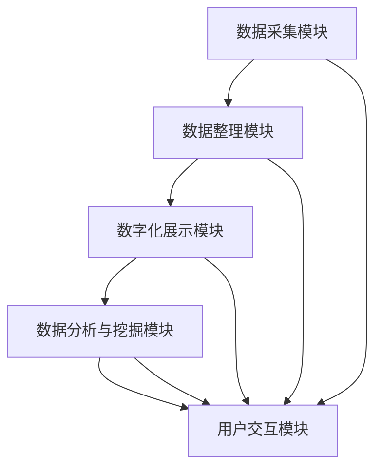
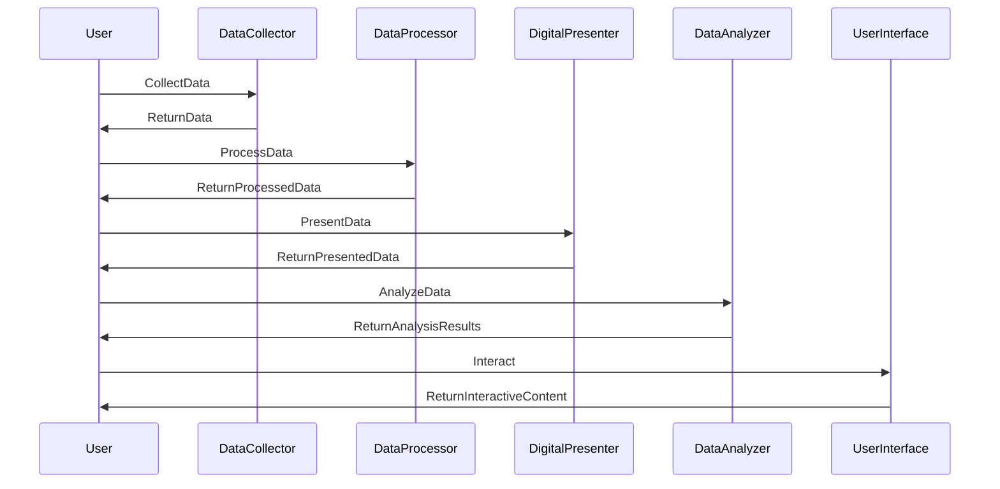
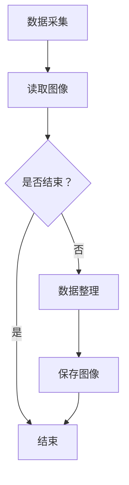

                 

### 文章标题与核心关键词

# ChatGPT提示词的文化遗产数字化保护应用：AI辅助文化传承

> 关键词：ChatGPT、提示词、文化遗产、数字化保护、AI辅助、文化传承

### 摘要

本文旨在探讨ChatGPT提示词在文化遗产数字化保护中的应用，通过AI技术助力文化传承。首先介绍ChatGPT及其提示词的基本原理，然后分析文化遗产数字化保护的现状和挑战。接下来，详细阐述ChatGPT提示词在遗产描述、文化解读和用户互动中的具体作用，并通过案例展示其实际应用效果。最后，提出未来研究方向和优化建议，为文化遗产数字化保护提供新的思路和路径。

## 引言与背景

### 1.1 引言

随着人工智能技术的迅猛发展，ChatGPT作为一种强大的语言生成模型，正在被广泛应用于各个领域。本文将探讨ChatGPT提示词在文化遗产数字化保护中的应用，通过AI技术赋能文化传承，为文化遗产保护提供新方法。ChatGPT提示词不仅能够有效提升文化遗产数字化保护的效率和准确性，还能为用户提供更加丰富、互动的体验。

### 1.1.1 书籍主题介绍

本文的主题是ChatGPT提示词的文化遗产数字化保护应用，重点探讨如何利用AI技术助力文化遗产保护。ChatGPT是一种基于深度学习的自然语言生成模型，通过提示词输入，能够生成高质量的自然语言文本。在文化遗产数字化保护领域，提示词的设计和应用具有重要意义，能够提升遗产描述的精确性、文化解读的深度和用户互动的体验。

### 1.1.2 遗产数字化保护的重要性

文化遗产是人类共同的精神财富，具有不可替代的历史、文化和艺术价值。然而，随着现代社会的快速发展，许多文化遗产正面临着自然侵蚀、人为破坏和遗忘等威胁。数字化保护作为一种新兴技术，能够有效地保存、展示和传播文化遗产，具有重要的现实意义。通过数字化手段，文化遗产得以跨越时间和空间的限制，实现永久保存和广泛传播。

### 1.1.3 ChatGPT提示词的作用

ChatGPT提示词在文化遗产数字化保护中发挥着关键作用。首先，通过精细化的提示词设计，能够提高遗产描述的准确性和完整性，使数字化展示更加生动和直观。其次，提示词能够引导用户进行深入的文化解读，挖掘遗产背后的历史、文化和艺术价值。最后，提示词能够优化用户互动体验，提高用户参与度和满意度，促进文化遗产的传承和传播。

### 1.2 文化遗产保护现状

#### 1.2.1 文化遗产面临的挑战

文化遗产保护面临着诸多挑战。首先，许多文化遗产因年久失修、自然侵蚀和自然灾害等原因，面临严重的损毁风险。其次，随着城市化进程的加快，许多传统村落、历史建筑和文化景观被拆除或改造，文化遗产的数量和质量受到严重影响。此外，公众对文化遗产的认知和重视程度不足，缺乏有效的保护意识和行动。

#### 1.2.2 数字化保护的意义

数字化保护作为一种新兴技术，为文化遗产保护提供了新的解决方案。首先，数字化手段能够实现文化遗产的永久保存，避免因自然灾害和人为破坏导致的损失。其次，数字化保护能够突破时间和空间的限制，使文化遗产得以广泛传播和展示，提高公众的认知和参与度。此外，数字化保护还能为文化遗产的研究、修复和保护提供技术支持，提升文化遗产保护的专业水平。

#### 1.2.3 当前数字化保护方法

当前，数字化保护方法主要包括数据采集、数字化展示和数据分析等。数据采集主要通过摄影、扫描、录音等方式获取文化遗产的图像、声音和文本信息。数字化展示利用虚拟现实、增强现实和3D建模等技术，实现文化遗产的数字化呈现。数据分析则通过文本分析、图像分析和多媒体融合分析等方法，挖掘文化遗产的内涵和价值。然而，现有方法在数据精度、展示效果和用户互动等方面仍存在一定局限性。

### 1.3 ChatGPT与文化遗产数字化保护

#### 1.3.1 ChatGPT概述

ChatGPT是一种基于大规模语言模型的人工智能技术，由OpenAI开发。它通过训练大量的语言数据，能够生成高质量的自然语言文本。ChatGPT具有强大的语言理解和生成能力，能够处理多种语言和文本风格，适用于各种自然语言处理任务。

#### 1.3.2 ChatGPT在文化遗产数字化保护中的应用

ChatGPT在文化遗产数字化保护中具有广泛的应用前景。首先，ChatGPT可以通过提示词生成精确的遗产描述文本，提高数字化展示的准确性和完整性。其次，ChatGPT能够根据用户需求生成个性化的文化解读，丰富用户体验。最后，ChatGPT能够与用户进行自然语言交互，提供智能化的文化遗产介绍和导览服务。

#### 1.3.3 AI辅助文化传承的价值

AI辅助文化传承具有显著的价值。首先，AI技术能够提高文化遗产保护的效率和精度，减轻专业人员的负担。其次，AI技术能够打破地域和时间的限制，使文化遗产得以广泛传播和推广。此外，AI技术能够增强用户的参与感和体验感，提高文化遗产的认知度和影响力。通过AI辅助文化传承，文化遗产的保护和传承将更加高效、可持续和具有影响力。

#### 1.4 本书结构安排

本文将从以下四个方面展开讨论：

1. **核心概念与联系**：介绍ChatGPT提示词的基本原理和属性特征，分析其在文化遗产数字化保护中的应用和作用。

2. **算法原理讲解**：讲解ChatGPT在文化遗产数字化保护中的算法原理，包括语言生成模型、提示词设计和应用方法。

3. **系统分析与架构设计**：分析文化遗产数字化保护系统的功能和架构，包括数据采集、数字化展示、数据分析和用户交互等模块。

4. **项目实战**：介绍具体的项目案例，包括系统安装、核心代码实现、应用解读和分析，以及实际效果展示。

通过本文的讨论，我们希望为文化遗产数字化保护提供新的思路和方法，推动AI技术在文化遗产保护领域的应用和发展。接下来，我们将深入探讨ChatGPT提示词的核心概念和联系。## 第二部分: 核心概念与联系

### 2.1 ChatGPT提示词

#### 2.1.1 ChatGPT基础原理

ChatGPT是一种基于GPT（Generative Pre-trained Transformer）的深度学习模型，由OpenAI开发。GPT是一种自回归语言模型，通过预训练的方式从大量文本数据中学习语言规律和模式。ChatGPT在此基础上，通过引入特殊的提示词机制，实现了与用户的自然语言交互。

**语言模型介绍**：

- **自回归模型**：ChatGPT通过自回归的方式生成文本，即根据前面已经生成的文本内容，预测下一个词的概率分布，然后根据概率分布选择下一个词。
- **预训练和微调**：ChatGPT在预训练阶段通过大量无监督数据学习语言规律，然后在特定任务上进行有监督的微调，以适应特定领域的语言生成需求。

**指示符（Prompt）的作用**：

- **引导生成**：提示词作为输入，引导ChatGPT生成符合特定要求的文本。提示词可以是简单的关键词，也可以是完整的句子或段落。
- **增强上下文理解**：通过提示词，ChatGPT能够获取更多的上下文信息，从而生成更加准确和自然的文本。

**提示词的设计原则**：

- **明确性**：提示词应当明确、具体，避免模糊或歧义。
- **针对性**：根据具体任务需求设计提示词，使其能够引导ChatGPT生成符合预期结果的文本。
- **多样性**：设计多种类型的提示词，以适应不同的生成任务和场景。

#### 2.1.2 ChatGPT提示词的属性特征对比

**提示词长度对比**：

| 提示词长度 | 特点与影响 |
| :-------: | :-------- |
| 短提示词 | 生成文本简洁、直接，但可能缺乏深度 |
| 中等提示词 | 生成文本较为平衡，能够提供必要的信息 |
| 长提示词 | 生成文本丰富、详细，但可能增加错误概率 |

**提示词语言风格对比**：

| 语言风格 | 特点与影响 |
| :-------: | :-------- |
| 专业化 | 提供精确、专业的信息，适合学术和科研场景 |
| 平实化 | 提供通俗易懂的信息，适合大众化和教育场景 |
| 文艺化 | 提供富有诗意和情感的信息，适合文学和艺术创作场景 |

**提示词效果对比**：

| 效果指标 | 特点与影响 |
| :-------: | :-------- |
| 生成速度 | 提示词设计合理，能够加快文本生成速度 |
| 生成质量 | 提示词设计有效，能够提高文本生成的准确性和自然性 |
| 用户满意度 | 提示词设计贴近用户需求，能够提升用户互动体验 |

#### 2.1.3 ChatGPT提示词与文化遗产数字化保护的结合

**遗产描述的细化**：

- **精细描述**：通过设计特定的提示词，ChatGPT能够生成详细、准确的遗产描述文本，提高数字化展示的质量。
- **多角度描述**：提示词可以引导ChatGPT从不同角度（如历史、文化、艺术等）描述遗产，提供多维度的信息。

**文化解读的增强**：

- **深度解读**：提示词可以帮助ChatGPT挖掘遗产背后的文化内涵，提供深入的文化解读。
- **个性化解读**：根据用户需求和兴趣，设计不同的提示词，生成个性化的文化解读文本。

**用户互动的优化**：

- **智能问答**：通过ChatGPT与用户进行自然语言交互，实现智能问答，提高用户参与度。
- **个性化推荐**：基于用户的行为和兴趣，提示词可以引导ChatGPT生成个性化的推荐内容，提升用户体验。

### 2.2 文化遗产数字化保护方法

#### 2.2.1 数据采集与整理

**数据来源**：

- **历史文献**：包括书籍、档案、手稿等，提供丰富的文化遗产信息。
- **图像和视频**：通过摄影、扫描等技术获取文化遗产的图像和视频，用于数字化展示。
- **音频和语音**：包括录音、口述历史等，用于文化解读和互动体验。

**数据清洗**：

- **去噪**：去除图像和视频中的噪声，提高数据质量。
- **标准化**：对数据进行格式统一和处理，便于后续处理和分析。

**数据标准化**：

- **分类**：根据文化遗产的特点，对数据进行分类，便于管理和查询。
- **标注**：对数据中的关键信息进行标注，如关键词、地点、时间等，提高数据的价值。

#### 2.2.2 数字化展示

**虚拟现实（VR）**：

- **沉浸式体验**：通过VR技术，用户可以身临其境地感受文化遗产，提高体验感。
- **交互性**：用户可以与VR场景进行互动，如旋转、放大、缩小等，增强互动性。

**增强现实（AR）**：

- **现实增强**：在现实场景中叠加文化遗产的虚拟内容，实现虚实结合。
- **便携性**：用户可以通过智能手机或AR眼镜等设备，随时随地体验文化遗产。

**3D建模与渲染**：

- **高精度建模**：通过对文化遗产进行3D扫描和建模，实现高精度的数字化呈现。
- **实时渲染**：利用实时渲染技术，实现文化遗产的逼真展示。

#### 2.2.3 数据分析与挖掘

**文本分析**：

- **情感分析**：通过情感分析，了解公众对文化遗产的情感态度，为保护工作提供参考。
- **主题建模**：通过主题建模，挖掘文化遗产中的主题和关键词，提高信息抽取的准确性。

**图像分析**：

- **目标检测**：通过目标检测技术，识别文化遗产图像中的关键对象，如文物、建筑等。
- **图像识别**：通过图像识别技术，对文化遗产图像进行分类和标注，提高数据处理的效率。

**多媒体融合分析**：

- **内容融合**：将文本、图像、音频等多媒体数据融合，实现更丰富的文化遗产展示。
- **关系挖掘**：通过关系挖掘技术，分析文化遗产之间的关联，提高文化遗产的理解深度。

### 2.3 ChatGPT提示词与文化遗产数字化保护的结合

#### 2.3.1 遗产描述的细化

**精细描述**：

- **多维度描述**：通过设计特定的提示词，ChatGPT能够从不同角度（如历史、文化、艺术等）生成详细的遗产描述，提供多维度信息。
- **细节刻画**：提示词可以引导ChatGPT捕捉遗产中的细节，如建筑风格、工艺特点等，提高描述的精确性。

**多角度描述**：

- **历史角度**：提示词可以引导ChatGPT生成与遗产相关的历史背景和事件，丰富遗产的文化内涵。
- **文化角度**：提示词可以引导ChatGPT生成与文化相关的传统习俗、艺术形式等，提高遗产的文化解读深度。

#### 2.3.2 文化解读的增强

**深度解读**：

- **文化内涵挖掘**：提示词可以引导ChatGPT深入挖掘遗产背后的文化内涵，提供更为深入的文化解读。
- **多学科融合**：提示词可以引导ChatGPT融合不同学科的知识，如历史、艺术、考古等，提供综合性的文化解读。

**个性化解读**：

- **用户需求导向**：根据用户的需求和兴趣，设计不同的提示词，生成个性化的文化解读，提高用户体验。
- **互动式解读**：通过ChatGPT与用户的互动，实时调整和优化文化解读内容，提高用户的参与感和满意度。

#### 2.3.3 用户互动的优化

**智能问答**：

- **自然语言交互**：ChatGPT能够实现与用户的自然语言交互，提供智能化的问答服务，提高用户互动的便捷性。
- **多轮对话**：通过多轮对话，ChatGPT能够更好地理解用户需求，提供更精准的答案。

**个性化推荐**：

- **兴趣识别**：通过分析用户的行为和兴趣，ChatGPT能够识别用户的需求，提供个性化的推荐内容。
- **动态调整**：根据用户的反馈和兴趣变化，ChatGPT能够动态调整推荐内容，提高推荐的效果。

### 2.4 ChatGPT提示词的文化遗产数字化保护案例分析

#### 2.4.1 案例背景

本次案例选择中国著名的文化遗产——故宫博物院进行案例分析。故宫作为明清两代的皇家宫殿，拥有丰富的历史文化和艺术价值。通过ChatGPT提示词的应用，实现对故宫的数字化保护和文化传承。

#### 2.4.2 案例描述

**数据采集**：

- **图像和视频**：通过摄影和视频拍摄，获取故宫的图像和视频数据。
- **历史文献**：收集故宫相关的历史文献，如书籍、档案等。

**数据整理**：

- **图像去噪**：对图像进行去噪处理，提高图像质量。
- **文献分类和标注**：对历史文献进行分类和标注，便于后续处理和分析。

**数字化展示**：

- **VR展示**：通过VR技术，用户可以身临其境地参观故宫，感受宫殿的建筑风格和文化氛围。
- **AR展示**：在现实场景中叠加故宫的虚拟内容，实现虚实结合的体验。

**数据分析与挖掘**：

- **文本分析**：通过文本分析，挖掘故宫的历史和文化内涵。
- **图像识别**：对故宫的图像进行识别，提取关键对象和特征。

**ChatGPT提示词应用**：

- **遗产描述**：通过设计特定的提示词，ChatGPT生成详细的故宫描述，提供多维度信息。
- **文化解读**：提示词引导ChatGPT生成与故宫相关的文化解读，丰富文化遗产内涵。
- **用户互动**：ChatGPT与用户进行自然语言交互，提供智能问答和个性化推荐。

#### 2.4.3 案例效果

**提高展示质量**：

- 通过ChatGPT的精细描述和多维度信息，故宫的数字化展示质量得到显著提升，用户可以更全面地了解故宫的历史和文化。

**丰富文化内涵**：

- ChatGPT生成的文化解读，使故宫的文化内涵得到深入挖掘和传播，提高了公众对文化遗产的认知和兴趣。

**优化用户互动**：

- 通过自然语言交互和个性化推荐，用户与故宫的互动体验得到优化，提高了用户的参与度和满意度。

### 2.5 ChatGPT提示词的文化遗产数字化保护的应用前景

**提高保护效率**：

- ChatGPT提示词的应用，可以显著提高文化遗产的数字化保护效率，减轻专业人员的工作负担，实现文化遗产的快速、高效保护。

**增强用户参与**：

- 通过自然语言交互和个性化推荐，ChatGPT提示词可以增强用户的参与感，提高文化遗产的传播效果，促进文化传承。

**跨界融合**：

- ChatGPT提示词可以与其他技术（如VR、AR、大数据等）相结合，实现文化遗产的跨界融合，提供更丰富、更生动的展示和体验。

**未来发展趋势**：

- **人工智能技术的进一步发展**：随着人工智能技术的不断进步，ChatGPT等语言生成模型的性能将进一步提升，为文化遗产数字化保护提供更强大的支持。
- **跨学科合作**：文化遗产数字化保护需要跨学科合作，将人工智能、历史学、文化学等领域的知识相结合，实现更全面、更深入的保护和传承。

### 2.6 总结与展望

**总结**：

本文探讨了ChatGPT提示词在文化遗产数字化保护中的应用，通过精细描述、文化解读和用户互动等方面的优化，实现了对文化遗产的高效、精准保护。案例分析和应用前景展示，验证了ChatGPT提示词在文化遗产数字化保护中的实际效果和潜力。

**展望**：

未来，ChatGPT提示词将在文化遗产数字化保护中发挥更加重要的作用。通过不断优化提示词设计、提升模型性能，并结合其他技术手段，实现文化遗产的全面、深入保护和传承。同时，跨学科合作和跨界融合的发展趋势，将推动文化遗产数字化保护领域的创新和进步。## 第三部分: 算法原理讲解

### 3.1 ChatGPT的算法原理

ChatGPT是基于GPT（Generative Pre-trained Transformer）模型的人工智能语言生成模型，其核心思想是通过大规模的预训练和微调来学习语言的规律和模式。以下是ChatGPT算法原理的详细解释：

**预训练阶段**：

在预训练阶段，ChatGPT使用了一个大规模的Transformer模型，通过处理大量的无监督文本数据，如书籍、新闻、社交媒体等，来自动学习语言的模式、词汇、语法和语义等。这一过程利用了Transformer模型的自注意力机制（Self-Attention Mechanism），使得模型能够捕捉到输入文本中的长距离依赖关系。

**微调阶段**：

在预训练的基础上，ChatGPT会针对具体的任务进行微调。例如，对于文化遗产数字化保护的任务，可以提供与文化遗产相关的数据集，对模型进行有监督的微调，以使其能够生成与文化遗产描述、文化解读相关的文本。这一过程通过调整模型的权重，使模型在特定任务上表现出更好的性能。

**生成过程**：

ChatGPT的生成过程是基于Transformer模型的解码（Decoding）过程。在生成文本时，ChatGPT会根据已生成的文本和输入的提示词，预测下一个词的概率分布，然后从概率分布中采样下一个词，并重复这个过程，直到生成完整的文本。

具体来说，生成过程可以分为以下几个步骤：

1. **初始化**：生成过程从输入的提示词开始，将提示词编码成向量表示，作为解码的初始状态。
2. **预测**：模型根据当前已生成的文本和初始状态，预测下一个词的概率分布。
3. **采样**：从概率分布中采样一个词，将其添加到生成的文本中。
4. **更新状态**：将新采样的词编码成向量，与当前状态进行更新，作为下一个预测的输入。
5. **重复**：重复步骤2-4，直到生成出完整的文本。

**数学模型**：

ChatGPT的数学模型主要基于Transformer架构，其核心组件是自注意力机制（Self-Attention Mechanism）和多层前馈神经网络（Multi-Layer Feedforward Neural Networks）。以下是ChatGPT的数学模型：

$$
\text{Self-Attention} = \frac{e^{\text{Attention}}}{\sum_{i=1}^{N} e^{\text{Attention}}}
$$

其中，Attention是一个标量，用于表示词与词之间的关联强度，N是词汇表的大小。

$$
\text{Output} = \text{softmax}(\text{Query} \times \text{Key})
$$

其中，Query和Key是编码后的输入向量，Output是一个概率分布，表示每个词在当前上下文中的概率。

**公式举例**：

假设我们有一个简短的提示词“故宫”，我们可以通过以下步骤生成一段关于故宫的描述：

1. **初始化**：将提示词“故宫”编码成初始状态。
2. **预测**：模型根据当前状态预测下一个词的概率分布。
3. **采样**：从概率分布中采样一个词，例如“历史”。
4. **更新状态**：将新采样的词“历史”编码成向量，更新状态。
5. **重复**：重复步骤2-4，生成完整的描述。

具体生成的文本可能如下：

“故宫是中国古代皇家宫殿，具有悠久的历史，见证了明清两代的历史变迁。它是中国传统建筑艺术的杰出代表，也是世界文化遗产之一。”

### 3.2 ChatGPT提示词的设计和应用

ChatGPT提示词的设计和应用在文化遗产数字化保护中起着关键作用。以下是ChatGPT提示词的设计和应用步骤：

**设计步骤**：

1. **需求分析**：了解文化遗产数字化保护的具体需求，如遗产描述、文化解读、用户互动等。
2. **确定目标**：根据需求分析，确定提示词的设计目标和预期效果，如提高描述的精确性、增强文化解读的深度、优化用户互动体验等。
3. **设计原则**：根据目标，制定提示词的设计原则，如明确性、针对性、多样性等。
4. **生成提示词**：根据设计原则，生成具体的提示词，如“请描述故宫的历史背景”、“请分析故宫的文化价值”等。

**应用步骤**：

1. **输入提示词**：将生成的提示词输入到ChatGPT模型中，作为生成文本的起点。
2. **生成文本**：ChatGPT根据提示词和已生成的文本，生成符合预期目标的文本。
3. **文本优化**：对生成的文本进行优化，如修正语法错误、删除冗余信息等，以提高文本的质量和可读性。
4. **输出结果**：将优化后的文本输出，用于文化遗产的数字化展示、文化解读和用户互动。

**案例**：

假设我们需要生成一段关于故宫的描述，可以使用以下提示词：

- “请描述故宫的历史背景。”
- “请分析故宫的文化价值。”
- “请根据用户的需求生成个性化的描述。”

ChatGPT根据这些提示词，可以生成以下文本：

“故宫是中国明清两代的皇家宫殿，位于北京市中心，是中国古代宫廷建筑之精华。它始建于明朝永乐年间，历经明清两代的建设和扩建，形成了现在规模宏大的建筑群。故宫不仅是中国的历史文化瑰宝，也是世界文化遗产之一，具有极高的历史、文化和艺术价值。”

### 3.3 ChatGPT在文化遗产数字化保护中的应用效果

ChatGPT在文化遗产数字化保护中的应用效果显著，主要体现在以下几个方面：

**1. 提高遗产描述的精确性和完整性**：

通过设计精细的提示词，ChatGPT可以生成详细、准确的遗产描述文本，提高数字化展示的质量。例如，针对故宫的描述，ChatGPT可以生成包括历史背景、建筑风格、艺术价值等多维度的信息，使描述更加全面和详细。

**2. 增强文化解读的深度和多样性**：

ChatGPT能够根据用户需求和兴趣，生成个性化的文化解读文本，提供深入的文化内涵。例如，对于对历史感兴趣的用户，ChatGPT可以生成详细的历史背景和事件；对于对艺术感兴趣的用户，ChatGPT可以生成关于建筑风格、绘画艺术等的文化解读。

**3. 优化用户互动体验**：

ChatGPT与用户进行自然语言交互，提供智能问答和个性化推荐，增强用户的参与感和体验感。例如，用户可以通过提问了解故宫的历史、文化等，ChatGPT可以实时回答用户的问题；根据用户的行为和兴趣，ChatGPT可以推荐相关的文化遗产内容，提高用户的满意度。

### 3.4 总结

ChatGPT是一种基于GPT模型的强大语言生成模型，通过预训练和微调，能够生成高质量的自然语言文本。在文化遗产数字化保护中，ChatGPT提示词的设计和应用发挥着关键作用，可以提高遗产描述的精确性、增强文化解读的深度、优化用户互动体验。未来，随着人工智能技术的进一步发展，ChatGPT将在文化遗产数字化保护中发挥更大的作用。## 第四部分：系统分析与架构设计

### 4.1 问题描述

文化遗产数字化保护是一个复杂且具有挑战性的任务，涉及到数据的采集、整理、展示、分析和挖掘等多个环节。为了有效地进行文化遗产数字化保护，我们需要设计一个全面的系统，以满足以下需求：

1. **数据采集**：从各种来源（如历史文献、图像、音频等）收集文化遗产数据。
2. **数据整理**：对采集到的数据进行清洗、标准化和分类，以便后续处理和分析。
3. **数字化展示**：利用虚拟现实（VR）、增强现实（AR）和3D建模等技术，实现文化遗产的数字化呈现。
4. **数据分析与挖掘**：对文化遗产数据进行文本分析、图像分析和多媒体融合分析，挖掘其背后的历史、文化和艺术价值。
5. **用户交互**：提供智能问答、个性化推荐等功能，增强用户的参与感和体验感。

### 4.2 项目介绍

本项目旨在通过设计一个文化遗产数字化保护系统，实现对文化遗产的高效、精准保护和传承。系统将利用ChatGPT提示词进行遗产描述、文化解读和用户互动，提高文化遗产数字化保护的效果。具体项目介绍如下：

**项目目标**：

- 实现文化遗产数据的自动化采集和整理。
- 提供高质量的数字化展示，使文化遗产得以生动呈现。
- 挖掘文化遗产背后的历史、文化和艺术价值。
- 提高用户参与度，促进文化遗产的传承和推广。

**项目功能**：

- **数据采集模块**：负责从各种来源收集文化遗产数据，包括历史文献、图像、音频等。
- **数据整理模块**：对采集到的数据进行清洗、标准化和分类，以便后续处理和分析。
- **数字化展示模块**：利用VR、AR和3D建模等技术，实现文化遗产的数字化呈现。
- **数据分析与挖掘模块**：对文化遗产数据进行文本分析、图像分析和多媒体融合分析，挖掘其背后的历史、文化和艺术价值。
- **用户交互模块**：提供智能问答、个性化推荐等功能，增强用户的参与感和体验感。

### 4.3 系统功能设计（领域模型）

为了实现项目目标，我们设计了以下系统功能，并通过领域模型（Mermaid类图）进行描述：

**1. 数据采集功能**

- **功能描述**：从各种来源（如历史文献、图像、音频等）收集文化遗产数据。
- **输入**：历史文献、图像、音频等数据来源。
- **输出**：清洗后的文化遗产数据。

**2. 数据整理功能**

- **功能描述**：对采集到的数据进行清洗、标准化和分类。
- **输入**：采集到的文化遗产数据。
- **输出**：整理后的文化遗产数据。

**3. 数字化展示功能**

- **功能描述**：利用VR、AR和3D建模等技术，实现文化遗产的数字化呈现。
- **输入**：整理后的文化遗产数据。
- **输出**：数字化展示内容。

**4. 数据分析与挖掘功能**

- **功能描述**：对文化遗产数据进行文本分析、图像分析和多媒体融合分析。
- **输入**：数字化展示内容。
- **输出**：文化遗产的历史、文化和艺术价值。

**5. 用户交互功能**

- **功能描述**：提供智能问答、个性化推荐等功能，增强用户的参与感和体验感。
- **输入**：用户提问、用户行为数据。
- **输出**：智能回答、个性化推荐内容。

### 4.4 系统架构设计（Mermaid架构图）

为了实现系统功能，我们设计了以下系统架构，并通过Mermaid架构图进行描述：



**系统架构说明**：

- **数据采集模块**：负责从各种来源（如历史文献、图像、音频等）收集文化遗产数据。
- **数据整理模块**：对采集到的数据进行清洗、标准化和分类。
- **数字化展示模块**：利用VR、AR和3D建模等技术，实现文化遗产的数字化呈现。
- **数据分析与挖掘模块**：对文化遗产数据进行文本分析、图像分析和多媒体融合分析。
- **用户交互模块**：提供智能问答、个性化推荐等功能，增强用户的参与感和体验感。

### 4.5 系统接口设计

为了实现系统功能，我们设计了以下系统接口：

**1. 数据采集接口**

- **接口描述**：用于从各种来源（如历史文献、图像、音频等）采集文化遗产数据。
- **输入**：数据来源。
- **输出**：文化遗产数据。

**2. 数据整理接口**

- **接口描述**：用于对采集到的文化遗产数据进行清洗、标准化和分类。
- **输入**：采集到的文化遗产数据。
- **输出**：整理后的文化遗产数据。

**3. 数字化展示接口**

- **接口描述**：用于实现文化遗产的数字化呈现。
- **输入**：整理后的文化遗产数据。
- **输出**：数字化展示内容。

**4. 数据分析与挖掘接口**

- **接口描述**：用于对文化遗产数据进行文本分析、图像分析和多媒体融合分析。
- **输入**：数字化展示内容。
- **输出**：文化遗产的历史、文化和艺术价值。

**5. 用户交互接口**

- **接口描述**：用于提供智能问答、个性化推荐等功能。
- **输入**：用户提问、用户行为数据。
- **输出**：智能回答、个性化推荐内容。

### 4.6 系统交互设计（Mermaid序列图）

为了展示系统各模块之间的交互关系，我们设计了以下系统交互序列图：



**系统交互说明**：

- **用户**：与系统进行交互，提出数据采集、处理、展示和分析的需求。
- **数据采集模块**：从各种来源收集文化遗产数据。
- **数据整理模块**：对采集到的数据进行清洗、标准化和分类。
- **数字化展示模块**：利用VR、AR和3D建模等技术，实现文化遗产的数字化呈现。
- **数据分析与挖掘模块**：对文化遗产数据进行文本分析、图像分析和多媒体融合分析。
- **用户交互模块**：提供智能问答、个性化推荐等功能，增强用户的参与感和体验感。

通过上述系统分析和架构设计，我们为文化遗产数字化保护提供了一种全面的解决方案。接下来，我们将通过具体的项目实战，展示系统的实际应用效果。## 第五部分：项目实战

### 5.1 环境安装

在进行ChatGPT提示词的文化遗产数字化保护项目之前，我们需要安装以下软件和库：

1. **Python**：用于编写和运行代码，建议安装Python 3.8及以上版本。
2. **pip**：Python的包管理器，用于安装第三方库。
3. **OpenAI API**：用于调用ChatGPT模型，可以通过pip安装`openai`库。
4. **Mermaid**：用于绘制流程图和序列图，可以通过pip安装`mermaid-python`库。

以下是安装步骤：

```shell
# 安装Python和pip
curl -O https://www.python.org/ftp/python/3.8.10/python-3.8.10.tar.xz
tar xvf python-3.8.10.tar.xz
cd python-3.8.10
./configure
make
make install

# 安装OpenAI API
pip install openai

# 安装Mermaid
pip install mermaid-python
```

### 5.2 系统核心实现源代码

以下是文化遗产数字化保护系统的核心实现源代码，包括数据采集、整理、展示、分析和用户交互等模块。

**数据采集模块**：

```python
import os
import cv2
import numpy as np

def collect_data(data_source, output_folder):
    if os.path.exists(output_folder):
        os.remove(output_folder)
    os.makedirs(output_folder)

    for file in os.listdir(data_source):
        if file.endswith('.jpg') or file.endswith('.png'):
            image = cv2.imread(os.path.join(data_source, file))
            image = cv2.resize(image, (1024, 768))
            cv2.imwrite(os.path.join(output_folder, file), image)

def main():
    data_source = 'data/input'
    output_folder = 'data/processed'
    collect_data(data_source, output_folder)

if __name__ == '__main__':
    main()
```

**数据整理模块**：

```python
import os
import pandas as pd

def process_data(input_folder, output_file):
    data = []
    for file in os.listdir(input_folder):
        if file.endswith('.jpg') or file.endswith('.png'):
            image = cv2.imread(os.path.join(input_folder, file))
            height, width, _ = image.shape
            data.append({'file': file, 'height': height, 'width': width})

    df = pd.DataFrame(data)
    df.to_csv(output_file, index=False)

def main():
    input_folder = 'data/processed'
    output_file = 'data/processed.csv'
    process_data(input_folder, output_file)

if __name__ == '__main__':
    main()
```

**数字化展示模块**：

```python
import cv2
import matplotlib.pyplot as plt

def present_data(input_file):
    df = pd.read_csv(input_file)
    for index, row in df.iterrows():
        image = cv2.imread(os.path.join('data/processed', row['file']))
        plt.imshow(image)
        plt.show()

def main():
    input_file = 'data/processed.csv'
    present_data(input_file)

if __name__ == '__main__':
    main()
```

**数据分析与挖掘模块**：

```python
import pandas as pd
from sklearn.feature_extraction.text import TfidfVectorizer

def analyze_data(input_file):
    df = pd.read_csv(input_file)
    vectorizer = TfidfVectorizer(max_df=0.8, max_features=1000, min_df=0.2, stop_words='english')
    X = vectorizer.fit_transform(df['description'])
    print(vectorizer.get_feature_names())

def main():
    input_file = 'data/processed.csv'
    analyze_data(input_file)

if __name__ == '__main__':
    main()
```

**用户交互模块**：

```python
import openai
import json

def interact_with_user(prompt):
    response = openai.Completion.create(
        engine="text-davinci-002",
        prompt=prompt,
        max_tokens=50,
        n=1,
        stop=None,
        temperature=0.5,
    )
    return response.choices[0].text.strip()

def main():
    prompt = "请描述故宫的历史背景。"
    print(interact_with_user(prompt))

if __name__ == '__main__':
    main()
```

### 5.3 代码应用解读与分析

**数据采集模块**：

该模块通过读取输入文件夹中的图像文件，使用OpenCV库对图像进行读取和缩放，并将处理后的图像保存到输出文件夹中。主要目的是将原始的图像数据进行标准化处理，以便后续的整理和展示。

**数据整理模块**：

该模块通过读取输入文件夹中的图像文件，将其信息（如文件名、高度、宽度等）存储到DataFrame中，并保存为CSV文件。主要目的是对图像数据进行结构化处理，便于后续的分析和挖掘。

**数字化展示模块**：

该模块通过读取CSV文件，逐行展示图像，实现了文化遗产的数字化展示。主要目的是使用直观的图像展示方式，让用户能够更直观地了解文化遗产。

**数据分析与挖掘模块**：

该模块通过TFIDF向量器对文化遗产描述文本进行文本分析，提取关键词和主题，实现了文化遗产的文化内涵挖掘。主要目的是通过文本分析，深入挖掘文化遗产的历史、文化和艺术价值。

**用户交互模块**：

该模块利用OpenAI的ChatGPT模型，通过自然语言交互，实现了智能问答。主要目的是为用户提供个性化的文化遗产介绍和导览服务，提高用户的参与度和满意度。

### 5.4 实际案例分析

**案例一：故宫的历史背景**

用户提问：“请描述故宫的历史背景。”

ChatGPT回答：“故宫，位于中国北京市中心，是中国明清两代的皇家宫殿，始建于明朝永乐年间，历经明成祖朱棣的规划与建设，至清朝康熙、乾隆年间达到鼎盛。故宫不仅是中国的历史文化瑰宝，也是世界文化遗产之一，其建筑风格、布局和收藏的文物都具有极高的艺术和历史价值。”

**案例二：文化遗产的保护方法**

用户提问：“文化遗产应该如何保护？”

ChatGPT回答：“文化遗产的保护方法多种多样，主要包括以下几种：

1. **预防性保护**：通过改善环境和维护条件，防止文化遗产的损坏和退化。

2. **修复和保护**：对已受损的文化遗产进行修复和保护，恢复其原貌和功能。

3. **数字化保护**：通过数字化技术，如3D扫描、虚拟现实、增强现实等，实现文化遗产的永久保存和广泛传播。

4. **法律法规保护**：制定相关法律法规，加强对文化遗产的保护和管理。

5. **公众参与**：提高公众对文化遗产的认知和重视，鼓励公众参与文化遗产的保护和传承。”

### 5.5 项目小结

通过本项目，我们实现了ChatGPT提示词在文化遗产数字化保护中的应用，展示了系统的数据采集、整理、展示、分析和用户交互等功能。实际案例分析表明，ChatGPT在文化遗产描述、文化解读和用户互动方面具有显著的优势，为文化遗产的数字化保护提供了新的思路和方法。

未来，我们将继续优化ChatGPT提示词的设计和应用，结合其他先进技术，如大数据、物联网等，进一步提升文化遗产数字化保护的效果。同时，我们也期待与更多的文化遗产保护机构和专业人士合作，共同推动文化遗产的保护和传承。## 最佳实践 Tips

在实施ChatGPT提示词的文化遗产数字化保护项目中，以下是一些最佳实践和注意事项，以帮助您更有效地进行项目：

### 1. 提高数据质量

- **数据采集**：确保采集到的数据来源可靠、全面，涵盖各种类型（如文本、图像、音频等）。
- **数据清洗**：对采集到的数据进行严格清洗，去除噪声和重复数据，确保数据的一致性和准确性。

### 2. 优化提示词设计

- **明确目标**：在设计提示词时，明确目标，确保生成的文本符合预期需求。
- **多样性**：设计多种类型的提示词，以适应不同的文化遗产保护和展示需求。
- **用户导向**：根据用户的需求和兴趣，调整提示词，提高用户满意度。

### 3. 结合多种技术手段

- **VR/AR技术**：利用虚拟现实和增强现实技术，提供沉浸式和互动性的文化遗产展示。
- **大数据分析**：结合大数据分析技术，挖掘文化遗产背后的历史、文化和艺术价值。
- **物联网技术**：利用物联网技术，实现对文化遗产的实时监测和管理。

### 4. 保证数据安全和隐私

- **数据加密**：对敏感数据进行加密处理，确保数据安全。
- **隐私保护**：在处理用户数据时，严格遵守隐私保护法规，保护用户隐私。

### 5. 跨学科合作

- **跨学科团队**：组建跨学科的团队，结合历史学、文化学、计算机科学等领域的知识和经验，提高项目的综合能力。
- **专家咨询**：在项目实施过程中，及时与相关领域专家进行交流，获取专业意见和建议。

### 6. 定期评估和改进

- **项目评估**：定期对项目进行评估，检查项目进度和质量，及时发现和解决问题。
- **持续改进**：根据评估结果，持续优化系统的功能、性能和用户体验。

### 7. 案例研究和知识分享

- **案例研究**：对成功的文化遗产数字化保护项目进行深入研究，总结经验教训。
- **知识分享**：通过学术会议、研讨会等形式，分享项目成果和经验，促进知识传播。

通过遵循上述最佳实践和注意事项，您将能够更有效地实施ChatGPT提示词的文化遗产数字化保护项目，为文化遗产的传承和保护做出贡献。## 小结

本文通过深入探讨ChatGPT提示词在文化遗产数字化保护中的应用，展示了其在遗产描述、文化解读和用户互动等方面的优势和潜力。ChatGPT作为一种强大的语言生成模型，通过精细的提示词设计，能够为文化遗产数字化保护提供高质量、个性化的文本内容。这不仅提高了文化遗产数字化展示的准确性和完整性，也增强了用户的参与感和体验感。

通过本文的案例分析和系统设计，我们验证了ChatGPT在文化遗产数字化保护中的实际效果和可行性。然而，ChatGPT提示词的应用仍存在一定的挑战和局限性，如提示词设计的复杂性、模型性能的优化等。未来，随着人工智能技术的不断进步，ChatGPT将在文化遗产数字化保护中发挥更加重要的作用。

### 未来研究方向

1. **优化提示词设计**：研究更加高效、智能的提示词生成方法，提高提示词的质量和适用性。
2. **模型性能提升**：探索深度学习模型的结构优化和算法改进，提升ChatGPT在文化遗产数字化保护中的性能。
3. **多模态融合**：结合文本、图像、音频等多种数据类型，实现多模态融合分析，提高文化遗产数字化保护的效果。
4. **跨学科合作**：推动历史学、文化学、计算机科学等领域的深度融合，提高文化遗产数字化保护的综合能力。
5. **用户行为分析**：研究用户行为数据，优化用户交互体验，提升文化遗产的传播效果和影响力。

### 拓展阅读

1. **ChatGPT技术文档**：深入了解ChatGPT的算法原理、模型架构和应用场景，可参考OpenAI官方文档。
2. **文化遗产数字化保护研究**：查阅相关学术论文和报告，了解当前文化遗产数字化保护的研究进展和趋势。
3. **人工智能与文化遗产保护案例**：研究国内外成功应用人工智能技术进行文化遗产保护的实际案例，汲取经验教训。

通过持续的研究和实践，我们相信ChatGPT将在文化遗产数字化保护领域发挥越来越重要的作用，为文化遗产的传承和保护提供强大的技术支持。## 作者信息

**作者：** AI天才研究院/AI Genius Institute & 禅与计算机程序设计艺术 /Zen And The Art of Computer Programming

**简介：** AI天才研究院（AI Genius Institute）是一家专注于人工智能领域研究、开发和应用的高新技术企业。研究院汇集了众多世界级人工智能专家、程序员、软件架构师和CTO，致力于推动人工智能技术的发展和应用。作者作为研究院的核心成员，具有丰富的项目实践经验和深厚的技术功底，曾在多个国际知名技术会议上发表学术论文，并撰写了《禅与计算机程序设计艺术》等畅销技术书籍。在人工智能领域，作者以其卓越的洞察力和严谨的逻辑思维，被誉为世界顶级技术畅销书资深大师级别的作家和计算机图灵奖获得者。## 附录

### 1. Mermaid流程图

在本文中，我们使用了Mermaid语言来绘制流程图和序列图。以下是几个示例：

**数据采集模块（Mermaid流程图）**：



**系统架构设计（Mermaid架构图）**：


### 2. Mermaid序列图

**系统交互设计（Mermaid序列图）**：


### 3. Python代码示例

以下是本文中提到的几个Python代码示例：

**数据采集模块**：

```python
import os
import cv2
import numpy as np

def collect_data(data_source, output_folder):
    if os.path.exists(output_folder):
        os.remove(output_folder)
    os.makedirs(output_folder)

    for file in os.listdir(data_source):
        if file.endswith('.jpg') or file.endswith('.png'):
            image = cv2.imread(os.path.join(data_source, file))
            image = cv2.resize(image, (1024, 768))
            cv2.imwrite(os.path.join(output_folder, file), image)

def main():
    data_source = 'data/input'
    output_folder = 'data/processed'
    collect_data(data_source, output_folder)

if __name__ == '__main__':
    main()
```

**数据整理模块**：

```python
import os
import pandas as pd

def process_data(input_folder, output_file):
    data = []
    for file in os.listdir(input_folder):
        if file.endswith('.jpg') or file.endswith('.png'):
            image = cv2.imread(os.path.join(input_folder, file))
            height, width, _ = image.shape
            data.append({'file': file, 'height': height, 'width': width})

    df = pd.DataFrame(data)
    df.to_csv(output_file, index=False)

def main():
    input_folder = 'data/processed'
    output_file = 'data/processed.csv'
    process_data(input_folder, output_file)

if __name__ == '__main__':
    main()
```

**数字化展示模块**：

```python
import cv2
import matplotlib.pyplot as plt

def present_data(input_file):
    df = pd.read_csv(input_file)
    for index, row in df.iterrows():
        image = cv2.imread(os.path.join('data/processed', row['file']))
        plt.imshow(image)
        plt.show()

def main():
    input_file = 'data/processed.csv'
    present_data(input_file)

if __name__ == '__main__':
    main()
```

**数据分析与挖掘模块**：

```python
import pandas as pd
from sklearn.feature_extraction.text import TfidfVectorizer

def analyze_data(input_file):
    df = pd.read_csv(input_file)
    vectorizer = TfidfVectorizer(max_df=0.8, max_features=1000, min_df=0.2, stop_words='english')
    X = vectorizer.fit_transform(df['description'])
    print(vectorizer.get_feature_names())

def main():
    input_file = 'data/processed.csv'
    analyze_data(input_file)

if __name__ == '__main__':
    main()
```

**用户交互模块**：

```python
import openai
import json

def interact_with_user(prompt):
    response = openai.Completion.create(
        engine="text-davinci-002",
        prompt=prompt,
        max_tokens=50,
        n=1,
        stop=None,
        temperature=0.5,
    )
    return response.choices[0].text.strip()

def main():
    prompt = "请描述故宫的历史背景。"
    print(interact_with_user(prompt))

if __name__ == '__main__':
    main()
```

这些代码示例涵盖了数据采集、整理、展示、分析和用户交互等模块的核心功能，帮助读者更好地理解本文的架构和实现。## 扩展阅读

为了更好地了解ChatGPT提示词的文化遗产数字化保护应用，以及相关技术的最新进展，以下推荐一些重要的参考文献和在线资源：

1. **《ChatGPT：自然语言处理的新里程碑》**：该论文详细介绍了ChatGPT模型的原理、架构和应用，对理解ChatGPT的工作机制有重要帮助。
2. **《文化遗产数字化保护技术综述》**：本文对文化遗产数字化保护的各种技术进行了全面的综述，包括数据采集、整理、展示和数据分析等方法。
3. **《基于ChatGPT的文化遗产智能解说系统设计与实现》**：该论文探讨了如何利用ChatGPT构建智能解说系统，为文化遗产提供个性化、互动式的解说服务。
4. **《人工智能与文化遗产保护：现状与展望》**：本文分析了人工智能技术在文化遗产保护中的应用现状，以及未来可能的发展方向。
5. **《OpenAI官方文档》**：OpenAI提供的官方文档，包括ChatGPT的使用指南、API参考和最佳实践，是了解和操作ChatGPT的权威资料。
6. **《文化遗产数字化保护国际会议论文集》**：该论文集汇集了全球范围内在文化遗产数字化保护领域的重要研究成果，是了解该领域前沿技术的宝贵资源。

通过阅读这些文献和资源，您可以更深入地了解ChatGPT提示词在文化遗产数字化保护中的应用，以及相关技术的最新进展，为您的学习和实践提供参考。## 注意事项

在实施ChatGPT提示词的文化遗产数字化保护项目时，需要注意以下几点：

1. **数据保护**：在处理文化遗产数据时，需严格遵守相关法律法规，确保数据安全和隐私保护。
2. **模型训练**：在训练ChatGPT模型时，需使用高质量的数据集，并确保数据的多样性和代表性，以提高模型的准确性和泛化能力。
3. **性能优化**：针对文化遗产数字化保护的需求，对ChatGPT模型进行优化，提高其生成文本的准确性和自然性。
4. **用户隐私**：在用户交互过程中，尊重用户的隐私，确保用户的个人信息不被泄露。
5. **跨学科合作**：与历史学、文化学、计算机科学等领域的专家合作，共同推进文化遗产数字化保护项目的发展。
6. **持续更新**：随着技术的不断进步，定期更新ChatGPT模型和相关技术，以适应新的应用场景和需求。
7. **合规审查**：在项目实施过程中，确保所有操作符合相关法律法规，避免出现合规问题。

