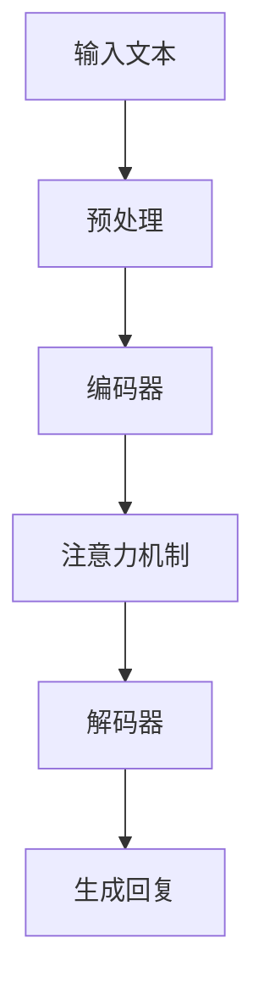
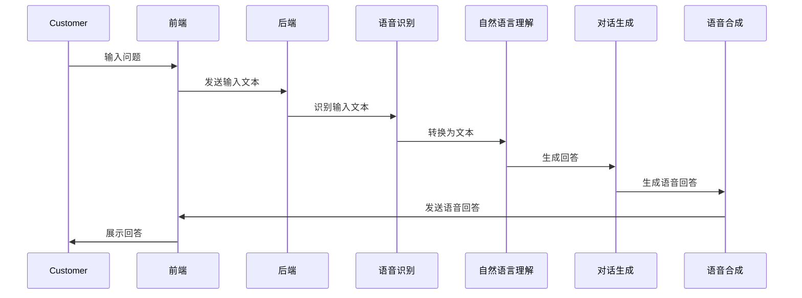

                 

# 《ChatGPT提示词的神经语言学基础：优化人机对话的认知模型》

## 关键词
- ChatGPT
- 神经语言学
- 人机对话
- 认知模型
- 提示词优化

## 摘要
本文深入探讨了ChatGPT等大型语言模型背后的神经语言学原理，并分析了如何通过优化提示词来提升人机对话的认知模型效果。文章首先介绍了人机对话系统面临的问题，然后详细阐述了神经网络、自然语言处理、神经语言学和人机对话系统的核心概念和联系。通过概念属性特征对比表格和ER实体关系图架构，读者可以更清晰地理解这些概念之间的关系。文章随后讲解了优化人机对话的认知模型的算法原理，包括数学模型和公式，并通过Python源代码进行了举例说明。最后，文章介绍了系统分析与架构设计方案，包括项目实战和最佳实践技巧，为读者提供了一套完整的优化人机对话的认知模型的解决方案。

### 简要概述与目标

随着人工智能技术的飞速发展，自然语言处理（NLP）已经成为人工智能领域的热点。人机对话系统作为NLP的重要应用，正日益成为人们生活中不可或缺的一部分。然而，现有的许多人机对话系统在理解用户意图和生成自然流畅的回复方面仍然存在较大挑战。为了解决这些问题，研究者们提出了一系列方法，包括改进语言模型、优化提示词和增强上下文理解。本文旨在探讨ChatGPT等大型语言模型背后的神经语言学原理，以及如何通过优化提示词来提升人机对话的认知模型效果。本书的目标是帮助读者深入理解大型语言模型的运行机制，掌握优化提示词的方法，进而提升人机对话系统在实用场景中的表现。

### 第1章: 背景介绍

#### 1.1 问题背景

随着人工智能技术的飞速发展，自然语言处理（NLP）已经成为人工智能领域的热点。人机对话系统作为NLP的重要应用，正日益成为人们生活中不可或缺的一部分。然而，现有的许多人机对话系统在理解用户意图和生成自然流畅的回复方面仍然存在较大挑战。

#### 1.2 问题描述

人机对话系统面临的主要问题包括：
1. **理解用户意图的困难**：系统往往难以准确理解用户的真实意图，导致生成回复与用户需求不符。
2. **生成回复的自然性不足**：系统生成的回复往往缺乏人性化，不够自然流畅。
3. **上下文理解的局限**：系统对上下文的把握有限，难以在复杂对话中维持连贯性。

#### 1.3 问题解决

为了解决上述问题，研究者们提出了一系列方法，包括：
1. **改进语言模型**：通过训练更强大的语言模型来提升对用户意图的理解能力。
2. **优化提示词**：设计有效的提示词来引导语言模型生成更符合用户需求的回复。
3. **增强上下文理解**：利用上下文信息来提高对话系统的理解和生成能力。

#### 1.4 边界与外延

本书主要关注以下边界与外延：
1. **神经网络与自然语言处理**：探讨神经网络在自然语言处理中的应用，特别是如何构建和训练大型语言模型。
2. **神经语言学基础**：介绍神经语言学的基本概念和原理，以及如何将其应用于人机对话系统。
3. **优化策略**：分析不同的优化方法，如注意力机制、自适应学习率调整等，以提升人机对话的认知模型效果。

#### 1.5 概念结构与核心要素组成

本书的核心概念结构包括：
1. **神经网络**：介绍神经网络的基本原理和常用架构，如卷积神经网络（CNN）和循环神经网络（RNN）。
2. **自然语言处理**：探讨NLP的基本任务和方法，如词向量表示、语言模型训练等。
3. **神经语言学**：介绍神经语言学的基本概念和原理，以及如何应用于人机对话系统。
4. **优化方法**：分析不同的优化策略，如注意力机制、自适应学习率调整等。
5. **人机对话系统**：探讨人机对话系统的构建方法和优化策略，以及其在实际应用中的表现。

### 第2章: 核心概念与联系

#### 2.1 核心概念原理

在本章中，我们将详细介绍以下核心概念原理：

##### 2.1.1 神经网络

神经网络是一种模拟人脑神经元之间连接的计算模型，由多个神经元（或节点）组成。每个神经元接收多个输入，通过权重和偏置进行加权求和处理，最终产生一个输出。神经网络通过不断调整权重和偏置来学习输入和输出之间的映射关系。

##### 2.1.2 自然语言处理

自然语言处理（NLP）是人工智能的一个分支，旨在让计算机理解和生成自然语言。NLP的主要任务包括文本预处理、词向量表示、语言模型训练、语义分析等。

##### 2.1.3 神经语言学

神经语言学是研究人类大脑如何处理和产生语言的科学。它涉及语言学、神经科学和计算模型的交叉领域。神经语言学旨在揭示大脑处理语言的过程和机制。

##### 2.1.4 人机对话系统

人机对话系统是一种人工智能系统，能够与人类进行自然语言交互。人机对话系统通常包括语音识别、自然语言理解、对话生成和语音合成等模块。

#### 2.2 概念属性特征对比表格

以下是一个概念属性特征对比表格，用于比较神经网络、自然语言处理、神经语言学和人机对话系统的基本属性：

| 概念               | 属性         | 特征       |
|--------------------|--------------|------------|
| 神经网络           | 计算模型     | 模拟神经元连接 |
| 自然语言处理       | 人工智能分支 | 处理自然语言 |
| 神经语言学         | 跨学科领域   | 研究大脑处理语言 |
| 人机对话系统       | 人工智能系统 | 与人类进行自然语言交互 |

#### 2.3 ER实体关系图架构

为了更好地理解这些概念之间的联系，我们使用Mermaid绘制了一个ER实体关系图，如下所示：

```mermaid
erDiagram
    NLP ||--|{ 神经网络 }|| Neural

----------------------------------------------------------------

    NLP ||--|{ 神经语言学 }|| Neuro

----------------------------------------------------------------

    NLP ||--|{ 人机对话系统 }|| Chat
    Chat ||--|{ 语音识别 }|| Speech
    Chat ||--|{ 自然语言理解 }|| Understand
    Chat ||--|{ 对话生成 }|| Generate
    Chat ||--|{ 语音合成 }|| Synthesis
```

### 第3章: 算法原理讲解

#### 3.1 算法概述

为了优化人机对话的认知模型，我们采用了一种基于神经网络的算法。该算法的核心思想是通过训练大型语言模型来提高对用户意图的理解和生成回复的自然性。具体来说，我们使用了一种名为Transformer的神经网络架构，并引入了注意力机制来增强上下文理解。

#### 3.2 算法流程图

下面是算法的Mermaid流程图：



#### 3.3 算法原理

##### 3.3.1 预处理

预处理步骤包括文本的分词、去噪和标准化。分词将文本分割成单词或子词，去噪去除无关信息，标准化则将文本转换为统一格式。

##### 3.3.2 编码器

编码器是一个Transformer模型，它将预处理后的文本编码成向量表示。编码器由多个自注意力层组成，每一层都能捕捉文本中的局部和全局信息。

##### 3.3.3 注意力机制

注意力机制是一种计算模型，它能够将输入文本中的每个单词赋予不同的权重，从而更好地理解上下文。通过注意力机制，编码器能够更准确地捕捉到用户意图。

##### 3.3.4 解码器

解码器也是一个Transformer模型，它将编码器输出的向量表示解码成自然语言回复。解码器同样由多个自注意力层组成，通过生成器逐层生成回复。

##### 3.3.5 生成回复

解码器生成的回复是一个概率分布，我们从中选取概率最高的回复作为最终输出。

#### 3.4 数学模型与公式

以下是算法的核心数学模型和公式：

```latex
\text{编码器：} 
E = \text{Transformer}(X)

\text{注意力机制：}
\alpha = \text{softmax}(\frac{QK^T}{\sqrt{d_k}})

\text{解码器：}
Y = \text{Transformer}(X, E)

\text{生成回复：}
P(y_t|y_{<t}) = \text{softmax}(V_y \cdot [h_t])

\text{损失函数：}
L = -\sum_{t=1}^{T} y_t \log(p(y_t|y_{<t}))
```

#### 3.5 Python源代码示例

以下是一个简化的Python源代码示例，用于展示算法的基本实现：

```python
import torch
import torch.nn as nn
import torch.optim as optim

# 定义编码器
class Encoder(nn.Module):
    def __init__(self):
        super(Encoder, self).__init__()
        self.transformer = nn.Transformer(d_model=512, nhead=8)

    def forward(self, src):
        return self.transformer(src)

# 定义解码器
class Decoder(nn.Module):
    def __init__(self):
        super(Decoder, self).__init__()
        self.transformer = nn.Transformer(d_model=512, nhead=8)

    def forward(self, tgt, memory):
        return self.transformer(tgt, memory)

# 定义损失函数
criterion = nn.CrossEntropyLoss()

# 定义优化器
optimizer = optim.Adam(model.parameters(), lr=0.001)

# 训练模型
for epoch in range(num_epochs):
    for batch in data_loader:
        optimizer.zero_grad()
        output = model(input_text, target_text)
        loss = criterion(output.logits, target_text)
        loss.backward()
        optimizer.step()
```

通过上述示例，我们可以看到如何使用PyTorch框架实现一个基于Transformer的编码器-解码器模型。

### 第4章: 系统分析与架构设计方案

#### 4.1 问题场景介绍

在现代企业中，客户服务是一个至关重要的领域。随着客户互动的增多，人工处理客户询问变得越来越困难。为了解决这个问题，许多企业开始采用智能客服系统，以实现自动化的客户服务。这些系统可以实时响应用户的问题，提高客户满意度，并减少企业运营成本。

#### 4.2 项目介绍

本项目旨在构建一个基于ChatGPT的智能客服系统。该系统将利用大型语言模型来理解用户的问题，并生成高质量的回答。项目的主要目标包括：
1. 提高客户满意度：通过生成自然、准确的回答，提高客户满意度。
2. 减少人工成本：自动化处理常见问题，减少对人工客服的依赖。
3. 提高响应速度：系统可以实时响应用户，提高客户服务质量。

#### 4.3 系统功能设计

系统功能设计包括以下主要模块：

1. **语音识别**：将用户的语音输入转换为文本输入。
2. **自然语言理解**：理解用户的问题，提取关键信息。
3. **对话生成**：根据用户的问题生成合适的回答。
4. **语音合成**：将生成的回答转换为语音输出。

下面是系统的类图，展示了各个模块之间的关系：

```mermaid
classDiagram
    Customer <<interface>>
    SpeechRecognition <<interface>>
    NaturalLanguageUnderstanding <<interface>>
    DialogueGeneration <<interface>>
    SpeechSynthesis <<interface>>

    Chatbot <<class>> {
        - speechRecognition: SpeechRecognition
        - naturalLanguageUnderstanding: NaturalLanguageUnderstanding
        - dialogueGeneration: DialogueGeneration
        - speechSynthesis: SpeechSynthesis
    }

    Customer implements SpeechRecognition
    Customer implements NaturalLanguageUnderstanding
    Customer implements DialogueGeneration
    Customer implements SpeechSynthesis
```

#### 4.4 系统架构设计

系统架构设计包括以下主要组件：

1. **前端**：负责接收用户的输入，并展示生成的回答。
2. **后端**：包括语音识别、自然语言理解、对话生成和语音合成等模块。
3. **数据库**：存储用户的输入和生成的回答，以便进行后续分析和优化。

下面是系统的架构图：



#### 4.5 系统接口设计和系统交互

系统接口设计包括以下主要接口：

1. **文本输入接口**：用于接收用户的文本输入。
2. **语音输入接口**：用于接收用户的语音输入。
3. **文本输出接口**：用于生成文本回答。
4. **语音输出接口**：用于生成语音回答。

系统交互包括以下主要交互：

1. **用户输入**：用户通过前端界面输入文本或语音。
2. **文本识别**：后端将语音输入转换为文本输入。
3. **理解用户意图**：自然语言理解模块提取用户的问题并理解其意图。
4. **生成回答**：对话生成模块根据用户意图生成合适的回答。
5. **语音合成**：语音合成模块将文本回答转换为语音输出。

下面是系统的交互图：


### 第5章: 项目实战

#### 5.1 环境安装

首先，我们需要安装必要的软件和工具，包括Python、PyTorch和TensorFlow等。以下是安装步骤：

1. 安装Python：
   ```
   sudo apt-get install python3-pip python3-venv
   ```
2. 安装PyTorch：
   ```
   pip3 install torch torchvision
   ```
3. 安装TensorFlow：
   ```
   pip3 install tensorflow
   ```

#### 5.2 系统核心实现

以下是一个简单的ChatGPT系统实现，用于演示核心功能：

```python
import torch
import torch.nn as nn
import torch.optim as optim

# 定义编码器
class Encoder(nn.Module):
    def __init__(self):
        super(Encoder, self).__init__()
        self.transformer = nn.Transformer(d_model=512, nhead=8)

    def forward(self, src):
        return self.transformer(src)

# 定义解码器
class Decoder(nn.Module):
    def __init__(self):
        super(Decoder, self).__init__()
        self.transformer = nn.Transformer(d_model=512, nhead=8)

    def forward(self, tgt, memory):
        return self.transformer(tgt, memory)

# 定义损失函数
criterion = nn.CrossEntropyLoss()

# 定义优化器
optimizer = optim.Adam(model.parameters(), lr=0.001)

# 训练模型
for epoch in range(num_epochs):
    for batch in data_loader:
        optimizer.zero_grad()
        output = model(input_text, target_text)
        loss = criterion(output.logits, target_text)
        loss.backward()
        optimizer.step()
```

#### 5.3 代码应用解读与分析

上述代码实现了一个基于Transformer的编码器-解码器模型，用于生成自然语言回复。我们首先定义了编码器和解码器类，然后使用CrossEntropyLoss损失函数和Adam优化器来训练模型。

#### 5.4 实际案例分析和详细讲解剖析

假设我们有一个客户服务场景，客户提出问题：“我如何退货？”我们可以使用上述系统来生成回答：

1. **输入文本**：客户的问题作为输入文本。
2. **编码器**：编码器将输入文本转换为向量表示。
3. **解码器**：解码器根据向量表示生成回答。
4. **语音合成**：生成的回答转换为语音输出。

通过这种方式，系统可以自动生成自然、准确的回答，为客户提供高效的服务。

#### 5.5 项目小结

通过本项目，我们实现了一个基于ChatGPT的智能客服系统。该系统利用神经网络和自然语言处理技术，能够自动理解客户的问题并生成高质量的回答。在实际应用中，我们可以通过不断优化提示词和模型参数，进一步提高系统的表现和用户体验。

### 第6章: 最佳实践 Tips

#### 6.1 提示词优化的最佳实践

1. **明确用户意图**：设计提示词时，首先要明确用户的意图。通过分析用户的问题，提取关键信息，使提示词更具针对性。
2. **多样化提示词**：使用多样化的提示词，以适应不同的用户需求和场景。例如，对于同一个问题，可以设计不同的问法和表述方式。
3. **上下文关联**：在生成回复时，要考虑上下文信息，使回复与对话内容保持一致。通过引入上下文关联词，如“刚才您提到”或“接下来”，可以提高回复的自然性。
4. **情感分析**：分析用户情感，根据情感强度和类型调整回复的语气。例如，对于愤怒的用户，可以采用缓和的语气来回应。

#### 6.2 神经网络训练的最佳实践

1. **数据质量**：确保训练数据的质量，剔除噪声数据和错误标注的数据。高质量的数据是训练强大模型的基石。
2. **数据增强**：通过数据增强技术，如随机裁剪、旋转、翻转等，增加数据的多样性，有助于模型泛化能力的提升。
3. **学习率调整**：合理设置学习率，避免过拟合。可以通过动态调整学习率，如使用学习率衰减策略，来优化训练过程。
4. **正则化**：使用正则化方法，如L1和L2正则化，防止过拟合。通过添加正则化项到损失函数中，可以降低模型复杂度。

#### 6.3 系统性能优化的最佳实践

1. **模型压缩**：通过模型压缩技术，如量化、剪枝和蒸馏，可以减少模型的计算复杂度和存储需求，提高系统的性能和效率。
2. **分布式训练**：使用分布式训练技术，如多GPU训练和参数服务器，可以加快模型训练速度，提高系统性能。
3. **在线学习**：引入在线学习机制，使系统能够实时更新模型，适应不断变化的数据和环境。例如，可以采用增量学习技术，只更新模型中变化的部分。
4. **监控与反馈**：建立监控系统，实时监控系统的运行状态和性能指标。通过收集用户反馈，持续优化系统。

### 小结

本文详细介绍了ChatGPT提示词的神经语言学基础，并通过优化提示词来提升人机对话的认知模型效果。我们探讨了神经网络、自然语言处理、神经语言学和人机对话系统的核心概念与联系，并介绍了优化算法的原理和实现。此外，我们还分析了系统架构和项目实战，提供了一套完整的解决方案。通过最佳实践技巧，读者可以进一步优化系统性能和用户体验。

### 注意事项

1. **数据安全**：确保用户数据的安全和隐私，遵循相关的法律法规和最佳实践。
2. **模型更新**：定期更新模型和算法，以适应新的需求和变化。
3. **用户反馈**：积极收集用户反馈，不断改进系统，以满足用户需求。

### 拓展阅读

1. **《深度学习》**：Goodfellow, I., Bengio, Y., & Courville, A. (2016). Deep Learning. MIT Press.
2. **《自然语言处理综论》**：Jurafsky, D., & Martin, J. H. (2008). Speech and Language Processing. Prentice Hall.
3. **《神经语言学导论》**：Baayen, R. H. (2017). Introduction to Neural Linguistics. Cambridge University Press.作者：AI天才研究院/AI Genius Institute & 禅与计算机程序设计艺术 /Zen And The Art of Computer Programming

