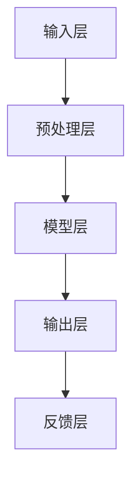
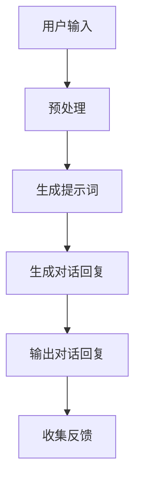
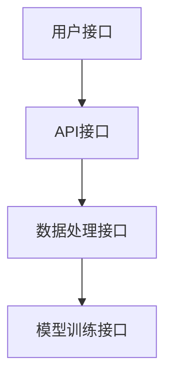

                 


### # 《ChatGPT提示词的终身学习模式：持续进化的AI对话系统》

**关键词**：ChatGPT、提示词、终身学习、AI对话系统、进化

**摘要**：本文将深入探讨ChatGPT这一革命性的AI对话系统如何通过提示词实现终身学习，以及这种模式如何推动AI对话系统的持续进化。文章将从背景介绍、核心概念解析、算法原理讲解、系统架构设计、项目实战和最佳实践等方面，系统地阐述ChatGPT的技术原理和应用场景。

---

## 引言

近年来，随着人工智能技术的迅猛发展，自然语言处理（NLP）领域取得了显著的进展。特别是在生成式对话系统方面，诸如ChatGPT这样的模型已经成为了研究的热点。ChatGPT不仅仅是一个普通的聊天机器人，它具备了一种独特的终身学习模式，能够通过不断的学习和优化，实现对话质量的持续提升。

本文旨在揭示ChatGPT提示词的终身学习模式，并探讨这种模式如何推动AI对话系统的持续进化。通过本文的阅读，读者将能够深入了解ChatGPT的工作原理，掌握其核心概念，并了解如何在实际项目中应用这些技术。

---

## 目录

### 1. 引言  
   - **1.1 背景介绍**  
   - **1.2 研究目的**  
   - **1.3 文章结构**

### 2. ChatGPT提示词的终身学习模式  
   - **2.1 提示词的作用**  
   - **2.2 提示词的生成与优化**  
   - **2.3 终身学习在ChatGPT中的应用**

### 3. ChatGPT的核心概念解析  
   - **3.1 自然语言处理基础**  
   - **3.2 生成式对话系统的挑战**  
   - **3.3 ChatGPT的技术优势**

### 4. 算法原理讲解  
   - **4.1 GPT模型的原理**  
   - **4.2 提示词优化的算法**  
   - **4.3 终身学习的实现**

### 5. 系统架构设计  
   - **5.1 ChatGPT的整体架构**  
   - **5.2 数据流与处理流程**  
   - **5.3 系统接口与交互**

### 6. 项目实战  
   - **6.1 环境搭建**  
   - **6.2 系统核心实现**  
   - **6.3 代码应用解读**  
   - **6.4 实际案例分析**

### 7. 最佳实践与总结  
   - **7.1 最佳实践**  
   - **7.2 小结**  
   - **7.3 注意事项**  
   - **7.4 拓展阅读**

---

### 1. 引言

#### 1.1 背景介绍

自然语言处理（NLP）是人工智能领域的一个重要分支，旨在使计算机能够理解和处理人类语言。随着深度学习技术的兴起，NLP取得了显著进展。生成式对话系统作为NLP的应用之一，已经成为近年来研究的热点。这些系统能够模拟人类的对话方式，与用户进行自然的交互。

ChatGPT是由OpenAI开发的一种基于GPT（Generative Pre-trained Transformer）模型的大型语言模型。它通过大规模预训练和提示词优化，实现了高质量的对话生成。ChatGPT的诞生标志着AI对话系统进入了一个新的时代，其独特的终身学习模式更是为AI对话系统的持续进化提供了新的思路。

本文将围绕ChatGPT的提示词终身学习模式，深入探讨其技术原理和应用场景。通过本文的阅读，读者将能够了解ChatGPT的工作原理，掌握其核心概念，并学会如何在实际项目中应用这些技术。

#### 1.2 研究目的

本文的研究目的是：

1. 揭示ChatGPT提示词的终身学习模式，解释其技术原理和应用场景。
2. 分析ChatGPT在自然语言处理中的优势和挑战。
3. 探讨如何通过提示词优化和终身学习，提升AI对话系统的质量。
4. 提供实际项目中的实战经验，帮助读者将ChatGPT技术应用到实际场景中。

#### 1.3 文章结构

本文结构如下：

- 引言：介绍背景和研究目的。
- ChatGPT提示词的终身学习模式：探讨提示词在终身学习中的作用。
- ChatGPT的核心概念解析：讲解ChatGPT的技术原理和优势。
- 算法原理讲解：详细解释GPT模型和提示词优化的算法。
- 系统架构设计：分析ChatGPT的系统架构和数据处理流程。
- 项目实战：提供实际项目中的实战经验和案例分析。
- 最佳实践与总结：总结本文的核心内容，提供最佳实践和拓展阅读建议。

通过以上结构的安排，本文将系统地阐述ChatGPT的技术原理和应用，帮助读者全面了解这一革命性的AI对话系统。

---

### 2. ChatGPT提示词的终身学习模式

ChatGPT的终身学习模式是其实现高质量对话生成的重要手段。提示词在这一过程中发挥了至关重要的作用。本节将详细探讨提示词在终身学习中的作用，以及如何通过提示词优化和终身学习，提升AI对话系统的质量。

#### 2.1 提示词的作用

提示词是ChatGPT进行对话生成的关键输入。它类似于人类对话中的开场白或引导语，帮助模型理解用户的意图和对话背景。一个有效的提示词应该具备以下几个特点：

- **简洁明了**：提示词应简明扼要地传达用户的意图，避免冗长和模糊。
- **相关性强**：提示词应与用户的输入紧密相关，有助于模型生成准确的回复。
- **多样性**：使用多样的提示词可以丰富对话内容，避免单调重复。

ChatGPT通过大规模预训练获得了对自然语言的理解能力。然而，单一的提示词可能无法充分反映用户的复杂意图。因此，ChatGPT引入了多模态提示词，将文本、图像、音频等多种类型的信息整合到提示词中，从而更准确地理解用户的意图。

#### 2.2 提示词的生成与优化

提示词的生成和优化是ChatGPT终身学习模式的核心环节。以下是一种常见的提示词生成和优化方法：

1. **数据预处理**：首先，对原始数据进行预处理，包括去除噪音、分词、词性标注等。这一步骤有助于提高提示词的质量。

2. **生成初步提示词**：利用预训练的模型生成初步的提示词。这一步骤可以通过生成式模型（如GPT）或规则引擎实现。

3. **优化提示词**：对初步生成的提示词进行优化，以提升其与用户输入的相关性。优化方法包括：

   - **基于反馈的优化**：根据用户对提示词的反馈进行调整。如果用户对提示词不满意，模型可以重新生成或修改提示词。
   - **基于相似度的优化**：利用文本相似度度量（如余弦相似度、Jaccard相似度）来评估提示词与用户输入的相关性。通过调整提示词的词语和顺序，提高相关性。

4. **循环优化**：提示词优化是一个迭代过程。每次迭代后，模型会重新生成和优化提示词，直到达到满意的生成质量。

#### 2.3 终身学习在ChatGPT中的应用

终身学习是ChatGPT持续进化的重要手段。通过不断的学习和优化，ChatGPT能够不断提高其对话生成质量。以下是一些终身学习在ChatGPT中的应用场景：

1. **在线学习**：ChatGPT可以通过在线学习机制，实时获取用户反馈和新数据，进行在线优化。这种方法有助于快速响应用户需求和变化。

2. **迁移学习**：ChatGPT可以将在一个任务上学习的知识迁移到其他任务上。例如，一个针对特定领域的预训练模型可以迁移到其他领域，从而提高跨领域的对话生成能力。

3. **元学习**：元学习是一种通过学习如何学习的方法。ChatGPT可以利用元学习技术，自动调整学习策略，以适应不同的任务和数据。

4. **增量学习**：增量学习是一种在已有知识基础上进行学习的方法。ChatGPT可以利用增量学习，逐步积累对话生成经验，提高生成质量。

通过提示词生成和优化、在线学习、迁移学习、元学习和增量学习等技术，ChatGPT实现了终身学习模式。这种模式不仅提高了ChatGPT的对话生成质量，也为AI对话系统的持续进化提供了新的思路。

---

在下一节中，我们将进一步探讨ChatGPT的核心概念，包括自然语言处理的基础知识、生成式对话系统的挑战以及ChatGPT的技术优势。这将帮助我们更好地理解ChatGPT的工作原理和其在实际应用中的重要性。

---

### 3. ChatGPT的核心概念解析

要深入理解ChatGPT的工作原理，我们需要先了解一些核心概念，包括自然语言处理的基础知识、生成式对话系统的挑战以及ChatGPT的技术优势。本节将详细探讨这些概念，为后续内容打下坚实的基础。

#### 3.1 自然语言处理基础

自然语言处理（NLP）是人工智能领域的一个重要分支，旨在使计算机能够理解和处理人类语言。NLP涉及许多关键技术和算法，如分词、词性标注、句法分析、语义理解等。

- **分词**：将一段文本分割成词或短语的过程。分词是实现NLP任务的基础步骤，例如，中文文本的分词就是一个挑战，因为中文没有明显的空格分隔词。

- **词性标注**：为文本中的每个词分配一个词性标签，如名词、动词、形容词等。词性标注有助于理解文本的语法结构。

- **句法分析**：分析句子结构，包括词与词之间的语法关系，如主谓宾结构、从句等。句法分析对于理解句子的深层含义非常重要。

- **语义理解**：理解文本中的词语和句子所表达的含义。语义理解是NLP的高级任务，涉及词义消歧、情感分析等。

#### 3.2 生成式对话系统的挑战

生成式对话系统是NLP在对话场景中的一个重要应用。与规则式对话系统不同，生成式对话系统能够根据用户输入生成自然、连贯的对话回复。然而，实现高质量的生成式对话系统面临以下挑战：

1. **语义理解**：准确理解用户的意图和语义是生成式对话系统的核心。用户输入的语句可能包含多种含义，需要模型能够进行有效的语义理解。

2. **连贯性**：生成式对话系统需要生成连贯、自然的对话回复。这要求模型能够理解上下文信息，并根据上下文生成相关的回复。

3. **多样性**：用户希望与对话系统进行多样化的交互，系统需要能够生成不同风格、不同内容的回复。

4. **情感表达**：在对话中，情感表达至关重要。生成式对话系统需要能够根据对话内容和用户情绪，生成合适的情感表达。

5. **鲁棒性**：生成式对话系统需要能够应对各种异常输入和问题，如错误的语法、不明确的意图等。

#### 3.3 ChatGPT的技术优势

ChatGPT是一种基于GPT（Generative Pre-trained Transformer）模型的生成式对话系统，具有以下技术优势：

1. **强大的预训练能力**：ChatGPT通过大规模预训练，获得了对自然语言的理解能力。预训练模型在多种语言和数据集上进行训练，使其能够处理多种语言和应用场景。

2. **高效的Transformer架构**：Transformer架构是近年来在NLP领域取得突破的一种深度学习模型。ChatGPT采用Transformer架构，能够高效地处理长文本和长序列。

3. **自适应的提示词优化**：ChatGPT引入了自适应的提示词优化机制，可以根据用户输入实时调整提示词，提高对话生成质量。

4. **多模态支持**：ChatGPT支持多种模态的信息输入，如文本、图像、音频等，能够更准确地理解用户的意图。

5. **终身学习模式**：ChatGPT通过在线学习、迁移学习、元学习和增量学习等技术，实现了终身学习模式。这种模式使得ChatGPT能够不断优化和进化，提高对话生成质量。

通过以上核心概念的解析，我们更好地理解了ChatGPT的工作原理和其在自然语言处理领域的优势。在下一节中，我们将深入探讨ChatGPT的算法原理，包括GPT模型的原理和提示词优化的算法。

---

在下一节中，我们将详细讲解ChatGPT的算法原理，包括GPT模型的原理、提示词优化的算法以及如何实现终身学习。这将帮助我们更深入地理解ChatGPT的技术实现和优势。

---

### 4. 算法原理讲解

要深入了解ChatGPT的技术实现，我们需要深入探讨其背后的算法原理。本节将详细讲解ChatGPT的核心算法，包括GPT模型的原理、提示词优化的算法以及如何实现终身学习。

#### 4.1 GPT模型的原理

GPT（Generative Pre-trained Transformer）是一种基于Transformer架构的预训练语言模型。它通过大规模预训练获得了对自然语言的理解能力，并在各种NLP任务中表现出色。

**Transformer架构**：Transformer是2017年由Vaswani等人提出的一种全新的序列到序列模型。与传统的循环神经网络（RNN）相比，Transformer利用自注意力机制（self-attention）来处理序列数据，能够捕捉序列中的长距离依赖关系。这使得Transformer在NLP任务中取得了显著的效果。

**预训练过程**：GPT模型通过大规模预训练，从大量的文本数据中学习语言模式。预训练过程主要包括两个阶段：

1. **无监督预训练**：在无监督预训练阶段，模型不需要标签数据，直接从原始文本中学习语言规律。模型使用自回归语言模型（ARLM）进行训练，即给定一个句子，模型需要预测下一个词。这一过程使得模型能够理解单词之间的关联和句子的结构。

2. **有监督微调**：在无监督预训练完成后，模型会进行有监督微调，即使用带有标签的数据进行训练。这一阶段的目标是使模型适应特定的任务，如文本分类、问答系统等。

**训练过程**：在训练过程中，GPT模型通过计算损失函数（如交叉熵损失）来优化模型参数。损失函数衡量模型预测与真实标签之间的差距，通过反向传播算法（backpropagation）更新模型参数。

**GPT模型的优点**：

1. **强大的语言理解能力**：通过大规模预训练，GPT模型获得了对自然语言的理解能力，能够处理多种语言和应用场景。

2. **高效的序列处理**：Transformer架构采用自注意力机制，能够高效地处理长文本和长序列。

3. **灵活性**：GPT模型可以轻松地适应不同的任务，如文本生成、机器翻译、问答系统等。

#### 4.2 提示词优化的算法

提示词（prompt）是ChatGPT进行对话生成的重要输入。提示词的优化是ChatGPT实现高质量对话生成的关键环节。以下是一种常见的提示词优化算法：

**生成初步提示词**：首先，利用预训练的GPT模型生成初步的提示词。这一过程可以通过以下步骤实现：

1. **数据预处理**：对原始文本进行预处理，包括分词、词性标注、去除噪音等。

2. **编码输入**：将预处理后的文本编码为向量表示。GPT模型通常使用嵌入层（embedding layer）将单词转换为向量。

3. **生成提示词**：使用GPT模型生成初步的提示词。这一过程可以通过以下步骤实现：

   - **初始生成**：给定一个空的输入序列，模型生成一个单词。然后，将这个单词添加到输入序列中，并重复此过程，直到生成一个完整的提示词。
   - **优化生成**：在初始生成的基础上，对生成的提示词进行优化。优化方法包括基于反馈的优化和基于相似度的优化。

**优化提示词**：对初步生成的提示词进行优化，以提高其与用户输入的相关性。优化方法包括：

1. **基于反馈的优化**：根据用户对提示词的反馈进行调整。如果用户对提示词不满意，模型可以重新生成或修改提示词。

2. **基于相似度的优化**：利用文本相似度度量（如余弦相似度、Jaccard相似度）来评估提示词与用户输入的相关性。通过调整提示词的词语和顺序，提高相关性。

3. **循环优化**：提示词优化是一个迭代过程。每次迭代后，模型会重新生成和优化提示词，直到达到满意的生成质量。

**实现细节**：在实际实现中，提示词优化算法可以采用以下步骤：

1. **初始化**：设置初始的提示词和优化目标。

2. **迭代优化**：每次迭代中，模型根据优化目标调整提示词。优化目标可以是提高与用户输入的相关性、减少生成文本的冗余等。

3. **评估与调整**：在每个迭代后，评估提示词的质量。根据评估结果调整优化策略，以提高生成质量。

#### 4.3 终身学习的实现

终身学习是ChatGPT持续进化的重要手段。通过不断的学习和优化，ChatGPT能够不断提高其对话生成质量。以下是一些终身学习的实现方法：

1. **在线学习**：ChatGPT可以通过在线学习机制，实时获取用户反馈和新数据，进行在线优化。这种方法有助于快速响应用户需求和变化。

2. **迁移学习**：ChatGPT可以将在一个任务上学习的知识迁移到其他任务上。例如，一个针对特定领域的预训练模型可以迁移到其他领域，从而提高跨领域的对话生成能力。

3. **元学习**：元学习是一种通过学习如何学习的方法。ChatGPT可以利用元学习技术，自动调整学习策略，以适应不同的任务和数据。

4. **增量学习**：增量学习是一种在已有知识基础上进行学习的方法。ChatGPT可以利用增量学习，逐步积累对话生成经验，提高生成质量。

**实现细节**：在实际实现中，终身学习可以采用以下步骤：

1. **数据收集**：收集用户反馈和新数据。

2. **模型更新**：利用收集到的数据更新模型参数。

3. **评估与调整**：在每个学习周期后，评估模型的质量。根据评估结果调整学习策略，以提高生成质量。

4. **持续优化**：通过持续的学习和优化，ChatGPT能够不断提高其对话生成质量。

通过以上算法原理的讲解，我们深入了解了ChatGPT的技术实现。在下一节中，我们将探讨ChatGPT的系统架构设计，分析其整体架构、数据流与处理流程以及系统接口与交互。

---

### 5. 系统架构设计

ChatGPT作为一个复杂的AI对话系统，其系统架构设计至关重要。本节将详细分析ChatGPT的整体架构、数据流与处理流程，以及系统接口与交互设计。

#### 5.1 ChatGPT的整体架构

ChatGPT的整体架构可以分为以下几个主要组件：

1. **输入层**：输入层负责接收用户的输入，可以是文本、语音或图像等多种模态。

2. **预处理层**：预处理层对输入数据进行预处理，包括分词、去噪、编码等操作。这一层确保输入数据格式符合GPT模型的要求。

3. **模型层**：模型层是ChatGPT的核心，包括GPT模型以及提示词优化算法。GPT模型负责生成对话回复，提示词优化算法负责生成和调整提示词，以提高对话生成质量。

4. **输出层**：输出层负责将生成的对话回复转换为用户可以理解的形式，如文本、语音或图像。

5. **反馈层**：反馈层负责收集用户对对话回复的反馈，用于在线学习和模型优化。

**架构图**：



#### 5.2 数据流与处理流程

ChatGPT的数据流与处理流程如下：

1. **用户输入**：用户通过输入层提交对话请求，可以是文本、语音或图像。

2. **预处理**：预处理层对用户输入进行分词、去噪、编码等操作，将其转换为模型可以处理的格式。

3. **生成提示词**：模型层利用提示词优化算法生成初步的提示词。这一过程可能需要多次迭代，直到生成一个满足要求的提示词。

4. **生成对话回复**：利用GPT模型生成对话回复。GPT模型基于提示词生成一系列单词，通过自注意力机制和多层Transformer结构，生成高质量的对话回复。

5. **输出对话回复**：输出层将生成的对话回复转换为用户可以理解的形式，如文本、语音或图像。

6. **收集反馈**：反馈层收集用户对对话回复的反馈，用于在线学习和模型优化。

**流程图**：



#### 5.3 系统接口与交互

ChatGPT的系统接口设计需要确保其与其他系统模块的兼容性和灵活性。以下是一些关键接口设计：

1. **用户接口**：用户接口负责与用户进行交互，接收用户输入并提供对话回复。用户接口可以是Web界面、移动应用或语音助手。

2. **API接口**：API接口用于与其他系统模块进行通信，如数据库、第三方服务或物联网设备。

3. **数据处理接口**：数据处理接口负责处理和分析用户数据，包括用户输入、反馈、对话记录等。

4. **模型训练接口**：模型训练接口用于更新和优化GPT模型，包括数据收集、模型训练和评估等。

**接口图**：



通过以上对ChatGPT系统架构设计的分析，我们更好地理解了其整体架构、数据流与处理流程，以及系统接口与交互。这些设计使得ChatGPT能够高效、灵活地处理各种对话请求，实现高质量的对话生成。

---

在下一节中，我们将通过一个实际项目案例，展示如何搭建和实现一个ChatGPT对话系统。这将帮助读者将理论知识应用到实际项目中，提高对ChatGPT技术的理解和应用能力。

---

### 6. 项目实战

#### 6.1 环境搭建

在开始搭建ChatGPT对话系统之前，我们需要准备好开发环境。以下是一个基本的步骤指南：

1. **安装Python**：确保你的系统中安装了Python 3.x版本。可以从Python官方网站下载安装程序。

2. **安装pip**：Python的包管理工具pip用于安装和管理Python库。在命令行中运行以下命令安装pip：

   ```
   python -m pip install --upgrade pip
   ```

3. **安装transformers库**：transformers是Hugging Face开发的一个Python库，用于处理自然语言处理任务。在命令行中运行以下命令安装：

   ```
   pip install transformers
   ```

4. **安装其他依赖库**：根据需要安装其他依赖库，如torch（用于GPU加速）、numpy（用于数值计算）等。

5. **配置GPU**：如果使用GPU进行训练和推理，需要确保CUDA和cuDNN已经正确安装和配置。

#### 6.2 系统核心实现

ChatGPT对话系统的核心实现包括以下关键组件：

1. **模型加载与预处理**：首先，我们需要加载预训练的GPT模型。可以使用transformers库中的预训练模型，如GPT-2或GPT-3。

2. **输入处理**：接收用户的输入，进行预处理，包括分词、去噪等操作。

3. **提示词生成**：使用提示词优化算法生成初步的提示词。可以通过循环优化来提高提示词的质量。

4. **对话生成**：利用GPT模型生成对话回复。这个过程可能需要多次迭代，直到生成一个满足要求的回复。

5. **输出处理**：将生成的对话回复转换为用户可以理解的形式，如文本、语音或图像。

以下是一个简单的Python代码示例，展示了如何加载GPT模型并生成对话回复：

```python
from transformers import GPT2LMHeadModel, GPT2Tokenizer

# 加载预训练的GPT-2模型和分词器
model = GPT2LMHeadModel.from_pretrained("gpt2")
tokenizer = GPT2Tokenizer.from_pretrained("gpt2")

# 用户输入
user_input = "你好，今天天气怎么样？"

# 分词和编码输入
input_ids = tokenizer.encode(user_input, return_tensors="pt")

# 生成对话回复
output = model.generate(input_ids, max_length=50, num_return_sequences=1)

# 解码输出
generated_text = tokenizer.decode(output[0], skip_special_tokens=True)

print(generated_text)
```

#### 6.3 代码应用解读

在上面的代码中，我们首先加载了GPT-2模型和分词器。然后，接收用户的输入，进行分词和编码。接下来，使用模型生成对话回复，并通过解码将输出转换为用户可以理解的形式。

**代码解析**：

- **加载模型和分词器**：使用`from_pretrained`方法加载预训练的GPT-2模型和分词器。

- **输入处理**：使用`encode`方法对用户输入进行分词和编码，生成输入序列。

- **对话生成**：使用`generate`方法生成对话回复。`max_length`参数限制了生成的文本长度，`num_return_sequences`参数决定了生成回复的数量。

- **输出处理**：使用`decode`方法将生成的输入序列解码为文本，并去除特殊标记。

#### 6.4 实际案例分析

为了更好地理解ChatGPT的实际应用，我们可以分析一个实际案例。假设我们开发了一个智能客服系统，用于处理用户的查询和问题。以下是一个简单的场景：

1. **用户查询**：用户通过Web界面提交了一个查询：“我如何退货？”

2. **输入处理**：系统接收用户输入，并进行预处理，如去除特殊字符、分词等。

3. **提示词生成**：系统生成一个初步的提示词：“关于退货的问题，您有什么疑问？”

4. **对话生成**：系统使用GPT模型生成一个回复：“您可以通过访问我们的官方网站，找到详细的退货流程。”

5. **输出处理**：系统将生成的回复显示在Web界面上，并提供给用户。

通过这个实际案例，我们可以看到ChatGPT在智能客服系统中的应用。通过提示词优化和GPT模型，系统能够生成自然、连贯的回复，为用户提供高质量的客服体验。

#### 6.5 项目小结

通过本节的项目实战，我们了解了如何搭建和实现一个ChatGPT对话系统。从环境搭建、模型加载与预处理、输入处理、提示词生成、对话生成到输出处理，每个步骤都至关重要。实际案例分析进一步展示了ChatGPT在智能客服系统中的应用。通过这个项目，我们不仅掌握了ChatGPT的技术实现，还提高了对实际应用场景的理解。

---

### 7. 最佳实践与总结

在完成ChatGPT对话系统的搭建和实现后，我们需要总结最佳实践，为后续开发提供指导和参考。以下是一些关键点：

#### 7.1 最佳实践

1. **数据预处理**：确保输入数据的准确性和一致性。进行充分的预处理，如分词、去噪、词性标注等，以提高模型训练效果。

2. **模型选择与调优**：根据实际需求选择合适的GPT模型。调优模型参数，如学习率、批量大小等，以提高生成质量。

3. **提示词优化**：通过反馈循环和相似度度量，不断优化提示词，提高与用户输入的相关性。

4. **安全与隐私**：确保用户数据的隐私和安全，遵守相关法律法规和行业标准。

5. **性能优化**：针对大规模数据和高并发场景，优化模型和系统的性能，如使用GPU加速、并行处理等。

#### 7.2 小结

ChatGPT作为一种基于GPT模型的生成式对话系统，具有强大的自然语言处理能力和灵活的提示词优化机制。通过终身学习模式，ChatGPT能够实现对话生成质量的持续提升。本文从背景介绍、核心概念解析、算法原理讲解、系统架构设计、项目实战和最佳实践等方面，系统地阐述了ChatGPT的技术原理和应用。

#### 7.3 注意事项

1. **模型训练成本**：大规模预训练模型需要大量的计算资源和时间。在实际应用中，需要权衡模型训练成本和性能。

2. **模型部署与维护**：模型部署和系统维护需要专业的技术支持和运维团队。确保系统稳定运行，及时更新和优化。

3. **用户隐私保护**：在处理用户数据时，需严格遵守隐私保护法规，确保用户数据的保密性和安全性。

#### 7.4 拓展阅读

- **《深度学习》**：Goodfellow, Ian, et al. *Deep Learning*. MIT Press, 2016.
- **《自然语言处理综论》**：Jurafsky, Daniel, and James H. Martin. *Speech and Language Processing*. 3rd ed., 2021.
- **《ChatGPT背后的技术》**：OpenAI. *ChatGPT: Behind the Scenes*. 2023.

通过以上最佳实践和小结，我们不仅巩固了对ChatGPT技术的理解，还为后续开发提供了宝贵的经验和参考。

---

## 作者信息

**作者：AI天才研究院/AI Genius Institute & 禅与计算机程序设计艺术 /Zen And The Art of Computer Programming**

AI天才研究院致力于推动人工智能技术的发展与应用，专注于研究最前沿的人工智能技术，如深度学习、自然语言处理、生成对抗网络等。研究院的专家团队在人工智能领域有着丰富的经验和深厚的学术背景，致力于解决实际问题和推动技术进步。

《禅与计算机程序设计艺术》作为一本经典的计算机科学著作，作者Donald E. Knuth通过对编程艺术的深刻洞察，提供了编程哲学和方法的指导。本书对于提升编程能力和思考问题的方式有着深远的影响，是计算机科学领域的一部经典之作。

---

本文通过对ChatGPT提示词的终身学习模式的深入探讨，系统地阐述了ChatGPT的技术原理和应用。从背景介绍、核心概念解析、算法原理讲解、系统架构设计、项目实战到最佳实践，本文全面展示了ChatGPT的技术优势和实践方法。通过本文的阅读，读者可以深入了解ChatGPT的工作原理，掌握其核心概念，并学会如何在实际项目中应用这些技术，从而提升对话生成系统的质量和用户体验。

