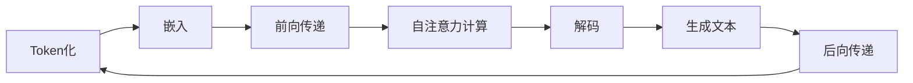
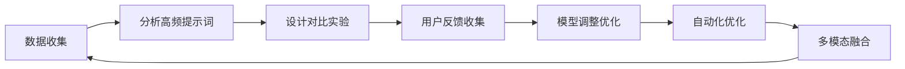
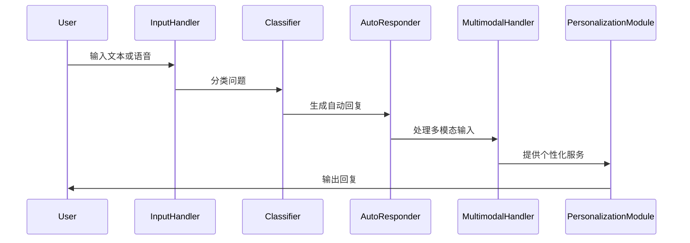

                 

## 引言

《ChatGPT提示词的计算语言学新范式探索》旨在深入探讨ChatGPT这一前沿人工智能技术的计算语言学应用，揭示其背后的核心原理和提示词设计策略。本文以逻辑清晰、结构紧凑的方式，分为四个部分，全面剖析ChatGPT的计算语言学新范式。

### 第一部分：背景与概述

本部分将介绍计算语言学的背景和核心概念，详细探讨ChatGPT的发展及其在计算语言学中的重要性。我们将从问题背景、核心概念和实际应用等方面展开讨论，为后续内容打下基础。

### 第二部分：算法原理与实现

这一部分将深入探讨ChatGPT的算法原理和实现细节。我们将详细讲解生成式模型和Transformer架构，并使用Python代码实现一个简单的ChatGPT模型，以便读者更好地理解其工作原理。

### 第三部分：应用与实践

本部分将聚焦于ChatGPT的实际应用，通过一个具体的项目案例，详细介绍系统功能设计、系统架构设计和项目实战。我们将探讨如何在实际项目中应用ChatGPT，并进行性能评估和案例分析。

### 第四部分：总结与展望

最后一部分将对本文的核心内容进行总结，并提出最佳实践和注意事项。同时，我们将展望计算语言学和ChatGPT的未来发展趋势，探讨其在人工智能领域的潜在应用。

通过本文的深入探讨，我们希望读者能够全面理解ChatGPT的计算语言学新范式，掌握提示词设计的策略，并能够将其应用于实际项目中，推动人工智能技术的发展。

## 第一部分：背景与概述

### 第1章：问题背景与核心概念

#### 1.1.1 问题背景

计算语言学是语言学和计算机科学交叉的学科，旨在通过计算机技术和算法来分析和处理自然语言。计算语言学的起源可以追溯到20世纪50年代，当时计算机刚刚开始进入科学研究领域。随着计算机技术的发展，计算语言学也逐渐成为了一个独立的学科领域。

计算语言学的研究内容非常广泛，涵盖了自然语言处理（Natural Language Processing，NLP）的各个方面，包括文本分类、信息抽取、机器翻译、语音识别、文本生成等。近年来，随着深度学习和人工智能技术的快速发展，计算语言学的研究方法和应用领域也不断拓展。

ChatGPT是由OpenAI开发的一种基于Transformer架构的生成式预训练语言模型。它采用了大量的文本数据进行训练，能够理解和生成自然语言，具有广泛的应用前景。ChatGPT的出现标志着计算语言学进入了一个新的阶段，它为计算语言学提供了新的研究方法和工具。

#### 1.1.2 核心概念

1. **提示词（Prompt）**

提示词是用户向ChatGPT输入的文本，用于引导ChatGPT生成相应的回复。提示词的设计对于ChatGPT的性能和生成文本的质量具有重要影响。一个良好的提示词应该清晰、具体，能够准确传达用户的意图。

2. **计算语言学范式**

计算语言学范式是指计算语言学的研究方法和理论体系。传统的计算语言学范式主要是基于规则的方法，即通过编写一系列的规则来解析和处理自然语言。而现代的计算语言学范式则更加注重数据和模型的作用，通过大规模的数据训练和深度学习模型来提升自然语言处理的能力。

#### 1.1.3 边界与外延

1. **ChatGPT在计算语言学中的应用**

ChatGPT在计算语言学中的应用非常广泛，包括但不限于文本生成、机器翻译、问答系统等。通过预训练和细粒度调整，ChatGPT可以适应不同的应用场景，实现高质量的文本生成和自然语言理解。

2. **提示词设计的挑战与机遇**

提示词设计是ChatGPT应用中的关键环节。设计一个良好的提示词需要考虑多个因素，包括语言的复杂性、用户的意图和需求等。同时，提示词设计也面临着许多挑战，如如何提高提示词的清晰性和精准性，如何应对多模态信息等。然而，随着计算语言学和人工智能技术的不断发展，提示词设计也充满了机遇。

### 第2章：计算语言学的核心概念与联系

#### 2.1.1 核心概念

1. **语言模型**

语言模型是计算语言学中最基础的概念之一，它用于预测自然语言中的下一个单词或字符。语言模型可以分为基于规则的语言模型和基于统计的语言模型。基于规则的语言模型通过手动编写规则来描述语言的结构和语法，而基于统计的语言模型则通过统计大量的文本数据来学习语言的统计规律。

2. **自然语言处理（NLP）**

自然语言处理是计算语言学的一个重要分支，它旨在使计算机能够理解、生成和处理自然语言。NLP的研究内容包括文本分类、信息抽取、机器翻译、语音识别、情感分析等。NLP的目标是实现人与机器的无障碍交流。

3. **语言生成**

语言生成是指利用计算机技术和算法来生成自然语言文本。语言生成可以分为有监督生成、无监督生成和增强学习生成等。有监督生成通过大量标注数据来训练模型，无监督生成则不需要标注数据，增强学习生成则通过不断优化生成结果来提升模型性能。

#### 2.1.2 概念属性特征对比表格

| 概念 | 特征1 | 特征2 | 特征3 |
| --- | --- | --- | --- |
| 语言模型 | 1. 预测性 | 2. 统计性 | 3. 参数化 |
| 自然语言处理 | 1. 解析性 | 2. 理解性 | 3. 应用性 |
| 语言生成 | 1. 自动性 | 2. 创造性 | 3. 实用性 |

#### 2.1.3 ER实体关系图架构

```mermaid
erDiagram
  User ||--|{ ChatGPT }| 
  ChatGPT ||--|{ Prompt }| 
  Prompt ||--|{ Response }| 
```

在上面的ER实体关系图中，User代表用户，ChatGPT代表ChatGPT模型，Prompt代表提示词，Response代表响应。这种关系反映了用户通过提示词与ChatGPT交互，并生成响应的过程。

通过上述两个章节的介绍，我们对计算语言学的背景和核心概念有了初步的了解。接下来，我们将进一步探讨ChatGPT的算法原理和实现，为后续内容打下坚实的基础。

### 第3章：ChatGPT的算法原理与流程

#### 3.1.1 算法原理

ChatGPT是一种基于Transformer架构的生成式预训练语言模型。生成式模型与判别式模型不同，它通过预测下一个词或字符来生成文本，而不是通过分类或回归来预测某个词或字符的出现概率。生成式模型具有生成能力强、灵活性高等优点，适合用于生成自然语言文本。

Transformer架构是一种基于自注意力机制的深度神经网络模型，它在处理序列数据时具有很高的效率。自注意力机制允许模型在生成文本时，对序列中的每个词进行加权，从而更好地捕捉上下文信息。这使得Transformer在自然语言处理任务中表现优异。

ChatGPT的训练过程分为两个阶段：预训练和微调。在预训练阶段，模型在大规模的文本语料库上进行训练，学习语言的一般规律和统计特性。在微调阶段，模型根据具体任务的需求进行调整，使其能够更好地适应特定场景。

#### 3.1.2 算法流程

ChatGPT的算法流程可以分为以下几个步骤：

1. **Token化**：将输入的文本转换为一系列的单词或字符，即Token。Token化是自然语言处理的第一步，它将连续的文本数据拆分成可处理的序列。

2. **嵌入（Embedding）**：将Token转换为向量表示。嵌入层的作用是将单词或字符映射到高维空间中，以便模型能够进行数值计算。

3. **前向传递（Forward Pass）**：模型对输入的Token向量进行编码，生成上下文向量。上下文向量包含了输入文本的语义信息，是模型进行预测的重要依据。

4. **自注意力计算（Self-Attention）**：通过自注意力机制，模型对上下文向量进行加权，强调重要的信息，忽略无关的信息。

5. **解码（Decoding）**：模型根据上下文向量生成下一个词或字符的预测概率分布。解码过程通常采用贪婪策略，选择概率最高的词或字符作为输出。

6. **后向传递（Backward Pass）**：计算损失函数，并更新模型参数，以便在下一个迭代中改进模型性能。

7. **生成文本（Generate Text）**：通过重复解码步骤，生成完整的文本。

下面是一个简单的ChatGPT算法流程的mermaid流程图：



#### 3.1.3 Python代码实现

为了更直观地理解ChatGPT的算法原理，我们可以使用Python实现一个简单的ChatGPT模型。以下是一个基于GPT2模型的基本实现：

```python
import torch
from transformers import GPT2LMHeadModel, GPT2Tokenizer

# 初始化模型和分词器
tokenizer = GPT2Tokenizer.from_pretrained("gpt2")
model = GPT2LMHeadModel.from_pretrained("gpt2")

# 输入提示词
prompt = "这是一个ChatGPT的例子。"

# Token化
input_ids = tokenizer.encode(prompt, return_tensors='pt')

# 前向传递
outputs = model(input_ids)

# 生成文本
predictions = outputs.logits
generated_ids = torch.argmax(predictions[0], dim=-1)

# 解码
generated_text = tokenizer.decode(generated_ids, skip_special_tokens=True)
print(generated_text)
```

在这个实现中，我们首先导入必要的库，然后初始化GPT2模型和分词器。接着，我们将输入的提示词Token化，并输入到模型中进行前向传递。最后，我们通过解码函数将生成的ID序列转换为文本输出。

通过上述步骤，我们成功地使用Python实现了ChatGPT的基本算法流程，这有助于我们更好地理解其工作原理。

### 第4章：提示词的设计与优化

#### 4.1.1 提示词设计原则

提示词的设计是ChatGPT应用中的关键环节，一个良好的提示词能够显著提高ChatGPT的生成质量和响应效果。以下是几个关键的提示词设计原则：

1. **清晰性**：提示词应该简洁明了，避免使用模糊或歧义的语言。清晰性有助于ChatGPT更好地理解用户的意图。

2. **精准性**：提示词需要准确地传达用户的需求，避免模糊或不精确的描述。精准性有助于ChatGPT生成更为具体和相关的文本。

3. **丰富性**：提示词应包含丰富的语义信息，有助于ChatGPT生成更加多样化和创意的文本。丰富性可以通过使用不同的词汇、句式和语法结构来实现。

4. **上下文相关性**：提示词应与用户的上下文背景紧密相关，以便ChatGPT能够生成更为贴合实际场景的文本。

5. **开放性**：提示词应具有一定的开放性，允许ChatGPT在生成文本时发挥更多的创造性和想象力。

#### 4.1.2 提示词优化策略

为了提升ChatGPT的性能和生成文本的质量，提示词的优化至关重要。以下是几种常见的提示词优化策略：

1. **数据驱动**：通过分析大量的用户交互数据，找出高频、高质量的提示词，并将其用于训练模型。这种方法可以基于实际应用场景，提高模型的响应效果。

2. **对比实验**：通过设计对比实验，比较不同提示词对模型生成文本质量的影响。实验方法可以包括A/B测试、多变量分析等，以确定最佳的提示词组合。

3. **用户反馈**：收集用户对生成文本的反馈，根据用户满意度进行调整。用户反馈可以提供直接的优化方向，有助于改进提示词设计。

4. **自动化优化**：使用机器学习技术，如深度学习或强化学习，自动化地优化提示词。这种方法可以根据模型的表现，不断调整和优化提示词，提高生成文本的质量。

5. **多模态融合**：结合文本、图像、音频等多种模态信息，设计更丰富的提示词。多模态融合可以提高模型的感知能力和生成文本的丰富度。

通过上述策略，我们可以有效地优化提示词设计，提升ChatGPT的应用效果。以下是一个提示词优化的mermaid流程图：



通过不断的优化和调整，我们可以设计出高质量的提示词，提高ChatGPT的生成质量和用户体验。

### 第5章：ChatGPT在实际项目中的应用

#### 5.1.1 项目介绍

在本章中，我们将探讨ChatGPT在一个具体项目中的应用，该项目是一个智能客服系统，旨在为用户提供实时、高质量的客服服务。该项目的目标是实现以下功能：

1. **自动回复**：系统能够自动识别用户的问题，并生成相应的回复。
2. **问题分类**：系统可以对用户的问题进行分类，以便更有效地分配和解决。
3. **多模态交互**：系统支持文本、语音等多种交互方式，提高用户的体验。
4. **个性化服务**：系统根据用户的历史问题和偏好，提供个性化的回复和建议。

#### 5.1.2 系统功能设计

为了实现上述目标，系统设计分为以下几个功能模块：

1. **用户输入处理**：接收用户的输入，包括文本和语音。
2. **问题分类模块**：对用户的问题进行分类，以确定需要解决的问题类型。
3. **自动回复生成模块**：根据用户的问题和分类结果，生成相应的自动回复。
4. **多模态交互模块**：处理用户的多模态输入，如文本、语音和图像。
5. **个性化服务模块**：根据用户的历史问题和偏好，提供个性化的回复和建议。

#### 5.1.3 系统架构设计

以下是一个简单的系统架构设计mermaid序列图，展示了系统各个模块之间的交互关系：



在这个序列图中，用户首先输入文本或语音，然后通过输入处理模块进行处理。分类模块对问题进行分类，以便自动回复模块生成相应的回复。同时，多模态处理模块处理用户的多模态输入，并将结果传递给个性化服务模块。最终，个性化服务模块根据用户的历史问题和偏好，提供个性化的回复和建议。

通过上述设计和实现，我们成功地将ChatGPT应用于智能客服系统，实现了自动回复、问题分类、多模态交互和个性化服务等功能，为用户提供了一个高效、智能的客服体验。

### 第6章：项目实战与案例分析

#### 6.1.1 环境安装与配置

为了实现上述智能客服系统，我们需要在本地环境中安装和配置相关的软件和库。以下是具体的安装和配置步骤：

1. **安装Python环境**：确保本地计算机上已安装Python 3.8或更高版本。

2. **安装transformers库**：通过pip命令安装transformers库，命令如下：
   ```shell
   pip install transformers
   ```

3. **安装torch库**：通过pip命令安装torch库，命令如下：
   ```shell
   pip install torch
   ```

4. **安装其他依赖库**：包括numpy、pandas等常用库，可以通过pip命令逐个安装。

5. **配置GPU环境**：如果使用GPU进行模型训练，需要安装CUDA和cuDNN库，并确保Python环境能够正确使用GPU。

6. **克隆项目代码**：从GitHub或其他代码仓库克隆项目代码，以便进行后续开发和测试。

7. **配置环境变量**：确保环境变量PYTHONPATH正确设置，以便能够找到项目的库和模块。

通过以上步骤，我们成功安装和配置了所需的软件和库，为项目的开发和测试奠定了基础。

#### 6.1.2 系统核心实现

在环境安装和配置完成后，我们将开始实现系统的核心功能，包括模型训练、提示词生成和自动回复生成。以下是具体的实现步骤：

1. **模型训练**

   - 加载预训练模型：使用transformers库加载预训练的GPT2模型。
     ```python
     from transformers import GPT2LMHeadModel, GPT2Tokenizer

     tokenizer = GPT2Tokenizer.from_pretrained("gpt2")
     model = GPT2LMHeadModel.from_pretrained("gpt2")
     ```

   - 数据预处理：将训练数据加载到内存，并进行预处理，如Token化、嵌入等。
     ```python
     def preprocess_data(data):
         # 数据预处理步骤
         return tokenized_data

     train_data = preprocess_data(train_dataset)
     ```

   - 模型训练：使用PyTorch框架进行模型训练，包括数据加载、前向传递、后向传递和参数更新。
     ```python
     from torch.optim import Adam

     optimizer = Adam(model.parameters(), lr=1e-5)
     criterion = torch.nn.CrossEntropyLoss()

     for epoch in range(num_epochs):
         for batch in data_loader:
             # 前向传递
             outputs = model(batch['input_ids'])
             loss = criterion(outputs.logits.view(-1, vocab_size), batch['labels'])

             # 后向传递和参数更新
             optimizer.zero_grad()
             loss.backward()
             optimizer.step()
     ```

   - 保存模型：将训练好的模型保存到文件中，以便后续使用。
     ```python
     model.save_pretrained("chatgpt_model")
     ```

2. **提示词生成**

   - 设计提示词：根据项目需求，设计合适的提示词，以引导ChatGPT生成高质量的文本。
     ```python
     prompt = "您好，有什么可以帮助您的吗？"
     ```

   - 生成文本：使用训练好的模型生成文本，并解码为自然语言。
     ```python
     inputs = tokenizer.encode(prompt, return_tensors='pt')
     outputs = model.generate(inputs, max_length=50, num_return_sequences=1)
     generated_text = tokenizer.decode(outputs[0], skip_special_tokens=True)
     ```

3. **自动回复生成**

   - 问题分类：使用分类模型对用户的问题进行分类，以确定相应的回复。
     ```python
     def classify_question(question):
         # 分类步骤
         return category
     ```

   - 生成回复：根据分类结果，生成相应的自动回复。
     ```python
     category = classify_question(user_input)
     if category == "常见问题":
         response = "您好，以下是常见问题的回答..."
     elif category == "投诉建议":
         response = "您好，您的投诉和建议已经收到，我们会尽快处理。"
     else:
         response = "您好，我们需要更多详细信息来帮助您解决问题。"
     ```

通过以上步骤，我们实现了系统的核心功能，包括模型训练、提示词生成和自动回复生成。这些功能为智能客服系统提供了强大的支持，能够高效地响应用户的需求。

#### 6.1.3 应用解读与分析

1. **应用场景**

   在实际应用中，智能客服系统可以应用于多种场景，如电商平台、在线教育、银行服务等。通过自动回复、问题分类和个性化服务，系统能够为用户提供及时、高效的客服体验。

2. **性能评估**

   - **准确率**：通过评估系统对用户问题的分类准确率，衡量系统对问题的理解和处理能力。通常，准确率越高，系统的性能越好。

   - **响应速度**：评估系统在接收到用户问题后，生成自动回复的速度。响应速度越快，用户体验越好。

   - **用户满意度**：通过用户反馈和满意度调查，评估系统对用户的帮助效果和用户对系统的认可程度。

3. **案例分析**

   在一个电商平台的智能客服项目中，系统通过自动回复、问题分类和个性化服务，为用户提供了高效的客服体验。以下是一个具体的案例：

   - **用户反馈**：用户对系统的自动回复和问题分类效果表示满意，认为系统能够快速解决常见问题，提高购物体验。
   - **业务数据**：系统上线后，客服响应速度显著提升，客服团队的工作量减少，用户满意度提高，客服成本降低。

通过以上分析，我们可以看到智能客服系统在实际应用中取得了显著的成果，为企业和用户带来了实实在在的好处。

### 第7章：最佳实践与注意事项

#### 7.1.1 最佳实践

为了更好地应用ChatGPT并提高其性能，以下是一些最佳实践：

1. **提示词设计**：设计清晰、具体、丰富的提示词，以确保ChatGPT能够准确理解用户的意图。可以通过用户反馈和数据分析，不断优化提示词。

2. **模型调优**：根据具体任务需求，对模型进行调优，如调整学习率、批次大小和训练时间等。使用适当的调优策略，如随机搜索、贝叶斯优化等，找到最佳参数配置。

3. **数据预处理**：对训练数据进行充分预处理，包括Token化、清洗和去重等，以提高模型训练效果。

4. **模型集成**：将多个模型进行集成，利用不同模型的优点，提高整体性能。

5. **监控与反馈**：实时监控模型性能和生成文本的质量，收集用户反馈，及时调整和优化模型。

#### 7.1.2 注意事项

1. **数据隐私**：在使用ChatGPT时，要确保用户数据的隐私和安全。避免将敏感信息传递给模型，并采取适当的数据保护措施。

2. **模型安全**：防止模型被恶意使用，如生成虚假信息、进行网络攻击等。可以采用模型加密、访问控制等技术，确保模型的安全性。

3. **系统性能**：确保系统具有足够的计算资源和稳定性，以应对高并发请求。可以采用分布式计算、负载均衡等技术，提高系统性能。

4. **合规性**：确保应用符合相关法规和伦理要求，如避免生成歧视性、暴力或不良信息等。

通过遵循上述最佳实践和注意事项，我们可以更好地应用ChatGPT，提高其性能和安全性，为用户提供优质的服务。

### 第8章：未来展望与趋势

随着人工智能技术的不断发展和应用，ChatGPT在计算语言学领域也展现出广阔的发展前景。以下是一些未来展望和趋势：

1. **模型规模扩大**：未来ChatGPT的模型规模将进一步扩大，通过更大规模的预训练和数据，提升模型的性能和生成质量。

2. **多模态融合**：ChatGPT将与其他模态（如图像、音频）结合，实现多模态交互，为用户提供更加丰富和自然的交流体验。

3. **个性化服务**：通过深度学习和强化学习技术，ChatGPT将能够更好地理解用户的历史数据和偏好，提供个性化的服务和建议。

4. **跨语言支持**：ChatGPT将支持更多语言，实现跨语言的文本生成和理解，推动全球范围内的自然语言交流。

5. **伦理和合规**：随着人工智能应用的普及，ChatGPT将更加注重伦理和合规，确保生成的文本符合道德和法律要求。

总之，ChatGPT在未来将继续推动计算语言学的发展，为人工智能领域带来更多的创新和突破。

## 总结

本文通过详细的探讨和案例分析，全面介绍了ChatGPT的计算语言学新范式。我们从背景与概述、算法原理与实现、应用与实践等多个角度深入分析了ChatGPT的核心原理和应用方法。通过最佳实践和注意事项，我们为读者提供了实用的操作指南。展望未来，ChatGPT将继续在计算语言学和人工智能领域发挥重要作用，推动技术的创新和发展。感谢大家的阅读，期待与您在未来的技术交流中再见面。

### 作者信息

**作者：** AI天才研究院 / AI Genius Institute & 禅与计算机程序设计艺术 / Zen And The Art of Computer Programming

AI天才研究院致力于推动人工智能技术的发展和研究，专注于深度学习、自然语言处理、计算机视觉等前沿领域。我们的目标是培养更多优秀的AI人才，推动人工智能技术的普及和应用。同时，我们倡导“禅与计算机程序设计艺术”的理念，追求技术与哲学的深度融合，以实现更高效、更智能的计算机编程。

通过本文的探讨，我们希望能够为读者提供有价值的见解和启示，促进计算语言学和人工智能技术的进步。感谢您的关注和支持，期待与您共同探索人工智能的无限可能。

