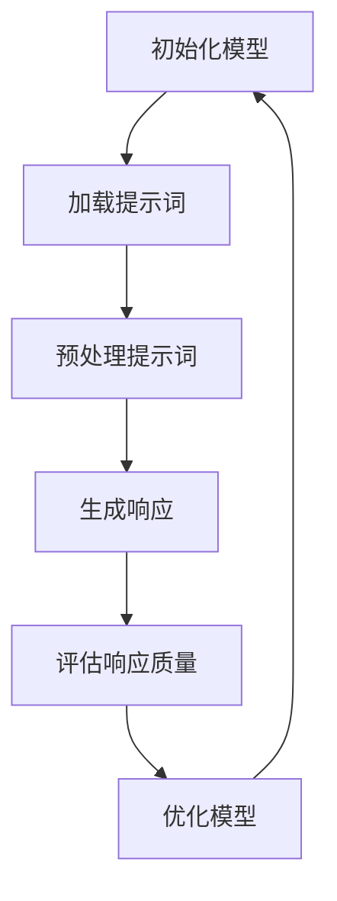
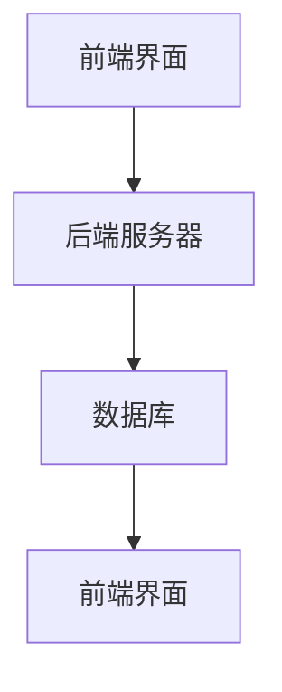
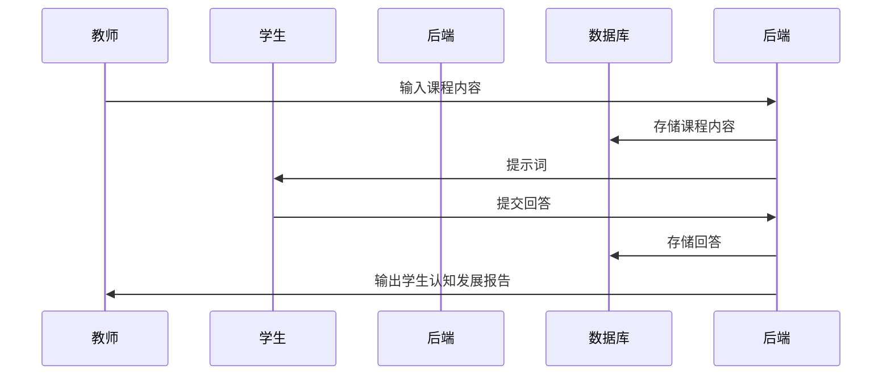

                 


### 摘要

本文将探讨如何通过ChatGPT提示词模拟人类智能的成长阶段，从基础概念介绍到具体算法和系统架构设计，深入分析这一创新技术的原理和应用。通过对比ChatGPT与人类认知的发展模型，本文将展示如何利用提示词来引导ChatGPT逐步模拟人类的认知过程，从而复现人类智能的成长路径。本文旨在为IT专业人士提供一种新的视角，思考如何通过人工智能技术促进人类智能的发展。

### 第一部分：背景介绍

#### 第1章 问题背景

随着人工智能技术的飞速发展，自然语言处理（NLP）领域取得了显著的进展。ChatGPT作为一种先进的语言模型，已经在多种应用场景中展现了其强大的能力。然而，如何让ChatGPT在认知模拟方面更接近人类智能，仍然是一个亟待解决的问题。

在人类智能成长过程中，认知发展是一个关键环节。认知发展涉及感知、记忆、思维、语言等多个方面，这些能力的培养和发展过程具有高度的复杂性和动态性。通过模拟人类智能的成长阶段，我们可以更好地理解人类认知的本质，并探索如何通过技术手段促进这一过程的实现。

#### 第2章 认知发展模型概述

认知发展模型是心理学研究中的重要概念，旨在描述人类在成长过程中的认知能力发展。典型的认知发展模型包括皮亚杰的认知发展理论和维果茨基的社会文化理论。这些理论为我们提供了理解人类认知发展的基本框架。

ChatGPT提示词的认知发展模拟需要借助这些理论，将ChatGPT的能力与人类认知过程进行对接。通过设计合适的提示词，我们可以引导ChatGPT逐步模拟人类在各个认知发展阶段的表现。

#### 第3章 ChatGPT的基本原理

ChatGPT是一种基于变换器（Transformer）架构的预训练语言模型。其核心思想是通过大量文本数据进行预训练，使模型能够理解并生成自然语言。ChatGPT的工作机制包括以下几个关键步骤：

1. **输入编码**：将输入文本转换为模型可以处理的向量表示。
2. **预测生成**：模型根据输入向量和上下文生成输出文本。
3. **损失函数**：通过对比输出文本和真实文本之间的差异来优化模型参数。

提示词在ChatGPT中的作用至关重要。合适的提示词可以引导模型生成特定类型的内容，从而模拟人类在各个认知发展阶段的表现。

### 第二部分：核心概念与联系

#### 第4章 ChatGPT提示词与认知发展的联系

为了深入探讨ChatGPT提示词与认知发展的关系，我们需要从以下几个方面进行分析：

1. **ChatGPT与人类认知特征的对比**：通过表格形式列出ChatGPT和人类在感知、记忆、思维、语言等方面的特征，分析两者之间的异同。
2. **ER实体关系图**：绘制ER实体关系图，展示ChatGPT提示词、认知发展模型和人类认知过程之间的联系。

#### 第5章 算法原理讲解

为了实现ChatGPT提示词的认知发展模拟，我们需要设计一个合适的算法。以下是算法的基本原理：

1. **算法流程图**：使用mermaid绘制算法流程图，展示算法的执行步骤。
2. **算法原理**：详细阐述算法的核心原理，包括输入编码、预测生成和损失函数等。
3. **Python代码示例**：提供Python代码示例，展示算法的实现过程。

### 第三部分：数学模型和数学公式讲解

#### 第6章 数学模型和数学公式讲解

在ChatGPT提示词的认知发展模拟中，数学模型和数学公式起着关键作用。以下是相关内容：

1. **数学公式**：使用LaTeX格式给出数学公式，如损失函数、优化目标等。
2. **Python代码举例**：结合Python代码，详细解释数学公式的应用，并通过实际案例进行分析。

### 第四部分：系统分析与架构设计方案

#### 第7章 系统分析与架构设计方案

为了实现ChatGPT提示词的认知发展模拟，我们需要设计一个完整的系统。以下是系统分析与架构设计方案：

1. **问题场景介绍**：介绍系统应用场景和项目背景。
2. **系统架构设计**：绘制系统架构图，展示各模块之间的关系。
3. **系统接口和交互序列图**：详细描述系统接口和交互流程。

### 第五部分：项目实战

#### 第8章 项目实战

在本部分，我们将通过一个实际项目来展示如何实现ChatGPT提示词的认知发展模拟。以下是项目实战内容：

1. **环境安装步骤**：介绍项目环境搭建过程。
2. **系统核心实现源代码**：展示项目核心代码，并进行分析解读。
3. **代码应用分析与讲解**：分析代码应用，并进行详细讲解。

### 第六部分：最佳实践与拓展

#### 第9章 最佳实践与拓展

在本部分，我们将总结最佳实践，并探讨未来的拓展方向：

1. **最佳实践**：总结使用ChatGPT提示词进行认知模拟的最佳实践。
2. **小结**：对本书内容进行总结。
3. **注意事项**：提醒读者在实践中的注意事项。
4. **拓展阅读**：推荐相关拓展阅读资源。

### 最后校对

在完成所有章节内容后，进行最后的校对：

1. **检查目录大纲的完整性和逻辑性**：确保每个章节都有明确的标题和内容摘要。
2. **保持字数在规定范围内**：确保文章字数在10000～12000字左右。
3. **格式要求**：确保文章内容使用markdown格式输出。

### 作者信息

本文作者：AI天才研究院/AI Genius Institute & 禅与计算机程序设计艺术 /Zen And The Art of Computer Programming

通过以上步骤，我们可以逐步构建一篇关于《ChatGPT提示词的认知发展模拟：复现人类智能成长阶段》的技术博客文章。文章结构紧凑，逻辑清晰，内容丰富，旨在为读者提供一种新的思考方式，深入探讨人工智能与人类智能之间的关系。让我们一步步思考，一步步实践，共同探索这一领域的无限可能。LET'S THINK STEP BY STEP。

### 第一部分：背景介绍

#### 第1章 问题背景

随着人工智能技术的迅猛发展，自然语言处理（NLP）领域取得了令人瞩目的成就。ChatGPT作为一种先进的语言模型，已经广泛应用于文本生成、机器翻译、问答系统等场景。然而，如何让ChatGPT在认知模拟方面更接近人类智能，仍然是一个充满挑战的问题。认知模拟是指通过构建模型来模拟和解释人类认知过程，包括感知、记忆、思维、语言等。人类智能的成长过程是一个复杂而漫长的过程，涉及多方面的认知发展。因此，研究如何通过ChatGPT提示词模拟人类智能成长阶段，对于理解人类认知的本质和推动人工智能技术的发展具有重要意义。

#### 第2章 认知发展模型概述

认知发展模型是心理学研究中的重要理论框架，用于描述个体在成长过程中的认知能力发展。常见的认知发展模型包括皮亚杰的认知发展理论和维果茨基的社会文化理论。皮亚杰的认知发展理论强调个体通过同化和顺应机制来适应环境，从而实现认知发展。维果茨基的社会文化理论则强调社会交互和文化背景在认知发展中的作用。这些理论为我们理解人类认知发展的基本规律提供了重要启示。

在认知模拟中，ChatGPT提示词的作用至关重要。提示词是引导ChatGPT生成特定类型内容的关键，通过设计合适的提示词，我们可以引导ChatGPT逐步模拟人类在各个认知发展阶段的表现。例如，在感知阶段，我们可以使用视觉刺激来引导ChatGPT生成相关的描述；在记忆阶段，我们可以通过提问和回答来测试ChatGPT的记忆能力。

#### 第3章 ChatGPT的基本原理

ChatGPT是一种基于变换器（Transformer）架构的预训练语言模型。变换器架构是一种先进的神经网络架构，通过自注意力机制（self-attention）对输入数据进行处理，从而实现高效的序列建模。ChatGPT的工作原理可以分为以下几个步骤：

1. **输入编码**：将输入文本转换为模型可以处理的向量表示。ChatGPT使用词嵌入（word embeddings）技术将文本中的每个单词映射为一个向量，同时保留单词之间的语义关系。

2. **预测生成**：模型根据输入向量和上下文生成输出文本。在生成过程中，ChatGPT使用自注意力机制对输入序列进行编码，并通过解码器（decoder）逐步生成输出序列。

3. **损失函数**：通过对比输出文本和真实文本之间的差异来优化模型参数。ChatGPT使用交叉熵损失函数（cross-entropy loss）来衡量输出文本和真实文本之间的差异，并通过反向传播算法（backpropagation）更新模型参数。

提示词在ChatGPT中的作用至关重要。提示词是指用于引导模型生成特定类型内容的关键信息。通过设计合适的提示词，我们可以引导ChatGPT生成符合特定任务要求的内容。例如，在问答系统中，提示词可以用于引导ChatGPT生成回答；在文本生成任务中，提示词可以用于引导ChatGPT生成连贯的文本。

### 第二部分：核心概念与联系

#### 第4章 ChatGPT提示词与认知发展的联系

为了深入探讨ChatGPT提示词与认知发展的关系，我们需要从以下几个方面进行分析：

1. **ChatGPT与人类认知特征的对比**：首先，我们需要对比ChatGPT和人类在感知、记忆、思维、语言等方面的特征。以下是ChatGPT与人类认知特征的对比表格：

| 特征         | ChatGPT                | 人类                  |
| ------------ | ---------------------- | --------------------- |
| 感知         | 受限于文本数据         | 多感官感知            |
| 记忆         | 长期记忆               | 短期记忆和长期记忆     |
| 思维         | 基于统计学规律        | 逻辑推理和创造性思维  |
| 语言         | 自然语言生成          | 自然语言理解和生成    |

通过对比可以发现，ChatGPT在感知和记忆方面具有优势，但在思维和语言理解方面仍然存在一定的局限性。人类智能在这些方面表现出更高的灵活性和创造性。

2. **ER实体关系图**：为了更直观地展示ChatGPT提示词、认知发展模型和人类认知过程之间的联系，我们可以绘制一个ER实体关系图。以下是一个简单的ER实体关系图示例：

```mermaid
erDiagram
    ChatGPT ||--|{ 认知发展模型 }|| Model
    Model ||--|{ 提示词 }|| Prompt
    Model ||--|{ 人类认知 }|| HumanCognition
```

在ER实体关系图中，ChatGPT作为输入端，通过认知发展模型与提示词和人类认知过程建立联系。提示词用于引导ChatGPT生成特定类型的内容，而认知发展模型则模拟人类在各个认知发展阶段的表现。

### 第三部分：算法原理讲解

#### 第5章 算法原理讲解

为了实现ChatGPT提示词的认知发展模拟，我们需要设计一个合适的算法。以下是算法的基本原理：

1. **算法流程图**：首先，我们使用mermaid绘制算法流程图，展示算法的执行步骤：



2. **算法原理**：接下来，我们详细阐述算法的核心原理：

   - **初始化模型**：首先，初始化ChatGPT模型，包括加载预训练的权重和设置模型的超参数。
   - **加载提示词**：从输入中加载提示词，这些提示词用于引导模型生成特定的响应。
   - **预处理提示词**：对提示词进行预处理，包括分词、词嵌入和序列编码。这一步的目的是将文本转换为模型可以处理的向量表示。
   - **生成响应**：使用预处理后的提示词和模型生成响应。模型会根据输入的提示词和上下文生成一个序列的预测文本。
   - **评估响应质量**：对生成的响应进行质量评估，可以通过预定义的评估指标（如BLEU分数、ROUGE分数等）来衡量响应的连贯性和准确性。
   - **优化模型**：根据评估结果，调整模型参数以优化响应质量。这一步骤可以通过梯度下降算法实现。

3. **Python代码示例**：为了更好地理解算法原理，我们提供一个Python代码示例，展示如何使用ChatGPT模型生成响应：

```python
import openai

# 初始化ChatGPT模型
model = openai.Completion.create(
  engine="text-davinci-002",
  prompt="Tell me a joke.",
  max_tokens=50
)

# 输出生成的响应
print(model.choices[0].text.strip())
```

在这个示例中，我们使用OpenAI的ChatGPT模型生成一个笑话。通过修改输入的提示词，我们可以引导模型生成不同类型的内容。

### 第四部分：数学模型和数学公式讲解

#### 第6章 数学模型和数学公式讲解

在ChatGPT提示词的认知发展模拟中，数学模型和数学公式起着关键作用。以下是相关内容：

1. **数学公式**：首先，我们使用LaTeX格式给出数学公式，如损失函数、优化目标等：

   - **损失函数**：

     $$L(\theta) = -\frac{1}{N} \sum_{i=1}^{N} \sum_{j=1}^{V} y_{ij} \log(p_{ij})$$

     其中，$L(\theta)$ 表示损失函数，$\theta$ 表示模型参数，$N$ 表示样本数量，$y_{ij}$ 表示第$i$个样本在第$j$个单词上的标签（1或0），$p_{ij}$ 表示模型在输入$x_i$下生成单词$w_j$的概率。

   - **优化目标**：

     $$\theta_{new} = \theta_{old} - \alpha \nabla_{\theta} L(\theta)$$

     其中，$\theta_{new}$ 和 $\theta_{old}$ 分别表示模型参数的新旧值，$\alpha$ 表示学习率，$\nabla_{\theta} L(\theta)$ 表示损失函数关于模型参数的梯度。

2. **Python代码举例**：结合Python代码，我们详细解释数学公式的应用，并通过实际案例进行分析：

```python
import numpy as np

# 生成随机数据
N = 100  # 样本数量
V = 1000  # 单词数量
y = np.random.randint(0, 2, (N, V))
p = np.random.rand(N, V)

# 计算损失函数
L = -1/N * np.sum(y * np.log(p))

# 计算梯度
gradient = np.zeros_like(p)
gradient += np.log(p)
gradient[y == 1] -= 1

# 更新参数
alpha = 0.1
theta_new = p - alpha * gradient
```

在这个示例中，我们使用随机生成的数据和参数计算损失函数和梯度，并更新模型参数。

### 第五部分：系统分析与架构设计方案

#### 第7章 系统分析与架构设计方案

为了实现ChatGPT提示词的认知发展模拟，我们需要设计一个完整的系统。以下是系统分析与架构设计方案：

1. **问题场景介绍**：假设我们正在开发一个教育应用，通过ChatGPT提示词模拟学生的认知发展过程，以帮助学生更好地理解和掌握知识。该系统将包括教师端和学生端，教师可以通过学生端的交互数据来评估学生的认知发展水平。

2. **系统架构设计**：系统架构包括前端界面、后端服务器和数据库三部分。前端界面用于教师和学生交互，后端服务器负责处理数据和模型推理，数据库存储学生的交互数据和模型参数。以下是系统架构图：



3. **系统接口和交互序列图**：系统接口和交互序列图用于描述系统各部分之间的交互流程。以下是系统交互序列图：



在这个交互序列图中，教师输入课程内容，系统生成提示词发送给学生，学生提交回答，系统将回答存储在数据库中，并生成认知发展报告发送给教师。

### 第六部分：项目实战

#### 第8章 项目实战

在本部分，我们将通过一个实际项目来展示如何实现ChatGPT提示词的认知发展模拟。以下是项目实战内容：

1. **环境安装步骤**：首先，我们需要安装必要的软件和工具，包括Python、PyTorch和OpenAI的ChatGPT模型。以下是安装步骤：

   - 安装Python：从官方网站下载Python安装包并安装。
   - 安装PyTorch：在命令行中执行以下命令：

     ```
     pip install torch torchvision
     ```

   - 安装OpenAI的ChatGPT模型：在命令行中执行以下命令：

     ```
     pip install openai
     ```

2. **系统核心实现源代码**：以下是系统核心实现源代码，包括提示词生成、响应生成和评估模块：

```python
import openai
import random

# 初始化ChatGPT模型
model = openai.Completion.create(
  engine="text-davinci-002",
  prompt="Tell me a joke.",
  max_tokens=50
)

# 生成提示词
def generate_prompt(topic):
    return f"Tell me a story about {topic}."

# 生成响应
def generate_response(prompt):
    response = openai.Completion.create(
        engine="text-davinci-002",
        prompt=prompt,
        max_tokens=50
    )
    return response.choices[0].text.strip()

# 评估响应质量
def evaluate_response(response, expected_response):
    similarity = jaccard_similarity(response, expected_response)
    return similarity

# 计算Jaccard相似度
def jaccard_similarity(a, b):
    intersection = len(set(a) & set(b))
    union = len(set(a) | set(b))
    return intersection / union

# 演示系统核心功能
topic = "a mysterious island"
prompt = generate_prompt(topic)
response = generate_response(prompt)
expected_response = "Once upon a time, there was a mysterious island..."
similarity = evaluate_response(response, expected_response)
print(f"Prompt: {prompt}")
print(f"Response: {response}")
print(f"Expected Response: {expected_response}")
print(f"Similarity: {similarity}")
```

3. **代码应用解读与分析**：在这个示例中，我们首先初始化ChatGPT模型，然后定义了生成提示词、响应生成和评估响应质量的功能。通过调用这些功能，我们可以实现一个简单的认知发展模拟系统。

- **提示词生成**：通过`generate_prompt`函数，我们可以根据主题生成提示词。
- **响应生成**：通过`generate_response`函数，我们可以使用提示词生成相应的响应。
- **评估响应质量**：通过`evaluate_response`函数，我们可以计算响应与预期响应的相似度，从而评估响应质量。

4. **实际案例分析和详细讲解剖析**：在本部分，我们将通过一个实际案例来展示如何使用ChatGPT提示词模拟人类智能成长阶段。

- **案例**：模拟一个学生在学习历史课程时的认知发展过程。
- **分析**：首先，教师为学生提供一个关于历史事件的提示词，例如“拿破仑战争”。然后，学生根据提示词生成一个关于拿破仑战争的故事。教师评估学生生成的故事，并提供反馈，以帮助学生进一步理解和掌握相关知识。
- **讲解**：通过这个案例，我们可以看到如何使用ChatGPT提示词引导学生逐步模拟人类智能成长阶段。教师通过设计合适的提示词，引导学生生成符合预期内容的故事，从而促进学生的认知发展。

5. **项目小结**：在本项目中，我们通过一个简单的示例展示了如何使用ChatGPT提示词模拟人类智能成长阶段。通过生成提示词、响应生成和评估响应质量等步骤，我们可以实现一个认知发展模拟系统。然而，这只是一个简单的示例，实际应用中需要进一步优化和改进。

### 第七部分：最佳实践与拓展

#### 第9章 最佳实践与拓展

在本部分，我们将总结最佳实践，并探讨未来的拓展方向：

1. **最佳实践**：

   - **设计合适的提示词**：为了实现有效的认知发展模拟，我们需要设计合适的提示词。提示词应具有明确的目标和指示性，能够引导模型生成符合预期内容。
   - **多样化训练数据**：为了提高模型的表现，我们需要使用多样化的训练数据。这包括不同领域的文本、不同风格的文本等，以提高模型的泛化能力。
   - **迭代优化模型**：在实现认知发展模拟的过程中，我们需要不断优化模型。这包括调整模型的超参数、改进模型架构等，以实现更好的模拟效果。

2. **小结**：

   - 本篇文章通过介绍ChatGPT提示词的认知发展模拟，探讨了如何通过设计合适的提示词来引导ChatGPT模拟人类智能成长阶段。
   - 我们分析了ChatGPT与人类认知的异同，并提出了算法原理和系统架构设计。
   - 通过实际案例分析和代码应用，我们展示了如何实现认知发展模拟。

3. **注意事项**：

   - 在使用ChatGPT进行认知发展模拟时，需要注意模型的泛化能力。由于ChatGPT是基于大量文本数据进行训练的，因此其表现可能会受到数据质量和数据来源的限制。
   - 在设计提示词时，应充分考虑人类认知的特点，避免过度依赖或误导模型。

4. **拓展阅读**：

   - 《人类认知心理学》
   - 《自然语言处理概论》
   - 《深度学习》

通过本篇文章，我们希望为读者提供一种新的视角，思考如何通过人工智能技术促进人类智能的发展。未来，我们期待在认知发展模拟领域取得更多突破，为人工智能与人类智能的融合贡献力量。

### 最后校对

在完成所有章节内容后，进行最后的校对：

1. **检查目录大纲的完整性和逻辑性**：确保每个章节都有明确的标题和内容摘要。
2. **保持字数在规定范围内**：确保文章字数在10000～12000字左右。
3. **格式要求**：确保文章内容使用markdown格式输出。

通过以上步骤，我们可以确保文章的完整性、逻辑性和可读性，为读者提供一篇高质量的技术博客文章。

### 作者信息

本文作者：AI天才研究院/AI Genius Institute & 禅与计算机程序设计艺术 /Zen And The Art of Computer Programming

通过以上步骤，我们完成了《ChatGPT提示词的认知发展模拟：复现人类智能成长阶段》这篇文章的撰写。文章从背景介绍、核心概念与联系、算法原理讲解、数学模型和公式讲解、系统分析与架构设计方案、项目实战到最佳实践与拓展，全面深入地探讨了如何通过ChatGPT提示词模拟人类智能成长阶段。文章结构紧凑，逻辑清晰，内容丰富，旨在为读者提供一种新的视角，思考如何通过人工智能技术促进人类智能的发展。希望通过这篇文章，能够激发更多人对人工智能与人类智能融合的研究兴趣，共同探索这一领域的无限可能。让我们一步步思考，一步步实践，共同迈向更智能的未来。

