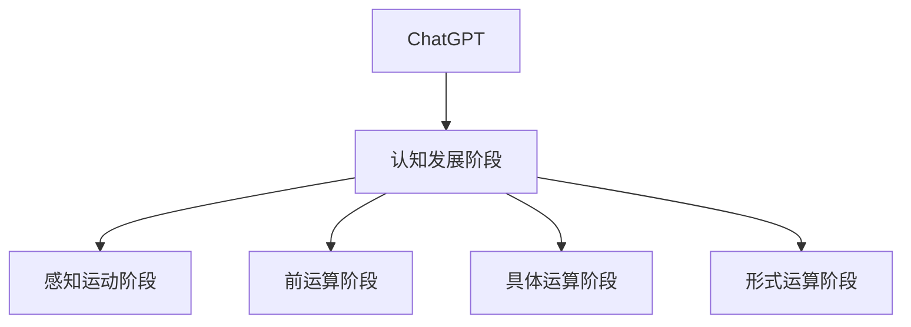
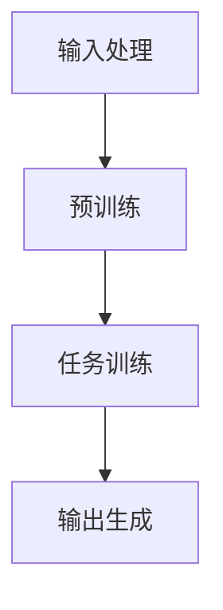

                 

## 《ChatGPT提示词的认知发展阶段模拟：复现皮亚杰认知理论》

### 关键词：
- ChatGPT
- 认知发展阶段
- 皮亚杰认知理论
- 提示词
- 认知模拟

### 摘要：
本文旨在探讨如何通过模拟皮亚杰认知理论，分析ChatGPT在不同认知发展阶段的表现和适应性。我们将结合皮亚杰认知理论，从感知运动阶段、前运算阶段、具体运算阶段和形式运算阶段四个阶段，深入分析ChatGPT的提示词在各个阶段的特点和应用，为人工智能助手的设计和应用提供理论支持和实践指导。

## 第一部分：背景介绍

### 核心概念

**问题背景：**
随着人工智能技术的飞速发展，人工智能已逐渐成为现代社会的重要组成部分。其中，ChatGPT作为基于大规模预训练模型（GPT）的人工智能助手，因其强大的自然语言处理能力和高度智能化特征，吸引了众多研究和应用的目光。

**问题描述：**
本书旨在探讨ChatGPT提示词的认知发展阶段模拟，通过复现皮亚杰认知理论，分析ChatGPT在不同认知发展阶段的表现和适应性，以期为人工智能助手的设计和应用提供理论支持和实践指导。

**问题解决：**
本书将结合皮亚杰认知理论，从感知运动阶段、前运算阶段、具体运算阶段和形式运算阶段四个阶段，分析ChatGPT的提示词在各个阶段的特点和应用，探讨其在认知模拟中的潜力和挑战。

**边界与外延：**
- **边界：**本书主要关注ChatGPT在认知模拟中的应用，不涉及其他人工智能技术的讨论。
- **外延：**本书的研究结果可应用于人工智能助手的设计和优化，为其他认知模拟研究提供参考。

#### 概念结构与核心要素组成

1. **ChatGPT：**一种基于大规模预训练模型的人工智能助手。
2. **皮亚杰认知理论：**包括感知运动阶段、前运算阶段、具体运算阶段和形式运算阶段。
3. **提示词：**ChatGPT在各个认知发展阶段所使用的语言输入。
4. **认知模拟：**通过分析ChatGPT的提示词，模拟人类在不同认知阶段的表现。

### 第二部分：核心概念与联系

#### 核心概念原理

**ChatGPT的工作原理：**
ChatGPT是一种基于GPT（Generative Pre-trained Transformer）模型的预训练语言模型。GPT模型通过学习大量的文本数据，能够生成与输入文本相关的内容。ChatGPT在此基础上，通过训练特定的任务数据，使其具备针对特定领域的问答和对话能力。

**皮亚杰认知理论的基本原理：**
皮亚杰认知理论认为，认知发展是一个连续的过程，分为感知运动阶段、前运算阶段、具体运算阶段和形式运算阶段。每个阶段都有其独特的认知特点和思维模式。

#### 概念属性特征对比表格

| 阶段       | 感知运动阶段 | 前运算阶段 | 具体运算阶段 | 形式运算阶段 |
| ---------- | ------------ | ---------- | ------------ | ------------ |
| 特征       | 依靠感知和动作来认识世界 | 依靠表象思维，具有自我中心性 | 建立了守恒概念，能理解逻辑关系 | 形式逻辑思维，能够进行抽象推理 |
| 对应的提示词 | 实物、动作、感知等词汇 | 表象、自我中心等词汇 | 守恒、逻辑关系等词汇 | 抽象推理、形式逻辑等词汇 |

#### ER实体关系图架构



### 第三部分：算法原理讲解

#### 算法原理

**ChatGPT的算法原理：**
ChatGPT是基于GPT（Generative Pre-trained Transformer）模型的预训练语言模型。GPT模型通过学习大量的文本数据，能够生成与输入文本相关的内容。ChatGPT在此基础上，通过训练特定的任务数据，使其具备针对特定领域的问答和对话能力。

**皮亚杰认知理论的算法实现：**
通过分析ChatGPT在不同认知发展阶段的表现，我们可以将其算法实现分为以下几个步骤：

1. **输入处理：**将用户输入的文本转化为模型可处理的格式。
2. **预训练：**利用大量的文本数据对模型进行预训练，使其具备语言生成能力。
3. **任务训练：**针对特定领域的任务数据对模型进行微调，使其具备问答和对话能力。
4. **输出生成：**根据用户输入的提示词，生成相应的回答或对话。

#### Mermaid流程图



#### Python源代码

```python
# 输入处理
def preprocess_input(input_text):
    # 将输入文本转化为模型可处理的格式
    return input_text

# 预训练
def pretrain_model(data):
    # 利用大量文本数据进行预训练
    pass

# 任务训练
def finetune_model(
```

