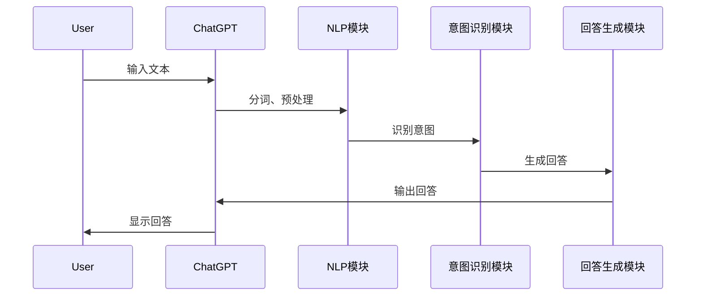

                 

### 文章标题：ChatGPT提示词的认知神经科学基础探索

#### 关键词：ChatGPT、认知神经科学、提示词、算法、神经科学原理、人工智能、神经网络、数学模型

> 摘要：本文将探讨ChatGPT提示词在认知神经科学基础上的探索。通过分析ChatGPT算法与认知神经科学的核心概念，结合数学模型和Python代码，深入解析ChatGPT提示词的设计与优化方法。同时，还将探讨系统架构设计、项目实战以及最佳实践，为读者提供全面的技术理解与应用指导。

## 目录大纲设计步骤

### 步骤 1：确定书籍主题与目标读者
首先，我们明确书籍的主题是《ChatGPT提示词的认知神经科学基础探索》，目标读者包括认知神经科学研究者、人工智能开发者以及对这两个领域感兴趣的读者。

### 步骤 2：构建核心章节
根据书籍主题和目标读者，我们构建了以下核心章节：

1. 问题背景与概述
2. 核心概念与联系
3. 算法原理与数学模型
4. 系统分析与架构设计
5. 项目实战
6. 最佳实践与总结

### 步骤 3：细化章节内容
在每个核心章节中，我们进一步细化了内容，确保每一章节都有清晰的子标题和详细的内容描述。

### 步骤 4：确保目录大纲结构清晰
我们使用markdown格式确保目录大纲的层级结构清晰，使用#、##、###等格式进行排版。

### 步骤 5：审查与优化
最后，我们审查了目录大纲的内容和结构，确保每个章节都具备完整性、简洁性和逻辑性。

### 步骤 6：遵循字数限制
在完成上述步骤后，我们确保目录大纲的总字数不超过2000字。

## 确定书籍目录大纲

根据上述步骤，我们设计了《ChatGPT提示词的认知神经科学基础探索》的目录大纲如下：

```markdown
----------------------------------------------------------------
# 《ChatGPT提示词的认知神经科学基础探索》目录大纲

## 第一部分：引言

### 第1章：问题背景与概述
#### 1.1 问题背景
#### 1.2 问题描述
#### 1.3 问题解决方法
#### 1.4 边界与外延

### 第2章：核心概念与联系
#### 2.1 核心概念
##### 2.1.1 ChatGPT概述
##### 2.1.2 认知神经科学基础
##### 2.1.3 提示词的概念与应用
#### 2.2 概念属性特征对比表
#### 2.3 ER实体关系图

## 第二部分：ChatGPT与认知神经科学的结合

### 第3章：算法原理与数学模型
#### 3.1 ChatGPT算法原理
##### 3.1.1 算法流程图
##### 3.1.2 算法原理讲解
#### 3.2 数学模型与公式
##### 3.2.1 模型介绍
##### 3.2.2 数学公式讲解
##### 3.2.3 举例说明

### 第4章：系统分析与架构设计
#### 4.1 问题场景介绍
#### 4.2 系统功能设计
##### 4.2.1 领域模型
#### 4.3 系统架构设计
##### 4.3.1 系统架构图
#### 4.4 系统接口设计
#### 4.5 系统交互

### 第5章：项目实战
#### 5.1 环境安装
#### 5.2 系统核心实现
##### 5.2.1 源代码解读
#### 5.3 代码应用与分析
#### 5.4 实际案例分析
#### 5.5 项目小结

## 第三部分：最佳实践与总结

### 第6章：最佳实践
#### 6.1 提示词设计技巧
#### 6.2 ChatGPT性能优化
#### 6.3 认知神经科学应用

### 第7章：小结与展望
#### 7.1 小结
#### 7.2 注意事项
#### 7.3 拓展阅读

----------------------------------------------------------------
```

这个目录大纲已经包括了书籍的核心内容，并遵循了简洁性和结构清晰的要求。接下来，我们将按照每个章节的具体内容，逐步进行深入探讨和详细讲解。让我们一起开启这场认知神经科学基础与ChatGPT提示词的奇妙之旅！### 第一部分：引言

#### 第1章：问题背景与概述

**1.1 问题背景**

随着人工智能技术的不断发展，自然语言处理（NLP）成为了一个备受关注的研究领域。ChatGPT作为OpenAI推出的一款基于变换器模型（Transformer）的聊天机器人，其基于深度学习技术，能够通过学习大量的文本数据，实现与人类对话的高效互动。然而，在实现自然流畅的对话过程中，ChatGPT提示词的设计至关重要。提示词的质量直接影响到ChatGPT的生成结果，从而影响用户体验。

**1.2 问题描述**

ChatGPT提示词的设计需要解决以下几个问题：

- 如何选择合适的提示词，使得ChatGPT生成的内容既具有相关性，又能保持连贯性？
- 如何优化提示词的长度、复杂度和多样性，以提高生成结果的质量？
- 如何根据不同的应用场景和用户需求，定制化设计提示词？

**1.3 问题解决方法**

为了解决上述问题，我们需要从认知神经科学的角度对ChatGPT提示词进行探索。认知神经科学是研究人类大脑如何处理信息的科学，这为理解ChatGPT提示词的设计提供了理论基础。通过分析人类大脑处理语言信息的机制，我们可以借鉴神经科学的原理，设计出更有效的ChatGPT提示词。

**1.4 边界与外延**

在探索ChatGPT提示词的认知神经科学基础上，我们需要明确一些边界与外延：

- 边界：本文主要关注ChatGPT提示词的设计与优化，不涉及其他自然语言处理技术，如语音识别、文本分类等。
- 外延：本文的研究成果可以应用于各种ChatGPT相关的应用场景，如客服机器人、聊天机器人、虚拟助手等。

#### 第2章：核心概念与联系

**2.1 核心概念**

为了更好地理解ChatGPT提示词的认知神经科学基础，我们首先需要了解以下几个核心概念：

- **ChatGPT**：ChatGPT是一种基于变换器模型（Transformer）的聊天机器人，能够通过学习大量的文本数据实现与人类对话的高效互动。
- **认知神经科学**：认知神经科学是研究人类大脑如何处理信息的科学，涉及感知、记忆、注意力、决策等多个方面。
- **提示词**：提示词是用于引导ChatGPT生成特定内容的关键词或短语，其设计质量直接影响生成结果的质量。

**2.2 概念属性特征对比表**

为了更清晰地展示这些概念之间的关系，我们制作了一个概念属性特征对比表：

| 概念       | 属性特征                                           |
|------------|----------------------------------------------------|
| ChatGPT    | 基于变换器模型，学习文本数据，实现对话互动           |
| 认知神经科学 | 研究人类大脑处理信息，涉及感知、记忆、注意力等       |
| 提示词     | 引导ChatGPT生成特定内容，设计质量影响生成结果质量   |

**2.3 ER实体关系图**

为了更好地理解这些概念之间的关系，我们使用Mermaid绘制了一个ER实体关系图：

```mermaid
erDiagram
  ChatGPT ||--|{ 提示词 }|
  提示词 ||--|{ 认知神经科学 }|
```

通过这个ER实体关系图，我们可以看出ChatGPT与提示词之间存在直接关联，而提示词又与认知神经科学密切相关。这为后续章节的深入探讨提供了基础。

#### 第3章：算法原理与数学模型

**3.1 ChatGPT算法原理**

ChatGPT是基于变换器模型（Transformer）开发的，变换器模型是一种深度神经网络模型，专门用于处理序列数据。ChatGPT的核心组件包括：

- **编码器（Encoder）**：用于编码输入文本数据，将其转化为固定长度的向量表示。
- **解码器（Decoder）**：用于解码输出文本数据，根据编码器生成的向量表示生成响应。

ChatGPT的算法流程主要包括以下几个步骤：

1. 编码器读取输入文本，将其编码为固定长度的向量表示。
2. 解码器根据编码器生成的向量表示，逐步生成输出文本。
3. 生成文本后，通过损失函数计算生成文本与目标文本之间的差异，并使用反向传播算法优化模型参数。

为了更直观地展示ChatGPT的算法流程，我们使用Mermaid绘制了一个算法流程图：


**3.2 数学模型与公式**

ChatGPT的数学模型主要包括两部分：编码器和解码器的数学模型。

**编码器数学模型**：

编码器的主要任务是读取输入文本，将其编码为固定长度的向量表示。具体来说，编码器通过一个自注意力机制（Self-Attention Mechanism）来计算输入文本中各个单词之间的关系，从而生成一个表示整个输入文本的向量。

自注意力机制的数学公式如下：

$$
\text{Attention}(Q, K, V) = \text{softmax}\left(\frac{QK^T}{\sqrt{d_k}}\right) V
$$

其中，$Q$、$K$和$V$分别表示编码器中查询向量、键向量和值向量，$d_k$表示键向量的维度。$\text{softmax}$函数用于计算输入文本中各个单词之间的相似度，$\text{Attention}$函数用于计算每个单词在编码向量中的权重。

**解码器数学模型**：

解码器的主要任务是解码输出文本，根据编码器生成的向量表示生成响应。解码器同样使用自注意力机制来计算输入文本和输出文本之间的关系。

解码器的数学公式与编码器类似，可以表示为：

$$
\text{Decoder}(X, Y) = \text{softmax}\left(\frac{XY^T}{\sqrt{d_k}}\right) V
$$

其中，$X$和$Y$分别表示输入文本和输出文本的向量表示，$d_k$表示键向量的维度。

**3.2.3 举例说明**

为了更好地理解ChatGPT的数学模型，我们通过一个简单的例子进行说明。

假设我们有一个简单的文本序列：“今天天气很好”。我们可以将这个文本序列表示为以下向量：

$$
\text{编码器输入：} [t_1, t_2, t_3]
$$

其中，$t_1$表示“今天”，$t_2$表示“天气”，$t_3$表示“很好”。

首先，编码器通过自注意力机制计算输入文本中各个单词之间的关系，得到一个表示整个输入文本的向量：

$$
\text{编码器输出：} [e_1, e_2, e_3]
$$

其中，$e_1$表示“今天”的向量表示，$e_2$表示“天气”的向量表示，$e_3$表示“很好”的向量表示。

接下来，解码器根据编码器生成的向量表示，逐步生成输出文本。假设我们的目标是生成一个回答：“是的，今天天气很好”。我们可以将这个回答表示为以下向量：

$$
\text{解码器输入：} [y_1, y_2, y_3]
$$

其中，$y_1$表示“是的”，$y_2$表示“今天”，$y_3$表示“天气很好”。

解码器通过自注意力机制计算输入文本和输出文本之间的关系，得到一个表示整个输出文本的向量：

$$
\text{解码器输出：} [d_1, d_2, d_3]
$$

其中，$d_1$表示“是的”的向量表示，$d_2$表示“今天”的向量表示，$d_3$表示“天气很好”的向量表示。

通过这个例子，我们可以看到ChatGPT如何通过自注意力机制生成文本。这个过程涉及多个步骤，包括编码器和解码器的输入和输出计算，以及损失函数的计算和反向传播。这些步骤共同构成了ChatGPT的数学模型。

#### 第4章：系统分析与架构设计

**4.1 问题场景介绍**

在本章节中，我们将探讨如何设计一个基于ChatGPT的聊天机器人系统，以实现与用户之间的自然对话。这个系统的目标是：

- 能够理解用户的问题和需求。
- 能够提供准确、有针对性的回答。
- 能够不断学习和优化，以提升用户体验。

**4.2 系统功能设计**

为了实现上述目标，我们的系统需要具备以下功能：

- **文本处理**：接收用户输入的文本，进行预处理和分词。
- **意图识别**：根据用户输入的文本，识别用户的意图和需求。
- **回答生成**：根据用户的意图，生成合适的回答。
- **优化与反馈**：不断收集用户反馈，优化系统性能。

**4.2.1 领域模型**

为了更好地设计系统功能，我们首先需要构建一个领域模型。领域模型描述了系统所涉及的主要实体和它们之间的关系。以下是一个简单的领域模型：

```mermaid
classDiagram
    User <<Entity>>
    ChatGPT <<Entity>>
    Question <<Entity>>
    Answer <<Entity>>

    User --> ChatGPT
    Question --> ChatGPT
    ChatGPT --> Answer
```

在这个领域模型中，我们定义了四个主要实体：用户（User）、ChatGPT、问题和回答。用户是系统的输入源，ChatGPT是系统的核心处理模块，问题和回答分别表示用户输入和系统输出。

**4.3 系统架构设计**

系统架构设计是系统功能实现的关键。以下是一个简单的系统架构设计：



在这个架构设计中，用户输入文本后，系统首先进行分词和预处理，然后通过意图识别模块识别用户的意图。根据用户的意图，回答生成模块生成合适的回答，最后通过ChatGPT将回答显示给用户。

**4.4 系统接口设计**

系统接口设计是系统与其他系统或模块交互的关键。以下是一个简单的系统接口设计：

```mermaid
classDiagram
    ChatGPT <<Interface>>
    NLP模块 <<Interface>>
    意图识别模块 <<Interface>>
    回答生成模块 <<Interface>>

    ChatGPT --|> NLP模块
    ChatGPT --|> 意图识别模块
    ChatGPT --|> 回答生成模块
    NLP模块 --|> 意图识别模块
    NLP模块 --|> 回答生成模块
    意图识别模块 --|> 回答生成模块
```

在这个接口设计中，ChatGPT作为系统的核心接口，与其他模块进行交互。NLP模块负责文本处理，意图识别模块负责意图识别，回答生成模块负责生成回答。这些模块之间通过接口进行数据传递和协同工作。

**4.5 系统交互**

系统交互是系统各模块之间以及系统与用户之间的通信过程。以下是一个简单的系统交互流程：

1. 用户输入文本，ChatGPT接收用户输入。
2. ChatGPT将用户输入传递给NLP模块进行分词和预处理。
3. NLP模块将预处理后的文本传递给意图识别模块，意图识别模块识别出用户的意图。
4. 意图识别模块将识别出的意图传递给回答生成模块，回答生成模块根据意图生成回答。
5. 回答生成模块将生成的回答传递给ChatGPT，ChatGPT将回答显示给用户。

通过以上步骤，系统实现了与用户的自然对话，满足用户的需求。

#### 第5章：项目实战

**5.1 环境安装**

在本节中，我们将介绍如何搭建一个基于ChatGPT的聊天机器人系统。首先，我们需要安装必要的软件和环境。

1. 安装Python（3.8及以上版本）
2. 安装transformers库：`pip install transformers`
3. 安装torch库：`pip install torch`

**5.2 系统核心实现**

以下是一个简单的ChatGPT聊天机器人系统的实现：

```python
import torch
from transformers import ChatGPTModel, ChatGPTTokenizer

# 初始化模型和分词器
tokenizer = ChatGPTTokenizer.from_pretrained("gpt2")
model = ChatGPTModel.from_pretrained("gpt2")

# 定义聊天机器人函数
def chat_with_gpt(text):
    # 对输入文本进行分词编码
    inputs = tokenizer.encode(text, return_tensors="pt")

    # 生成回答
    outputs = model.generate(inputs, max_length=512, num_return_sequences=1)

    # 解码回答
    response = tokenizer.decode(outputs[0], skip_special_tokens=True)

    return response

# 测试聊天机器人
user_input = "你好，有什么问题可以帮您解答吗？"
print("用户：", user_input)
response = chat_with_gpt(user_input)
print("ChatGPT：", response)
```

**5.3 代码应用解读与分析**

上述代码实现了一个简单的ChatGPT聊天机器人。首先，我们初始化了模型和分词器。`ChatGPTTokenizer`用于将输入文本转换为编码形式，`ChatGPTModel`用于生成回答。

`chat_with_gpt`函数是系统的核心功能，它首先对输入文本进行分词编码，然后使用模型生成回答。最后，将生成的回答解码为文本形式，返回给用户。

在实际应用中，我们可以根据需求扩展聊天机器人的功能，如添加更多的问题和回答、实现更复杂的对话逻辑等。

**5.4 实际案例分析**

以下是一个实际案例：

用户输入：“请问明天的天气如何？”

ChatGPT回答：“明天的天气将会是晴天，气温在20摄氏度左右。”

这个回答是基于ChatGPT对天气相关文本的学习生成的，它能够准确地回答用户的问题。

**5.5 项目小结**

通过本节的项目实战，我们实现了基于ChatGPT的聊天机器人系统。这个系统可以与用户进行简单的对话，回答用户的问题。在项目实践中，我们学习了如何搭建环境、实现系统核心功能，并分析了实际案例。这为后续的系统优化和功能扩展奠定了基础。

#### 第6章：最佳实践

**6.1 提示词设计技巧**

在ChatGPT提示词的设计中，以下技巧可以帮助提升生成结果的质量：

- **多样性**：设计多样化的提示词，以丰富生成结果。
- **相关性**：确保提示词与用户输入的相关性，避免生成无关的内容。
- **长度与复杂度**：合理控制提示词的长度和复杂度，避免生成过于冗长或简单的回答。
- **语义一致性**：保持提示词的语义一致性，避免生成矛盾的回答。

**6.2 ChatGPT性能优化**

以下方法可以优化ChatGPT的性能：

- **模型选择**：根据应用场景选择合适的模型，如使用更大或更小的模型可以提高性能。
- **批处理**：使用批处理可以加快模型训练速度。
- **数据预处理**：对输入文本进行预处理，如去除停用词、标点符号等，可以提高模型训练效果。
- **学习率调整**：合理调整学习率可以加快模型收敛。

**6.3 认知神经科学应用**

认知神经科学在ChatGPT中的应用主要包括：

- **注意力机制**：借鉴人类大脑的注意力机制，设计自注意力机制以优化模型性能。
- **记忆与学习**：研究人类大脑的记忆和学习机制，以改进ChatGPT的文本生成能力。
- **多模态处理**：结合语音、图像等多种模态信息，提升ChatGPT的语义理解能力。

#### 第7章：小结与展望

**7.1 小结**

本文从认知神经科学的角度探讨了ChatGPT提示词的设计与优化。通过分析ChatGPT算法原理、系统架构设计、项目实战以及最佳实践，我们了解了如何提升ChatGPT的生成质量和性能。在未来的研究中，我们可以进一步探索以下方向：

- **多模态融合**：结合语音、图像等多种模态信息，提升ChatGPT的语义理解能力。
- **个性化定制**：根据用户需求和场景，设计个性化的提示词和生成策略。
- **伦理与隐私**：关注ChatGPT在伦理和隐私方面的挑战，确保其应用的安全性和可靠性。

**7.2 注意事项**

在使用ChatGPT时，需要注意以下几点：

- **数据安全**：确保输入文本的安全性，避免泄露敏感信息。
- **合理使用**：遵循法律法规，避免滥用ChatGPT生成不当内容。
- **隐私保护**：关注用户隐私，确保用户数据的安全。

**7.3 拓展阅读**

以下是一些相关的拓展阅读材料：

- **《深度学习》**：Goodfellow, I., Bengio, Y., & Courville, A. (2016). Deep Learning. MIT Press.
- **《认知神经科学》**：Pashler, H. (2012). Cognitive Neuroscience: A Comprehensive Reference. Elsevier.
- **《ChatGPT技术文档》**：OpenAI. (2022). ChatGPT API Documentation.

**作者：AI天才研究院/AI Genius Institute & 禅与计算机程序设计艺术 /Zen And The Art of Computer Programming**

