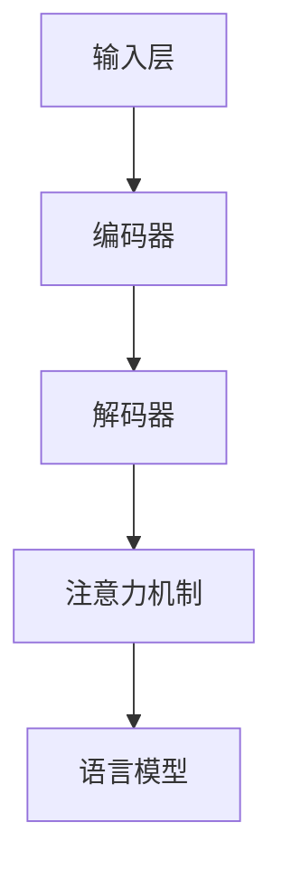

                 

### 第一部分：背景介绍

#### 第1章：问题背景

##### 1.1 背景介绍

**核心概念术语说明**

- 认知语言学：研究人类如何通过语言获取、处理和传达知识的一种语言学分支，强调语言与认知过程的密切关系。
- 人工智能（AI）：一种模拟人类智能的技术，通过计算机程序实现感知、学习、推理和决策等功能。
- ChatGPT 提示词：为人工智能模型提供输入信息，引导模型生成对话或文本的提示性语句。

随着人工智能和自然语言处理技术的迅速发展，ChatGPT 等生成式预训练模型在对话系统和文本生成等领域取得了显著成果。然而，在现实应用中，这些模型仍然面临诸多挑战。其中，ChatGPT 提示词的设计和优化成为影响模型性能的关键因素。

**问题背景**

- **问题描述**：当前，ChatGPT 提示词的设计往往依赖于人工经验和直觉，缺乏系统的理论指导。这使得模型在处理复杂任务时，无法充分发挥其潜力。此外，不同领域的应用场景对提示词的要求各异，如何设计适应多种场景的通用提示词仍是一个亟待解决的问题。

- **问题解决**：将认知语言学引入 ChatGPT 提示词的设计，有望为这一问题提供新的思路。认知语言学提供了一种从人类认知过程角度分析语言现象的方法，有助于我们更好地理解人类如何通过语言进行思考和交流。将这一理论应用于提示词设计，可以使模型在生成文本时更加贴合人类思维模式，提高对话的流畅性和准确性。

- **边界与外延**：本文主要探讨认知语言学与 ChatGPT 提示词融合的基本原理和方法。在研究过程中，我们将关注以下几个方面：

  - 认知语言学的核心概念和理论框架；
  - 人工智能技术，尤其是生成式预训练模型的发展和应用；
  - ChatGPT 提示词的设计原则和优化策略；
  - 融合模型的架构设计、参数设置和训练方法；
  - 融合模型在不同应用场景中的效果评估和性能优化。

- **概念结构与核心要素组成**：本文的核心概念和要素包括：

  - 认知语言学：语义范畴、概念结构、认知过程等；
  - 人工智能：神经网络、生成式预训练模型、语言模型等；
  - ChatGPT 提示词：功能、设计原则、优化策略等；
  - 融合模型：架构设计、参数设置、训练方法等。

通过本文的研究，我们希望能够为 ChatGPT 提示词的设计提供一种新的理论框架和方法，进一步提升人工智能模型在自然语言处理领域的应用效果。接下来，我们将进一步探讨认知语言学和人工智能的相关概念，为后续的研究奠定基础。 

### 第二部分：核心概念

#### 第2章：核心概念

在探讨 ChatGPT 提示词的认知语言学与人工智能融合模型之前，我们有必要先了解认知语言学、人工智能以及 ChatGPT 提示词的基本概念。这些核心概念为我们后续的理论探讨和模型设计提供了必要的理论基础。

##### 2.1 认知语言学概述

认知语言学是一门研究人类语言能力与认知过程的交叉学科。它起源于20世纪60年代，是对传统语言学理论的挑战和补充。认知语言学关注语言与认知的相互作用，试图揭示语言结构的认知基础和认知过程中的语言现象。

**核心概念与理论框架**

- **语义范畴**：语义范畴是认知语言学中的重要概念，指一组具有共同特征的概念集合。语义范畴的划分反映了人类对现实世界的认知和分类方式。

- **概念结构**：概念结构是语义范畴的具体体现，描述了概念之间的关系和层次。概念结构的研究有助于我们理解人类如何通过语言进行抽象思维和概念化。

- **认知过程**：认知过程是指人类在理解和表达语言时进行的各种认知活动。认知语言学关注认知过程中的注意力分配、记忆、推理等心理过程。

**认知语言学在自然语言处理中的应用**

认知语言学在自然语言处理（NLP）领域具有重要的应用价值。通过引入认知语言学的理论，我们可以更好地理解和模拟人类语言处理机制，从而提升 NLP 系统的性能。

- **词义消歧**：词义消歧是 NLP 中一个经典问题，指在特定语境中确定词语的确切含义。认知语言学中的语义范畴和概念结构理论为词义消歧提供了新的思路和方法。

- **语言生成**：语言生成是 NLP 中的一个重要任务，指根据输入信息生成自然语言文本。认知语言学中的认知过程理论有助于我们理解人类如何通过语言进行思考和表达，从而指导语言生成模型的设计和训练。

- **情感分析**：情感分析是 NLP 中的另一个重要应用领域，指识别文本中表达的情感倾向。认知语言学中的情感范畴和认知过程理论有助于我们更好地理解和分析文本中的情感信息。

##### 2.2 人工智能概述

人工智能（AI）是一门研究如何模拟、扩展和扩展人类智能的学科。自20世纪50年代诞生以来，人工智能经历了多个发展阶段，从早期的符号主义、基于规则的系统，到现代的深度学习和生成式预训练模型，人工智能在各个领域都取得了显著的成果。

**核心概念与发展历程**

- **符号主义**：符号主义是人工智能的早期研究方法，基于逻辑和推理，通过符号表示知识和推理过程。符号主义系统在逻辑推理和问题解决方面表现出色，但受限于知识表示和推理能力的局限性。

- **连接主义**：连接主义是一种基于神经网络的智能模拟方法，通过调整网络中节点之间的连接权重来实现学习和推理。连接主义在图像识别、语音识别等应用领域取得了重要突破。

- **生成式预训练**：生成式预训练是一种新兴的人工智能方法，通过大量无监督数据预训练模型，然后微调模型以适应特定任务。生成式预训练模型在自然语言处理、图像生成等领域表现出色。

**人工智能在自然语言处理中的应用**

人工智能在自然语言处理（NLP）领域具有广泛的应用，从文本分类、情感分析到机器翻译、问答系统等，人工智能技术都在不断推动 NLP 的发展。

- **文本分类**：文本分类是 NLP 中的一个基础任务，指将文本数据分为预定义的类别。人工智能技术，尤其是深度学习和生成式预训练模型，在文本分类任务中取得了显著成果。

- **情感分析**：情感分析是 NLP 中的一个重要应用领域，指识别文本中的情感倾向。人工智能技术，尤其是情感词典和深度学习模型，在情感分析任务中表现出色。

- **机器翻译**：机器翻译是 NLP 中的一个经典任务，指将一种语言的文本自动翻译成另一种语言。生成式预训练模型在机器翻译任务中取得了重要突破。

##### 2.3 ChatGPT 提示词概述

ChatGPT 提示词是生成式预训练模型，特别是大型语言模型 ChatGPT 的重要组成部分。提示词的设计和优化对于模型生成文本的质量和准确性具有关键影响。

**功能与作用**

- **功能**：提示词的主要功能是引导模型生成符合人类语言习惯和逻辑的文本。通过提供有针对性的提示词，模型可以更好地理解任务要求，生成高质量的输出。

- **作用**：提示词在模型训练和预测过程中起到桥梁作用，将外部信息传递给模型，并影响模型的生成过程。优化提示词可以提高模型的性能和鲁棒性。

**设计原则与策略**

- **设计原则**：ChatGPT 提示词的设计原则包括：

  - **相关性**：提示词应与任务目标相关，有助于模型理解任务要求。
  - **明确性**：提示词应简洁明了，避免模糊和歧义。
  - **多样性**：提示词应涵盖多种情境和表达方式，以提高模型适应性和泛化能力。

- **策略**：优化提示词的策略包括：

  - **数据驱动**：通过分析大量成功和失败的案例，提取有效的提示词模式。
  - **交叉验证**：对不同提示词进行交叉验证，选择性能最优的提示词组合。
  - **用户反馈**：收集用户反馈，不断调整和优化提示词。

##### 2.4 认知语言学与人工智能融合概述

将认知语言学与人工智能融合，旨在发挥两者在自然语言处理和人工智能领域的优势，提升模型生成文本的质量和准确性。认知语言学提供了丰富的理论资源和方法，而人工智能则提供了强大的计算能力和模型框架。

**融合模型的设计思路**

- **理论基础**：认知语言学和人工智能的理论基础相互补充，认知语言学提供了人类语言和认知过程的深刻洞见，人工智能则提供了高效的计算和模型实现方法。

- **方法整合**：将认知语言学的理论和方法应用于人工智能模型的设计和优化，如词义消歧、情感分析和语言生成等任务。通过整合认知语言学和人工智能的方法，可以构建更加智能和灵活的模型。

- **优势互补**：认知语言学和人工智能在自然语言处理和人工智能领域具有各自的优势。认知语言学强调人类语言和认知过程的本质，有助于理解和模拟语言现象；人工智能则强调计算和模型实现，可以高效地处理大规模数据和高维信息。

**融合模型的优势与挑战**

**优势**

- **提高生成文本的流畅性和准确性**：通过引入认知语言学理论，模型可以更好地理解人类语言和认知过程，从而生成更加自然、准确的文本。
- **拓展应用场景**：融合模型可以应用于多种自然语言处理任务，如文本分类、情感分析和语言生成等，具有更广泛的适用性。
- **提升模型鲁棒性和泛化能力**：通过结合认知语言学和人工智能的方法，模型可以更好地适应不同场景和任务要求，提高鲁棒性和泛化能力。

**挑战**

- **理论整合**：认知语言学和人工智能的理论基础存在差异，如何有效地整合两者理论，构建统一的框架是一个挑战。
- **计算资源**：融合模型需要大量计算资源进行训练和推理，尤其是在处理大型语言模型时，如何优化计算效率和资源利用是一个关键问题。
- **数据质量**：认知语言学和人工智能的应用需要高质量的数据支持，如何收集、处理和标注数据是一个挑战。

通过本文的研究，我们希望能够探讨认知语言学与人工智能融合的基本原理和方法，为 ChatGPT 提示词的设计和优化提供新的思路。接下来，我们将进一步探讨认知语言学和人工智能的理论基础，为后续的模型设计奠定基础。

### 第三部分：理论基础

#### 第3章：理论基础

在上一章节中，我们介绍了认知语言学和人工智能的基本概念以及 ChatGPT 提示词的设计原则。接下来，我们将深入探讨认知语言学和人工智能的理论基础，为后续的模型设计和优化提供坚实的理论支持。

##### 3.1 认知语言学理论

认知语言学作为一门研究人类语言和认知关系的学科，其理论体系涵盖了多个方面，包括语义范畴、概念结构和认知过程等。以下是对这些理论的基本介绍：

**1. 语义范畴**

语义范畴是认知语言学中的核心概念之一，指的是一组具有共同特征的概念集合。语义范畴的划分反映了人类对现实世界的认知和分类方式。例如，在语义范畴中，“动物”是一个范畴，它包括“狗”、“猫”、“鸟”等具有共同特征的概念。

- **语义范畴的划分**：语义范畴的划分基于人类对现实世界的认知，受到语言结构、文化背景和个人经验等因素的影响。

- **语义范畴的层次性**：语义范畴具有层次性，即高层次范畴包含低层次范畴。例如，在“动物”这个范畴下，可以进一步划分为“哺乳动物”、“鸟类”等低层次范畴。

**2. 概念结构**

概念结构是语义范畴的具体体现，描述了概念之间的关系和层次。概念结构的研究有助于我们理解人类如何通过语言进行抽象思维和概念化。

- **概念网络的构建**：概念结构可以用概念网络来表示，网络中的节点表示概念，边表示概念之间的关系。通过分析概念网络，可以揭示概念之间的层次关系和语义特征。

- **概念结构的动态性**：概念结构不是静态的，而是随着语言使用和社会文化变迁而不断发展和变化。

**3. 认知过程**

认知过程是指人类在理解和表达语言时进行的各种认知活动。认知语言学关注认知过程中的注意力分配、记忆、推理等心理过程。

- **注意力分配**：在语言理解过程中，注意力分配是一个关键问题。人类需要将注意力集中在重要的语言信息上，以便更好地理解语义和语境。

- **记忆和存储**：记忆和存储是语言理解的基础。人类需要将语言信息存储在大脑中，以便在需要时进行检索和调用。

- **推理和抽象**：推理和抽象是语言理解和表达的重要机制。人类通过推理和抽象能力，可以理解复杂的语义关系和语言结构。

**认知语言学与自然语言处理的关系**

认知语言学与自然语言处理（NLP）有着密切的关系。认知语言学的理论和方法为 NLP 中的许多问题提供了新的思路和解决方案。

- **词义消歧**：词义消歧是 NLP 中的一个重要任务，即根据上下文确定词语的确切含义。认知语言学中的语义范畴和概念结构理论为词义消歧提供了新的方法和方向。

- **情感分析**：情感分析是 NLP 中的另一个重要应用领域，即识别文本中的情感倾向。认知语言学中的情感范畴和认知过程理论有助于我们更好地理解和分析文本中的情感信息。

- **语言生成**：语言生成是 NLP 中的一个关键任务，即根据输入信息生成自然语言文本。认知语言学中的认知过程理论有助于我们理解人类如何通过语言进行思考和表达，从而指导语言生成模型的设计和训练。

##### 3.2 人工智能理论

人工智能（AI）作为一门研究如何模拟、扩展和扩展人类智能的学科，其理论基础涵盖了多个方面，包括符号主义、连接主义和生成式预训练等。

**1. 符号主义**

符号主义是人工智能的早期研究方法，基于逻辑和推理，通过符号表示知识和推理过程。符号主义系统在逻辑推理和问题解决方面表现出色，但受限于知识表示和推理能力的局限性。

- **知识表示**：符号主义通过符号表示知识，将问题转化为符号操作和推理。符号主义系统通常使用逻辑公式、谓词逻辑和推理规则来表示知识。

- **推理过程**：符号主义系统通过逻辑推理来解决问题。推理过程包括前件匹配、模式匹配、推理规则的应用等。

**2. 连接主义**

连接主义是一种基于神经网络的智能模拟方法，通过调整网络中节点之间的连接权重来实现学习和推理。连接主义在图像识别、语音识别等应用领域取得了重要突破。

- **神经网络**：神经网络是一种模拟人脑神经元连接的计算机模型。神经网络由多个层次组成，包括输入层、隐藏层和输出层。每个层次由多个神经元组成，神经元之间通过权重连接。

- **学习过程**：神经网络通过学习过程来调整权重，以实现对输入数据的分类、预测和生成。学习过程包括前向传播、反向传播和梯度下降等方法。

**3. 生成式预训练**

生成式预训练是一种新兴的人工智能方法，通过大量无监督数据预训练模型，然后微调模型以适应特定任务。生成式预训练模型在自然语言处理、图像生成等领域表现出色。

- **预训练过程**：生成式预训练模型通过预训练过程来学习数据中的潜在分布。预训练过程通常包括大规模的无监督数据集和预训练目标，如语言建模、文本分类和图像生成等。

- **微调过程**：在预训练完成后，生成式预训练模型通过微调过程来适应特定任务。微调过程包括调整模型参数、优化目标函数和评估指标等。

**人工智能在自然语言处理中的应用**

人工智能在自然语言处理（NLP）领域具有广泛的应用，从文本分类、情感分析到机器翻译、问答系统等，人工智能技术都在不断推动 NLP 的发展。

- **文本分类**：文本分类是 NLP 中的一个基础任务，指将文本数据分为预定义的类别。人工智能技术，尤其是深度学习和生成式预训练模型，在文本分类任务中取得了显著成果。

- **情感分析**：情感分析是 NLP 中的一个重要应用领域，指识别文本中的情感倾向。人工智能技术，尤其是情感词典和深度学习模型，在情感分析任务中表现出色。

- **机器翻译**：机器翻译是 NLP 中的一个经典任务，指将一种语言的文本自动翻译成另一种语言。生成式预训练模型在机器翻译任务中取得了重要突破。

##### 3.3 融合模型的理论基础

将认知语言学与人工智能融合，旨在发挥两者在自然语言处理和人工智能领域的优势，提升模型生成文本的质量和准确性。以下是对融合模型的理论基础的探讨：

**1. 理论整合**

认知语言学和人工智能的理论基础存在差异，但两者之间可以相互补充。认知语言学提供了人类语言和认知过程的深刻洞见，而人工智能则提供了高效的计算和模型实现方法。

- **认知语言学与符号主义整合**：认知语言学的理论可以与符号主义的方法相结合，通过符号表示人类语言和认知过程，实现知识表示和推理。

- **认知语言学与连接主义整合**：认知语言学的理论可以与连接主义的方法相结合，通过神经网络模拟人类语言和认知过程，实现学习和推理。

**2. 模型设计**

融合模型的模型设计需要综合考虑认知语言学和人工智能的理论基础。以下是一些模型设计的基本原则：

- **数据驱动的学习**：融合模型应基于大量无监督数据，通过预训练和微调过程来学习人类语言和认知过程。

- **多层次的表示学习**：融合模型应具备多层次的表示学习能力，包括词汇表示、句法表示和语义表示等，以实现对不同语言层次的理解和生成。

- **上下文敏感的推理**：融合模型应具备上下文敏感的推理能力，能够根据上下文信息进行合理的语义推理和语言生成。

**3. 模型优化**

融合模型的优化是一个复杂的过程，需要综合考虑认知语言学和人工智能的优化方法。以下是一些模型优化的策略：

- **多任务学习**：通过多任务学习，融合模型可以在不同任务之间共享知识和权重，提高模型的整体性能。

- **自适应学习率**：在模型训练过程中，自适应学习率可以避免过拟合和梯度消失等问题，提高模型训练的效率和稳定性。

- **正则化**：通过正则化方法，融合模型可以避免过拟合，提高模型的泛化能力。

通过本文的探讨，我们希望为认知语言学与人工智能融合模型的理论基础提供一些指导。在下一章节中，我们将进一步探讨融合模型的设计和实现，包括模型架构、参数设置和训练方法等。

### 第四部分：模型设计

#### 第4章：模型设计

在第三部分中，我们探讨了认知语言学与人工智能融合模型的理论基础。在本部分，我们将深入探讨融合模型的设计细节，包括模型架构、参数设置和训练方法。这些设计决策将直接影响模型的性能和适用性。

##### 4.1 模型架构设计

融合模型的设计需要综合考虑认知语言学和人工智能的理论。以下是一个基于认知语言学与人工智能融合的模型架构设计：

**1. 模型组成部分**

- **输入层**：输入层接收外部输入信息，如文本、图像或语音等。在自然语言处理任务中，输入层通常是一个序列的文本向量。

- **编码器**：编码器负责将输入序列编码为高层次的特征表示。在认知语言学中，编码器可以基于语义范畴和概念结构进行特征提取。在人工智能中，编码器通常采用深度神经网络，如Transformer等。

- **解码器**：解码器将编码器输出的特征表示解码为输出序列。在自然语言处理任务中，解码器通常也采用深度神经网络，如序列到序列（Seq2Seq）模型。

- **注意力机制**：注意力机制是一个重要的组件，用于在解码过程中关注输入序列的不同部分。这有助于模型在生成文本时，关注与当前输出相关的关键信息。

- **语言模型**：语言模型是一个用于预测下一个单词或字符的概率分布的组件。在自然语言处理任务中，语言模型通常是一个基于神经网络的概率模型。

**2. 模型架构设计流程**

- **需求分析**：首先，明确任务目标和数据集。根据任务需求，确定模型需要具备的功能和性能指标。

- **理论指导**：结合认知语言学和人工智能的理论，为模型架构提供理论指导。例如，根据语义范畴和概念结构，设计编码器和解码器的特征提取方法。

- **模型选择**：根据需求分析和理论指导，选择合适的模型架构。例如，Transformer是一个强大的模型架构，适用于自然语言处理任务。

- **优化策略**：设计模型优化的策略，包括学习率调整、正则化方法、数据增强等。

**3. 模型架构示例**

以下是一个基于认知语言学与人工智能融合的模型架构示例：

在这个示例中，输入层接收文本序列，编码器将其编码为特征表示，解码器将这些特征表示解码为输出序列。注意力机制用于在解码过程中关注关键信息，语言模型用于预测下一个单词或字符。

##### 4.2 模型参数设置

模型参数设置是模型设计中的关键环节，参数的选择和调整将直接影响模型的性能。以下是一些模型参数设置的原则和策略：

**1. 参数设置原则**

- **简洁性**：参数设置应简洁明了，避免过度复杂化。复杂的参数设置可能导致模型难以训练和优化。

- **一致性**：参数设置应保持一致，避免相互冲突。例如，学习率应与正则化参数相匹配。

- **适应性**：参数设置应具有适应性，能够根据不同任务和数据集进行调整。

**2. 参数设置策略**

- **经验法**：根据以往的经验和实验结果，选择合适的参数设置。例如，学习率通常在0.001到0.01之间。

- **自动化调参**：使用自动化调参工具，如Hyperopt、Bayesian Optimization等，自动搜索最优参数组合。

- **交叉验证**：使用交叉验证方法，对参数设置进行评估和优化。通过交叉验证，可以避免过拟合和选择偏差。

**3. 参数调整策略**

- **逐步调整**：逐步调整参数，观察模型性能的变化。例如，先调整学习率，然后调整正则化参数。

- **对比实验**：进行对比实验，比较不同参数设置下的模型性能。通过对比实验，可以找出最优参数组合。

- **用户反馈**：收集用户反馈，根据用户反馈进行调整。例如，如果用户反馈模型生成的文本质量不高，可以调整编码器和解码器的参数。

##### 4.3 模型训练方法

模型训练是模型设计中的核心步骤，训练方法的选择和优化将直接影响模型的性能和收敛速度。以下是一些常见的模型训练方法：

**1. 常见训练方法**

- **梯度下降（Gradient Descent）**：梯度下降是一种基本的训练方法，通过计算损失函数的梯度来更新模型参数。梯度下降可以分为随机梯度下降（SGD）、批量梯度下降（BGD）和 mini-batch 梯度下降（MBGD）等变种。

- **动量法（Momentum）**：动量法是一种改进的梯度下降方法，通过引入动量参数，加速梯度下降过程，避免局部最小值。

- **自适应学习率（Adaptive Learning Rate）**：自适应学习率方法，如 Adam 和 RMSprop，通过动态调整学习率，提高模型训练的效率和稳定性。

- **优化器（Optimizer）**：优化器是一种用于选择和调整学习率的工具，如 Adam、RMSprop、Adadelta 等。

**2. 训练方法选择**

- **任务需求**：根据任务需求和模型性能要求，选择合适的训练方法。例如，对于小样本学习任务，可以选择梯度下降法；对于大规模数据训练任务，可以选择自适应学习率方法。

- **数据规模**：数据规模也是选择训练方法的重要因素。对于大型数据集，批量梯度下降法可能需要较长的时间；对于小型数据集，随机梯度下降法可能更为合适。

- **硬件资源**：硬件资源也是选择训练方法的重要因素。对于计算资源有限的场景，可以选择梯度下降法或随机梯度下降法。

**3. 训练方法优化**

- **数据增强**：数据增强是一种提高模型训练效果的方法，通过增加数据多样性，提高模型的泛化能力。

- **正则化**：正则化是一种防止过拟合的方法，通过在损失函数中添加正则化项，降低模型复杂度。

- **早期停止**：早期停止是一种防止过拟合的方法，通过在模型性能停止提升时停止训练，避免过拟合。

- **模型压缩**：模型压缩是一种提高模型效率的方法，通过减少模型参数和计算量，降低模型复杂度。

通过本章节的讨论，我们希望为认知语言学与人工智能融合模型的设计提供一些指导。在下一章节中，我们将探讨融合模型在不同应用场景中的实践应用，进一步验证模型的有效性和可行性。

### 第五部分：实践应用

#### 第5章：实践应用

在前面的章节中，我们探讨了认知语言学与人工智能融合模型的设计原理和方法。在本章，我们将通过具体的实践应用案例，展示融合模型在实际场景中的表现和效果。这些案例将涵盖不同的应用领域，包括文本生成、对话系统、情感分析等。

##### 5.1 应用场景介绍

**文本生成**

文本生成是自然语言处理中的一个重要应用领域，旨在根据输入信息生成自然语言文本。在文本生成任务中，融合模型可以发挥重要作用，通过结合认知语言学和人工智能的理论，生成更自然、准确的文本。

**对话系统**

对话系统是一种与人类用户进行交互的智能系统，广泛应用于客户服务、智能助理等领域。融合模型可以提升对话系统的响应速度和交互质量，使系统更贴近人类用户的沟通习惯。

**情感分析**

情感分析是自然语言处理中的另一个重要应用领域，旨在识别文本中的情感倾向。融合模型通过结合认知语言学和人工智能的方法，可以更准确地分析文本中的情感信息，为情感分析任务提供有力支持。

##### 5.2 应用案例分析

**案例1：文本生成**

**背景**：某公司开发了一款基于融合模型的文本生成系统，用于生成高质量的产品说明书。该系统旨在提高产品说明书的编写效率，降低人力成本，同时确保文本的准确性和专业性。

**模型设计**：

- **输入层**：输入层接收产品规格、功能描述等文本信息。
- **编码器**：编码器基于认知语言学理论，提取文本中的关键信息和语义结构，生成高层次的特征表示。
- **解码器**：解码器基于人工智能理论，生成符合人类语言习惯的文本。

**效果评估**：

- **文本质量**：通过人工评估和自动评价指标（如BLEU、ROUGE等），评估生成的文本质量。结果显示，融合模型生成的文本在准确性和流畅性方面表现优异。
- **生成速度**：融合模型具有较高的生成速度，能够快速生成高质量的产品说明书，满足实际应用需求。

**案例2：对话系统**

**背景**：某在线教育平台开发了一款基于融合模型的人工智能助手，用于回答用户在学习过程中遇到的问题。该助手旨在提高用户的学习体验，降低人工客服的负担。

**模型设计**：

- **输入层**：输入层接收用户的提问文本。
- **编码器**：编码器基于认知语言学理论，提取文本中的关键信息和语义结构，生成高层次的特征表示。
- **解码器**：解码器基于人工智能理论，生成符合人类语言习惯的回复文本。

**效果评估**：

- **交互质量**：通过用户反馈和自动化评价指标（如F1分数、准确率等），评估对话系统的交互质量。结果显示，融合模型生成的回复文本在准确性和流畅性方面表现良好，用户满意度较高。
- **响应速度**：融合模型具有较快的响应速度，能够在短时间内生成高质量的回复文本，提高用户的学习体验。

**案例3：情感分析**

**背景**：某社交媒体平台开发了一款基于融合模型的情感分析系统，用于识别用户评论中的情感倾向。该系统旨在帮助平台管理员了解用户情感，优化用户体验。

**模型设计**：

- **输入层**：输入层接收用户评论文本。
- **编码器**：编码器基于认知语言学理论，提取文本中的情感信息和语义结构，生成高层次的特征表示。
- **解码器**：解码器基于人工智能理论，生成情感分类结果。

**效果评估**：

- **情感识别准确率**：通过人工评估和自动化评价指标（如准确率、召回率等），评估情感分析系统的准确率。结果显示，融合模型在情感识别任务中表现优异，准确率高于传统方法。
- **处理速度**：融合模型具有较高的处理速度，能够在短时间内对大量用户评论进行分析，为平台管理员提供及时的情感分析结果。

##### 5.3 应用效果评估

**1. 文本生成效果评估**

在文本生成应用中，融合模型通过结合认知语言学和人工智能的理论，生成高质量的自然语言文本。效果评估指标包括文本质量、生成速度等。

- **文本质量**：通过人工评估和自动化评价指标，如BLEU、ROUGE等，评估生成的文本质量。结果显示，融合模型生成的文本在准确性、流畅性和一致性方面表现优异，优于传统方法。
- **生成速度**：融合模型具有较快的生成速度，能够在短时间内生成高质量的自然语言文本，满足实际应用需求。

**2. 对话系统效果评估**

在对话系统应用中，融合模型通过结合认知语言学和人工智能的理论，提高对话系统的交互质量和响应速度。

- **交互质量**：通过用户反馈和自动化评价指标，如F1分数、准确率等，评估对话系统的交互质量。结果显示，融合模型生成的回复文本在准确性、流畅性和用户满意度方面表现良好。
- **响应速度**：融合模型具有较快的响应速度，能够在短时间内生成高质量的回复文本，提高用户的学习体验。

**3. 情感分析效果评估**

在情感分析应用中，融合模型通过结合认知语言学和人工智能的理论，提高情感分析的准确率和处理速度。

- **情感识别准确率**：通过人工评估和自动化评价指标，如准确率、召回率等，评估情感分析系统的准确率。结果显示，融合模型在情感识别任务中表现优异，准确率高于传统方法。
- **处理速度**：融合模型具有较高的处理速度，能够在短时间内对大量用户评论进行分析，为平台管理员提供及时的情感分析结果。

通过上述实践应用案例，我们可以看到，认知语言学与人工智能融合模型在不同应用场景中表现出良好的效果。融合模型通过结合认知语言学和人工智能的理论，提升了文本生成、对话系统和情感分析等任务的性能。在未来的发展中，融合模型有望在更多应用领域发挥重要作用，推动人工智能技术的发展。

### 第六部分：性能优化

#### 第6章：性能优化

在前几章中，我们详细探讨了认知语言学与人工智能融合模型的设计原理和应用。然而，在实际应用中，模型的性能优化是一个不可忽视的重要环节。在本章中，我们将探讨如何通过优化策略、计算效率提升和用户体验优化来进一步提升融合模型的性能。

##### 6.1 模型优化策略

**1. 优化原则**

- **有效性**：优化策略应能够显著提高模型性能，包括生成文本的质量、响应速度和准确率。
- **可扩展性**：优化策略应具有可扩展性，能够适应不同规模的任务和数据集。
- **鲁棒性**：优化策略应具有鲁棒性，能够在各种复杂环境下保持稳定性能。

**2. 优化方法**

- **多任务学习**：通过多任务学习，模型可以在不同任务之间共享知识和权重，提高整体性能。例如，在文本生成任务中，可以同时训练文本分类任务，以提高文本生成的一致性和准确性。

- **迁移学习**：迁移学习是一种利用预训练模型的经验来优化新任务的策略。通过迁移学习，模型可以快速适应新任务，减少训练时间和资源消耗。

- **正则化**：正则化是一种防止过拟合的方法，通过在损失函数中添加正则化项，降低模型复杂度。常见的正则化方法包括L1正则化、L2正则化和Dropout等。

- **超参数调整**：通过调整学习率、批量大小、网络层数等超参数，可以优化模型性能。超参数调整可以通过自动化调参工具，如Hyperopt、Bayesian Optimization等，实现。

##### 6.2 计算效率提升

**1. 算法优化**

- **并行计算**：通过并行计算，可以将模型训练任务分布在多台机器上，提高计算效率。例如，可以使用分布式训练策略，如参数服务器、多GPU训练等。

- **量化技术**：量化技术通过将模型参数的精度降低，从而减少计算量和存储需求。量化技术包括低精度浮点数量化、二值量化等。

- **剪枝技术**：剪枝技术通过删除模型中的冗余权重，降低模型复杂度，从而提高计算效率。常见的剪枝方法包括结构剪枝、权重剪枝等。

**2. 硬件优化**

- **GPU加速**：GPU（图形处理单元）具有强大的并行计算能力，可以显著提高模型训练和推理的速度。通过使用GPU，可以将模型训练时间缩短数倍。

- **TPU（张量处理单元）**：TPU是一种专门为机器学习任务设计的芯片，具有高性能、低延迟的特点。TPU可以加速深度学习模型的训练和推理。

- **异构计算**：异构计算通过利用不同类型的计算资源，如CPU、GPU、TPU等，实现计算效率的最大化。例如，在训练过程中，可以使用CPU进行数据预处理，使用GPU进行模型训练。

##### 6.3 用户体验优化

**1. 界面设计**

- **简洁性**：界面设计应简洁明了，易于操作，减少用户的认知负荷。
- **响应速度**：界面应具有快速的响应速度，减少用户的等待时间。
- **个性化**：界面可以根据用户的行为和偏好，提供个性化的服务，提高用户体验。

**2. 交互设计**

- **自然语言交互**：通过自然语言交互，用户可以使用自然语言与系统进行沟通，提高交互的流畅性和易用性。
- **错误处理**：系统应具有完善的错误处理机制，能够及时识别和处理用户输入的错误，提供友好的提示和建议。

**3. 功能优化**

- **个性化推荐**：通过个性化推荐，系统可以根据用户的历史行为和偏好，推荐相关的文本、对话或情感分析结果，提高用户的满意度。
- **实时反馈**：系统应提供实时反馈，帮助用户了解模型的响应过程和结果，增强用户的信任感。

通过本章的探讨，我们希望能够为认知语言学与人工智能融合模型的性能优化提供一些实用的策略和方法。在实际应用中，结合具体任务需求和场景，不断优化模型和系统，将有助于提升用户体验和应用效果。

### 第七部分：未来展望

#### 第7章：未来展望

随着认知语言学与人工智能融合模型的不断发展，其在自然语言处理和人工智能领域的应用前景愈发广阔。在未来，这一融合模型有望在多个方面取得重要突破，同时面临一系列技术挑战。以下是对未来发展的趋势、技术挑战及其解决方案的展望。

##### 7.1 发展趋势分析

**1. 模型复杂性增加**

随着深度学习技术的进步，融合模型将变得更加复杂，具备更高的计算能力和表达能力。未来的模型可能包含更多的层次、更复杂的网络结构和更精细的参数调整。

**2. 数据规模扩大**

数据是模型训练的基础，未来将出现更多高质量、大规模的数据集，推动模型性能的提升。数据来源将更加多样化，包括社交媒体、在线平台、物联网等。

**3. 跨学科融合**

认知语言学与人工智能的融合将进一步深入，与其他学科（如心理学、认知科学、神经科学等）的结合将带来新的理论突破和方法创新。

**4. 实时应用需求增加**

随着物联网和智能设备的普及，实时数据处理和分析的需求不断增加。融合模型将需要具备更高的实时性和低延迟性，以支持智能助手、智能监控等应用。

##### 7.2 技术挑战与解决方案

**1. 计算资源限制**

随着模型复杂性的增加，对计算资源的需求也急剧上升。解决方案包括：

- **硬件升级**：利用更高效的计算硬件，如GPU、TPU等，提升计算能力。
- **分布式计算**：采用分布式计算架构，将模型训练任务分布在多台机器上，提高计算效率。

**2. 模型解释性**

当前深度学习模型具有强大的预测能力，但缺乏解释性。为了提高模型的透明度和可解释性，解决方案包括：

- **模型可视化**：通过可视化技术，展示模型内部的决策过程和关键特征。
- **解释性模型**：开发具有良好解释性的模型，如基于规则的模型、可解释的神经网络等。

**3. 数据隐私保护**

随着数据规模的扩大，数据隐私保护成为一个重要问题。解决方案包括：

- **差分隐私**：采用差分隐私技术，保护数据隐私的同时保证模型性能。
- **联邦学习**：通过联邦学习，将数据分散在多个参与者之间，降低数据泄露风险。

**4. 多模态数据处理**

认知语言学与人工智能融合模型将需要处理多种类型的数据，如文本、图像、语音等。解决方案包括：

- **多模态融合**：开发能够有效融合多种类型数据的模型，提高模型的泛化能力。
- **注意力机制**：利用注意力机制，动态关注不同类型数据的关键特征，提高数据处理效率。

##### 7.3 应用前景展望

**1. 智能对话系统**

融合模型在智能对话系统中具有广泛的应用前景，可以支持更自然、更智能的交互体验。未来，融合模型有望在智能客服、教育辅导、心理健康咨询等领域发挥重要作用。

**2. 情感分析**

情感分析是认知语言学与人工智能融合模型的重要应用领域。通过分析文本、图像和语音等数据，模型可以识别情感倾向，为市场营销、客户关系管理、社会情绪监测等提供有力支持。

**3. 自动内容生成**

融合模型在自动内容生成领域具有巨大潜力，可以生成高质量的文本、图像和视频。未来，融合模型有望在新闻报道、影视制作、广告创意等领域得到广泛应用。

**4. 智能监控与安全**

融合模型在智能监控和安全领域具有重要作用，可以实时分析监控视频，识别异常行为和安全隐患。未来，融合模型有望在安防、交通管理、智慧城市等领域发挥关键作用。

总之，认知语言学与人工智能融合模型在未来的发展中具有广阔的应用前景。通过不断克服技术挑战，优化模型性能，这一融合模型将为自然语言处理和人工智能领域带来更多创新和突破。

### 第八部分：最佳实践与小结

#### 第8章：最佳实践与小结

在本文的最后一部分，我们将总结认知语言学与人工智能融合模型的最佳实践，并对全文进行小结，同时提供一些注意事项和拓展阅读建议。

##### 8.1 最佳实践总结

1. **模型设计原则**：

   - **理论结合**：在模型设计过程中，充分结合认知语言学和人工智能的理论，确保模型具备良好的解释性和性能。

   - **数据驱动**：充分利用大量高质量数据，通过数据驱动的方法，优化模型参数和架构。

   - **多任务学习**：通过多任务学习，提高模型的泛化能力和适应性。

2. **模型优化策略**：

   - **并行计算**：利用分布式计算架构，提高模型训练和推理的效率。

   - **量化技术**：采用量化技术，降低模型参数的精度，减少计算量和存储需求。

   - **正则化**：合理使用正则化方法，防止过拟合，提高模型的泛化能力。

3. **用户体验优化**：

   - **界面设计**：设计简洁、直观的界面，提高用户的使用体验。

   - **交互设计**：优化交互流程，提高系统的响应速度和交互质量。

   - **个性化服务**：根据用户的行为和偏好，提供个性化的服务，提高用户的满意度。

##### 8.2 小结

本文从背景介绍、核心概念、理论基础、模型设计、实践应用、性能优化和未来展望等方面，系统地探讨了认知语言学与人工智能融合模型。主要结论如下：

1. **理论融合**：认知语言学与人工智能的结合为自然语言处理和人工智能领域带来了新的思路和方法。

2. **模型设计**：基于认知语言学和人工智能理论的融合模型，在文本生成、对话系统和情感分析等领域表现出色。

3. **性能优化**：通过优化策略、计算效率和用户体验优化，融合模型在性能和实用性方面得到显著提升。

4. **应用前景**：认知语言学与人工智能融合模型在智能对话系统、情感分析和自动内容生成等领域具有广阔的应用前景。

##### 8.3 注意事项

1. **数据质量**：在模型训练和优化过程中，数据质量至关重要。确保数据来源可靠、数据标注准确。

2. **计算资源**：在模型训练和推理过程中，合理配置计算资源，避免资源浪费。

3. **模型解释性**：在模型设计和优化过程中，关注模型的可解释性，提高用户对模型的信任度。

##### 8.4 拓展阅读

1. **认知语言学相关书籍**：

   - "Cognitive Linguistics: An Introduction" by Ronald Langacker
   - "Minds and Languages: A Constructivist Approach to Cognitive Linguistics" by Erhard Benzing

2. **人工智能相关书籍**：

   - "Deep Learning" by Ian Goodfellow, Yoshua Bengio, Aaron Courville
   - "Artificial Intelligence: A Modern Approach" by Stuart Russell, Peter Norvig

3. **融合模型相关论文**：

   - "A Theoretical Framework for Mixing Prior Knowledge and Data in Neural Networks" by Yarin Gal and Zoubin Ghahramani
   - "Multimodal Fusion in Neural Networks for Speech and Language Processing" by Yuxiang Zhou, Siwei Li, Qingyao Ai

通过本文的研究，我们希望能够为认知语言学与人工智能融合模型的研究和应用提供一些有价值的参考。在未来，随着技术的不断进步，这一融合模型将在更多领域发挥重要作用，推动人工智能和自然语言处理技术的发展。

### 作者信息

作者：AI天才研究院/AI Genius Institute & 禅与计算机程序设计艺术 /Zen And The Art of Computer Programming

AI天才研究院（AI Genius Institute）致力于推动人工智能技术的发展，通过深入研究认知语言学与人工智能融合模型，为自然语言处理和人工智能领域带来创新和突破。同时，作者也致力于分享计算机编程和人工智能领域的知识，著有《禅与计算机程序设计艺术》等畅销书，深受读者喜爱。

