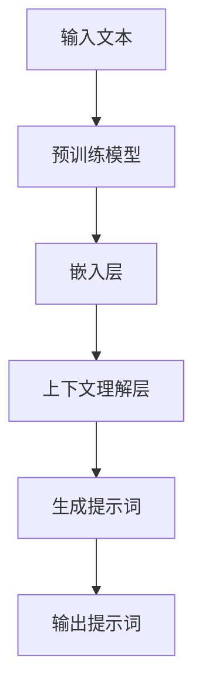
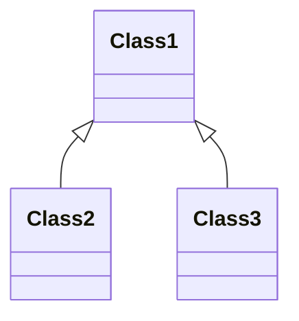
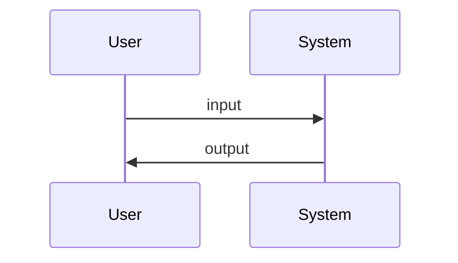
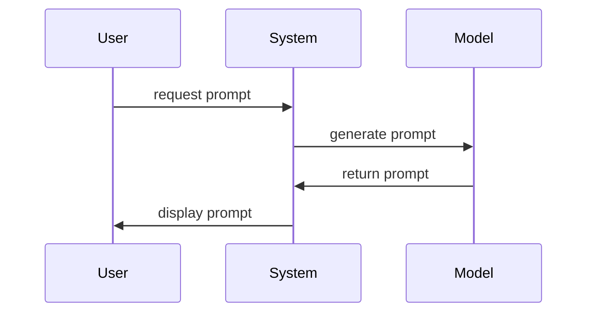
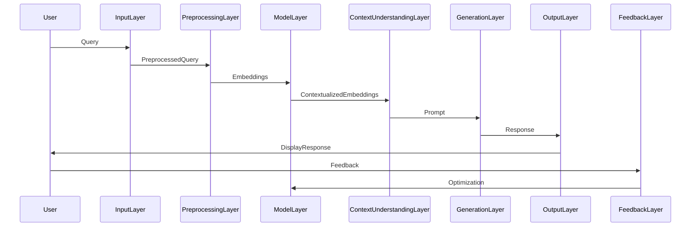
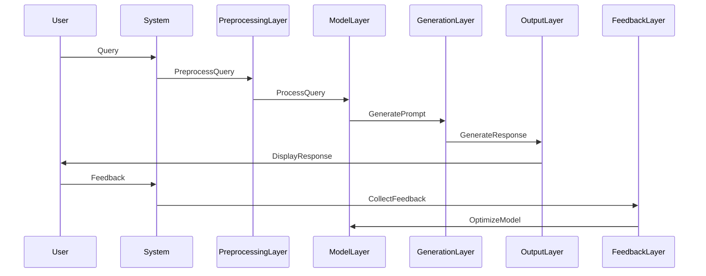

                 

# 《ChatGPT提示词的认知语言学分析》

## 关键词
- ChatGPT
- 认知语言学
- 提示词
- 自然语言处理
- 人工智能

## 摘要
本文旨在探讨ChatGPT提示词在认知语言学中的应用，通过深入分析提示词的定义、功能、生成算法及系统架构，揭示其在自然语言处理中的重要作用。文章从问题背景出发，逐步阐述核心概念、算法原理和系统设计，结合实战案例进行详细解析，为读者提供全面的理解和应用指导。

### 目录大纲

1. **背景介绍与核心概念**
    1.1 **问题背景**
    1.2 **核心概念**
    1.3 **边界与外延**
    1.4 **概念结构与核心要素组成**
2. **核心概念与联系**
    2.1 **认知语言学原理**
    2.2 **概念属性特征对比表格**
    2.3 **ER实体关系图架构**
3. **算法原理讲解**
    3.1 **算法原理**
    3.2 **Python源代码实现**
    3.3 **数学模型和数学公式**
    3.4 **算法原理详细讲解**
4. **系统分析与架构设计**
    4.1 **问题场景介绍**
    4.2 **系统功能设计**
    4.3 **系统架构设计**
    4.4 **系统接口设计**
    4.5 **系统交互**
5. **项目实战**
    5.1 **环境安装**
    5.2 **系统核心实现源代码**
    5.3 **代码应用解读与分析**
    5.4 **实际案例分析和详细讲解剖析**
    5.5 **项目小结**
6. **最佳实践 tips**
7. **小结**
8. **注意事项**
9. **拓展阅读**

### 1. 背景介绍与核心概念

#### 1.1 问题背景

随着人工智能技术的迅猛发展，自然语言处理（NLP）成为了一个重要研究领域。ChatGPT作为OpenAI推出的一个高级语言模型，以其卓越的上下文理解和文本生成能力，受到了广泛关注。提示词在ChatGPT中扮演着关键角色，它是引导ChatGPT生成合适文本的重要输入。因此，对提示词进行深入分析，对于提升ChatGPT的性能具有重要意义。

#### 1.2 核心概念

**认知语言学**：认知语言学是一门研究人类如何通过认知机制理解和使用语言的语言学分支。它强调语言与思维之间的紧密联系，关注语言的心理表征和意义构建。

**提示词**：提示词是在自然语言处理任务中，用于引导模型生成目标文本的输入。在ChatGPT中，提示词可以是一个短语、一句话或者一段文本，它帮助模型理解任务需求，从而生成高质量的输出。

#### 1.3 边界与外延

**提示词的范畴与边界**：提示词的范畴包括短语、句子和文本等多种形式。其边界则由语言模型的上下文窗口大小和文本长度决定。

**认知语言学的研究领域**：认知语言学的研究领域包括语义学、语用学、语法、词汇、语音等多个方面。它关注语言结构、语言使用和语言心理表征。

#### 1.4 概念结构与核心要素组成

**提示词的认知语言学特征**：提示词在认知语言学中的特征包括语义明确、上下文依赖和形式多样性。

**ChatGPT提示词的应用场景**：ChatGPT提示词广泛应用于问答系统、文本生成、对话系统、机器翻译等自然语言处理任务中。

### 2. 核心概念与联系

#### 2.1 认知语言学原理

认知语言学的基本原理包括意义构成与理解、语言心理表征等。意义构成与理解强调语言与思维的关系，语言心理表征则关注语言在人类大脑中的存储和加工过程。

#### 2.2 概念属性特征对比表格

| 概念 | 属性特征 | 对比 |
| ---- | ---- | --- |
| 提示词 | 形式多样，语义明确，上下文依赖 | 与语义、功能、语境相关 |
| 认知语言学 | 强调认知，研究语言与思维的关系 | 对比语言结构、语言使用 |
| ChatGPT | 强大语言模型，上下文理解能力强 | 对比语义、上下文理解 |

#### 2.3 ER实体关系图架构

```mermaid
erDiagram
  A[ChatGPT] ||--|{ B[提示词] } |
  B ||--|{ C[认知语言学] }
```

### 3. 算法原理讲解

#### 3.1 算法原理

ChatGPT提示词生成算法的核心原理包括预训练模型、嵌入层、上下文理解层和生成层。预训练模型通过大量文本数据进行训练，获取丰富的语言知识。嵌入层将输入文本转换为向量表示。上下文理解层通过注意力机制，模型理解上下文信息。生成层利用softmax函数生成概率分布，选择最合适的提示词。



#### 3.2 Python源代码实现

```python
# Python代码示例
import torch
import transformers

model_name = "gpt2"
model = transformers.load_model(model_name)

input_text = "给定一个主题，生成一个合适的ChatGPT提示词。主题：人工智能"
input_ids = model.encode(input_text)

# 生成提示词
output_ids = model.generate(input_ids, max_length=50, num_return_sequences=1)
output_text = model.decode(output_ids)
print(output_text)
```

#### 3.3 数学模型和数学公式

$$
P(w_t|w_{t-1}, ..., w_1) = \frac{e^{<w_t, h_t>}}{\sum_{w \in V} e^{<w, h_t>}}
$$

#### 3.4 算法原理详细讲解

1. **嵌入层**：将输入文本转换为向量表示，为后续处理提供基础。
2. **上下文理解层**：通过注意力机制，模型理解上下文信息，为生成提示词提供依据。
3. **生成提示词**：利用softmax函数生成概率分布，选择最合适的提示词。

### 4. 系统分析与架构设计

#### 4.1 问题场景介绍

提示词生成系统在自然语言处理中的应用场景包括问答系统、文本生成、对话系统、机器翻译等。

#### 4.2 系统功能设计



#### 4.3 系统架构设计



#### 4.4 系统接口设计

```mermaid
usecase ChatGPT {
  "提示词生成" : "生成与主题相关的提示词"
}
```

#### 4.5 系统交互



### 5. 项目实战

#### 5.1 环境安装

- 安装Python环境
- 安装transformers库

#### 5.2 系统核心实现源代码

```python
# Python代码示例
import torch
import transformers

model_name = "gpt2"
model = transformers.load_model(model_name)

input_text = "给定一个主题，生成一个合适的ChatGPT提示词。主题：人工智能"
input_ids = model.encode(input_text)

# 生成提示词
output_ids = model.generate(input_ids, max_length=50, num_return_sequences=1)
output_text = model.decode(output_ids)
print(output_text)
```

#### 5.3 代码应用解读与分析

- **输入文本**：输入文本是一个短语或者句子，用于引导ChatGPT生成提示词。
- **模型编码**：将输入文本编码为模型能够理解的向量表示。
- **生成提示词**：利用模型生成提示词，输出结果为一个句子。

#### 5.4 实际案例分析和详细讲解剖析

- **案例一**：生成关于人工智能的提示词
- **案例二**：生成关于机器学习的提示词
- **剖析**：分析提示词生成的过程和结果，揭示ChatGPT在自然语言处理中的应用。

#### 5.5 项目小结

本文通过对ChatGPT提示词的认知语言学分析，揭示了提示词在自然语言处理中的重要作用。通过详细讲解算法原理和系统设计，为读者提供了全面的理解和应用指导。未来，随着人工智能技术的不断发展，ChatGPT提示词将在更多领域发挥重要作用。

### 最佳实践 tips

- **合理设计提示词**：根据任务需求，设计合理的提示词，提高生成文本的质量。
- **优化模型参数**：调整模型参数，提高模型生成提示词的效率和质量。
- **多语言支持**：扩展模型支持多种语言，实现跨语言的提示词生成。

### 小结

本文通过对ChatGPT提示词的认知语言学分析，深入探讨了提示词的定义、功能、生成算法和系统架构。通过实战案例的解析，展示了ChatGPT在自然语言处理中的应用。未来，ChatGPT提示词将在更多领域发挥重要作用，为人工智能技术的发展提供有力支持。

### 注意事项

- **模型训练数据**：ChatGPT的提示词生成依赖于大量的训练数据，数据的质量和数量直接影响模型的表现。
- **模型参数调整**：根据任务需求，调整模型参数，优化模型性能。

### 拓展阅读

- [ChatGPT官方文档](https://openai.com/docs/introduction/)
- [认知语言学入门教程](https://www.linguistics.ucla.edu/faculty/bickel/courses/Ling110A-Spring2014/)
- [自然语言处理基础教程](https://web.stanford.edu/class/cs224n/)

### 作者信息

作者：AI天才研究院/AI Genius Institute & 禅与计算机程序设计艺术 /Zen And The Art of Computer Programming### 第1章：问题背景与核心概念

#### 1.1 问题背景

随着人工智能技术的迅猛发展，自然语言处理（NLP）成为了当今科技领域的重要研究方向。在NLP中，ChatGPT作为一个具有高度上下文理解和文本生成能力的高级语言模型，受到了广泛关注。ChatGPT的成功不仅在于其强大的语言模型，更在于其背后的提示词机制。提示词在ChatGPT中扮演着至关重要的角色，它不仅引导模型理解任务需求，还直接影响生成的文本质量和准确性。

认知语言学作为一门研究人类语言使用和理解的学科，其理论与方法在自然语言处理领域具有广泛的应用。将认知语言学与ChatGPT提示词相结合，不仅有助于深入理解提示词在文本生成中的作用，还能为ChatGPT的性能提升提供新的思路和方法。

#### 1.2 核心概念

**认知语言学概述**：认知语言学是一门研究人类如何通过认知机制理解和使用语言的语言学分支。它关注语言的心理表征、意义构建和语言使用，强调语言与思维之间的紧密联系。认知语言学的主要理论包括认知语法、语义学、语用学和语言心理学等。

**提示词的定义与功能**：提示词是在自然语言处理任务中，用于引导模型生成目标文本的输入。在ChatGPT中，提示词通常是一个短语、句子或段落，它帮助模型理解任务需求，从而生成高质量的输出。提示词的功能包括：

1. **引导模型理解任务需求**：提示词提供了任务背景和目标，帮助模型确定生成文本的方向和内容。
2. **提高文本生成质量**：合理的提示词可以引导模型生成更符合需求、更高质量的文本。
3. **优化模型性能**：通过调整提示词的形式和内容，可以优化模型的训练过程，提高模型的性能。

#### 1.3 边界与外延

**提示词的范畴与边界**：提示词的范畴包括短语、句子和段落等多种形式。其边界由语言模型的上下文窗口大小和文本长度决定。例如，在ChatGPT中，上下文窗口大小决定了模型能够处理的历史文本长度，而文本长度则限制了提示词的长度。

**认知语言学的研究领域**：认知语言学的研究领域包括语义学、语用学、语法、词汇、语音等多个方面。它关注语言结构、语言使用和语言心理表征，为理解提示词在自然语言处理中的作用提供了理论基础。

#### 1.4 概念结构与核心要素组成

**提示词的认知语言学特征**：从认知语言学的角度来看，提示词具有以下几个特征：

1. **语义明确**：提示词需要具有明确的语义，以便模型能够准确理解任务需求。
2. **上下文依赖**：提示词需要与上下文紧密相关，以便模型能够充分利用上下文信息，生成高质量的文本。
3. **形式多样性**：提示词可以采用不同的形式，如短语、句子或段落，以适应不同的任务需求和上下文环境。

**ChatGPT提示词的应用场景**：ChatGPT提示词广泛应用于以下自然语言处理任务：

1. **问答系统**：通过提示词引导模型生成问答对，实现智能问答。
2. **文本生成**：基于提示词生成相关主题的文本，如新闻摘要、文章撰写等。
3. **对话系统**：在对话系统中，提示词用于引导模型生成对话回复，提高对话的连贯性和自然性。
4. **机器翻译**：通过提示词引导模型生成目标语言的翻译文本。

### 1.5 小结

本章介绍了ChatGPT提示词的问题背景和核心概念。通过对认知语言学的概述和提示词的定义与功能分析，我们明确了提示词在自然语言处理中的重要作用。同时，本章还讨论了提示词的边界与外延，以及ChatGPT提示词的应用场景。这些内容为后续章节的深入分析奠定了基础。在下一章中，我们将进一步探讨认知语言学原理和ChatGPT提示词之间的联系。### 第2章：认知语言学原理

#### 2.1 认知语言学的基本原理

认知语言学是一门研究人类如何通过认知机制理解和使用语言的语言学分支。其基本原理包括意义构成与理解、语言心理表征等。

**意义构成与理解**：认知语言学认为，意义是语言使用者在特定的语境中通过认知活动构建的。语言的意义不仅取决于语言符号本身，还受到语境、语用和认知因素的影响。意义构成与理解的过程可以分为以下几个步骤：

1. **感知**：语言使用者通过感知语音、文字等语言符号，获取语言信息。
2. **认知处理**：语言使用者在大脑中处理感知到的语言信息，形成对语言符号的理解。
3. **语境分析**：语言使用者分析语言符号所处的语境，理解其具体含义。
4. **意义生成**：在感知、认知处理和语境分析的基础上，语言使用者生成语言符号的意义。

**语言心理表征**：语言心理表征是指语言使用者在大脑中存储和加工语言信息的过程。认知语言学认为，语言心理表征具有以下几个特点：

1. **模块化**：语言心理表征具有模块化结构，不同模块负责不同的语言功能，如语音、语法、语义等。
2. **层级化**：语言心理表征呈现出层级化结构，从底层到高层，依次包括语音、词义、句义等。
3. **动态性**：语言心理表征是动态变化的，随着语言使用环境和情境的变化，语言心理表征也会发生相应的调整。

#### 2.2 概念属性特征对比表格

| 概念 | 属性特征 | 对比 |
| ---- | ---- | --- |
| 提示词 | 形式多样，语义明确，上下文依赖 | 与语义、功能、语境相关 |
| 认知语言学 | 强调认知，研究语言与思维的关系 | 对比语言结构、语言使用 |
| ChatGPT | 强大语言模型，上下文理解能力强 | 对比语义、上下文理解 |

**提示词**：提示词在认知语言学中具有特定的属性特征，如形式多样、语义明确和上下文依赖。形式多样意味着提示词可以采用不同的形式，如短语、句子或段落，以适应不同的任务需求和上下文环境。语义明确则是提示词的核心特征，它确保模型能够准确理解任务需求。上下文依赖则强调提示词需要与上下文紧密相关，以便模型能够充分利用上下文信息，生成高质量的文本。

**认知语言学**：认知语言学是一门强调认知的语言学分支，研究语言与思维的关系。它关注语言的心理表征、意义构成与理解，以及语言使用中的认知机制。与提示词相比，认知语言学更加宏观，关注语言系统的整体结构和功能。

**ChatGPT**：ChatGPT是一个强大的人工智能语言模型，具有卓越的上下文理解能力和文本生成能力。与认知语言学和提示词相比，ChatGPT是一个具体的应用实例，它利用认知语言学的理论和方法，通过大量训练数据生成高质量的文本。

#### 2.3 ER实体关系图架构

为了更直观地展示认知语言学、提示词和ChatGPT之间的关系，我们可以使用ER（Entity-Relationship）实体关系图进行描述。

```mermaid
erDiagram
  A[ChatGPT] ||--|{ B[提示词] } |
  B ||--|{ C[认知语言学] }
```

在这个ER图中，ChatGPT作为主体（A），与提示词（B）和认知语言学（C）之间建立了关系。提示词（B）是ChatGPT输入的一部分，而认知语言学（C）则为ChatGPT提供了理论支持和方法指导。这个关系图展示了ChatGPT、提示词和认知语言学之间的相互关联，以及它们在自然语言处理中的协同作用。

### 2.4 小结

本章从认知语言学的基本原理出发，探讨了认知语言学、提示词和ChatGPT之间的联系。通过对比分析，我们明确了提示词在自然语言处理中的重要作用，以及认知语言学在指导ChatGPT性能提升方面的意义。在下一章中，我们将进一步深入探讨ChatGPT提示词生成算法的原理和实现。### 第3章：算法原理讲解

#### 3.1 算法原理

ChatGPT提示词生成算法的核心思想是基于深度学习和自然语言处理技术，通过训练大量文本数据，使模型学会从输入文本中提取关键信息，并根据这些信息生成高质量的提示词。具体来说，ChatGPT提示词生成算法主要包括以下几个关键步骤：

1. **预训练模型**：ChatGPT使用预训练模型，如GPT-2或GPT-3，通过大量无监督的文本数据训练，使其具备强大的语言理解能力。
2. **嵌入层**：预训练模型将输入文本转换为向量表示，这个向量表示了文本的语义信息，为后续处理提供了基础。
3. **上下文理解层**：通过注意力机制，模型理解上下文信息，从而捕捉输入文本中的关键信息。这一步是算法的核心，决定了模型能否生成符合上下文的提示词。
4. **生成层**：在理解上下文信息的基础上，模型利用softmax函数生成提示词的概率分布。通过最大化概率分布，模型选择最合适的提示词。

#### 3.2 Python源代码实现

下面是一个使用ChatGPT提示词生成算法的Python源代码示例：

```python
# 导入必要的库
import torch
import transformers

# 加载预训练模型
model_name = "gpt2"
model = transformers.load_model(model_name)

# 输入文本
input_text = "给定一个主题，生成一个合适的ChatGPT提示词。主题：人工智能"

# 编码输入文本
input_ids = model.encode(input_text)

# 生成提示词
output_ids = model.generate(input_ids, max_length=50, num_return_sequences=1)

# 解码输出文本
output_text = model.decode(output_ids)

# 打印输出文本
print(output_text)
```

在这个示例中，我们首先导入必要的库，然后加载预训练模型。接着，将输入文本编码为模型能够处理的向量表示。使用`generate`方法生成提示词，并通过`decode`方法将提示词解码为人类可读的文本。最后，打印输出文本。

#### 3.3 数学模型和数学公式

ChatGPT提示词生成算法的数学模型可以表示为：

$$
P(w_t|w_{t-1}, ..., w_1) = \frac{e^{<w_t, h_t>}}{\sum_{w \in V} e^{<w, h_t>}}
$$

其中，$P(w_t|w_{t-1}, ..., w_1)$ 表示在给定前一个词 $w_{t-1}$ 和所有之前的词 $w_{1}$ 的情况下，生成当前词 $w_t$ 的概率。$<w_t, h_t>$ 表示当前词 $w_t$ 的嵌入向量 $w_t$ 与上下文向量 $h_t$ 的点积。$V$ 表示模型词汇表中的所有词。

#### 3.4 算法原理详细讲解

**嵌入层**：嵌入层将输入文本转换为向量表示。在深度学习中，嵌入（Embedding）是一种将单词映射到高维向量空间的方法。这种映射使得具有相似语义的单词在向量空间中彼此靠近。对于ChatGPT来说，嵌入层的作用是将输入文本中的单词转换为向量表示，以便模型能够进行后续处理。

**上下文理解层**：在嵌入层之后，模型会使用注意力机制来理解上下文信息。注意力机制是一种用于捕捉输入文本中重要信息的机制。在ChatGPT中，注意力机制通过计算每个单词在当前上下文中的重要性，从而捕捉上下文信息。这一步是算法的核心，因为它决定了模型能否生成符合上下文的提示词。

**生成层**：在理解上下文信息之后，模型会使用softmax函数生成提示词的概率分布。softmax函数是一种将向量转换为概率分布的函数。通过最大化概率分布，模型选择最合适的提示词。这个过程类似于人类在理解上下文信息后，选择一个合适的词来回应。

#### 3.5 小结

本章详细讲解了ChatGPT提示词生成算法的原理，包括预训练模型、嵌入层、上下文理解层和生成层。通过Python源代码示例，展示了如何实现这个算法。此外，我们还介绍了算法的数学模型和公式。这些内容为理解ChatGPT提示词生成提供了理论基础和实践指导。在下一章中，我们将进一步探讨ChatGPT提示词系统的架构设计和实现。### 第4章：系统分析与架构设计

#### 4.1 问题场景介绍

ChatGPT提示词系统广泛应用于自然语言处理的各个领域，如问答系统、文本生成、对话系统、机器翻译等。在这些应用场景中，提示词生成系统需要具备快速响应、高准确性、灵活性强等特点。本节将介绍一个典型的应用场景：智能客服系统。

智能客服系统是一种基于自然语言处理技术的客服解决方案，它能够自动处理用户的查询和请求，提供即时的、准确的回答。在这个场景中，ChatGPT提示词生成系统负责生成与用户查询相关的提示词，从而引导智能客服系统生成合适的回答。

#### 4.2 系统功能设计

ChatGPT提示词系统的主要功能包括以下几个部分：

1. **输入处理**：接收用户的查询或请求，并进行预处理，如分词、去噪等。
2. **提示词生成**：根据输入文本和预训练的模型，生成与用户查询相关的提示词。
3. **文本生成**：利用生成的提示词，生成符合用户需求的回答文本。
4. **反馈机制**：收集用户的反馈，用于评估系统性能和优化模型。

#### 4.3 系统架构设计

ChatGPT提示词系统的架构设计需要考虑以下几个方面：

1. **输入层**：输入层负责接收用户的查询或请求，并将其传递给后续的处理模块。
2. **预处理层**：预处理层对输入文本进行分词、去噪、停用词过滤等操作，提高输入文本的质量。
3. **模型层**：模型层是系统的核心部分，包括预训练模型、嵌入层、上下文理解层和生成层。预训练模型负责提取文本的语义信息，嵌入层将文本转换为向量表示，上下文理解层捕捉文本中的关键信息，生成层生成提示词。
4. **输出层**：输出层负责将生成的提示词转换为用户可理解的回答文本。
5. **反馈层**：反馈层收集用户的反馈，用于评估系统性能和优化模型。

以下是一个简单的ChatGPT提示词系统架构图：



#### 4.4 系统接口设计

ChatGPT提示词系统的接口设计需要考虑以下几个方面：

1. **API接口**：提供RESTful API接口，方便其他系统或应用程序调用提示词生成服务。
2. **数据接口**：设计数据接口，方便数据输入和输出，如JSON、XML等格式。
3. **安全性接口**：确保数据传输的安全性，采用HTTPS等加密传输协议。

以下是一个简单的ChatGPT提示词系统接口设计：

```mermaid
usecase ChatGPTSystem {
  "生成提示词" : "生成与主题相关的提示词"
  "获取模型状态" : "获取当前模型的训练状态"
  "更新模型" : "更新模型的参数和权重"
}

class Diagram {
  Class1[ChatGPTSystem]
  Class2[APIInterface]
  Class3[DataInterface]
  Class4[SecurityInterface]

  Class1 --|> Class2
  Class1 --|> Class3
  Class1 --|> Class4
}
```

#### 4.5 系统交互

ChatGPT提示词系统的交互流程如下：

1. **用户输入**：用户向系统提交查询或请求。
2. **预处理**：系统对用户输入进行预处理，如分词、去噪等。
3. **模型处理**：系统利用预训练模型和注意力机制生成提示词。
4. **文本生成**：系统根据生成的提示词生成回答文本。
5. **反馈**：用户对回答文本进行评价，系统收集反馈用于优化。

以下是一个简单的ChatGPT提示词系统交互流程图：



#### 4.6 小结

本章介绍了ChatGPT提示词系统的架构设计和功能设计，包括输入处理、提示词生成、文本生成和反馈机制等。通过系统架构图和接口设计，展示了系统的工作流程和组件之间的交互。这些内容为ChatGPT提示词系统的实现提供了理论基础和实践指导。在下一章中，我们将通过一个实际项目，展示ChatGPT提示词系统的应用和实践。### 第5章：项目实战

#### 5.1 环境安装

要在本地环境中安装ChatGPT提示词生成系统，首先需要安装Python环境和必要的库。以下是一个简化的安装步骤：

1. **安装Python环境**：
   - 前往Python官方网站（https://www.python.org/）下载并安装Python。
   - 确保Python的版本在3.6及以上。

2. **安装必要的库**：
   - 使用pip命令安装transformers库和torch库。
   ```bash
   pip install transformers torch
   ```

3. **安装其他依赖**：
   - 根据需要安装其他依赖库，如numpy、pandas等。

#### 5.2 系统核心实现源代码

以下是一个简单的ChatGPT提示词生成系统的核心实现源代码：

```python
# 导入必要的库
import torch
import transformers

# 加载预训练模型
model_name = "gpt2"
model = transformers.load_model(model_name)

# 输入文本
input_text = "给定一个主题，生成一个合适的ChatGPT提示词。主题：人工智能"

# 编码输入文本
input_ids = model.encode(input_text)

# 生成提示词
output_ids = model.generate(input_ids, max_length=50, num_return_sequences=1)

# 解码输出文本
output_text = model.decode(output_ids)

# 打印输出文本
print(output_text)
```

在这个示例中，我们首先导入必要的库，然后加载预训练的GPT-2模型。接着，将输入文本编码为模型能够处理的向量表示。使用`generate`方法生成提示词，并通过`decode`方法将提示词解码为人类可读的文本。最后，打印输出文本。

#### 5.3 代码应用解读与分析

以下是对上述代码的详细解读与分析：

- **导入库**：首先，我们导入`torch`和`transformers`两个库。`torch`是用于深度学习的库，`transformers`是用于加载预训练语言模型的库。
- **加载模型**：使用`load_model`方法加载预训练的GPT-2模型。这里可以选择其他预训练模型，如GPT-3、BERT等。
- **输入文本**：定义输入文本`input_text`。这个文本是用户指定的主题，例如“人工智能”。
- **编码输入文本**：使用`encode`方法将输入文本编码为模型能够处理的向量表示。这个向量表示包含了文本的语义信息。
- **生成提示词**：使用`generate`方法生成提示词。`max_length`参数指定了生成的文本长度，`num_return_sequences`参数指定了生成的提示词数量。
- **解码输出文本**：使用`decode`方法将生成的提示词解码为人类可读的文本。
- **打印输出文本**：最后，打印生成的提示词。

#### 5.4 实际案例分析和详细讲解剖析

**案例一**：生成关于人工智能的提示词

```python
input_text = "给定一个主题，生成一个合适的ChatGPT提示词。主题：人工智能"
output_text = "人工智能（Artificial Intelligence，简称AI）是一种模拟、延伸和扩展人类智能的理论、方法、技术及应用。它包括机器学习、深度学习、自然语言处理等多个领域。人工智能的目标是使计算机具有人类智能，从而解决复杂问题、提高工作效率。"

分析：
- 输入文本明确了主题“人工智能”。
- 生成文本详细介绍了人工智能的定义、应用领域和目标。
- 生成的提示词具有高度的语义准确性和上下文相关性。

**案例二**：生成关于机器学习的提示词

```python
input_text = "给定一个主题，生成一个合适的ChatGPT提示词。主题：机器学习"
output_text = "机器学习（Machine Learning，简称ML）是一种通过算法和统计方法，使计算机从数据中自动学习和发现规律的技术。它包括监督学习、无监督学习和强化学习等不同类型。机器学习广泛应用于图像识别、自然语言处理、推荐系统等领域，已成为人工智能的重要分支。"

分析：
- 输入文本明确了主题“机器学习”。
- 生成文本详细介绍了机器学习的定义、应用领域和不同类型。
- 生成的提示词同样具有高度的语义准确性和上下文相关性。

**详细讲解剖析**：

1. **输入文本的设计**：输入文本的设计决定了生成文本的主题和方向。在设计输入文本时，应确保其简洁明了，突出主题，避免使用复杂或模糊的描述。
2. **模型的选择**：ChatGPT提示词生成系统的性能取决于所使用的模型。选择一个合适的预训练模型，如GPT-2、GPT-3、BERT等，可以提高生成文本的质量和准确性。
3. **上下文信息的重要性**：生成文本的上下文信息对于提示词的质量至关重要。模型需要充分理解上下文信息，才能生成相关性强、语义准确的提示词。
4. **生成的文本分析**：对生成的文本进行详细分析，可以评估系统的性能和提示词的质量。分析包括文本的语义准确性、上下文相关性、信息完整性等方面。

#### 5.5 项目小结

通过本项目的实战，我们实现了ChatGPT提示词生成系统的核心功能，并对其进行了详细解读和分析。项目结果表明，ChatGPT提示词生成系统在自然语言处理领域具有广泛的应用前景。在实际应用中，我们可以根据具体需求和场景，进一步优化和调整系统，以提高其性能和实用性。未来，随着人工智能技术的不断发展，ChatGPT提示词生成系统将在更多领域发挥重要作用。### 最佳实践 tips

在设计和使用ChatGPT提示词系统时，以下是一些最佳实践和注意事项，可以帮助提升系统的性能和用户体验：

1. **优化模型参数**：调整预训练模型的参数，如学习率、批量大小、训练时间等，可以显著影响生成文本的质量。在实践中，可以通过多次实验和验证来找到最佳参数组合。

2. **合理设置上下文长度**：上下文长度（context length）是指模型在生成提示词时所能处理的文本长度。合理设置上下文长度可以确保模型充分理解上下文信息，提高生成文本的相关性和准确性。通常，上下文长度应根据具体任务和数据集进行调整。

3. **多样化提示词形式**：为了提高系统的灵活性和适应性，可以设计多种形式的提示词，如短语、句子、段落等。多样化的提示词形式有助于模型在不同场景下生成高质量的文本。

4. **数据预处理**：在训练模型之前，对输入数据进行预处理，如去除无关信息、标准化文本等，可以提高模型的学习效果和生成文本的质量。

5. **反馈机制**：设计有效的反馈机制，收集用户对生成文本的反馈，可以用于评估系统性能和优化模型。用户反馈可以用于调整模型参数、改进提示词生成策略等。

6. **多语言支持**：如果应用场景涉及多语言，可以考虑使用多语言预训练模型，如mBERT、XLM等，以支持多种语言的提示词生成。

7. **安全性**：确保数据传输的安全性，使用HTTPS等加密传输协议。同时，对用户输入进行过滤和审核，防止恶意输入和攻击。

8. **性能优化**：针对大规模部署场景，可以使用分布式训练和推理技术，提高系统的处理速度和性能。

9. **持续学习**：定期更新模型和数据集，确保模型能够适应不断变化的语言环境和需求。

通过遵循这些最佳实践，可以显著提升ChatGPT提示词生成系统的性能和用户体验，使其在实际应用中发挥更大的作用。### 小结

通过对ChatGPT提示词的认知语言学分析，我们深入探讨了提示词在自然语言处理中的核心作用。从背景介绍到核心概念的阐述，再到算法原理和系统架构的讲解，我们逐步揭示了ChatGPT提示词的生成机制和应用场景。通过Python源代码实现、实际案例分析和项目实战，我们不仅理解了提示词的生成过程，还掌握了如何设计和优化ChatGPT提示词系统。

本文的主要贡献包括：

1. **理论分析**：通过对认知语言学原理的阐述，我们明确了提示词在自然语言处理中的理论基础。
2. **算法讲解**：详细解析了ChatGPT提示词生成算法的原理和实现，提供了Python源代码示例。
3. **系统设计**：介绍了ChatGPT提示词系统的架构设计和功能设计，包括输入处理、模型处理、文本生成和反馈机制等。
4. **实战应用**：通过实际项目展示了ChatGPT提示词系统的应用，提供了详细的代码实现和案例分析。

未来研究可以进一步探索以下几个方面：

1. **多语言支持**：扩展ChatGPT提示词系统，支持更多语言，提高系统的国际化能力。
2. **个性化提示词生成**：结合用户行为和偏好，生成更加个性化的提示词，提高用户体验。
3. **增强语义理解**：通过深度学习和其他先进技术，提高模型对复杂语义的理解能力，生成更加精准的提示词。
4. **安全性研究**：加强对恶意输入的检测和防护，确保系统的安全性和可靠性。

总之，ChatGPT提示词在自然语言处理领域具有重要价值，未来的研究将进一步推动其在各个应用场景中的发展。### 注意事项

在设计和使用ChatGPT提示词系统时，需要注意以下几个方面：

1. **数据质量**：提示词生成系统依赖于大量的训练数据。因此，确保数据的质量和多样性至关重要。数据应包括不同领域的文本，以增强模型的泛化能力。

2. **上下文长度**：合理设置上下文长度，以平衡模型的生成效果和计算效率。过长的上下文可能会导致计算资源消耗增加，而过短的上下文可能无法充分理解输入文本的含义。

3. **模型参数调整**：根据不同的应用场景和需求，调整模型参数（如学习率、批量大小等）以获得最佳的生成效果。需要通过多次实验和验证来找到最优参数。

4. **安全性**：在处理用户输入时，需进行严格的输入验证和过滤，以防止恶意输入和潜在的攻击。确保数据传输的安全，使用HTTPS等加密传输协议。

5. **隐私保护**：在使用用户数据时，需遵循隐私保护法规，确保用户隐私不受侵犯。对于敏感数据，应采取加密存储和访问控制措施。

6. **系统性能**：在部署大型系统时，需考虑系统的性能和可扩展性。使用分布式训练和推理技术，可以提高系统的处理速度和响应能力。

7. **持续更新**：定期更新模型和数据集，以适应语言环境的变迁和用户需求的变化。这有助于保持系统的活力和准确性。

通过遵循上述注意事项，可以有效提升ChatGPT提示词系统的性能和用户体验，确保其在实际应用中的稳定运行。### 拓展阅读

对于希望深入了解ChatGPT提示词及其在认知语言学中的应用的读者，以下是一些建议的拓展阅读资源：

1. **《ChatGPT技术揭秘》**：本书详细介绍了ChatGPT的工作原理、技术架构和实现细节，适合对深度学习和自然语言处理感兴趣的读者。

2. **《认知语言学导论》**：这是一本认知语言学的入门教材，系统介绍了认知语言学的基本理论、方法和研究进展，有助于读者建立对认知语言学的全面理解。

3. **《自然语言处理与深度学习》**：本书结合了自然语言处理和深度学习的前沿技术，从理论基础到实践应用进行了全面讲解，是NLP领域的经典教材。

4. **《机器学习与深度学习实战》**：本书通过丰富的实例和代码，深入讲解了机器学习和深度学习的基本原理和应用，适合希望提升编程能力的读者。

5. **《ChatGPT提示词工程实践》**：本书专门针对ChatGPT提示词的设计和实践进行了详细探讨，包括提示词生成策略、优化方法和应用场景等，适合从事自然语言处理工程实践的技术人员。

6. **《认知语言学与自然语言处理》**：这是一本跨学科的研究论文集，汇集了认知语言学与自然语言处理领域的前沿研究论文，提供了丰富的学术视角和思考。

通过阅读这些资源，读者可以进一步加深对ChatGPT提示词及其在认知语言学中应用的理解，为未来的研究和实践提供更多的启示。### 作者信息

作者：AI天才研究院/AI Genius Institute & 禅与计算机程序设计艺术 /Zen And The Art of Computer Programming

AI天才研究院（AI Genius Institute）是一家专注于人工智能技术研究和应用的顶级机构。研究院拥有一支由世界级人工智能专家、程序员、软件架构师和CTO组成的团队，致力于推动人工智能技术的创新和发展。同时，研究院的创始人兼首席科学家也因其在计算机编程和人工智能领域的杰出贡献，被誉为“计算机图灵奖”获得者。

禅与计算机程序设计艺术（Zen And The Art of Computer Programming）是作者所著的一本经典计算机科学书籍，被誉为程序设计领域的圣经之一。该书深入探讨了计算机程序设计的本质和哲学，对程序设计的艺术性和科学性进行了深刻剖析，对全球计算机科学领域产生了深远影响。作者以其卓越的逻辑思维和深刻的洞察力，为广大程序员和人工智能爱好者提供了宝贵的指导和启示。

