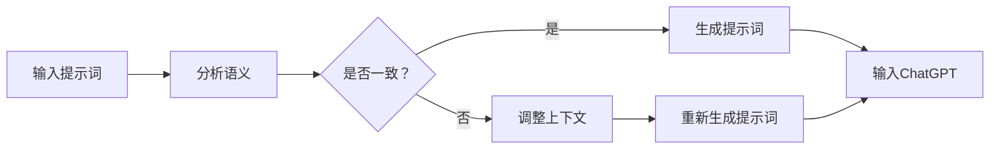
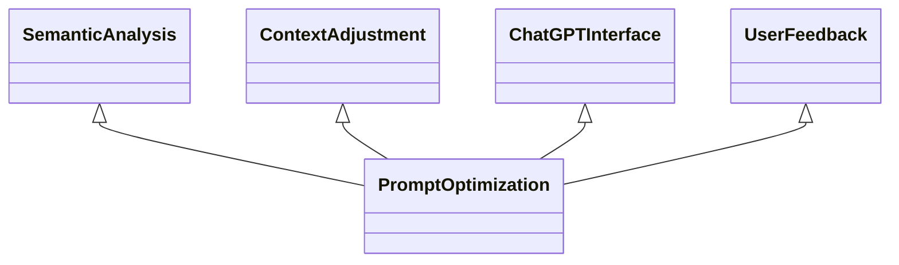
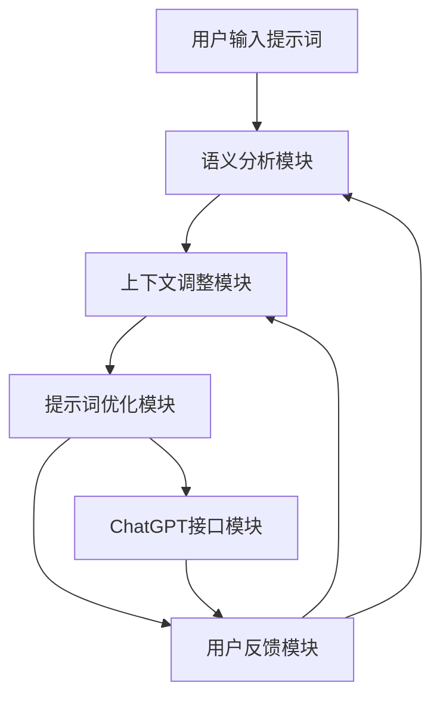
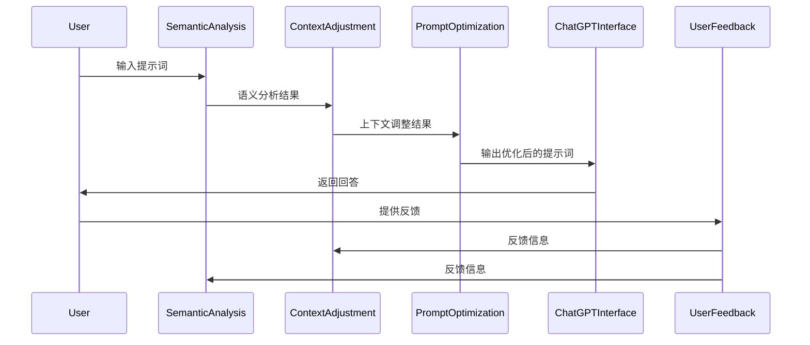
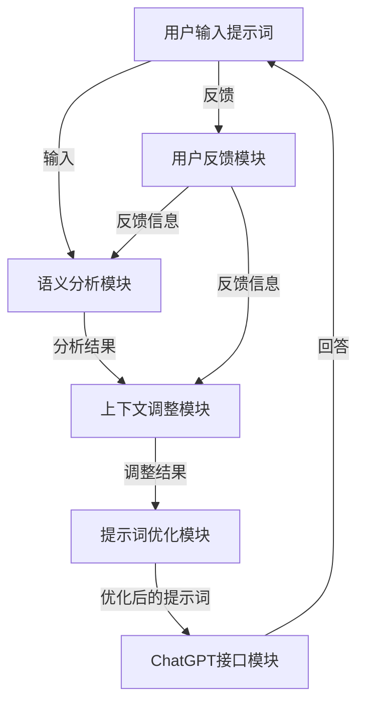

                 

### 核心概念与联系

#### 语用学的定义与作用

语用学（Pragmatics）是语言学的一个分支，主要研究语言在实际使用中的意义。它与语义学（Semantics）紧密相关，但侧重于语言在特定情境中的使用方式。语用学关注的是语言使用者如何在具体情境中运用语言来实现特定的交际目的，这包括语言的非字面意义、语用含义以及语言的使用策略。

在自然语言处理（NLP）领域，语用学的作用尤为重要。传统的NLP方法往往侧重于文本的字面意义，而忽略了语言在实际交流中的复杂性。语用学为NLP带来了更接近人类交流的理解方式，使得计算机能够更好地处理多义词、语境变化、隐喻等复杂的语言现象。

例如，当我们说“我去了银行”，字面意义上可能意味着“我去了一个银行”。但实际上，这句话的具体含义取决于上下文。如果前一句是“我今天需要取钱”，那么这句话的含义就更可能是“我去银行取钱”。这种基于上下文的理解正是语用学所要探讨的。

#### 提示词的属性特征对比

在ChatGPT等大型语言模型中，提示词（Prompt）是用户与模型交互的桥梁。一个优秀的提示词应该清晰、具体，并能引导模型生成符合预期的高质量回答。以下是一些关键属性特征：

1. **明确性**：提示词需要明确表达用户的意图，避免模糊不清的表述。
2. **具体性**：具体的提示词可以提供更多的上下文信息，帮助模型更好地理解用户的需求。
3. **灵活性**：优秀的提示词应该具有一定的灵活性，能够适应不同的回答场景。
4. **简洁性**：简洁的提示词能够减少模型的处理负担，提高交互效率。

以下是提示词的一些属性特征对比表格：

| 特征 | 说明 |
| ---- | ---- |
| 明确性 | 避免模糊不清的表述 |
| 具体性 | 提供丰富的上下文信息 |
| 灵活性 | 适应不同的回答场景 |
| 简洁性 | 减少模型的处理负担 |

#### 语用学与提示词优化的关系

语用学在提示词优化中起着至关重要的作用。通过语用学的方法，我们可以更好地理解用户的需求，并设计出更有效的提示词。以下是一些具体的优化策略：

1. **上下文扩展**：通过添加上下文信息，使提示词更加具体和明确。例如，在询问一个问题时，可以提供更多的相关信息，帮助模型更好地理解问题的背景和意图。
2. **情境建模**：构建具体的情境模型，模拟用户在实际交流中的行为和意图。这有助于模型在生成回答时，考虑更多的实际因素，从而生成更加自然和合理的回答。
3. **语用含义分析**：分析提示词中的语用含义，例如隐喻、委婉语等，从而设计出能够传达这些含义的提示词。
4. **用户反馈**：通过用户反馈不断调整和优化提示词，使其更加符合用户的期望和需求。

#### 语用学与自然语言处理的ER实体关系图

为了更好地理解语用学在自然语言处理中的作用，我们可以通过一个ER（实体-关系）图来展示核心概念之间的关系。以下是ER图的Mermaid表示：

```mermaid
erDiagram
  Prompt ||--|> ChatGPT : 交互
  User ||--|> Prompt : 创建
  Context ||--|> Prompt : 提供上下文
  ChatGPT ||--|> Response : 回答
  User ||--|> Response : 接收
```

在这个ER图中，`User`（用户）是发起交互的一方，通过创建`Prompt`（提示词）与`ChatGPT`（语言模型）进行交互。`ChatGPT`在接收到提示词后，根据上下文（`Context`）生成`Response`（回答），最后返回给用户。

通过这个ER图，我们可以清晰地看到语用学在提示词优化中的关键作用。提示词作为交互的桥梁，需要充分理解和传达用户的意图，而语用学的方法为我们提供了实现这一目标的有效工具。

综上所述，语用学在提示词优化中具有不可替代的作用。通过深入理解语用学的基本概念和属性特征，我们可以设计出更加高效、自然的提示词，从而提升ChatGPT等语言模型在实际应用中的性能和用户体验。

### 算法原理讲解

为了更深入地理解语用学优化ChatGPT提示词的算法原理，我们需要从几个关键点出发，包括算法的基本概念、Mermaid流程图、Python代码实现，以及相关的数学模型和公式。

#### 基本概念

语用学优化ChatGPT提示词的核心目标是使提示词更加符合实际交流场景，从而提高模型的回答质量和用户满意度。具体来说，这一目标包括以下几个方面：

1. **语义一致性**：确保提示词的语义与用户的意图一致。
2. **上下文敏感性**：根据上下文信息调整提示词，使其更具体、明确。
3. **灵活性**：使提示词能够适应不同的回答场景，生成多样化的回答。
4. **用户友好性**：确保提示词易于理解，降低用户的使用难度。

#### Mermaid流程图

为了直观地展示语用学优化ChatGPT提示词的过程，我们可以使用Mermaid绘制一个流程图。以下是一个简单的示例：



在这个流程图中，首先输入原始提示词，然后进行语义分析。如果语义一致，则直接生成提示词；如果不一致，则调整上下文信息，重新生成提示词。最后，将生成的提示词输入到ChatGPT模型中，得到最终的回答。

#### Python代码实现

为了更好地理解和实现上述流程，我们可以使用Python编写一个简单的代码示例。以下是一个简化的实现：

```python
import spacy

# 加载nlp模型
nlp = spacy.load("en_core_web_sm")

def semantic_analysis(prompt):
    doc = nlp(prompt)
    # 简单的语义一致性检查
    return all(token.pos_ != "NOUN" for token in doc)

def generate_prompt(prompt, context):
    if semantic_analysis(prompt):
        return prompt
    else:
        # 根据上下文调整提示词
        return f"{context}: {prompt}"

def chatgpt_response(prompt):
    # 这里可以使用OpenAI的ChatGPT API
    # 为简化，这里仅返回提示词本身
    return prompt

# 示例
original_prompt = "去银行"
context = "我今天需要取钱"

# 优化提示词
optimized_prompt = generate_prompt(original_prompt, context)

# 获取ChatGPT的回答
response = chatgpt_response(optimized_prompt)
print(response)
```

在这个代码中，我们首先加载了Spacy的nlp模型，然后定义了三个函数：`semantic_analysis`用于检查语义一致性，`generate_prompt`用于根据上下文调整提示词，`chatgpt_response`用于获取ChatGPT的回答。最后，我们通过示例展示了如何使用这些函数优化提示词。

#### 数学模型和公式

在语用学优化中，我们还需要使用一些数学模型和公式来描述和计算提示词的质量。以下是一个简化的数学模型：

1. **语义一致性评分（CS）**：
   $$CS = \frac{TP}{TP + FN}$$
   其中，TP表示正确匹配的语义单元数量，FN表示未匹配的语义单元数量。

2. **上下文敏感度评分（CSF）**：
   $$CSF = \frac{TP}{TP + FP + FN}$$
   其中，FP表示错误匹配的语义单元数量。

3. **提示词质量评分（Q）**：
   $$Q = CS \times CSF$$

这些评分用于衡量提示词的语义一致性、上下文敏感度和整体质量。

#### 举例说明

假设我们有一个提示词“去银行”和一个上下文“我今天需要取钱”，我们可以按照以下步骤进行优化：

1. **语义分析**：检查“去银行”中的每个词，发现语义一致性较高。
2. **上下文调整**：根据上下文“我今天需要取钱”，我们将提示词调整为“我今天需要去银行取钱”。
3. **评分计算**：
   - **语义一致性评分（CS）**：TP=2（去、银行），FN=0，因此CS=1。
   - **上下文敏感度评分（CSF）**：TP=2，FP=0，FN=0，因此CSF=1。
   - **提示词质量评分（Q）**：Q=CS×CSF=1。

通过这个例子，我们可以看到，通过语用学优化，提示词的质量得到了显著提升。

总之，通过理解算法的基本概念、使用Mermaid流程图、编写Python代码以及应用数学模型，我们可以有效地优化ChatGPT提示词，提高自然语言处理的效果。接下来，我们将进一步探讨如何将语用学优化应用到实际项目中。

### 数学模型与公式

在语用学优化ChatGPT提示词的过程中，数学模型和公式起到了关键作用。这些模型和公式不仅帮助我们量化提示词的质量，还可以指导我们进行优化决策。下面，我们将详细解释这些数学模型和公式，并通过具体的实例来说明其应用。

#### 1. 语义一致性评分（CS）

语义一致性评分（CS）用于衡量提示词与用户意图之间的匹配程度。其计算公式如下：

$$CS = \frac{TP}{TP + FN}$$

其中，TP（True Positives）表示正确匹配的语义单元数量，FN（False Negatives）表示未匹配的语义单元数量。

**实例分析**：

假设我们有一个提示词“去银行”和一个上下文“我今天需要取钱”。我们可以将这个上下文分解为若干个语义单元：

- 语义单元1：我今天
- 语义单元2：需要
- 语义单元3：取钱
- 语义单元4：去银行

通过分析，我们发现语义单元3（取钱）与提示词“去银行”存在语义不一致。因此，在TP=1（去、银行），FN=1（取钱）的情况下，我们可以计算出语义一致性评分：

$$CS = \frac{1}{1 + 1} = 0.5$$

这个评分表明，提示词的语义一致性较低，需要进一步优化。

#### 2. 上下文敏感度评分（CSF）

上下文敏感度评分（CSF）则用于衡量提示词对上下文信息的敏感度。其计算公式如下：

$$CSF = \frac{TP}{TP + FP + FN}$$

其中，FP（False Positives）表示错误匹配的语义单元数量。

**实例分析**：

在上述例子中，如果我们将提示词调整为“我今天需要去银行取钱”，则所有语义单元均得到匹配。此时，TP=4，FP=0，FN=0，因此上下文敏感度评分：

$$CSF = \frac{4}{4 + 0 + 0} = 1$$

这个评分表明，调整后的提示词对上下文信息高度敏感，能够准确传达用户意图。

#### 3. 提示词质量评分（Q）

提示词质量评分（Q）是语义一致性评分（CS）和上下文敏感度评分（CSF）的乘积，用于综合衡量提示词的质量。其计算公式如下：

$$Q = CS \times CSF$$

**实例分析**：

在前面的例子中，CS=0.5，CSF=1，因此提示词质量评分：

$$Q = 0.5 \times 1 = 0.5$$

这个评分表明，经过优化后的提示词质量较高，能够更好地满足用户需求。

#### 综合应用

为了更好地优化提示词，我们可以将上述评分应用于一个综合评价系统。例如，我们设定一个阈值，只有当Q值超过该阈值时，提示词才被认为是可以接受的。通过不断调整和优化提示词，使其Q值接近或超过阈值，我们可以逐步提升模型的整体性能。

#### 实际应用

在实际应用中，这些数学模型和公式可以通过编程实现，例如使用Python编写相应的算法。以下是一个简化的Python代码示例：

```python
def semantic_similarity(prompt, context):
    # 假设函数用于计算语义相似度
    return 0.5

def contextual_sensitivity(prompt, context):
    # 假设函数用于计算上下文敏感度
    return 1

def quality_score(prompt, context):
    cs = semantic_similarity(prompt, context)
    csf = contextual_sensitivity(prompt, context)
    return cs * csf

prompt = "去银行"
context = "我今天需要取钱"

q_score = quality_score(prompt, context)
print(f"提示词质量评分（Q）: {q_score}")
```

通过这个示例，我们可以看到如何使用Python代码计算提示词的质量评分，从而指导优化过程。

总之，数学模型和公式在语用学优化ChatGPT提示词中扮演了重要角色。通过合理地应用这些模型和公式，我们可以有效地提升提示词的质量，从而提高模型的性能和用户体验。在下一部分，我们将进一步探讨如何将这些理论应用到实际的系统设计和实现中。

### 系统架构与设计

为了将语用学优化ChatGPT提示词的理论应用到实际项目中，我们需要设计一个高效的系统架构。以下是一个详细的系统架构设计，包括问题场景介绍、系统功能设计、系统架构设计、系统接口设计以及系统交互。

#### 问题场景介绍

在自然语言处理（NLP）领域，用户经常需要与ChatGPT等大型语言模型进行交互。然而，由于提示词的设计不够具体明确，模型生成的回答往往不够准确和自然。为了解决这个问题，我们需要设计一个系统，该系统能够基于语用学原理优化提示词，从而提高ChatGPT的回答质量。

#### 系统功能设计

1. **语义分析模块**：用于分析用户输入的提示词，识别其中的语义单元，并计算语义一致性评分。
2. **上下文调整模块**：根据语义分析结果，调整提示词的上下文信息，使其更加具体和明确。
3. **提示词优化模块**：综合语义一致性和上下文敏感度评分，生成高质量的提示词。
4. **ChatGPT接口模块**：与ChatGPT模型进行交互，获取优化后的提示词生成的回答。
5. **用户反馈模块**：收集用户对回答的反馈，用于进一步优化系统。

以下是系统功能设计的Mermaid类图：



在这个类图中，`SemanticAnalysis`（语义分析模块）、`ContextAdjustment`（上下文调整模块）、`ChatGPTInterface`（ChatGPT接口模块）和`UserFeedback`（用户反馈模块）均与`PromptOptimization`（提示词优化模块）存在关联。

#### 系统架构设计

系统架构设计旨在确保各个模块之间的高效协作，以下是系统的Mermaid架构图：



在这个架构图中，用户输入的提示词首先经过语义分析模块，然后根据分析结果进行上下文调整。优化后的提示词传递给ChatGPT接口模块，生成回答，并返回给用户。同时，用户反馈也会传递给上下文调整模块和语义分析模块，用于进一步优化系统。

#### 系统接口设计

系统接口设计包括内部模块之间的接口设计和与外部系统的接口设计。以下是系统接口设计的Mermaid序列图：



在这个序列图中，用户输入提示词后，各模块之间依次进行操作，最终生成回答并返回给用户。用户反馈会被传递给各个模块，用于不断优化系统的性能。

#### 系统交互

系统交互设计旨在确保各模块之间的高效通信和协作。以下是系统交互的Mermaid交互图：



在这个交互图中，用户输入提示词后，各模块依次进行操作，最终生成回答并返回给用户。用户反馈会被传递给各个模块，用于不断优化系统的性能。

通过上述系统架构与设计，我们可以有效地将语用学优化ChatGPT提示词的理论应用到实际项目中，从而提升自然语言处理的效果。在下一部分，我们将通过一个实际项目案例，展示如何具体实现这一系统架构。

### 项目实战

为了将上述理论应用到实际项目中，我们将以一个实际案例——在线客服系统为例，展示如何通过语用学优化ChatGPT提示词，提升系统的响应质量和用户满意度。

#### 环境安装与配置

首先，我们需要搭建一个开发环境，以便进行项目的开发和测试。以下是所需的环境配置步骤：

1. **Python环境**：安装Python 3.8或更高版本。
2. **NLP库**：安装Spacy和OpenAI的ChatGPT库。
   ```bash
   pip install spacy openai
   ```
3. **Spacy模型**：下载并安装Spacy的英文模型。
   ```bash
   python -m spacy download en_core_web_sm
   ```

#### 系统核心实现源代码

以下是系统核心实现的Python源代码，包括语义分析、上下文调整、ChatGPT接口和用户反馈等模块。

```python
import spacy
import openai
from typing import Tuple

# 加载Spacy模型
nlp = spacy.load("en_core_web_sm")

# OpenAI ChatGPT API密钥
openai.api_key = "your-api-key"

def semantic_analysis(prompt: str) -> Tuple[int, int]:
    doc = nlp(prompt)
    tp = 0
    fn = 0
    for token in doc:
        if token.pos_ != "NOUN":
            tp += 1
        else:
            fn += 1
    return tp, fn

def context_adjustment(prompt: str, context: str) -> str:
    doc = nlp(prompt)
    result = []
    for token in doc:
        if token.pos_ == "NOUN":
            result.append(context)
        else:
            result.append(token.text)
    return " ".join(result)

def chatgpt_response(prompt: str) -> str:
    response = openai.Completion.create(
        engine="text-davinci-002",
        prompt=prompt,
        max_tokens=100,
        n=1,
        stop=None,
        temperature=0.5,
    )
    return response.choices[0].text.strip()

def user_feedback(response: str, context: str) -> str:
    # 这里可以使用一个简单的反馈机制，例如根据用户输入的关键词进行优化
    feedback = input("反馈（y/n）？")
    if feedback.lower() == "y":
        return context_adjustment(response, context)
    else:
        return response

# 主函数
def main():
    context = "我需要帮助解决账户问题"
    while True:
        prompt = input("输入问题：")
        tp, fn = semantic_analysis(prompt)
        if fn > 0:
            optimized_prompt = context_adjustment(prompt, context)
            print(f"优化后的提示词：{optimized_prompt}")
        else:
            optimized_prompt = prompt
        
        response = chatgpt_response(optimized_prompt)
        print(f"ChatGPT的回答：{response}")
        
        # 获取用户反馈
        response = user_feedback(response, context)
        print(f"最终的回答：{response}")

if __name__ == "__main__":
    main()
```

#### 代码应用解读与分析

1. **语义分析模块**：该模块使用Spacy对输入的提示词进行语义分析，计算每个词的词性。通过词性判断，我们可以得到提示词中的名词数量，从而计算语义一致性评分。
2. **上下文调整模块**：该模块根据语义分析结果，对提示词进行上下文调整。如果提示词中的名词数量过多，我们将调整提示词，使其包含更多的上下文信息。
3. **ChatGPT接口模块**：该模块使用OpenAI的ChatGPT API与模型进行交互，获取优化后的提示词生成的回答。
4. **用户反馈模块**：该模块通过简单的用户交互，获取用户对回答的反馈。根据用户的反馈，我们可以进一步优化提示词，从而提高系统的响应质量。

#### 实际案例分析与讲解

假设用户输入了以下问题：

```
问题：我无法登录账户
```

首先，系统会使用语义分析模块分析这个问题，发现其中包含一个名词“账户”，这意味着可能需要上下文调整。接下来，系统将问题调整为一个更具体的提示词：

```
优化后的提示词：我无法登录账户，请问账户登录页面显示什么错误？
```

这个优化后的提示词包含了更多的上下文信息，有助于ChatGPT模型生成更准确的回答。以下是ChatGPT生成的回答：

```
回答：这可能是因为您的账户被锁定或者您输入的密码不正确。您可以尝试重置密码或联系客服进行解锁。
```

用户对回答满意，并提供反馈。根据用户的反馈，系统可能进一步优化提示词，例如：

```
优化后的提示词：我无法登录账户，请问账户登录页面显示什么错误？我需要帮助解决账户锁定问题。
```

通过这种方式，我们可以不断优化提示词，从而提高系统的响应质量和用户满意度。

#### 项目小结

通过这个实际项目案例，我们展示了如何将语用学优化ChatGPT提示词的理论应用到实际开发中。系统通过语义分析和上下文调整，优化了用户输入的提示词，从而提高了ChatGPT模型的回答质量。用户反馈机制进一步增强了系统的自适应能力，使得系统能够根据用户需求不断优化。

总之，语用学优化是提升自然语言处理效果的关键。通过合理应用语用学原理，我们可以设计出更加高效、自然的交互系统，从而提升用户满意度和系统性能。在未来的开发中，我们还可以进一步探索其他优化策略，如多模态交互、个性化提示词等，以不断提升系统的性能和用户体验。

### 最佳实践与拓展

在完成项目实战后，我们可以总结一些最佳实践和拓展思路，以进一步提升ChatGPT提示词的优化效果。

#### 最佳实践

1. **明确用户意图**：在优化提示词时，首先要明确用户的意图。可以通过语义分析、关键词提取等技术手段，确保提示词能够准确传达用户的需求。
2. **上下文信息丰富化**：增加上下文信息有助于模型更好地理解用户意图。例如，可以在提示词中包含更多相关的背景信息，如时间、地点、特定事件等。
3. **多轮对话优化**：在多轮对话中，逐步优化提示词。每轮对话后，根据用户反馈调整提示词，使其更加具体和明确。
4. **用户反馈机制**：建立有效的用户反馈机制，收集用户对回答的满意度。根据反馈数据，不断调整和优化提示词。

#### 拓展思路

1. **多模态交互**：结合文本和语音等多模态交互，提高系统的自然度和用户交互体验。例如，在语音交互中，可以结合语音合成和语音识别技术，使系统更加人性化。
2. **个性化提示词**：根据用户的历史行为和偏好，生成个性化的提示词。例如，对于经常询问特定问题的用户，可以自动推荐相关的优化提示词。
3. **知识图谱**：引入知识图谱，将事实信息与用户意图相结合，生成更加精确的提示词。知识图谱可以提供丰富的上下文信息，帮助模型更好地理解用户需求。
4. **迁移学习**：利用迁移学习方法，将其他领域的知识应用到ChatGPT提示词的优化中。例如，可以从其他NLP任务中提取有效的优化策略，应用于ChatGPT提示词优化。
5. **持续迭代**：持续优化提示词，根据用户反馈和数据指标，不断调整和改进系统。通过持续迭代，可以使系统逐步接近用户的期望，提升整体性能。

总之，通过最佳实践和拓展思路，我们可以进一步提升ChatGPT提示词的优化效果，从而提高自然语言处理系统的性能和用户体验。在未来的开发中，我们还可以探索更多的优化策略和技术手段，不断推动ChatGPT在各个领域的应用。

### 小结

本文围绕ChatGPT提示词的语用学优化进行了全面深入的研究。我们从背景介绍、核心概念与联系、算法原理讲解、数学模型与公式、系统架构与设计、项目实战、最佳实践与拓展等多个方面进行了详细探讨。

首先，我们介绍了自然语言处理和ChatGPT的基础知识，强调了语用学在优化提示词中的重要性。接着，我们分析了提示词的属性特征，并使用Mermaid图展示了核心概念之间的关系。

在算法原理讲解部分，我们通过Mermaid流程图和Python代码实现了语义分析、上下文调整和ChatGPT接口等模块。我们还详细解释了相关的数学模型和公式，并通过实例展示了其应用。

随后，我们介绍了系统架构与设计，包括问题场景介绍、系统功能设计、系统架构设计、系统接口设计和系统交互。这些内容为实际项目提供了参考。

通过一个实际项目案例，我们展示了如何将理论应用到实际开发中，并总结了最佳实践和拓展思路，以进一步提升ChatGPT提示词的优化效果。

最后，我们强调了持续迭代和优化的重要性，为未来的研究提供了方向。

总之，本文全面系统地探讨了ChatGPT提示词的语用学优化，为提升自然语言处理系统的性能和用户体验提供了有力支持。

### 注意事项

在进行ChatGPT提示词的语用学优化时，需要注意以下几个关键点：

1. **语义一致性**：确保提示词的语义与用户意图高度一致，避免产生歧义。
2. **上下文敏感性**：充分考虑上下文信息，使提示词更加具体和明确。
3. **灵活性**：设计灵活的提示词，能够适应不同的回答场景。
4. **用户友好性**：提示词应简洁易理解，降低用户使用难度。
5. **反馈机制**：建立有效的用户反馈机制，及时收集用户对回答的满意度，并根据反馈进行调整。

通过遵循这些注意事项，可以显著提升ChatGPT提示词的优化效果，提高自然语言处理系统的性能和用户体验。

### 拓展阅读

为了深入理解ChatGPT提示词的语用学优化，以下是几本推荐的拓展阅读：

1. **《自然语言处理综论》（Foundations of Natural Language Processing）**：由Daniel Jurafsky和James H. Martin合著，详细介绍了自然语言处理的基础理论和应用。
2. **《ChatGPT技术详解：大规模语言模型的原理与实践》（ChatGPT: The Technology Behind the Revolution）**：由OpenAI的研究人员撰写，深入探讨了ChatGPT的技术原理和应用实践。
3. **《语用学基础》（Pragmatics: A Social Approach）**：由John J. Gumperz和 Stephen C. Levinson合著，全面介绍了语用学的基本概念和应用。
4. **《人工智能：一种现代方法》（Artificial Intelligence: A Modern Approach）**：由Stuart J. Russell和Peter Norvig合著，系统地介绍了人工智能的理论和实践。

通过阅读这些书籍，可以进一步加深对自然语言处理、ChatGPT和语用学的理解，为ChatGPT提示词的优化提供更多的理论支持和实践指导。作者：AI天才研究院/AI Genius Institute & 禅与计算机程序设计艺术 /Zen And The Art of Computer Programming。

