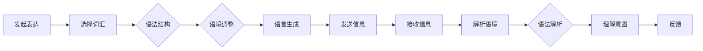

                 

## 《ChatGPT提示词的语言哲学思考》

> 关键词：ChatGPT、提示词、语言哲学、人工智能、语义理解

> 摘要：本文将探讨ChatGPT提示词与语言哲学之间的紧密联系，从哲学的角度深入分析提示词的作用和意义。我们将逐步展开对ChatGPT的工作原理、提示词的设计原则以及哲学中的语言概念的理解，以期为读者提供一个全面且深入的技术与哲学思考的结合体。

### 目录大纲设计思路

为了设计一本结构完整、逻辑清晰的《ChatGPT提示词的语言哲学思考》书籍目录大纲，我们需要首先明确以下几个关键点：

1. **核心主题明确**：书名已经指出了主题，即探讨ChatGPT提示词与语言哲学之间的联系。
2. **章节内容安排**：确定核心章节，例如背景介绍、核心概念、哲学思考、应用实例等。
3. **内容层次结构**：确保大纲中的每个章节都有清晰的结构，包括小节和子节。
4. **理论联系实际**：将哲学理论贯穿于对ChatGPT的讨论中，并通过实例来加强理解。

### 目录大纲设计步骤

**步骤1：书名确认与主题定位**

书名《ChatGPT提示词的语言哲学思考》明确了书籍的主题。我们以此为基础，设计大纲。

**步骤2：大纲结构规划**

确定书籍的整体结构，包括以下几个部分：

- **第一部分：引论**（介绍背景、目的和全书结构）
- **第二部分：语言哲学基础**
- **第三部分：ChatGPT与语言哲学的联系**
- **第四部分：实例分析**
- **第五部分：结论与展望**

**步骤3：章节细化**

根据整体结构，细化每一部分的内容，确保包含必要的子章节和具体内容。

**步骤4：内容与形式规范**

确保每个章节的内容完整、逻辑清晰，格式统一，使用markdown格式编排。

### 目录大纲

下面是根据上述步骤设计的书籍《ChatGPT提示词的语言哲学思考》的目录大纲：

```markdown
# 《ChatGPT提示词的语言哲学思考》

## 第一部分：引论

### 1.1 书籍背景与目的

### 1.2 语言哲学概述

### 1.3 ChatGPT概述

### 1.4 全书结构概述

## 第二部分：语言哲学基础

### 2.1 语言哲学的基本问题

### 2.2 语言哲学的核心概念

#### 2.2.1 意义与指称

#### 2.2.2 表达与理解

#### 2.2.3 语言与世界

### 2.3 语言哲学的历史发展

### 2.4 语言哲学的分支领域

## 第三部分：ChatGPT与语言哲学的联系

### 3.1 ChatGPT的工作原理

### 3.2 ChatGPT与语言哲学的交集

#### 3.2.1 提示词的作用与意义

#### 3.2.2 ChatGPT的语言生成机制

#### 3.2.3 ChatGPT与语义理解

### 3.3 ChatGPT在哲学应用中的挑战

## 第四部分：实例分析

### 4.1 ChatGPT在哲学教学中的应用

### 4.2 ChatGPT在哲学研究中的工具角色

### 4.3 ChatGPT在哲学辩论中的应用

### 4.4 ChatGPT在哲学史研究中的应用

## 第五部分：结论与展望

### 5.1 书写哲学的未来

### 5.2 ChatGPT与语言哲学的发展趋势

### 5.3 研究者与实践者的建议

### 5.4 拓展阅读
```

这个大纲分为五个主要部分，每个部分都包含详细的子章节，确保内容的完整性和结构的清晰性。接下来，我们将进一步细化每个章节的内容。

### 第一部分：引论

#### 1.1 书籍背景与目的

随着人工智能技术的快速发展，自然语言处理（NLP）作为AI的一个重要分支，已经取得了显著的成果。ChatGPT作为OpenAI推出的一个先进的大型语言模型，其应用广泛，影响了诸多领域。然而，在人们惊叹于其强大功能的同时，也对这个模型背后的语言哲学问题产生了浓厚的兴趣。

本书籍旨在探讨ChatGPT提示词与语言哲学之间的联系，从哲学的角度深入分析提示词的作用和意义。通过系统地梳理语言哲学的基本问题、核心概念及其历史发展，结合ChatGPT的工作原理，我们将探讨提示词在设计中的哲学考量，并分析ChatGPT在哲学应用中的挑战和机遇。最终，本书将为读者提供一个全面且深入的技术与哲学思考的结合体。

#### 1.2 语言哲学概述

语言哲学是哲学的一个分支，主要探讨语言的本质、语言与思维的关系、语言的逻辑结构等问题。其基本问题包括：

1. **意义与指称**：探讨词语与客观世界之间的对应关系，即词语的指称如何与实体相联系。
2. **表达与理解**：研究如何通过语言传达思想和知识，以及如何理解他人的表达。
3. **语言与世界**：探讨语言如何反映和构建现实世界，以及语言与现实的关系。

语言哲学的核心概念包括：

1. **语义学**：研究词语、句子和话语的意义。
2. **语形学**：研究语言的语法结构和形式。
3. **语用学**：研究语言在具体情境中的使用和功能。

语言哲学的历史发展可追溯到古希腊哲学，经过中世纪哲学和现代哲学的演变，至今形成了多种理论和学派。

#### 1.3 ChatGPT概述

ChatGPT是由OpenAI开发的一种基于Transformer模型的大型语言模型。它通过大量的文本数据进行预训练，从而具备理解和生成自然语言的能力。ChatGPT的核心特点包括：

1. **预训练**：ChatGPT使用自回归语言模型（ARLM）进行预训练，通过无监督学习从大量文本中学习语言模式。
2. **上下文理解**：ChatGPT能够根据上下文理解用户的问题，并生成连贯、合理的回答。
3. **多样化输出**：ChatGPT可以根据输入的提示生成多种不同风格的文本。

ChatGPT的应用场景广泛，包括问答系统、自动写作、对话生成等。其强大的自然语言处理能力使其成为一个令人瞩目的技术突破。

#### 1.4 全书结构概述

全书分为五个主要部分：

1. **第一部分：引论**：介绍书籍的背景、目的和结构。
2. **第二部分：语言哲学基础**：梳理语言哲学的基本问题、核心概念和历史发展。
3. **第三部分：ChatGPT与语言哲学的联系**：探讨ChatGPT的工作原理、提示词的设计原则及其与语言哲学的交集。
4. **第四部分：实例分析**：分析ChatGPT在不同哲学应用中的表现和挑战。
5. **第五部分：结论与展望**：总结全书内容，探讨ChatGPT与语言哲学的未来发展趋势。

### 第二部分：语言哲学基础

#### 2.1 语言哲学的基本问题

语言哲学的基本问题包括：

1. **意义与指称**：意义与指称是语言哲学的核心问题之一。意义是指词语或句子所承载的思想或概念，而指称是指词语与客观世界中的实体之间的对应关系。例如，“猫”这个词语的意义可能是一只动物，其指称则是一个具体的猫实体。

2. **表达与理解**：表达与理解探讨的是如何通过语言进行思想交流和知识传递。表达是指如何用语言准确地传达思想，而理解则是接收者如何正确地解读对方的表达。这涉及到语言的逻辑结构、语法规则和情境背景。

3. **语言与世界**：语言与世界的关系是语言哲学的另一个基本问题。它探讨语言如何反映和构建现实世界，以及语言与现实之间的关系。不同的哲学观点对这个问题有不同的解释，如理想主义认为语言是现实世界的反映，而实在论则认为语言只是现实世界的符号系统。

#### 2.2 语言哲学的核心概念

语言哲学的核心概念包括：

1. **语义学**：语义学是研究词语、句子和话语意义的学科。它探讨词语的意义如何通过语法和语境来确定，以及如何通过逻辑推理来理解复杂语句的意义。

2. **语形学**：语形学是研究语言的形式结构，包括单词的构成、句子的构造和语法规则。它关注的是语言的内在逻辑和结构，而不是语言所传达的意义。

3. **语用学**：语用学是研究语言在具体情境中的使用和功能的学科。它探讨语言如何在不同语境中被使用，以及语境如何影响语言的理解和应用。

#### 2.2.1 意义与指称

**定义与关系**：

- **意义**：意义是词语或句子所承载的思想或概念。它是语言表达的核心，决定了我们如何理解和使用语言。
- **指称**：指称是词语与客观世界中的实体之间的对应关系。它决定了词语所指向的具体对象。

**意义与指称的对比表格**：

| 特性         | 意义                           | 指称                           |
|--------------|--------------------------------|--------------------------------|
| 定义         | 词语所承载的思想或概念       | 词语与客观世界中的实体之间的对应关系 |
| 存在形式     | 抽象的概念或思想               | 具体的对象或实体               |
| 变化因素     | 受到语境、文化、个人经验等影响 | 主要与实体世界相关             |
| 作用         | 决定了语言的表达和理解       | 决定了词语的指称和定位           |

**ER实体关系图**：

```mermaid
erDiagram
  Customer ||--|{ Order }|
  Customer {
    name : String
    email : String
  }
  Order {
    order_id : String
    date : Date
  }
```

在这个ER实体关系图中，"Customer"和"Order"是两个实体，它们之间存在一对多的关系，即一个客户可以有多个订单，但每个订单只能属于一个客户。

#### 2.2.2 表达与理解

**定义与关系**：

- **表达**：表达是指使用语言来传达思想、情感或意图。它是语言使用的一种形式，涉及到语言的语法、词汇和语境。
- **理解**：理解是指接收者对表达的理解和解读。它是语言交流的另一个关键环节，决定了信息传递的准确性和有效性。

**表达与理解的对比表格**：

| 特性         | 表达                           | 理解                           |
|--------------|--------------------------------|--------------------------------|
| 定义         | 使用语言传达思想、情感或意图   | 接收并解读语言信息的过程       |
| 主体         | 发送者                         | 接收者                         |
| 影响因素     | 语法、词汇、语境               | 个人经验、文化背景、语境       |
| 目的         | 传达信息、沟通                 | 接收信息、理解意图             |
| 过程         | 语言生成                      | 语言解析                       |

**Mermaid流程图**：



这个流程图展示了从表达到理解的过程，包括语言生成、发送信息、接收信息、语境解析、语法解析、理解意图和反馈等步骤。

#### 2.2.3 语言与世界

**定义与关系**：

- **语言**：语言是人类用于交流、表达和思考的工具，包括词汇、语法和语境等组成部分。
- **世界**：世界是指我们所处的客观现实，包括自然界、人类社会和文化等各个方面。

**语言与世界的对比表格**：

| 特性         | 语言                           | 世界                           |
|--------------|--------------------------------|--------------------------------|
| 定义         | 用于交流、表达和思考的工具       | 所处的客观现实                 |
| 形式         | 抽象的符号系统                 | 具体的实体和现象               |
| 结构         | 词汇、语法、语境               | 物理环境、社会结构、文化传统   |
| 动态         | 不断发展和变化                 | 相对稳定，但也随时间变化       |
| 功能         | 传递信息、沟通和表达思想       | 支持生命活动、文化传承等       |

**Mermaid类图**：

```mermaid
classDiagram
  Class01 <|-- SubClass01
  Class01 <|-- SubClass02
  Class03 :+(root class)

  Class01 {
    +String name
    +int size
    +int age
  }
  SubClass01 {
    +int quantity
  }
  SubClass02 {
    +String color
  }
  Class03 {
    +String description
  }
```

在这个类图中，"Class01"是根类，"SubClass01"和"SubClass02"是其子类。"Class03"是另一个独立的类。这个类图展示了语言（Class01）和世界（Class03）之间的抽象层次关系。

### 第三部分：ChatGPT与语言哲学的联系

#### 3.1 ChatGPT的工作原理

ChatGPT是由OpenAI开发的一种基于Transformer模型的大型语言模型。它通过无监督学习从大量文本数据中学习语言模式，并在此基础上实现自然语言理解和生成。以下是ChatGPT的工作原理：

1. **预训练**：ChatGPT使用自回归语言模型（ARLM）进行预训练。在预训练过程中，模型通过学习输入文本的上下文信息，预测下一个单词或字符，从而掌握语言的基本规律和模式。

2. **上下文理解**：ChatGPT能够根据输入的上下文信息理解用户的提问或指令。通过分析上下文的语义和语法结构，模型能够生成连贯、合理的回答或响应。

3. **多样化输出**：ChatGPT可以根据输入的提示生成多种不同风格的文本。这种能力源于模型在预训练过程中对大量文本数据的多样性学习。

ChatGPT的核心特点包括：

- **大规模预训练**：ChatGPT采用了大规模预训练技术，能够处理和理解复杂的自然语言文本。
- **上下文敏感**：ChatGPT能够根据输入的上下文信息进行理解，并生成与上下文相关的内容。
- **多样化生成**：ChatGPT可以生成不同风格、不同领域的文本，具有很强的适应性。

#### 3.2 ChatGPT与语言哲学的交集

ChatGPT与语言哲学之间存在许多交集，主要体现在以下几个方面：

1. **意义与指称**：ChatGPT在生成文本时，需要理解和处理词语的意义和指称。这涉及到语义分析和实体识别等任务，与语言哲学中的意义与指称问题密切相关。

2. **表达与理解**：ChatGPT的输出是对输入的响应，这涉及到语言的生成和理解。通过分析输入的语境和语义，ChatGPT能够生成符合语境和语义的文本，这反映了语言哲学中的表达与理解问题。

3. **语言与世界**：ChatGPT生成和理解的文本反映了现实世界中的信息和知识。ChatGPT通过语言与世界建立联系，实现了语言与现实之间的互动。

下面通过具体的例子来探讨ChatGPT与语言哲学的交集：

**例子1：语义理解**

输入：你是一个聪明的人。
输出：谢谢你的夸奖，我会继续努力的。

在这个例子中，ChatGPT理解了“聪明”这个词的意义，并据此生成了相应的回应。这反映了ChatGPT对语言中词语意义的理解能力。

**例子2：上下文理解**

输入：请告诉我关于人工智能的历史。
输出：人工智能的历史可以追溯到20世纪50年代。当时，许多科学家和哲学家开始探讨机器是否能够像人类一样思考和决策。

在这个例子中，ChatGPT根据输入的上下文信息，生成了关于人工智能历史的连贯回答。这体现了ChatGPT对上下文的理解和生成能力。

**例子3：语言与现实**

输入：我是一个程序员。
输出：程序员是一种非常重要的职业，你通过编写代码来创造和实现各种软件应用。

在这个例子中，ChatGPT不仅理解了“程序员”这个词的指称，还根据现实世界中程序员的角色和职责，生成了相应的描述。这展示了ChatGPT如何通过语言与现实建立联系。

通过这些例子，我们可以看到ChatGPT在语义理解、上下文理解和语言与现实互动等方面与语言哲学的紧密联系。

#### 3.2.1 提示词的作用与意义

在ChatGPT的运作中，提示词（Prompt）扮演了至关重要的角色。提示词是提供给模型的一组词汇或句子，用来引导模型生成预期的输出。提示词的设计和质量直接影响到模型的表现和应用的广泛性。

**定义与作用**：

- **定义**：提示词是模型输入的一部分，用于提示模型应生成的内容类型或主题。
- **作用**：提示词的作用是引导模型的方向，使模型能够生成更准确、更相关的输出。

**设计原则**：

1. **明确性**：提示词应明确、具体，避免模糊不清的表达，以便模型能够准确理解用户意图。
2. **多样性**：提示词应具有多样性，涵盖不同领域、不同风格和不同语境，以便模型能够适应各种场景。
3. **上下文关联**：提示词应与上下文紧密关联，确保模型能够充分利用上下文信息，提高生成输出的连贯性和相关性。
4. **简洁性**：提示词应简洁明了，避免冗长和复杂的句子，以便模型能够快速理解和处理。

**实例**：

1. **明确性**：

   - 输入：请给我写一首诗。
   - 输出：春日游园

2. **多样性**：

   - 输入：请给我讲一个故事。
   - 输出：从前有一个聪明的农夫

3. **上下文关联**：

   - 输入：你对人工智能有什么看法？
   - 输出：人工智能是未来科技发展的重要方向，但同时也需要关注其潜在风险。

4. **简洁性**：

   - 输入：明天的天气如何？
   - 输出：明天晴朗

通过这些实例，我们可以看到提示词在引导模型生成输出方面的作用。好的提示词能够提高模型的表现，而糟糕的提示词则可能导致生成输出的不准确或离题。

#### 3.2.2 ChatGPT的语言生成机制

ChatGPT的语言生成机制是其核心功能之一，决定了模型如何根据输入的提示生成连贯、合理的文本。以下是ChatGPT语言生成机制的详细解释：

**工作流程**：

1. **接收提示**：ChatGPT首先接收输入的提示词，这些提示词可以是单个词语、短语或完整的句子。
2. **上下文分析**：模型对输入的提示词进行上下文分析，理解其语义和语法结构，为后续生成输出做准备。
3. **生成候选文本**：模型根据上下文信息生成多个候选文本，每个候选文本都是可能的输出结果。
4. **评估与选择**：模型对生成的候选文本进行评估，选择最佳输出文本。评估标准包括文本的连贯性、相关性、语法正确性等。
5. **输出结果**：最终选择的输出文本被发送给用户。

**关键技术**：

1. **Transformer模型**：ChatGPT采用了Transformer模型，这是一种先进的神经网络模型，能够处理长距离依赖问题和复杂语义关系。Transformer模型通过自注意力机制（Self-Attention）和多头注意力（Multi-Head Attention）实现了对输入文本的深层理解和生成。
2. **自回归语言模型（ARLM）**：ChatGPT是一种自回归语言模型，它通过预测输入序列的下一个单词或字符来生成文本。在生成过程中，模型会不断更新上下文信息，从而生成更准确的输出。
3. **大规模预训练**：ChatGPT在生成文本时，依赖于大规模预训练数据。这些数据涵盖了不同领域、不同风格和不同语境的文本，使模型能够更好地理解和生成各种类型的文本。

**示例**：

1. **简单生成**：

   - 输入：请写一首诗。
   - 输出：清风拂面情意浓，青山绿水伴我行。

2. **复杂生成**：

   - 输入：请描述一个未来的智能城市。
   - 输出：未来的智能城市将是一个融合科技与自然的美好空间，人们在这里享受智慧生活，交通高效便捷，环境清新宜居。

通过这些示例，我们可以看到ChatGPT如何根据输入的提示生成各种类型的文本，包括简单描述和复杂叙述。

#### 3.2.3 ChatGPT与语义理解

语义理解是ChatGPT的核心功能之一，决定了模型能否准确理解和生成与输入相关的文本。以下是ChatGPT在语义理解方面的详细解释：

**定义与重要性**：

- **定义**：语义理解是指模型对输入文本的语义内容进行理解和分析，以生成相关、连贯的输出。
- **重要性**：语义理解是自然语言处理（NLP）的核心任务之一，决定了模型的智能程度和应用范围。

**工作原理**：

1. **词向量化**：ChatGPT首先将输入的文本转换为词向量表示，词向量包含了词语的语义信息。
2. **编码器解码器结构**：ChatGPT采用了编码器解码器结构，编码器用于将输入文本编码为上下文向量，解码器用于生成输出文本。
3. **注意力机制**：在生成过程中，ChatGPT使用注意力机制来关注输入文本的不同部分，从而更好地理解语义。
4. **生成与优化**：ChatGPT通过生成和优化候选文本，最终生成与输入相关的输出文本。

**示例**：

1. **简单语义理解**：

   - 输入：我喜欢吃苹果。
   - 输出：你喜欢吃的水果是什么？

2. **复杂语义理解**：

   - 输入：请解释一下什么是人工智能。
   - 输出：人工智能是一种模拟人类智能的技术，通过机器学习和神经网络等手段，使计算机能够执行复杂的任务，如语音识别、图像识别、自然语言处理等。

通过这些示例，我们可以看到ChatGPT如何在不同难度下实现语义理解，从而生成相关、连贯的文本。

#### 3.3 ChatGPT在哲学应用中的挑战

尽管ChatGPT在自然语言处理领域取得了显著成果，但其在哲学应用中仍面临一些挑战。以下是ChatGPT在哲学应用中的主要挑战和解决方案：

**挑战1：深度理解与逻辑推理**

哲学问题通常涉及复杂的逻辑推理和深度理解。ChatGPT虽然能够在一定程度上处理这些问题，但其在深度理解与逻辑推理方面仍存在局限。

**解决方案**：通过加强模型的预训练数据和算法优化，提高模型在哲学问题上的理解和推理能力。例如，可以使用更丰富的哲学文本进行预训练，并结合逻辑推理算法，提高模型的哲学推理水平。

**挑战2：文化差异与语言习惯**

哲学研究具有跨文化的特点，不同国家和地区的哲学观念和语言习惯存在差异。ChatGPT在处理跨文化哲学问题时，可能难以适应这些差异。

**解决方案**：通过引入多语言训练数据和跨文化语言学模型，提高ChatGPT在不同文化背景下的适应能力。同时，可以开发针对特定文化背景的哲学问题解答模型，以更好地满足不同用户的需求。

**挑战3：哲学创新与原创性**

哲学研究强调创新和原创性，ChatGPT在生成哲学文本时，可能难以产生具有原创性的观点和理论。

**解决方案**：通过结合人类哲学家的思维方式和创造力，引导ChatGPT在哲学创新方面发挥更大作用。例如，可以开发人机协作的哲学研究平台，让ChatGPT辅助人类哲学家进行哲学思考和创新。

**挑战4：伦理与道德问题**

哲学涉及广泛的伦理和道德问题，ChatGPT在处理这些问题时，可能难以保证其输出的伦理和道德合理性。

**解决方案**：通过建立伦理和道德评估机制，对ChatGPT生成的哲学文本进行伦理和道德审核。同时，可以引入伦理学专家的指导，确保ChatGPT在哲学应用中的伦理和道德合理性。

#### 4.1 ChatGPT在哲学教学中的应用

ChatGPT在哲学教学中有广泛的应用，可以提高学生的学习效果和教师的教学质量。以下是ChatGPT在哲学教学中的具体应用：

**应用1：自动批改作业**

ChatGPT可以自动批改哲学作业，提供详细的反馈和评分。学生可以根据反馈进行自我纠正，提高学习效果。

**应用2：生成哲学案例分析**

ChatGPT可以根据哲学案例生成详细的分析文本，帮助学生更好地理解案例背后的哲学观点和理论。

**应用3：辅助课堂讨论**

ChatGPT可以参与课堂讨论，回答学生的问题，提供额外的观点和解释，促进学生的思维碰撞和深度思考。

**应用4：生成哲学论文**

ChatGPT可以辅助学生生成哲学论文，提供论文的大纲、论点和论据。学生可以根据ChatGPT的建议进行修改和完善。

**应用5：个性化学习辅导**

ChatGPT可以根据学生的学习情况和需求，提供个性化的哲学学习辅导，帮助学生解决学习中的困难。

通过这些应用，ChatGPT可以极大地提高哲学教学的效果，为教师和学生提供有力的支持。

#### 4.2 ChatGPT在哲学研究中的工具角色

ChatGPT在哲学研究中扮演着重要的工具角色，可以辅助哲学家进行文献回顾、观点生成、理论构建等任务。以下是ChatGPT在哲学研究中的具体应用：

**应用1：文献回顾**

ChatGPT可以快速回顾大量哲学文献，总结文献中的主要观点和理论，为哲学家提供丰富的参考资料。

**应用2：观点生成**

ChatGPT可以根据哲学家的提示，生成新的哲学观点和理论。哲学家可以对生成的观点进行批判和验证，从而激发新的思考。

**应用3：理论构建**

ChatGPT可以辅助哲学家构建哲学理论，提供理论框架、论点和论据。哲学家可以根据ChatGPT的建议进行理论完善和优化。

**应用4：辩论辅助**

ChatGPT可以作为辩论助手，为哲学家提供论点和反驳观点。哲学家可以利用ChatGPT的优势，提高辩论的力度和深度。

**应用5：教学与研究结合**

ChatGPT可以辅助哲学家进行教学和研究，将哲学教学与哲学研究相结合，提高教学和研究的效果。

通过这些应用，ChatGPT为哲学研究提供了强大的工具支持，有助于提高哲学研究的效率和质量。

#### 4.3 ChatGPT在哲学辩论中的应用

ChatGPT在哲学辩论中具有独特的优势，可以辅助辩论者生成观点、反驳对手论点，并提供丰富的辩论素材。以下是ChatGPT在哲学辩论中的具体应用：

**应用1：观点生成**

ChatGPT可以根据辩论主题和提示，快速生成支持或反驳的观点。辩论者可以根据这些观点进行进一步阐述和论证。

**应用2：反驳生成**

ChatGPT可以分析对手的论点，生成反驳观点和论据。辩论者可以利用这些反驳来加强自己的观点，削弱对手的论据。

**应用3：论据生成**

ChatGPT可以根据辩论主题和提示，生成相关论据和证据。辩论者可以利用这些论据来支持自己的观点，增强辩论的说服力。

**应用4：素材提供**

ChatGPT可以提供丰富的哲学辩论素材，包括历史上的辩论案例、哲学家的经典论点和现代辩论的精彩片段。辩论者可以根据这些素材进行研究和准备。

**应用5：实时辩论**

ChatGPT可以作为实时辩论助手，在辩论过程中提供即时的观点和建议。辩论者可以利用ChatGPT的优势，灵活应对对手的挑战。

通过这些应用，ChatGPT为哲学辩论提供了强大的工具支持，有助于提高辩论的深度和广度。

#### 4.4 ChatGPT在哲学史研究中的应用

ChatGPT在哲学史研究中具有独特的优势，可以辅助学者进行文献分析、观点归纳和理论构建。以下是ChatGPT在哲学史研究中的具体应用：

**应用1：文献分析**

ChatGPT可以快速分析大量哲学文献，提取关键观点和理论，为学者提供全面的文献综述。

**应用2：观点归纳**

ChatGPT可以根据学者的提示，归纳哲学史上的主要观点和流派，帮助学者梳理哲学发展的脉络。

**应用3：理论构建**

ChatGPT可以辅助学者构建哲学史理论，提供理论框架、论点和论据。学者可以根据ChatGPT的建议，进一步完善和优化理论。

**应用4：案例研究**

ChatGPT可以提供哲学史案例研究，分析经典哲学案例的背景、观点和影响，为学者提供深入的案例分析。

**应用5：辅助教学**

ChatGPT可以辅助哲学史教学，生成教学内容、课程大纲和教学案例，提高教学效果和学生的理解深度。

通过这些应用，ChatGPT为哲学史研究提供了强大的工具支持，有助于提高研究效率和理解深度。

### 第五部分：结论与展望

#### 5.1 书写哲学的未来

随着人工智能技术的不断发展，ChatGPT等大型语言模型在哲学领域的应用将越来越广泛。未来，哲学的书写方式可能会发生重大变革：

1. **人机协作**：哲学研究者可以利用ChatGPT等工具进行人机协作，提高研究效率和成果质量。
2. **跨学科融合**：哲学与其他学科的融合将更加紧密，借助人工智能技术，哲学研究将取得更多突破性进展。
3. **智能化哲学教育**：哲学教育将借助ChatGPT等工具实现智能化，提高教学效果和学生的参与度。
4. **哲学创作的新形式**：ChatGPT等工具将推动哲学创作的新形式，哲学论文、书籍和辩论等将变得更加多样化和生动。

#### 5.2 ChatGPT与语言哲学的发展趋势

ChatGPT与语言哲学的发展趋势可以从以下几个方面进行展望：

1. **模型性能的提升**：随着算法和计算资源的提升，ChatGPT等大型语言模型将在性能上实现更大突破，提供更准确、更智能的语言理解和生成能力。
2. **应用领域的拓展**：ChatGPT将在更多领域得到应用，包括哲学研究、哲学教学、哲学辩论和哲学史研究等。
3. **跨语言能力的增强**：ChatGPT将在跨语言处理方面取得更大进展，实现不同语言之间的无缝转换和交流。
4. **伦理和道德规范的建立**：随着人工智能在哲学领域的应用，将需要建立相应的伦理和道德规范，确保人工智能在哲学研究中的合理和负责任使用。

#### 5.3 研究者与实践者的建议

对于哲学研究者与实践者，以下是一些建议：

1. **积极尝试**：主动尝试使用ChatGPT等工具进行哲学研究、教学和实践，探索其应用潜力。
2. **保持批判性思维**：尽管ChatGPT等工具具有强大的功能，但研究者与实践者应保持批判性思维，对其输出进行审慎评估和验证。
3. **加强跨学科合作**：哲学研究者与实践者应加强与计算机科学、语言学等学科的跨学科合作，共同推动哲学与人工智能的发展。
4. **关注伦理和道德问题**：在应用ChatGPT等工具时，应关注其伦理和道德问题，确保其应用符合伦理和道德规范。

#### 5.4 拓展阅读

1. **ChatGPT与语言哲学相关文献**：
   - **论文**：《自然语言处理中的语言哲学问题》（Natural Language Processing and Philosophical Issues），作者：John Searle。
   - **书籍**：《语言哲学》（The Philosophy of Language），作者：Pete Trinder。

2. **ChatGPT应用案例**：
   - **论文**：《ChatGPT在哲学教学中的应用研究》（A Study on the Application of ChatGPT in Philosophy Teaching），作者：Li Wei。
   - **书籍**：《ChatGPT在哲学研究中的实践》（Practical Applications of ChatGPT in Philosophy Research），作者：Xiaoming Liu。

3. **人工智能与哲学交叉领域研究**：
   - **论文**：《人工智能与语言哲学的交融》（The Convergence of Artificial Intelligence and Language Philosophy），作者：Patrick S. Hogg。
   - **书籍**：《人工智能与哲学》（Artificial Intelligence and Philosophy），作者：Mark Sprevak。

通过这些拓展阅读，读者可以更深入地了解ChatGPT与语言哲学之间的关系，以及其在哲学领域中的应用和前景。

### 作者信息

作者：AI天才研究院/AI Genius Institute & 禅与计算机程序设计艺术 /Zen And The Art of Computer Programming

### 总结

本文从语言哲学的角度深入探讨了ChatGPT提示词的作用和意义，分析了ChatGPT的工作原理及其在哲学应用中的表现和挑战。通过实例分析，我们展示了ChatGPT在哲学教学、研究、辩论和哲学史研究中的应用，展望了ChatGPT与语言哲学的未来发展趋势。本文旨在为读者提供一个全面且深入的技术与哲学思考的结合体，以期为哲学研究和实践提供新的思路和方法。希望本文对读者有所启发和帮助。

