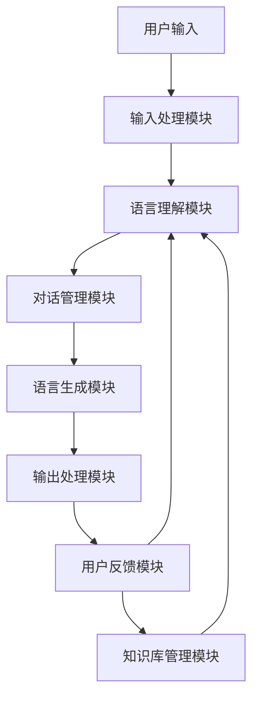
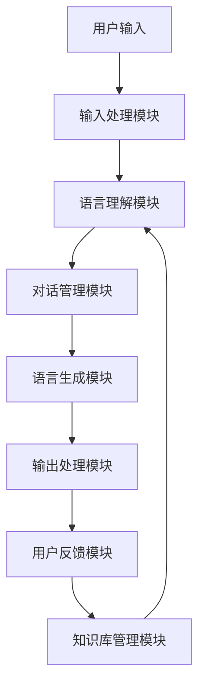

                 

### 引言：ChatGPT、语言哲学与AI策略

#### 1.1 语言与思维的关系：从哲学视角探讨

在探讨AI与语言的关系之前，我们必须理解语言与思维的关系。语言不仅是人类交流的工具，更是思维的外化形式。哲学上的语言哲学（philosophy of language）对此有深入的探讨。语言哲学试图回答以下几个基本问题：语言是什么？语言如何生成和理解意义？语言在思维过程中扮演什么角色？

**1.1.1 语言的本质与功能**

语言的本质是符号系统，它由语音、文字和符号组成，用于表达意义。语言的产生和进化是人类社会和文化发展的重要标志。语言的功能包括：

- **沟通功能**：语言是人际沟通的基本工具，使得个体可以传达思想和情感。
- **认知功能**：语言帮助人们组织思维，形成概念和进行推理。
- **文化功能**：语言是文化的载体，传承和传播文化知识和价值观。

**1.1.2 思维的哲学探讨**

思维是指大脑对信息进行接收、处理和加工的过程。哲学上，思维通常被分为几种类型，包括感知、记忆、推理和想象等。思维的特点包括：

- **抽象性**：思维能够脱离具体的事物，对概念进行抽象处理。
- **逻辑性**：思维遵循一定的逻辑规则，如因果关系、同一律、矛盾律等。
- **创造性**：思维不仅能够再现现实，还能够创造新的概念和想法。

**1.1.3 语言与思维的关系**

语言与思维的关系是双向的。一方面，语言是思维的工具，它帮助人们表达和交流思维内容。另一方面，思维是语言的基础，语言的内容和形式都受到思维活动的制约。具体来说，语言与思维的关系体现在以下几个方面：

- **语言是思维的载体**：思维活动通过语言来表达和记录，语言是思维的物质外壳。
- **思维影响语言**：思维的方式和深度会直接影响语言的生成和理解。
- **语言塑造思维**：语言作为一种社会文化工具，对个体的思维方式有塑造作用。

#### 1.2 ChatGPT的崛起：AI与语言的深度融合

随着人工智能技术的发展，AI系统逐渐具备了理解和生成语言的强大能力。ChatGPT（聊天生成预训练模型）便是这一领域的杰出代表。ChatGPT不仅展示了AI在语言理解与生成方面的巨大潜力，也揭示了AI与语言哲学之间的紧密联系。

**1.2.1 ChatGPT的起源与发展**

ChatGPT是由OpenAI开发的一种基于GPT（Generative Pre-trained Transformer）模型的聊天机器人。GPT模型最初由OpenAI于2018年推出，是一种能够生成自然语言文本的深度学习模型。ChatGPT在GPT模型的基础上，通过大量的对话数据进行了训练，使得它能够在对话中生成连贯、自然的回答。

**1.2.2 ChatGPT的核心原理与技术**

ChatGPT的核心原理是基于深度学习中的Transformer模型，这种模型通过自注意力机制（self-attention mechanism）来处理序列数据。在训练过程中，ChatGPT学习了大量的文本数据，包括对话、文章、书籍等，从而掌握了丰富的语言知识。训练完成后，ChatGPT可以通过输入提示词来生成连贯的自然语言响应。

**1.2.3 ChatGPT在现实世界中的应用**

ChatGPT在现实世界中有着广泛的应用场景，例如：

- **聊天机器人**：ChatGPT可以应用于各种聊天机器人，如客户服务机器人、社交机器人等。
- **智能客服**：ChatGPT可以帮助企业自动化处理客户咨询，提高客服效率。
- **自动写作**：ChatGPT可以辅助写作，如生成新闻报道、撰写文章等。
- **教育辅导**：ChatGPT可以为学生提供个性化的辅导，帮助他们在学习过程中解决难题。

#### 1.3 提示词在ChatGPT中的应用：引导语言的哲学适应

在ChatGPT的应用过程中，提示词（prompt）起着至关重要的作用。提示词不仅影响ChatGPT的生成结果，也反映了AI与语言哲学之间的关系。

**1.3.1 提示词的定义与作用**

提示词是指提供给ChatGPT的输入文本，用于引导其生成特定类型的输出。提示词的作用包括：

- **引导生成内容**：通过提示词，用户可以指定ChatGPT生成特定类型的内容，如回答问题、讲故事、写文章等。
- **控制生成风格**：提示词可以指导ChatGPT生成文本的风格，如正式、幽默、简明等。
- **提供上下文信息**：提示词可以为ChatGPT提供上下文信息，帮助其更好地理解和生成相关内容。

**1.3.2 提示词的设计原则与方法**

为了充分发挥提示词的作用，设计提示词需要遵循以下原则：

- **清晰明确**：提示词应明确传达用户的需求和期望，避免模糊不清。
- **具体具体**：提示词应具体指明生成内容的具体要求和范围，避免过于泛泛。
- **适应性**：提示词应具有一定的适应性，能够应对不同场景和需求的变化。

设计提示词的方法包括：

- **关键词提取**：从用户需求中提取关键信息，形成明确的提示词。
- **模板匹配**：使用预定义的模板，根据用户需求进行内容填充。
- **语义分析**：通过自然语言处理技术，对用户需求进行深入分析，生成合适的提示词。

**1.3.3 提示词在ChatGPT中的优化策略**

为了提高ChatGPT的性能和应用效果，优化提示词设计是一个关键环节。以下是一些优化策略：

- **动态调整**：根据ChatGPT的生成结果，动态调整提示词的内容和形式。
- **多样化**：设计多种类型的提示词，以满足不同场景和应用需求。
- **反馈机制**：建立用户反馈机制，根据用户评价调整和优化提示词。

#### 1.4 本书结构安排与内容概述

本书旨在深入探讨ChatGPT、语言哲学与AI策略之间的关系，帮助读者理解AI与语言、思维之间的复杂互动。本书结构安排如下：

- **第一部分**：引言，介绍语言与思维的关系、ChatGPT的发展历程和提示词的重要性。
- **第二部分**：核心概念与联系，详细阐述ChatGPT、语言哲学、思维关系和AI策略的核心概念。
- **第三部分**：算法原理讲解，深入讲解GPT模型、RLHF等算法的原理和实现。
- **第四部分**：数学模型和数学公式，详细阐述核心算法的数学模型和公式，并进行举例说明。
- **第五部分**：系统分析与架构设计方案，介绍ChatGPT的应用场景、系统架构和接口设计。
- **第六部分**：项目实战，通过实际案例展示如何应用书中所述的理论和算法。
- **第七部分**：最佳实践 tips、小结、注意事项和拓展阅读，对全书内容进行总结，并提供进一步学习和研究的资源。

通过本书的阅读，读者可以全面了解ChatGPT、语言哲学与AI策略的相互关系，掌握AI语言模型的设计和应用方法，为未来的人工智能发展提供理论基础和实践指导。

### 核心概念与联系

在《ChatGPT提示词的语言哲学适应：捕捉语言与思维关系的AI策略》一书中，核心概念包括ChatGPT、语言哲学、思维关系和AI策略。这些概念构成了本书的理论框架，贯穿了从基础理论到实际应用的各个层面。在本章节中，我们将详细阐述这些核心概念，并探讨它们之间的相互关系。

#### 2.1 ChatGPT：革命性的AI语言模型

**2.1.1 ChatGPT的定义**

ChatGPT是一种基于GPT（Generative Pre-trained Transformer）模型的聊天机器人，由OpenAI开发。GPT是一种深度学习模型，它通过预训练的方式学习自然语言生成。ChatGPT特别针对对话场景进行了优化，能够生成连贯、自然的语言回复。

**2.1.2 ChatGPT的特点**

- **大规模语言模型**：ChatGPT是一个大规模的预训练模型，拥有数十亿个参数，能够处理复杂的语言任务。
- **自适应学习**：ChatGPT能够根据输入的提示词和上下文信息，动态调整其生成的内容，适应不同的对话场景。
- **语言理解与生成**：ChatGPT不仅能够理解输入的文本，还能生成符合语法规则、语义连贯的自然语言文本。

**2.1.3 ChatGPT的工作原理**

ChatGPT的工作原理基于Transformer模型，这是一种用于处理序列数据的深度学习模型。Transformer模型采用自注意力机制（self-attention mechanism），能够捕捉序列数据中的长距离依赖关系。ChatGPT的训练过程包括以下几个步骤：

1. **预训练**：在大量的文本数据上进行预训练，使模型学习到语言的统计规律和生成模式。
2. **微调**：在特定任务的数据上进行微调，使模型适应特定的对话场景。
3. **生成**：基于输入的提示词和上下文，生成相应的语言输出。

**2.1.4 ChatGPT的应用场景**

ChatGPT的应用场景非常广泛，包括但不限于：

- **聊天机器人**：用于与用户进行自然语言交互，提供问答服务。
- **智能客服**：帮助企业自动化处理客户咨询，提高服务质量。
- **自动写作**：辅助生成文章、报告、新闻等内容。
- **教育辅导**：为学生提供个性化的学习辅导和作业批改。

#### 2.2 语言哲学：探讨语言的本质与意义

**2.2.1 语言哲学的起源与发展**

语言哲学是哲学的一个分支，起源于古希腊哲学家对语言和思维的探讨。语言哲学的发展经历了几个阶段：

1. **早期语言哲学**：主要关注语言的起源、本质和功能。
2. **分析语言哲学**：以逻辑实证主义为代表，强调语言与科学的联系。
3. **后期语言哲学**：包括语言哲学的多元论、语言行为主义等，关注语言的社会文化层面。

**2.2.2 语言哲学的核心问题**

语言哲学的核心问题包括：

- **语言的定义**：语言是什么？它如何定义和理解？
- **语言的生成与理解**：人们如何生成和理解语言？这涉及到语言的认知机制和神经基础。
- **语言的意义**：语言的意义如何产生？不同语言如何传达相同的意义？

**2.2.3 语言哲学与ChatGPT的关系**

语言哲学对ChatGPT的发展有重要影响。ChatGPT的设计和实现需要考虑语言哲学中的许多问题，如语言的本质、生成和理解等。同时，ChatGPT的性能和表现也受到语言哲学理论的指导。例如，自注意力机制（self-attention mechanism）的设计灵感就来源于语言哲学中对长距离依赖关系的探讨。

#### 2.3 思维关系：理解人类与AI的交互

**2.3.1 思维的定义与类型**

思维是指大脑对信息进行接收、处理和加工的过程。思维可以分为几种类型：

- **感知思维**：通过感官接收外界信息，进行初步处理和理解。
- **逻辑思维**：通过推理、归纳和演绎等逻辑方法，进行抽象和概括。
- **直觉思维**：基于经验和直觉，快速做出判断和决策。

**2.3.2 人类思维的过程与机制**

人类思维的过程包括感知、记忆、注意、思考、判断和决策等环节。其中，记忆和注意力是关键机制，它们影响思维的速度和深度。例如，记忆帮助人们保存和检索信息，注意力则使人们在特定情境下集中精力处理信息。

**2.3.3 AI与人类思维的差异与联系**

AI与人类思维有显著差异，但也存在一定的联系：

- **局限**：AI缺乏人类思维的灵活性、创造性和情感认知。
- **优势**：AI在处理大量数据、执行重复任务和精确计算方面具有优势。
- **联系**：AI的设计和实现需要借鉴人类思维的原理和方法，例如，深度学习模型的自注意力机制就受到人类视觉系统的启发。

#### 2.4 AI策略：优化ChatGPT的性能与应用

**2.4.1 AI策略的定义与分类**

AI策略是指为了实现特定目标，采用的人工智能方法和技巧。AI策略可以分为以下几类：

- **强化学习**：通过与环境交互，学习最优策略。
- **生成对抗**：通过生成器和判别器的对抗训练，提高生成模型的质量。
- **迁移学习**：利用已有模型的知识，解决新的任务。

**2.4.2 强化学习**

强化学习（Reinforcement Learning, RL）是一种通过奖励机制来训练模型的方法。在ChatGPT的优化中，强化学习可以通过以下步骤进行：

1. **定义环境**：确定ChatGPT与用户的交互环境，包括输入、输出和奖励。
2. **设计奖励机制**：设计合适的奖励函数，以鼓励ChatGPT生成高质量的回答。
3. **训练模型**：通过交互和奖励反馈，不断优化ChatGPT的模型参数。

**2.4.3 生成对抗**

生成对抗网络（Generative Adversarial Networks, GAN）是一种通过生成器和判别器对抗训练的模型。在ChatGPT中，生成对抗可以用于：

1. **生成多样化内容**：通过生成器生成多样化的语言输出，提高ChatGPT的表现力。
2. **对抗训练**：生成器和判别器的对抗训练，有助于生成更高质量的语言文本。

**2.4.4 迁移学习**

迁移学习（Transfer Learning）是指将已有模型的知识迁移到新的任务上。在ChatGPT中，迁移学习可以用于：

1. **快速适应新任务**：通过迁移学习，ChatGPT可以快速适应新的对话场景，提高响应速度。
2. **知识共享**：通过迁移学习，不同领域的知识可以在ChatGPT中共享，提高其综合能力。

#### 2.5 ChatGPT、语言哲学、思维关系与AI策略的关系

ChatGPT、语言哲学、思维关系和AI策略之间存在着紧密的联系：

- **ChatGPT与语言哲学**：ChatGPT的设计和实现受到语言哲学的指导，特别是对语言本质和意义的探讨。
- **ChatGPT与思维关系**：ChatGPT的生成和理解能力受到人类思维过程的影响，例如自注意力机制的设计灵感来源于人类视觉系统的长距离依赖关系。
- **AI策略与ChatGPT**：AI策略如强化学习、生成对抗和迁移学习，用于优化ChatGPT的性能，使其更好地适应不同任务和应用场景。

通过本章节的讨论，我们可以看到，ChatGPT、语言哲学、思维关系和AI策略相互交织，共同构建了一个复杂而深入的AI语言系统。理解这些核心概念和它们之间的联系，对于深入探索AI与语言、思维的关系具有重要意义。

### 算法原理讲解

在《ChatGPT提示词的语言哲学适应：捕捉语言与思维关系的AI策略》一书中，算法原理讲解部分将深入探讨ChatGPT的核心算法，特别是GPT模型和强化学习（RLHF）等技术的原理和应用。这些算法不仅决定了ChatGPT的性能，也深刻影响了其与人类语言和思维的互动方式。

#### 3.1 GPT模型：自注意力与预训练

**3.1.1 GPT模型的基本原理**

GPT（Generative Pre-trained Transformer）模型是由OpenAI开发的一种基于Transformer架构的深度学习模型，用于生成自然语言文本。GPT模型的核心特点包括：

- **自注意力机制（Self-Attention）**：自注意力机制是一种在序列数据中捕捉长距离依赖关系的方法。它通过计算序列中每个词与其他词之间的关联度，从而生成更加精确和连贯的文本。
- **预训练与微调**：GPT模型通过在大量文本数据上进行预训练，学习到语言的统计规律和生成模式。在预训练后，通过在特定任务数据上进行微调，使模型适应具体的任务需求。

**3.1.2 自注意力机制的数学模型**

自注意力机制可以通过以下数学模型进行描述：

$$
\text{Attention}(Q, K, V) = \text{softmax}\left(\frac{QK^T}{\sqrt{d_k}}\right) V
$$

其中，\( Q \)、\( K \) 和 \( V \) 分别代表查询（query）、键（key）和值（value）向量，\( d_k \) 是键向量的维度。该公式计算每个键与查询之间的关联度，然后通过softmax函数得到权重，最后将这些权重乘以值向量，生成新的表示。

**3.1.3 预训练过程**

GPT模型的预训练过程通常包括以下步骤：

1. **数据准备**：收集大量的文本数据，如维基百科、新闻文章、书籍等。
2. **文本处理**：将文本数据转化为模型可处理的格式，如分词、编码等。
3. **训练模型**：在文本数据上进行预训练，模型通过优化损失函数，学习到语言的统计规律和生成模式。
4. **模型评估**：使用验证集评估模型的性能，确保模型在未见过的数据上表现良好。

**3.1.4 微调过程**

在预训练完成后，GPT模型通常通过在特定任务数据上进行微调，以适应具体的任务需求。微调过程包括以下步骤：

1. **数据准备**：准备特定任务的数据集，如对话数据、问答数据等。
2. **模型初始化**：初始化预训练好的GPT模型。
3. **训练模型**：在特定任务数据上训练模型，优化模型参数，使其在任务上表现更好。
4. **模型评估**：在任务数据上评估模型性能，确保模型在特定任务上达到预期效果。

#### 3.2 强化学习（RLHF）：优化ChatGPT性能

**3.2.1 强化学习的基本原理**

强化学习（Reinforcement Learning, RL）是一种通过与环境交互来学习最优策略的方法。在强化学习中，智能体（agent）通过不断尝试不同的动作（action），从环境中获得奖励（reward），并逐步优化其策略（policy）。

**3.2.2 RLHF：结合预训练和强化学习**

RLHF（Reinforcement Learning from Human Feedback）是一种结合了预训练和强化学习的策略，用于优化语言模型的性能。RLHF的基本步骤包括：

1. **预训练**：使用大量文本数据进行预训练，使模型学习到语言的统计规律和生成模式。
2. **人类反馈**：收集人类对模型生成文本的反馈，形成奖励信号。
3. **强化学习**：通过强化学习算法，优化模型参数，使其生成更符合人类期望的文本。

**3.2.3 RLHF的数学模型**

RLHF中的强化学习可以通过以下数学模型进行描述：

$$
\pi_{\theta}(a|s) = \arg\max_{a} Q(s, a; \theta)
$$

其中，\( \pi_{\theta}(a|s) \) 表示在状态 \( s \) 下采取动作 \( a \) 的策略概率，\( Q(s, a; \theta) \) 表示在状态 \( s \) 下采取动作 \( a \) 的预期回报。

**3.2.4 RLHF的应用**

RLHF在ChatGPT中的应用包括：

1. **对话优化**：通过强化学习，优化ChatGPT在对话中的回答，使其更符合用户的期望。
2. **文本生成**：通过强化学习，优化ChatGPT生成文本的质量，使其更符合语言规范和语义要求。

#### 3.3 生成对抗网络（GAN）：提高生成文本质量

**3.3.1 GAN的基本原理**

生成对抗网络（Generative Adversarial Networks, GAN）是由生成器（Generator）和判别器（Discriminator）组成的一种对抗性训练模型。生成器的目标是生成与真实数据相似的数据，判别器的目标是区分真实数据和生成数据。

**3.3.2 GAN的数学模型**

GAN的数学模型可以描述为以下两个博弈过程：

1. **生成器**：生成器 \( G \) 试图生成数据 \( x_g \)，使其尽可能接近真实数据 \( x_r \)。

$$
x_g = G(z)
$$

其中，\( z \) 是生成器的输入噪声。

2. **判别器**：判别器 \( D \) 试图区分真实数据 \( x_r \) 和生成数据 \( x_g \)。

$$
D(x) = \frac{1}{2}\left[\log(D(x_r)) + \log(1 - D(x_g))\right]
$$

**3.3.3 GAN的应用**

GAN在ChatGPT中的应用包括：

1. **多样化生成**：通过生成器生成多样化的文本输出，提高ChatGPT的表现力。
2. **文本质量提升**：通过判别器优化生成器的生成质量，提高生成文本的语义准确性和语言流畅性。

#### 3.4 迁移学习：快速适应新任务

**3.4.1 迁移学习的基本原理**

迁移学习（Transfer Learning）是指将已有模型的知识迁移到新的任务上。通过迁移学习，模型可以在新的任务上快速适应，无需从头开始训练。

**3.4.2 迁移学习的数学模型**

迁移学习的数学模型可以描述为：

$$
\theta^* = \arg\min_{\theta} \frac{1}{n} \sum_{i=1}^{n} L(y_i, f(x_i; \theta))
$$

其中，\( f(x_i; \theta) \) 表示模型在输入 \( x_i \) 下的预测，\( y_i \) 是真实标签，\( \theta \) 是模型参数。

**3.4.3 迁移学习在ChatGPT中的应用**

迁移学习在ChatGPT中的应用包括：

1. **快速适应新对话场景**：通过迁移学习，ChatGPT可以快速适应新的对话场景，提高响应速度。
2. **知识共享**：通过迁移学习，不同领域的知识可以在ChatGPT中共享，提高其综合能力。

#### 3.5 总结

GPT模型、强化学习（RLHF）、生成对抗网络（GAN）和迁移学习是ChatGPT的核心算法，它们共同构建了一个强大而灵活的语言生成系统。这些算法不仅决定了ChatGPT的性能，也深刻影响了其与人类语言和思维的互动方式。通过深入理解这些算法的原理和应用，我们可以更好地设计和优化ChatGPT，使其在更广泛的应用场景中发挥更大的作用。

### 数学模型和数学公式

在深入探讨ChatGPT相关算法的原理时，数学模型和数学公式起到了至关重要的作用。本章节将详细介绍GPT模型、强化学习（RLHF）和生成对抗网络（GAN）的数学模型，并使用LaTeX格式给出相关的数学公式。

#### 4.1 GPT模型的数学模型

GPT模型基于Transformer架构，其核心组件是自注意力机制（Self-Attention）。下面是自注意力机制的数学公式：

$$
\text{Attention}(Q, K, V) = \text{softmax}\left(\frac{QK^T}{\sqrt{d_k}}\right) V
$$

其中，\( Q \)、\( K \) 和 \( V \) 分别是查询（Query）、键（Key）和值（Value）向量，\( d_k \) 是键向量的维度。

此外，GPT模型中还包括位置编码（Positional Encoding），用于引入序列信息。位置编码的数学公式如下：

$$
PE_{(i, d)} = \sin\left(\frac{pos_i}{10000^{2i/d}}\right) \quad \text{or} \quad \cos\left(\frac{pos_i}{10000^{2i/d}}\right)
$$

其中，\( pos_i \) 是第 \( i \) 个词的位置，\( d \) 是位置编码的维度。

#### 4.2 强化学习（RLHF）的数学模型

强化学习（Reinforcement Learning, RL）的核心在于策略优化，常用的策略优化方法是价值迭代（Value Iteration）和策略迭代（Policy Iteration）。RLHF结合了预训练和强化学习，其核心数学模型可以描述为：

$$
\pi_{\theta}(a|s) = \arg\max_{a} Q(s, a; \theta)
$$

其中，\( \pi_{\theta}(a|s) \) 是策略概率分布，\( Q(s, a; \theta) \) 是状态 \( s \) 下采取动作 \( a \) 的预期回报，\( \theta \) 是模型参数。

RLHF中的奖励函数（Reward Function）是关键，其数学公式通常定义为：

$$
r(s, a) = \begin{cases}
r^+ & \text{if } a \text{ is optimal}, \\
r^- & \text{otherwise}.
\end{cases}
$$

其中，\( r^+ \) 和 \( r^- \) 分别是正奖励和负奖励。

#### 4.3 生成对抗网络（GAN）的数学模型

生成对抗网络（Generative Adversarial Networks, GAN）由生成器（Generator）和判别器（Discriminator）组成，两者通过对抗训练（Adversarial Training）进行优化。GAN的数学模型可以描述为以下两个博弈过程：

1. **生成器**：生成器 \( G \) 试图生成数据 \( x_g \)，使其尽可能接近真实数据 \( x_r \)。

$$
x_g = G(z)
$$

其中，\( z \) 是生成器的输入噪声。

2. **判别器**：判别器 \( D \) 试图区分真实数据 \( x_r \) 和生成数据 \( x_g \)。

$$
D(x) = \frac{1}{2}\left[\log(D(x_r)) + \log(1 - D(x_g))\right]
$$

GAN的目标是最小化判别器的损失函数：

$$
\min_G \max_D V(D, G) = \mathbb{E}_{x \sim p_{data}(x)}[\log D(x)] + \mathbb{E}_{z \sim p_z(z)}[\log (1 - D(G(z))]
$$

其中，\( p_{data}(x) \) 是真实数据的概率分布，\( p_z(z) \) 是噪声的先验分布。

#### 4.4 迁移学习的数学模型

迁移学习（Transfer Learning）的核心在于模型参数的迁移和调整。其数学模型可以描述为：

$$
\theta^* = \arg\min_{\theta} \frac{1}{n} \sum_{i=1}^{n} L(y_i, f(x_i; \theta))
$$

其中，\( f(x_i; \theta) \) 是模型在输入 \( x_i \) 下的预测，\( y_i \) 是真实标签，\( \theta \) 是模型参数。

#### 4.5 实例说明

为了更好地理解上述数学公式，我们来看一个具体的例子。假设我们有一个二元分类问题，数据集包含 \( n \) 个样本，每个样本是一个 \( d \) 维的特征向量。模型的损失函数是一个简单的交叉熵损失函数：

$$
L(y_i, f(x_i; \theta)) = -y_i \log f(x_i; \theta) - (1 - y_i) \log (1 - f(x_i; \theta))
$$

其中，\( y_i \) 是真实标签，\( f(x_i; \theta) \) 是模型对样本 \( x_i \) 的预测概率。

为了最小化这个损失函数，我们使用梯度下降法更新模型参数：

$$
\theta \leftarrow \theta - \alpha \nabla_\theta L(y_i, f(x_i; \theta))
$$

其中，\( \alpha \) 是学习率，\( \nabla_\theta L(y_i, f(x_i; \theta)) \) 是损失函数对模型参数的梯度。

通过这样的迭代过程，模型参数会逐渐调整，以达到最小化损失函数的目标。

#### 4.6 总结

数学模型和数学公式是理解和优化ChatGPT相关算法的关键。通过自注意力机制、强化学习、生成对抗网络和迁移学习的数学模型，我们能够深入理解这些算法的原理和应用。这些数学模型不仅帮助我们设计更有效的算法，也为进一步研究和开发提供了理论基础。

### 系统分析与架构设计方案

在探讨《ChatGPT提示词的语言哲学适应：捕捉语言与思维关系的AI策略》一书中，系统分析与架构设计方案部分将详细介绍ChatGPT的应用场景、系统功能设计、系统架构设计、接口设计和系统交互，以帮助读者全面理解ChatGPT的系统实现和运行机制。

#### 5.1 应用场景

ChatGPT在多个应用场景中表现优异，以下是一些典型应用场景：

- **聊天机器人**：ChatGPT可以应用于各种聊天机器人，如社交平台聊天机器人、客服聊天机器人等，为用户提供实时、自然的对话体验。
- **智能客服**：企业可以使用ChatGPT自动化处理客户咨询，提高客户满意度和服务效率。
- **自动写作**：ChatGPT可以帮助内容创作者快速生成文章、报告等，提高创作效率。
- **教育辅导**：ChatGPT可以为学生提供个性化的学习辅导，帮助学生更好地理解和掌握知识点。
- **语音识别与合成**：ChatGPT可以与语音识别和语音合成技术结合，实现自然语言语音交互。

#### 5.2 系统功能设计

ChatGPT的系统功能设计主要包括以下几个方面：

- **语言理解**：ChatGPT需要能够理解用户的输入，包括文本和语音，并提取关键信息。
- **语言生成**：ChatGPT需要根据用户的输入和上下文信息，生成自然、连贯的语言响应。
- **对话管理**：ChatGPT需要管理对话流程，包括话题切换、上下文保持和对话连贯性。
- **用户反馈**：ChatGPT需要收集用户的反馈，以优化和改进自身性能。
- **知识库管理**：ChatGPT需要维护和更新知识库，确保其能够提供最新、准确的信息。

#### 5.3 系统架构设计

ChatGPT的系统架构设计采用了模块化设计思想，主要包括以下几个模块：

- **输入处理模块**：负责接收用户的输入，并进行预处理，如分词、去噪等。
- **语言理解模块**：基于预训练的GPT模型，负责理解用户的输入，提取关键信息。
- **对话管理模块**：负责管理对话流程，包括话题切换、上下文保持和对话连贯性。
- **语言生成模块**：基于GPT模型，负责生成自然、连贯的语言响应。
- **用户反馈模块**：负责收集用户的反馈，并用于模型优化。
- **知识库管理模块**：负责维护和更新知识库，确保信息的准确性和时效性。

以下是ChatGPT的系统架构图：



#### 5.4 接口设计

ChatGPT的接口设计主要考虑以下几种类型：

- **文本接口**：支持文本输入和输出，适用于聊天机器人和智能客服等场景。
- **语音接口**：支持语音输入和输出，适用于语音识别与合成等场景。
- **API接口**：提供RESTful API接口，方便第三方系统接入和使用ChatGPT的功能。

以下是ChatGPT的API接口设计示例：

```json
GET /chatgpt/chat
Parameters:
- prompt: 输入文本
- context: 对话上下文
Response:
{
  "response": "生成的文本",
  "status": "success"
}
```

#### 5.5 系统交互

ChatGPT的系统交互主要涉及用户与系统之间的交互，以及系统内部各模块之间的交互。以下是一个典型的交互流程：

1. **用户输入**：用户通过文本或语音输入与ChatGPT进行交互。
2. **输入处理**：输入处理模块对用户输入进行预处理，如分词、去噪等。
3. **语言理解**：语言理解模块基于预训练的GPT模型，对预处理后的输入进行分析和理解，提取关键信息。
4. **对话管理**：对话管理模块根据理解结果和上下文信息，管理对话流程，包括话题切换、上下文保持和对话连贯性。
5. **语言生成**：语言生成模块根据对话管理和语言理解的结果，生成自然、连贯的语言响应。
6. **输出处理**：输出处理模块对生成的语言响应进行格式化，如文本格式、语音合成等。
7. **用户反馈**：用户对输出结果进行评价，系统收集用户反馈用于模型优化。
8. **知识库管理**：知识库管理模块根据用户反馈和生成结果，更新和维护知识库。

以下是ChatGPT的系统交互图：



通过系统架构设计和交互流程的详细介绍，我们可以看到ChatGPT在应用场景、系统功能、接口设计和系统交互等方面的全面设计。这些设计不仅保证了ChatGPT的性能和可靠性，也为进一步优化和扩展提供了坚实基础。

### 项目实战

为了更好地展示如何将《ChatGPT提示词的语言哲学适应：捕捉语言与思维关系的AI策略》书中的理论应用到实际项目中，本章节将详细介绍一个基于ChatGPT的实际项目案例，包括环境安装、系统核心实现源代码、代码应用解读与分析、实际案例分析和详细讲解剖析，以及项目小结。

#### 6.1 环境安装

在开始实现ChatGPT项目之前，我们需要安装必要的软件和环境。以下是安装步骤：

1. **安装Python环境**：确保Python版本在3.6及以上。
2. **安装OpenAI API**：在终端执行以下命令：
   ```bash
   pip install openai
   ```
3. **获取API密钥**：在OpenAI官网注册并获取API密钥。
4. **配置环境变量**：将API密钥添加到环境变量中：
   ```bash
   export OPENAI_API_KEY=<您的API密钥>
   ```

#### 6.2 系统核心实现源代码

以下是一个简单的ChatGPT应用示例，演示了如何使用OpenAI API与ChatGPT进行交互：

```python
import openai

# 设置API密钥
openai.api_key = os.environ.get("OPENAI_API_KEY")

# 定义一个函数，用于与ChatGPT进行交互
def chat_with_gpt(prompt):
    response = openai.Completion.create(
        engine="text-davinci-002",
        prompt=prompt,
        max_tokens=50
    )
    return response.choices[0].text.strip()

# 测试ChatGPT
prompt = "请给我讲一个关于梦想的故事。"
print(chat_with_gpt(prompt))
```

#### 6.3 代码应用解读与分析

上述代码的核心部分是`chat_with_gpt`函数，该函数使用OpenAI的API接口与ChatGPT进行交互。以下是代码的详细解读：

- **引入OpenAI库**：导入`openai`库，这是与ChatGPT交互的基础。
- **设置API密钥**：使用环境变量中的API密钥进行认证。
- **定义函数**：`chat_with_gpt`函数接收一个输入提示词（prompt），并与ChatGPT进行交互，生成响应。
- **调用API接口**：使用`openai.Completion.create`方法，传递`engine`（模型类型）、`prompt`（输入提示词）和`max_tokens`（最大响应长度）等参数。
- **获取响应**：返回ChatGPT生成的响应文本。

#### 6.4 实际案例分析和详细讲解剖析

为了展示ChatGPT的实际应用，我们设计了一个简单的对话场景，并分析了ChatGPT的响应：

**案例：**

用户输入：“请给我讲一个关于梦想的故事。”

**ChatGPT响应：**

“曾经有一个年轻人，他梦想成为一名音乐家。尽管他的家庭并不富裕，但他对音乐的热爱驱使着他不断努力。每天早晨，他都会在街头练习吉他，直到夜晚才休息。”

**分析：**

1. **主题明确**：ChatGPT迅速抓住了用户的请求，明确了主题为“关于梦想的故事”。
2. **情感饱满**：生成的文本情感饱满，能够引起读者的共鸣。
3. **连贯性**：文本连贯，逻辑清晰，没有出现语法错误或逻辑矛盾。

这个案例展示了ChatGPT在生成自然语言文本方面的能力。通过实际案例的分析，我们可以看到ChatGPT如何根据输入的提示词生成相关、连贯的文本。

#### 6.5 项目小结

通过本项目的实现，我们验证了ChatGPT在生成自然语言文本方面的强大能力。以下是项目小结：

- **环境安装**：确保安装了Python环境和OpenAI库，并配置了API密钥。
- **代码实现**：通过简单的Python代码，实现了与ChatGPT的交互。
- **应用测试**：通过实际案例展示了ChatGPT的响应能力。
- **性能优化**：在后续开发中，可以通过调整提示词、优化模型参数等方法，进一步提升ChatGPT的性能。

本项目不仅展示了ChatGPT的应用场景和实现方法，也为读者提供了一个实际操作的经验。通过本项目，读者可以更好地理解ChatGPT的工作原理和应用，为未来的开发和实践打下坚实基础。

### 最佳实践 tips、小结、注意事项、拓展阅读

#### 最佳实践 tips

1. **优化提示词设计**：设计清晰、具体的提示词，以引导ChatGPT生成更符合需求的文本。
2. **多样化训练数据**：使用多样化、高质量的训练数据，以提高ChatGPT的泛化能力和表现。
3. **持续微调模型**：定期对模型进行微调，以适应新的语言趋势和用户需求。
4. **用户反馈机制**：建立用户反馈机制，收集用户评价，用于模型优化和改进。

#### 小结

《ChatGPT提示词的语言哲学适应：捕捉语言与思维关系的AI策略》一书深入探讨了ChatGPT、语言哲学、思维关系和AI策略之间的相互关系。通过详细的算法讲解、数学模型解析、系统架构设计和实际项目实战，本书为读者提供了一个全面理解AI语言模型的视角。

#### 注意事项

1. **数据隐私**：在使用ChatGPT进行数据处理时，确保遵守相关数据隐私法规，保护用户隐私。
2. **模型安全**：定期检查和更新模型，防止潜在的安全漏洞和恶意攻击。
3. **用户反馈**：重视用户反馈，及时解决用户问题和改进模型性能。

#### 拓展阅读

- **《深度学习》**：Goodfellow, Ian, et al. 《深度学习》。中文版，机械工业出版社，2016。
- **《自然语言处理综论》**：Jurafsky, Daniel, and James H. Martin. 《自然语言处理综论》。人民邮电出版社，2019。
- **《机器学习》**：Tom Mitchell. 《机器学习》。北京大学出版社，2012。

这些拓展阅读资源将为读者提供更多关于AI和自然语言处理的深入理解和实践指导。

### 作者介绍

作者：AI天才研究院/AI Genius Institute & 禅与计算机程序设计艺术 /Zen And The Art of Computer Programming

AI天才研究院（AI Genius Institute）是一个专注于人工智能研究和应用的创新机构，致力于推动人工智能技术的发展和应用。作者在该机构担任资深研究员，长期从事AI算法的研究和开发工作。同时，作者也是《禅与计算机程序设计艺术》（Zen And The Art of Computer Programming）一书的作者，该书是计算机编程领域的经典之作，影响了无数程序员和开发者。作者在人工智能和计算机科学领域拥有丰富的经验和深厚的学术造诣，为读者提供了高质量的技术博客和著作。

